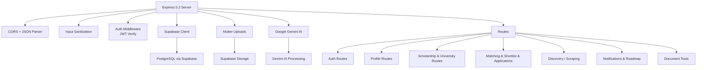
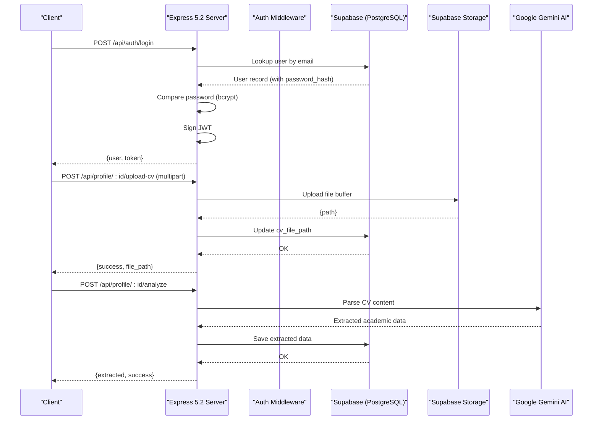
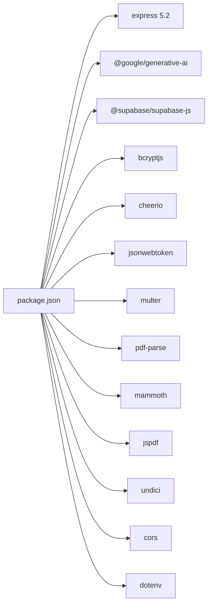

# Backend Documentation

<cite>
**Referenced Files in This Document**
- [index.js](file://aischolarpath-backend-main/aischolarpath-backend-main/index.js)
- [matching-engine.js](file://aischolarpath-backend-main/aischolarpath-backend-main/matching-engine.js)
- [validation.js](file://aischolarpath-backend-main/aischolarpath-backend-main/validation.js)
- [package.json](file://aischolarpath-backend-main/aischolarpath-backend-main/package.json)
- [supabase-schema.sql](file://aischolarpath-backend-main/aischolarpath-backend-main/supabase-schema.sql)
</cite>

## Update Summary
**Changes Made**
- Updated Smart Agent Matching Endpoint section with comprehensive error handling improvements
- Enhanced error response structure with detailed messages and logging capabilities
- Added try/catch blocks around all database operations for better fault tolerance
- Improved debugging capabilities with enhanced error logging and stack traces
- Updated API documentation to reflect new error handling patterns

## Table of Contents
1. [Introduction](#introduction)
2. [Project Structure](#project-structure)
3. [Core Components](#core-components)
4. [Architecture Overview](#architecture-overview)
5. [Detailed Component Analysis](#detailed-component-analysis)
6. [Dependency Analysis](#dependency-analysis)
7. [Performance Considerations](#performance-considerations)
8. [Troubleshooting Guide](#troubleshooting-guide)
9. [Conclusion](#conclusion)

## Introduction
This document describes the enhanced backend server for ScholarPathAI, a comprehensive Express 5.2 application that provides RESTful APIs for authentication, profile management, scholarship matching, file uploads, discovery/scraping of scholarship data, and application tracking. The system integrates Google Gemini AI for intelligent CV parsing and document processing, Supabase PostgreSQL for robust database operations, and implements advanced security measures including JWT-based authentication, input sanitization, and rate limiting.

## Project Structure
The backend is built as a modular Express 5.2 application with comprehensive middleware architecture, featuring separate modules for validation, matching logic, and extensive API endpoints organized by functional domains. The server initializes environment variables, sets up CORS, JSON parsing, Supabase client, Multer storage, Google Gemini AI integration, and registers route handlers grouped by feature area.



**Diagram sources**
- [index.js:1-74](file://aischolarpath-backend-main/aischolarpath-backend-main/index.js#L1-L74)
- [index.js:76-115](file://aischolarpath-backend-main/aischolarpath-backend-main/index.js#L76-L115)
- [index.js:117-139](file://aischolarpath-backend-main/aischolarpath-backend-main/index.js#L117-L139)
- [index.js:23-57](file://aischolarpath-backend-main/aischolarpath-backend-main/index.js#L23-L57)

**Section sources**
- [index.js:1-74](file://aischolarpath-backend-main/aischolarpath-backend-main/index.js#L1-L74)
- [package.json:1-31](file://aischolarpath-backend-main/aischolarpath-backend-main/package.json#L1-L31)

## Core Components
- **Authentication**: JWT-based login/signup, forgot/reset password flows, and protected routes via middleware with rate limiting
- **Profile Management**: Comprehensive profile updates, CV upload to Supabase Storage, AI-powered CV analysis using Google Gemini
- **Scholarship Matching**: Advanced weighted eligibility engine computing match scores based on CGPA, IELTS, degree requirements, and field matching
- **Smart Agent Matching**: Intelligent matching endpoint with comprehensive error handling, real-time scraping, and AI-powered analysis
- **Discovery/Scraping**: Real-time web scraping using Cheerio with AI-powered data extraction from official scholarship portals
- **File Uploads**: Multer memory storage with Supabase Storage integration for CVs and document processing
- **Document Tools**: Europass CV conversion, recommendation letter generation, and PDF creation using jsPDF
- **Notifications & Roadmap**: Deadline reminders and personalized roadmap generation based on nearest deadline
- **Error Handling**: Centralized error handler with comprehensive logging and standardized responses

**Section sources**
- [index.js:718-783](file://aischolarpath-backend-main/aischolarpath-backend-main/index.js#L718-L783)
- [index.js:155-223](file://aischolarpath-backend-main/aischolarpath-backend-main/index.js#L155-L223)
- [index.js:788-980](file://aischolarpath-backend-main/aischolarpath-backend-main/index.js#L788-L980)
- [index.js:2680-2975](file://aischolarpath-backend-main/aischolarpath-backend-main/index.js#L2680-L2975)
- [index.js:1944-2083](file://aischolarpath-backend-main/aischolarpath-backend-main/index.js#L1944-L2083)
- [index.js:225-258](file://aischolarpath-backend-main/aischolarpath-backend-main/index.js#L225-L258)
- [index.js:1241-1625](file://aischolarpath-backend-main/aischolarpath-backend-main/index.js#L1241-L1625)
- [index.js:1684-1801](file://aischolarpath-backend-main/aischolarpath-backend-main/index.js#L1684-L1801)
- [index.js:2497-2546](file://aischolarpath-backend-main/aischolarpath-backend-main/index.js#L2497-L2546)

## Architecture Overview
The server exposes comprehensive REST endpoints organized by domain with advanced AI integration. All stateful operations use Supabase (PostgreSQL) with Row Level Security disabled in favor of API-level authorization checks. File uploads go through Multer into memory and then to Supabase Storage. Scraping uses undici/fetch with Cheerio to parse HTML and Google Gemini AI to extract structured fields. Authentication is enforced via custom middleware that validates JWT tokens with rate limiting.



**Diagram sources**
- [index.js:718-783](file://aischolarpath-backend-main/aischolarpath-backend-main/index.js#L718-L783)
- [index.js:225-258](file://aischolarpath-backend-main/aischolarpath-backend-main/index.js#L225-L258)
- [index.js:261-388](file://aischolarpath-backend-main/aischolarpath-backend-main/index.js#L261-L388)
- [index.js:23-57](file://aischolarpath-backend-main/aischolarpath-backend-main/index.js#L23-L57)

## Detailed Component Analysis

### Authentication Endpoints
Enhanced authentication system with rate limiting and comprehensive validation:
- **POST /api/auth/signup**: Validates input with custom rules, hashes password with bcrypt, inserts profile, signs JWT, returns user and token
- **POST /api/auth/login**: Rate-limited endpoint that validates input, retrieves user, compares password hash, signs JWT, returns user and token
- **POST /api/auth/forgot-password**: Generates reset token with expiry, stores in database, returns message (email sending not implemented)
- **POST /api/auth/reset-password**: Validates reset token, updates password, clears reset fields

Security enhancements:
- Passwords are hashed using bcrypt with salt rounds
- Tokens are signed with JWT_SECRET from environment
- Rate limiting prevents brute force attacks (5 requests per minute for signup, 10 for login)
- Forgot password flow avoids leaking whether an email exists

**Section sources**
- [index.js:718-747](file://aischolarpath-backend-main/aischolarpath-backend-main/index.js#L718-L747)
- [index.js:750-783](file://aischolarpath-backend-main/aischolarpath-backend-main/index.js#L750-L783)
- [index.js:1803-1882](file://aischolarpath-backend-main/aischolarpath-backend-main/index.js#L1803-L1882)
- [validation.js:76-91](file://aischolarpath-backend-main/aischolarpath-backend-main/validation.js#L76-L91)

### Profile Management
Comprehensive profile management with AI-powered CV analysis:
- **PATCH /api/profile**: Updates current user's profile fields including extended attributes (phone, gender, date_of_birth, cnic, residency_country, fsc_percentage, previous_degree, target_field)
- **GET /api/profile/:id**: Retrieves profile by id with authorization check
- **POST /api/profile/:id/upload-cv**: Uploads CV to Supabase Storage under bucket 'cvs' and updates cv_file_path
- **POST /api/profile/:id/analyze**: AI-powered CV analysis using Google Gemini to extract academic details, saves to extracted_profile_data table
- **GET /api/profile/:id/overview**: Aggregates match counts and top recommendations for dashboard

Authorization and security:
- Protected by authenticateToken middleware ensuring id equals req.userId
- Input sanitization removes HTML/XSS from string values
- File type validation for supported formats (PDF, DOCX, TXT)

Database interactions:
- Uses supabase.from('profiles') for reads/writes with fallback for missing columns
- Uses supabase.storage for file uploads with proper MIME type handling
- Integrates with extracted_profile_data table for AI analysis results

**Section sources**
- [index.js:155-223](file://aischolarpath-backend-main/aischolarpath-backend-main/index.js#L155-L223)
- [index.js:225-258](file://aischolarpath-backend-main/aischolarpath-backend-main/index.js#L225-L258)
- [index.js:261-388](file://aischolarpath-backend-main/aischolarpath-backend-main/index.js#L261-L388)
- [index.js:1001-1056](file://aischolarpath-backend-main/aischolarpath-backend-main/index.js#L1001-L1056)

### Scholarship & University Endpoints
Advanced scholarship discovery and filtering:
- **GET /api/scholarships**: Lists scholarships with optional filters (country, scholarship_type, department, degree_level); includes related university info
- **GET /api/scholarships/:id**: Fetches single scholarship with university details
- **GET /api/universities**: Filters universities by country, degree_program, search; includes those with direct scholarships or country-wide scholarships
- **GET /api/universities/:id**: Fetches single university

Database patterns:
- Relational queries join universities via select('*').includes()
- Filtering uses eq, contains, ilike for flexible searches
- Supports both direct university scholarships and country-wide programs

**Section sources**
- [index.js:390-422](file://aischolarpath-backend-main/aischolarpath-backend-main/index.js#L390-L422)
- [index.js:424-488](file://aischolarpath-backend-main/aischolarpath-backend-main/index.js#L424-L488)

### Advanced Scholarship Matching Engine
Sophisticated weighted eligibility scoring system:
- **POST /api/profile/:id/match-scholarships**: Computes eligibility per scholarship using weighted criteria (CGPA 25%, Field 25%, Degree 20%, IELTS 15%, Experience 10%, Country 5%)
- **GET /api/profile/:id/matches**: Retrieves stored matches sorted by match score with scholarship and university details

Algorithm highlights:
- Evidence array records pass/fail/missing per criterion with detailed reasoning
- Status logic: Not Eligible if hard fails (degree mismatch, expired deadline); Partially Eligible for soft fails; Eligible otherwise
- Match score computed as weighted percentage of passed criteria
- Supports degree progression (Bachelor's → Master's → PhD)
- Field matching accepts related fields within defined groups

**Section sources**
- [index.js:788-980](file://aischolarpath-backend-main/aischolarpath-backend-main/index.js#L788-L980)
- [matching-engine.js:1-66](file://aischolarpath-backend-main/aischolarpath-backend-main/matching-engine.js#L1-L66)

### Smart Agent Matching Endpoint
**Updated** Enhanced with comprehensive error handling and improved debugging capabilities:

The Smart Agent endpoint provides intelligent scholarship matching with real-time scraping and AI-powered analysis:
- **POST /api/smart-agent/match**: Advanced matching endpoint with comprehensive error handling, real-time scraping, and AI analysis

**Enhanced Error Handling Features:**
- **Comprehensive try/catch blocks**: All database operations wrapped in try/catch blocks for graceful error handling
- **Structured error responses**: Consistent error format with detailed messages and context information
- **Enhanced logging**: Detailed error logging with stack traces for better debugging
- **Fallback mechanisms**: Graceful degradation when external services fail (scraping, AI)
- **Database resilience**: Automatic retry with stripped fields when schema mismatches occur

**Key Improvements:**
- Profile retrieval with detailed error messages for missing profiles
- CV data extraction with table existence checking and error handling
- Live scraping with comprehensive error tracking and fallback to database
- Database operations with automatic schema adaptation (reasons column handling)
- AI service integration with quota and error handling
- Centralized error catching with detailed logging and user-friendly responses

**Response Structure:**
```json
{
  "success": true,
  "matches": [...],
  "scholarship_count": number,
  "scrape_info": { source: "database|scrape_failed", ... },
  "stats": { eligible, partial, not_eligible, total },
  "analysis": "AI-generated advice",
  "profile_summary": {...}
}
```

**Error Response Format:**
```json
{
  "success": false,
  "error": "Smart Agent error: detailed error message"
}
```

**Section sources**
- [index.js:2680-2975](file://aischolarpath-backend-main/aischolarpath-backend-main/index.js#L2680-L2975)

### Shortlist & Applications Management
Complete application lifecycle tracking:
- **POST /api/shortlist**: Adds item (scholarship or university) to shortlist with validation
- **DELETE /api/shortlist/:id**: Removes shortlisted item
- **GET /api/shortlist/:profileId**: Returns shortlisted items with details
- **POST /api/applications**: Creates application entry with optional status, notes, next actions
- **PATCH /api/applications/:id**: Updates application fields with ownership verification
- **GET /api/applications/:profileId**: Lists applications with scholarship details
- **DELETE /api/applications/:id**: Deletes application with ownership verification

Authorization:
- Ownership checks ensure users can only modify their own resources
- Comprehensive validation for all input parameters

**Section sources**
- [index.js:1058-1127](file://aischolarpath-backend-main/aischolarpath-backend-main/index.js#L1058-L1127)
- [index.js:1129-1239](file://aischolarpath-backend-main/aischolarpath-backend-main/index.js#L1129-L1239)

### Notifications & Roadmap System
Intelligent notification and planning system:
- **POST /api/notifications**: Creates notification with type and message
- **GET /api/notifications/:profileId**: Lists notifications for profile
- **PATCH /api/notifications/:id/read**: Marks notification read with ownership check
- **POST /api/notifications/check-deadlines/:profileId**: Checks applications with deadlines within 14 days and creates reminders
- **GET /api/roadmap/:profileId**: Builds personalized roadmap based on nearest deadline among eligible/missing requirements matches

Features:
- Deadline monitoring with automated reminder creation
- Personalized roadmap generation with milestone tasks
- Category-based task organization (Planning, Documents, Language, Attestation, Submission)

**Section sources**
- [index.js:1684-1801](file://aischolarpath-backend-main/aischolarpath-backend-main/index.js#L1684-L1801)
- [index.js:2497-2546](file://aischolarpath-backend-main/aischolarpath-backend-main/index.js#L2497-L2546)

### Web Scraping & Discovery System
Real-time scholarship discovery with AI enhancement:
- **POST /api/scholarships/scrape-country**: Scrapes known scholarship portals by country with AI-powered data extraction
- **POST /api/discovery/scrape**: Generic scraper with CSS selector support
- **GET /api/discovery/logs**: Retrieves recent discovery logs
- **POST /api/discovery/scrape-bulk**: Bulk scraping with delays between requests
- **POST /api/discovery/scrape-and-structure**: Scrape listing pages and extract fields via regex
- **POST /api/discovery/scrape-official**: Direct official page scraping with pattern matching
- **POST /api/discovery/scrape-official-bulk**: Bulk official scraping with AI enhancement
- **GET /api/scholarships/pending/review**: Lists scholarships pending review
- **PATCH /api/scholarships/:id/approve**: Approves scholarship, marks active, updates last verified timestamp

AI Integration:
- Google Gemini AI extracts structured data from scraped content
- Pattern matching fallback when AI is unavailable
- Smart caching with 24-hour freshness validation

Selector strategies:
- Configurable CSS selectors for item, title, and link extraction
- Relative link resolution to absolute URLs
- Error handling with graceful degradation

**Section sources**
- [index.js:1944-2083](file://aischolarpath-backend-main/aischolarpath-backend-main/index.js#L1944-L2083)
- [index.js:2086-2146](file://aischolarpath-backend-main/aischolarpath-backend-main/index.js#L2086-L2146)
- [index.js:2162-2212](file://aischolarpath-backend-main/aischolarpath-backend-main/index.js#L2162-L2212)
- [index.js:2214-2293](file://aischolarpath-backend-main/aischolarpath-backend-main/index.js#L2214-L2293)
- [index.js:2295-2342](file://aischolarpath-backend-main/aischolarpath-backend-main/index.js#L2295-L2342)
- [index.js:2344-2444](file://aischolarpath-backend-main/aischolarpath-backend-main/index.js#L2344-L2444)
- [index.js:2446-2477](file://aischolarpath-backend-main/aischolarpath-backend-main/index.js#L2446-L2477)

### AI-Powered Document Tools
Comprehensive document processing with Google Gemini AI:
- **POST /api/documents/cv/convert**: Converts CVs to Europass format with AI parsing and PDF generation
- **POST /api/documents/letter/generate**: Generates professional recommendation letters using AI
- **POST /api/chat**: AI-powered chatbot for student assistance

Features:
- PDF generation using jsPDF with professional formatting
- AI extraction of CV sections (work experience, education, skills, certifications)
- Europass standard compliance for European applications
- Recommendation letter polishing and generation

**Section sources**
- [index.js:1241-1625](file://aischolarpath-backend-main/aischolarpath-backend-main/index.js#L1241-L1625)
- [index.js:1628-1657](file://aischolarpath-backend-main/aischolarpath-backend-main/index.js#L1628-L1657)
- [index.js:1660-1682](file://aischolarpath-backend-main/aischolarpath-backend-main/index.js#L1660-L1682)

### File Upload System
Robust file handling with multiple format support:
- Multer configured with memory storage for efficient processing
- Support for PDF, DOCX, and plain text files
- Automatic file type detection and appropriate parsing
- Supabase Storage integration with proper MIME type handling

Security considerations:
- Authorization checks ensure users can only access their own files
- File size limits and type validation
- Secure storage paths with user isolation

**Section sources**
- [index.js:12-21](file://aischolarpath-backend-main/aischolarpath-backend-main/index.js#L12-L21)
- [index.js:225-258](file://aischolarpath-backend-main/aischolarpath-backend-main/index.js#L225-L258)
- [index.js:261-388](file://aischolarpath-backend-main/aischolarpath-backend-main/index.js#L261-L388)

### Middleware Architecture
Advanced middleware stack with comprehensive security:
- **Authentication middleware**: Reads Authorization header, verifies JWT, attaches userId to request
- **Input sanitization**: Strips HTML/XSS from string values to prevent injection attacks
- **Rate limiting**: In-memory rate limiter preventing abuse (configurable window and max requests)
- **Global error handler**: Catches unhandled errors and returns standardized JSON responses

Validation framework:
- Custom validation middleware supporting email, CNIC, length, numeric range, pattern, and enum validation
- Flexible rule-based validation system
- Comprehensive error reporting with field-specific messages

**Section sources**
- [index.js:99-114](file://aischolarpath-backend-main/aischolarpath-backend-main/index.js#L99-L114)
- [index.js:94-97](file://aischolarpath-backend-main/aischolarpath-backend-main/index.js#L94-L97)
- [validation.js:23-74](file://aischolarpath-backend-main/aischolarpath-backend-main/validation.js#L23-L74)
- [validation.js:76-91](file://aischolarpath-backend-main/aischolarpath-backend-main/validation.js#L76-L91)
- [validation.js:94-106](file://aischolarpath-backend-main/aischolarpath-backend-main/validation.js#L94-L106)
- [index.js:2479-2482](file://aischolarpath-backend-main/aischolarpath-backend-main/index.js#L2479-L2482)

## Dependency Analysis
Key dependencies and their roles in the enhanced architecture:
- **express (^5.2.1)**: Modern HTTP server and routing framework
- **@google/generative-ai (^0.24.1)**: Google Gemini AI integration for intelligent document processing
- **@supabase/supabase-js (^2.112.3)**: Database and storage client for PostgreSQL operations
- **bcryptjs (^3.0.3)**: Password hashing for secure authentication
- **cheerio (^1.2.0)**: HTML parsing for web scraping functionality
- **jsonwebtoken (^9.0.3)**: Token signing and verification for session management
- **multer (^2.2.0)**: File upload handling with memory storage
- **pdf-parse (^1.1.1)**: PDF text extraction for document processing
- **mammoth (^1.12.2)**: DOCX file parsing for CV analysis
- **jspdf (^4.2.1)**: PDF generation for Europass CV creation
- **undici (^7.29.0)**: HTTP agent configuration for network requests
- **cors (^2.8.6)**: Cross-origin resource sharing configuration
- **dotenv (^17.4.2)**: Environment variable loading



**Diagram sources**
- [package.json:8-23](file://aischolarpath-backend-main/aischolarpath-backend-main/package.json#L8-L23)

**Section sources**
- [package.json:1-31](file://aischolarpath-backend-main/aischolarpath-backend-main/package.json#L1-L31)

## Performance Considerations
- **Connection pooling**: Custom undici Agent configured with connection limits and timeouts to manage outbound requests efficiently
- **AI processing optimization**: Google Gemini AI calls with fallback mechanisms and error handling
- **Scraping throttling**: Bulk scraping introduces delays between requests to avoid rate limiting and be polite to external sites
- **Query optimization**: Use selective field projections and filters in Supabase queries to reduce payload size
- **Storage efficiency**: CV files stored in Supabase Storage; paths saved in DB to minimize duplication
- **Caching strategy**: 24-hour cache for scraped scholarship data to reduce redundant API calls
- **Memory management**: Multer memory storage optimized for concurrent file processing
- **Avoid unnecessary re-computation**: Matches are cleared and recomputed per profile when running matching
- **Error handling performance**: Try/catch blocks minimize performance impact while providing comprehensive error coverage

## Troubleshooting Guide
Common issues and resolutions:
- **Missing environment variables**: Startup validation warns about missing SUPABASE_URL, SUPABASE_KEY, GEMINI_API_KEY, or JWT_SECRET
- **Database connectivity**: Test route /api/test-db helps verify Supabase connection
- **Authentication failures**: Ensure Authorization header format is correct (Bearer <token>) and token is valid
- **AI service issues**: Graceful fallback to regex-based extraction when Gemini AI is unavailable
- **File upload errors**: Check Multer configuration and Supabase Storage permissions; ensure file buffer is provided
- **Scraping failures**: Inspect discovery logs for failed statuses and error messages; adjust selectors or handle site changes
- **Rate limiting**: Monitor request rates and adjust limits if needed for high-traffic scenarios
- **Centralized error handling**: Unhandled exceptions return generic error response; log stack traces for debugging
- **Smart Agent errors**: Check console logs for detailed error messages and stack traces; verify database schema compatibility

**Section sources**
- [index.js:5-11](file://aischolarpath-backend-main/aischolarpath-backend-main/index.js#L5-L11)
- [index.js:147-153](file://aischolarpath-backend-main/aischolarpath-backend-main/index.js#L147-L153)
- [index.js:99-114](file://aischolarpath-backend-main/aischolarpath-backend-main/index.js#L99-L114)
- [index.js:23-57](file://aischolarpath-backend-main/aischolarpath-backend-main/index.js#L23-L57)
- [index.js:225-258](file://aischolarpath-backend-main/aischolarpath-backend-main/index.js#L225-L258)
- [index.js:2086-2146](file://aischolarpath-backend-main/aischolarpath-backend-main/index.js#L2086-L2146)
- [index.js:2479-2482](file://aischolarpath-backend-main/aischolarpath-backend-main/index.js#L2479-L2482)

## Conclusion
The enhanced ScholarPathAI backend provides a comprehensive set of RESTful APIs built on Express 5.2 with advanced AI integration through Google Gemini. The system covers authentication, profile management with AI-powered CV analysis, sophisticated scholarship matching with weighted criteria, real-time web scraping with intelligent data extraction, comprehensive document processing tools, and complete application lifecycle management. 

Key enhancements include:
- **Modern Express 5.2 server** with improved performance and security features
- **Google Gemini AI integration** for intelligent document parsing and content extraction
- **Robust Supabase PostgreSQL integration** with comprehensive schema and security policies
- **Advanced input validation and sanitization** preventing common security vulnerabilities
- **Real-time web scraping** with AI-powered data extraction from official scholarship portals
- **Professional document tools** including Europass CV conversion and recommendation letter generation
- **Comprehensive error handling** with graceful degradation and fallback mechanisms
- **Enhanced Smart Agent endpoint** with comprehensive error handling, structured responses, and improved debugging capabilities

The modular architecture with clear separation of concerns makes the system maintainable and extensible for future enhancements while providing enterprise-grade security and performance characteristics. The recent improvements to the Smart Agent matching endpoint demonstrate the commitment to robust error handling and reliable service delivery.