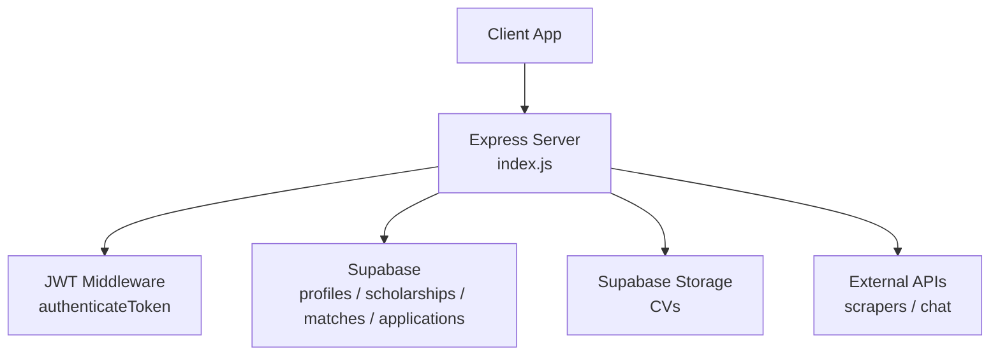
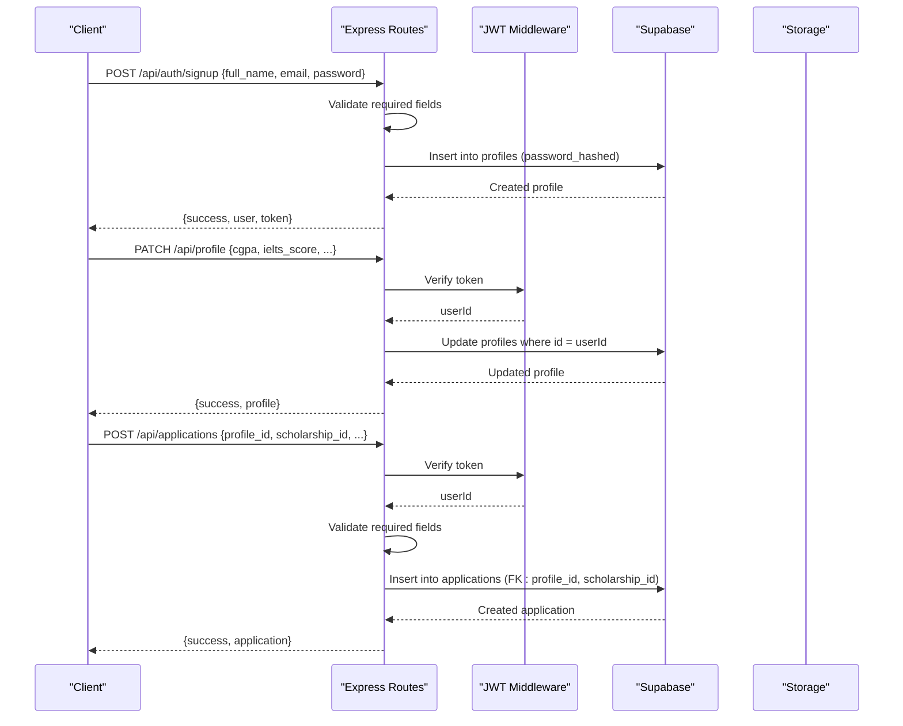
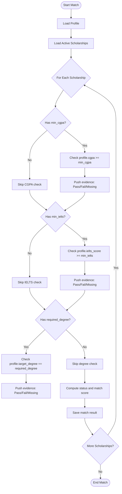
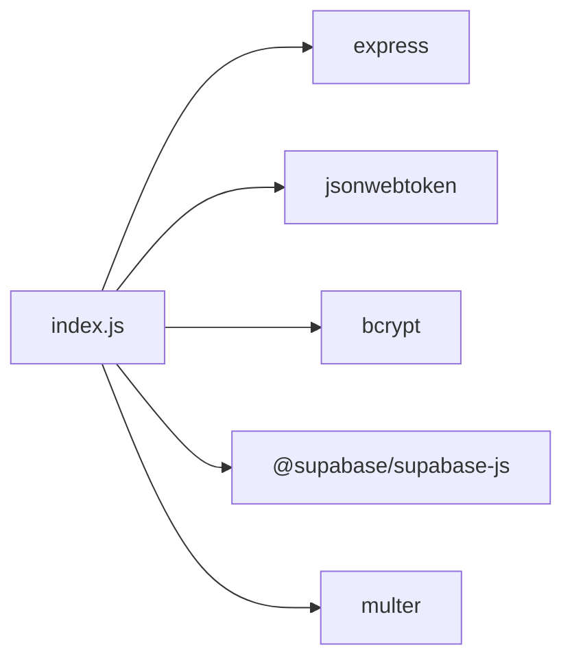

# Data Validation

<cite>
**Referenced Files in This Document**
- [index.js](file://aischolarpath-backend-main/aischolarpath-backend-main/index.js)
- [package.json](file://aischolarpath-backend-main/aischolarpath-backend-main/package.json)
- [ProfileTab.jsx](file://scholarpath-frontend (2)/scholarpath/src/pages/ProfileTab.jsx)
- [AuthModal.jsx](file://scholarpath-frontend (2)/scholarpath/src/components/AuthModal.jsx)
- [Dashboard.jsx](file://scholarpath-frontend (2)/scholarpath/src/pages/Dashboard.jsx)
- [mockData.js](file://scholarpath-frontend (2)/scholarpath/src/data/mockData.js)
</cite>

## Table of Contents
1. [Introduction](#introduction)
2. [Project Structure](#project-structure)
3. [Core Components](#core-components)
4. [Architecture Overview](#architecture-overview)
5. [Detailed Component Analysis](#detailed-component-analysis)
6. [Dependency Analysis](#dependency-analysis)
7. [Performance Considerations](#performance-considerations)
8. [Troubleshooting Guide](#troubleshooting-guide)
9. [Conclusion](#conclusion)

## Introduction
This document explains how data validation and business logic enforcement are implemented at the database layer for user registration, profile updates, and scholarship applications. It covers required field checks, type and range validation for numerical values such as CGPA and IELTS scores, referential integrity via foreign keys, and custom validation logic executed in route handlers before any database operations. It also documents error handling patterns and user feedback flows used across endpoints.

## Project Structure
The backend is a single Express application that:
- Validates environment variables at startup
- Authenticates requests using JWT middleware
- Performs input validation in route handlers
- Enforces business rules (eligibility matching, deadlines, authorization)
- Persists data to Supabase tables with referential integrity enforced by the database schema

**Diagram sources**
- [index.js:1-59](file://aischolarpath-backend-main/aischolarpath-backend-main/index.js#L1-L59)
- [index.js:32-47](file://aischolarpath-backend-main/aischolarpath-backend-main/index.js#L32-L47)
- [index.js:50-68](file://aischolarpath-backend-main/aischolarpath-backend-main/index.js#L50-L68)

**Section sources**
- [index.js:1-59](file://aischolarpath-backend-main/aischolarpath-backend-main/index.js#L1-L59)
- [package.json:1-14](file://aischolarpath-backend-main/aischolarpath-backend-main/package.json#L1-L14)

## Core Components
- Authentication and authorization middleware
- User registration and login endpoints
- Profile update and retrieval endpoints
- Scholarship listing and filtering
- Eligibility matching engine
- Application tracking endpoints
- Notification and deadline reminders
- Scrape and discovery endpoints

Key responsibilities:
- Validate inputs early in each handler
- Enforce business rules before writing to the database
- Return consistent error responses with user-friendly messages
- Maintain referential integrity through foreign key relationships

**Section sources**
- [index.js:32-47](file://aischolarpath-backend-main/aischolarpath-backend-main/index.js#L32-L47)
- [index.js:519-573](file://aischolarpath-backend-main/aischolarpath-backend-main/index.js#L519-L573)
- [index.js:70-110](file://aischolarpath-backend-main/aischolarpath-backend-main/index.js#L70-L110)
- [index.js:190-222](file://aischolarpath-backend-main/aischolarpath-backend-main/index.js#L190-L222)
- [index.js:575-673](file://aischolarpath-backend-main/aischolarpath-backend-main/index.js#L575-L673)
- [index.js:822-905](file://aischolarpath-backend-main/aischolarpath-backend-main/index.js#L822-L905)
- [index.js:1054-1100](file://aischolarpath-backend-main/aischolarpath-backend-main/index.js#L1054-L1100)

## Architecture Overview
The system enforces validation and business rules primarily in route handlers before interacting with the database. The database schema provides additional constraints (e.g., foreign keys, not-null fields) to ensure referential integrity and data consistency.

**Diagram sources**
- [index.js:519-540](file://aischolarpath-backend-main/aischolarpath-backend-main/index.js#L519-L540)
- [index.js:70-91](file://aischolarpath-backend-main/aischolarpath-backend-main/index.js#L70-L91)
- [index.js:822-845](file://aischolarpath-backend-main/aischolarpath-backend-main/index.js#L822-L845)
- [index.js:32-47](file://aischolarpath-backend-main/aischolarpath-backend-main/index.js#L32-L47)

## Detailed Component Analysis

### User Registration and Login
Validation and enforcement:
- Required fields: email and password are validated before hashing and insertion.
- Password security: passwords are hashed before storage using bcrypt.
- Token issuance: on successful signup/login, a JWT is issued with an expiration.
- Error handling: returns 400 for missing fields, 401 for invalid credentials, and 500 for server errors.

User feedback patterns:
- Consistent JSON responses with success flag and error messages.
- Clear distinction between client-side validation failures and server-side errors.

**Section sources**
- [index.js:519-540](file://aischolarpath-backend-main/aischolarpath-backend-main/index.js#L519-L540)
- [index.js:543-573](file://aischolarpath-backend-main/aischolarpath-backend-main/index.js#L543-L573)

### Profile Updates
Validation and enforcement:
- Authorization: only the authenticated user can update their own profile; endpoint verifies ownership.
- Partial updates: only provided fields are updated; undefined fields are ignored.
- Data persistence: updates are applied to the profiles table with explicit equality on user ID.

Error handling:
- Returns 403 when unauthorized, 404 if profile not found, and 500 for database errors.

**Section sources**
- [index.js:70-91](file://aischolarpath-backend-main/aischolarpath-backend-main/index.js#L70-L91)
- [index.js:94-110](file://aischolarpath-backend-main/aischolarpath-backend-main/index.js#L94-L110)

### Scholarship Applications
Validation and enforcement:
- Required fields: profile_id and scholarship_id must be present.
- Referential integrity: applications reference profiles and scholarships via foreign keys; inserts fail if references do not exist.
- Status defaults: status defaults to 'saved' if not provided.

Error handling:
- Returns 400 for missing required fields, 404 if application not found during updates/deletes, and 500 for database errors.

**Section sources**
- [index.js:822-845](file://aischolarpath-backend-main/aischolarpath-backend-main/index.js#L822-L845)
- [index.js:848-884](file://aischolarpath-backend-main/aischolarpath-backend-main/index.js#L848-L884)
- [index.js:908-932](file://aischolarpath-backend-main/aischolarpath-backend-main/index.js#L908-L932)

### Eligibility Matching Engine
Business logic:
- Compares profile attributes against scholarship eligibility criteria:
  - CGPA: checks presence and minimum threshold
  - IELTS score: checks presence and minimum threshold
  - Degree: checks exact match requirement
- Computes per-criterion evidence and overall match score.
- Determines status: Eligible, Missing Requirements, or Not Eligible based on pass/fail/missing results.

Data flow:
- Fetches profile and active scholarships
- Evaluates criteria and builds evidence array
- Clears previous matches and inserts fresh results

Error handling:
- Returns 404 if profile not found, 500 for database errors.

**Diagram sources**
- [index.js:575-673](file://aischolarpath-backend-main/aischolarpath-backend-main/index.js#L575-L673)

**Section sources**
- [index.js:575-673](file://aischolarpath-backend-main/aischolarpath-backend-main/index.js#L575-L673)

### Deadline Reminders and Notifications
Business logic:
- Identifies applications with upcoming deadlines within a configured window.
- Creates notifications for users with near-deadline applications.

Validation and enforcement:
- Requires authentication and ownership verification for profile-scoped operations.
- Filters applications by status and deadline proximity.

Error handling:
- Returns 403 for unauthorized access, 500 for database errors.

**Section sources**
- [index.js:1054-1100](file://aischolarpath-backend-main/aischolarpath-backend-main/index.js#L1054-L1100)

### Frontend Validation and User Feedback
Frontend behavior:
- Profile tab computes checklist completion based on form fields and document statuses.
- Inputs include email, phone, country, gender, CGPA, IELTS, degree, department, and extracurriculars.
- Documents have fixed slots with statuses: submitted, pending, missing.

User feedback patterns:
- Visual checklist indicates completion status per section.
- Status badges reflect document submission state.

Note: Frontend currently uses mock data and does not call backend endpoints directly in these components.

**Section sources**
- [ProfileTab.jsx:27-45](file://scholarpath-frontend (2)/scholarpath/src/pages/ProfileTab.jsx#L27-L45)
- [ProfileTab.jsx:145-206](file://scholarpath-frontend (2)/scholarpath/src/pages/ProfileTab.jsx#L145-L206)
- [mockData.js:25-41](file://scholarpath-frontend (2)/scholarpath/src/data/mockData.js#L25-L41)
- [Dashboard.jsx:23-36](file://scholarpath-frontend (2)/scholarpath/src/pages/Dashboard.jsx#L23-L36)

## Dependency Analysis
Backend dependencies relevant to validation and enforcement:
- Express: HTTP routing and request handling
- JWT: Token verification for protected routes
- bcrypt: Password hashing for secure storage
- Supabase client: Database queries and mutations
- Multer: File upload handling for CVs

**Diagram sources**
- [package.json:1-14](file://aischolarpath-backend-main/aischolarpath-backend-main/package.json#L1-L14)

**Section sources**
- [package.json:1-14](file://aischolarpath-backend-main/aischolarpath-backend-main/package.json#L1-L14)

## Performance Considerations
- Minimize unnecessary database calls by validating inputs early and reusing computed results where possible.
- Use selective field updates to reduce payload size and processing time.
- Batch operations where feasible (e.g., bulk scraping logs).
- Avoid heavy computations in hot paths; offload complex tasks to background jobs if needed.

[No sources needed since this section provides general guidance]

## Troubleshooting Guide
Common issues and resolutions:
- Missing required fields: Ensure all required parameters are present before sending requests.
- Invalid credentials: Verify email and password correctness; reset password if necessary.
- Unauthorized access: Confirm JWT token is valid and belongs to the requesting user.
- Database errors: Check network connectivity and Supabase configuration; inspect error messages returned by the server.

Error response pattern:
- All error responses include a success flag set to false and a descriptive error message.
- Status codes indicate the nature of the error (400 for bad request, 401/403 for auth issues, 404 for not found, 500 for server errors).

**Section sources**
- [index.js:1528-1531](file://aischolarpath-backend-main/aischolarpath-backend-main/index.js#L1528-L1531)

## Conclusion
The system implements robust data validation and business logic enforcement at the database layer through careful route handler design and Supabase integration. Required fields, type checks, range validations for CGPA and IELTS, and referential integrity are enforced both in code and via database constraints. Custom validation logic ensures eligibility matching and deadline reminders operate correctly. Consistent error handling and user feedback patterns provide clear communication to clients. Future enhancements may include more granular frontend validation and expanded backend rule sets.

[No sources needed since this section summarizes without analyzing specific files]