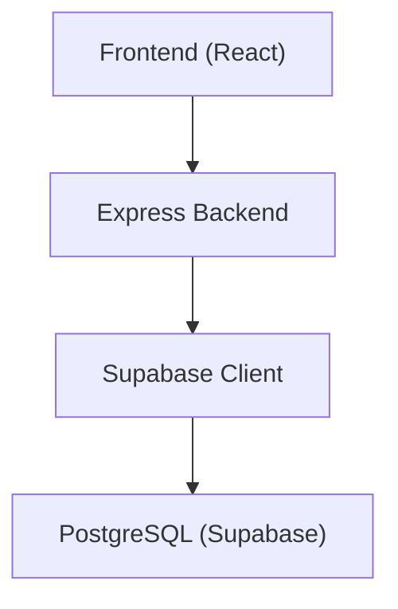
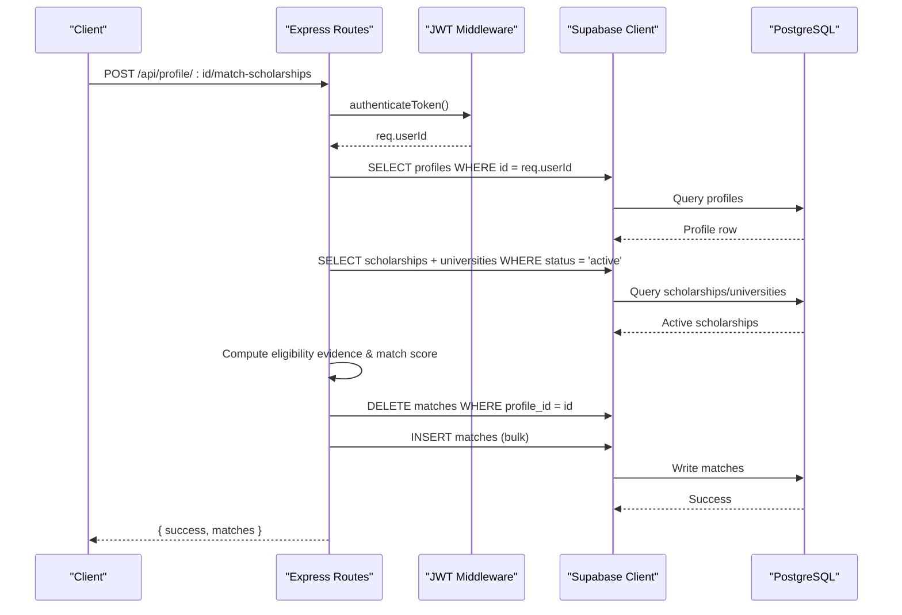
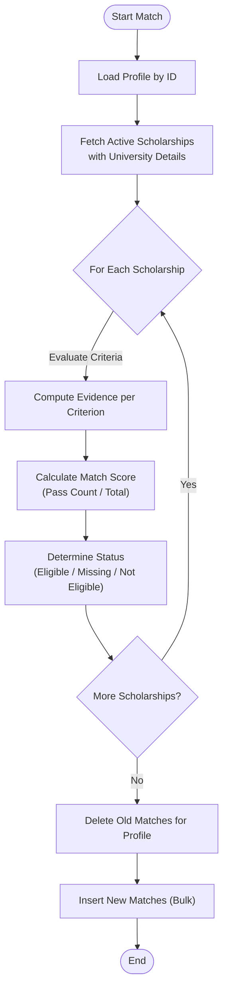
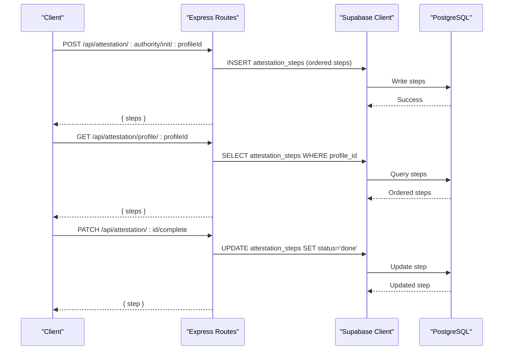
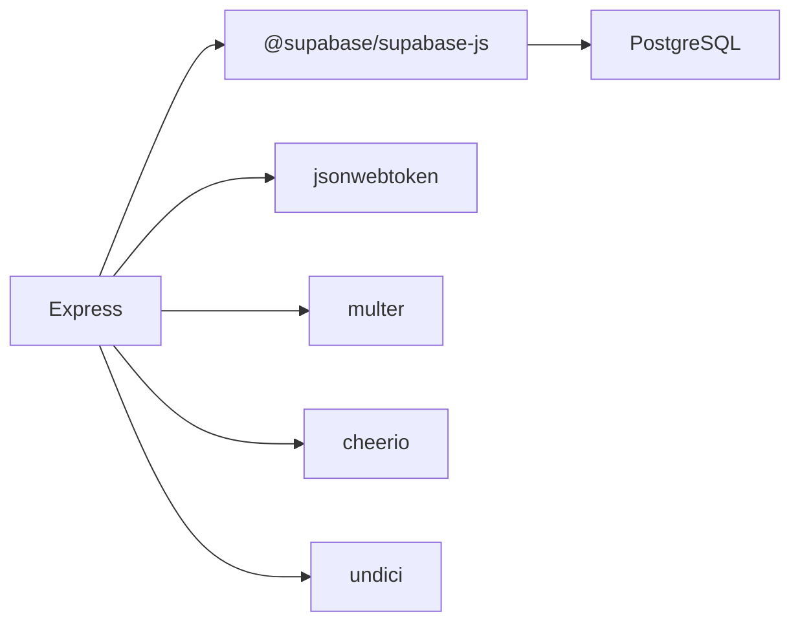

# Database Operations

<cite>
**Referenced Files in This Document**
- [index.js](file://aischolarpath-backend-main/aischolarpath-backend-main/index.js)
- [package.json](file://aischolarpath-backend-main/aischolarpath-backend-main/package.json)
- [AttestationTab.jsx](file://scholarpath-frontend (2)/scholarpath/src/pages/AttestationTab.jsx)
</cite>

## Table of Contents
1. [Introduction](#introduction)
2. [Project Structure](#project-structure)
3. [Core Components](#core-components)
4. [Architecture Overview](#architecture-overview)
5. [Detailed Component Analysis](#detailed-component-analysis)
6. [Dependency Analysis](#dependency-analysis)
7. [Performance Considerations](#performance-considerations)
8. [Troubleshooting Guide](#troubleshooting-guide)
9. [Conclusion](#conclusion)
10. [Appendices](#appendices)

## Introduction
This document explains the database operations and integration patterns used by the application to manage user profiles, scholarships, universities, matches, shortlists, and attestation steps. It focuses on how the backend uses the Supabase JavaScript client to perform CRUD operations, filtering, sorting, and relationship queries; how business logic enforces data validation and eligibility rules; and how performance is optimized through query design and server-side processing. It also covers complex workflows such as the scholarship matching algorithm that evaluates eligibility criteria and calculates match scores, along with guidance for data integrity, indexing strategies, and migration approaches.

## Project Structure
The system consists of:
- A Node.js Express backend that authenticates users, manages profiles, scholarships, universities, matches, shortlists, notifications, discovery logs, and attestation steps, and interacts with a PostgreSQL database via Supabase.
- A React frontend that includes UI for features like Attestation, Scholarships, and others. The frontend communicates with the backend APIs rather than directly querying Supabase.

**Diagram sources**
- [index.js:27-54](file://aischolarpath-backend-main/aischolarpath-backend-main/index.js#L27-L54)
- [index.js:57-68](file://aischolarpath-backend-main/aischolarpath-backend-main/index.js#L57-L68)

**Section sources**
- [index.js:1-68](file://aischolarpath-backend-main/aischolarpath-backend-main/index.js#L1-L68)
- [package.json:1-13](file://aischolarpath-backend-main/aischolarpath-backend-main/package.json#L1-L13)

## Core Components
- Authentication and authorization: JWT-based middleware protects routes and ensures users can only access their own data.
- Profile management: Create/update profile fields, upload CVs to storage, and analyze/extract profile data.
- Scholarship and university catalog: List and filter scholarships and universities, including relationships to universities.
- Matching engine: Evaluate a profile against active scholarships using eligibility criteria and compute match scores and status.
- Shortlist management: Add/remove items and retrieve full shortlists with related details.
- Notifications: Create and fetch notifications, mark as read, and generate deadline reminders.
- Discovery and scraping: Scrape external pages, log results, and upsert scholarships into the database.
- Attestation steps: Initialize, track, and complete step-by-step processes per authority for each profile.

**Section sources**
- [index.js:31-47](file://aischolarpath-backend-main/aischolarpath-backend-main/index.js#L31-L47)
- [index.js:69-188](file://aischolarpath-backend-main/aischolarpath-backend-main/index.js#L69-L188)
- [index.js:189-288](file://aischolarpath-backend-main/aischolarpath-backend-main/index.js#L189-L288)
- [index.js:574-773](file://aischolarpath-backend-main/aischolarpath-backend-main/index.js#L574-L773)
- [index.js:982-1050](file://aischolarpath-backend-main/aischolarpath-backend-main/index.js#L982-L1050)
- [index.js:1182-1505](file://aischolarpath-backend-main/aischolarpath-backend-main/index.js#L1182-L1505)
- [index.js:426-517](file://aischolarpath-backend-main/aischolarpath-backend-main/index.js#L426-L517)

## Architecture Overview
The backend exposes REST endpoints that enforce authentication and delegate data operations to Supabase. Queries use PostgREST-style filters, joins via select expansions, ordering, and bulk operations. Business logic runs in the backend to validate inputs, enforce permissions, and compute derived values (e.g., match scores).

**Diagram sources**
- [index.js:31-47](file://aischolarpath-backend-main/aischolarpath-backend-main/index.js#L31-L47)
- [index.js:574-673](file://aischolarpath-backend-main/aischolarpath-backend-main/index.js#L574-L673)

## Detailed Component Analysis

### PostgreSQL Schema Design
Based on the backend’s usage of tables and fields, the following schema elements are inferred:

- profiles
  - Fields observed: id, full_name, email, password_hash, cgpa, ielts_score, target_country, target_degree, target_department, cv_file_path, reset_token, reset_token_expiry
  - Relationships: One-to-many with matches, shortlist, notifications, attestation_steps, discovery_log (via profile_id where applicable)

- scholarships
  - Fields observed: id, title, country, department, degree_level, scholarship_type, eligibility_criteria (JSON), deadline, apply_url, source_url, status, last_verified_at, university_id
  - Relationships: Many-to-one with universities via university_id; one-to-many with matches

- universities
  - Fields observed: id, name, official_portal_url, country, degree_programs (array-like field used with contains)
  - Relationships: One-to-many with scholarships via university_id

- matches
  - Fields observed: id, profile_id, scholarship_id, university_id, match_score, status, evidence (JSON array)
  - Relationships: Many-to-one with profiles and scholarships; denormalized university_id for quick access

- shortlist
  - Fields observed: id, profile_id, item_type, item_id
  - Relationships: Many-to-one with profiles; polymorphic references to scholarships or universities via item_type/item_id

- attestation_steps
  - Fields observed: id, profile_id, authority, step_order, step_description, status
  - Relationships: Many-to-one with profiles; ordered steps per authority

- notifications
  - Fields observed: id, profile_id, type, title, message, is_read, created_at
  - Relationships: Many-to-one with profiles

- discovery_log
  - Fields observed: id, source_url, status, raw_snapshot (JSON), fetched_at
  - Relationships: Used to record scraping outcomes

Notes:
- JSONB fields are used for structured data like eligibility_criteria and evidence.
- Status enums are enforced at the application layer (e.g., scholarships.status, matches.status, attestation_steps.status).
- Foreign keys are implied by relational usage; explicit constraints should be defined in migrations.

**Section sources**
- [index.js:69-188](file://aischolarpath-backend-main/aischolarpath-backend-main/index.js#L69-L188)
- [index.js:189-288](file://aischolarpath-backend-main/aischolarpath-backend-main/index.js#L189-L288)
- [index.js:574-773](file://aischolarpath-backend-main/aischolarpath-backend-main/index.js#L574-L773)
- [index.js:982-1050](file://aischolarpath-backend-main/aischolarpath-backend-main/index.js#L982-L1050)
- [index.js:1182-1505](file://aischolarpath-backend-main/aischolarpath-backend-main/index.js#L1182-L1505)
- [index.js:426-517](file://aischolarpath-backend-main/aischolarpath-backend-main/index.js#L426-L517)

### Query Patterns Using Supabase JavaScript Client
- Filtering: Equality filters (eq), containment checks (contains), null checks (not ... is null), and text search (ilike).
- Sorting: Order by fields such as match_score and timestamps.
- Relationship queries: Select expansions to include related rows (e.g., scholarships.universities).
- Bulk operations: Insert arrays for matches and discovery logs; delete by condition before re-inserting computed results.
- Upsert: Use upsert with conflict resolution on unique keys (title,country) for scholarships.

Examples from the codebase:
- Filter scholarships by country, type, department, degree level and join universities.
- Retrieve universities filtered by country, degree programs, and search term; then filter based on direct scholarships or country-wide scholarships.
- Build matches by evaluating eligibility criteria and inserting results in bulk.
- Track attestation steps per authority and update statuses.

**Section sources**
- [index.js:189-288](file://aischolarpath-backend-main/aischolarpath-backend-main/index.js#L189-L288)
- [index.js:574-673](file://aischolarpath-backend-main/aischolarpath-backend-main/index.js#L574-L673)
- [index.js:1182-1505](file://aischolarpath-backend-main/aischolarpath-backend-main/index.js#L1182-L1505)
- [index.js:426-517](file://aischolarpath-backend-main/aischolarpath-backend-main/index.js#L426-L517)

### Data Validation Rules and Business Logic Enforcement
- Input validation: Required fields checked before DB writes (e.g., email/password for auth, profile_id/item_type/item_id for shortlist).
- Authorization: Middleware verifies JWT tokens and ensures users operate only on their own resources (profile updates, matches, shortlist, notifications, attestation steps).
- Eligibility evaluation: Backend computes evidence per criterion (CGPA, IELTS, etc.) and derives match_score and status based on pass/fail counts.
- Status transitions: Scholarships transition from under_review to active after manual approval; attestation steps move from pending to done.
- Security: Passwords hashed before storage; reset tokens generated with expiry and validated before password resets.

**Section sources**
- [index.js:31-47](file://aischolarpath-backend-main/aischolarpath-backend-main/index.js#L31-L47)
- [index.js:518-573](file://aischolarpath-backend-main/aischolarpath-backend-main/index.js#L518-L573)
- [index.js:574-673](file://aischolarpath-backend-main/aischolarpath-backend-main/index.js#L574-L673)
- [index.js:1507-1526](file://aischolarpath-backend-main/aischolarpath-backend-main/index.js#L1507-L1526)
- [index.js:1101-1181](file://aischolarpath-backend-main/aischolarpath-backend-main/index.js#L1101-L1181)

### Performance Optimization Techniques
- Connection pooling: Global HTTP agent configured with connection limits and timeouts to optimize network calls.
- Selective selects: Only request needed fields and expand relationships explicitly to reduce payload size.
- Filtering at DB layer: Use eq, ilike, contains, and not ... is null to push filtering to PostgreSQL.
- Ordering and limiting: Order by match_score and limit results where appropriate to avoid large datasets.
- Bulk inserts/deletes: Clear old matches and insert new ones in batches to minimize round trips.
- Upsert with conflict resolution: Avoid duplicate entries when ingesting scraped scholarships.
- Pagination and scoping: Limit lists (e.g., top universities) and scope queries by authenticated user IDs.

**Section sources**
- [index.js:18-25](file://aischolarpath-backend-main/aischolarpath-backend-main/index.js#L18-L25)
- [index.js:189-288](file://aischolarpath-backend-main/aischolarpath-backend-main/index.js#L189-L288)
- [index.js:574-673](file://aischolarpath-backend-main/aischolarpath-backend-main/index.js#L574-L673)
- [index.js:1182-1505](file://aischolarpath-backend-main/aischolarpath-backend-main/index.js#L1182-L1505)

### Complex Query: Scholarship Matching Algorithm
The matching workflow:
- Load profile by ID.
- Fetch active scholarships, optionally filtered by target country, and include university details.
- For each scholarship, evaluate eligibility criteria against profile data (e.g., CGPA thresholds, IELTS requirements).
- Record evidence per criterion with result Pass/Fail/Missing.
- Compute match_score as percentage of passed criteria; determine overall status (Eligible, Missing Requirements, Not Eligible).
- Delete existing matches for the profile and insert fresh results in bulk.

**Diagram sources**
- [index.js:574-673](file://aischolarpath-backend-main/aischolarpath-backend-main/index.js#L574-L673)

**Section sources**
- [index.js:574-673](file://aischolarpath-backend-main/aischolarpath-backend-main/index.js#L574-L673)

### Attestation Steps Integration
- Initialize tracked steps for a profile per authority by inserting ordered steps with default status.
- Retrieve steps ordered by authority and step order.
- Mark individual steps as completed with authorization checks.

**Diagram sources**
- [index.js:426-517](file://aischolarpath-backend-main/aischolarpath-backend-main/index.js#L426-L517)

**Section sources**
- [index.js:426-517](file://aischolarpath-backend-main/aischolarpath-backend-main/index.js#L426-L517)

### Frontend Interaction with Backend
The Attestation tab demonstrates UI-driven selection and display of attestation options and steps. While it currently renders static mock data, the backend provides endpoints to initialize and retrieve tracked steps for a profile.

**Section sources**
- [AttestationTab.jsx:1-72](file://scholarpath-frontend (2)/scholarpath/src/pages/AttestationTab.jsx#L1-L72)
- [index.js:426-517](file://aischolarpath-backend-main/aischolarpath-backend-main/index.js#L426-L517)

## Dependency Analysis
The backend depends on:
- Express for routing and middleware.
- Supabase JS client for database and storage interactions.
- JWT for token-based authentication.
- Multer for file uploads.
- Cheerio for web scraping.
- Undici agent for connection pooling.

**Diagram sources**
- [package.json:1-13](file://aischolarpath-backend-main/aischolarpath-backend-main/package.json#L1-L13)
- [index.js:1-27](file://aischolarpath-backend-main/aischolarpath-backend-main/index.js#L1-L27)

**Section sources**
- [package.json:1-13](file://aischolarpath-backend-main/aischolarpath-backend-main/package.json#L1-L13)
- [index.js:1-27](file://aischolarpath-backend-main/aischolarpath-backend-main/index.js#L1-L27)

## Performance Considerations
- Use selective selects to minimize data transfer.
- Push filtering and ordering to the database layer.
- Batch operations for inserts and deletes to reduce round trips.
- Configure connection pooling and timeouts for outbound requests.
- Limit result sets where appropriate (e.g., top recommendations, limited university lists).
- Cache frequently accessed reference data server-side if needed.

[No sources needed since this section provides general guidance]

## Troubleshooting Guide
Common issues and resolutions:
- Authentication failures: Ensure JWT is present and valid; verify environment variables for JWT secret.
- Database connectivity errors: Check SUPABASE_URL and SUPABASE_KEY; use health/test endpoints to validate connection.
- Permission errors: Confirm route-level authorization checks compare req.userId with resource owner.
- Scraping errors: Validate URLs and selectors; check rate limiting and handle network errors gracefully.
- Data integrity: Validate required fields before writes; ensure status transitions follow allowed paths.

**Section sources**
- [index.js:31-47](file://aischolarpath-backend-main/aischolarpath-backend-main/index.js#L31-L47)
- [index.js:57-68](file://aischolarpath-backend-main/aischolarpath-backend-main/index.js#L57-L68)
- [index.js:1182-1505](file://aischolarpath-backend-main/aischolarpath-backend-main/index.js#L1182-L1505)

## Conclusion
The application implements a robust set of database operations over Supabase, leveraging the JavaScript client for efficient CRUD, filtering, sorting, and relationship queries. Business logic enforces data validation, eligibility rules, and secure access control. The matching algorithm computes personalized scholarship recommendations based on profile attributes and scholarship criteria. Proper indexing, careful query design, and batch operations help maintain performance. Migrations should define explicit constraints and indexes to support these patterns and ensure long-term data integrity.

[No sources needed since this section summarizes without analyzing specific files]

## Appendices

### Indexing Strategies (Recommended)
- profiles: index on email (unique), id (PK), and commonly filtered fields like target_country.
- scholarships: index on status, country, department, degree_level, university_id; GIN index on eligibility_criteria for JSONB queries.
- matches: index on profile_id, scholarship_id, match_score; consider composite index on (profile_id, match_score) for sorted retrieval.
- shortlist: index on profile_id, item_type, item_id.
- attestation_steps: index on profile_id, authority, step_order.
- notifications: index on profile_id, created_at; partial index on is_read for unread queries.
- discovery_log: index on fetched_at for recent logs.

[No sources needed since this section provides general guidance]

### Migration Approaches
- Versioned SQL migrations for schema changes (tables, columns, indexes, constraints).
- Use upsert patterns with conflict resolution to handle idempotent ingestion (e.g., scholarships by title+country).
- Backfill data carefully with scripts that respect constraints and indexes.
- Test migrations in staging environments; rollback plans for production.

[No sources needed since this section provides general guidance]