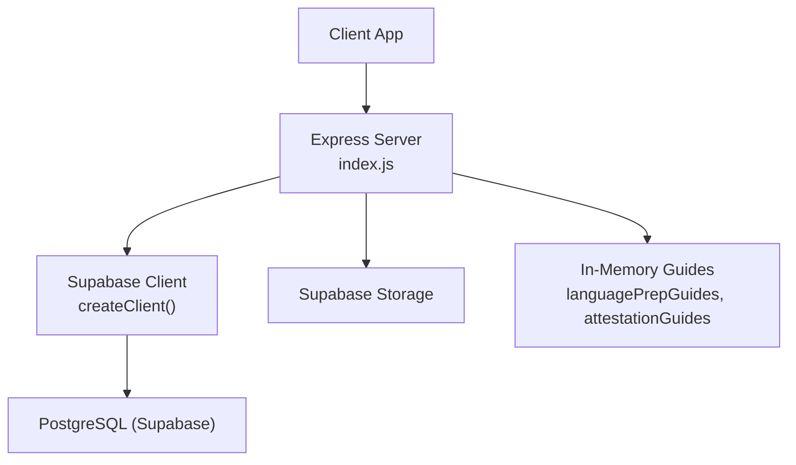
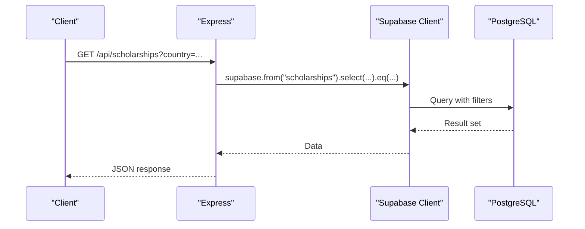
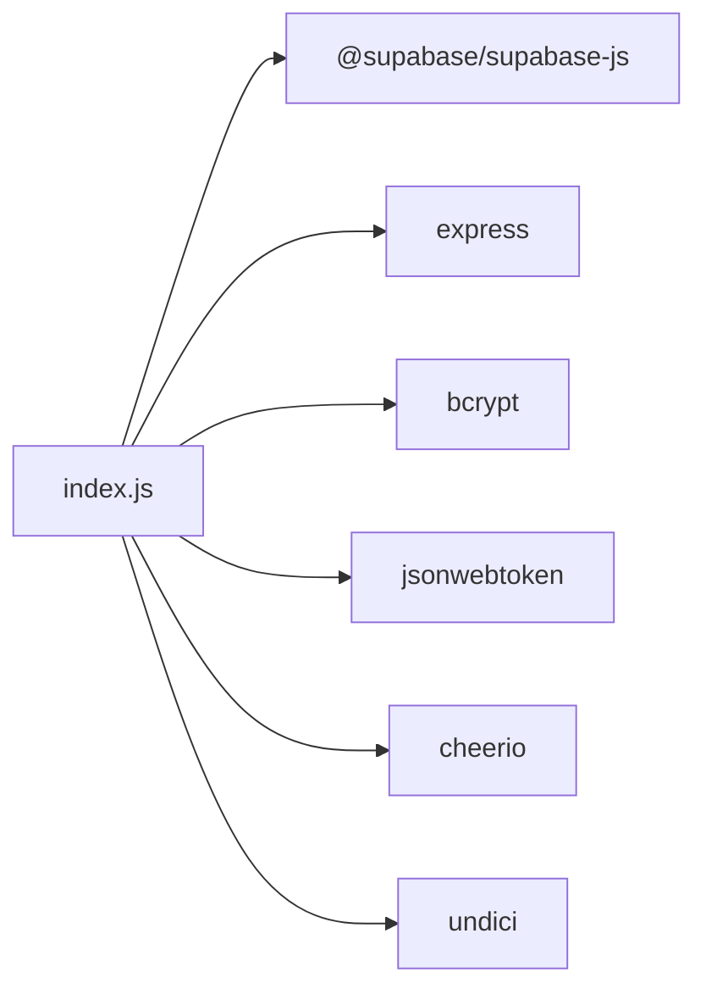

# Performance Optimization

<cite>
**Referenced Files in This Document**
- [index.js](file://aischolarpath-backend-main/aischolarpath-backend-main/index.js)
- [package.json](file://aischolarpath-backend-main/aischolarpath-backend-main/package.json)
</cite>

## Table of Contents
1. [Introduction](#introduction)
2. [Project Structure](#project-structure)
3. [Core Components](#core-components)
4. [Architecture Overview](#architecture-overview)
5. [Detailed Component Analysis](#detailed-component-analysis)
6. [Dependency Analysis](#dependency-analysis)
7. [Performance Considerations](#performance-considerations)
8. [Troubleshooting Guide](#troubleshooting-guide)
9. [Conclusion](#conclusion)

## Introduction
This document explains database performance optimization techniques and strategies used in the ScholarPathAI application. It focuses on indexing strategies for frequently queried columns, query optimization patterns to reduce database load, connection pooling configuration for the Supabase client, caching strategies for static data (language preparation guides and attestation procedures), monitoring and profiling techniques to identify slow queries, database connection management, and scaling considerations for high-traffic scenarios. Where applicable, it references concrete implementation points in the codebase.

## Project Structure
The backend is an Express application that exposes REST endpoints and interacts with a Supabase Postgres database via the Supabase JS client. Static reference data (language prep guides and attestation steps) is embedded in-memory. HTTP client behavior is tuned using a global undici agent.

**Diagram sources**
- [index.js:50-54](file://aischolarpath-backend-main/aischolarpath-backend-main/index.js#L50-L54)
- [index.js:289-353](file://aischolarpath-backend-main/aischolarpath-backend-main/index.js#L289-L353)
- [index.js:404-435](file://aischolarpath-backend-main/aischolarpath-backend-main/index.js#L404-L435)

**Section sources**
- [index.js:1-68](file://aischolarpath-backend-main/aischolarpath-backend-main/index.js#L1-L68)
- [package.json:1-13](file://aischolarpath-backend-main/aischolarpath-backend-main/package.json#L1-L13)

## Core Components
- Supabase client initialization and environment validation
- Authentication middleware for protected routes
- Database access patterns across profiles, scholarships, universities, matches, applications, notifications, discovery logs, and attestation steps
- In-memory caching for static guides
- HTTP client tuning via undici agent

Key implementation anchors:
- Supabase client setup and health/test endpoints
- Protected route pattern using JWT verification
- In-memory static data structures for language prep and attestation
- Global HTTP agent configuration for connection reuse and timeouts

**Section sources**
- [index.js:4-10](file://aischolarpath-backend-main/aischolarpath-backend-main/index.js#L4-L10)
- [index.js:32-47](file://aischolarpath-backend-main/aischolarpath-backend-main/index.js#L32-L47)
- [index.js:50-68](file://aischolarpath-backend-main/aischolarpath-backend-main/index.js#L50-L68)
- [index.js:289-353](file://aischolarpath-backend-main/aischolarpath-backend-main/index.js#L289-L353)
- [index.js:404-435](file://aischolarpath-backend-main/aischolarpath-backend-main/index.js#L404-L435)
- [index.js:18-25](file://aischolarpath-backend-main/aischolarpath-backend-main/index.js#L18-L25)

## Architecture Overview
The system follows a request-driven architecture:
- Clients call Express endpoints.
- Endpoints validate inputs and authenticate users where required.
- Data operations are performed via the Supabase client against Postgres tables.
- Static reference data is served from in-memory objects without hitting the database.
- An undici agent configures HTTP-level connection reuse and timeouts for outbound requests (e.g., scraping).

**Diagram sources**
- [index.js:189-206](file://aischolarpath-backend-main/aischolarpath-backend-main/index.js#L189-L206)

## Detailed Component Analysis

### Connection Pooling and HTTP Client Configuration
- A global undici Agent is configured with connection limits and timeouts to improve reuse and control resource usage for outbound HTTP calls (e.g., scraping).
- The Supabase client is created once at startup; it manages its own internal connection pool per process. No explicit Supabase connection pool options are set in this codebase.

Recommendations:
- Keep a single Supabase client instance per process (already implemented).
- Tune undici agent settings based on observed concurrency and external site rate limits.
- If needed, consider environment-specific agents or per-request overrides for long-running tasks.

**Section sources**
- [index.js:18-25](file://aischolarpath-backend-main/aischolarpath-backend-main/index.js#L18-L25)
- [index.js:50-54](file://aischolarpath-backend-main/aischolarpath-backend-main/index.js#L50-L54)

### Indexing Strategies for Frequently Queried Columns
Based on the queries in the codebase, the following indexes would likely improve performance:

- profiles
  - email (unique): Used for login lookup by email.
  - id (primary key): Already indexed by default.

- scholarships
  - country: Filtered in list and matching flows.
  - status: Filtered to active or under_review records.
  - (country, status): Composite index for combined filtering.
  - title,country (unique): Enforced by upsert conflict target; ensure unique constraint exists.

- universities
  - id (primary key): Default index.
  - country: Used in filtering university lists.

- matches
  - profile_id: Used extensively to fetch matches per user.
  - (profile_id, match_score): For sorted retrieval of top matches.

- applications
  - profile_id: Used to list applications per user.
  - status: Used in deadline checks and listing.
  - (profile_id, status): Composite for filtered listing.

- notifications
  - profile_id: Used to list notifications per user.
  - created_at: Used for ordering recent notifications.
  - (profile_id, created_at): Composite for efficient ordered reads.

- discovery_log
  - fetched_at: Used for ordering recent logs.
  - source_url: Useful if querying by source.

- shortlist
  - profile_id: Used to retrieve user shortlists.

- attestation_steps
  - profile_id: Used to fetch steps per user.
  - (profile_id, authority, step_order): Composite for ordered retrieval.

Notes:
- Ensure unique constraints exist where enforced by application logic (e.g., scholarships.title + country).
- Avoid over-indexing write-heavy tables; prioritize read paths identified above.

**Section sources**
- [index.js:543-573](file://aischolarpath-backend-main/aischolarpath-backend-main/index.js#L543-L573)
- [index.js:189-206](file://aischolarpath-backend-main/aischolarpath-backend-main/index.js#L189-L206)
- [index.js:224-271](file://aischolarpath-backend-main/aischolarpath-backend-main/index.js#L224-L271)
- [index.js:575-673](file://aischolarpath-backend-main/aischolarpath-backend-main/index.js#L575-L673)
- [index.js:676-692](file://aischolarpath-backend-main/aischolarpath-backend-main/index.js#L676-L692)
- [index.js:694-749](file://aischolarpath-backend-main/aischolarpath-backend-main/index.js#L694-L749)
- [index.js:887-905](file://aischolarpath-backend-main/aischolarpath-backend-main/index.js#L887-L905)
- [index.js:1002-1020](file://aischolarpath-backend-main/aischolarpath-backend-main/index.js#L1002-L1020)
- [index.js:1246-1257](file://aischolarpath-backend-main/aischolarpath-backend-main/index.js#L1246-L1257)
- [index.js:1495-1505](file://aischolarpath-backend-main/aischolarpath-backend-main/index.js#L1495-L1505)
- [index.js:1417-1429](file://aischolarpath-backend-main/aischolarpath-backend-main/index.js#L1417-L1429)

### Query Optimization Patterns
- Select only needed fields: Many endpoints already select specific columns or use .single() to avoid unnecessary payloads.
- Use targeted filters: Queries apply eq(), not(), is(), ilike(), and in() to narrow results before returning data.
- Limit result sets: Some endpoints limit results (e.g., top 10 universities).
- Batch writes: Bulk insertions are used for attestation steps and notifications to reduce round trips.
- Upserts with conflict targets: Scholarship ingestion uses upserts with a conflict target to prevent duplicates.

Examples in code:
- Filtering scholarships by country/type/department/degree and joining university details.
- Fetching matches for a profile and sorting by match score.
- Creating multiple notification rows in one insert.
- Scraping pipelines that upsert scholarships with conflict resolution.

**Section sources**
- [index.js:189-206](file://aischolarpath-backend-main/aischolarpath-backend-main/index.js#L189-L206)
- [index.js:676-692](file://aischolarpath-backend-main/aischolarpath-backend-main/index.js#L676-L692)
- [index.js:450-463](file://aischolarpath-backend-main/aischolarpath-backend-main/index.js#L450-L463)
- [index.js:1090-1099](file://aischolarpath-backend-main/aischolarpath-backend-main/index.js#L1090-L1099)
- [index.js:1417-1429](file://aischolarpath-backend-main/aischolarpath-backend-main/index.js#L1417-L1429)

### Caching Strategies for Static Data
- Language preparation guides: Embedded in-memory object keyed by test type (IELTS, TOEFL, PTE). Responses are returned directly without database calls.
- Attestation procedures: Embedded in-memory arrays per authority (HEC, IBCC, MOFA). Returned directly for guide endpoints.

Benefits:
- Zero database overhead for frequent read-only reference data.
- Fast responses and reduced contention on database connections.

Considerations:
- Updates require server restart unless dynamic reloading is added.
- For large datasets, consider an in-process cache with TTL or a shared cache layer.

**Section sources**
- [index.js:289-353](file://aischolarpath-backend-main/aischolarpath-backend-main/index.js#L289-L353)
- [index.js:404-435](file://aischolarpath-backend-main/aischolarpath-backend-main/index.js#L404-L435)

### Monitoring and Profiling Techniques
Current state:
- Centralized error handler logs unhandled errors.
- Health and database connectivity endpoints exist for basic checks.

Recommended enhancements:
- Add structured logging around database calls with timing metrics (request start/end, query duration).
- Integrate a metrics library to expose counters for query latency, error rates, and throughput.
- Use Supabase/Postgres query logs and EXPLAIN plans to identify slow queries.
- Implement request tracing for complex endpoints (matching, roadmap, discovery scrapers).

**Section sources**
- [index.js:1527-1531](file://aischolarpath-backend-main/aischolarpath-backend-main/index.js#L1527-L1531)
- [index.js:57-68](file://aischolarpath-backend-main/aischolarpath-backend-main/index.js#L57-L68)

### Database Connection Management
- Single Supabase client instance is created at startup, which reuses connections internally.
- Outbound HTTP connections are managed by a global undici Agent with connection limits and timeouts.

Best practices:
- Keep one client per process to leverage connection reuse.
- Monitor connection pool saturation and adjust timeouts based on workload.
- Separate agents for different workloads if necessary (e.g., scraping vs. API calls).

**Section sources**
- [index.js:50-54](file://aischolarpath-backend-main/aischolarpath-backend-main/index.js#L50-L54)
- [index.js:18-25](file://aischolarpath-backend-main/aischolarpath-backend-main/index.js#L18-L25)

### Scaling Considerations for High Traffic
- Horizontal scaling: Run multiple instances behind a load balancer; each maintains its own Supabase client and in-memory caches.
- Database scaling: Rely on Supabase’s managed scaling; ensure proper indexing as outlined above.
- Rate limiting: Protect endpoints (especially discovery/scraping) with rate limiting to avoid overwhelming external sites and database.
- Background jobs: Offload heavy tasks (scraping, matching) to background workers to keep API latency low.
- Caching: Expand in-memory caches to include hot reference data with TTL; consider Redis for shared caching across instances.

[No sources needed since this section provides general guidance]

## Dependency Analysis
The backend depends on:
- Express for routing and middleware
- Supabase JS client for database and storage interactions
- bcrypt and jsonwebtoken for authentication
- cheerio for HTML parsing in discovery features
- undici for HTTP client tuning

**Diagram sources**
- [package.json:1-13](file://aischolarpath-backend-main/aischolarpath-backend-main/package.json#L1-L13)

**Section sources**
- [package.json:1-13](file://aischolarpath-backend-main/aischolarpath-backend-main/package.json#L1-L13)

## Performance Considerations
- Prefer selective column selection and precise filters to minimize payload and query cost.
- Use composite indexes for common filter combinations (e.g., scholarships.country + status).
- Cache static reference data in memory to eliminate database hits for frequent reads.
- Limit result sets where appropriate to reduce processing time and network transfer.
- Use batch inserts for multi-row writes (attestation steps, notifications).
- Tune HTTP client settings for outbound traffic to balance throughput and stability.

[No sources needed since this section provides general guidance]

## Troubleshooting Guide
Common issues and mitigations:
- Missing environment variables: The app validates required env vars at startup and exits if missing.
- Database connectivity: Use the test-db endpoint to verify Supabase connectivity.
- Authentication failures: Check JWT secret configuration and token validity in protected routes.
- Slow queries: Review query patterns and add indexes as recommended; analyze execution plans in Supabase.
- External scraping failures: Inspect discovery logs and adjust User-Agent headers and delays; handle non-OK responses gracefully.

Operational tips:
- Log errors centrally and capture context (endpoint, user, parameters).
- Expose health and readiness endpoints for orchestration tools.
- Periodically review slow query logs and update indexes accordingly.

**Section sources**
- [index.js:4-10](file://aischolarpath-backend-main/aischolarpath-backend-main/index.js#L4-L10)
- [index.js:57-68](file://aischolarpath-backend-main/aischolarpath-backend-main/index.js#L57-L68)
- [index.js:1527-1531](file://aischolarpath-backend-main/aischolarpath-backend-main/index.js#L1527-L1531)

## Conclusion
ScholarPathAI’s backend leverages a single Supabase client, in-memory caching for static guides, and targeted query patterns to optimize database interactions. To further improve performance at scale, implement recommended indexes, enhance monitoring and profiling, expand caching strategies, and consider background job offloading for heavy operations. These changes will reduce database load, lower latency, and improve resilience under high traffic.

[No sources needed since this section summarizes without analyzing specific files]