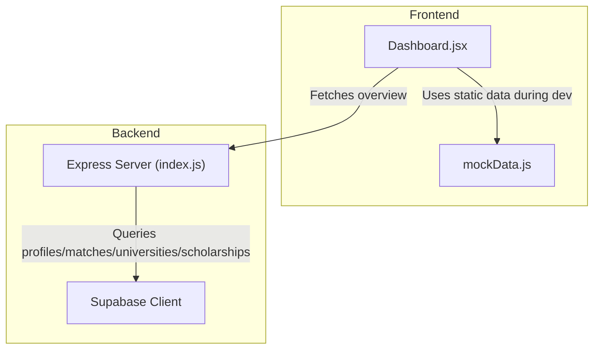
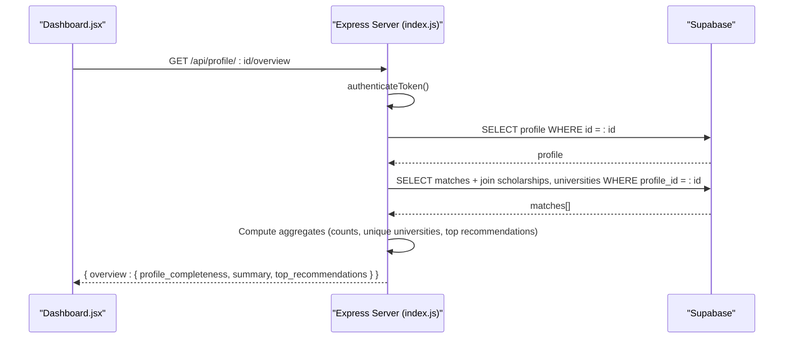
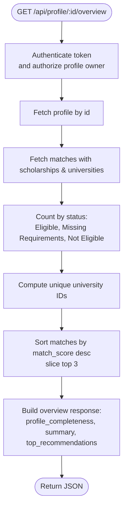
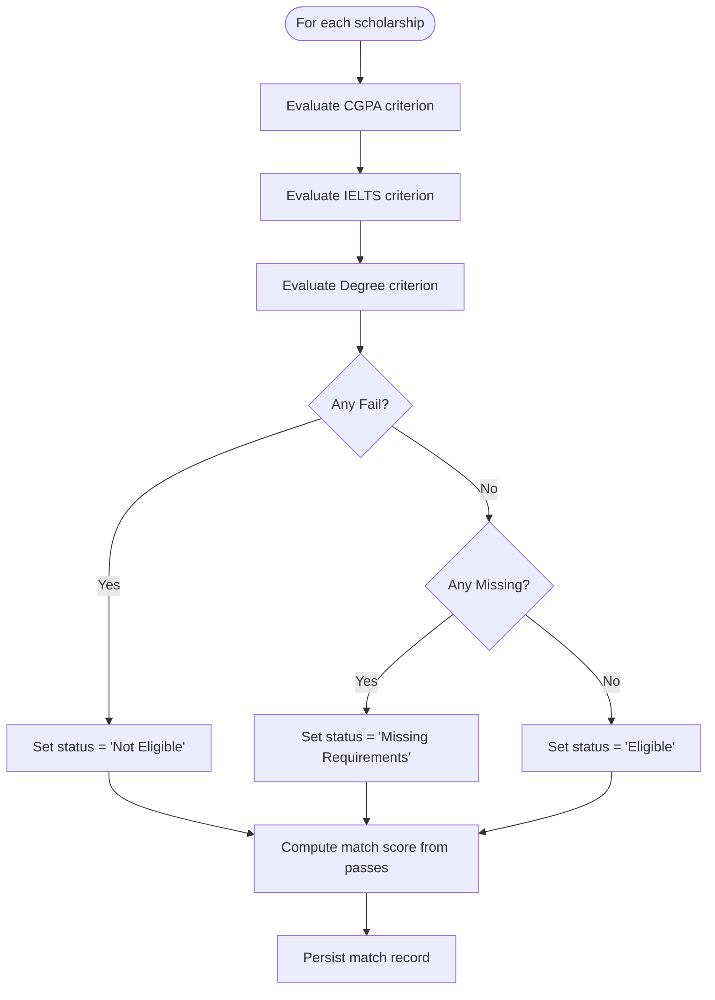
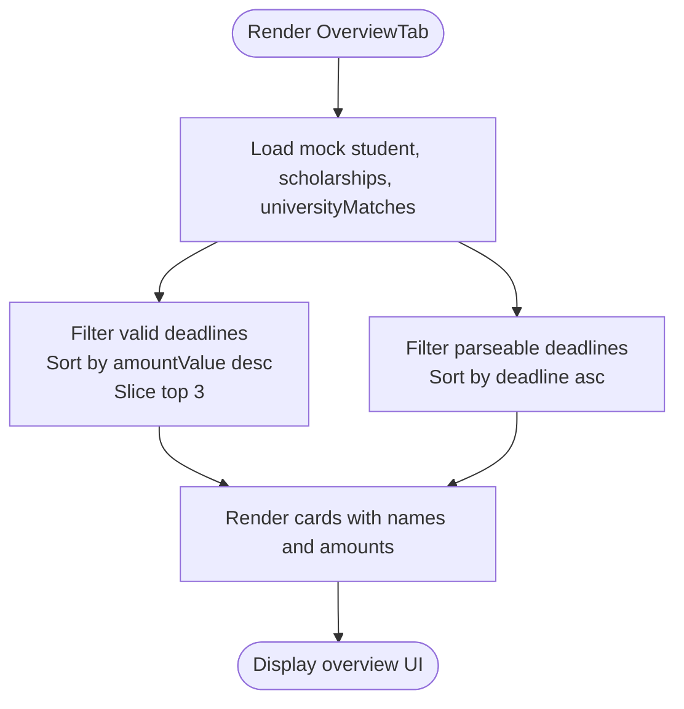

# Aggregation and Dashboard Statistics

<cite>
**Referenced Files in This Document**
- [index.js](file://aischolarpath-backend-main/aischolarpath-backend-main/index.js)
- [Dashboard.jsx](file://scholarpath-frontend (2)/scholarpath/src/pages/Dashboard.jsx)
- [mockData.js](file://scholarpath-frontend (2)/scholarpath/src/data/mockData.js)
</cite>

## Table of Contents
1. [Introduction](#introduction)
2. [Project Structure](#project-structure)
3. [Core Components](#core-components)
4. [Architecture Overview](#architecture-overview)
5. [Detailed Component Analysis](#detailed-component-analysis)
6. [Dependency Analysis](#dependency-analysis)
7. [Performance Considerations](#performance-considerations)
8. [Troubleshooting Guide](#troubleshooting-guide)
9. [Conclusion](#conclusion)

## Introduction
This document explains how the application computes dashboard statistics and aggregation queries for a user’s profile overview. It focuses on:
- The overview endpoint that calculates profile completeness metrics, match statistics, and summary counts.
- Counting records by status categories: eligible, missing requirements, not eligible.
- Calculating unique values across related records (e.g., universities covered).
- Generating top recommendations through sorting and limiting operations.
- Data transformation patterns used to convert raw database results into meaningful dashboard metrics.
- Performance considerations when working with large datasets and implementing efficient statistical calculations.

## Project Structure
The relevant implementation spans backend API endpoints and frontend components:
- Backend: Express server with Supabase integration handles authentication, data retrieval, matching logic, and aggregation for the overview endpoint.
- Frontend: React dashboard displays overview information using mock data during development; it is designed to be wired to the backend overview endpoint later.



**Diagram sources**
- [Dashboard.jsx:1-187](file://scholarpath-frontend (2)/scholarpath/src/pages/Dashboard.jsx#L1-L187)
- [mockData.js:1-349](file://scholarpath-frontend (2)/scholarpath/src/data/mockData.js#L1-L349)
- [index.js:1-800](file://aischolarpath-backend-main/aischolarpath-backend-main/index.js#L1-L800)

**Section sources**
- [Dashboard.jsx:1-187](file://scholarpath-frontend (2)/scholarpath/src/pages/Dashboard.jsx#L1-L187)
- [mockData.js:1-349](file://scholarpath-frontend (2)/scholarpath/src/data/mockData.js#L1-L349)
- [index.js:1-800](file://aischolarpath-backend-main/aischolarpath-backend-main/index.js#L1-L800)

## Core Components
- Overview endpoint: Computes profile completeness, summary counts by match status, unique university coverage, and top recommendations sorted by match score.
- Matching engine: Evaluates eligibility criteria per scholarship against profile fields and persists match results with status and evidence.
- Frontend overview tab: Displays opportunity strength, top matches, and upcoming deadlines using mock data; structured to integrate with backend overview data.

Key responsibilities:
- Authentication and authorization ensure only the profile owner can access their overview.
- Database queries fetch profile and related matches with joined details for scholarships and universities.
- In-memory transformations compute aggregates and derive top recommendations.

**Section sources**
- [index.js:694-749](file://aischolarpath-backend-main/aischolarpath-backend-main/index.js#L694-L749)
- [index.js:575-673](file://aischolarpath-backend-main/aischolarpath-backend-main/index.js#L575-L673)
- [Dashboard.jsx:72-126](file://scholarpath-frontend (2)/scholarpath/src/pages/Dashboard.jsx#L72-L126)

## Architecture Overview
The overview flow involves authenticated requests, data retrieval from Supabase tables, and aggregation in the backend before returning a concise dashboard payload.



**Diagram sources**
- [index.js:32-47](file://aischolarpath-backend-main/aischolarpath-backend-main/index.js#L32-L47)
- [index.js:694-749](file://aischolarpath-backend-main/aischolarpath-backend-main/index.js#L694-L749)

## Detailed Component Analysis

### Overview Endpoint: Profile Completeness, Summary Counts, Top Recommendations
- Profile completeness: Derived from presence of key profile fields such as CGPA, IELTS score, CV file path, and target degree.
- Summary counts:
  - Total scholarships checked equals the number of matches retrieved for the profile.
  - Eligible count: number of matches with status “Eligible”.
  - Missing requirements count: number of matches with status “Missing Requirements”.
  - Not eligible count: number of matches with status “Not Eligible”.
  - Universities covered: count of unique university IDs among matches.
- Top recommendations:
  - Sort matches by match_score descending and take the top N (three) entries.



**Diagram sources**
- [index.js:694-749](file://aischolarpath-backend-main/aischolarpath-backend-main/index.js#L694-L749)

**Section sources**
- [index.js:694-749](file://aischolarpath-backend-main/aischolarpath-backend-main/index.js#L694-L749)

### Matching Engine: Status Categories and Evidence
- For each scholarship, the engine evaluates criteria such as minimum CGPA, minimum IELTS, and required degree.
- Evidence array captures criterion, required value, actual value, and result (“Pass”, “Fail”, “Missing”).
- Status determination:
  - If any criterion fails → “Not Eligible”.
  - Else if any criterion is missing → “Missing Requirements”.
  - Else → “Eligible”.
- Match score is computed based on pass ratio across evaluated criteria.



**Diagram sources**
- [index.js:575-673](file://aischolarpath-backend-main/aischolarpath-backend-main/index.js#L575-L673)

**Section sources**
- [index.js:575-673](file://aischolarpath-backend-main/aischolarpath-backend-main/index.js#L575-L673)

### Frontend Overview Tab: Display Patterns and Data Transformation
- Uses mock data to render:
  - Opportunity bar showing profile strength and next boost suggestion.
  - Top university matches and top scholarship matches.
  - Upcoming deadlines derived from scholarships with valid dates.
- Sorting and filtering:
  - Top scholarships sorted by amount value descending and limited to three.
  - Scholarships filtered to those with parseable deadlines, then sorted by deadline ascending.
- Array operations:
  - Filtering invalid dates.
  - Sorting by numeric or date values.
  - Slicing to limit displayed items.



**Diagram sources**
- [Dashboard.jsx:72-126](file://scholarpath-frontend (2)/scholarpath/src/pages/Dashboard.jsx#L72-L126)
- [mockData.js:136-254](file://scholarpath-frontend (2)/scholarpath/src/data/mockData.js#L136-L254)

**Section sources**
- [Dashboard.jsx:72-126](file://scholarpath-frontend (2)/scholarpath/src/pages/Dashboard.jsx#L72-L126)
- [mockData.js:136-254](file://scholarpath-frontend (2)/scholarpath/src/data/mockData.js#L136-L254)

## Dependency Analysis
- Authentication middleware protects all profile-scoped endpoints, ensuring users can only access their own data.
- The overview endpoint depends on:
  - profiles table for completeness checks.
  - matches table for aggregated statistics and top recommendations.
  - scholarships and universities tables via joins to enrich match details.
- Frontend currently uses mock data but is structured to consume backend overview responses.

```mermaid
graph LR
A["authenticateToken (index.js)"] --> B["/api/profile/:id/overview (index.js)"]
B --> C["profiles (Supabase)"]
B --> D["matches (Supabase)"]
D --> E["scholarships (Supabase)"]
D --> F["universities (Supabase)"]
G["Dashboard.jsx"] --> B
```

**Diagram sources**
- [index.js:32-47](file://aischolarpath-backend-main/aischolarpath-backend-main/index.js#L32-L47)
- [index.js:694-749](file://aischolarpath-backend-main/aischolarpath-backend-main/index.js#L694-L749)

**Section sources**
- [index.js:32-47](file://aischolarpath-backend-main/aischolarpath-backend-main/index.js#L32-L47)
- [index.js:694-749](file://aischolarpath-backend-main/aischolarpath-backend-main/index.js#L694-L749)

## Performance Considerations
When scaling to larger datasets, consider these optimizations:
- Minimize payload size:
  - Select only necessary fields from profiles and matches to reduce memory usage and network transfer.
  - Avoid over-fetching unrelated columns in joins.
- Efficient aggregations:
  - Use database-level filters where possible (e.g., filter by profile_id early).
  - For counting by status, prefer SQL aggregations (COUNT with GROUP BY) instead of in-memory filtering on large arrays.
- Unique counts:
  - Compute unique university counts at the database level using DISTINCT or COUNT(DISTINCT) to avoid loading full match sets into memory.
- Sorting and limiting:
  - Apply ORDER BY and LIMIT in database queries for top recommendations rather than sorting entire arrays in memory.
- Indexing:
  - Ensure indexes on frequently filtered columns like profile_id, status, and match_score to speed up queries.
- Connection pooling:
  - Configure connection limits and timeouts appropriately for high concurrency scenarios.

[No sources needed since this section provides general guidance]

## Troubleshooting Guide
Common issues and resolutions:
- Authorization errors:
  - Ensure the JWT token is present and valid; verify that the requested profile ID matches the authenticated user ID.
- Missing data:
  - If overview returns empty or partial data, check whether matches exist for the profile and whether related scholarships/universities are linked.
- Date parsing issues:
  - When sorting by deadlines, validate that deadline strings are parseable; handle invalid dates gracefully to prevent incorrect ordering.
- Large dataset performance:
  - If overview becomes slow, move aggregations (counts, unique counts, top-N sorting) to the database layer and add appropriate indexes.

**Section sources**
- [index.js:32-47](file://aischolarpath-backend-main/aischolarpath-backend-main/index.js#L32-L47)
- [index.js:694-749](file://aischolarpath-backend-main/aischolarpath-backend-main/index.js#L694-L749)
- [Dashboard.jsx:72-126](file://scholarpath-frontend (2)/scholarpath/src/pages/Dashboard.jsx#L72-L126)

## Conclusion
The application implements a robust overview endpoint that transforms raw match data into actionable dashboard metrics. It computes profile completeness, categorizes matches by eligibility status, counts unique universities, and surfaces top recommendations. The frontend demonstrates display patterns and array-based transformations using mock data, ready to be integrated with backend responses. For production-scale performance, prioritize database-level aggregations, selective field fetching, indexing, and careful handling of large datasets.