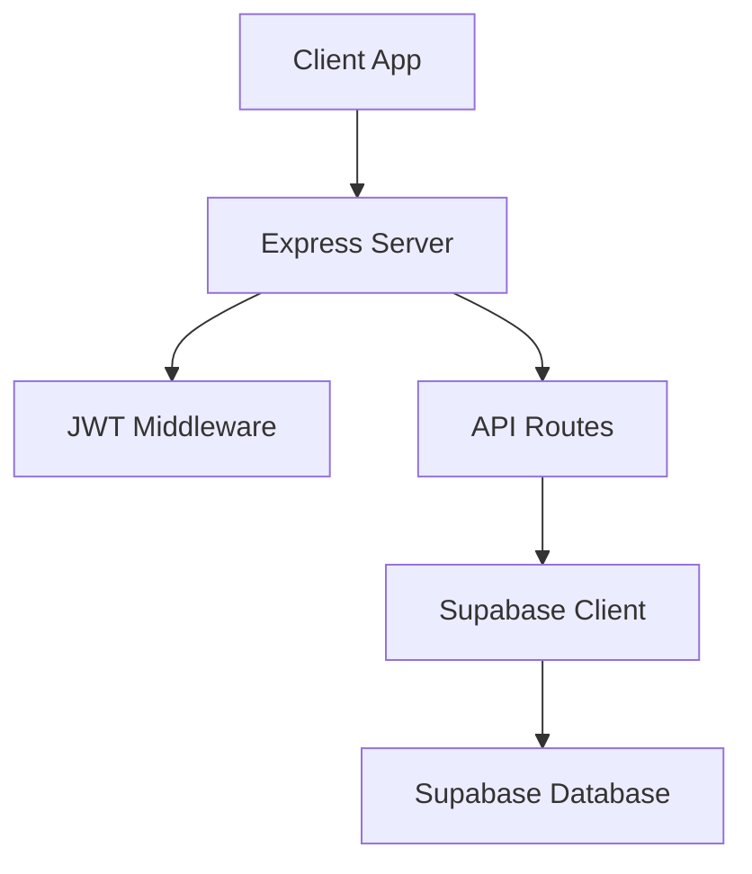
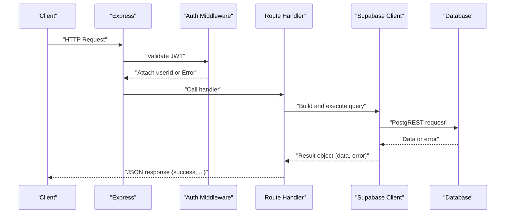
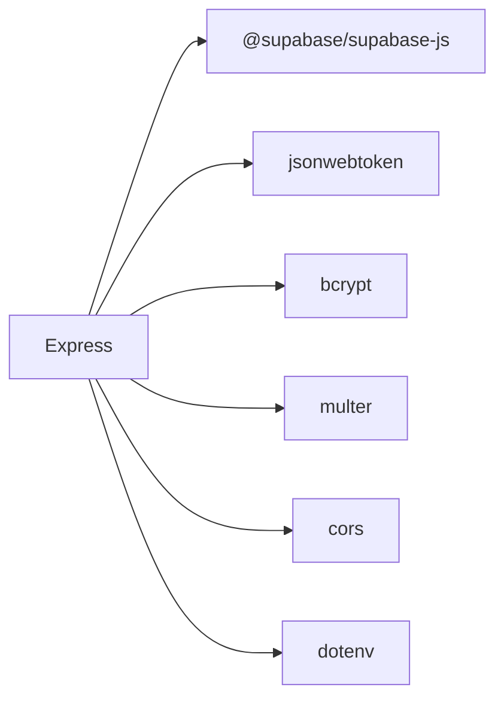

# CRUD Operations

<cite>
**Referenced Files in This Document**
- [index.js](file://aischolarpath-backend-main/aischolarpath-backend-main/index.js)
- [package.json](file://aischolarpath-backend-main/aischolarpath-backend-main/package.json)
</cite>

## Table of Contents
1. [Introduction](#introduction)
2. [Project Structure](#project-structure)
3. [Core Components](#core-components)
4. [Architecture Overview](#architecture-overview)
5. [Detailed Component Analysis](#detailed-component-analysis)
6. [Dependency Analysis](#dependency-analysis)
7. [Performance Considerations](#performance-considerations)
8. [Troubleshooting Guide](#troubleshooting-guide)
9. [Conclusion](#conclusion)

## Introduction
This document explains how the ScholarPathAI backend implements Create, Read, Update, and Delete (CRUD) operations using the Supabase client. It focuses on standard patterns for working with profiles, scholarships, universities, matches, and shortlist entities. You will find consistent examples of query construction, parameter validation, error handling, and a uniform API response structure across endpoints. Authentication middleware is integrated to protect user-scoped resources.

## Project Structure
The backend is an Express application that:
- Initializes environment variables and validates required configuration at startup.
- Sets up CORS, JSON parsing, and file upload handling.
- Creates a single Supabase client instance used by all routes.
- Defines route handlers for authentication, profile management, scholarship listing, university search, matching, shortlisting, applications, notifications, discovery tools, and more.

**Diagram sources**
- [index.js:1-54](file://aischolarpath-backend-main/aischolarpath-backend-main/index.js#L1-L54)

**Section sources**
- [index.js:1-54](file://aischolarpath-backend-main/aischolarpath-backend-main/index.js#L1-L54)
- [package.json:1-13](file://aischolarpath-backend-main/aischolarpath-backend-main/package.json#L1-L13)

## Core Components
- Supabase client initialization: A single client is created using environment variables for URL and key. All database interactions go through this client.
- Authentication middleware: Validates JWT tokens from the Authorization header and attaches the decoded user id to requests.
- Route handlers: Implement CRUD operations for multiple tables with consistent validation, error handling, and response formatting.

Key implementation references:
- Supabase client setup and usage across routes
- JWT-based authentication middleware
- Consistent success/error responses

**Section sources**
- [index.js:27-54](file://aischolarpath-backend-main/aischolarpath-backend-main/index.js#L27-L54)
- [index.js:32-47](file://aischolarpath-backend-main/aischolarpath-backend-main/index.js#L32-L47)

## Architecture Overview
The system follows a layered approach:
- HTTP layer (Express): Receives requests, applies middleware, and delegates to route handlers.
- Business logic layer (route handlers): Validates inputs, enforces authorization, builds queries, and handles errors.
- Data access layer (Supabase client): Executes PostgREST queries against the database.

**Diagram sources**
- [index.js:32-47](file://aischolarpath-backend-main/aischolarpath-backend-main/index.js#L32-L47)
- [index.js:50-68](file://aischolarpath-backend-main/aischolarpath-backend-main/index.js#L50-L68)

## Detailed Component Analysis

### Profiles CRUD
- Create: User signup inserts a new profile row and returns a JWT token.
- Read: Retrieve a specific profile by id; requires authorization and ownership check.
- Update: Patch own profile fields; only updates provided fields and targets the authenticated user’s id.
- Delete: Not exposed directly for profiles; related deletions occur via dependent resources.

Patterns demonstrated:
- Parameter validation before DB calls
- Ownership checks using req.userId
- Selecting minimal fields where appropriate
- Returning standardized success payloads

Example references:
- Signup insert and token issuance
- Profile update with selective field updates
- Profile read with single() and authorization guard

**Section sources**
- [index.js:519-540](file://aischolarpath-backend-main/aischolarpath-backend-main/index.js#L519-L540)
- [index.js:94-110](file://aischolarpath-backend-main/aischolarpath-backend-main/index.js#L94-L110)
- [index.js:70-91](file://aischolarpath-backend-main/aischolarpath-backend-main/index.js#L70-L91)

### Scholarships Listing and Filtering
- List: Supports filtering by country, type, department, and degree level; joins university details.
- Read: Fetch a single scholarship by id with related university info.

Patterns demonstrated:
- Dynamic query building based on optional query parameters
- Joins to enrich results with related data
- Consistent error handling and success wrapping

Example references:
- Filtered list endpoint with conditional .eq() clauses
- Single scholarship retrieval with join and single()

**Section sources**
- [index.js:189-222](file://aischolarpath-backend-main/aischolarpath-backend-main/index.js#L189-L222)

### Universities Search
- List: Filters by country, degree program array containment, and case-insensitive name search; includes both direct university scholarships and country-wide scholarships.
- Read: Get a single university by id.

Patterns demonstrated:
- Array containment filtering for multi-value fields
- Case-insensitive search using ilike
- Combining multiple data sources to compute eligibility coverage

Example references:
- University listing with filters and dual queries for direct and country-wide scholarships
- Single university retrieval

**Section sources**
- [index.js:224-288](file://aischolarpath-backend-main/aischolarpath-backend-main/index.js#L224-L288)

### Matches Management
- Create: Compute match scores for a profile against active scholarships, then clear old matches and insert fresh results.
- Read: Retrieve stored matches for a profile, ordered by score, including scholarship and university details.

Patterns demonstrated:
- Complex business logic to evaluate eligibility criteria
- Bulk delete followed by bulk insert for consistency
- Enriched reads with joins to display context

Example references:
- Match computation and insertion flow
- Retrieval of matches with related data

**Section sources**
- [index.js:575-692](file://aischolarpath-backend-main/aischolarpath-backend-main/index.js#L575-L692)

### Shortlist CRUD
- Create: Add an item (scholarship or university) to a user’s shortlist with input validation.
- Read: Retrieve a user’s shortlist items and resolve related scholarship/university records.
- Delete: Remove a shortlist item by id.

Patterns demonstrated:
- Input validation for required fields and allowed values
- Conditional enrichment queries based on item types
- Standardized deletion response

Example references:
- Insert into shortlist with validation
- Resolve related items by ids
- Delete by id

**Section sources**
- [index.js:751-820](file://aischolarpath-backend-main/aischolarpath-backend-main/index.js#L751-L820)
- [index.js:774-783](file://aischolarpath-backend-main/aischolarpath-backend-main/index.js#L774-L783)

### Applications CRUD
- Create: Start tracking an application for a profile with optional status and notes.
- Read: List all applications for a profile with related scholarship details.
- Update: Update status, notes, next action, and dates with ownership verification.
- Delete: Remove an application with ownership verification.

Patterns demonstrated:
- Ownership checks before mutation
- Partial updates with explicit updated_at timestamp
- Enriched reads with joins

Example references:
- Application creation and retrieval
- Update and delete with authorization guards

**Section sources**
- [index.js:822-932](file://aischolarpath-backend-main/aischolarpath-backend-main/index.js#L822-L932)

### Notifications CRUD
- Create: Insert a notification for a profile with required fields validated.
- Read: List notifications for a profile ordered by creation time.
- Update: Mark a notification as read with ownership verification.

Patterns demonstrated:
- Required field validation
- Ordered retrieval
- Ownership checks prior to updates

Example references:
- Notification creation and listing
- Mark-as-read update with authorization

**Section sources**
- [index.js:983-1051](file://aischolarpath-backend-main/aischolarpath-backend-main/index.js#L983-L1051)

### Authentication Endpoints
- Login: Verifies credentials and issues a JWT token.
- Forgot password: Generates a reset token and stores it securely.
- Reset password: Validates token and updates password.

Patterns demonstrated:
- Secure credential handling
- Token generation and expiry management
- Safe responses that do not leak user existence

Example references:
- Login flow with bcrypt comparison and JWT issuance
- Password reset flows with token validation

**Section sources**
- [index.js:543-573](file://aischolarpath-backend-main/aischolarpath-backend-main/index.js#L543-L573)
- [index.js:1102-1181](file://aischolarpath-backend-main/aischolarpath-backend-main/index.js#L1102-L1181)

### Discovery Tools (Bonus)
- Scrape and structure scholarship pages, upserting into scholarships table with pattern matching.
- View logs and approve pending scholarships.

Patterns demonstrated:
- External HTTP fetching with Cheerio parsing
- Upsert operations to avoid duplicates
- Status transitions for review workflows

Example references:
- Scrape-and-structure upserts
- Approve endpoint to mark scholarships active

**Section sources**
- [index.js:1311-1493](file://aischolarpath-backend-main/aischolarpath-backend-main/index.js#L1311-L1493)
- [index.js:1495-1526](file://aischolarpath-backend-main/aischolarpath-backend-main/index.js#L1495-L1526)

## Dependency Analysis
The backend depends on:
- Express for routing and middleware
- @supabase/supabase-js for database operations
- jsonwebtoken for issuing and verifying JWTs
- bcrypt for password hashing
- multer for file uploads
- cors for cross-origin requests
- dotenv for environment variable loading

**Diagram sources**
- [package.json:1-13](file://aischolarpath-backend-main/aischolarpath-backend-main/package.json#L1-L13)

**Section sources**
- [package.json:1-13](file://aischolarpath-backend-main/aischolarpath-backend-main/package.json#L1-L13)

## Performance Considerations
- Connection pooling: The server configures a global dispatcher with connection limits and timeouts to manage outbound connections efficiently.
- Query optimization: Use selective selects and joins only when necessary; filter early to reduce payload size.
- Rate limiting and delays: Some discovery endpoints introduce delays between requests to be polite to external sites.
- Batch operations: Prefer bulk inserts and deletes where possible to minimize round trips.

[No sources needed since this section provides general guidance]

## Troubleshooting Guide
Common issues and resolutions:
- Missing environment variables: The server exits at startup if SUPABASE_URL, SUPABASE_KEY, or JWT_SECRET are not set. Ensure these are configured before running.
- Authentication failures: Verify the Authorization header contains a valid Bearer token; invalid or expired tokens return 401/403.
- Database errors: All Supabase calls return structured errors; inspect the error.message in responses and check network connectivity and permissions.
- File uploads: Ensure multipart/form-data is used and the correct field name is sent; missing files result in 400 errors.

Standard error handling pattern:
- Validate inputs first
- Execute Supabase operation
- If error exists, respond with 4xx/5xx and { success: false, error: message }
- Otherwise, respond with { success: true, ...data }

**Section sources**
- [index.js:5-10](file://aischolarpath-backend-main/aischolarpath-backend-main/index.js#L5-L10)
- [index.js:32-47](file://aischolarpath-backend-main/aischolarpath-backend-main/index.js#L32-L47)
- [index.js:1528-1531](file://aischolarpath-backend-main/aischolarpath-backend-main/index.js#L1528-L1531)

## Conclusion
The ScholarPathAI backend demonstrates robust CRUD operations over multiple tables using a consistent pattern: validate inputs, enforce authorization, build precise Supabase queries, handle errors uniformly, and return standardized JSON responses. These patterns ensure maintainability, clarity, and reliability across features such as profiles, scholarships, universities, matches, shortlists, applications, and notifications.

[No sources needed since this section summarizes without analyzing specific files]