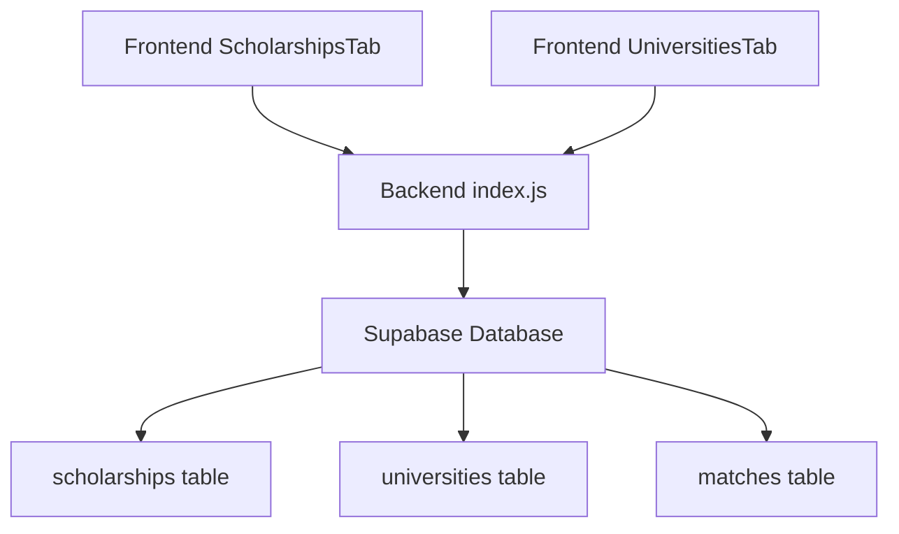
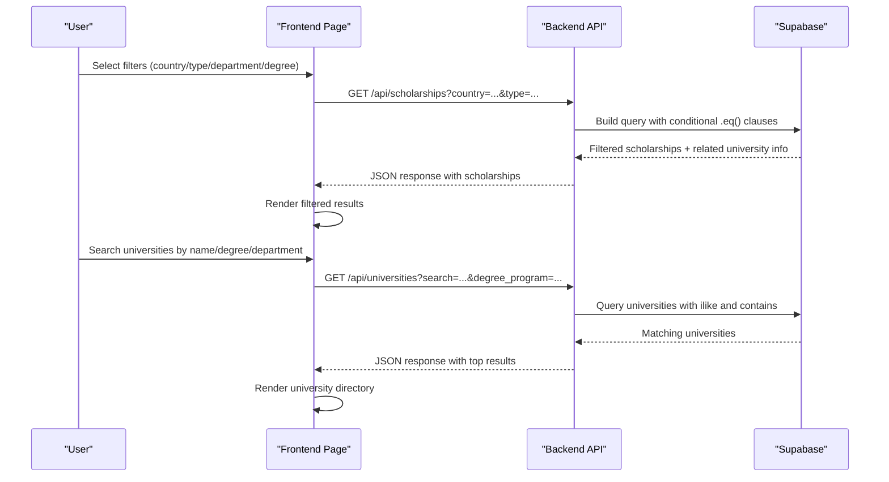
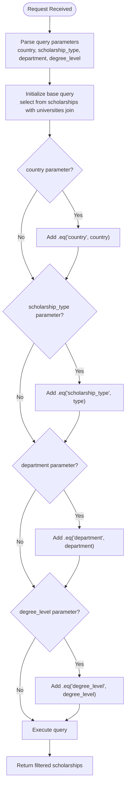
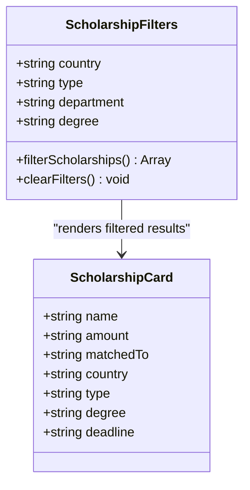
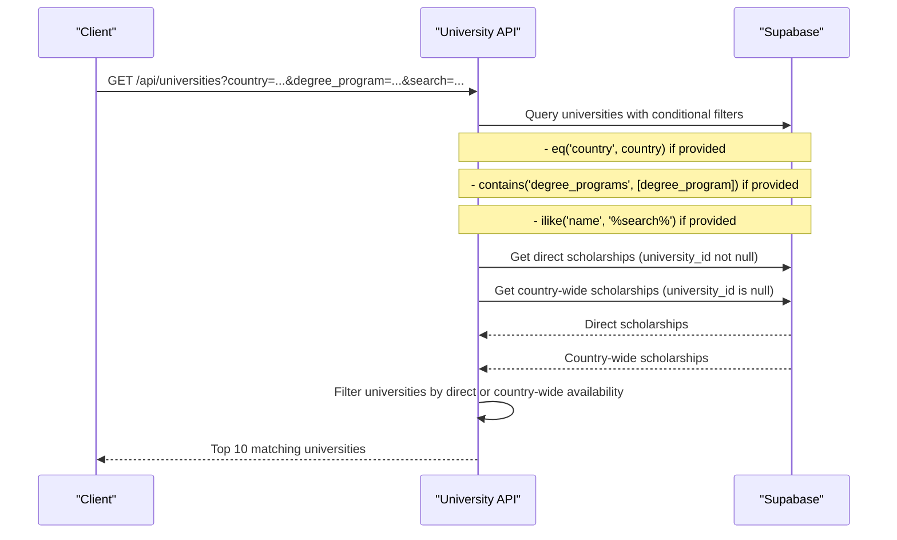
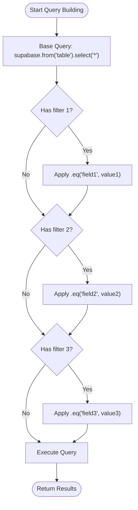
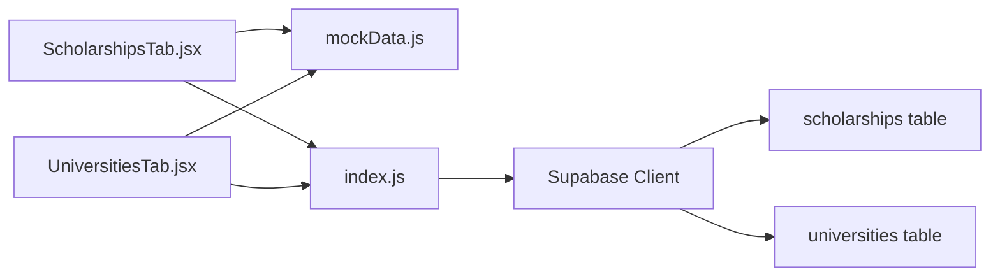

# Complex Filtering Queries

<cite>
**Referenced Files in This Document**
- [index.js](file://aischolarpath-backend-main/aischolarpath-backend-main/index.js)
- [ScholarshipsTab.jsx](file://scholarpath-frontend (2)/scholarpath/src/pages/ScholarshipsTab.jsx)
- [UniversitiesTab.jsx](file://scholarpath-frontend (2)/scholarpath/src/pages/UniversitiesTab.jsx)
- [mockData.js](file://scholarpath-frontend (2)/scholarpath/src/data/mockData.js)
</cite>

## Table of Contents
1. [Introduction](#introduction)
2. [Project Structure](#project-structure)
3. [Core Components](#core-components)
4. [Architecture Overview](#architecture-overview)
5. [Detailed Component Analysis](#detailed-component-analysis)
6. [Dependency Analysis](#dependency-analysis)
7. [Performance Considerations](#performance-considerations)
8. [Troubleshooting Guide](#troubleshooting-guide)
9. [Conclusion](#conclusion)

## Introduction
This document explains how complex filtering and conditional queries are implemented across the application, focusing on:
- Multiple WHERE conditions applied dynamically based on request parameters
- JOIN operations between related tables using Supabase’s relational select syntax
- Array field filtering with containment checks
- Dynamic query building that only applies filters when parameters are provided
- The scholarship filtering system combining country, type, department, and degree level filters
- University search functionality supporting partial text matching and array containment

The goal is to provide both a conceptual understanding and code-level references for efficient query optimization patterns used in this project.

## Project Structure
The filtering logic spans two layers:
- Frontend pages demonstrate client-side filtering patterns and UI-driven filter states
- Backend API routes implement server-side dynamic queries against Supabase, including joins and array filters

**Diagram sources**
- [ScholarshipsTab.jsx:59-139](file://scholarpath-frontend (2)/scholarpath/src/pages/ScholarshipsTab.jsx#L59-L139)
- [UniversitiesTab.jsx:73-163](file://scholarpath-frontend (2)/scholarpath/src/pages/UniversitiesTab.jsx#L73-L163)
- [index.js:189-271](file://aischolarpath-backend-main/aischolarpath-backend-main/index.js#L189-L271)

**Section sources**
- [ScholarshipsTab.jsx:59-139](file://scholarpath-frontend (2)/scholarpath/src/pages/ScholarshipsTab.jsx#L59-L139)
- [UniversitiesTab.jsx:73-163](file://scholarpath-frontend (2)/scholarpath/src/pages/UniversitiesTab.jsx#L73-L163)
- [index.js:189-271](file://aischolarpath-backend-main/aischolarpath-backend-main/index.js#L189-L271)

## Core Components
Key components implementing filtering and conditional queries:
- Backend scholarships listing endpoint with dynamic WHERE clauses and relational selects
- Backend universities listing endpoint with array containment and ilike search
- Frontend scholarship filtering UI demonstrating multiple optional filters
- Frontend university directory filtering with array-based department and degree checks

These components illustrate:
- Conditional query construction: only apply filters when parameters exist
- Relational data retrieval: selecting related entities via nested select
- Array filtering: using contains for array fields
- Text search: using ilike for case-insensitive partial matches

**Section sources**
- [index.js:189-206](file://aischolarpath-backend-main/aischolarpath-backend-main/index.js#L189-L206)
- [index.js:224-271](file://aischolarpath-backend-main/aischolarpath-backend-main/index.js#L224-L271)
- [ScholarshipsTab.jsx:59-139](file://scholarpath-frontend (2)/scholarpath/src/pages/ScholarshipsTab.jsx#L59-L139)
- [UniversitiesTab.jsx:73-163](file://scholarpath-frontend (2)/scholarpath/src/pages/UniversitiesTab.jsx#L73-L163)

## Architecture Overview
The filtering architecture combines frontend state management with backend dynamic query building:

**Diagram sources**
- [ScholarshipsTab.jsx:59-139](file://scholarpath-frontend (2)/scholarpath/src/pages/ScholarshipsTab.jsx#L59-L139)
- [index.js:189-206](file://aischolarpath-backend-main/aischolarpath-backend-main/index.js#L189-L206)
- [index.js:224-271](file://aischolarpath-backend-main/aischolarpath-backend-main/index.js#L224-L271)

## Detailed Component Analysis

### Scholarship Filtering System
The scholarship filtering system demonstrates multiple conditional WHERE conditions combined with relational data retrieval:

#### Backend Implementation
The `/api/scholarships` endpoint builds dynamic queries based on request parameters:

**Diagram sources**
- [index.js:189-206](file://aischolarpath-backend-main/aischolarpath-backend-main/index.js#L189-L206)

#### Frontend Implementation
The frontend provides a user interface for filtering scholarships with four independent filter options:

**Diagram sources**
- [ScholarshipsTab.jsx:59-139](file://scholarpath-frontend (2)/scholarpath/src/pages/ScholarshipsTab.jsx#L59-L139)

**Section sources**
- [index.js:189-206](file://aischolarpath-backend-main/aischolarpath-backend-main/index.js#L189-L206)
- [ScholarshipsTab.jsx:59-139](file://scholarpath-frontend (2)/scholarpath/src/pages/ScholarshipsTab.jsx#L59-L139)

### University Search Functionality
The university search implements advanced filtering techniques including partial text matching and array containment:

#### Backend Implementation
The `/api/universities` endpoint combines multiple filtering strategies:

**Diagram sources**
- [index.js:224-271](file://aischolarpath-backend-main/aischolarpath-backend-main/index.js#L224-L271)

#### Key Filtering Techniques
- **Array Containment**: Uses `contains('degree_programs', [degree_program])` to check if an array field contains a specific value
- **Partial Text Matching**: Uses `ilike('name', '%${search}%')` for case-insensitive substring matching
- **Conditional Application**: Filters are only applied when corresponding parameters are present
- **Multi-source Filtering**: Combines direct university scholarships with country-wide scholarships

**Section sources**
- [index.js:224-271](file://aischolarpath-backend-main/aischolarpath-backend-main/index.js#L224-L271)
- [UniversitiesTab.jsx:73-163](file://scholarpath-frontend (2)/scholarpath/src/pages/UniversitiesTab.jsx#L73-L163)

### Advanced Query Patterns

#### Multiple WHERE Conditions
The application demonstrates how to combine multiple conditional filters efficiently:

**Diagram sources**
- [index.js:189-206](file://aischolarpath-backend-main/aischolarpath-backend-main/index.js#L189-L206)

#### JOIN Operations Between Related Tables
The system uses Supabase's relational select syntax to fetch related data:

- **Scholarship-University Joins**: `select('*, universities(name, official_portal_url)')` retrieves scholarship data along with related university information
- **Nested Relationships**: Enables fetching complete entity graphs in single queries

#### Array Field Filtering
Array containment filtering allows efficient querying of multi-valued fields:

- **Pattern**: `contains('array_field', [value])` checks if an array contains a specific element
- **Use Case**: Filtering universities by degree programs where each university offers multiple degrees

**Section sources**
- [index.js:189-206](file://aischolarpath-backend-main/aischolarpath-backend-main/index.js#L189-L206)
- [index.js:224-271](file://aischolarpath-backend-main/aischolarpath-backend-main/index.js#L224-L271)

## Dependency Analysis
The filtering system has clear dependencies between components:

**Diagram sources**
- [ScholarshipsTab.jsx:1-139](file://scholarpath-frontend (2)/scholarpath/src/pages/ScholarshipsTab.jsx#L1-L139)
- [UniversitiesTab.jsx:1-163](file://scholarpath-frontend (2)/scholarpath/src/pages/UniversitiesTab.jsx#L1-L163)
- [index.js:189-271](file://aischolarpath-backend-main/aischolarpath-backend-main/index.js#L189-L271)

**Section sources**
- [ScholarshipsTab.jsx:1-139](file://scholarpath-frontend (2)/scholarpath/src/pages/ScholarshipsTab.jsx#L1-L139)
- [UniversitiesTab.jsx:1-163](file://scholarpath-frontend (2)/scholarpath/src/pages/UniversitiesTab.jsx#L1-L163)
- [index.js:189-271](file://aischolarpath-backend-main/aischolarpath-backend-main/index.js#L189-L271)

## Performance Considerations
Several performance optimization patterns are implemented:

- **Conditional Query Building**: Filters are only added to queries when parameters are provided, reducing unnecessary database operations
- **Result Limiting**: Both endpoints limit results to top 10 items to reduce payload size
- **Efficient Array Operations**: Using `contains()` for array filtering instead of client-side filtering
- **Relational Data Fetching**: Using Supabase's built-in joins to minimize network requests
- **Memoization**: Frontend uses `useMemo` to compute filter options efficiently

## Troubleshooting Guide
Common issues and solutions for filtering queries:

### Query Parameter Issues
- **Empty Parameters**: Ensure proper handling of empty string vs undefined values
- **Case Sensitivity**: Use `ilike` for case-insensitive text searches
- **Array Format**: Verify array parameters are properly formatted for `contains()` operations

### Database Connection Problems
- **Environment Variables**: Ensure SUPABASE_URL and SUPABASE_KEY are properly configured
- **Table Permissions**: Verify Row Level Security policies allow the required operations
- **Index Usage**: Consider adding database indexes for frequently filtered columns

### Frontend Filtering Issues
- **State Management**: Ensure filter state is properly reset when clearing filters
- **Data Loading**: Handle loading states during async filter operations
- **Error Handling**: Implement proper error boundaries for failed queries

**Section sources**
- [index.js:189-271](file://aischolarpath-backend-main/aischolarpath-backend-main/index.js#L189-L271)
- [ScholarshipsTab.jsx:59-139](file://scholarpath-frontend (2)/scholarpath/src/pages/ScholarshipsTab.jsx#L59-L139)
- [UniversitiesTab.jsx:73-163](file://scholarpath-frontend (2)/scholarpath/src/pages/UniversitiesTab.jsx#L73-L163)

## Conclusion
The application demonstrates sophisticated filtering and query building patterns that scale well for complex use cases. Key strengths include:

- **Dynamic Query Construction**: Efficiently builds queries based on available parameters
- **Advanced Filtering Techniques**: Implements array containment, partial text matching, and multiple conditional filters
- **Relational Data Access**: Leverages Supabase's capabilities for fetching related data
- **Performance Optimization**: Minimizes database operations and payload sizes
- **User Experience**: Provides intuitive filtering interfaces with clear feedback

These patterns serve as excellent examples for implementing complex filtering systems in modern web applications using Supabase as the database layer.