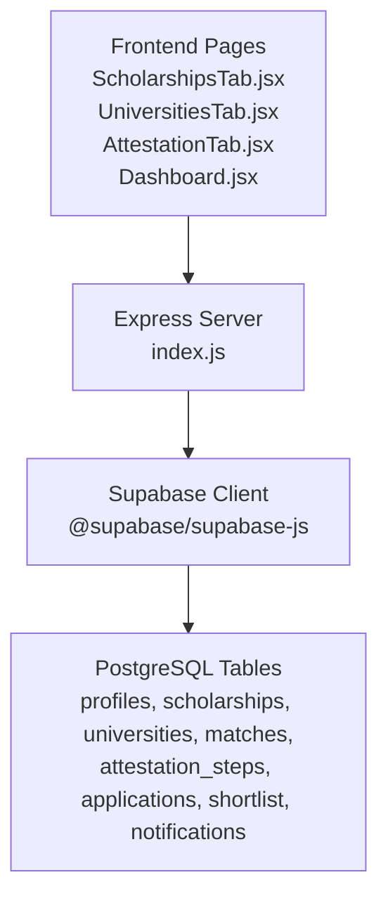
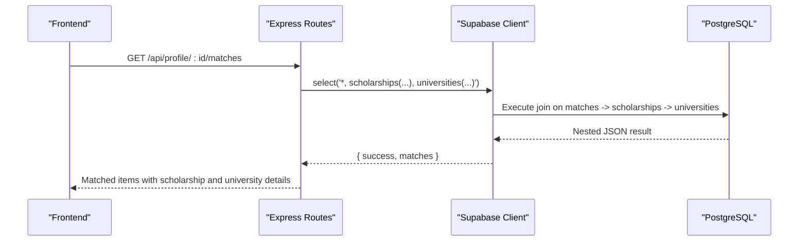
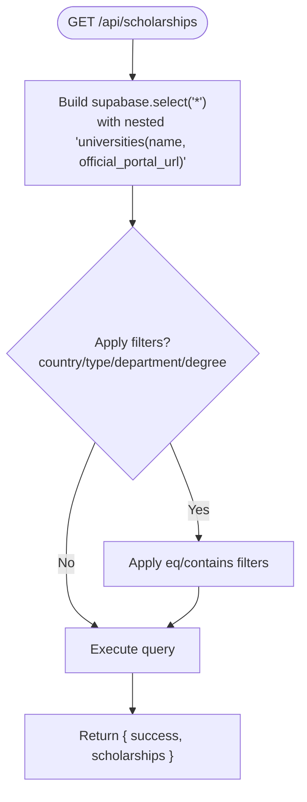
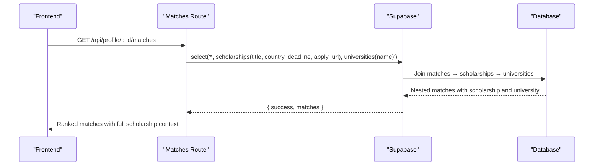
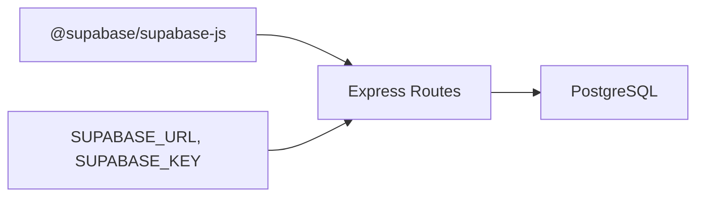

# JOIN Operations and Data Relationships

<cite>
**Referenced Files in This Document**
- [index.js](file://aischolarpath-backend-main/aischolarpath-backend-main/index.js)
- [package.json](file://aischolarpath-backend-main/aischolarpath-backend-main/package.json)
- [ScholarshipsTab.jsx](file://scholarpath-frontend (2)/scholarpath/src/pages/ScholarshipsTab.jsx)
- [UniversitiesTab.jsx](file://scholarpath-frontend (2)/scholarpath/src/pages/UniversitiesTab.jsx)
- [AttestationTab.jsx](file://scholarpath-frontend (2)/scholarpath/src/pages/AttestationTab.jsx)
- [Dashboard.jsx](file://scholarpath-frontend (2)/scholarpath/src/pages/Dashboard.jsx)
- [mockData.js](file://scholarpath-frontend (2)/scholarpath/src/data/mockData.js)
</cite>

## Table of Contents
1. [Introduction](#introduction)
2. [Project Structure](#project-structure)
3. [Core Components](#core-components)
4. [Architecture Overview](#architecture-overview)
5. [Detailed Component Analysis](#detailed-component-analysis)
6. [Dependency Analysis](#dependency-analysis)
7. [Performance Considerations](#performance-considerations)
8. [Troubleshooting Guide](#troubleshooting-guide)
9. [Conclusion](#conclusion)

## Introduction
This document explains how ScholarPathAI performs relational queries across profiles, scholarships, universities, and matches using Supabase’s select syntax with nested relationships. It covers:
- Retrieving scholarships with their associated university details
- Fetching matches with complete scholarship information
- Querying attestation steps with profile context
- Selective field selection to optimize performance
- Handling null relationships and complex data structures returned from joins
- Best practices to avoid N+1 query problems and optimize retrieval patterns

The backend is an Express server that uses the Supabase JavaScript client to build efficient relational queries. The frontend currently uses mock data for UI demonstration; the backend endpoints are designed to serve rich, joined datasets when integrated.

## Project Structure
- Backend: Express API with Supabase integration for relational data access
- Frontend: React pages that consume or will consume backend endpoints for profiles, scholarships, universities, matches, and attestation steps

**Diagram sources**
- [index.js:27-54](file://aischolarpath-backend-main/aischolarpath-backend-main/index.js#L27-L54)
- [package.json:3-3](file://aischolarpath-backend-main/aischolarpath-backend-main/package.json#L3-L3)

**Section sources**
- [index.js:1-54](file://aischolarpath-backend-main/aischolarpath-backend-main/index.js#L1-L54)
- [package.json:1-14](file://aischolarpath-backend-main/aischolarpath-backend-main/package.json#L1-L14)

## Core Components
- Relational query endpoints for scholarships, universities, matches, applications, and attestation steps
- Profile-driven matching and overview aggregation
- Authentication middleware protecting user-scoped data access
- Selective field projection in Supabase selects to reduce payload size

Key responsibilities:
- Build supabase.select() chains with nested relations to fetch related entities in a single request
- Filter and order results efficiently on the server side
- Return structured responses suitable for frontend consumption

**Section sources**
- [index.js:189-222](file://aischolarpath-backend-main/aischolarpath-backend-main/index.js#L189-L222)
- [index.js:224-288](file://aischolarpath-backend-main/aischolarpath-backend-main/index.js#L224-L288)
- [index.js:675-692](file://aischolarpath-backend-main/aischolarpath-backend-main/index.js#L675-L692)
- [index.js:886-905](file://aischolarpath-backend-main/aischolarpath-backend-main/index.js#L886-L905)
- [index.js:466-486](file://aischolarpath-backend-main/aischolarpath-backend-main/index.js#L466-L486)

## Architecture Overview
The application follows a layered architecture:
- Frontend pages render UI and call backend endpoints
- Backend routes validate requests, enforce authentication, and build Supabase queries
- Supabase executes SQL joins based on foreign key relationships and returns nested JSON payloads
- Frontend consumes normalized or denormalized structures as needed

**Diagram sources**
- [index.js:675-692](file://aischolarpath-backend-main/aischolarpath-backend-main/index.js#L675-L692)

## Detailed Component Analysis

### Scholarships with University Details
- Endpoint: GET /api/scholarships
- Behavior: Builds a query selecting all scholarship fields and nested university fields (name, official portal URL). Supports filtering by country, type, department, and degree level.
- Join pattern: scholarships → universities via foreign key relationship
- Output: Array of scholarships, each containing a nested university object with selected fields

**Diagram sources**
- [index.js:189-206](file://aischolarpath-backend-main/aischolarpath-backend-main/index.js#L189-L206)

**Section sources**
- [index.js:189-206](file://aischolarpath-backend-main/aischolarpath-backend-main/index.js#L189-L206)

### Single Scholarship with University Details
- Endpoint: GET /api/scholarships/:id
- Behavior: Retrieves one scholarship with nested university fields and returns a single object
- Use case: Detail views where only one scholarship is shown

**Section sources**
- [index.js:208-222](file://aischolarpath-backend-main/aischolarpath-backend-main/index.js#L208-L222)

### Universities Listing with Filtering
- Endpoint: GET /api/universities
- Behavior: Queries universities with optional filters (country, degree program, search). Also computes which universities have direct scholarships or country-wide scholarships by querying scholarships separately and filtering in-memory.
- Note: This endpoint demonstrates a hybrid approach—server-side filtering plus client-like filtering after fetching base sets. For large datasets, consider pushing more logic into Supabase joins or using Postgres functions.

**Section sources**
- [index.js:224-271](file://aischolarpath-backend-main/aischolarpath-backend-main/index.js#L224-L271)

### Matches with Complete Scholarship Information
- Endpoint: GET /api/profile/:id/matches
- Behavior: Retrieves matches for a profile and includes nested scholarship details (title, country, deadline, apply URL) and university name. Orders by match score descending.
- Join pattern: matches → scholarships → universities
- Output: Array of matches enriched with scholarship and university info

**Diagram sources**
- [index.js:675-692](file://aischolarpath-backend-main/aischolarpath-backend-main/index.js#L675-L692)

**Section sources**
- [index.js:675-692](file://aischolarpath-backend-main/aischolarpath-backend-main/index.js#L675-L692)

### Attestation Steps with Profile Context
- Endpoints:
  - POST /api/attestation/:authority/init/:profileId — initializes tracked steps for a profile
  - GET /api/attestation/profile/:profileId — retrieves steps ordered by authority and step order
  - PATCH /api/attestation/:id/complete — marks a step done
- Behavior: Attaches steps to a specific profile and ensures authorization checks. While this example does not use nested selects, it demonstrates profile-scoped data management and can be extended to include profile context via joins if needed.

**Section sources**
- [index.js:437-486](file://aischolarpath-backend-main/aischolarpath-backend-main/index.js#L437-L486)
- [index.js:488-517](file://aischolarpath-backend-main/aischolarpath-backend-main/index.js#L488-L517)

### Applications with Scholarship Details
- Endpoint: GET /api/applications/:profileId
- Behavior: Retrieves applications for a profile with nested scholarship details (title, country, deadline, apply URL). Orders by updated timestamp.
- Join pattern: applications → scholarships

**Section sources**
- [index.js:886-905](file://aischolarpath-backend-main/aischolarpath-backend-main/index.js#L886-L905)

### Overview Aggregation Using Joined Data
- Endpoint: GET /api/profile/:id/overview
- Behavior: Fetches profile and matches with nested scholarship and university details, then aggregates counts and top recommendations. Demonstrates combining relational data to produce summary metrics.

**Section sources**
- [index.js:693-749](file://aischolarpath-backend-main/aischolarpath-backend-main/index.js#L693-L749)

### Matching Engine and Evidence Generation
- Endpoint: POST /api/profile/:id/match-scholarships
- Behavior: Reads profile, queries active scholarships (optionally filtered by target country), evaluates eligibility criteria against profile fields, computes match scores and status, clears old matches, and inserts new matches.
- Output: Stored matches used by other endpoints to provide joined data later.

**Section sources**
- [index.js:574-673](file://aischolarpath-backend-main/aischolarpath-backend-main/index.js#L574-L673)

## Dependency Analysis
- External dependency: @supabase/supabase-js enables relational queries via select chaining
- Environment variables: SUPABASE_URL, SUPABASE_KEY required at startup
- Authentication: JWT middleware protects user-scoped endpoints and enforces ownership checks before database operations

**Diagram sources**
- [package.json:3-3](file://aischolarpath-backend-main/aischolarpath-backend-main/package.json#L3-L3)
- [index.js:5-10](file://aischolarpath-backend-main/aischolarpath-backend-main/index.js#L5-L10)
- [index.js:27-54](file://aischolarpath-backend-main/aischolarpath-backend-main/index.js#L27-L54)

**Section sources**
- [package.json:1-14](file://aischolarpath-backend-main/aischolarpath-backend-main/package.json#L1-L14)
- [index.js:1-54](file://aischolarpath-backend-main/aischolarpath-backend-main/index.js#L1-L54)

## Performance Considerations
- Prefer selective field projection: Always specify only the fields you need in nested selects (e.g., scholarships(title, country, deadline, apply_url)) to minimize payload size and network overhead.
- Avoid N+1 queries: Use Supabase nested selects to fetch related data in a single request rather than making multiple calls per item.
- Order and limit strategically: Apply .order() and .limit() where appropriate to reduce processing on the frontend and improve perceived performance.
- Handle null relationships gracefully: Some scholarships may not have a university_id; ensure your code handles cases where nested objects might be null or missing fields.
- Batch operations: When updating or inserting many rows (e.g., clearing and reinserting matches), perform bulk operations to reduce round trips.
- Caching considerations: For read-heavy endpoints like scholarships listing, consider caching strategies at the CDN or API layer to reduce database load.

[No sources needed since this section provides general guidance]

## Troubleshooting Guide
Common issues and resolutions:
- Missing environment variables: Ensure SUPABASE_URL and SUPABASE_KEY are set; the server validates these at startup and exits if missing.
- Authorization errors: Verify that authenticated requests include a valid JWT and that the requested resource belongs to the current user (profile_id checks).
- Null or undefined nested data: When accessing nested objects (e.g., m.scholarships?.deadline), always guard against nulls to prevent runtime errors.
- Unexpected empty results: Check filters applied to queries (country, type, department, degree_level) and confirm data exists in the database.
- Large payloads: If responses are too large, refine select projections to include only necessary fields.

**Section sources**
- [index.js:5-10](file://aischolarpath-backend-main/aischolarpath-backend-main/index.js#L5-L10)
- [index.js:32-47](file://aischolarpath-backend-main/aischolarpath-backend-main/index.js#L32-L47)
- [index.js:675-692](file://aischolarpath-backend-main/aischolarpath-backend-main/index.js#L675-L692)

## Conclusion
ScholarPathAI leverages Supabase’s relational capabilities through carefully constructed select chains to retrieve rich, joined datasets in minimal requests. By projecting only needed fields, ordering and limiting results, and handling null relationships, the application maintains performance and reliability. The documented endpoints demonstrate best practices for avoiding N+1 queries and structuring responses for efficient frontend consumption. As the frontend integrates with these endpoints, consistent patterns for joins and selective projections will ensure scalable data retrieval across profiles, scholarships, universities, matches, and attestation workflows.

[No sources needed since this section summarizes without analyzing specific files]