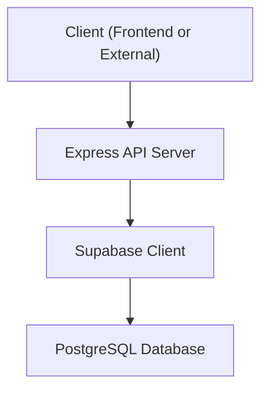
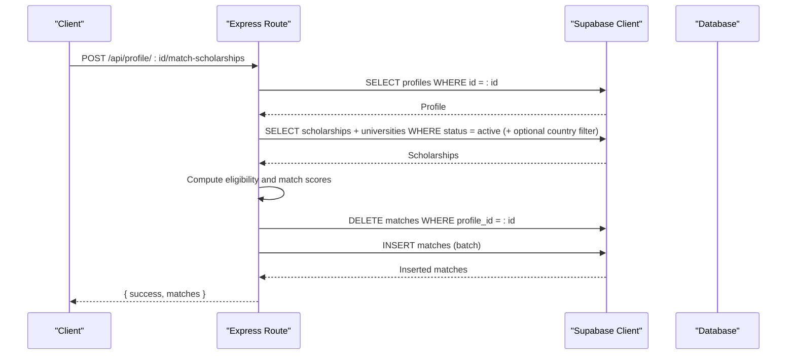
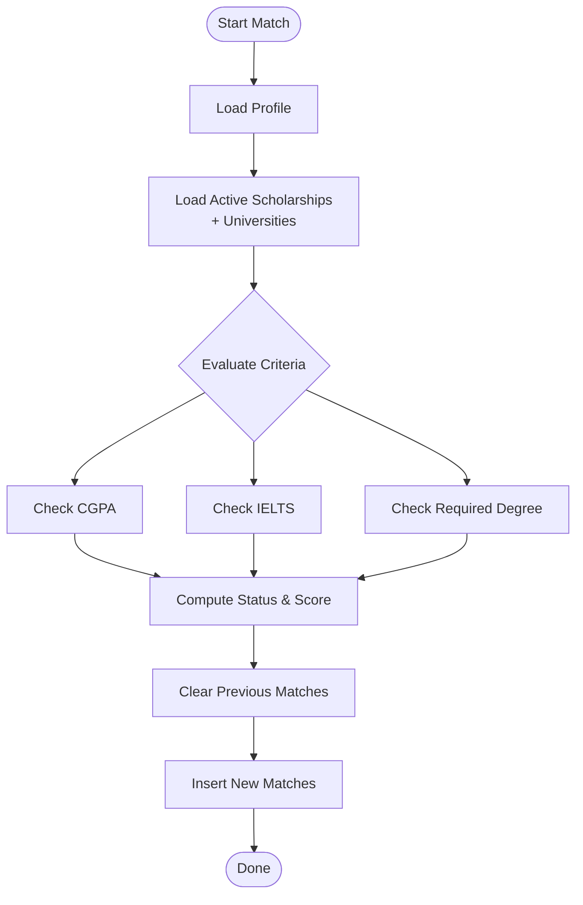
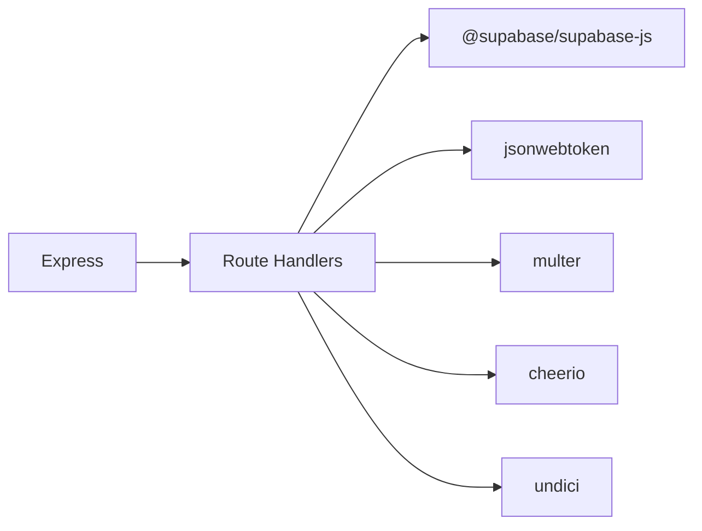

# Query Patterns

<cite>
**Referenced Files in This Document**
- [index.js](file://aischolarpath-backend-main/aischolarpath-backend-main/index.js)
- [package.json](file://aischolarpath-backend-main/aischolarpath-backend-main/package.json)
</cite>

## Table of Contents
1. [Introduction](#introduction)
2. [Project Structure](#project-structure)
3. [Core Components](#core-components)
4. [Architecture Overview](#architecture-overview)
5. [Detailed Component Analysis](#detailed-component-analysis)
6. [Dependency Analysis](#dependency-analysis)
7. [Performance Considerations](#performance-considerations)
8. [Troubleshooting Guide](#troubleshooting-guide)
9. [Conclusion](#conclusion)

## Introduction
This document explains the Supabase query patterns and best practices used across the application’s backend API. It covers CRUD operations, complex filtering with multiple conditions, JOIN-like queries using PostgREST relations, aggregation for dashboard statistics, error handling, transactional-like batch operations, and optimization techniques such as selective field selection, precise WHERE clauses, and efficient pagination patterns. It also documents the scholarship matching algorithm that evaluates eligibility criteria across multiple dimensions.

## Project Structure
The backend is an Express server that uses the Supabase JavaScript client to interact with a PostgreSQL database via PostgREST. All data access logic is implemented within route handlers in a single file. The project depends on @supabase/supabase-js for database operations and authentication-related utilities.

**Diagram sources**
- [index.js:50-54](file://aischolarpath-backend-main/aischolarpath-backend-main/index.js#L50-L54)
- [package.json:1-13](file://aischolarpath-backend-main/aischolarpath-backend-main/package.json#L1-L13)

**Section sources**
- [index.js:1-54](file://aischolarpath-backend-main/aischolarpath-backend-main/index.js#L1-L54)
- [package.json:1-13](file://aischolarpath-backend-main/aischolarpath-backend-main/package.json#L1-L13)

## Core Components
- Supabase client initialization and environment validation
- Authentication middleware for protected routes
- Data access layer through PostgREST queries (select, insert, update, delete)
- Complex business logic for scholarship matching and dashboard aggregation
- Batch operations for notifications and discovery logging
- Centralized error handling

Key responsibilities:
- Build queries with selective fields and filters
- Use joins via PostgREST relation syntax
- Aggregate results in-memory for dashboards
- Handle errors consistently and return structured responses
- Perform batch writes where appropriate

**Section sources**
- [index.js:50-54](file://aischolarpath-backend-main/aischolarpath-backend-main/index.js#L50-L54)
- [index.js:32-47](file://aischolarpath-backend-main/aischolarpath-backend-main/index.js#L32-L47)
- [index.js:189-221](file://aischolarpath-backend-main/aischolarpath-backend-main/index.js#L189-L221)
- [index.js:574-673](file://aischolarpath-backend-main/aischolarpath-backend-main/index.js#L574-L673)
- [index.js:693-749](file://aischolarpath-backend-main/aischolarpath-backend-main/index.js#L693-L749)
- [index.js:982-1100](file://aischolarpath-backend-main/aischolarpath-backend-main/index.js#L982-L1100)
- [index.js:1527-1531](file://aischolarpath-backend-main/aischolarpath-backend-main/index.js#L1527-L1531)

## Architecture Overview
The API exposes REST endpoints that encapsulate Supabase queries. Business logic transforms raw data into domain-specific responses. The most complex flow is the scholarship matching process, which reads profile and scholarship data, computes eligibility, and persists match records.

**Diagram sources**
- [index.js:574-673](file://aischolarpath-backend-main/aischolarpath-backend-main/index.js#L574-L673)

**Section sources**
- [index.js:574-673](file://aischolarpath-backend-main/aischolarpath-backend-main/index.js#L574-L673)

## Detailed Component Analysis

### Supabase Client Setup and Environment Validation
- Validates required environment variables at startup
- Creates a single Supabase client instance reused across all routes
- Provides a health check and a test-db endpoint to verify connectivity

Best practices demonstrated:
- Centralized configuration
- Early failure on missing environment variables
- Minimal select with limit for quick connectivity checks

**Section sources**
- [index.js:1-10](file://aischolarpath-backend-main/aischolarpath-backend-main/index.js#L1-L10)
- [index.js:50-68](file://aischolarpath-backend-main/aischolarpath-backend-main/index.js#L50-L68)

### Authentication Middleware and Authorization
- JWT-based token verification
- Attaches user identity to request context
- Enforces per-route authorization by comparing requested resource owner with authenticated user

Patterns:
- Reusable middleware for protected routes
- Explicit ownership checks before updates/deletes

**Section sources**
- [index.js:32-47](file://aischolarpath-backend-main/aischolarpath-backend-main/index.js#L32-L47)
- [index.js:94-110](file://aischolarpath-backend-main/aischolarpath-backend-main/index.js#L94-L110)
- [index.js:847-884](file://aischolarpath-backend-main/aischolarpath-backend-main/index.js#L847-L884)

### CRUD Operations

#### Profiles
- Update profile fields selectively based on provided payload
- Fetch profile by id with single-row guarantee

Optimizations:
- Select only needed fields when possible
- Use .single() for unique lookups

**Section sources**
- [index.js:70-91](file://aischolarpath-backend-main/aischolarpath-backend-main/index.js#L70-L91)
- [index.js:94-110](file://aischolarpath-backend-main/aischolarpath-backend-main/index.js#L94-L110)

#### Applications
- Create applications with default status
- Update partial fields while preserving timestamps
- List applications with related scholarship details
- Delete applications after ownership verification

Patterns:
- Conditional updates to avoid overwriting unspecified fields
- Joins via PostgREST to include related data

**Section sources**
- [index.js:821-845](file://aischolarpath-backend-main/aischolarpath-backend-main/index.js#L821-L845)
- [index.js:847-884](file://aischolarpath-backend-main/aischolarpath-backend-main/index.js#L847-L884)
- [index.js:886-905](file://aischolarpath-backend-main/aischolarpath-backend-main/index.js#L886-L905)
- [index.js:907-932](file://aischolarpath-backend-main/aischolarpath-backend-main/index.js#L907-L932)

#### Notifications
- Create notifications with validation
- Retrieve notifications ordered by creation time
- Mark notifications as read with ownership checks

Batching:
- Bulk create deadline reminders in one insert call

**Section sources**
- [index.js:982-1020](file://aischolarpath-backend-main/aischolarpath-backend-main/index.js#L982-L1020)
- [index.js:1022-1051](file://aischolarpath-backend-main/aischolarpath-backend-main/index.js#L1022-L1051)
- [index.js:1053-1100](file://aischolarpath-backend-main/aischolarpath-backend-main/index.js#L1053-L1100)

#### Discovery Logging
- Log scraping attempts with status and raw snapshots
- Support bulk scraping with rate limiting and per-item error handling

Error handling:
- Catch network and parsing errors
- Persist failures for observability

**Section sources**
- [index.js:1182-1257](file://aischolarpath-backend-main/aischolarpath-backend-main/index.js#L1182-L1257)
- [index.js:1258-1309](file://aischolarpath-backend-main/aischolarpath-backend-main/index.js#L1258-L1309)

### Complex Filtering with Multiple Conditions
- Filter scholarships by country, type, department, degree level
- Combine multiple optional filters dynamically
- Use PostgREST operators like eq, contains, ilike, not, is

Examples:
- Dynamic query building for list endpoints
- Filtering by array containment and case-insensitive search

**Section sources**
- [index.js:189-206](file://aischolarpath-backend-main/aischolarpath-backend-main/index.js#L189-L206)
- [index.js:223-271](file://aischolarpath-backend-main/aischolarpath-backend-main/index.js#L223-L271)

### JOIN Operations Between Related Tables
- Use PostgREST relation syntax to join related tables in select queries
- Examples include joining scholarships with universities and fetching nested scholarship details in matches and applications

Patterns:
- Select only necessary columns from joined tables to reduce payload size
- Order results by computed or stored metrics

**Section sources**
- [index.js:193-200](file://aischolarpath-backend-main/aischolarpath-backend-main/index.js#L193-L200)
- [index.js:212-216](file://aischolarpath-backend-main/aischolarpath-backend-main/index.js#L212-L216)
- [index.js:682-686](file://aischolarpath-backend-main/aischolarpath-backend-main/index.js#L682-L686)
- [index.js:895-900](file://aischolarpath-backend-main/aischolarpath-backend-main/index.js#L895-L900)

### Aggregation Queries for Dashboard Statistics
- Fetch matches and compute counts by status in memory
- Derive top recommendations by sorting and slicing
- Summarize coverage across universities

Techniques:
- Efficient retrieval of related data with selective fields
- In-memory aggregation for derived metrics

**Section sources**
- [index.js:693-749](file://aischolarpath-backend-main/aischolarpath-backend-main/index.js#L693-L749)

### Scholarship Matching Algorithm
The matching algorithm evaluates eligibility across multiple dimensions:
- CGPA threshold comparison
- IELTS score threshold comparison
- Required degree matching
- Computes pass/fail/missing evidence per criterion
- Determines overall status and match score percentage
- Persists match results after clearing previous matches for the profile

**Diagram sources**
- [index.js:574-673](file://aischolarpath-backend-main/aischolarpath-backend-main/index.js#L574-L673)

**Section sources**
- [index.js:574-673](file://aischolarpath-backend-main/aischolarpath-backend-main/index.js#L574-L673)

### Error Handling
- Consistent error object structure with success flag and message
- HTTP status codes aligned with error types (400, 401, 403, 404, 500)
- Centralized unhandled error handler to catch unexpected exceptions

Patterns:
- Check for errors immediately after each Supabase call
- Validate inputs before issuing database operations
- Avoid leaking sensitive information in error messages

**Section sources**
- [index.js:62-68](file://aischolarpath-backend-main/aischolarpath-backend-main/index.js#L62-L68)
- [index.js:1527-1531](file://aischolarpath-backend-main/aischolarpath-backend-main/index.js#L1527-L1531)
- [index.js:1182-1257](file://aischolarpath-backend-main/aischolarpath-backend-main/index.js#L1182-L1257)

### Transaction Management and Batch Operations
- While explicit database transactions are not used, the code performs logical batching:
  - Clear old matches then insert new ones for a profile
  - Bulk insert notifications for upcoming deadlines
  - Bulk discovery log entries for scraping jobs
- These sequences ensure consistency at the application level

Recommendations:
- For critical multi-step operations, consider wrapping related writes in a database transaction if supported by your schema or functions
- Use upserts where applicable to avoid duplicates

**Section sources**
- [index.js:660-673](file://aischolarpath-backend-main/aischolarpath-backend-main/index.js#L660-L673)
- [index.js:1053-1100](file://aischolarpath-backend-main/aischolarpath-backend-main/index.js#L1053-L1100)
- [index.js:1258-1309](file://aischolarpath-backend-main/aischolarpath-backend-main/index.js#L1258-L1309)

### Pagination Patterns
- Current usage includes limit and order for simple paging needs
- No offset-based pagination is implemented in the analyzed routes

Guidance:
- Implement cursor-based or offset-based pagination for large result sets
- Always combine pagination with ordering to ensure stable results

[No sources needed since this section provides general guidance]

## Dependency Analysis
The backend relies on:
- Express for routing and middleware
- Supabase JS client for database operations
- JSON Web Tokens for authentication
- Multer for file uploads
- Cheerio and undici for web scraping features

**Diagram sources**
- [package.json:1-13](file://aischolarpath-backend-main/aischolarpath-backend-main/package.json#L1-L13)
- [index.js:1-27](file://aischolarpath-backend-main/aischolarpath-backend-main/index.js#L1-L27)

**Section sources**
- [package.json:1-13](file://aischolarpath-backend-main/aischolarpath-backend-main/package.json#L1-L13)
- [index.js:1-27](file://aischolarpath-backend-main/aischolarpath-backend-main/index.js#L1-L27)

## Performance Considerations
- Selective field selection: Prefer specifying exact columns in select to minimize payload size
- Precise WHERE clauses: Use equality and containment filters early to reduce dataset size
- Ordering and limits: Apply order and limit for predictable and performant reads
- Join efficiency: Only join necessary related fields to avoid unnecessary data transfer
- In-memory aggregation: Keep aggregations lightweight; precompute heavy metrics if needed
- Rate limiting for external calls: Introduce delays between scraping requests to avoid throttling
- Connection pooling: Ensure Supabase client reuse and proper connection settings

[No sources needed since this section provides general guidance]

## Troubleshooting Guide
Common issues and resolutions:
- Missing environment variables: Ensure SUPABASE_URL, SUPABASE_KEY, and JWT_SECRET are set
- Authentication failures: Verify token presence and validity; check middleware behavior
- Not found errors: Confirm resource existence before updates/deletes
- Database errors: Inspect error.message from Supabase responses and map to appropriate HTTP status
- Scraping failures: Check network responses and selectors; log raw snapshots for debugging

**Section sources**
- [index.js:1-10](file://aischolarpath-backend-main/aischolarpath-backend-main/index.js#L1-L10)
- [index.js:32-47](file://aischolarpath-backend-main/aischolarpath-backend-main/index.js#L32-L47)
- [index.js:1182-1257](file://aischolarpath-backend-main/aischolarpath-backend-main/index.js#L1182-L1257)
- [index.js:1527-1531](file://aischolarpath-backend-main/aischolarpath-backend-main/index.js#L1527-L1531)

## Conclusion
The application demonstrates robust Supabase query patterns:
- Clear separation of concerns with middleware and route handlers
- Careful use of selective selects and precise filters
- Effective joins via PostgREST relations
- Practical aggregation for dashboard insights
- Consistent error handling and structured responses
- Logical batching for write-heavy operations

Adopting these patterns ensures maintainable, secure, and performant data access across the platform.