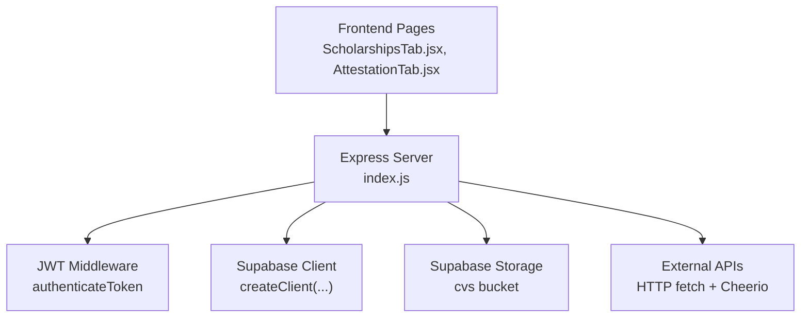
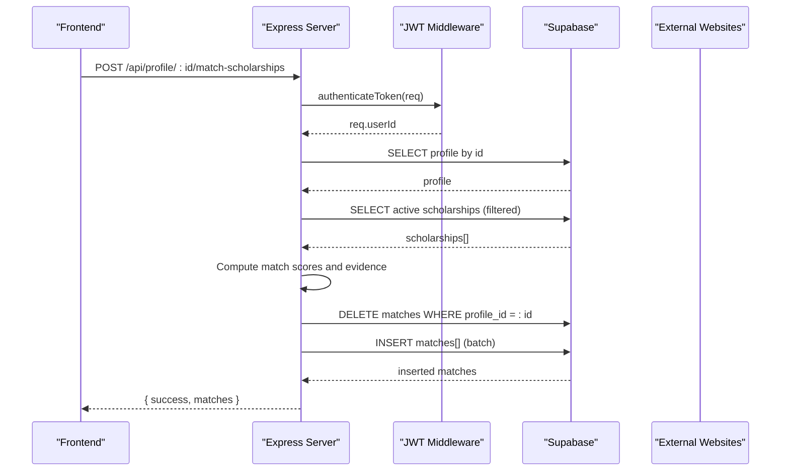
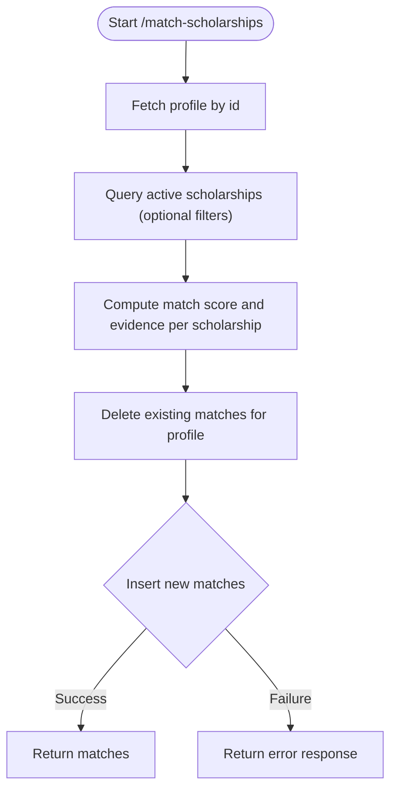
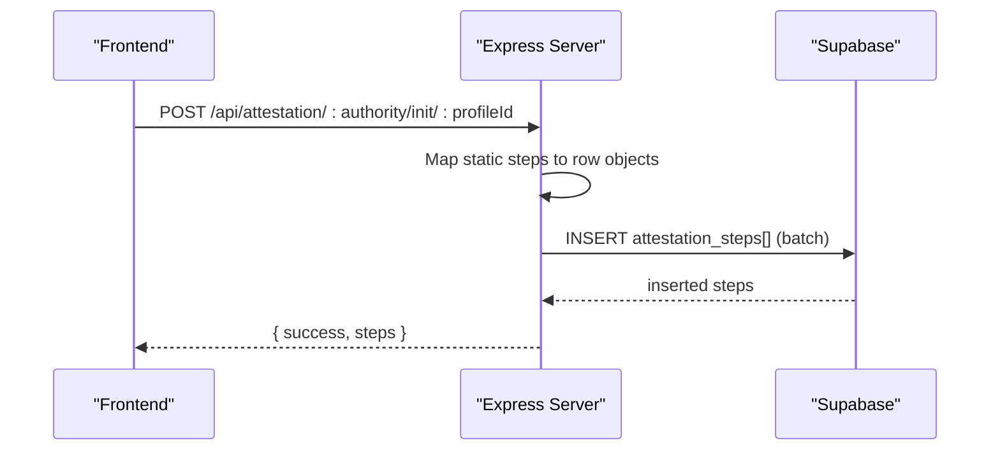
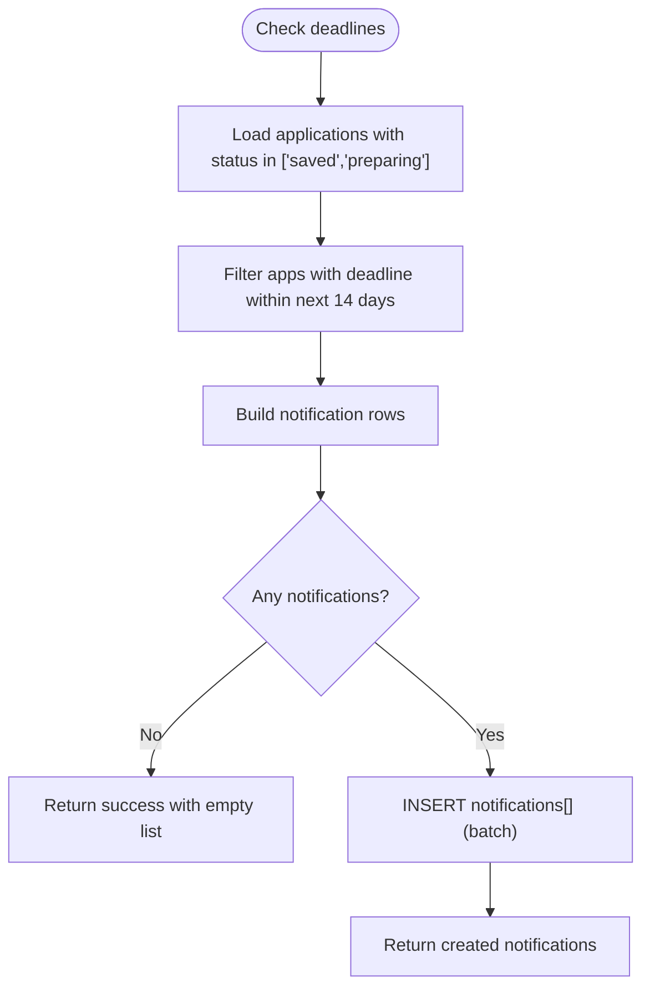
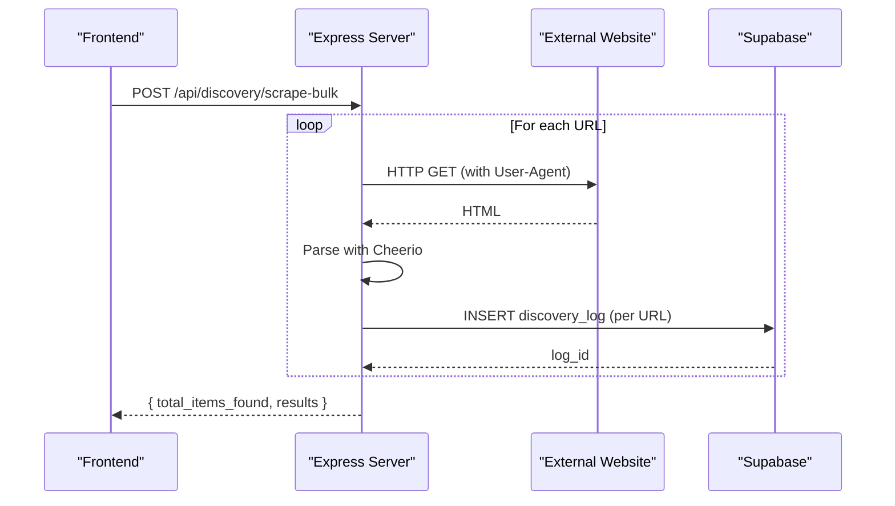
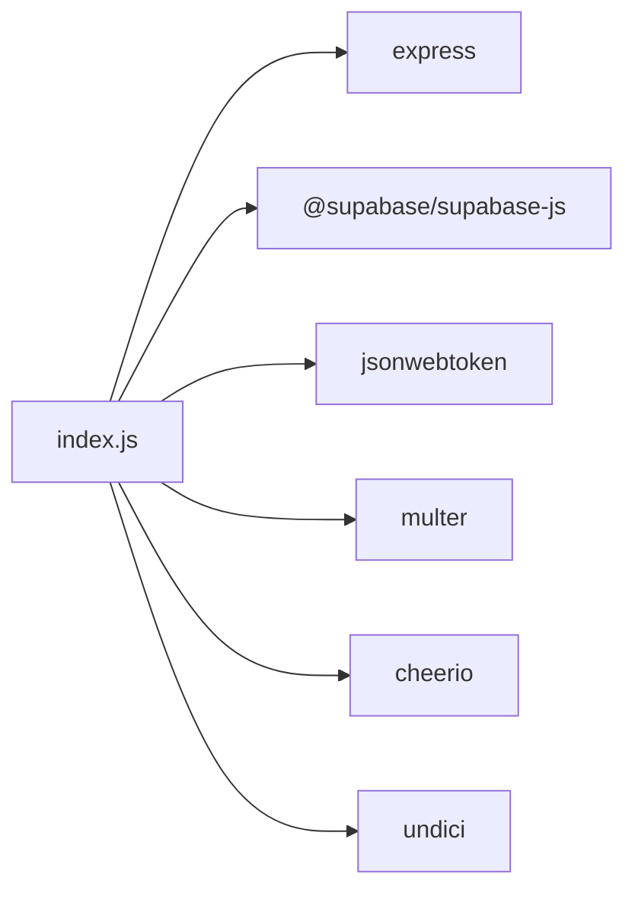

# Transaction Management and Batch Operations

<cite>
**Referenced Files in This Document**
- [index.js](file://aischolarpath-backend-main/aischolarpath-backend-main/index.js)
- [package.json](file://aischolarpath-backend-main/aischolarpath-backend-main/package.json)
- [ScholarshipsTab.jsx](file://scholarpath-frontend (2)/scholarpath/src/pages/ScholarshipsTab.jsx)
- [AttestationTab.jsx](file://scholarpath-frontend (2)/scholarpath/src/pages/AttestationTab.jsx)
</cite>

## Table of Contents
1. [Introduction](#introduction)
2. [Project Structure](#project-structure)
3. [Core Components](#core-components)
4. [Architecture Overview](#architecture-overview)
5. [Detailed Component Analysis](#detailed-component-analysis)
6. [Dependency Analysis](#dependency-analysis)
7. [Performance Considerations](#performance-considerations)
8. [Troubleshooting Guide](#troubleshooting-guide)
9. [Conclusion](#conclusion)

## Introduction
This document explains how ScholarPathAI handles transactional multi-step operations and batch data processing on the backend, focusing on:
- Atomic scholarship matching that deletes old matches and inserts new results
- Batch creation of attestation step records
- Error handling strategies to maintain data consistency across multiple database operations
- Patterns for bulk operations and best practices for concurrency control and race condition prevention

The analysis is based on the Express server implementation and related frontend components that trigger these flows.

## Project Structure
The backend is a single-file Express application that exposes REST endpoints for profile management, scholarships, attestation tracking, applications, notifications, discovery/scraping, and roadmap generation. It uses Supabase as the data layer and JWT-based authentication middleware. The frontend includes UI pages that interact with these endpoints.

**Diagram sources**
- [index.js:27-54](file://aischolarpath-backend-main/aischolarpath-backend-main/index.js#L27-L54)
- [index.js:32-47](file://aischolarpath-backend-main/aischolarpath-backend-main/index.js#L32-L47)
- [ScholarshipsTab.jsx:1-139](file://scholarpath-frontend (2)/scholarpath/src/pages/ScholarshipsTab.jsx#L1-L139)
- [AttestationTab.jsx:1-73](file://scholarpath-frontend (2)/scholarpath/src/pages/AttestationTab.jsx#L1-L73)

**Section sources**
- [index.js:1-59](file://aischolarpath-backend-main/aischolarpath-backend-main/index.js#L1-L59)
- [package.json:1-14](file://aischolarpath-backend-main/aischolarpath-backend-main/package.json#L1-L14)

## Core Components
Key transactional and batch-oriented endpoints:
- Scholarship matching: delete old matches then insert new ones per profile
- Attestation steps initialization: batch insert multiple step rows per authority and profile
- Notifications deadline check: compute and batch-insert reminders
- Discovery scraping: batch log entries and upserts for scraped items

These endpoints demonstrate patterns for:
- Multi-step operations with error checks between steps
- Bulk inserts using arrays
- Upsert patterns for idempotent writes
- Centralized error responses

**Section sources**
- [index.js:574-673](file://aischolarpath-backend-main/aischolarpath-backend-main/index.js#L574-L673)
- [index.js:437-464](file://aischolarpath-backend-main/aischolarpath-backend-main/index.js#L437-L464)
- [index.js:1053-1100](file://aischolarpath-backend-main/aischolarpath-backend-main/index.js#L1053-L1100)
- [index.js:1182-1243](file://aischolarpath-backend-main/aischolarpath-backend-main/index.js#L1182-L1243)
- [index.js:1258-1309](file://aischolarpath-backend-main/aischolarpath-backend-main/index.js#L1258-L1309)
- [index.js:1310-1390](file://aischolarpath-backend-main/aischolarpath-backend-main/index.js#L1310-L1390)
- [index.js:1391-1493](file://aischolarpath-backend-main/aischolarpath-backend-main/index.js#L1391-L1493)

## Architecture Overview
The server processes authenticated requests, performs business logic, and interacts with Supabase for persistence. Some routes also call external websites to scrape content and persist findings.

**Diagram sources**
- [index.js:32-47](file://aischolarpath-backend-main/aischolarpath-backend-main/index.js#L32-L47)
- [index.js:574-673](file://aischolarpath-backend-main/aischolarpath-backend-main/index.js#L574-L673)

## Detailed Component Analysis

### Scholarship Matching: Delete Old Matches and Insert New Results
This endpoint implements a two-phase write pattern:
- Phase 1: Remove existing matches for the profile to ensure a clean slate
- Phase 2: Compute eligibility against all active scholarships and insert new match records in one batch

Error handling:
- Each phase checks for errors and returns early if any operation fails
- If deletion succeeds but insertion fails, the profile will have no matches until re-run; consider compensating actions or retries

Concurrency considerations:
- Without explicit transactions or row-level locking, concurrent runs could interleave deletions and inserts
- Recommended improvements: wrap delete+insert in a database transaction or use an atomic upsert strategy keyed by (profile_id, scholarship_id)

**Diagram sources**
- [index.js:574-673](file://aischolarpath-backend-main/aischolarpath-backend-main/index.js#L574-L673)

**Section sources**
- [index.js:574-673](file://aischolarpath-backend-main/aischolarpath-backend-main/index.js#L574-L673)

### Attestation Steps Initialization: Batch Insert Pattern
When initializing tracked steps for an authority, the server maps static guide steps into rows and performs a single batch insert.

Benefits:
- Reduces round-trips to the database
- Ensures all steps are created together

Error handling:
- If the batch insert fails, none of the steps are persisted, preserving consistency

Concurrency:
- Idempotency can be improved by checking for existing steps before inserting or using a unique constraint on (profile_id, authority, step_order)

**Diagram sources**
- [index.js:437-464](file://aischolarpath-backend-main/aischolarpath-backend-main/index.js#L437-L464)

**Section sources**
- [index.js:437-464](file://aischolarpath-backend-main/aischolarpath-backend-main/index.js#L437-L464)

### Deadline Reminder Notification: Batch Insert After Computation
This endpoint computes which applications have deadlines within a threshold and creates reminder notifications in a single batch insert.

Error handling:
- If no upcoming deadlines exist, it returns a success response with an empty list
- On database error, returns a 500 with error details

Concurrency:
- To avoid duplicate reminders, consider deduplication by (profile_id, scholarship_id, date window) or idempotent keys

**Diagram sources**
- [index.js:1053-1100](file://aischolarpath-backend-main/aischolarpath-backend-main/index.js#L1053-L1100)

**Section sources**
- [index.js:1053-1100](file://aischolarpath-backend-main/aischolarpath-backend-main/index.js#L1053-L1100)

### Discovery Scraping: Batch Logging and Upserts
Scraping endpoints perform HTTP fetches, parse HTML, and persist results:
- Single scrape: logs a single entry with raw snapshot
- Bulk scrape: iterates over URLs, delays requests, logs each result, and aggregates totals
- Scrape-and-structure: visits listing and detail pages, extracts fields, and upserts scholarships with conflict resolution on (title, country)

Error handling:
- Network or parsing errors are caught and logged as failed entries
- Upsert ensures partial failures do not block entire batches

Concurrency:
- Delays between requests reduce rate-limit risk
- For high concurrency, consider job queues and idempotent keys

**Diagram sources**
- [index.js:1258-1309](file://aischolarpath-backend-main/aischolarpath-backend-main/index.js#L1258-L1309)

**Section sources**
- [index.js:1182-1243](file://aischolarpath-backend-main/aischolarpath-backend-main/index.js#L1182-L1243)
- [index.js:1258-1309](file://aischolarpath-backend-main/aischolarpath-backend-main/index.js#L1258-L1309)
- [index.js:1310-1390](file://aischolarpath-backend-main/aischolarpath-backend-main/index.js#L1310-L1390)
- [index.js:1391-1493](file://aischolarpath-backend-main/aischolarpath-backend-main/index.js#L1391-L1493)

### Frontend Interaction Points
- ScholarshipsTab displays matched scholarships and analysis metrics; it relies on backend endpoints to provide current matches and summaries
- AttestationTab presents authority-specific guidance and steps; backend provides static guides and tracks user progress via attestation steps

These pages illustrate where users initiate workflows that trigger the transactional and batch operations described above.

**Section sources**
- [ScholarshipsTab.jsx:1-139](file://scholarpath-frontend (2)/scholarpath/src/pages/ScholarshipsTab.jsx#L1-L139)
- [AttestationTab.jsx:1-73](file://scholarpath-frontend (2)/scholarpath/src/pages/AttestationTab.jsx#L1-L73)

## Dependency Analysis
The server depends on:
- Express for routing and middleware
- Supabase client for database and storage operations
- JSON Web Tokens for authentication
- Multer for file uploads
- Cheerio for HTML parsing during scraping
- Undici agent for connection pooling and timeouts

**Diagram sources**
- [package.json:1-14](file://aischolarpath-backend-main/aischolarpath-backend-main/package.json#L1-L14)
- [index.js:1-26](file://aischolarpath-backend-main/aischolarpath-backend-main/index.js#L1-L26)

**Section sources**
- [package.json:1-14](file://aischolarpath-backend-main/aischolarpath-backend-main/package.json#L1-L14)
- [index.js:1-26](file://aischolarpath-backend-main/aischolarpath-backend-main/index.js#L1-L26)

## Performance Considerations
- Connection pooling: The undici agent configures maximum connections and timeouts to handle concurrent outbound requests efficiently
- Request pacing: Scraping endpoints introduce delays between requests to avoid rate limiting and respect target servers
- Batch operations: Using array inserts reduces database round-trips and improves throughput
- Selective queries: Filtering scholarships and universities at query time minimizes payload size
- Caching opportunities: Static guides and reference data could be cached server-side or via CDN to reduce repeated computations

[No sources needed since this section provides general guidance]

## Troubleshooting Guide
Common issues and strategies:
- Authentication failures: Ensure JWT is present and valid; middleware rejects invalid tokens
- Authorization errors: Endpoints verify ownership by comparing profile_id with req.userId; mismatches return 403
- Database errors: All database calls check for errors and return structured responses; inspect error messages for constraints or connectivity issues
- Partial failures in batch operations: Some endpoints log individual failures while continuing (e.g., scraping); review aggregated results to identify problematic items
- Unhandled exceptions: A centralized error handler catches unhandled errors and returns a generic 500 response; add logging to capture stack traces

Operational tips:
- Validate environment variables at startup to fail fast on missing configuration
- Use consistent error shapes for clients to handle failures uniformly
- Add retry logic for transient network errors in scraping flows

**Section sources**
- [index.js:32-47](file://aischolarpath-backend-main/aischolarpath-backend-main/index.js#L32-L47)
- [index.js:1527-1531](file://aischolarpath-backend-main/aischolarpath-backend-main/index.js#L1527-L1531)

## Conclusion
ScholarPathAI’s backend demonstrates practical patterns for multi-step operations and batch processing:
- Clear separation of phases (delete then insert) with robust error handling
- Efficient batch inserts for attestation steps and notifications
- Resilient scraping pipelines with per-item logging and upserts for idempotent writes

To strengthen transactional guarantees and prevent race conditions in multi-user scenarios, consider:
- Wrapping critical sequences (like delete+insert) in database transactions or using atomic upserts keyed by composite unique constraints
- Implementing idempotency keys for long-running or retriable operations
- Adding optimistic concurrency controls or row-level locks where necessary
- Introducing a job queue for heavy background tasks like scraping to decouple from request lifecycles

These enhancements will improve data consistency, scalability, and reliability under concurrent load.