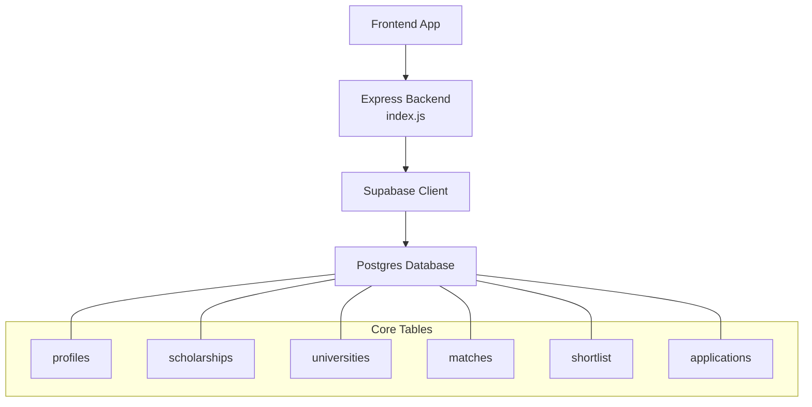
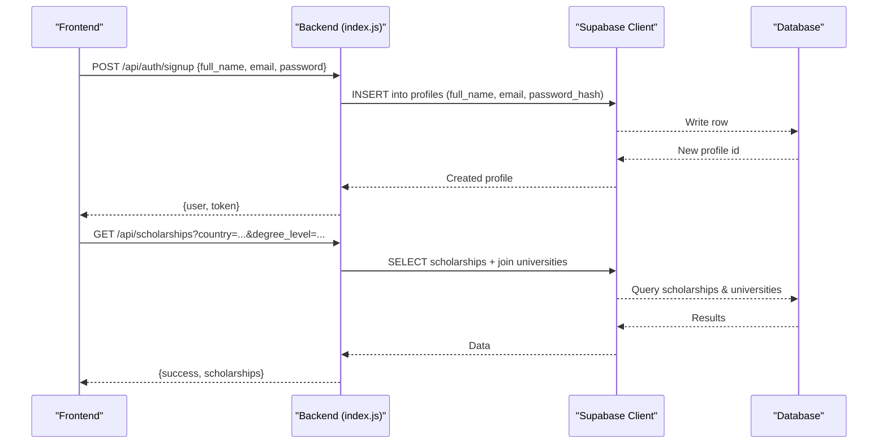
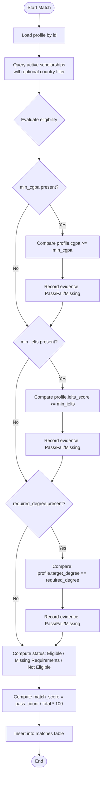
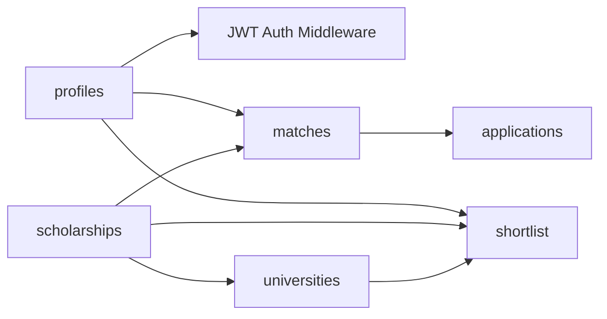

# Core Tables

<cite>
**Referenced Files in This Document**
- [index.js](file://aischolarpath-backend-main/aischolarpath-backend-main/index.js)
- [package.json](file://aischolarpath-backend-main/aischolarpath-backend-main/package.json)
- [mockData.js](file://scholarpath-frontend (2)/scholarpath/src/data/mockData.js)
</cite>

## Table of Contents
1. [Introduction](#introduction)
2. [Project Structure](#project-structure)
3. [Core Components](#core-components)
4. [Architecture Overview](#architecture-overview)
5. [Detailed Component Analysis](#detailed-component-analysis)
6. [Dependency Analysis](#dependency-analysis)
7. [Performance Considerations](#performance-considerations)
8. [Troubleshooting Guide](#troubleshooting-guide)
9. [Conclusion](#conclusion)

## Introduction
This document describes the core database tables used by ScholarPathAI to power user profiles, scholarship discovery, and university information. It focuses on:
- Profiles table: user authentication fields and academic profile data
- Scholarships table: eligibility criteria, university relationships, and status management
- Universities table: institution details, degree programs, and official portal information

The documentation explains field definitions, inferred data types and constraints from usage, business rules enforced by the backend, and how these tables support the scholarship matching system.

## Project Structure
ScholarPathAI uses a Node.js Express backend that interacts with a Supabase Postgres database via the Supabase JS client. The primary file index.js defines all API routes and contains the logic for reading/writing the core tables: profiles, scholarships, universities, matches, shortlist, applications, and others. The frontend mock data provides example structures for UI but is not the source of truth for schema.

**Diagram sources**
- [index.js:50-68](file://aischolarpath-backend-main/aischolarpath-backend-main/index.js#L50-L68)
- [index.js:189-222](file://aischolarpath-backend-main/aischolarpath-backend-main/index.js#L189-L222)
- [index.js:224-288](file://aischolarpath-backend-main/aischolarpath-backend-main/index.js#L224-L288)

**Section sources**
- [index.js:1-68](file://aischolarpath-backend-main/aischolarpath-backend-main/index.js#L1-L68)
- [package.json:1-14](file://aischolarpath-backend-main/aischolarpath-backend-main/package.json#L1-L14)

## Core Components
The following components are central to the core tables:

- Authentication and Profile Management
  - User signup/login creates and verifies profiles with hashed passwords
  - Profile updates include academic fields such as CGPA, IELTS score, target country, degree, department, and CV path
  - CV upload stores a file path in the profiles table

- Scholarship Discovery and Matching
  - Scholarships are filtered by country, type, department, and degree level
  - Eligibility criteria stored in a JSON-like structure drive matching against profile fields
  - Matches are computed and persisted per profile

- University Directory
  - Universities store name, country, degree programs, and official portal URL
  - Filtering supports country, search by name, and array-based degree program matching

**Section sources**
- [index.js:519-573](file://aischolarpath-backend-main/aischolarpath-backend-main/index.js#L519-L573)
- [index.js:69-145](file://aischolarpath-backend-main/aischolarpath-backend-main/index.js#L69-L145)
- [index.js:189-222](file://aischolarpath-backend-main/aischolarpath-backend-main/index.js#L189-L222)
- [index.js:224-288](file://aischolarpath-backend-main/aischolarpath-backend-main/index.js#L224-L288)
- [index.js:574-692](file://aischolarpath-backend-main/aischolarpath-backend-main/index.js#L574-L692)

## Architecture Overview
The backend exposes REST endpoints that operate on three core tables:

- Profiles: user identity and academic attributes
- Scholarships: funding opportunities with eligibility criteria and links to universities or countries
- Universities: institutions with program offerings and official portals

Matching logic reads a profile and compares it against active scholarships’ eligibility criteria to compute match scores and statuses.

**Diagram sources**
- [index.js:519-540](file://aischolarpath-backend-main/aischolarpath-backend-main/index.js#L519-L540)
- [index.js:189-206](file://aischolarpath-backend-main/aischolarpath-backend-main/index.js#L189-L206)

## Detailed Component Analysis

### Profiles Table
Purpose: Stores user authentication and academic profile data used for matching and personalization.

Key fields and inferred characteristics:
- id: Primary key; used as the authenticated user identifier in JWT claims and route-level authorization checks
- full_name: String; displayed in responses and used for user context
- email: String; unique login identifier; validated at signup/login
- password_hash: String; bcrypt-hashed value; never returned in responses except during login verification flow
- cgpa: Numeric; optional; compared against scholarship eligibility min_cgpa
- ielts_score: Numeric; optional; compared against scholarship eligibility min_ielts
- target_country: String; filters scholarships by country
- target_degree: String; matched against required_degree in eligibility criteria
- target_department: String; used alongside other filters
- cv_file_path: String; stores storage path after CV upload
- reset_token, reset_token_expiry: Strings/timestamps; used for password reset flows

Business rules and constraints inferred from code:
- Authentication:
  - Signup requires email and password; password is hashed before insert
  - Login validates email and compares provided password against stored hash
  - JWT tokens contain user id and are used to authorize profile operations
- Authorization:
  - Profile update and retrieval enforce that the requesting user’s id matches the target profile id
- Profile completeness:
  - Dashboard overview checks presence of cgpa, ielts_score, cv_file_path, target_degree to compute completeness metrics
- Password reset:
  - Generates a time-bound reset token stored in the profile record

Typical data structure examples:
- Minimal profile: { id, full_name, email }
- Academic profile: { cgpa, ielts_score, target_country, target_degree, target_department, cv_file_path }

How it supports matching:
- Matching engine reads cgpa, ielts_score, target_degree, target_country to evaluate eligibility against scholarship criteria

**Section sources**
- [index.js:32-47](file://aischolarpath-backend-main/aischolarpath-backend-main/index.js#L32-L47)
- [index.js:69-145](file://aischolarpath-backend-main/aischolarpath-backend-main/index.js#L69-L145)
- [index.js:519-573](file://aischolarpath-backend-main/aischolarpath-backend-main/index.js#L519-L573)
- [index.js:1101-1169](file://aischolarpath-backend-main/aischolarpath-backend-main/index.js#L1101-L1169)
- [index.js:693-748](file://aischolarpath-backend-main/aischolarpath-backend-main/index.js#L693-L748)

### Scholarships Table
Purpose: Represents funding opportunities with eligibility criteria and relationships to universities or countries.

Key fields and inferred characteristics:
- id: Primary key; referenced by matches and applications
- title: String; human-readable name used in UI and matches
- country: String; used for filtering and matching by target_country
- scholarship_type: String; filterable attribute
- department: String; filterable attribute
- degree_level: String; filterable attribute
- eligibility_criteria: Object/JSON; contains fields like min_cgpa, min_ielts, required_degree
- university_id: Nullable foreign key; when null, indicates country-wide scholarships
- status: Enum-like string; typically 'active' for eligible listings
- deadline, apply_url: Strings; used for notifications and application tracking

Business rules and constraints inferred from code:
- Filtering:
  - Queries support country, scholarship_type, department, degree_level
- Status management:
  - Active scholarships are considered in matching and listing; inactive ones are excluded
- Relationships:
  - Joins with universities via university_id to fetch name and official_portal_url
  - Country-wide scholarships have null university_id and are identified by country
- Matching:
  - Eligibility criteria are evaluated against profile fields to determine Pass/Fail/Missing and overall status
  - Match results are stored in the matches table with match_score and evidence arrays

Typical data structure examples:
- University-specific scholarship: { id, title, country, scholarship_type, department, degree_level, eligibility_criteria: { min_cgpa, min_ielts, required_degree }, university_id, status }
- Country-wide scholarship: { id, title, country, scholarship_type, department, degree_level, eligibility_criteria, university_id: null, status }

How it supports matching:
- The matching algorithm compares profile.cgpa vs min_cgpa, profile.ielts_score vs min_ielts, and profile.target_degree vs required_degree to compute eligibility and match_score

**Section sources**
- [index.js:189-222](file://aischolarpath-backend-main/aischolarpath-backend-main/index.js#L189-L222)
- [index.js:574-692](file://aischolarpath-backend-main/aischolarpath-backend-main/index.js#L574-L692)

### Universities Table
Purpose: Catalogs institutions with program offerings and official portal information.

Key fields and inferred characteristics:
- id: Primary key; referenced by scholarships and matches
- name: String; searchable via ilike queries
- country: String; filterable and used to associate country-wide scholarships
- degree_programs: Array of strings; queried using contains to filter by specific program
- official_portal_url: String; joined with scholarships for direct links

Business rules and constraints inferred from code:
- Filtering:
  - Supports country equality, name search, and array containment for degree_programs
- Relationship to scholarships:
  - Direct scholarships link via university_id
  - Country-wide scholarships do not link to a university; instead, they cover the country field

Typical data structure examples:
- { id, name, country, degree_programs: ["Bachelor's", "Master's"], official_portal_url }

How it supports matching:
- Provides context for scholarships and enables users to discover universities offering relevant programs or covered by country-wide scholarships

**Section sources**
- [index.js:224-288](file://aischolarpath-backend-main/aischolarpath-backend-main/index.js#L224-L288)
- [index.js:189-222](file://aischolarpath-backend-main/aischolarpath-backend-main/index.js#L189-L222)

### Matching Flow and Data Structures
The matching process computes eligibility and stores results in the matches table.

**Diagram sources**
- [index.js:574-692](file://aischolarpath-backend-main/aischolarpath-backend-main/index.js#L574-L692)

**Section sources**
- [index.js:574-692](file://aischolarpath-backend-main/aischolarpath-backend-main/index.js#L574-L692)

## Dependency Analysis
Core dependencies among tables and services:

- Profiles depend on authentication middleware and JWT to authorize access
- Scholarships depend on universities for display and linking
- Matches depend on both profiles and scholarships to compute and store results
- Applications and shortlist depend on profiles and scholarships/universities for user workflows

**Diagram sources**
- [index.js:32-47](file://aischolarpath-backend-main/aischolarpath-backend-main/index.js#L32-L47)
- [index.js:189-222](file://aischolarpath-backend-main/aischolarpath-backend-main/index.js#L189-L222)
- [index.js:574-692](file://aischolarpath-backend-main/aischolarpath-backend-main/index.js#L574-L692)
- [index.js:751-820](file://aischolarpath-backend-main/aischolarpath-backend-main/index.js#L751-L820)
- [index.js:821-850](file://aischolarpath-backend-main/aischolarpath-backend-main/index.js#L821-L850)

**Section sources**
- [index.js:32-47](file://aischolarpath-backend-main/aischolarpath-backend-main/index.js#L32-L47)
- [index.js:189-222](file://aischolarpath-backend-main/aischolarpath-backend-main/index.js#L189-L222)
- [index.js:574-692](file://aischolarpath-backend-main/aischolarpath-backend-main/index.js#L574-L692)
- [index.js:751-820](file://aischolarpath-backend-main/aischolarpath-backend-main/index.js#L751-L820)
- [index.js:821-850](file://aischolarpath-backend-main/aischolarpath-backend-main/index.js#L821-L850)

## Performance Considerations
- Query efficiency:
  - Use targeted selects and filters (country, degree_level, department) to reduce payload size
  - Leverage array containment for degree_programs filtering
- Matching performance:
  - Clear old matches before inserting new results to avoid duplicates and stale data
  - Limit result sets where appropriate (e.g., limited university listings)
- Storage:
  - Store only necessary fields in responses to minimize bandwidth
  - Use efficient hashing for passwords and secure token handling

[No sources needed since this section provides general guidance]

## Troubleshooting Guide
Common issues and resolutions:

- Authentication failures:
  - Ensure JWT_SECRET environment variable is set and tokens are valid
  - Verify password hashing and comparison logic during login
- Profile access errors:
  - Confirm that the authenticated user id matches the requested profile id
- Database connectivity:
  - Validate SUPABASE_URL and SUPABASE_KEY environment variables
  - Use health and test-db endpoints to verify connection
- Matching discrepancies:
  - Check eligibility_criteria fields in scholarships and ensure profile fields are populated
  - Review evidence arrays in matches to understand why a scholarship was marked ineligible

**Section sources**
- [index.js:32-47](file://aischolarpath-backend-main/aischolarpath-backend-main/index.js#L32-L47)
- [index.js:519-573](file://aischolarpath-backend-main/aischolarpath-backend-main/index.js#L519-L573)
- [index.js:57-68](file://aischolarpath-backend-main/aischolarpath-backend-main/index.js#L57-L68)
- [index.js:574-692](file://aischolarpath-backend-main/aischolarpath-backend-main/index.js#L574-L692)

## Conclusion
The core tables—profiles, scholarships, and universities—form the foundation of ScholarPathAI’s scholarship matching system. Profiles capture user identity and academic attributes; scholarships define funding opportunities with detailed eligibility criteria; universities provide institutional context and program offerings. Together, they enable robust filtering, personalized matching, and actionable insights for students seeking scholarships.

[No sources needed since this section summarizes without analyzing specific files]