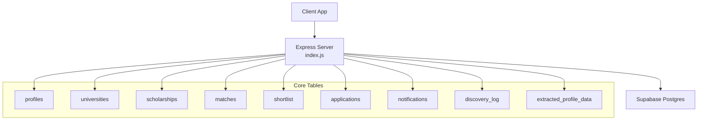
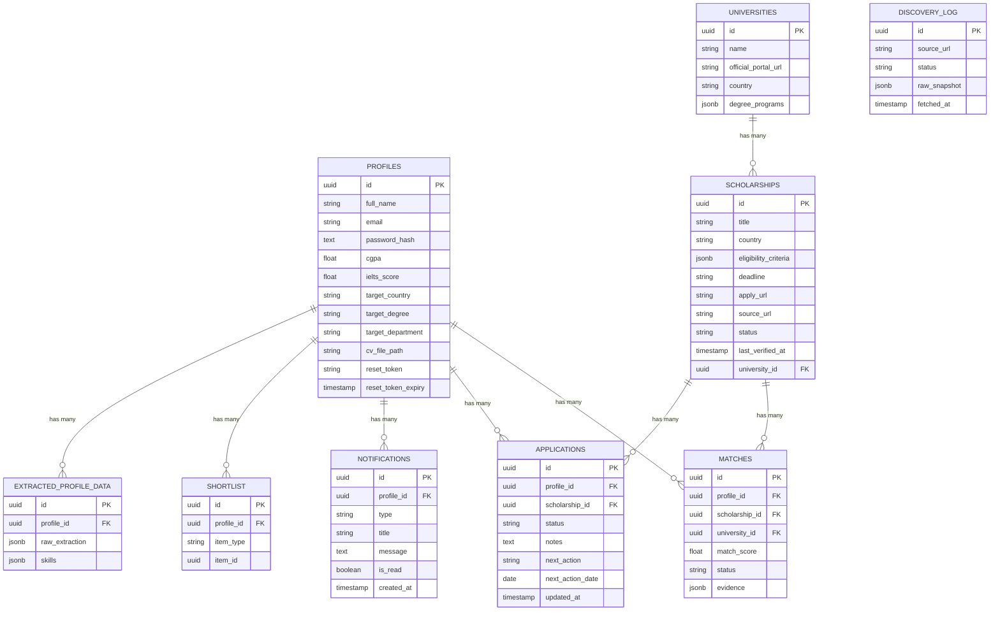
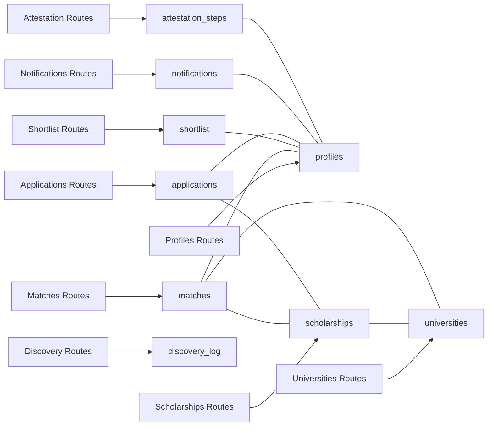

# Indexes and Constraints

<cite>
**Referenced Files in This Document**
- [index.js](file://aischolarpath-backend-main/aischolarpath-backend-main/index.js)
</cite>

## Table of Contents
1. Introduction
2. Project Structure
3. Core Components
4. Architecture Overview
5. Detailed Component Analysis
6. Dependency Analysis
7. Performance Considerations
8. Troubleshooting Guide
9. Conclusion

## Introduction
This document explains the database indexes and constraints used by ScholarPathAI, focusing on primary key uniqueness, foreign key relationships across profiles, scholarships, universities, matches, shortlist, and attestation_steps, and indexing strategies that support frequent queries such as filtering by profile_id, university_id, country, and status. It also outlines constraint validation rules and data type restrictions inferred from application usage patterns to ensure data integrity and performance.

## Project Structure
The backend is an Express server that interacts with a Supabase Postgres database via @supabase/supabase-js. The single entry point defines all API routes and performs all data operations against tables including profiles, scholarships, universities, matches, shortlist, applications, notifications, discovery_log, and extracted_profile_data.

**Diagram sources**
- [index.js:50-68](file://aischolarpath-backend-main/aischolarpath-backend-main/index.js#L50-L68)
- [index.js:190-222](file://aischolarpath-backend-main/aischolarpath-backend-main/index.js#L190-L222)
- [index.js:224-288](file://aischolarpath-backend-main/aischolarpath-backend-main/index.js#L224-L288)
- [index.js:575-692](file://aischolarpath-backend-main/aischolarpath-backend-main/index.js#L575-L692)
- [index.js:751-820](file://aischolarpath-backend-main/aischolarpath-backend-main/index.js#L751-L820)
- [index.js:822-905](file://aischolarpath-backend-main/aischolarpath-backend-main/index.js#L822-L905)
- [index.js:983-1020](file://aischolarpath-backend-main/aischolarpath-backend-main/index.js#L983-L1020)
- [index.js:1183-1257](file://aischolarpath-backend-main/aischolarpath-backend-main/index.js#L1183-L1257)

**Section sources**
- [index.js:1-68](file://aischolarpath-backend-main/aischolarpath-backend-main/index.js#L1-L68)

## Core Components
- Authentication and user management operate on the profiles table (id as primary key).
- Scholarship catalog lives in scholarships, often joined with universities for display and filtering.
- Matching results are stored in matches linking profiles to scholarships and optionally universities.
- Shortlist tracks user-curated items (scholarship or university) per profile.
- Applications track user progress per scholarship with status and notes.
- Notifications store reminders and alerts per profile.
- Discovery logs record scraping outcomes.
- Extracted profile data stores AI-extracted fields per profile.

Key query patterns observed:
- Filter scholarships by country, scholarship_type, department, degree_level, and status.
- Retrieve matches by profile_id and sort by match_score.
- Query applications by profile_id and filter by status sets.
- List attestation steps by profile_id ordered by authority and step_order.
- Access universities by id and filter by country and array-based degree_programs.

**Section sources**
- [index.js:519-573](file://aischolarpath-backend-main/aischolarpath-backend-main/index.js#L519-L573)
- [index.js:190-222](file://aischolarpath-backend-main/aischolarpath-backend-main/index.js#L190-L222)
- [index.js:224-288](file://aischolarpath-backend-main/aischolarpath-backend-main/index.js#L224-L288)
- [index.js:575-692](file://aischolarpath-backend-main/aischolarpath-backend-main/index.js#L575-L692)
- [index.js:751-820](file://aischolarpath-backend-main/aischolarpath-backend-main/index.js#L751-L820)
- [index.js:822-905](file://aischolarpath-backend-main/aischolarpath-backend-main/index.js#L822-L905)
- [index.js:983-1020](file://aischolarpath-backend-main/aischolarpath-backend-main/index.js#L983-L1020)
- [index.js:1183-1257](file://aischolarpath-backend-main/aischolarpath-backend-main/index.js#L1183-L1257)

## Architecture Overview
The system uses a relational model where core entities are linked through foreign keys. Primary keys provide unique identification; foreign keys enforce referential integrity between related entities. Indexes are recommended on frequently filtered or joined columns to optimize query performance.

**Diagram sources**
- [index.js:519-573](file://aischolarpath-backend-main/aischolarpath-backend-main/index.js#L519-L573)
- [index.js:190-222](file://aischolarpath-backend-main/aischolarpath-backend-main/index.js#L190-L222)
- [index.js:224-288](file://aischolarpath-backend-main/aischolarpath-backend-main/index.js#L224-L288)
- [index.js:575-692](file://aischolarpath-backend-main/aischolarpath-backend-main/index.js#L575-L692)
- [index.js:751-820](file://aischolarpath-backend-main/aischolarpath-backend-main/index.js#L751-L820)
- [index.js:822-905](file://aischolarpath-backend-main/aischolarpath-backend-main/index.js#L822-L905)
- [index.js:983-1020](file://aischolarpath-backend-main/aischolarpath-backend-main/index.js#L983-L1020)
- [index.js:1183-1257](file://aischolarpath-backend-main/aischolarpath-backend-main/index.js#L1183-L1257)

## Detailed Component Analysis

### Profiles Table
- Primary Key: id (unique identifier for each user profile).
- Foreign Keys: None directly referenced from other tables in this section; however, other tables reference profiles via profile_id.
- Data Type Restrictions and Validation:
  - Email is required during signup and login flows.
  - Password is hashed before storage.
  - Optional fields include academic metrics (cgpa, ielts_score), target preferences (target_country, target_degree, target_department), and CV path.
  - Reset token fields exist for password recovery workflows.
- Indexing Strategy:
  - Ensure id is indexed (primary key).
  - Consider indexing email for authentication lookups if not already enforced as unique.
  - Consider indexing target_country for matching and dashboard queries.

**Section sources**
- [index.js:519-573](file://aischolarpath-backend-main/aischolarpath-backend-main/index.js#L519-L573)
- [index.js:1102-1181](file://aischolarpath-backend-main/aischolarpath-backend-main/index.js#L1102-L1181)

### Universities Table
- Primary Key: id (unique identifier for each university).
- Data Type Restrictions and Validation:
  - name and optional official portal URL.
  - country used for filtering.
  - degree_programs stored as an array-like structure (JSONB) and queried using contains semantics.
- Indexing Strategy:
  - Ensure id is indexed (primary key).
  - Create index on country for fast filtering.
  - Create GIN index on degree_programs for efficient array containment queries.

**Section sources**
- [index.js:224-288](file://aischolarpath-backend-main/aischolarpath-backend-main/index.js#L224-L288)

### Scholarships Table
- Primary Key: id (unique identifier for each scholarship).
- Foreign Keys:
  - university_id references universities.id (optional; null indicates country-wide scholarships).
- Data Type Restrictions and Validation:
  - Fields include title, country, eligibility_criteria (JSONB), deadline, apply_url, source_url, status, last_verified_at.
  - Status values include 'active' and 'under_review'.
  - Eligibility criteria contain numeric thresholds like min_ielts and min_cgpa.
- Indexing Strategy:
  - Ensure id is indexed (primary key).
  - Create index on country for filtering.
  - Create index on status for active vs under_review queries.
  - Create composite index on (country, status) for combined filters.
  - Consider index on university_id for joins when present.

**Section sources**
- [index.js:190-222](file://aischolarpath-backend-main/aischolarpath-backend-main/index.js#L190-L222)
- [index.js:575-692](file://aischolarpath-backend-main/aischolarpath-backend-main/index.js#L575-L692)
- [index.js:1494-1526](file://aischolarpath-backend-main/aischolarpath-backend-main/index.js#L1494-L1526)

### Matches Table
- Primary Key: id (unique identifier for each match result).
- Foreign Keys:
  - profile_id references profiles.id.
  - scholarship_id references scholarships.id.
  - university_id references universities.id (when applicable).
- Data Type Restrictions and Validation:
  - match_score is numeric; status includes 'Eligible', 'Missing Requirements', 'Not Eligible'.
  - evidence is JSONB storing criterion-by-criterion evaluation.
- Indexing Strategy:
  - Ensure id is indexed (primary key).
  - Create index on profile_id for per-profile retrieval.
  - Create index on status for filtering eligible/missing/not eligible.
  - Create composite index on (profile_id, status) for common dashboard queries.
  - Consider index on scholarship_id for join performance.

**Section sources**
- [index.js:575-692](file://aischolarpath-backend-main/aischolarpath-backend-main/index.js#L575-L692)
- [index.js:1545-1595](file://aischolarpath-backend-main/aischolarpath-backend-main/index.js#L1545-L1595)

### Shortlist Table
- Primary Key: id (unique identifier for each shortlisted item).
- Foreign Keys:
  - profile_id references profiles.id.
  - item_id references either scholarships.id or universities.id depending on item_type.
- Data Type Restrictions and Validation:
  - item_type restricted to 'scholarship' or 'university' at the application layer.
- Indexing Strategy:
  - Ensure id is indexed (primary key).
  - Create index on profile_id for per-user shortlist retrieval.
  - Consider composite index on (profile_id, item_type) for mixed-type queries.

**Section sources**
- [index.js:751-820](file://aischolarpath-backend-main/aischolarpath-backend-main/index.js#L751-L820)

### Applications Table
- Primary Key: id (unique identifier for each application).
- Foreign Keys:
  - profile_id references profiles.id.
  - scholarship_id references scholarships.id.
- Data Type Restrictions and Validation:
  - status includes 'saved', 'preparing', etc.
  - notes, next_action, next_action_date capture workflow details.
  - updated_at tracks modifications.
- Indexing Strategy:
  - Ensure id is indexed (primary key).
  - Create index on profile_id for per-user listing.
  - Create index on status for filtering saved/preparing states.
  - Consider composite index on (profile_id, status) for common queries.

**Section sources**
- [index.js:822-905](file://aischolarpath-backend-main/aischolarpath-backend-main/index.js#L822-L905)
- [index.js:1053-1100](file://aischolarpath-backend-main/aischolarpath-backend-main/index.js#L1053-L1100)

### Notifications Table
- Primary Key: id (unique identifier for each notification).
- Foreign Keys:
  - profile_id references profiles.id.
- Data Type Restrictions and Validation:
  - type categorizes notifications (e.g., 'deadline_reminder').
  - is_read marks read status.
  - created_at timestamps creation.
- Indexing Strategy:
  - Ensure id is indexed (primary key).
  - Create index on profile_id for per-user listing.
  - Consider index on created_at for ordering recent notifications.

**Section sources**
- [index.js:983-1020](file://aischolarpath-backend-main/aischolarpath-backend-main/index.js#L983-L1020)

### Discovery Log Table
- Primary Key: id (unique identifier for each log entry).
- Data Type Restrictions and Validation:
  - source_url records origin page.
  - status indicates success, needs_review, failed.
  - raw_snapshot stores structured or error data as JSONB.
  - fetched_at timestamps fetch time.
- Indexing Strategy:
  - Ensure id is indexed (primary key).
  - Consider index on fetched_at for chronological listing.

**Section sources**
- [index.js:1183-1257](file://aischolarpath-backend-main/aischolarpath-backend-main/index.js#L1183-L1257)

### Attestation Steps
Although not explicitly defined as a separate table in the ER diagram above, attestation steps are tracked via a table named attestation_steps with fields including profile_id, authority, step_order, step_description, and status. Usage patterns indicate:
- Initialization creates multiple rows per profile and authority with ordered steps.
- Retrieval orders by authority and step_order.
- Updates mark individual steps as done.

Recommended constraints and indexes:
- Primary Key: id (unique identifier).
- Foreign Key: profile_id references profiles.id.
- Unique Constraint: (profile_id, authority, step_order) to prevent duplicate steps.
- Indexes:
  - profile_id for per-profile listing.
  - authority and step_order for ordered retrieval.
  - Composite index on (profile_id, authority, step_order) for efficient ordered queries.

**Section sources**
- [index.js:437-517](file://aischolarpath-backend-main/aischolarpath-backend-main/index.js#L437-L517)

## Dependency Analysis
The following diagram shows how the backend routes depend on tables and which columns are commonly filtered or joined.

**Diagram sources**
- [index.js:190-222](file://aischolarpath-backend-main/aischolarpath-backend-main/index.js#L190-L222)
- [index.js:224-288](file://aischolarpath-backend-main/aischolarpath-backend-main/index.js#L224-L288)
- [index.js:575-692](file://aischolarpath-backend-main/aischolarpath-backend-main/index.js#L575-L692)
- [index.js:751-820](file://aischolarpath-backend-main/aischolarpath-backend-main/index.js#L751-L820)
- [index.js:822-905](file://aischolarpath-backend-main/aischolarpath-backend-main/index.js#L822-L905)
- [index.js:983-1020](file://aischolarpath-backend-main/aischolarpath-backend-main/index.js#L983-L1020)
- [index.js:1183-1257](file://aischolarpath-backend-main/aischolarpath-backend-main/index.js#L1183-L1257)
- [index.js:437-517](file://aischolarpath-backend-main/aischolarpath-backend-main/index.js#L437-L517)

**Section sources**
- [index.js:190-222](file://aischolarpath-backend-main/aischolarpath-backend-main/index.js#L190-L222)
- [index.js:224-288](file://aischolarpath-backend-main/aischolarpath-backend-main/index.js#L224-L288)
- [index.js:575-692](file://aischolarpath-backend-main/aischolarpath-backend-main/index.js#L575-L692)
- [index.js:751-820](file://aischolarpath-backend-main/aischolarpath-backend-main/index.js#L751-L820)
- [index.js:822-905](file://aischolarpath-backend-main/aischolarpath-backend-main/index.js#L822-L905)
- [index.js:983-1020](file://aischolarpath-backend-main/aischolarpath-backend-main/index.js#L983-L1020)
- [index.js:1183-1257](file://aischolarpath-backend-main/aischolarpath-backend-main/index.js#L1183-L1257)
- [index.js:437-517](file://aischolarpath-backend-main/aischolarpath-backend-main/index.js#L437-L517)

## Performance Considerations
Based on observed query patterns, the following indexing recommendations will improve performance:

- Profiles:
  - Index on email for authentication lookups.
  - Index on target_country for matching and overview queries.

- Universities:
  - Index on country for filtering.
  - GIN index on degree_programs for array containment queries.

- Scholarships:
  - Index on country and status individually.
  - Composite index on (country, status) for combined filters.
  - Index on university_id for joins when present.

- Matches:
  - Index on profile_id for per-profile retrieval.
  - Index on status for filtering eligible/missing/not eligible.
  - Composite index on (profile_id, status) for dashboard summaries.

- Applications:
  - Index on profile_id for per-user listing.
  - Index on status for filtering saved/preparing states.
  - Composite index on (profile_id, status) for common queries.

- Notifications:
  - Index on profile_id for per-user listing.
  - Index on created_at for ordering recent notifications.

- Discovery Log:
  - Index on fetched_at for chronological listing.

- Attestation Steps:
  - Unique constraint on (profile_id, authority, step_order).
  - Index on profile_id, authority, step_order for ordered retrieval.

These indexes align with the most frequent filters and joins seen in the backend routes, reducing full table scans and improving response times for dashboards, matching, and listing endpoints.

[No sources needed since this section provides general guidance]

## Troubleshooting Guide
Common issues and their likely causes related to constraints and indexes:

- Duplicate entries:
  - If duplicates appear in shortlist or attestation steps, verify application-level validations and database unique constraints. For example, ensure (profile_id, item_type, item_id) uniqueness for shortlist and (profile_id, authority, step_order) uniqueness for attestation steps.

- Slow queries:
  - If filtering by country, status, or profile_id is slow, confirm appropriate indexes exist. For array queries on degree_programs, ensure a GIN index is present.

- Referential integrity errors:
  - Errors inserting matches, applications, or notifications may indicate missing parent records in profiles, scholarships, or universities. Validate foreign key relationships before writes.

- Authentication failures:
  - Login/signup issues may stem from missing or invalid email/password fields. Ensure email uniqueness and proper hashing.

**Section sources**
- [index.js:519-573](file://aischolarpath-backend-main/aischolarpath-backend-main/index.js#L519-L573)
- [index.js:751-820](file://aischolarpath-backend-main/aischolarpath-backend-main/index.js#L751-L820)
- [index.js:437-517](file://aischolarpath-backend-main/aischolarpath-backend-main/index.js#L437-L517)

## Conclusion
ScholarPathAI’s data model centers around profiles, scholarships, universities, matches, shortlist, applications, notifications, discovery_log, and attestation_steps. Primary keys ensure unique identification, while foreign keys maintain referential integrity across related entities. Indexing strategies focused on frequently filtered and joined columns—such as profile_id, university_id, country, and status—support efficient querying for matching, dashboards, listings, and workflow tracking. Enforcing unique constraints on critical combinations (e.g., attestation steps) prevents duplication and maintains data quality. These technical decisions collectively enable responsive performance and reliable data integrity across the application’s core features.

[No sources needed since this section summarizes without analyzing specific files]