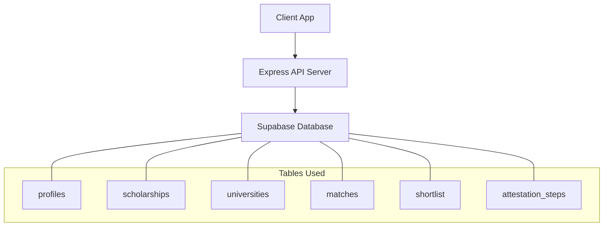
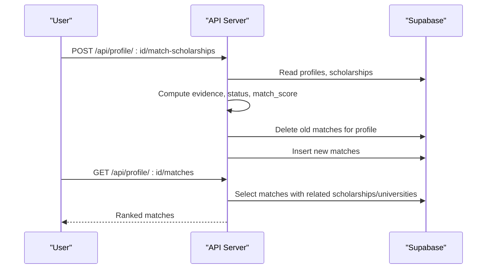
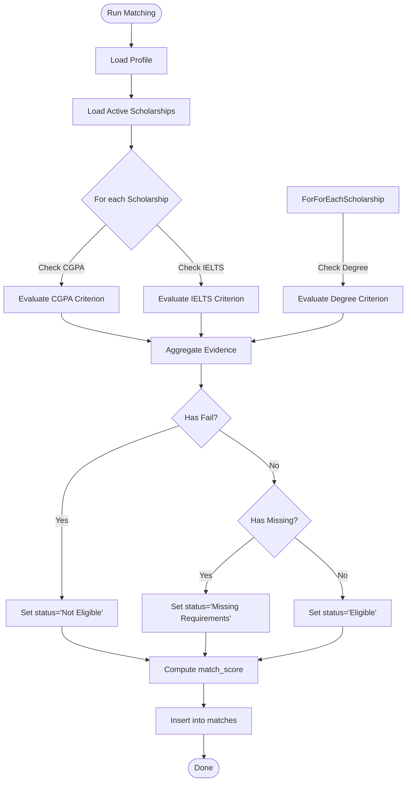
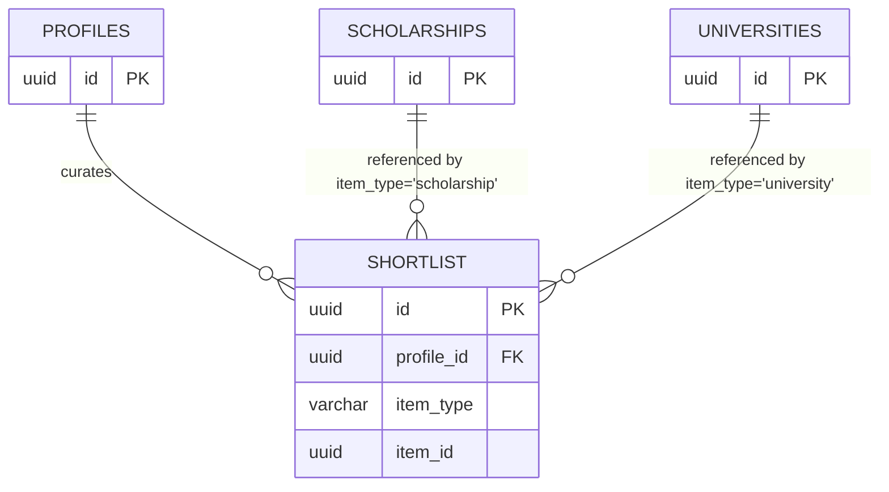
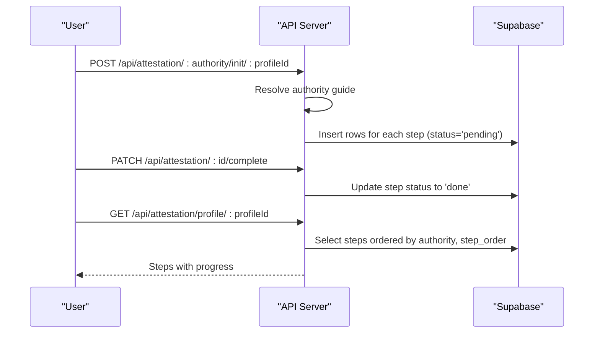
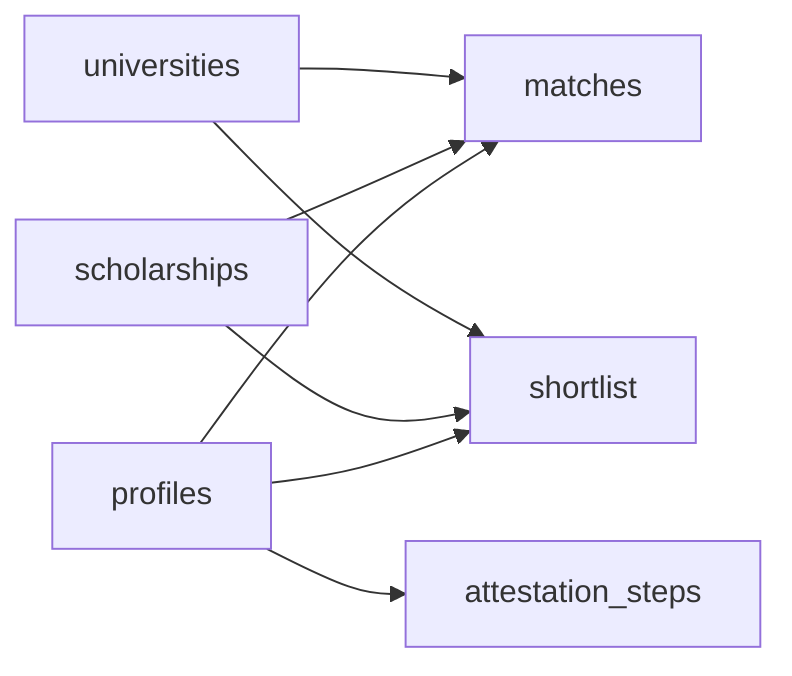

# Relationship Tables

<cite>
**Referenced Files in This Document**
- [index.js](file://aischolarpath-backend-main/aischolarpath-backend-main/index.js)
</cite>

## Table of Contents
1. [Introduction](#introduction)
2. [Project Structure](#project-structure)
3. [Core Components](#core-components)
4. [Architecture Overview](#architecture-overview)
5. [Detailed Component Analysis](#detailed-component-analysis)
6. [Dependency Analysis](#dependency-analysis)
7. [Performance Considerations](#performance-considerations)
8. [Troubleshooting Guide](#troubleshooting-guide)
9. [Conclusion](#conclusion)

## Introduction
This document explains the relationship and junction tables that connect core entities in ScholarPathAI, focusing on:
- matches: stores scholarship matching results per profile with scores, eligibility status, and evidence arrays
- shortlist: user-curated collections of scholarships and universities
- attestation_steps: tracks document verification progress across authorities (HEC, IBCC, MOFA)

It details foreign key relationships, composite keys, and how these tables enable complex queries for dashboard analytics and user workflows.

## Project Structure
The backend is an Express application using Supabase as the database. The relevant table interactions are implemented in a single server file that exposes REST endpoints for matching, shortlisting, and attestation tracking.

**Diagram sources**
- [index.js:50-54](file://aischolarpath-backend-main/aischolarpath-backend-main/index.js#L50-L54)
- [index.js:575-672](file://aischolarpath-backend-main/aischolarpath-backend-main/index.js#L575-L672)
- [index.js:751-819](file://aischolarpath-backend-main/aischolarpath-backend-main/index.js#L751-L819)
- [index.js:437-517](file://aischolarpath-backend-main/aischolarpath-backend-main/index.js#L437-L517)

**Section sources**
- [index.js:50-54](file://aischolarpath-backend-main/aischolarpath-backend-main/index.js#L50-L54)

## Core Components
- matches table: Stores one row per profile–scholarship pair with match_score, status, and evidence array used to compute eligibility and score.
- shortlist table: A many-to-many junction between profiles and items (scholarships or universities), identified by item_type and item_id.
- attestation_steps table: Tracks per-profile, per-authority step-by-step progress with authority, step_order, step_description, and status.

These tables support:
- Dashboard analytics: counts of eligible/missing/not eligible, top recommendations, university coverage
- User workflows: running matches, curating shortlists, and tracking attestation steps

**Section sources**
- [index.js:575-672](file://aischolarpath-backend-main/aischolarpath-backend-main/index.js#L575-L672)
- [index.js:675-692](file://aischolarpath-backend-main/aischolarpath-backend-main/index.js#L675-L692)
- [index.js:694-749](file://aischolarpath-backend-main/aischolarpath-backend-main/index.js#L694-L749)
- [index.js:751-819](file://aischolarpath-backend-main/aischolarpath-backend-main/index.js#L751-L819)
- [index.js:437-517](file://aischolarpath-backend-main/aischolarpath-backend-main/index.js#L437-L517)

## Architecture Overview
The matching workflow computes eligibility and evidence per scholarship, then persists results into matches. The shortlist allows users to mark scholarships/universities of interest. Attestation steps are initialized per authority and updated as users complete tasks.

**Diagram sources**
- [index.js:575-672](file://aischolarpath-backend-main/aischolarpath-backend-main/index.js#L575-L672)
- [index.js:675-692](file://aischolarpath-backend-main/aischolarpath-backend-main/index.js#L675-L692)

## Detailed Component Analysis

### matches table
Purpose:
- Records each profile’s evaluation against active scholarships
- Stores match_score (percentage based on passing criteria), status (Eligible, Missing Requirements, Not Eligible), and an evidence array detailing criterion checks

Key fields inferred from usage:
- profile_id: references profiles.id
- scholarship_id: references scholarships.id
- university_id: references universities.id (nullable when scholarship is country-wide)
- match_score: numeric percentage
- status: string enum-like value
- evidence: JSON array of objects with criterion, required, actual, result

Foreign keys:
- profile_id → profiles.id
- scholarship_id → scholarships.id
- university_id → universities.id (optional)

Composite keys:
- No explicit composite primary key is enforced in code; uniqueness is typically ensured by deleting prior matches for a profile before re-inserting fresh results

Complex queries enabled:
- Dashboard overview: count by status, top recommendations by match_score, unique universities covered
- Language prep insights: join matches with scholarships to compare required vs current language scores

Processing logic:
- Evidence computed per criterion (CGPA, IELTS, Degree)
- Status derived from presence of Fail or Missing
- match_score = pass_count / total_criteria * 100

**Diagram sources**
- [index.js:606-658](file://aischolarpath-backend-main/aischolarpath-backend-main/index.js#L606-L658)
- [index.js:660-672](file://aischolarpath-backend-main/aischolarpath-backend-main/index.js#L660-L672)

**Section sources**
- [index.js:575-672](file://aischolarpath-backend-main/aischolarpath-backend-main/index.js#L575-L672)
- [index.js:675-692](file://aischolarpath-backend-main/aischolarpath-backend-main/index.js#L675-L692)
- [index.js:694-749](file://aischolarpath-backend-main/aischolarpath-backend-main/index.js#L694-L749)

### shortlist table
Purpose:
- Allows users to curate a personal list of scholarships and universities
- Acts as a flexible junction between profiles and target items

Key fields inferred from usage:
- id: primary key
- profile_id: references profiles.id
- item_type: 'scholarship' or 'university'
- item_id: references scholarships.id or universities.id depending on item_type

Foreign keys:
- profile_id → profiles.id
- item_id → scholarships.id or universities.id (polymorphic reference via item_type)

Usage patterns:
- Add/remove items
- Retrieve full shortlist with joined details for scholarships and universities

**Diagram sources**
- [index.js:751-819](file://aischolarpath-backend-main/aischolarpath-backend-main/index.js#L751-L819)

**Section sources**
- [index.js:751-819](file://aischolarpath-backend-main/aischolarpath-backend-main/index.js#L751-L819)

### attestation_steps table
Purpose:
- Tracks per-profile, per-authority document verification steps (HEC, IBCC, MOFA)
- Enables step-by-step progress management and completion tracking

Key fields inferred from usage:
- id: primary key
- profile_id: references profiles.id
- authority: 'HEC', 'IBCC', or 'MOFA'
- step_order: integer ordering within an authority’s guide
- step_description: text describing the task
- status: 'pending' or 'done'

Foreign keys:
- profile_id → profiles.id

Initialization and updates:
- Initialize steps from static guides per authority
- Mark individual steps as done
- Query ordered by authority and step_order

**Diagram sources**
- [index.js:437-517](file://aischolarpath-backend-main/aischolarpath-backend-main/index.js#L437-L517)

**Section sources**
- [index.js:437-517](file://aischolarpath-backend-main/aischolarpath-backend-main/index.js#L437-L517)

## Dependency Analysis
Relationships among tables:
- matches depends on profiles, scholarships, universities
- shortlist depends on profiles and polymorphically on scholarships or universities
- attestation_steps depends on profiles

**Diagram sources**
- [index.js:575-672](file://aischolarpath-backend-main/aischolarpath-backend-main/index.js#L575-L672)
- [index.js:751-819](file://aischolarpath-backend-main/aischolarpath-backend-main/index.js#L751-L819)
- [index.js:437-517](file://aischolarpath-backend-main/aischolarpath-backend-main/index.js#L437-L517)

**Section sources**
- [index.js:575-672](file://aischolarpath-backend-main/aischolarpath-backend-main/index.js#L575-L672)
- [index.js:751-819](file://aischolarpath-backend-main/aischolarpath-backend-main/index.js#L751-L819)
- [index.js:437-517](file://aischolarpath-backend-main/aischolarpath-backend-main/index.js#L437-L517)

## Performance Considerations
- Matching recomputation: Old matches are deleted before inserting new ones to avoid duplicates and ensure consistent state.
- Query efficiency: Queries select only necessary fields and order by match_score for quick ranking.
- Bulk operations: Shortlist retrieval batches IDs and performs separate lookups for scholarships and universities to reduce payload size.
- Rate limiting: Scraping endpoints include delays to avoid overwhelming external sites; similar pacing should be considered for heavy analytics queries.

[No sources needed since this section provides general guidance]

## Troubleshooting Guide
Common issues and resolutions:
- Authorization errors: Ensure JWT token is valid and matches the requested profile_id; endpoints enforce ownership checks.
- Missing data: If matches are empty, verify that active scholarships exist and that matching has been run for the profile.
- Shortlist conflicts: Adding duplicate items may require application-level checks if unique constraints are not enforced at the database level.
- Attestation steps not found: When marking a step complete, confirm the step exists and belongs to the authenticated user.

Operational tips:
- Use the health and test-db endpoints to validate connectivity.
- Inspect error responses for detailed messages from Supabase.

**Section sources**
- [index.js:32-47](file://aischolarpath-backend-main/aischolarpath-backend-main/index.js#L32-L47)
- [index.js:62-68](file://aischolarpath-backend-main/aischolarpath-backend-main/index.js#L62-L68)
- [index.js:488-517](file://aischolarpath-backend-main/aischolarpath-backend-main/index.js#L488-L517)
- [index.js:773-783](file://aischolarpath-backend-main/aischolarpath-backend-main/index.js#L773-L783)

## Conclusion
The matches, shortlist, and attestation_steps tables form the backbone of ScholarPathAI’s user-centric workflows:
- matches enables personalized scholarship discovery and analytics
- shortlist supports curation and planning
- attestation_steps drives document verification progress across authorities

Together, they allow robust dashboards, actionable insights, and streamlined application journeys.

[No sources needed since this section summarizes without analyzing specific files]