# Schema Design

<cite>
**Referenced Files in This Document**
- [index.js](file://aischolarpath-backend-main/aischolarpath-backend-main/index.js)
- [package.json](file://aischolarpath-backend-main/aischolarpath-backend-main/package.json)
</cite>

## Table of Contents
1. [Introduction](#introduction)
2. [Project Structure](#project-structure)
3. [Core Components](#core-components)
4. [Architecture Overview](#architecture-overview)
5. [Detailed Component Analysis](#detailed-component-analysis)
6. [Dependency Analysis](#dependency-analysis)
7. [Performance Considerations](#performance-considerations)
8. [Troubleshooting Guide](#troubleshooting-guide)
9. [Conclusion](#conclusion)

## Introduction
This document describes the Supabase PostgreSQL schema design inferred from the backend codebase for the scholarship matching system. It focuses on the core tables used by the application: profiles, scholarships, universities, matches, shortlist, and attestation_steps. It also documents additional tables observed in the code (applications, notifications, discovery_log, extracted_profile_data) to provide a complete picture of data relationships. The goal is to explain how these tables support user profile management, scholarship matching, and document attestation workflows, including foreign key relationships, data types inferred from usage, and indexing strategies recommended for performance.

## Project Structure
The backend is an Express server that connects to Supabase using the official client. All database interactions are performed via PostgREST-style queries against Supabase-managed tables. No SQL migration files are present in this repository; therefore, the schema is inferred from runtime usage patterns in the backend code.

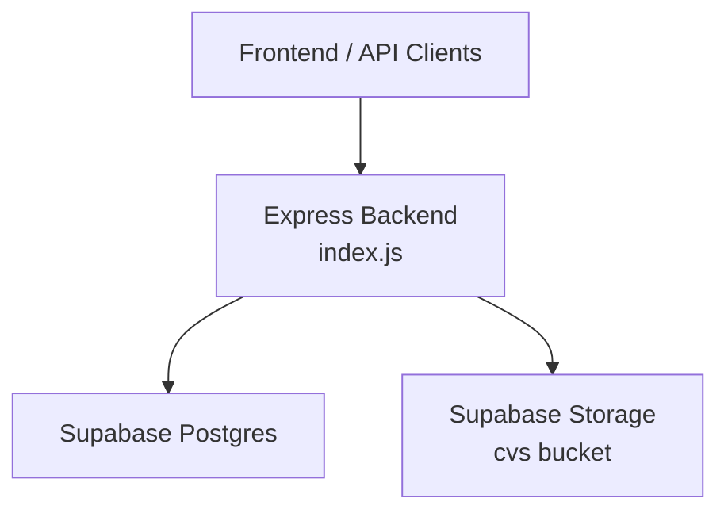

**Section sources**
- [index.js:27-54](file://aischolarpath-backend-main/aischolarpath-backend-main/index.js#L27-L54)
- [index.js:112-145](file://aischolarpath-backend-main/aischolarpath-backend-main/index.js#L112-L145)

## Core Components
The following tables are central to the application’s functionality:

- profiles: Stores user account information and academic preferences.
- scholarships: Catalogs available scholarships with eligibility criteria and deadlines.
- universities: Represents institutions offering scholarships or country-wide programs.
- matches: Records AI-driven match results between a profile and scholarships.
- shortlist: Allows users to bookmark scholarships or universities.
- attestation_steps: Tracks progress through document attestation steps per authority.

Additional supporting tables:
- applications: Tracks user applications to specific scholarships.
- notifications: Stores user notifications and reminders.
- discovery_log: Logs scraping activities and outcomes.
- extracted_profile_data: Stores raw extraction results during CV analysis.

Key relationships inferred from usage:
- scholarships references universities (optional): Many scholarships may be linked to a university; some are country-wide and have no university link.
- matches references profiles and scholarships: Each match ties a user profile to a scholarship and includes a computed match score and status.
- shortlist references profiles and polymorphically references scholarships/universities via item_type and item_id.
- applications references profiles and scholarships: Tracks application lifecycle per user and scholarship.
- notifications references profiles: Per-user notifications.
- attestation_steps references profiles: Per-user attestation workflow steps.
- discovery_log: Independent log table for scraping operations.
- extracted_profile_data references profiles: Stores extracted data per profile.

**Section sources**
- [index.js:69-110](file://aischolarpath-backend-main/aischolarpath-backend-main/index.js#L69-L110)
- [index.js:189-222](file://aischolarpath-backend-main/aischolarpath-backend-main/index.js#L189-L222)
- [index.js:224-288](file://aischolarpath-backend-main/aischolarpath-backend-main/index.js#L224-L288)
- [index.js:574-692](file://aischolarpath-backend-main/aischolarpath-backend-main/index.js#L574-L692)
- [index.js:750-820](file://aischolarpath-backend-main/aischolarpath-backend-main/index.js#L750-L820)
- [index.js:821-905](file://aischolarpath-backend-main/aischolarpath-backend-main/index.js#L821-L905)
- [index.js:982-1051](file://aischolarpath-backend-main/aischolarpath-backend-main/index.js#L982-L1051)
- [index.js:437-517](file://aischolarpath-backend-main/aischolarpath-backend-main/index.js#L437-L517)
- [index.js:1182-1257](file://aischolarpath-backend-main/aischolarpath-backend-main/index.js#L1182-L1257)
- [index.js:162-188](file://aischolarpath-backend-main/aischolarpath-backend-main/index.js#L162-L188)

## Architecture Overview
The backend orchestrates user authentication, profile updates, scholarship discovery, matching computation, shortlisting, application tracking, notifications, and attestation workflows. Data flows through Supabase queries to the underlying PostgreSQL database.

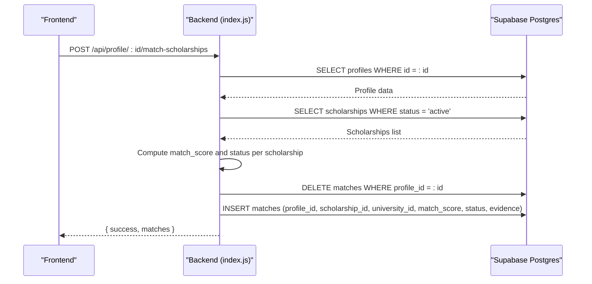

**Diagram sources**
- [index.js:574-692](file://aischolarpath-backend-main/aischolarpath-backend-main/index.js#L574-L692)

**Section sources**
- [index.js:574-692](file://aischolarpath-backend-main/aischolarpath-backend-main/index.js#L574-L692)

## Detailed Component Analysis

### Profiles
- Purpose: User identity and academic preferences.
- Observed fields: id, full_name, email, password_hash, cgpa, ielts_score, target_country, target_degree, target_department, cv_file_path, reset_token, reset_token_expiry.
- Usage highlights:
  - Authentication and profile updates.
  - CV file path stored after upload.
  - Password reset token fields used in forgot/reset flows.

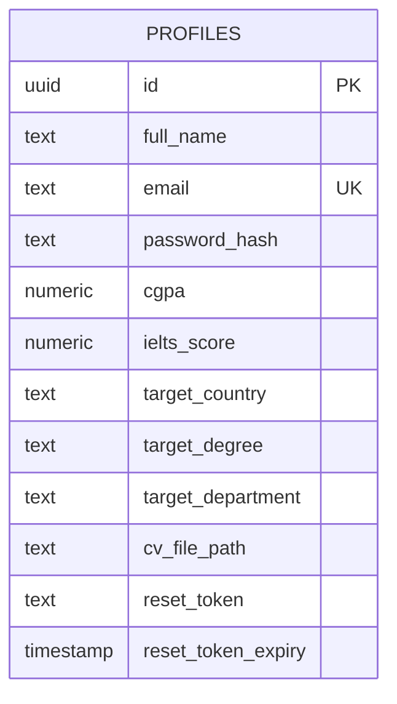

**Section sources**
- [index.js:69-110](file://aischolarpath-backend-main/aischolarpath-backend-main/index.js#L69-L110)
- [index.js:112-145](file://aischolarpath-backend-main/aischolarpath-backend-main/index.js#L112-L145)
- [index.js:518-573](file://aischolarpath-backend-main/aischolarpath-backend-main/index.js#L518-L573)
- [index.js:1101-1181](file://aischolarpath-backend-main/aischolarpath-backend-main/index.js#L1101-L1181)

### Universities
- Purpose: Institutions offering scholarships or country-wide programs.
- Observed fields: id, name, country, degree_programs (array), official_portal_url.
- Usage highlights:
  - Filtering by country and degree programs.
  - Joins with scholarships to display university details.

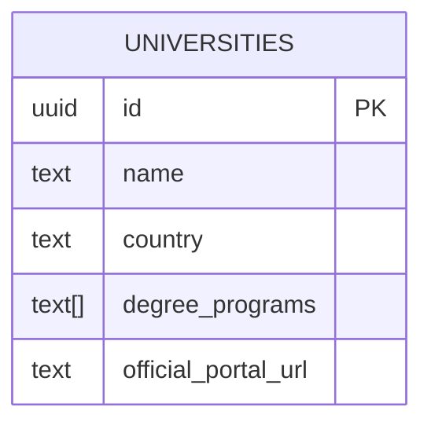

**Section sources**
- [index.js:224-288](file://aischolarpath-backend-main/aischolarpath-backend-main/index.js#L224-L288)

### Scholarships
- Purpose: Catalog of scholarships with eligibility criteria and deadlines.
- Observed fields: id, title, country, department, degree_level, eligibility_criteria (JSON), deadline, apply_url, source_url, status, last_verified_at, university_id (nullable).
- Usage highlights:
  - Filtering by country, type, department, degree level.
  - Status values include 'active' and 'under_review'.
  - Upsert behavior on title+country for discovery endpoints.

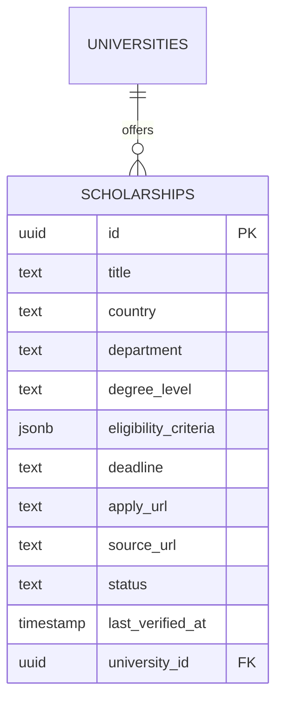

**Section sources**
- [index.js:189-222](file://aischolarpath-backend-main/aischolarpath-backend-main/index.js#L189-L222)
- [index.js:1310-1439](file://aischolarpath-backend-main/aischolarpath-backend-main/index.js#L1310-L1439)
- [index.js:1494-1526](file://aischolarpath-backend-main/aischolarpath-backend-main/index.js#L1494-L1526)

### Matches
- Purpose: Computed match results between a profile and scholarships.
- Observed fields: id, profile_id, scholarship_id, university_id, match_score, status, evidence (JSON array).
- Usage highlights:
  - Deletion of old matches before recomputation.
  - Ordering by match_score descending for recommendations.
  - Status values: 'Eligible', 'Missing Requirements', 'Not Eligible'.

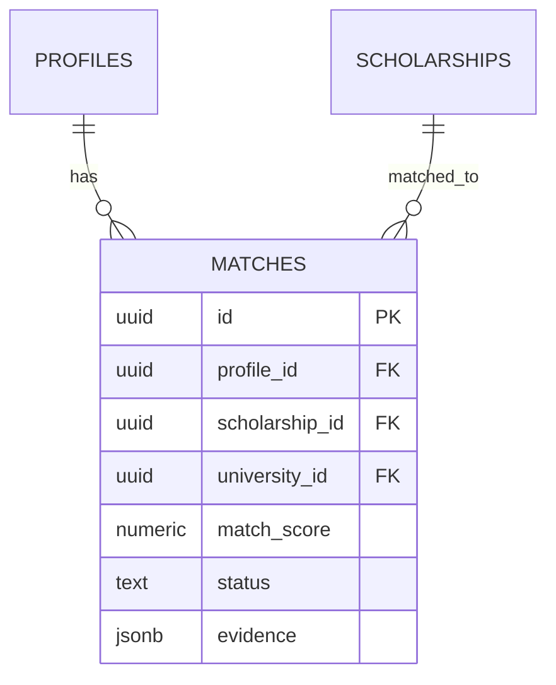

**Section sources**
- [index.js:574-692](file://aischolarpath-backend-main/aischolarpath-backend-main/index.js#L574-L692)

### Shortlist
- Purpose: User bookmarks for scholarships or universities.
- Observed fields: id, profile_id, item_type ('scholarship' | 'university'), item_id.
- Usage highlights:
  - Insert/remove items.
  - Fetching shortlisted items and resolving details via separate queries.

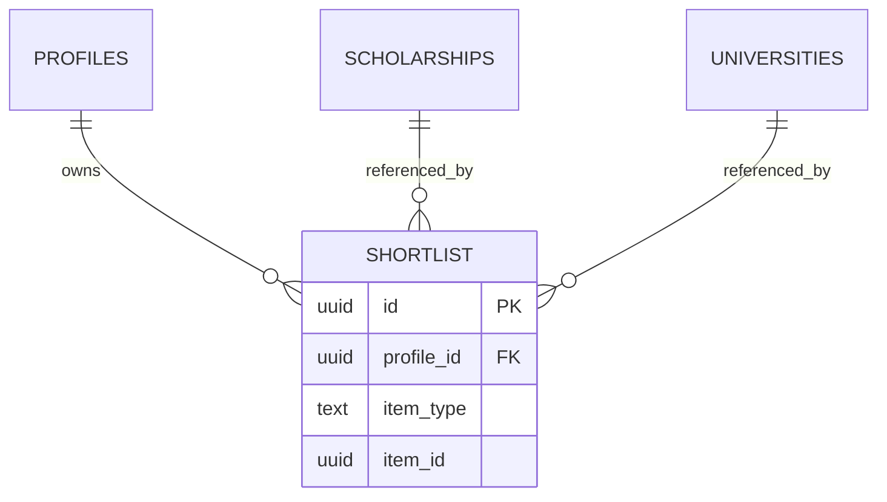

**Section sources**
- [index.js:750-820](file://aischolarpath-backend-main/aischolarpath-backend-main/index.js#L750-L820)

### Applications
- Purpose: Track user applications to scholarships.
- Observed fields: id, profile_id, scholarship_id, status, notes, next_action, next_action_date, updated_at.
- Usage highlights:
  - CRUD operations for applications.
  - Used to generate deadline reminders.

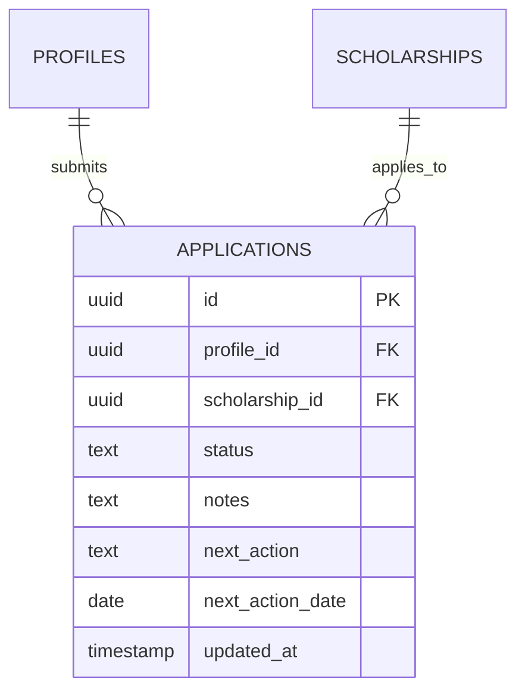

**Section sources**
- [index.js:821-905](file://aischolarpath-backend-main/aischolarpath-backend-main/index.js#L821-L905)

### Notifications
- Purpose: Store user notifications and reminders.
- Observed fields: id, profile_id, type, title, message, is_read, created_at.
- Usage highlights:
  - Creating notifications for upcoming deadlines.
  - Marking notifications as read.

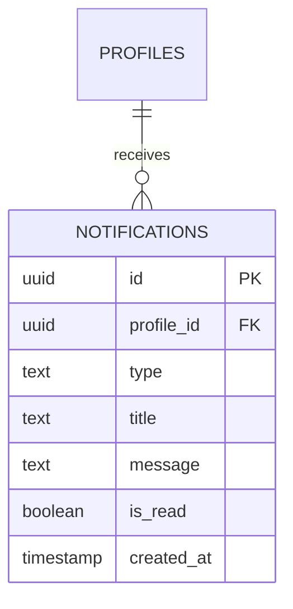

**Section sources**
- [index.js:982-1051](file://aischolarpath-backend-main/aischolarpath-backend-main/index.js#L982-L1051)
- [index.js:1053-1100](file://aischolarpath-backend-main/aischolarpath-backend-main/index.js#L1053-L1100)

### Attestation Steps
- Purpose: Track progress through document attestation steps per authority.
- Observed fields: id, profile_id, authority, step_order, step_description, status ('pending' | 'done').
- Usage highlights:
  - Initializing steps based on static guides.
  - Querying steps ordered by authority and step_order.
  - Marking individual steps as done.

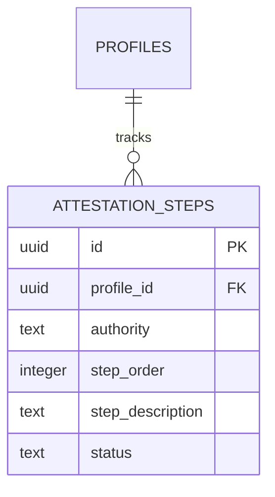

**Section sources**
- [index.js:437-517](file://aischolarpath-backend-main/aischolarpath-backend-main/index.js#L437-L517)

### Additional Tables
- discovery_log: Logs scraping attempts with source_url, status, raw_snapshot, fetched_at.
- extracted_profile_data: Stores raw extraction results per profile, including skills arrays.

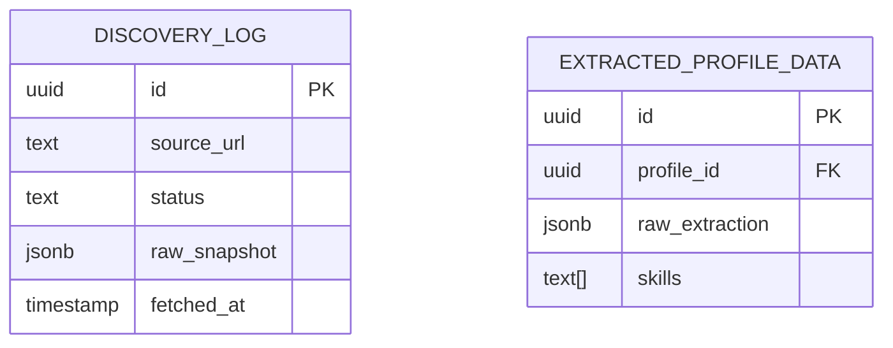

**Section sources**
- [index.js:1182-1257](file://aischolarpath-backend-main/aischolarpath-backend-main/index.js#L1182-L1257)
- [index.js:162-188](file://aischolarpath-backend-main/aischolarpath-backend-main/index.js#L162-L188)

## Dependency Analysis
Relationships among core tables:

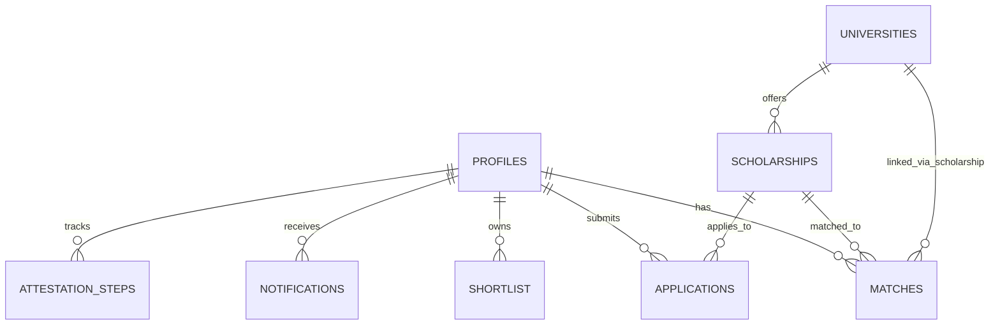

Foreign keys inferred from usage:
- matches.profile_id -> profiles.id
- matches.scholarship_id -> scholarships.id
- matches.university_id -> universities.id (nullable)
- shortlist.profile_id -> profiles.id
- applications.profile_id -> profiles.id
- applications.scholarship_id -> scholarships.id
- notifications.profile_id -> profiles.id
- attestation_steps.profile_id -> profiles.id
- scholarships.university_id -> universities.id (nullable)

Indexing strategy recommendations based on query patterns:
- profiles:
  - Unique index on email for fast lookups during auth.
  - Index on id (primary key).
- scholarships:
  - Index on status for filtering active vs under_review.
  - Index on country for geographic filtering.
  - Index on university_id for joins and filtering.
  - Composite index on (title, country) for upsert conflict resolution.
- matches:
  - Index on profile_id for per-user match retrieval.
  - Index on status for dashboard summaries.
  - Index on match_score for ranking.
  - Composite index on (profile_id, status) for filtered lists.
- shortlist:
  - Index on profile_id for fetching user shortlists.
  - Index on item_type for polymorphic queries.
- applications:
  - Index on profile_id for per-user application lists.
  - Index on status for filtering active applications.
  - Index on scholarship_id for deadline checks.
- notifications:
  - Index on profile_id for per-user notification lists.
  - Index on created_at for ordering recent notifications.
  - Index on is_read for read/unread filtering.
- attestation_steps:
  - Index on profile_id for per-user step lists.
  - Composite index on (authority, step_order) for ordered retrieval.
- discovery_log:
  - Index on fetched_at for recent logs.
  - Index on source_url for deduplication if needed.
- extracted_profile_data:
  - Index on profile_id for per-profile extractions.

**Section sources**
- [index.js:189-222](file://aischolarpath-backend-main/aischolarpath-backend-main/index.js#L189-L222)
- [index.js:574-692](file://aischolarpath-backend-main/aischolarpath-backend-main/index.js#L574-L692)
- [index.js:750-820](file://aischolarpath-backend-main/aischolarpath-backend-main/index.js#L750-L820)
- [index.js:821-905](file://aischolarpath-backend-main/aischolarpath-backend-main/index.js#L821-L905)
- [index.js:982-1051](file://aischolarpath-backend-main/aischolarpath-backend-main/index.js#L982-L1051)
- [index.js:1182-1257](file://aischolarpath-backend-main/aischolarpath-backend-main/index.js#L1182-L1257)
- [index.js:1310-1439](file://aischolarpath-backend-main/aischolarpath-backend-main/index.js#L1310-L1439)

## Performance Considerations
- Use indexes on frequently filtered columns:
  - profiles.email for authentication lookups.
  - scholarships.status, scholarships.country, scholarships.university_id for listing and filtering.
  - matches.profile_id, matches.status, matches.match_score for matching and dashboard queries.
  - applications.profile_id, applications.status for application management.
  - notifications.profile_id, notifications.created_at for notification feeds.
  - attestation_steps.profile_id, attestation_steps.authority, attestation_steps.step_order for workflow tracking.
- Avoid unnecessary joins:
  - When retrieving shortlists, fetch related scholarships/universities separately to reduce payload size.
- Optimize bulk operations:
  - Use batch inserts for matches and discovery logs where appropriate.
- Cache hot reads:
  - Consider caching scholarship listings and university catalogs at the application layer if traffic increases.
- Monitor query plans:
  - Ensure composite indexes align with common filter combinations (e.g., profile_id + status).

[No sources needed since this section provides general guidance]

## Troubleshooting Guide
Common issues and resolutions:
- Authentication failures:
  - Verify JWT_SECRET environment variable and token validity.
  - Check profiles.password_hash and reset_token fields during password flows.
- Database connection errors:
  - Validate SUPABASE_URL and SUPABASE_KEY environment variables.
  - Use /api/test-db to confirm connectivity.
- Missing data errors:
  - Ensure required fields are provided (e.g., profile_id, scholarship_id).
  - Check authorization middleware to ensure correct user context.
- Matching not updating:
  - Confirm old matches are deleted before inserting new ones.
  - Validate eligibility_criteria structure in scholarships.
- Attestation steps not appearing:
  - Ensure initialization endpoint is called for the authority.
  - Verify profile_id matches authenticated user.

**Section sources**
- [index.js:32-47](file://aischolarpath-backend-main/aischolarpath-backend-main/index.js#L32-L47)
- [index.js:57-68](file://aischolarpath-backend-main/aischolarpath-backend-main/index.js#L57-L68)
- [index.js:518-573](file://aischolarpath-backend-main/aischolarpath-backend-main/index.js#L518-L573)
- [index.js:574-692](file://aischolarpath-backend-main/aischolarpath-backend-main/index.js#L574-L692)
- [index.js:437-517](file://aischolarpath-backend-main/aischolarpath-backend-main/index.js#L437-L517)

## Conclusion
The schema supports a comprehensive scholarship matching system by linking user profiles to scholarships and universities, computing match scores, and enabling user workflows such as shortlisting, application tracking, notifications, and document attestation. Proper indexing on key fields like profile_id, university_id, and status ensures efficient querying across high-frequency operations. The modular design allows for extensibility, such as adding more authorities for attestation or expanding discovery capabilities.

[No sources needed since this section summarizes without analyzing specific files]