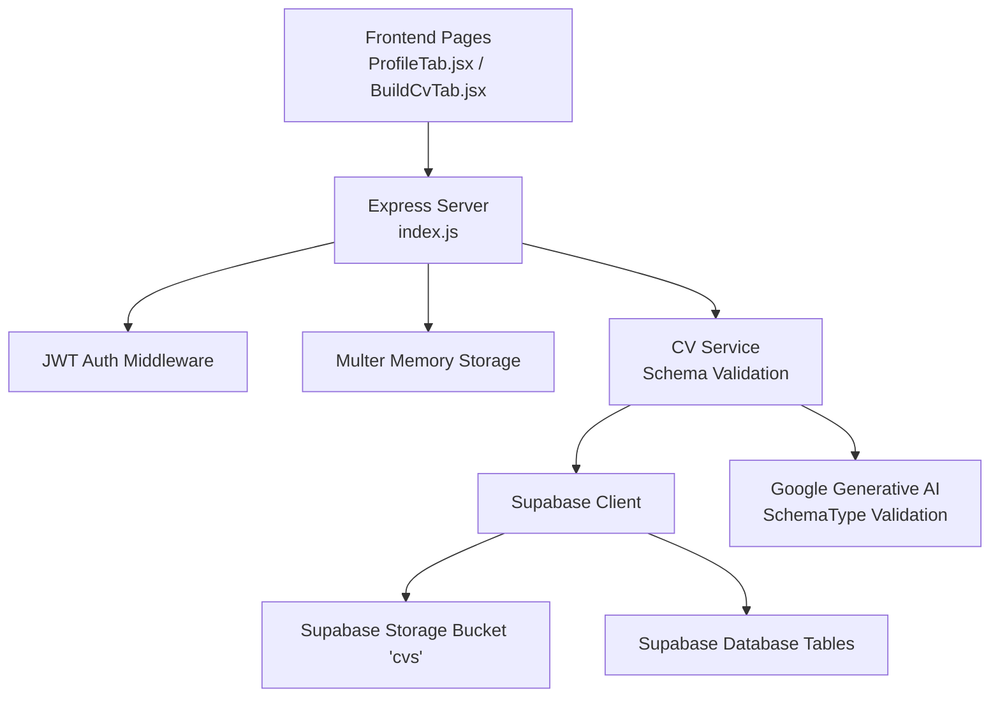
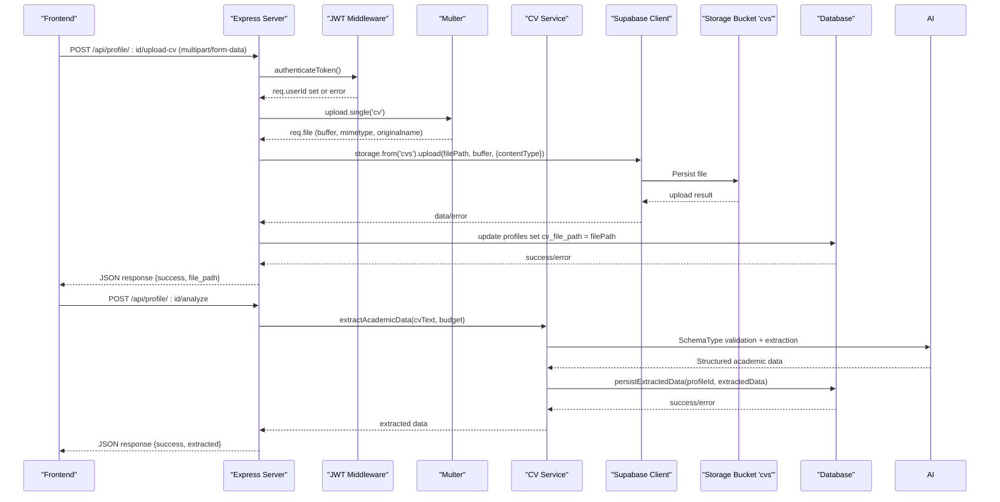
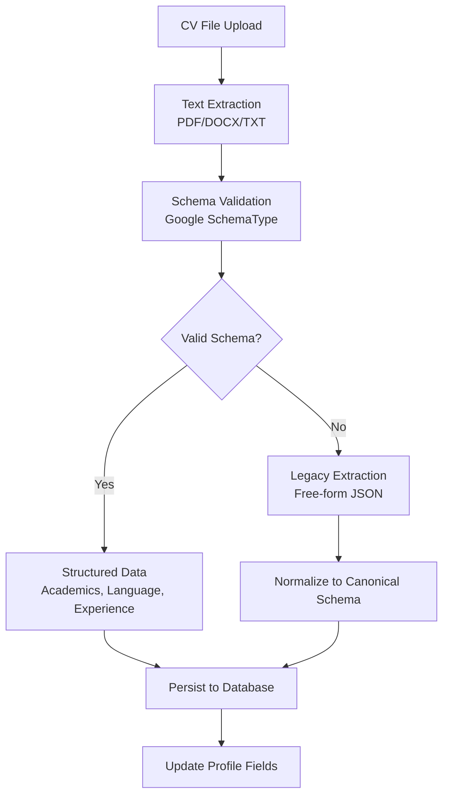
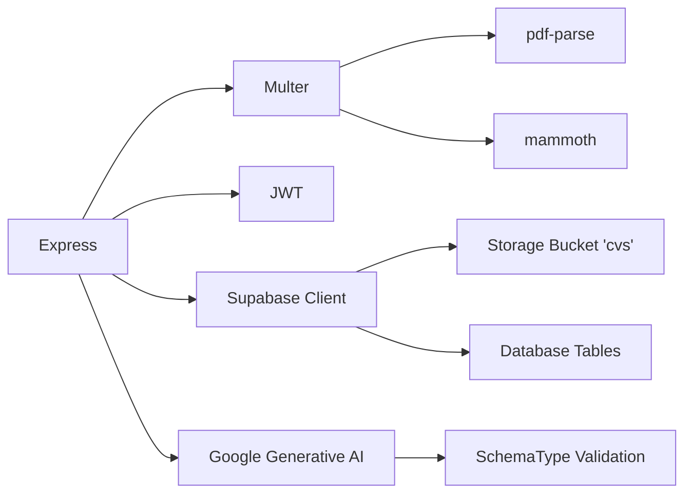

# File Upload System

<cite>
**Referenced Files in This Document**
- [cv.service.js](file://aischolarpath-backend-main/aischolarpath-backend-main/services/cv.service.js)
- [profile.controller.js](file://aischolarpath-backend-main/aischolarpath-backend-main/controllers/profile.controller.js)
- [documents.controller.js](file://aischolarpath-backend-main/aischolarpath-backend-main/controllers/documents.controller.js)
- [index.js](file://aischolarpath-backend-main/aischolarpath-backend-main/index.js)
- [package.json](file://aischolarpath-backend-main/aischolarpath-backend-main/package.json)
- [ProfileTab.jsx](file://scholarpath-frontend (2)/scholarpath/src/pages/ProfileTab.jsx)
- [BuildCvTab.jsx](file://scholarpath-frontend (2)/scholarpath/src/pages/BuildCvTab.jsx)
- [upload.js](file://aischolarpath-backend-main/aischolarpath-backend-main/middleware/upload.js)
- [supabase.js](file://aischolarpath-backend-main/aischolarpath-backend-main/config/supabase.js)
</cite>

## Update Summary
**Changes Made**
- Enhanced CV processing with strict JSON schema validation using Google's SchemaType
- Improved PDF and DOCX file processing with better error handling
- Added structured data extraction with fallback mechanisms
- Enhanced Europass PDF generation with comprehensive section parsing
- Updated file upload workflow to support both direct uploads and stored file retrieval

## Table of Contents
1. [Introduction](#introduction)
2. [Project Structure](#project-structure)
3. [Core Components](#core-components)
4. [Architecture Overview](#architecture-overview)
5. [Detailed Component Analysis](#detailed-component-analysis)
6. [Enhanced CV Processing](#enhanced-cv-processing)
7. [Dependency Analysis](#dependency-analysis)
8. [Performance Considerations](#performance-considerations)
9. [Troubleshooting Guide](#troubleshooting-guide)
10. [Conclusion](#conclusion)
11. [Appendices](#appendices)

## Introduction
This document explains the enhanced file upload system for CVs built with Multer and Supabase Storage, featuring strict JSON schema validation through Google's SchemaType. It covers the end-to-end workflow from frontend selection to backend validation, secure path generation, storage in a dedicated bucket, and structured data extraction with improved PDF and DOCX processing capabilities. The system now includes robust error handling, fallback mechanisms, and comprehensive metadata persistence for academic scholarship matching.

## Project Structure
The project consists of:
- Backend API server using Express that handles authentication, file uploads via Multer, and persistent storage via Supabase Storage.
- Frontend React application with pages that allow users to select files and trigger upload or analysis flows.
- Enhanced CV processing service with strict schema validation and improved file parsing capabilities.

**Diagram sources**
- [index.js:17-79](file://aischolarpath-backend-main/aischolarpath-backend-main/index.js#L17-L79)
- [cv.service.js:14-27](file://aischolarpath-backend-main/aischolarpath-backend-main/services/cv.service.js#L14-L27)
- [cv.service.js:97-220](file://aischolarpath-backend-main/aischolarpath-backend-main/services/cv.service.js#L97-L220)
- [ProfileTab.jsx:116-136](file://scholarpath-frontend (2)/scholarpath/src/pages/ProfileTab.jsx#L116-L136)

**Section sources**
- [index.js:17-79](file://aischolarpath-backend-main/aischolarpath-backend-main/index.js#L17-L79)
- [package.json:8-24](file://aischolarpath-backend-main/aischolarpath-backend-main/package.json#L8-L24)
- [ProfileTab.jsx:116-136](file://scholarpath-frontend (2)/scholarpath/src/pages/ProfileTab.jsx#L116-L136)
- [BuildCvTab.jsx:58-116](file://scholarpath-frontend (2)/scholarpath/src/pages/BuildCvTab.jsx#L58-L116)

## Core Components
- Authentication middleware validates JWT tokens and attaches user identity to requests.
- Multer is configured to store uploaded files in memory as buffers for direct streaming to Supabase Storage.
- Enhanced CV service with strict JSON schema validation using Google's SchemaType for structured data extraction.
- Supabase client connects to the configured environment variables and performs storage uploads and database updates.
- Frontend components provide UI for selecting files and triggering upload/analysis actions.

Key responsibilities:
- Enforce authorization before processing uploads.
- Validate presence of uploaded file and construct safe paths.
- Upload to a dedicated Supabase bucket and persist file path metadata in the profile record.
- Extract structured academic data with schema validation and fallback mechanisms.

**Section sources**
- [profile.controller.js:84-118](file://aischolarpath-backend-main/aischolarpath-backend-main/controllers/profile.controller.js#L84-L118)
- [profile.controller.js:120-169](file://aischolarpath-backend-main/aischolarpath-backend-main/controllers/profile.controller.js#L120-L169)
- [cv.service.js:97-220](file://aischolarpath-backend-main/aischolarpath-backend-main/services/cv.service.js#L97-L220)
- [package.json:8-24](file://aischolarpath-backend-main/aischolarpath-backend-main/package.json#L8-L24)

## Architecture Overview
The enhanced CV upload flow uses an authenticated endpoint that accepts a single file field, stores it temporarily in memory, uploads it to a Supabase bucket named "cvs", extracts structured academic data using strict JSON schema validation, and records both the file path and extracted metadata in the user's profile.

**Diagram sources**
- [profile.controller.js:84-169](file://aischolarpath-backend-main/aischolarpath-backend-main/controllers/profile.controller.js#L84-L169)
- [cv.service.js:97-220](file://aischolarpath-backend-main/aischolarpath-backend-main/services/cv.service.js#L97-L220)
- [cv.service.js:226-267](file://aischolarpath-backend-main/aischolarpath-backend-main/services/cv.service.js#L226-L267)

## Detailed Component Analysis

### Backend Upload Endpoint
- Route: POST /api/profile/:id/upload-cv
- Middleware chain:
  - JWT authentication ensures the request belongs to the profile owner.
  - Multer processes multipart form data and exposes req.file.
- Processing:
  - Validates that a file was provided.
  - Generates a secure path combining the user id, timestamp, and original filename.
  - Uploads the file buffer to the "cvs" bucket with the correct content type.
  - Updates the profile record to store the file path for later retrieval.
- Responses:
  - Returns success with the stored file path on completion.
  - Returns appropriate error codes for missing files, authorization failures, or storage/database errors.

Security notes:
- Authorization checks prevent cross-user access.
- Path construction includes user id and timestamp to isolate files per user and avoid collisions.
- Content type is preserved from the incoming file metadata.

Operational notes:
- Uses memory storage; ensure request size limits are enforced at the proxy or framework level for large files.
- Environment variables for Supabase URL and key are validated at startup.

**Section sources**
- [profile.controller.js:84-118](file://aischolarpath-backend-main/aischolarpath-backend-main/controllers/profile.controller.js#L84-L118)
- [upload.js:1-9](file://aischolarpath-backend-main/aischolarpath-backend-main/middleware/upload.js#L1-L9)

### Enhanced CV Analysis Endpoint
- Route: POST /api/profile/:id/analyze
- Supports both direct file uploads and retrieval from stored files in Supabase Storage.
- Implements strict JSON schema validation using Google's SchemaType for structured data extraction.
- Provides fallback mechanisms when schema validation fails.
- Persists extracted data to both `extracted_profile_data` table and profile fields.

Processing workflow:
1. Accepts file upload or retrieves stored CV from Supabase Storage.
2. Extracts text from PDF, DOCX, or TXT files with improved error handling.
3. Performs AI-powered extraction with strict schema validation.
4. Normalizes legacy data formats to canonical schema structure.
5. Persists extracted data and updates profile fields automatically.

**Section sources**
- [profile.controller.js:120-169](file://aischolarpath-backend-main/aischolarpath-backend-main/controllers/profile.controller.js#L120-L169)
- [cv.service.js:97-220](file://aischolarpath-backend-main/aischolarpath-backend-main/services/cv.service.js#L97-L220)

### Frontend Upload Handling
- ProfileTab.jsx provides a document list with status badges and an input[type="file"] for each document slot. Selecting a file updates local state to mark the item as submitted and tracks the file name.
- BuildCvTab.jsx offers a drag-and-drop style area to select PDF or DOCX files, indicating supported formats and size guidance.

Integration points:
- The frontend triggers upload by sending a multipart/form-data request to the backend endpoint with the field name "cv".
- After successful upload, the UI can enable analysis or display confirmation.
- Supports re-analysis of previously uploaded CVs.

Progress handling:
- Current implementation does not include progress reporting; this can be added using fetch/XMLHttpRequest upload events or a library like axios with onUploadProgress.

Metadata handling:
- The backend persists both the file path and extracted academic data in the profile.
- Extracted data includes structured information about academics, language proficiency, and experience.

**Section sources**
- [ProfileTab.jsx:116-165](file://scholarpath-frontend (2)/scholarpath/src/pages/ProfileTab.jsx#L116-L165)
- [BuildCvTab.jsx:58-116](file://scholarpath-frontend (2)/scholarpath/src/pages/BuildCvTab.jsx#L58-L116)

### Security Measures
- Authentication: All upload routes require a valid JWT token; unauthorized requests are rejected.
- Authorization: The route verifies that the requested profile id matches the authenticated user id.
- Path sanitization: Paths are constructed using the user id and a timestamp to avoid directory traversal and collisions.
- File type validation: The current implementation trusts the incoming content type; consider adding explicit allowlists for expected types (e.g., PDF, DOCX).
- Size limits: Multer is configured with memory storage without explicit size limits; enforce limits at the HTTP layer or via Multer options to protect against abuse.
- Schema validation: Strict JSON schema validation prevents malformed data from being processed.

Recommendations:
- Add strict MIME type allowlist and reject unexpected types.
- Enforce maximum file size to prevent memory exhaustion.
- Sanitize or replace original filenames to remove potentially dangerous characters.
- Use Supabase Storage policies to restrict bucket access to authorized users.

**Section sources**
- [profile.controller.js:84-169](file://aischolarpath-backend-main/aischolarpath-backend-main/controllers/profile.controller.js#L84-L169)
- [cv.service.js:97-220](file://aischolarpath-backend-main/aischolarpath-backend-main/services/cv.service.js#L97-L220)

### Data Flow and Metadata
- Uploaded file buffer is sent directly to Supabase Storage with the content type from the request.
- The stored file path is saved in the profile table under a dedicated column, enabling later retrieval and linking.
- Extracted academic data is persisted in both the `extracted_profile_data` table and normalized into profile fields.
- Supports both new nested schema shape and legacy flat shape for backward compatibility.

**Section sources**
- [profile.controller.js:120-169](file://aischolarpath-backend-main/aischolarpath-backend-main/controllers/profile.controller.js#L120-L169)
- [cv.service.js:226-267](file://aischolarpath-backend-main/aischolarpath-backend-main/services/cv.service.js#L226-L267)

## Enhanced CV Processing

### Strict JSON Schema Validation
The system now implements strict JSON schema validation using Google's SchemaType to ensure consistent and reliable data extraction from CVs. The schema defines a structured format for academic information including:

- **Academics**: FSc percentage, CGPA, degree level, and field of study
- **Language**: IELTS score with proper validation ranges
- **Experience**: Years of experience and skills array

**Diagram sources**
- [cv.service.js:97-220](file://aischolarpath-backend-main/aischolarpath-backend-main/services/cv.service.js#L97-L220)
- [cv.service.js:226-267](file://aischolarpath-backend-main/aischolarpath-backend-main/services/cv.service.js#L226-L267)

### Improved File Processing
Enhanced PDF and DOCX processing with better error handling and data extraction accuracy:

- **PDF Processing**: Uses pdf-parse with graceful error handling and character limits
- **DOCX Processing**: Leverages mammoth library with raw text extraction
- **TXT Processing**: Direct UTF-8 string conversion with size limitations
- **Error Handling**: Comprehensive error messages and fallback responses for unsupported formats

### Europass PDF Generation
Advanced Europass format conversion with comprehensive section parsing:

- **Personal Information**: Name, email, phone, address extraction
- **Professional Summary**: AI-generated professional overview
- **Work Experience**: Detailed job history with roles, employers, and descriptions
- **Education**: Academic background with institutions and achievements
- **Skills Categorization**: Technical, communication, organizational, digital, and other skills
- **Certifications & Projects**: Professional credentials and project highlights
- **Languages & Hobbies**: Language proficiency and personal interests
- **References**: Professional references or standard placeholder

**Section sources**
- [cv.service.js:34-56](file://aischolarpath-backend-main/aischolarpath-backend-main/services/cv.service.js#L34-L56)
- [cv.service.js:273-334](file://aischolarpath-backend-main/aischolarpath-backend-main/services/cv.service.js#L273-L334)
- [cv.service.js:340-606](file://aischolarpath-backend-main/aischolarpath-backend-main/services/cv.service.js#L340-L606)

## Dependency Analysis
The enhanced upload system depends on:
- Express for routing and middleware.
- Multer for parsing multipart uploads into memory buffers.
- Supabase JS client for storage and database operations.
- JWT for authentication and authorization.
- Google Generative AI for schema-based CV extraction.
- PDF and DOCX parsing libraries for file content extraction.

**Diagram sources**
- [package.json:8-24](file://aischolarpath-backend-main/aischolarpath-backend-main/package.json#L8-L24)
- [cv.service.js:14-27](file://aischolarpath-backend-main/aischolarpath-backend-main/services/cv.service.js#L14-L27)
- [cv.service.js:97-220](file://aischolarpath-backend-main/aischolarpath-backend-main/services/cv.service.js#L97-L220)

**Section sources**
- [package.json:8-24](file://aischolarpath-backend-main/aischolarpath-backend-main/package.json#L8-L24)
- [cv.service.js:14-27](file://aischolarpath-backend-main/aischolarpath-backend-main/services/cv.service.js#L14-L27)

## Performance Considerations
- Memory usage: Using memory storage means large files consume server RAM. For high traffic or large files, consider disk storage or streaming directly to object storage with chunked uploads.
- Concurrency: The global undici agent configures connection pooling and timeouts; tune these based on expected load.
- Caching: Consider caching public URLs for frequently accessed files if applicable.
- Rate limiting: Implement rate limiting on upload endpoints to mitigate abuse.
- Schema validation overhead: Strict schema validation adds processing time but ensures data quality and consistency.
- File parsing optimization: PDF and DOCX parsing are resource-intensive; consider async processing for large files.

## Troubleshooting Guide
Common issues and resolutions:
- Missing environment variables: Startup validation exits if required variables are absent; ensure SUPABASE_URL, SUPABASE_KEY, and JWT_SECRET are set.
- Unauthorized access: Ensure the Authorization header contains a valid JWT token.
- No file uploaded: Verify the frontend sends a file under the field name "cv" in multipart/form-data.
- Storage errors: Check Supabase credentials and bucket permissions; confirm the "cvs" bucket exists and is accessible.
- Database update errors: Confirm the profile table has a column for storing the file path and that the user is authorized to update their own profile.
- Schema validation failures: If Google SchemaType is unavailable, the system falls back to legacy extraction methods.
- File parsing errors: Unsupported file types or corrupted files will return error messages with specific details.

**Section sources**
- [index.js:21-22](file://aischolarpath-backend-main/aischolarpath-backend-main/index.js#L21-L22)
- [profile.controller.js:84-169](file://aischolarpath-backend-main/aischolarpath-backend-main/controllers/profile.controller.js#L84-L169)
- [cv.service.js:34-56](file://aischolarpath-backend-main/aischolarpath-backend-main/services/cv.service.js#L34-L56)

## Conclusion
The enhanced system implements a robust, secure CV upload pipeline using Multer and Supabase Storage with advanced features including strict JSON schema validation, improved file processing, and comprehensive Europass PDF generation. The system validates user identity, constructs safe file paths, persists files to a dedicated bucket, and extracts structured academic data with fallback mechanisms. The frontend supports seamless file selection, status tracking, and analysis workflows. To further harden for production, consider implementing strict file type validation, enforcing size limits, sanitizing filenames, configuring robust storage policies, and optimizing performance for high-volume scenarios.

## Appendices

### Implementation Examples

- Backend endpoint reference:
  - See the upload route and middleware configuration for exact behavior and error handling.
  - Enhanced analysis endpoint with schema validation and fallback mechanisms.

- Frontend integration reference:
  - See the document row component and file input handling for how files are selected and tracked.
  - Analysis workflow with status indicators and extracted data display.

**Section sources**
- [profile.controller.js:84-169](file://aischolarpath-backend-main/aischolarpath-backend-main/controllers/profile.controller.js#L84-L169)
- [cv.service.js:97-220](file://aischolarpath-backend-main/aischolarpath-backend-main/services/cv.service.js#L97-L220)
- [ProfileTab.jsx:116-165](file://scholarpath-frontend (2)/scholarpath/src/pages/ProfileTab.jsx#L116-L165)
- [BuildCvTab.jsx:58-116](file://scholarpath-frontend (2)/scholarpath/src/pages/BuildCvTab.jsx#L58-L116)