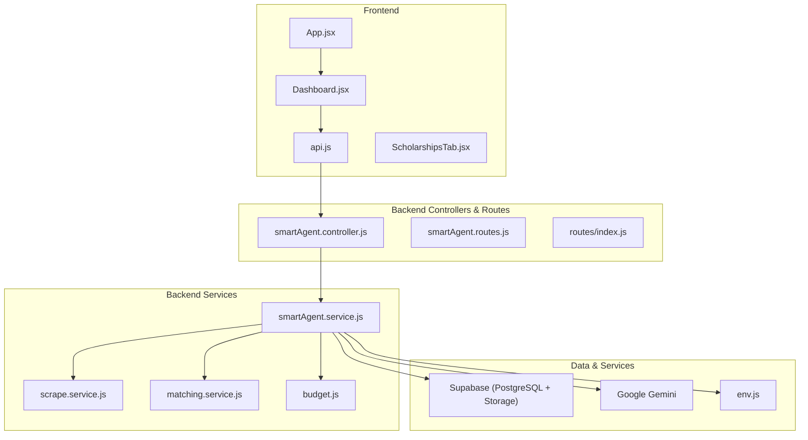
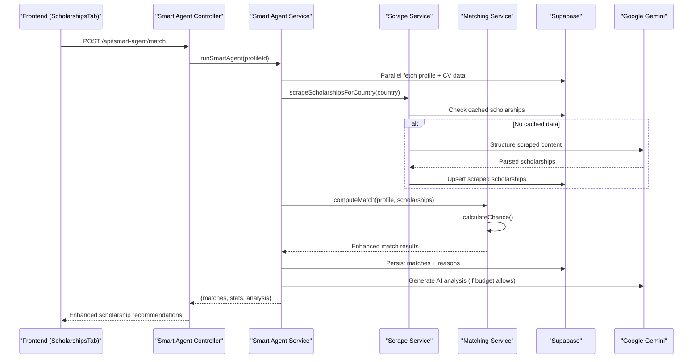
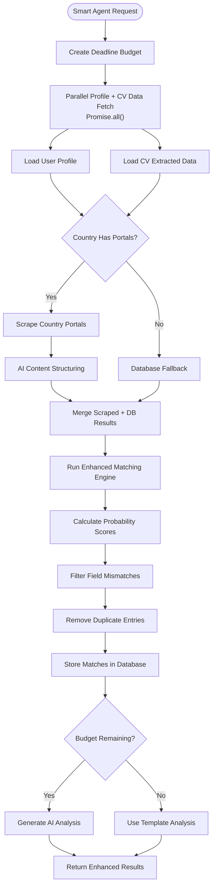
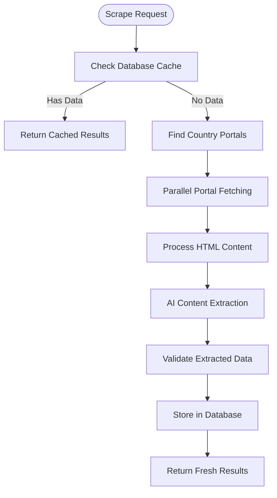
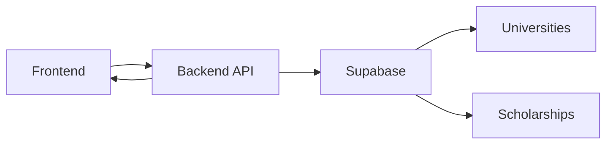
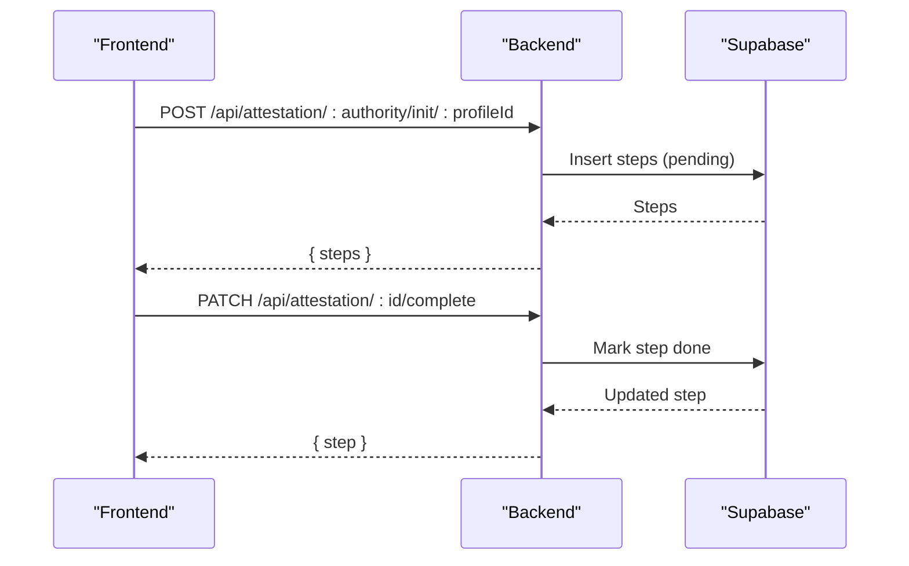
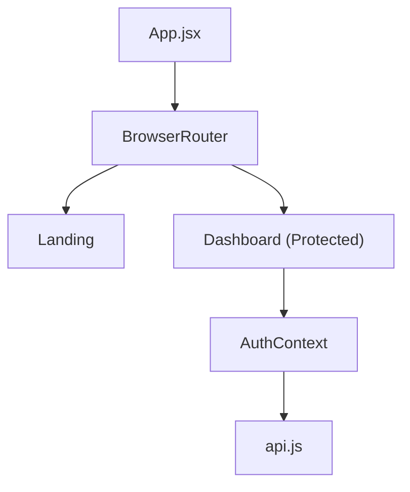
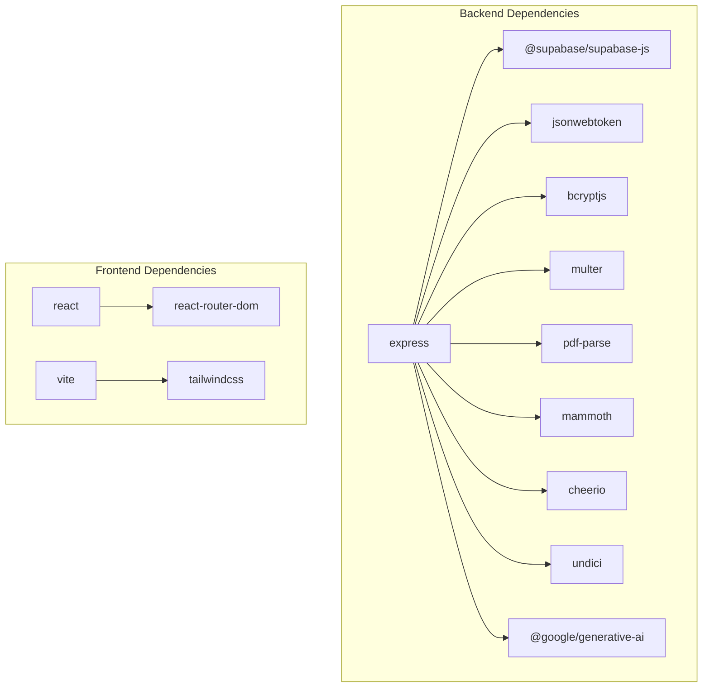

# Smart Agent System

<cite>
**Referenced Files in This Document**
- [README.md](file://README.md)
- [index.js](file://aischolarpath-backend-main/aischolarpath-backend-main/index.js)
- [api/index.js](file://aischolarpath-backend-main/aischolarpath-backend-main/api/index.js)
- [matching-engine.js](file://aischolarpath-backend-main/aischolarpath-backend-main/matching-engine.js)
- [validation.js](file://aischolarpath-backend-main/aischolarpath-backend-main/validation.js)
- [supabase-schema.sql](file://aischolarpath-backend-main/aischolarpath-backend-main/supabase-schema.sql)
- [package.json (backend)](file://aischolarpath-backend-main/aischolarpath-backend-main/package.json)
- [App.jsx](file://scholarpath-frontend (2)/scholarpath/src/App.jsx)
- [api.js (frontend)](file://scholarpath-frontend (2)/scholarpath/src/api.js)
- [Dashboard.jsx](file://scholarpath-frontend (2)/scholarpath/src/pages/Dashboard.jsx)
- [AuthContext.jsx](file://scholarpath-frontend (2)/scholarpath/src/components/AuthContext.jsx)
- [smartAgent.service.js](file://aischolarpath-backend-main/aischolarpath-backend-main/services/smartAgent.service.js)
- [scrape.service.js](file://aischolarpath-backend-main/aischolarpath-backend-main/services/scrape.service.js)
- [matching.service.js](file://aischolarpath-backend-main/aischolarpath-backend-main/services/matching.service.js)
- [budget.js](file://aischolarpath-backend-main/aischolarpath-backend-main/utils/budget.js)
- [env.js](file://aischolarpath-backend-main/aischolarpath-backend-main/config/env.js)
- [smartAgent.controller.js](file://aischolarpath-backend-main/aischolarpath-backend-main/controllers/smartAgent.controller.js)
- [smartAgent.routes.js](file://aischolarpath-backend-main/aischolarpath-backend-main/routes/smartAgent.routes.js)
</cite>

## Update Summary
**Changes Made**
- **New Smart Agent Service**: Implemented comprehensive `services/smartAgent.service.js` providing AI-powered scholarship analysis with live data scraping capabilities
- **Enhanced Matching Engine Integration**: Integrated with improved matching service (`matching.service.js`) featuring parallel processing optimization and dual-check CV detection
- **Live Scraping Capabilities**: Added real-time scholarship web scraping with fallback mechanisms and AI-powered content structuring
- **Budget Management**: Implemented deadline budget system for serverless timeout protection ensuring reliable API responses
- **Frontend Integration**: Enhanced ScholarshipsTab component with automatic smart agent execution and live data source indicators
- **Performance Optimization**: Parallel profile + CV data fetching using Promise.all() eliminating sequential dependencies

## Table of Contents
1. Introduction
2. Project Structure
3. Core Components
4. Architecture Overview
5. Detailed Component Analysis
6. Dependency Analysis
7. Performance Considerations
8. Troubleshooting Guide
9. Conclusion

## Introduction
ScholarPath AI is an AI-powered scholarship matching platform that helps students build a profile, upload and analyze their CV, and discover scholarships they are eligible for with clear reasons. The system includes:
- A React frontend for user interactions (profile building, CV upload, dashboard, universities, scholarships, attestation guides).
- An Express backend exposing REST APIs for authentication, profile management, CV analysis, matching engine, universities, scholarships, and document attestation workflows.
- A Supabase PostgreSQL database for persistent data and storage for CV files.
- Google Gemini integration for CV parsing and AI-assisted features.
- **Enhanced Smart Agent**: New intelligent scholarship matching system with live web scraping, AI-powered analysis, and real-time scholarship discovery.

The project deploys to Vercel as a single serverless function serving both the static frontend and API routes.

**Section sources**
- [README.md:1-32](file://README.md#L1-L32)

## Project Structure
The repository contains two main parts:
- Backend: Express application with modular services architecture including smart agent, scraping, and matching engines.
- Frontend: React + Vite app with routing, auth context, API client, and page components.

**Diagram sources**
- [App.jsx:1-23](file://scholarpath-frontend (2)/scholarpath/src/App.jsx#L1-L23)
- [Dashboard.jsx:1-30](file://scholarpath-frontend (2)/scholarpath/src/pages/Dashboard.jsx#L1-L30)
- [api.js (frontend):1-75](file://scholarpath-frontend (2)/scholarpath/src/api.js#L1-L75)
- [smartAgent.service.js:1-230](file://aischolarpath-backend-main/aischolarpath-backend-main/services/smartAgent.service.js#L1-L230)
- [scrape.service.js:1-267](file://aischolarpath-backend-main/aischolarpath-backend-main/services/scrape.service.js#L1-L267)
- [matching.service.js:1-420](file://aischolarpath-backend-main/aischolarpath-backend-main/services/matching.service.js#L1-L420)

**Section sources**
- [README.md:33-55](file://README.md#L33-L55)
- [package.json (backend):8-23](file://aischolarpath-backend-main/aischolarpath-backend-main/package.json#L8-L23)

## Core Components
- Authentication and Authorization: JWT-based login/signup with rate limiting and input sanitization; protected routes enforce token verification.
- Profile Management: Update and retrieve user profiles; store CV file paths; support additional fields via migration-safe updates.
- CV Upload and AI Analysis: Parse PDF/DOCX/TXT using libraries; extract academic details via Gemini; persist extracted data and update profile fields.
- **Enhanced Smart Agent System**: New comprehensive scholarship matching service with live web scraping, AI-powered analysis, parallel processing optimization, and deadline budget management for serverless environments.
- **Live Scraping Engine**: Real-time scholarship discovery from multiple country-specific portals with AI-powered content structuring and database caching.
- **Intelligent Matching Engine**: Weighted eligibility scoring across CGPA/FSc, field, degree level, IELTS, experience, and country with enhanced probability assessment and detailed reasoning.
- **Budget Management**: Serverless timeout protection ensuring reliable API responses within Vercel function limits through deadline budget tracking.
- Universities and Scholarships: Query and filter entities; include university portals and direct/country-wide scholarships.
- Attestation Workflow: Static guides per authority; track step progress per profile.
- Language Prep Guides: Static and personalized guidance based on matches and current scores.

**Section sources**
- [index.js:99-144](file://aischolarpath-backend-main/aischolarpath-backend-main/index.js#L99-L144)
- [index.js:155-223](file://aischolarpath-backend-main/aischolarpath-backend-main/index.js#L155-L223)
- [index.js:225-388](file://aischolarpath-backend-main/aischolarpath-backend-main/index.js#L225-L388)
- [smartAgent.service.js:26-229](file://aischolarpath-backend-main/aischolarpath-backend-main/services/smartAgent.service.js#L26-L229)
- [scrape.service.js:163-245](file://aischolarpath-backend-main/aischolarpath-backend-main/services/scrape.service.js#L163-L245)
- [matching.service.js:18-145](file://aischolarpath-backend-main/aischolarpath-backend-main/services/matching.service.js#L18-L145)
- [budget.js:12-32](file://aischolarpath-backend-main/aischolarpath-backend-main/utils/budget.js#L12-L32)

## Architecture Overview
The system follows a layered architecture with enhanced smart agent capabilities:
- Frontend (React/Vite) communicates with the backend via a centralized API client.
- Backend (Express) exposes REST endpoints, enforces authentication, validates inputs, and orchestrates business logic through dedicated services.
- **Smart Agent Service Layer**: Decoupled orchestration layer handling complex scholarship matching workflows with parallel processing and budget management.
- Data layer uses Supabase for relational data and storage.
- AI layer integrates Google Gemini for CV parsing, content structuring, and optional chat/scraping features.

**Diagram sources**
- [smartAgent.service.js:26-229](file://aischolarpath-backend-main/aischolarpath-backend-main/services/smartAgent.service.js#L26-L229)
- [scrape.service.js:163-245](file://aischolarpath-backend-main/aischolarpath-backend-main/services/scrape.service.js#L163-L245)
- [matching.service.js:18-145](file://aischolarpath-backend-main/aischolarpath-backend-main/services/matching.service.js#L18-L145)
- [smartAgent.controller.js:15-28](file://aischolarpath-backend-main/aischolarpath-backend-main/controllers/smartAgent.controller.js#L15-L28)

## Detailed Component Analysis

### Enhanced Smart Agent Service
**Updated** The smart agent system has been completely redesigned as a decoupled service with comprehensive scholarship matching capabilities, live web scraping, and AI-powered analysis.

- **Parallel Processing**: Uses `Promise.all()` to simultaneously fetch profile data and CV extracted data, significantly reducing latency compared to sequential operations.
- **Live Scraping Integration**: Implements real-time scholarship discovery from country-specific portals with fallback to cached database entries.
- **AI-Powered Analysis**: Generates personalized scholarship recommendations using Google Gemini with budget-aware timeout management.
- **Deadline Budget Management**: Ensures reliable API responses within Vercel function limits through sophisticated timeout tracking.
- **Enhanced Matching Engine**: Integrates with improved matching service featuring weighted scoring algorithms and detailed evidence generation.

**Diagram sources**
- [smartAgent.service.js:26-229](file://aischolarpath-backend-main/aischolarpath-backend-main/services/smartAgent.service.js#L26-L229)
- [budget.js:12-32](file://aischolarpath-backend-main/aischolarpath-backend-main/utils/budget.js#L12-L32)

**Section sources**
- [smartAgent.service.js:1-230](file://aischolarpath-backend-main/aischolarpath-backend-main/services/smartAgent.service.js#L1-L230)
- [budget.js:1-35](file://aischolarpath-backend-main/aischolarpath-backend-main/utils/budget.js#L1-L35)

### Live Scraping Engine
**New** Comprehensive web scraping service for real-time scholarship discovery with AI-powered content structuring and database caching.

- **Multi-Country Support**: Scrapes scholarship portals for 18+ countries including China, UK, US, Canada, Australia, Germany, Japan, and more.
- **Parallel Portal Fetching**: Uses `Promise.allSettled()` to fetch multiple portal pages concurrently with individual timeouts.
- **AI Content Structuring**: Employs Google Gemini to parse unstructured web content into structured scholarship records.
- **Database Caching**: Stores scraped results with upsert functionality to prevent duplicates and enable fast subsequent queries.
- **Graceful Degradation**: Falls back to cached database entries when scraping fails or times out.

**Diagram sources**
- [scrape.service.js:163-245](file://aischolarpath-backend-main/aischolarpath-backend-main/services/scrape.service.js#L163-L245)

**Section sources**
- [scrape.service.js:1-267](file://aischolarpath-backend-main/aischolarpath-backend-main/services/scrape.service.js#L1-L267)

### Enhanced Matching Engine
**Updated** The matching engine has been significantly enhanced with improved CV detection logic using a dual-check approach that examines both the extracted_profile_data table and CV file paths for comprehensive CV analysis.

- **Dual-Check CV Detection**: Now checks both `extracted_profile_data` table entries and `cv_file_path` presence to determine if a CV has been analyzed, providing more reliable CV status tracking.
- **Standardized Response Structure**: All matching results now include consistent fields including `university_name`, `chance`, `chance_label`, `chance_color`, and detailed `evidence` arrays for each criterion.
- **Refined Chance Calculation**: The `calculateChance` function provides sophisticated probability assessment considering match scores, status, evidence quality, and failure patterns to generate realistic chance percentages (0-95%).
- **Enhanced Evidence Generation**: Each match now includes detailed evidence arrays showing criterion-by-criterion evaluation with pass/fail/missing status, required vs actual values, and explanatory notes.

**Section sources**
- [matching.service.js:18-145](file://aischolarpath-backend-main/aischolarpath-backend-main/services/matching.service.js#L18-L145)
- [matching.service.js:150-182](file://aischolarpath-backend-main/aischolarpath-backend-main/services/matching.service.js#L150-L182)

### Frontend Integration
**Updated** The ScholarshipsTab component now automatically runs the smart agent when users have complete profiles, providing real-time scholarship recommendations with live data source indicators.

- **Automatic Execution**: Smart agent runs automatically when users navigate to the scholarships tab with complete profile information.
- **Live Data Source Indicators**: Shows whether results come from live scraping, cached database, or database fallback.
- **Enhanced UI**: Displays scholarship statistics, AI-generated analysis, and re-analysis capabilities.
- **Error Handling**: Provides user-friendly error messages and loading states during smart agent processing.

**Section sources**
- [ScholarshipsTab.jsx:264-388](file://scholarpath-frontend (2)/scholarpath/src/pages/ScholarshipsTab.jsx#L264-L388)
- [api.js (frontend):98-101](file://scholarpath-frontend (2)/scholarpath/src/api.js#L98-L101)

### Environment Configuration
**New** Centralized environment configuration supporting domain-specific AI keys and serverless timeout management.

- **Domain-Specific AI Keys**: Supports separate Gemini API keys for different use cases (chatbot, CV extraction, scholarship matching).
- **Serverless Budget Management**: Configurable timeout budgets for Vercel function limits with configurable scrape and AI request timeouts.
- **Graceful Degradation**: Warns about missing environment variables while allowing partial functionality.

**Section sources**
- [env.js:1-50](file://aischolarpath-backend-main/aischolarpath-backend-main/config/env.js#L1-L50)

### Universities and Scholarships
- List and filter universities by country, degree programs, and search terms; includes those with direct scholarships or country-wide scholarships.
- List and filter scholarships by country, type, department, and degree level; join with universities for portal URLs.

**Diagram sources**
- [index.js:389-488](file://aischolarpath-backend-main/aischolarpath-backend-main/index.js#L389-L488)
- [supabase-schema.sql:46-73](file://aischolarpath-backend-main/aischolarpath-backend-main/supabase-schema.sql#L46-L73)

**Section sources**
- [index.js:389-488](file://aischolarpath-backend-main/aischolarpath-backend-main/index.js#L389-L488)

### Attestation Workflow
- Provides static guides per authority (HEC, IBCC, MOFA).
- Initializes tracked steps per profile and allows marking steps complete.

**Diagram sources**
- [index.js:603-717](file://aischolarpath-backend-main/aischolarpath-backend-main/index.js#L603-L717)
- [supabase-schema.sql:88-97](file://aischolarpath-backend-main/aischolarpath-backend-main/supabase-schema.sql#L88-L97)

**Section sources**
- [index.js:603-717](file://aischolarpath-backend-main/aischolarpath-backend-main/index.js#L603-L717)

### Frontend Routing and Auth Context
- Routes protect dashboard access behind authentication; landing page accessible without login.
- AuthContext manages token and user state, persists to localStorage, and provides signup/login/logout methods.

**Diagram sources**
- [App.jsx:1-23](file://scholarpath-frontend (2)/scholarpath/src/App.jsx#L1-L23)
- [AuthContext.jsx:1-64](file://scholarpath-frontend (2)/scholarpath/src/components/AuthContext.jsx#L1-L64)
- [api.js (frontend):1-75](file://scholarpath-frontend (2)/scholarpath/src/api.js#L1-L75)

**Section sources**
- [App.jsx:1-23](file://scholarpath-frontend (2)/scholarpath/src/App.jsx#L1-L23)
- [AuthContext.jsx:1-64](file://scholarpath-frontend (2)/scholarpath/src/components/AuthContext.jsx#L1-L64)
- [Dashboard.jsx:1-30](file://scholarpath-frontend (2)/scholarpath/src/pages/Dashboard.jsx#L1-L30)

## Dependency Analysis
- Backend dependencies include Express, Supabase client, JWT, bcryptjs, multer, pdf-parse, mammoth, cheerio, undici, and Google Generative AI.
- Frontend dependencies include React, React Router, Vite, Tailwind CSS, and PostCSS.

**Diagram sources**
- [package.json (backend):8-23](file://aischolarpath-backend-main/aischolarpath-backend-main/package.json#L8-L23)
- [package.json (frontend):12-26](file://scholarpath-frontend (2)/scholarpath/package.json#L12-L26)

**Section sources**
- [package.json (backend):8-23](file://aischolarpath-backend-main/aischolarpath-backend-main/package.json#L8-L23)
- [package.json (frontend):12-26](file://scholarpath-frontend (2)/scholarpath/package.json#L12-L26)

## Performance Considerations
- Connection pooling and keep-alive settings via undici agent improve HTTP performance; may be skipped in serverless environments.
- Multer memory storage avoids disk I/O overhead during CV processing.
- Database queries use selective filtering and joins to reduce payload size.
- AI calls are wrapped with error handling and fallback responses to prevent blocking UI.
- **Enhanced Performance**: The smart agent uses cached scholarship data with 24-hour freshness validation and quick scraping fallbacks to minimize latency while ensuring data currency.
- **Parallel Processing Optimization**: The smart agent matching endpoint now uses `Promise.all()` to concurrently fetch profile data and CV extracted data, eliminating sequential database calls and significantly reducing API response time.
- **Serverless Timeout Protection**: Budget management system ensures reliable API responses within Vercel function limits through sophisticated timeout tracking and graceful degradation.
- **Live Scraping Efficiency**: Multi-country portal scraping with parallel fetching and individual timeouts prevents slow responses from affecting overall performance.

## Troubleshooting Guide
- Missing environment variables: Startup warns about missing SUPABASE_URL, SUPABASE_KEY, JWT_SECRET; some features will degrade gracefully.
- Database not configured: requireSupabase middleware returns 503 with guidance to set Supabase credentials.
- AI not configured: askAI returns fallback messages when GEMINI_API_KEY is missing or invalid.
- Column mismatch on profile updates: Endpoint retries with core fields and returns a warning to run migrations.
- Rate limiting: Excessive requests return 429; adjust window/max as needed.
- **Smart Agent Issues**: If CV detection fails, check both `extracted_profile_data` table existence and `cv_file_path` field availability; verify Supabase storage bucket configuration.
- **Performance Issues**: If smart agent responses are slow, check network connectivity to Supabase and ensure parallel processing is working correctly by monitoring database query performance.
- **Scraping Failures**: Verify country-specific portal URLs are still valid and accessible; check network connectivity and timeout configurations.
- **Budget Exceeded**: Monitor serverless budget usage and adjust timeout configurations if AI analysis is consistently timing out.

**Section sources**
- [index.js:5-11](file://aischolarpath-backend-main/aischolarpath-backend-main/index.js#L5-L11)
- [index.js:117-139](file://aischolarpath-backend-main/aischolarpath-backend-main/index.js#L117-L139)
- [index.js:23-57](file://aischolarpath-backend-main/aischolarpath-backend-main/index.js#L23-L57)
- [index.js:187-203](file://aischolarpath-backend-main/aischolarpath-backend-main/index.js#L187-L203)
- [validation.js:76-90](file://aischolarpath-backend-main/aischolarpath-backend-main/validation.js#L76-L90)

## Conclusion
ScholarPath AI combines a robust Express backend with a modern React frontend to deliver an intelligent scholarship matching experience. The system leverages Supabase for data persistence and storage, Google Gemini for CV parsing, and an enhanced weighted matching engine with improved CV detection, standardized responses, and refined chance calculations to provide actionable insights. With clear authentication, validation, and error handling, it offers a scalable foundation for further enhancements such as expanded AI capabilities and richer analytics. **The recent smart agent enhancement introduces comprehensive live web scraping, AI-powered analysis, and parallel processing optimization, significantly improving scholarship discovery capabilities and API response reliability.**

[No sources needed since this section summarizes without analyzing specific files]