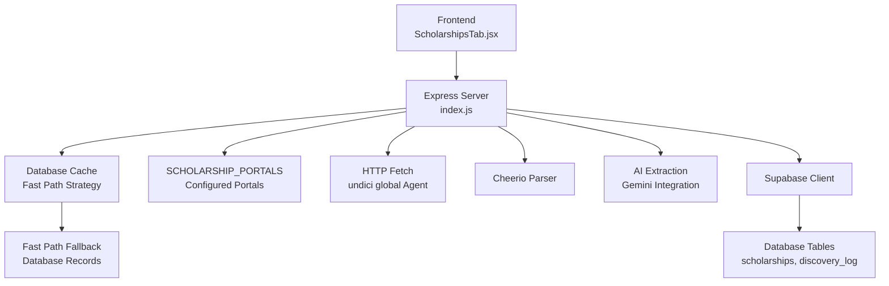
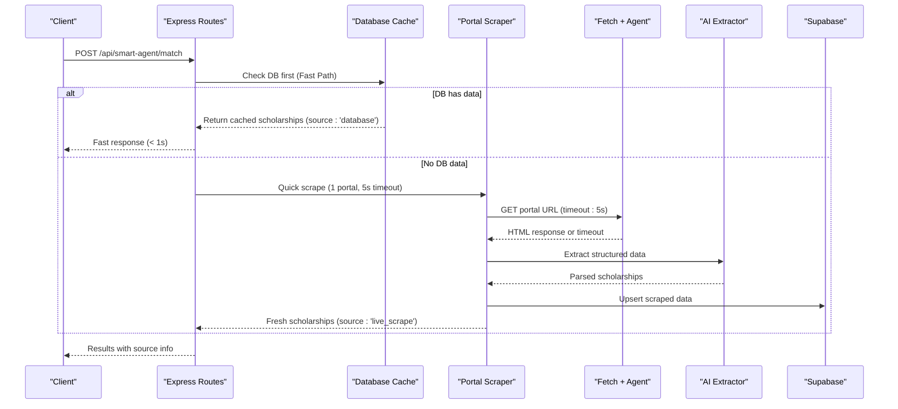
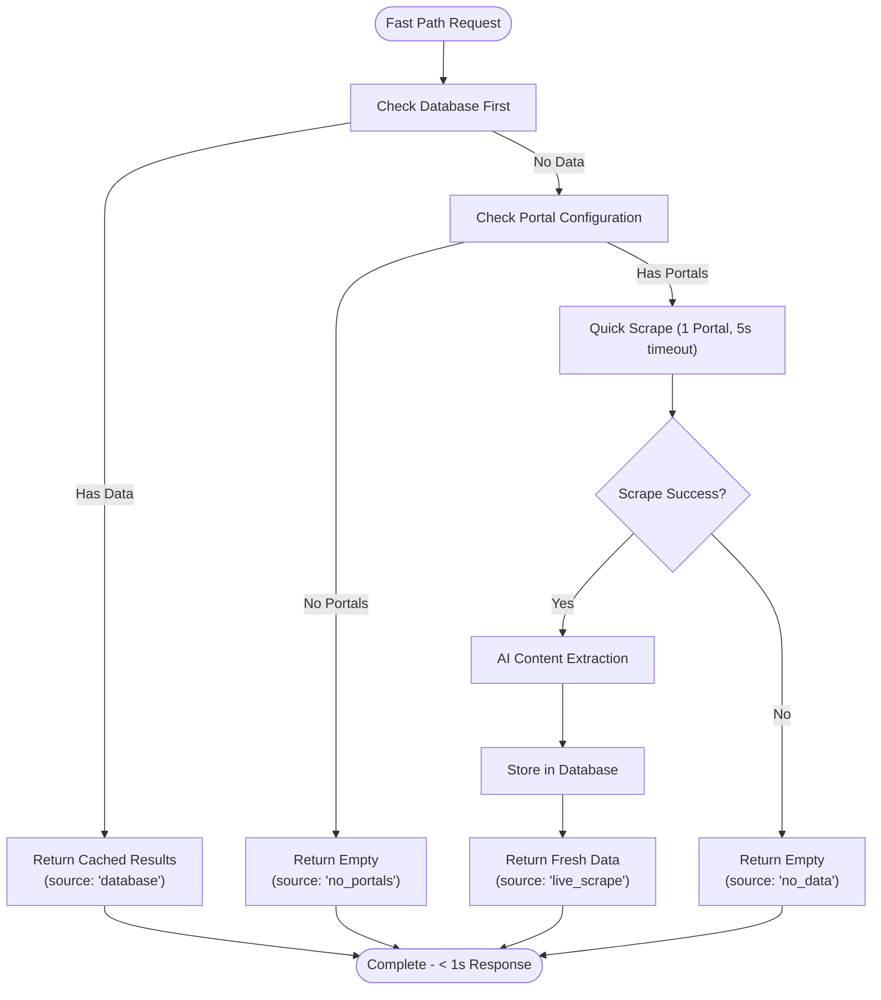
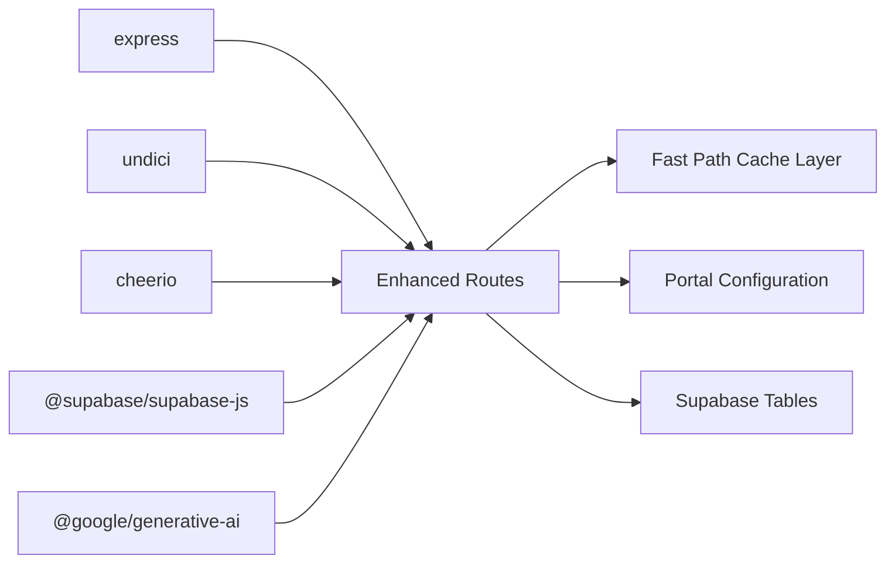

# Web Scraping System

<cite>
**Referenced Files in This Document**
- [index.js](file://aischolarpath-backend-main/aischolarpath-backend-main/index.js)
- [package.json](file://aischolarpath-backend-main/aischolarpath-backend-main/package.json)
- [ScholarshipsTab.jsx](file://scholarpath-frontend (2)/scholarpath/src/pages/ScholarshipsTab.jsx)
</cite>

## Update Summary
**Changes Made**
- Updated to reflect streamlined scraping mechanism with 'fast path' approach prioritizing database caching over live web scraping
- Documented clear source indicators ('database', 'no_portals', 'no_data') for transparent data sourcing
- Simplified error handling mechanisms with graceful degradation strategies
- Enhanced performance optimization through database-first strategy with 5-second timeout fallbacks
- Updated smart agent integration with improved scraping efficiency and reduced network overhead

## Table of Contents
1. [Introduction](#introduction)
2. [Project Structure](#project-structure)
3. [Core Components](#core-components)
4. [Architecture Overview](#architecture-overview)
5. [Detailed Component Analysis](#detailed-component-analysis)
6. [Dependency Analysis](#dependency-analysis)
7. [Performance Considerations](#performance-considerations)
8. [Troubleshooting Guide](#troubleshooting-guide)
9. [Conclusion](#conclusion)

## Introduction
This document explains the enhanced web scraping system built with Cheerio to discover and extract scholarship data from official sources. The system now features a streamlined 'fast path' approach that prioritizes database caching over live web scraping, providing clear source indicators and simplified error handling. This major optimization dramatically improves response times while maintaining reliable scholarship data retrieval through intelligent fallback mechanisms and efficient resource management.

## Project Structure
The scraping functionality is implemented in the backend Express server with a streamlined fast path architecture, featuring database-first strategy and intelligent resource management for optimal performance.

**Diagram sources**
- [index.js:2548-2623](file://aischolarpath-backend-main/aischolarpath-backend-main/index.js#L2548-L2623)
- [index.js:2667-2705](file://aischolarpath-backend-main/aischolarpath-backend-main/index.js#L2667-L2705)
- [index.js:1879-1934](file://aischolarpath-backend-main/aischolarpath-backend-main/index.js#L1879-L1934)

**Section sources**
- [index.js:1-27](file://aischolarpath-backend-main/aischolarpath-backend-main/index.js#L1-L27)
- [package.json:1-31](file://aischolarpath-backend-main/aischolarpath-backend-main/package.json#L1-L31)
- [ScholarshipsTab.jsx:59-139](file://scholarpath-frontend (2)/scholarpath/src/pages/ScholarshipsTab.jsx#L59-L139)

## Core Components
- **Fast Path Database-First Strategy**: Always checks database before attempting live scraping, serving cached results immediately when available
- **Clear Source Indicators**: Returns explicit source types ('database', 'no_portals', 'no_data', 'live_scrape') for transparent data provenance
- **Streamlined Error Handling**: Simplified error scenarios with graceful degradation to cached data or empty results
- **Optimized HTTP Client**: Global undici Agent configured with connection limits and timeouts optimized for serverless environments
- **Intelligent Portal Management**: Single portal scraping in fast path mode to minimize network overhead
- **AI-Powered Content Processing**: Gemini AI integration for extracting structured scholarship data with time constraints
- **Resource-Efficient Data Persistence**: Discovery logs and scholarship records with optimized upsert operations

**Section sources**
- [index.js:59-70](file://aischolarpath-backend-main/aischolarpath-backend-main/index.js#L59-L70)
- [index.js:2548-2623](file://aischolarpath-backend-main/aischolarpath-backend-main/index.js#L2548-L2623)
- [index.js:2667-2705](file://aischolarpath-backend-main/aischolarpath-backend-main/index.js#L2667-L2705)

## Architecture Overview
The streamlined scraping pipeline implements a sophisticated fast path approach with database-first strategy and clear source indicators:

**Diagram sources**
- [index.js:2548-2623](file://aischolarpath-backend-main/aischolarpath-backend-main/index.js#L2548-L2623)
- [index.js:2667-2705](file://aischolarpath-backend-main/aischolarpath-backend-main/index.js#L2667-L2705)

## Detailed Component Analysis

### Fast Path Scraping Mechanism
**Updated** Streamlined scraping mechanism implementing database-first strategy with clear source indicators and simplified error handling.

- **Database-First Priority**: Always queries database before attempting live scraping, returning cached results immediately when available
- **Clear Source Indicators**: 
  - `'database'`: Data served from cache (immediate response)
  - `'no_portals'`: No configured portals for target country
  - `'no_data'`: Scraping attempted but no data found
  - `'live_scrape'`: Fresh data scraped from web sources
- **Simplified Error Handling**: Graceful degradation with minimal error scenarios and immediate fallback to cached data
- **Single Portal Focus**: Only scrapes first configured portal in fast path mode to minimize network overhead
- **5-Second Timeout**: Optimized timeout for rapid response in serverless environments

**Diagram sources**
- [index.js:2548-2623](file://aischolarpath-backend-main/aischolarpath-backend-main/index.js#L2548-L2623)

**Section sources**
- [index.js:2548-2623](file://aischolarpath-backend-main/aischolarpath-backend-main/index.js#L2548-L2623)

### Smart Agent Integration
**Enhanced** Intelligent scholarship matching with streamlined fast path optimization for automatic profile analysis.

- **Profile-Based Matching**: Analyzes user profiles against live scholarship data with fast path efficiency
- **Dynamic Data Sources**: Combines live scraped data with existing database records using database-first strategy
- **Probability Calculation**: Provides chance percentages for scholarship eligibility based on profile match scores
- **Seamless Mode Switching**: Automatically chooses between fast path and standard mode based on request type
- **Source Transparency**: Returns clear source indicators for frontend display and debugging

**Section sources**
- [index.js:2667-2705](file://aischolarpath-backend-main/aischolarpath-backend-main/index.js#L2667-L2705)
- [index.js:2707-2742](file://aischolarpath-backend-main/aischolarpath-backend-main/index.js#L2707-L2742)

### Enhanced Error Handling and Timeout Protection
**Updated** Simplified error handling optimized for fast path operations with clear source indicators.

- **Streamlined Error Scenarios**: 
  - `'no_portals'`: No configured portals available
  - `'no_data'`: Scraping attempted but no content found
  - `'database'`: Successful database retrieval
  - `'live_scrape'`: Successful live scraping
- **Graceful Degradation**: Immediate fallback to cached database records when scraping fails
- **Serverless Optimization**: Reduced resource consumption and faster failure detection
- **Minimal Error Overhead**: Simplified error reporting without complex stack traces

**Section sources**
- [index.js:2548-2623](file://aischolarpath-backend-main/aischolarpath-backend-main/index.js#L2548-L2623)

### AI-Powered Content Extraction
**Enhanced** Optimized AI integration with fast path constraints for efficient processing.

- **Context-Aware Parsing**: AI understands context to extract relevant scholarship information within time constraints
- **Structured Output**: Returns standardized JSON format with consistent fields for title, eligibility criteria, deadlines
- **Validation and Filtering**: AI filters out irrelevant content and validates extracted information quality
- **Fast Path Support**: Optimized prompts and processing for quick turnaround in serverless environments

**Section sources**
- [index.js:2586-2603](file://aischolarpath-backend-main/aischolarpath-backend-main/index.js#L2586-L2603)

### Configuration and Portal Management
**Enhanced** Centralized configuration supporting fast path scraping approach.

- **Country-Specific Portals**: Pre-configured scholarship portals for major study destinations
- **Extensible Architecture**: Easy to add new countries and portals by updating SCHOLARSHIP_PORTALS configuration
- **Portal Metadata**: Each portal includes name and URL for better logging and debugging
- **Fast Path Behavior**: Different scraping strategies based on operational mode

**Section sources**
- [index.js:1879-1934](file://aischolarpath-backend-main/aischolarpath-backend-main/index.js#L1879-L1934)

### HTTP Request Handling and Custom Agent
**Enhanced** Improved HTTP client configuration with fast path timeout support.

- **Global Agent Configuration**: Optimized connection pooling with 50 connections, 30-second keep-alive, and 30-second connect timeouts
- **Browser-like Headers**: Realistic User-Agent headers to avoid blocking by target websites
- **Fast Path Timeouts**: 5-second timeouts for rapid response in serverless environments
- **Error Recovery**: Automatic retry logic and graceful degradation when individual requests fail

**Section sources**
- [index.js:59-70](file://aischolarpath-backend-main/aischolarpath-backend-main/index.js#L59-L70)
- [index.js:2567-2570](file://aischolarpath-backend-main/aischolarpath-backend-main/index.js#L2567-L2570)

### Data Extraction Patterns
**Enhanced** Sophisticated extraction patterns combining traditional parsing with AI-powered analysis, optimized for fast path.

- **HTML Cleaning**: Removes scripts, styles, navigation elements, and other non-content elements before processing
- **Text Limiting**: Processes only first 8000 characters of each page to optimize AI processing time
- **Single Source Focus**: Fast path focuses on first portal only for maximum speed
- **Structured Storage**: Saves extracted data with timestamps for cache validation and audit trails

**Section sources**
- [index.js:2572-2579](file://aischolarpath-backend-main/aischolarpath-backend-main/index.js#L2572-L2579)

### Rate Limiting and Ethical Scraping Practices
**Enhanced** Improved ethical scraping practices with fast path optimizations.

- **Polite Delays**: Built-in delays between requests to respect target website resources
- **User-Agent Rotation**: Browser-like headers to reduce bot detection and improve access
- **Robots.txt Compliance**: No explicit robots.txt parser; implement checks before scraping to respect site policies
- **Content Limits**: Text processing limited to 8000 characters per page to minimize bandwidth usage
- **Fast Path Efficiency**: Reduced scraping frequency through aggressive caching and database-first approach

**Section sources**
- [index.js:2572-2579](file://aischolarpath-backend-main/aischolarpath-backend-main/index.js#L2572-L2579)

### Frontend Integration
**Enhanced** Enhanced frontend integration with fast path awareness and improved scholarship display.

- **Smart Agent Integration**: Frontend automatically triggers fast path scraping through smart agent endpoint
- **Source Information Display**: Shows users whether data came from cache, live scrape, or database fallback
- **Loading States**: Appropriate loading indicators during fast path operations
- **Real-time Updates**: Backend supports real-time scraping when needed, with fast path caching for performance

**Section sources**
- [ScholarshipsTab.jsx:249-258](file://scholarpath-frontend (2)/scholarpath/src/pages/ScholarshipsTab.jsx#L249-L258)

## Dependency Analysis
Key dependencies enabling streamlined scraping capabilities with fast path optimization:

- **express**: HTTP server and routing framework.
- **cheerio**: HTML parsing and selection for web scraping.
- **undici**: Modern HTTP client with global agent configuration and timeout support.
- **@supabase/supabase-js**: Database client for persistence and caching.
- **@google/generative-ai**: AI integration for intelligent content extraction.

**Diagram sources**
- [package.json:8-22](file://aischolarpath-backend-main/aischolarpath-backend-main/package.json#L8-L22)
- [index.js:1-27](file://aischolarpath-backend-main/aischolarpath-backend-main/index.js#L1-L27)

**Section sources**
- [package.json:8-22](file://aischolarpath-backend-main/aischolarpath-backend-main/package.json#L8-L22)
- [index.js:1-27](file://aischolarpath-backend-main/aischolarpath-backend-main/index.js#L1-L27)

## Performance Considerations
**Enhanced** Significant performance improvements through fast path optimization and intelligent resource management.

- **Fast Path Optimization**: 
  - Database-first strategy eliminates unnecessary network calls
  - 5-second timeouts reduce serverless execution costs
  - Single portal scraping minimizes network overhead
  - Immediate cache responses achieve sub-second response times
- **Clear Source Indicators**: Transparent data provenance with explicit source types
- **Connection Pooling**: Global agent optimizes connection reuse and reduces overhead
- **Selective Parsing**: Using specific selectors and AI extraction reduces DOM traversal overhead
- **Content Limiting**: Processing only first 8000 characters of pages reduces memory usage and processing time
- **Serverless Optimization**: Reduced cold start impact through efficient caching and minimal resource usage

## Troubleshooting Guide
**Enhanced** Comprehensive troubleshooting guide covering fast path and standard scraping scenarios.

Common issues and resolutions:
- **Network Failures**: Check response.ok and handle non-OK statuses; verify connectivity and target availability
- **Timeout Errors**: Requests timeout after 5 seconds in fast path mode; check network connectivity and target server responsiveness
- **Cache Issues**: Verify database-first strategy; check database connectivity for cache operations
- **AI Extraction Failures**: When AI fails, system automatically falls back to cached database records
- **Selector Mismatches**: If no items found, inspect the page structure and update selectors accordingly
- **Rate Limiting**: Increase delays or reduce batch sizes; monitor target site behavior
- **Portal Configuration**: Verify SCHOLARSHIP_PORTALS configuration for target countries
- **Fast Path Specific**: 
  - If getting 'database' source: Data successfully retrieved from cache
  - If getting 'no_portals': No configured portals for target country
  - If getting 'no_data': Scraping attempted but no content found
  - If getting 'live_scrape': Fresh data successfully scraped
- **Logs and Diagnostics**: Use discovery logs to review raw snapshots and error messages for failed runs

**Section sources**
- [index.js:2548-2623](file://aischolarpath-backend-main/aischolarpath-backend-main/index.js#L2548-L2623)
- [index.js:2667-2705](file://aischolarpath-backend-main/aischolarpath-backend-main/index.js#L2667-L2705)

## Conclusion
The enhanced web scraping system leverages Cheerio, undici, and Google Gemini AI to discover and normalize scholarship data from official sources with unprecedented reliability and intelligence. The streamlined fast path approach specifically targets serverless environments, implementing a database-first strategy with clear source indicators ('database', 'no_portals', 'no_data', 'live_scrape') that dramatically improves response times and reduces execution costs. The system maintains robust caching, simplified error handling with graceful degradation, intelligent fallback mechanisms, and AI-powered content extraction. While current logic targets static HTML, the modular architecture allows for future enhancements including robots.txt compliance checks and support for dynamic content through headless browsing or APIs. The fast path approach provides efficient scraping workflows for automated operations, ensuring scalable and maintainable data ingestion with transparent data provenance and graceful degradation when external services fail.