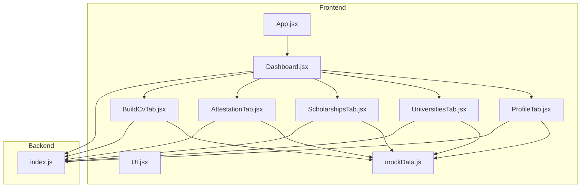
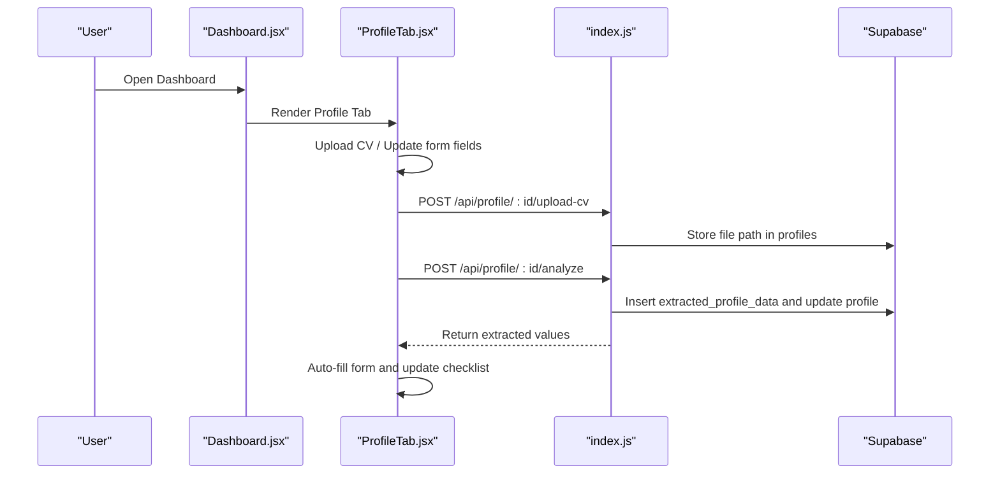
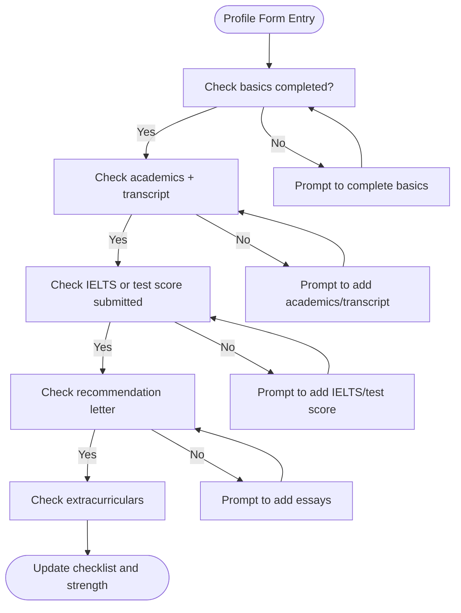
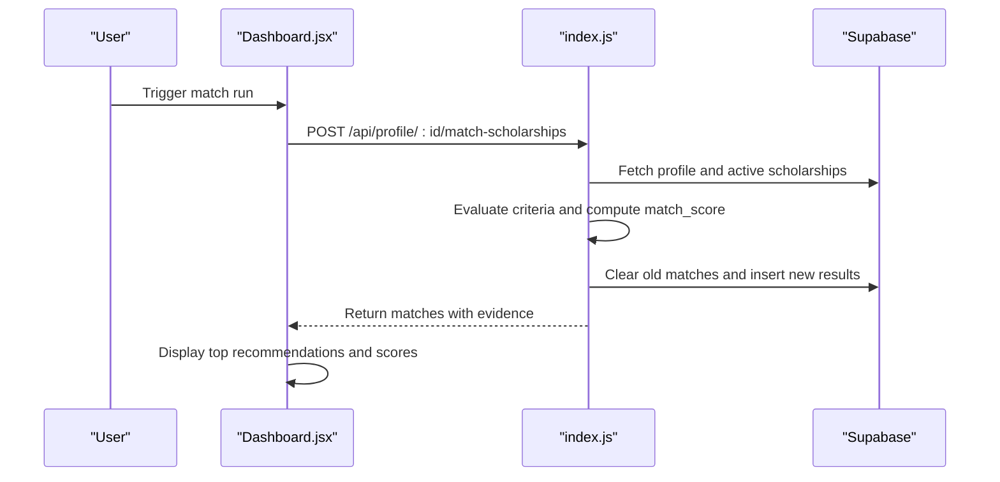
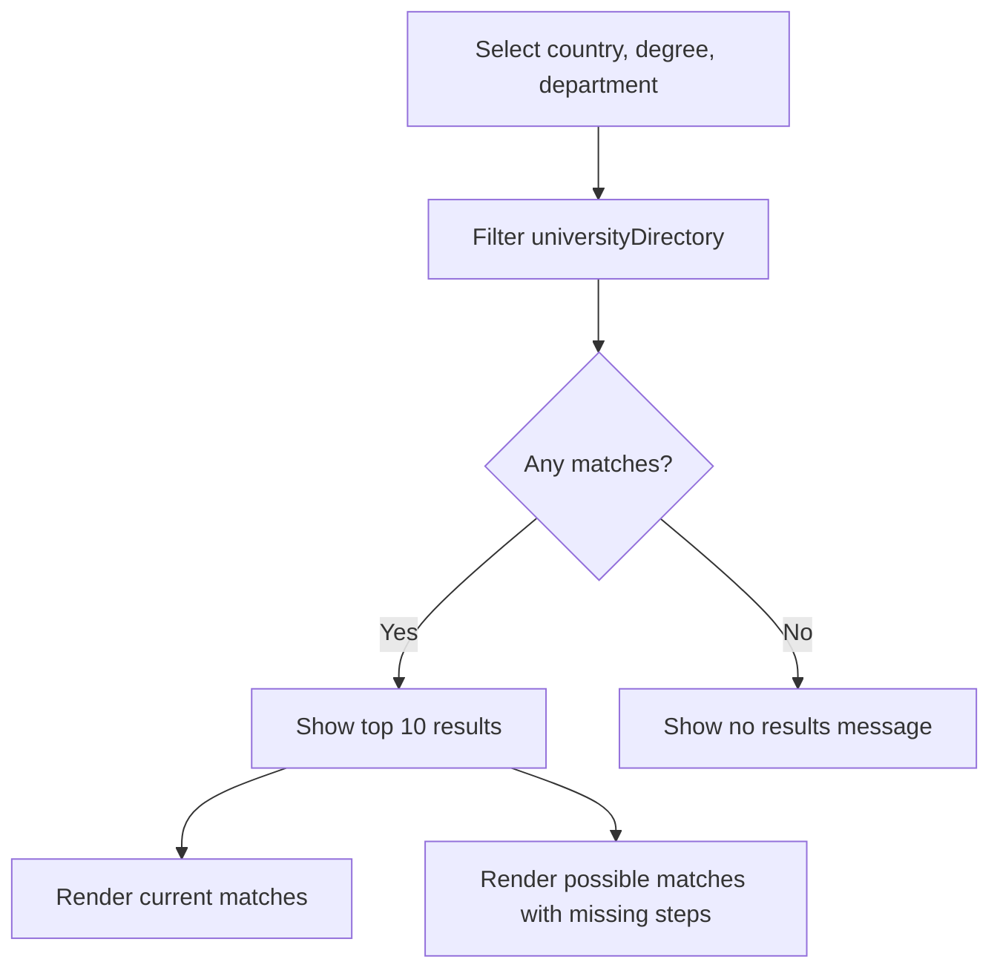
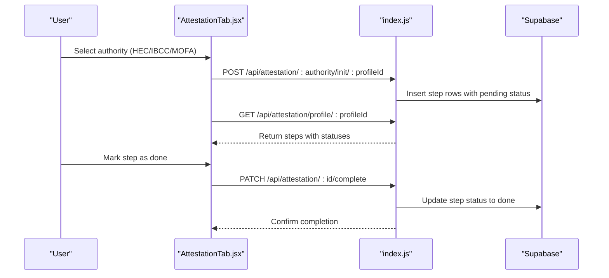
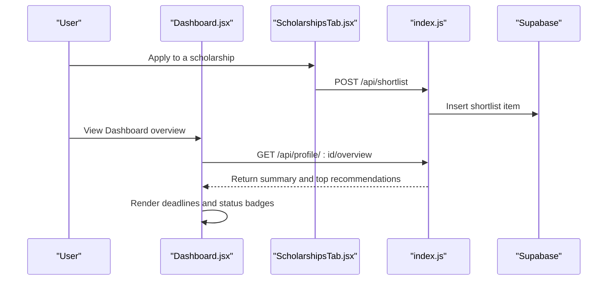
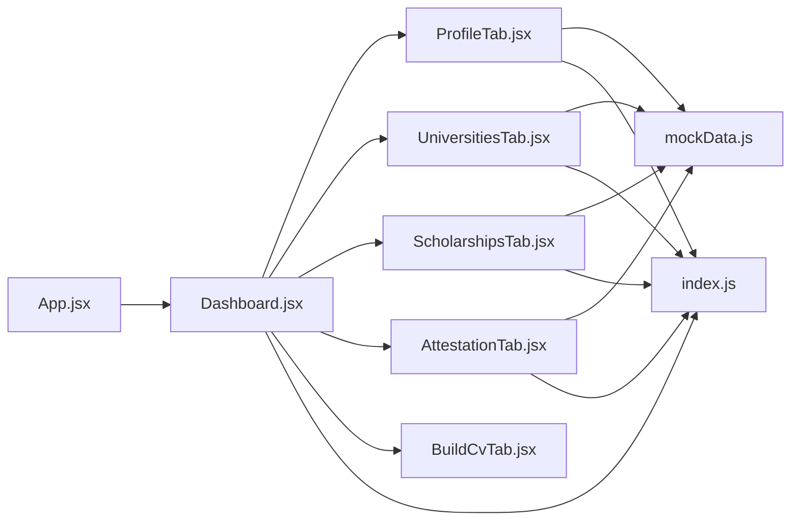

# Core Features

<cite>
**Referenced Files in This Document**
- [App.jsx](file://scholarpath-frontend (2)/scholarpath/src/App.jsx)
- [Dashboard.jsx](file://scholarpath-frontend (2)/scholarpath/src/pages/Dashboard.jsx)
- [ProfileTab.jsx](file://scholarpath-frontend (2)/scholarpath/src/pages/ProfileTab.jsx)
- [ScholarshipsTab.jsx](file://scholarpath-frontend (2)/scholarpath/src/pages/ScholarshipsTab.jsx)
- [UniversitiesTab.jsx](file://scholarpath-frontend (2)/scholarpath/src/pages/UniversitiesTab.jsx)
- [AttestationTab.jsx](file://scholarpath-frontend (2)/scholarpath/src/pages/AttestationTab.jsx)
- [BuildCvTab.jsx](file://scholarpath-frontend (2)/scholarpath/src/pages/BuildCvTab.jsx)
- [UI.jsx](file://scholarpath-frontend (2)/scholarpath/src/components/UI.jsx)
- [mockData.js](file://scholarpath-frontend (2)/scholarpath/src/data/mockData.js)
- [index.js](file://aischolarpath-backend-main/aischolarpath-backend-main/index.js)
</cite>

## Table of Contents
1. Introduction
2. Project Structure
3. Core Components
4. Architecture Overview
5. Detailed Component Analysis
6. Dependency Analysis
7. Performance Considerations
8. Troubleshooting Guide
9. Conclusion

## Introduction
This document explains ScholarPathAI’s core features as implemented in the repository: student profile management, intelligent scholarship matching, university discovery and search, document attestation workflow, and application tracking via shortlists and deadlines. It maps user-facing flows to frontend components and backend endpoints, highlighting data sources, filtering logic, and state updates.

## Project Structure
The application is a React frontend with a Node/Express backend. The frontend routes to a Landing page and a Dashboard that hosts tabs for Profile, Universities, Scholarships, Attestation, Build CV, and FAQ. A shared mock data layer drives UI behavior until wired to the backend. The backend exposes REST APIs for authentication, profile management, CV upload/analysis, scholarships/universities queries, language prep guidance, attestation workflows, matching, overview summaries, and shortlist management.

**Diagram sources**
- [App.jsx:1-15](file://scholarpath-frontend (2)/scholarpath/src/App.jsx#L1-L15)
- [Dashboard.jsx:1-187](file://scholarpath-frontend (2)/scholarpath/src/pages/Dashboard.jsx#L1-L187)
- [ProfileTab.jsx:1-232](file://scholarpath-frontend (2)/scholarpath/src/pages/ProfileTab.jsx#L1-L232)
- [UniversitiesTab.jsx:1-163](file://scholarpath-frontend (2)/scholarpath/src/pages/UniversitiesTab.jsx#L1-L163)
- [ScholarshipsTab.jsx:1-139](file://scholarpath-frontend (2)/scholarpath/src/pages/ScholarshipsTab.jsx#L1-L139)
- [AttestationTab.jsx:1-73](file://scholarpath-frontend (2)/scholarpath/src/pages/AttestationTab.jsx#L1-L73)
- [BuildCvTab.jsx:1-284](file://scholarpath-frontend (2)/scholarpath/src/pages/BuildCvTab.jsx#L1-L284)
- [UI.jsx:1-47](file://scholarpath-frontend (2)/scholarpath/src/components/UI.jsx#L1-L47)
- [mockData.js:1-349](file://scholarpath-frontend (2)/scholarpath/src/data/mockData.js#L1-L349)
- [index.js:1-800](file://aischolarpath-backend-main/aischolarpath-backend-main/index.js#L1-L800)

**Section sources**
- [App.jsx:1-15](file://scholarpath-frontend (2)/scholarpath/src/App.jsx#L1-L15)
- [Dashboard.jsx:1-187](file://scholarpath-frontend (2)/scholarpath/src/pages/Dashboard.jsx#L1-L187)
- [mockData.js:1-349](file://scholarpath-frontend (2)/scholarpath/src/data/mockData.js#L1-L349)
- [index.js:1-800](file://aischolarpath-backend-main/aischolarpath-backend-main/index.js#L1-L800)

## Core Components
- Student Profile Management: Personal and academic fields, document uploads, CV analysis simulation, and dynamic checklist completion.
- Intelligent Scholarship Matching: Eligibility evaluation against criteria, match scoring, evidence-based recommendations, and stored matches retrieval.
- University Discovery and Search: Filterable directory by country, degree programs, and departments; current and possible matches with improvement steps.
- Document Attestation Workflow: Step-by-step guides for HEC, IBCC, MOFA with progress tracking and official portal links.
- Application Tracking: Overview dashboard with upcoming deadlines, top matches, and shortlist management for scholarships and universities.

**Section sources**
- [ProfileTab.jsx:1-232](file://scholarpath-frontend (2)/scholarpath/src/pages/ProfileTab.jsx#L1-L232)
- [ScholarshipsTab.jsx:1-139](file://scholarpath-frontend (2)/scholarpath/src/pages/ScholarshipsTab.jsx#L1-L139)
- [UniversitiesTab.jsx:1-163](file://scholarpath-frontend (2)/scholarpath/src/pages/UniversitiesTab.jsx#L1-L163)
- [AttestationTab.jsx:1-73](file://scholarpath-frontend (2)/scholarpath/src/pages/AttestationTab.jsx#L1-L73)
- [Dashboard.jsx:1-187](file://scholarpath-frontend (2)/scholarpath/src/pages/Dashboard.jsx#L1-L187)
- [index.js:574-749](file://aischolarpath-backend-main/aischolarpath-backend-main/index.js#L574-L749)

## Architecture Overview
The frontend uses React Router to navigate between Landing and Dashboard. Dashboard renders tabbed content using shared UI components and reads from a centralized mock data module. The backend provides authenticated REST endpoints for profile CRUD, CV upload and analysis, scholarships/universities listing and filtering, language preparation guidance, attestation step tracking, matching computation, overview aggregation, and shortlist operations.

**Diagram sources**
- [Dashboard.jsx:1-187](file://scholarpath-frontend (2)/scholarpath/src/pages/Dashboard.jsx#L1-L187)
- [ProfileTab.jsx:1-232](file://scholarpath-frontend (2)/scholarpath/src/pages/ProfileTab.jsx#L1-L232)
- [index.js:112-188](file://aischolarpath-backend-main/aischolarpath-backend-main/index.js#L112-L188)

## Detailed Component Analysis

### Student Profile Management
- Profile creation and editing: Personal information and education fields are managed in a single form with validation-driven checklist updates.
- Academic information input: CGPA, IELTS, degree, department, and extracurriculars are captured and influence eligibility and matching.
- Document upload capabilities: Required documents are tracked with status (submitted/pending/missing). CV upload triggers an “Analyze” action that simulates extraction and auto-fills the form.
- Profile strength assessment: An opportunity bar shows current strength percentage and suggests missing items to boost eligibility.

**Diagram sources**
- [ProfileTab.jsx:27-45](file://scholarpath-frontend (2)/scholarpath/src/pages/ProfileTab.jsx#L27-L45)
- [Dashboard.jsx:51-70](file://scholarpath-frontend (2)/scholarpath/src/pages/Dashboard.jsx#L51-L70)

**Section sources**
- [ProfileTab.jsx:1-232](file://scholarpath-frontend (2)/scholarpath/src/pages/ProfileTab.jsx#L1-L232)
- [Dashboard.jsx:1-187](file://scholarpath-frontend (2)/scholarpath/src/pages/Dashboard.jsx#L1-L187)
- [mockData.js:25-41](file://scholarpath-frontend (2)/scholarpath/src/data/mockData.js#L25-L41)

### Intelligent Scholarship Matching Algorithm
- Eligibility evaluation: Compares student profile fields (CGPA, IELTS, target degree) against scholarship criteria.
- Match scoring: Computes a percentage based on passed criteria versus total evaluated criteria.
- Evidence-based recommendations: Returns per-criterion pass/fail/missing details to explain outcomes.
- Storage and retrieval: Stores matches per profile and retrieves them sorted by score; also provides an overview summary with counts and top recommendations.

**Diagram sources**
- [Dashboard.jsx:72-126](file://scholarpath-frontend (2)/scholarpath/src/pages/Dashboard.jsx#L72-L126)
- [index.js:574-673](file://aischolarpath-backend-main/aischolarpath-backend-main/index.js#L574-L673)

**Section sources**
- [index.js:574-673](file://aischolarpath-backend-main/aischolarpath-backend-main/index.js#L574-L673)
- [index.js:675-749](file://aischolarpath-backend-main/aischolarpath-backend-main/index.js#L675-L749)

### University Discovery and Search
- Filtering: Supports filters by country, degree programs, and departments across a browsable directory.
- Current matches: Displays universities the student currently qualifies for with fit percentages.
- Possible matches: Shows universities within reach and lists specific improvements needed to unlock higher fit.

**Diagram sources**
- [UniversitiesTab.jsx:73-163](file://scholarpath-frontend (2)/scholarpath/src/pages/UniversitiesTab.jsx#L73-L163)
- [mockData.js:119-133](file://scholarpath-frontend (2)/scholarpath/src/data/mockData.js#L119-L133)

**Section sources**
- [UniversitiesTab.jsx:1-163](file://scholarpath-frontend (2)/scholarpath/src/pages/UniversitiesTab.jsx#L1-L163)
- [mockData.js:43-117](file://scholarpath-frontend (2)/scholarpath/src/data/mockData.js#L43-L117)

### Document Attestation Workflow
- Authority selection: Choose among HEC, IBCC, and MOFA with full names and document scope.
- Step-by-step instructions: Each authority provides ordered steps and official portal links.
- Progress tracking: Backend initializes tracked steps per authority and allows marking steps as done; users can retrieve their progress.

**Diagram sources**
- [AttestationTab.jsx:1-73](file://scholarpath-frontend (2)/scholarpath/src/pages/AttestationTab.jsx#L1-L73)
- [index.js:403-517](file://aischolarpath-backend-main/aischolarpath-backend-main/index.js#L403-L517)

**Section sources**
- [AttestationTab.jsx:1-73](file://scholarpath-frontend (2)/scholarpath/src/pages/AttestationTab.jsx#L1-L73)
- [mockData.js:256-309](file://scholarpath-frontend (2)/scholarpath/src/data/mockData.js#L256-L309)
- [index.js:403-517](file://aischolarpath-backend-main/aischolarpath-backend-main/index.js#L403-L517)

### Application Tracking System
- Deadlines and status updates: Dashboard displays upcoming deadlines and top matches; scholarships include deadline strings used for sorting.
- Shortlist management: Users can add/remove scholarships or universities to a personal shortlist and view consolidated items.

**Diagram sources**
- [Dashboard.jsx:72-126](file://scholarpath-frontend (2)/scholarpath/src/pages/Dashboard.jsx#L72-L126)
- [ScholarshipsTab.jsx:1-139](file://scholarpath-frontend (2)/scholarpath/src/pages/ScholarshipsTab.jsx#L1-L139)
- [index.js:750-800](file://aischolarpath-backend-main/aischolarpath-backend-main/index.js#L750-L800)

**Section sources**
- [Dashboard.jsx:72-126](file://scholarpath-frontend (2)/scholarpath/src/pages/Dashboard.jsx#L72-L126)
- [ScholarshipsTab.jsx:1-139](file://scholarpath-frontend (2)/scholarpath/src/pages/ScholarshipsTab.jsx#L1-L139)
- [index.js:750-800](file://aischolarpath-backend-main/aischolarpath-backend-main/index.js#L750-L800)

## Dependency Analysis
- Frontend dependencies:
  - App.jsx defines routes to Landing and Dashboard.
  - Dashboard orchestrates tabs and shares state for documents and profile form.
  - ProfileTab depends on mockData for checklist and required documents; manages local state for uploads and analysis.
  - UniversitiesTab and ScholarshipsTab depend on mockData for directories and filtered results.
  - AttestationTab depends on mockData for authority options and steps.
  - BuildCvTab provides CV builder and recommendation letter generator utilities.
  - UI.jsx provides reusable Card, Button, Badge components.
- Backend dependencies:
  - index.js implements Express server with CORS, JWT auth, Supabase client, and Multer for file uploads.
  - Endpoints cover profile CRUD, CV upload/analysis, scholarships/universities queries, language prep guidance, attestation steps, matching, overview, and shortlist.

**Diagram sources**
- [App.jsx:1-15](file://scholarpath-frontend (2)/scholarpath/src/App.jsx#L1-L15)
- [Dashboard.jsx:1-187](file://scholarpath-frontend (2)/scholarpath/src/pages/Dashboard.jsx#L1-L187)
- [ProfileTab.jsx:1-232](file://scholarpath-frontend (2)/scholarpath/src/pages/ProfileTab.jsx#L1-L232)
- [UniversitiesTab.jsx:1-163](file://scholarpath-frontend (2)/scholarpath/src/pages/UniversitiesTab.jsx#L1-L163)
- [ScholarshipsTab.jsx:1-139](file://scholarpath-frontend (2)/scholarpath/src/pages/ScholarshipsTab.jsx#L1-L139)
- [AttestationTab.jsx:1-73](file://scholarpath-frontend (2)/scholarpath/src/pages/AttestationTab.jsx#L1-L73)
- [BuildCvTab.jsx:1-284](file://scholarpath-frontend (2)/scholarpath/src/pages/BuildCvTab.jsx#L1-L284)
- [mockData.js:1-349](file://scholarpath-frontend (2)/scholarpath/src/data/mockData.js#L1-L349)
- [index.js:1-800](file://aischolarpath-backend-main/aischolarpath-backend-main/index.js#L1-L800)

**Section sources**
- [App.jsx:1-15](file://scholarpath-frontend (2)/scholarpath/src/App.jsx#L1-L15)
- [Dashboard.jsx:1-187](file://scholarpath-frontend (2)/scholarpath/src/pages/Dashboard.jsx#L1-L187)
- [mockData.js:1-349](file://scholarpath-frontend (2)/scholarpath/src/data/mockData.js#L1-L349)
- [index.js:1-800](file://aischolarpath-backend-main/aischolarpath-backend-main/index.js#L1-L800)

## Performance Considerations
- Client-side filtering: University and scholarship tabs use in-memory filtering over static datasets; this is efficient for small to medium lists but may need pagination or server-side filtering at scale.
- State co-location: Dashboard lifts shared state (documents, profile form) to reduce re-renders and keep UI consistent across tabs.
- Backend query optimization: Matching endpoint computes eligibility per scholarship and stores results; consider indexing frequently queried fields (country, degree, status) and caching repeated overview queries.
- File handling: CV upload uses memory storage; ensure size limits and error handling to avoid large payloads impacting performance.

[No sources needed since this section provides general guidance]

## Troubleshooting Guide
- Authentication failures: Ensure JWT token is present and valid; backend returns 401/403 for missing or invalid tokens.
- Profile not found: Verify profile ID matches the authenticated user; endpoints enforce ownership checks.
- Database errors: Supabase errors propagate as 500 responses; check environment variables (SUPABASE_URL, SUPABASE_KEY, JWT_SECRET) and network connectivity.
- Missing required fields: Signup/login require email/password; profile updates validate presence before persisting changes.
- Attestation steps not initializing: Confirm authority parameter is one of HEC, IBCC, MOFA; otherwise a 404 is returned.

**Section sources**
- [index.js:32-47](file://aischolarpath-backend-main/aischolarpath-backend-main/index.js#L32-L47)
- [index.js:518-573](file://aischolarpath-backend-main/aischolarpath-backend-main/index.js#L518-L573)
- [index.js:427-435](file://aischolarpath-backend-main/aischolarpath-backend-main/index.js#L427-L435)

## Conclusion
ScholarPathAI integrates a cohesive set of features to streamline study-abroad planning: robust profile management with document uploads and AI-assisted extraction, intelligent scholarship matching with transparent evidence, searchable university directories with actionable improvement steps, guided attestation workflows for Pakistani authorities, and application tracking through deadlines and shortlists. The modular frontend and well-defined backend endpoints provide a clear path to replace mock data with live services while preserving user experience.

[No sources needed since this section summarizes without analyzing specific files]