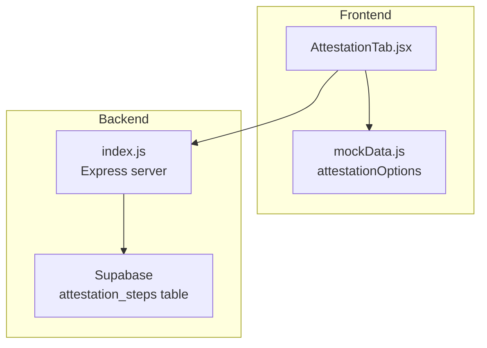
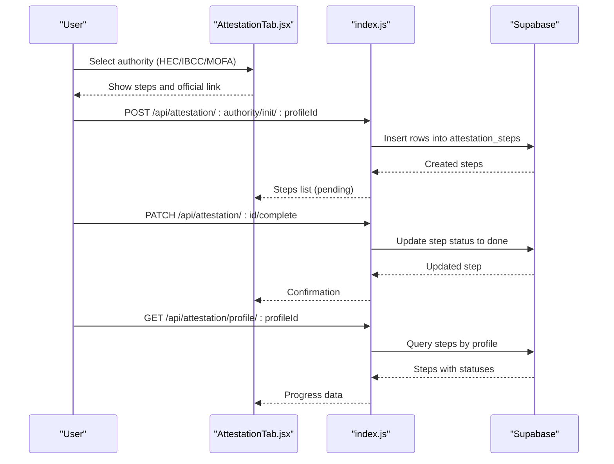
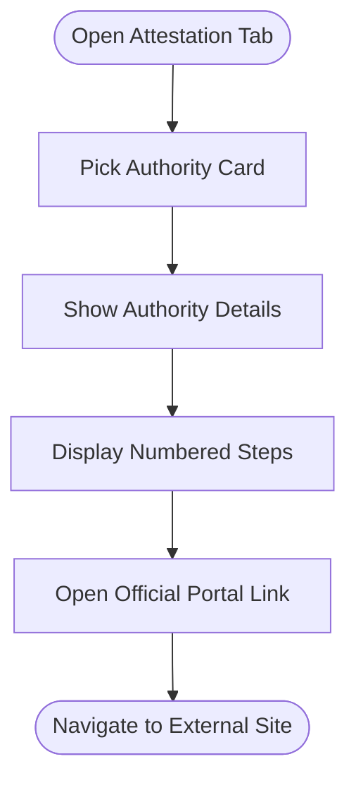
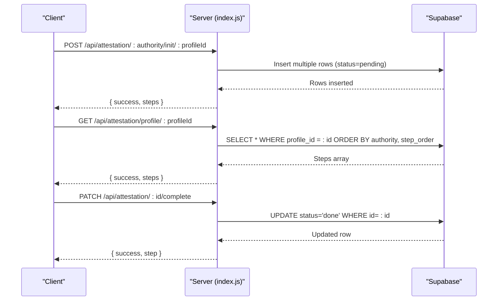
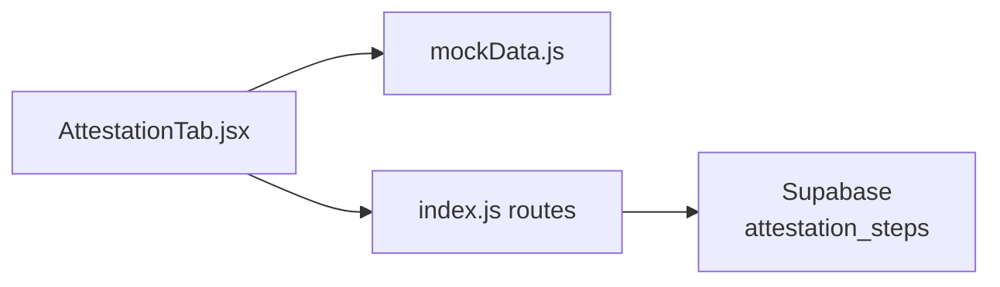

# Document Attestation Workflow

<cite>
**Referenced Files in This Document**
- [AttestationTab.jsx](file://scholarpath-frontend (2)/scholarpath/src/pages/AttestationTab.jsx)
- [mockData.js](file://scholarpath-frontend (2)/scholarpath/src/data/mockData.js)
- [index.js](file://aischolarpath-backend-main/aischolarpath-backend-main/index.js)
</cite>

## Table of Contents
1. [Introduction](#introduction)
2. [Project Structure](#project-structure)
3. [Core Components](#core-components)
4. [Architecture Overview](#architecture-overview)
5. [Detailed Component Analysis](#detailed-component-analysis)
6. [Dependency Analysis](#dependency-analysis)
7. [Performance Considerations](#performance-considerations)
8. [Troubleshooting Guide](#troubleshooting-guide)
9. [Conclusion](#conclusion)

## Introduction
This document explains the document attestation workflow in ScholarPathAI for Pakistani students seeking HEC, IBCC, and MOFA verification. It covers:
- Authority-specific procedures and required documents
- Step-by-step guidance presented to users
- Backend API endpoints that manage attestation tracking and status updates
- The user interface components that guide users through each stage with clear instructions and visual progress indicators

The system provides static guidance for each authority and a backend-tracked step list per profile so users can mark steps as completed and monitor their progress.

## Project Structure
The attestation feature spans both frontend and backend:
- Frontend: A tab-based UI that presents authority selection and detailed steps, plus links to official portals
- Backend: REST endpoints that provide authority guides, initialize tracked steps per profile, retrieve progress, and mark steps complete

**Diagram sources**
- [AttestationTab.jsx:1-72](file://scholarpath-frontend (2)/scholarpath/src/pages/AttestationTab.jsx#L1-L72)
- [mockData.js:256-309](file://scholarpath-frontend (2)/scholarpath/src/data/mockData.js#L256-L309)
- [index.js:404-517](file://aischolarpath-backend-main/aischolarpath-backend-main/index.js#L404-L517)

**Section sources**
- [AttestationTab.jsx:1-72](file://scholarpath-frontend (2)/scholarpath/src/pages/AttestationTab.jsx#L1-L72)
- [mockData.js:256-309](file://scholarpath-frontend (2)/scholarpath/src/data/mockData.js#L256-L309)
- [index.js:404-517](file://aischolarpath-backend-main/aischolarpath-backend-main/index.js#L404-L517)

## Core Components
- AttestationTab component: Renders authority cards and detailed step lists; includes a link to the official portal for each authority
- Attestation data model: Static options for HEC, IBCC, and MOFA with document types, step-by-step instructions, and official links
- Backend attestation APIs: Provide authority guides, initialize tracked steps per profile, fetch progress, and update step status

Key responsibilities:
- Present clear, sequential guidance for each authority
- Allow users to initiate tracked steps for a profile
- Enable marking individual steps as done
- Persist progress to Supabase

**Section sources**
- [AttestationTab.jsx:5-72](file://scholarpath-frontend (2)/scholarpath/src/pages/AttestationTab.jsx#L5-L72)
- [mockData.js:256-309](file://scholarpath-frontend (2)/scholarpath/src/data/mockData.js#L256-L309)
- [index.js:426-517](file://aischolarpath-backend-main/aischolarpath-backend-main/index.js#L426-L517)

## Architecture Overview
The workflow combines static guidance with tracked progress:
- Users select an authority in the UI to view its specific steps
- When ready, they can initialize tracked steps for that authority under their profile
- They mark steps as completed over time; the backend persists these changes
- The UI can display current progress based on stored statuses

**Diagram sources**
- [index.js:426-517](file://aischolarpath-backend-main/aischolarpath-backend-main/index.js#L426-L517)
- [AttestationTab.jsx:56-72](file://scholarpath-frontend (2)/scholarpath/src/pages/AttestationTab.jsx#L56-L72)

## Detailed Component Analysis

### User Interface: AttestationTab
- Displays three authority cards (HEC, IBCC, MOFA) with short names and full names
- Shows detailed steps for the selected authority in a numbered list
- Provides a direct link to the official portal for each authority
- Uses reusable UI primitives (Card, Button, Badge) for consistent presentation

Visual flow:

**Diagram sources**
- [AttestationTab.jsx:5-54](file://scholarpath-frontend (2)/scholarpath/src/pages/AttestationTab.jsx#L5-L54)

**Section sources**
- [AttestationTab.jsx:5-72](file://scholarpath-frontend (2)/scholarpath/src/pages/AttestationTab.jsx#L5-L72)

### Data Model: Authority Options
Each authority option includes:
- Identifier and display name
- Target document types
- Ordered step-by-step instructions
- Official portal URL

Authority-specific details:
- HEC: For Bachelor’s and Master’s degrees and transcripts; includes account creation, uploads, fee payment, appointment scheduling, and collection
- IBCC: For Matric and Intermediate certificates; includes registration, form completion, uploads, fee payment, verification, and collection
- MOFA: Final apostille after HEC or IBCC; includes prerequisites, appointment booking, office visit, fee payment, and collection

**Section sources**
- [mockData.js:256-309](file://scholarpath-frontend (2)/scholarpath/src/data/mockData.js#L256-L309)

### Backend: Attestation Management APIs
Endpoints:
- Get authority guide: GET /api/attestation/:authority
  - Returns predefined steps for HEC, IBCC, or MOFA
- Initialize tracked steps: POST /api/attestation/:authority/init/:profileId
  - Creates one row per step in attestation_steps with status pending
- Get profile progress: GET /api/attestation/profile/:profileId
  - Returns all steps for the profile ordered by authority and step order
- Mark step complete: PATCH /api/attestation/:id/complete
  - Updates a single step’s status to done

Authentication:
- Protected endpoints require a valid JWT token via Authorization header
- Authorization checks ensure users can only access their own profile data

Error handling:
- Unknown authority returns 404
- Unauthorized access returns 403
- Not found step returns 404
- Database errors return 500 with error messages

**Diagram sources**
- [index.js:426-517](file://aischolarpath-backend-main/aischolarpath-backend-main/index.js#L426-L517)

**Section sources**
- [index.js:426-517](file://aischolarpath-backend-main/aischolarpath-backend-main/index.js#L426-L517)

### Authority-Specific Procedures and Required Documents
- HEC
  - Required documents: Degrees and transcripts
  - Procedure highlights: Create account, upload documents, pay fee, schedule appointment, collect attested degree
- IBCC
  - Required documents: SSC/HSSC certificates
  - Procedure highlights: Register, fill application, upload scans, pay fee, verify with issuing board, collect certificate
- MOFA
  - Required documents: Already HEC/IBCC-attested documents
  - Procedure highlights: Ensure prior attestation, book appointment, visit office, pay fee, collect apostilled document

These procedures are surfaced to users via the UI’s step lists and official portal links.

**Section sources**
- [mockData.js:256-309](file://scholarpath-frontend (2)/scholarpath/src/data/mockData.js#L256-L309)

## Dependency Analysis
- Frontend dependency: AttestationTab depends on mockData for authority options and UI components for rendering
- Backend dependency: index.js defines routes and uses Supabase to persist attestation steps
- Data persistence: attestation_steps table stores per-profile, per-authority step records with status tracking

**Diagram sources**
- [AttestationTab.jsx:1-72](file://scholarpath-frontend (2)/scholarpath/src/pages/AttestationTab.jsx#L1-L72)
- [mockData.js:256-309](file://scholarpath-frontend (2)/scholarpath/src/data/mockData.js#L256-L309)
- [index.js:426-517](file://aischolarpath-backend-main/aischolarpath-backend-main/index.js#L426-L517)

**Section sources**
- [AttestationTab.jsx:1-72](file://scholarpath-frontend (2)/scholarpath/src/pages/AttestationTab.jsx#L1-L72)
- [mockData.js:256-309](file://scholarpath-frontend (2)/scholarpath/src/data/mockData.js#L256-L309)
- [index.js:426-517](file://aischolarpath-backend-main/aischolarpath-backend-main/index.js#L426-L517)

## Performance Considerations
- Batch initialization: Creating multiple step rows in a single insert reduces database round trips when initializing an authority’s workflow
- Read efficiency: Fetching all steps for a profile in one query minimizes network overhead
- Authentication middleware: Centralized JWT verification avoids repeated auth logic per route
- External links: Direct navigation to official portals offloads heavy processing to external systems

[No sources needed since this section provides general guidance]

## Troubleshooting Guide
Common issues and resolutions:
- Unknown authority: Ensure the authority parameter is one of HEC, IBCC, or MOFA
- Unauthorized access: Verify the JWT token is present and valid; ensure the profile ID matches the authenticated user
- Step not found: Confirm the step ID exists and belongs to the authenticated user before marking complete
- Database errors: Check environment variables (SUPABASE_URL, SUPABASE_KEY, JWT_SECRET) and network connectivity

Relevant endpoint behaviors:
- GET /api/attestation/:authority returns 404 for unknown authorities
- POST /api/attestation/:authority/init/:profileId requires authentication and validates authority
- GET /api/attestation/profile/:profileId requires authentication and authorizes profile ownership
- PATCH /api/attestation/:id/complete requires authentication and verifies ownership

**Section sources**
- [index.js:426-517](file://aischolarpath-backend-main/aischolarpath-backend-main/index.js#L426-L517)

## Conclusion
ScholarPathAI’s document attestation workflow provides clear, authority-specific guidance and a simple progress-tracking system. Users can:
- View step-by-step instructions for HEC, IBCC, and MOFA
- Initiate tracked steps for a profile
- Mark steps as completed and monitor progress
- Navigate directly to official portals for real-world actions

The combination of static guidance and backend-tracked steps ensures users stay organized throughout the attestation process while maintaining secure, user-scoped data management.