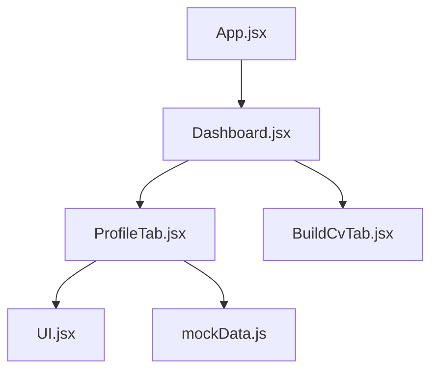
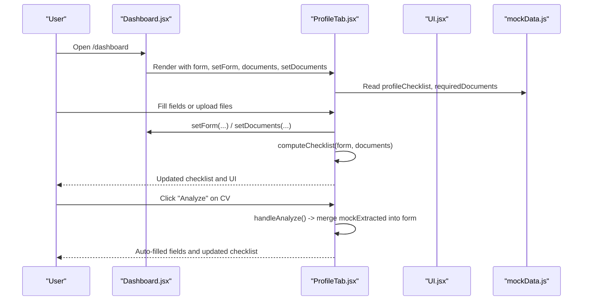
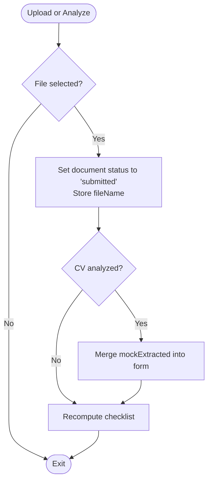
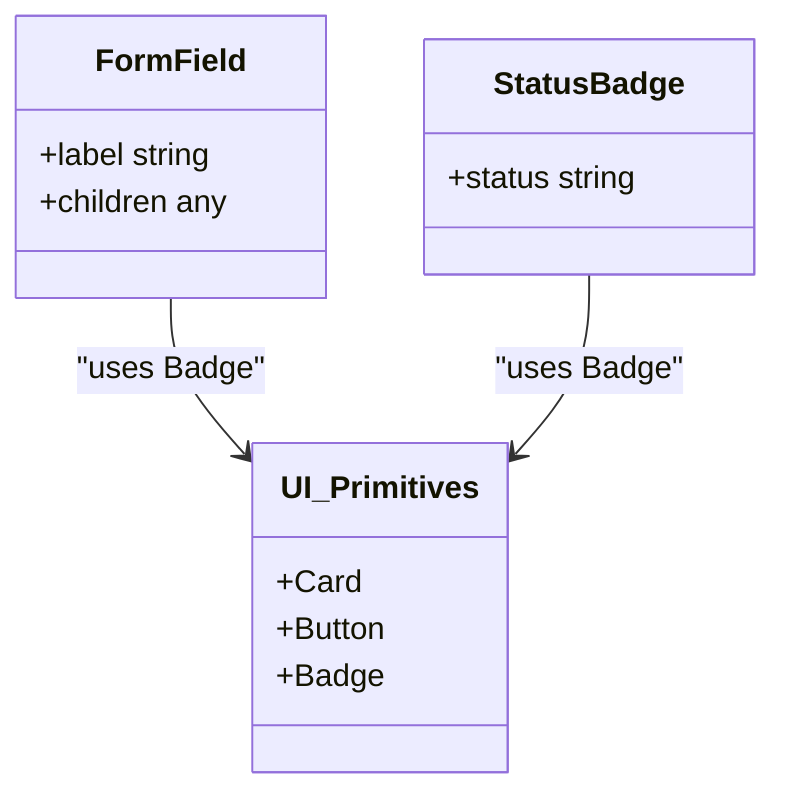
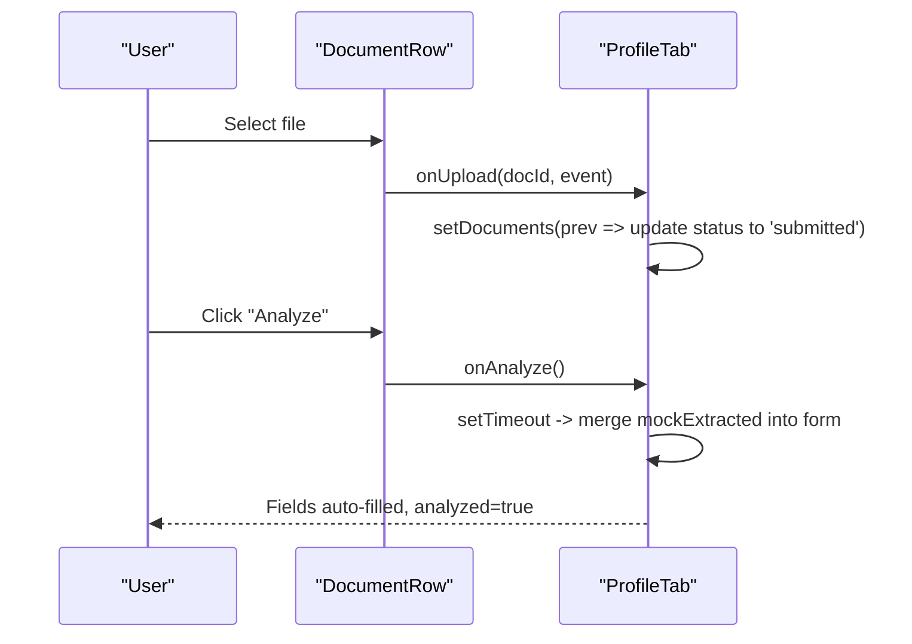
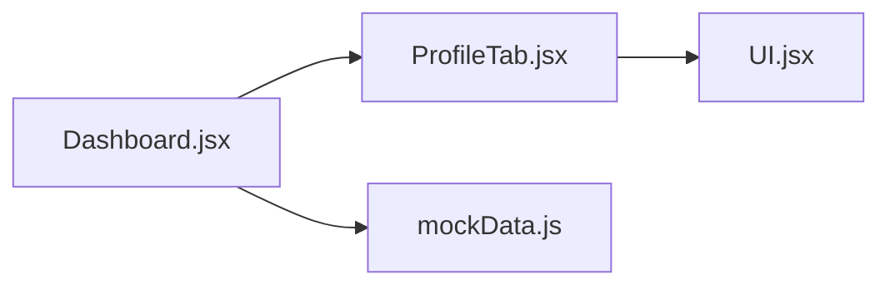
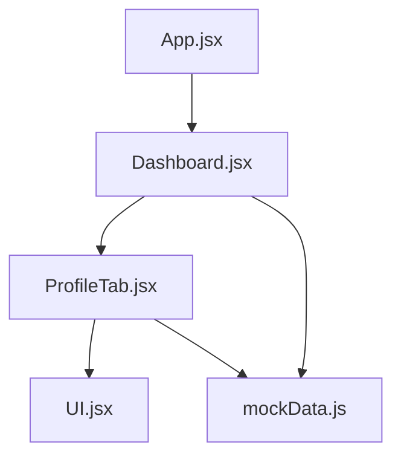

# Profile Management System

<cite>
**Referenced Files in This Document**
- [ProfileTab.jsx](file://scholarpath-frontend (2)/scholarpath/src/pages/ProfileTab.jsx)
- [Dashboard.jsx](file://scholarpath-frontend (2)/scholarpath/src/pages/Dashboard.jsx)
- [UI.jsx](file://scholarpath-frontend (2)/scholarpath/src/components/UI.jsx)
- [mockData.js](file://scholarpath-frontend (2)/scholarpath/src/data/mockData.js)
- [BuildCvTab.jsx](file://scholarpath-frontend (2)/scholarpath/src/pages/BuildCvTab.jsx)
- [App.jsx](file://scholarpath-frontend (2)/scholarpath/src/App.jsx)
</cite>

## Table of Contents
1. Introduction
2. Project Structure
3. Core Components
4. Architecture Overview
5. Detailed Component Analysis
6. Dependency Analysis
7. Performance Considerations
8. Troubleshooting Guide
9. Conclusion
10. Appendices

## Introduction
This document explains the ScholarPathAI profile management system implemented in the frontend. It covers:
- Student profile creation workflow for personal information, academic details, and extracurricular activities
- Document upload functionality with CV analysis that auto-fills profile data from an uploaded CV
- Profile strength assessment via a dynamic checklist covering basics, academics, tests, essays, and extracurriculars
- Implementation details including form state management, file handling, validation rules, and mock data extraction simulation
- Component architecture using FormField components, StatusBadge for document tracking, and an integrated document management interface

## Project Structure
The profile management feature is primarily implemented within the dashboard’s Profile tab. The Dashboard component owns shared state for the profile form and documents, then passes them down to ProfileTab. UI primitives are provided by a small shared UI library. Static configuration such as required documents and checklist items lives in a central mock data module.

**Diagram sources**
- [App.jsx:1-15](file://scholarpath-frontend (2)/scholarpath/src/App.jsx#L1-L15)
- [Dashboard.jsx:1-187](file://scholarpath-frontend (2)/scholarpath/src/pages/Dashboard.jsx#L1-L187)
- [ProfileTab.jsx:1-232](file://scholarpath-frontend (2)/scholarpath/src/pages/ProfileTab.jsx#L1-L232)
- [UI.jsx:1-47](file://scholarpath-frontend (2)/scholarpath/src/components/UI.jsx#L1-L47)
- [mockData.js:1-349](file://scholarpath-frontend (2)/scholarpath/src/data/mockData.js#L1-L349)
- [BuildCvTab.jsx:1-284](file://scholarpath-frontend (2)/scholarpath/src/pages/BuildCvTab.jsx#L1-L284)

**Section sources**
- [App.jsx:1-15](file://scholarpath-frontend (2)/scholarpath/src/App.jsx#L1-L15)
- [Dashboard.jsx:1-187](file://scholarpath-frontend (2)/scholarpath/src/pages/Dashboard.jsx#L1-L187)

## Core Components
- ProfileTab: Central page for profile creation, document uploads, and CV analysis. It renders:
  - A dynamic checklist computed from form fields and document statuses
  - Personal information inputs (name, father’s name, gender, country, phone, email)
  - Academic details (CGPA, IELTS score, degree, department)
  - Extracurricular activities input
  - Document management with upload and analyze actions
- Dashboard: Hosts shared state for profileForm and documents, and composes tabs including ProfileTab
- UI: Reusable primitives Card, Button, Badge used across the app
- mockData: Defines requiredDocuments and profileChecklist used by ProfileTab
- BuildCvTab: Supports CV building and conversion workflows; complements the CV analysis flow in ProfileTab

Key responsibilities:
- State ownership: Dashboard holds profileForm and documents
- Field updates: ProfileTab uses updateField to mutate form state immutably
- Document lifecycle: Upload sets status to submitted and tracks fileName; Analyze simulates parsing and merges extracted values into form
- Checklist computation: computeChecklist evaluates completion per category based on form and document states

**Section sources**
- [ProfileTab.jsx:27-45](file://scholarpath-frontend (2)/scholarpath/src/pages/ProfileTab.jsx#L27-L45)
- [ProfileTab.jsx:88-115](file://scholarpath-frontend (2)/scholarpath/src/pages/ProfileTab.jsx#L88-L115)
- [Dashboard.jsx:23-36](file://scholarpath-frontend (2)/scholarpath/src/pages/Dashboard.jsx#L23-L36)
- [Dashboard.jsx:128-146](file://scholarpath-frontend (2)/scholarpath/src/pages/Dashboard.jsx#L128-L146)
- [UI.jsx:1-47](file://scholarpath-frontend (2)/scholarpath/src/components/UI.jsx#L1-L47)
- [mockData.js:25-41](file://scholarpath-frontend (2)/scholarpath/src/data/mockData.js#L25-L41)

## Architecture Overview
The profile management system follows a unidirectional data flow pattern:
- Dashboard owns state (profileForm, documents)
- ProfileTab receives props and dispatches updates back to Dashboard via callbacks
- UI components render based on props without owning business logic
- mockData provides static configuration for checklist and required documents

**Diagram sources**
- [Dashboard.jsx:128-146](file://scholarpath-frontend (2)/scholarpath/src/pages/Dashboard.jsx#L128-L146)
- [ProfileTab.jsx:88-115](file://scholarpath-frontend (2)/scholarpath/src/pages/ProfileTab.jsx#L88-L115)
- [ProfileTab.jsx:27-45](file://scholarpath-frontend (2)/scholarpath/src/pages/ProfileTab.jsx#L27-L45)
- [mockData.js:25-41](file://scholarpath-frontend (2)/scholarpath/src/data/mockData.js#L25-L41)

## Detailed Component Analysis

### ProfileTab: Workflow and Logic
- Personal information inputs:
  - First name, last name, father’s name, gender, country, phone, email
  - Controlled inputs bound to form fields via updateField
- Academic details:
  - CGPA, IELTS score, degree, department, extracurricular activities
- Document management:
  - Required documents list from mockData
  - Upload handler updates document status to submitted and stores fileName
  - Analyze handler simulates CV parsing and merges mockExtracted into form
- Dynamic checklist:
  - Basics: requires firstName, lastName, email, phone, country, gender
  - Academics: requires degree, department, cgpa and transcript submitted
  - Tests: requires ielts or ielts document submitted
  - Essays: requires recommendation document submitted
  - Extracurriculars: requires non-empty extracurriculars field

**Diagram sources**
- [ProfileTab.jsx:98-115](file://scholarpath-frontend (2)/scholarpath/src/pages/ProfileTab.jsx#L98-L115)
- [ProfileTab.jsx:27-45](file://scholarpath-frontend (2)/scholarpath/src/pages/ProfileTab.jsx#L27-L45)

**Section sources**
- [ProfileTab.jsx:10-25](file://scholarpath-frontend (2)/scholarpath/src/pages/ProfileTab.jsx#L10-L25)
- [ProfileTab.jsx:27-45](file://scholarpath-frontend (2)/scholarpath/src/pages/ProfileTab.jsx#L27-L45)
- [ProfileTab.jsx:98-115](file://scholarpath-frontend (2)/scholarpath/src/pages/ProfileTab.jsx#L98-L115)
- [ProfileTab.jsx:145-206](file://scholarpath-frontend (2)/scholarpath/src/pages/ProfileTab.jsx#L145-L206)
- [ProfileTab.jsx:208-228](file://scholarpath-frontend (2)/scholarpath/src/pages/ProfileTab.jsx#L208-L228)

### Form Field and StatusBadge Components
- FormField:
  - Wraps label and child input/select elements
  - Provides consistent styling and structure for form sections
- StatusBadge:
  - Displays document status with color-coded tones
  - Maps statuses to labels: submitted, pending, missing

**Diagram sources**
- [ProfileTab.jsx:47-63](file://scholarpath-frontend (2)/scholarpath/src/pages/ProfileTab.jsx#L47-L63)
- [UI.jsx:1-47](file://scholarpath-frontend (2)/scholarpath/src/components/UI.jsx#L1-L47)

**Section sources**
- [ProfileTab.jsx:47-63](file://scholarpath-frontend (2)/scholarpath/src/pages/ProfileTab.jsx#L47-L63)
- [UI.jsx:1-47](file://scholarpath-frontend (2)/scholarpath/src/components/UI.jsx#L1-L47)

### Document Management Interface
- DocumentRow:
  - Renders document label, optional fileName, StatusBadge, and action buttons
  - For CV, shows Analyze button when status is submitted
  - File input triggers onUpload handler
- Upload behavior:
  - Updates document status to submitted and captures fileName
  - Resets analyzed flag for CV to allow re-analysis
- Analyze behavior:
  - Simulates asynchronous processing with a timeout
  - Merges mockExtracted into form and marks analyzed

**Diagram sources**
- [ProfileTab.jsx:65-86](file://scholarpath-frontend (2)/scholarpath/src/pages/ProfileTab.jsx#L65-L86)
- [ProfileTab.jsx:98-115](file://scholarpath-frontend (2)/scholarpath/src/pages/ProfileTab.jsx#L98-L115)

**Section sources**
- [ProfileTab.jsx:65-86](file://scholarpath-frontend (2)/scholarpath/src/pages/ProfileTab.jsx#L65-L86)
- [ProfileTab.jsx:98-115](file://scholarpath-frontend (2)/scholarpath/src/pages/ProfileTab.jsx#L98-L115)

### Dashboard Integration and Shared State
- State ownership:
  - profileForm initialized with empty fields
  - documents initialized from requiredDocuments
- Tab composition:
  - ProfileTab receives form, setForm, documents, setDocuments
- Overview highlights:
  - Profile strength bar and top matches/scholarships
  - Encourages completing missing boosts

**Diagram sources**
- [Dashboard.jsx:23-36](file://scholarpath-frontend (2)/scholarpath/src/pages/Dashboard.jsx#L23-L36)
- [Dashboard.jsx:128-146](file://scholarpath-frontend (2)/scholarpath/src/pages/Dashboard.jsx#L128-L146)
- [mockData.js:25-41](file://scholarpath-frontend (2)/scholarpath/src/data/mockData.js#L25-L41)

**Section sources**
- [Dashboard.jsx:23-36](file://scholarpath-frontend (2)/scholarpath/src/pages/Dashboard.jsx#L23-L36)
- [Dashboard.jsx:128-146](file://scholarpath-frontend (2)/scholarpath/src/pages/Dashboard.jsx#L128-L146)

### BuildCvTab Complement
- Provides CV upload, AI feedback, and Europass conversion
- While not directly connected to ProfileTab’s analyze flow, it demonstrates similar file handling patterns and user flows for document-centric tasks

**Section sources**
- [BuildCvTab.jsx:1-284](file://scholarpath-frontend (2)/scholarpath/src/pages/BuildCvTab.jsx#L1-L284)

## Dependency Analysis
- ProfileTab depends on:
  - UI primitives (Card, Button, Badge)
  - mockData for profileChecklist and requiredDocuments
- Dashboard depends on:
  - ProfileTab and other tabs
  - mockData for initial documents and student info
- App routes:
  - Landing and Dashboard pages

**Diagram sources**
- [App.jsx:1-15](file://scholarpath-frontend (2)/scholarpath/src/App.jsx#L1-L15)
- [Dashboard.jsx:1-187](file://scholarpath-frontend (2)/scholarpath/src/pages/Dashboard.jsx#L1-L187)
- [ProfileTab.jsx:1-232](file://scholarpath-frontend (2)/scholarpath/src/pages/ProfileTab.jsx#L1-L232)
- [UI.jsx:1-47](file://scholarpath-frontend (2)/scholarpath/src/components/UI.jsx#L1-L47)
- [mockData.js:1-349](file://scholarpath-frontend (2)/scholarpath/src/data/mockData.js#L1-L349)

**Section sources**
- [App.jsx:1-15](file://scholarpath-frontend (2)/scholarpath/src/App.jsx#L1-L15)
- [Dashboard.jsx:1-187](file://scholarpath-frontend (2)/scholarpath/src/pages/Dashboard.jsx#L1-L187)
- [ProfileTab.jsx:1-232](file://scholarpath-frontend (2)/scholarpath/src/pages/ProfileTab.jsx#L1-L232)

## Performance Considerations
- Checklist recomputation:
  - computeChecklist runs on every render based on current form and documents; ensure minimal re-renders by keeping form state stable and avoiding unnecessary updates
- File handling:
  - Only one file is processed at a time; avoid large file sizes to prevent UI lag during selection and analysis
- Asynchronous simulation:
  - Analyze uses a timeout to simulate backend processing; in production, replace with proper async calls and loading states to maintain responsiveness
- State lifting:
  - Keeping form and documents in Dashboard reduces prop drilling and ensures single source of truth, improving predictability

[No sources needed since this section provides general guidance]

## Troubleshooting Guide
Common issues and resolutions:
- Checklist not updating:
  - Ensure all required fields are filled and relevant documents are marked as submitted
  - Verify that setForm and setDocuments are called correctly from ProfileTab
- CV analysis not filling fields:
  - Confirm that the CV document status is submitted before analyzing
  - Check that handleAnalyze is invoked and not blocked by disabled states
- File upload not registering:
  - Validate that onChange handlers are attached to file inputs
  - Ensure e.target.files exists and contains a file before updating state
- StatusBadge showing incorrect status:
  - Inspect the documents array to verify status values match expected strings: submitted, pending, missing

**Section sources**
- [ProfileTab.jsx:27-45](file://scholarpath-frontend (2)/scholarpath/src/pages/ProfileTab.jsx#L27-L45)
- [ProfileTab.jsx:98-115](file://scholarpath-frontend (2)/scholarpath/src/pages/ProfileTab.jsx#L98-L115)
- [ProfileTab.jsx:65-86](file://scholarpath-frontend (2)/scholarpath/src/pages/ProfileTab.jsx#L65-L86)

## Conclusion
The ScholarPathAI profile management system provides a cohesive workflow for students to build their profiles, upload supporting documents, and receive immediate feedback through a dynamic checklist. The integration of CV analysis simulates real-world parsing to auto-fill profile data, streamlining the application process. With clear separation of concerns—state owned by Dashboard, rendering in ProfileTab, and shared UI primitives—the system remains maintainable and extensible for future backend integrations.

[No sources needed since this section summarizes without analyzing specific files]

## Appendices

### Data Models and Configuration
- Profile form fields:
  - firstName, lastName, fatherName, country, phone, email, gender, cgpa, ielts, degree, department, extracurriculars
- Required documents:
  - transcript, passport, ielts, recommendation, cv with statuses: submitted, pending, missing
- Checklist categories:
  - basics, academics, tests, essays, extracurriculars

**Section sources**
- [Dashboard.jsx:23-36](file://scholarpath-frontend (2)/scholarpath/src/pages/Dashboard.jsx#L23-L36)
- [mockData.js:25-41](file://scholarpath-frontend (2)/scholarpath/src/data/mockData.js#L25-L41)