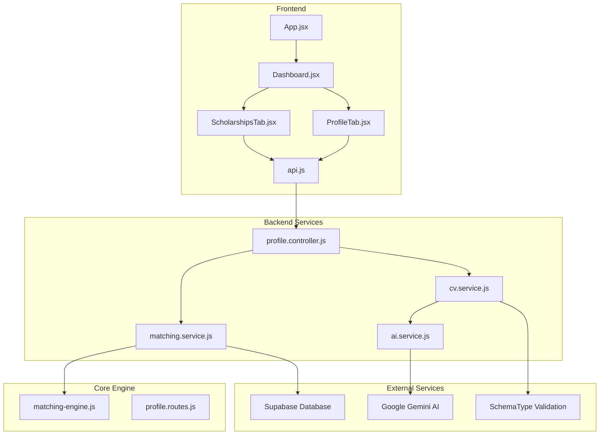
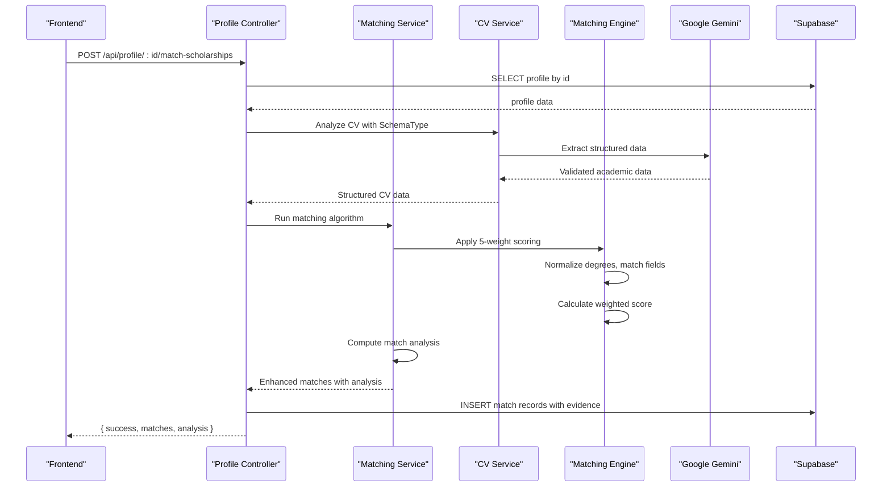
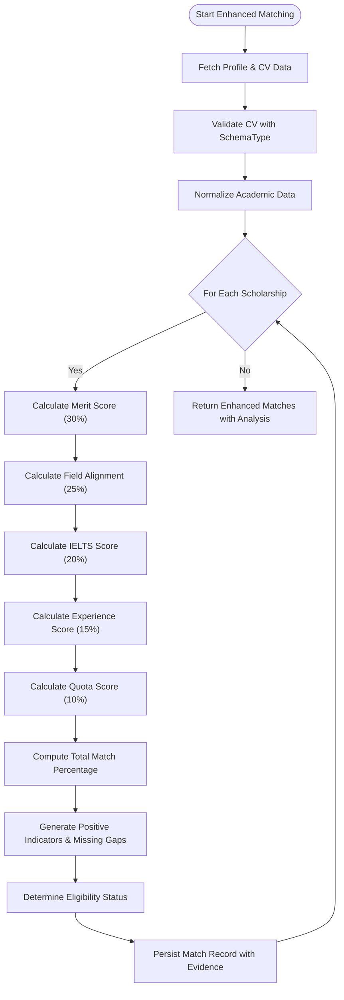
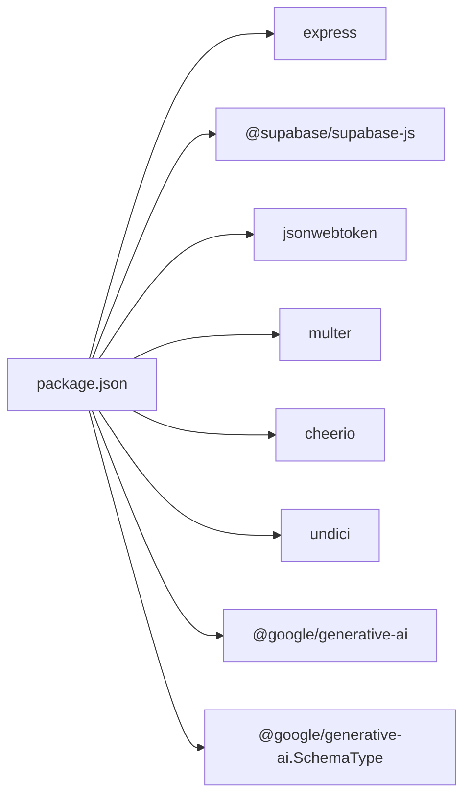

# Scholarship Matching Algorithm

<cite>
**Referenced Files in This Document**
- [matching.service.js](file://aischolarpath-backend-main/aischolarpath-backend-main/services/matching.service.js)
- [matching-engine.js](file://aischolarpath-backend-main/aischolarpath-backend-main/matching-engine.js)
- [cv.service.js](file://aischolarpath-backend-main/aischolarpath-backend-main/services/cv.service.js)
- [profile.controller.js](file://aischolarpath-backend-main/aischolarpath-backend-main/controllers/profile.controller.js)
- [ai.service.js](file://aischolarpath-backend-main/aischolarpath-backend-main/services/ai.service.js)
- [matching-engine.test.js](file://aischolarpath-backend-main/aischolarpath-backend-main/__tests__/matching-engine.test.js)
- [profile.routes.js](file://aischolarpath-backend-main/aischolarpath-backend-main/routes/profile.routes.js)
</cite>

## Update Summary
**Changes Made**
- Enhanced matching engine with sophisticated 5-weight algorithm (Merit 30%, Field 25%, IELTS 20%, Experience 15%, Quota 10%) implemented in services/matching.service.js
- Implemented new strict JSON schema validation via Google's SchemaType for CV extraction ensuring consistent data processing
- Added computeMatchAnalysis function providing detailed match percentage calculations with positive indicators and missing gaps
- Enhanced CV parsing with structured schema enforcement for academic data extraction
- Updated profile controller integration to leverage enhanced matching analysis

## Table of Contents
1. [Introduction](#introduction)
2. [Project Structure](#project-structure)
3. [Core Components](#core-components)
4. [Architecture Overview](#architecture-overview)
5. [Detailed Component Analysis](#detailed-component-analysis)
6. [Dependency Analysis](#dependency-analysis)
7. [Performance Considerations](#performance-considerations)
8. [Troubleshooting Guide](#troubleshooting-guide)
9. [Conclusion](#conclusion)
10. [Appendices](#appendices)

## Introduction
This document explains the intelligent scholarship matching algorithm used by ScholarPathAI. The system now features an enhanced matching engine with a sophisticated 5-weight algorithm that evaluates student profiles against scholarship eligibility criteria using Merit (CGPA/FSc scores) at 30%, Field alignment at 25%, IELTS proficiency at 20%, Experience depth at 15%, and Quota/Country matching at 10%. The system includes strict JSON schema validation via Google's SchemaType for CV extraction, ensuring consistent and reliable data processing. It provides evidence-based recommendations with detailed reasoning, gap identification, and actionable insights for students to improve their eligibility. The backend implementation includes robust API endpoints for profile matching (/api/profile/:id/match-scholarships) and comprehensive frontend integration for displaying results with probability indicators and detailed analysis.

## Project Structure
The project consists of a Node.js/Express backend with an enhanced matching service and a React frontend:
- Backend: Express server with Supabase integration, featuring a modular matching service with weighted criteria, fuzzy degree matching, field group recognition, and AI-powered analysis with strict schema validation.
- Frontend: React app with routing and pages for dashboard, profile, universities, scholarships, CV builder, attestation, and FAQ with enhanced probability visualization.

**Diagram sources**
- [matching.service.js:1-420](file://aischolarpath-backend-main/aischolarpath-backend-main/services/matching.service.js#L1-L420)
- [cv.service.js:1-341](file://aischolarpath-backend-main/aischolarpath-backend-main/services/cv.service.js#L1-L341)
- [ai.service.js:173-189](file://aischolarpath-backend-main/aischolarpath-backend-main/services/ai.service.js#L173-L189)
- [profile.controller.js:186-211](file://aischolarpath-backend-main/aischolarpath-backend-main/controllers/profile.controller.js#L186-L211)
- [matching-engine.js:1-66](file://aischolarpath-backend-main/aischolarpath-backend-main/matching-engine.js#L1-L66)
- [profile.routes.js:1-27](file://aischolarpath-backend-main/aischolarpath-backend-main/routes/profile.routes.js#L1-L27)

## Core Components
- **Enhanced Matching Service**: Sophisticated 5-weight algorithm with Merit (30%), Field (25%), IELTS (20%), Experience (15%), Quota (10%) scoring; integrates Google Gemini for CV parsing with strict schema validation.
- **Strict Schema Validation**: Google's SchemaType ensures consistent CV data extraction with structured academic, language, and experience data.
- **Weighted Scholarship Catalog**: List and filter scholarships with enhanced matching capabilities; fetch single scholarship details.
- **Advanced Matching Engine**: Evaluate student profiles against scholarship eligibility criteria using weighted scoring; compute match scores with detailed evidence; persist results with reasoning.
- **Intelligent Shortlist Management**: Add/remove items (scholarships/universities); retrieve shortlist with details.
- **Application Tracking**: Create/update/delete applications; view applications with scholarship details; deadline reminders.
- **Authentication & Security**: JWT-based token verification; environment validation; secure endpoints.

Key responsibilities and interactions are implemented in the matching service with the enhanced 5-weight algorithm, while the profile controller orchestrates the matching workflow and integrates with the frontend through API routes.

**Section sources**
- [matching.service.js:18-145](file://aischolarpath-backend-main/aischolarpath-backend-main/services/matching.service.js#L18-L145)
- [cv.service.js:97-176](file://aischolarpath-backend-main/aischolarpath-backend-main/services/cv.service.js#L97-L176)
- [profile.controller.js:186-211](file://aischolarpath-backend-main/aischolarpath-backend-main/controllers/profile.controller.js#L186-L211)
- [matching-engine.js:6-66](file://aischolarpath-backend-main/aischolarpath-backend-main/matching-engine.js#L6-L66)
- [profile.routes.js:18-24](file://aischolarpath-backend-main/aischolarpath-backend-main/routes/profile.routes.js#L18-L24)

## Architecture Overview
The enhanced matching workflow is triggered when a user requests profile-based scholarship matching. The backend retrieves the authenticated user's profile, performs CV analysis with strict schema validation, applies the sophisticated 5-weight matching algorithm, computes detailed match analysis with positive indicators and missing gaps, and provides comprehensive eligibility assessment. The frontend displays these matches along with probability indicators, detailed reasons, and actionable insights for improvement.

**Diagram sources**
- [profile.controller.js:186-211](file://aischolarpath-backend-main/aischolarpath-backend-main/controllers/profile.controller.js#L186-L211)
- [matching.service.js:207-281](file://aischolarpath-backend-main/aischolarpath-backend-main/services/matching.service.js#L207-L281)
- [cv.service.js:97-176](file://aischolarpath-backend-main/aischolarpath-backend-main/services/cv.service.js#L97-L176)
- [matching-engine.js:35-54](file://aischolarpath-backend-main/aischolarpath-backend-main/matching-engine.js#L35-L54)

## Detailed Component Analysis

### Enhanced 5-Weight Matching Algorithm
The matching service implements a sophisticated weighted scoring system that evaluates student profiles against scholarship eligibility criteria using an advanced algorithm with five distinct weight categories:

**Updated Weighted Criteria Breakdown:**
- **Merit (CGPA/FSc Scores - 30%)**: Uses FSc percentage for bachelor's programs, CGPA for higher degrees; supports both numeric comparisons and missing data handling with ratio-based scoring
- **Field Alignment (25%)**: Advanced field matching with exact matches, related field recognition through predefined groups, and mismatch detection with partial credit
- **IELTS Proficiency (20%)**: Language proficiency comparison with minimum threshold validation and ratio-based scoring
- **Experience Depth (15%)**: Work experience evaluation based on years of relevant experience with graduated scoring
- **Quota/Country (10%)**: Geographic preference matching with country alignment validation

**Advanced Match Analysis System:**
- **Positive Indicators**: Specific strengths identified in the applicant's profile
- **Missing Gaps**: Clear identification of areas requiring improvement
- **Chance Level Assessment**: High Chance 🔥 (≥75%), Medium Chance ⚡ (≥50%), Low Chance 📉 (<50%)
- **Evidence-Based Scoring**: Each criterion evaluated with detailed justification

**Diagram sources**
- [matching.service.js:295-419](file://aischolarpath-backend-main/aischolarpath-backend-main/services/matching.service.js#L295-L419)
- [cv.service.js:97-176](file://aischolarpath-backend-main/aischolarpath-backend-main/services/cv.service.js#L97-L176)

**Section sources**
- [matching.service.js:295-419](file://aischolarpath-backend-main/aischolarpath-backend-main/services/matching.service.js#L295-L419)
- [matching.service.js:18-145](file://aischolarpath-backend-main/aischolarpath-backend-main/services/matching.service.js#L18-L145)

### Strict JSON Schema Validation for CV Extraction
The system now implements Google's SchemaType for strict JSON schema validation during CV extraction, ensuring consistent and reliable data processing:

**Structured Schema Definition:**
- **Academic Data**: fsc_percentage (0-100 scale), cgpa (0-4 scale), degree_level, field_of_study
- **Language Proficiency**: ielts_score (0-9 scale)
- **Experience**: years_of_experience, skills array
- **Required Fields**: All sections marked as required with proper type validation

**Fallback Mechanism:**
- Primary extraction uses SchemaType for guaranteed structure
- Automatic fallback to legacy free-form extraction if schema mode fails
- Normalization of legacy data to canonical schema format

**Benefits:**
- Consistent data structure across all CV extractions
- Reduced parsing errors and improved reliability
- Better integration with matching algorithms due to standardized data format

**Section sources**
- [cv.service.js:14-19](file://aischolarpath-backend-main/aischolarpath-backend-main/services/cv.service.js#L14-L19)
- [cv.service.js:97-176](file://aischolarpath-backend-main/aischolarpath-backend-main/services/cv.service.js#L97-L176)
- [ai.service.js:173-189](file://aischolarpath-backend-main/aischolarpath-backend-main/services/ai.service.js#L173-L189)

### Enhanced Backend Implementation: Profile Matching API Endpoints
Key endpoints supporting the enhanced matching algorithm:
- **POST /api/profile/:id/match-scholarships**: Execute enhanced matching with 5-weight algorithm, schema-validated CV analysis, and detailed match analysis; returns matches with positive indicators, missing gaps, and chance levels.
- **GET /api/profile/:id/matches**: Retrieve stored matches with enhanced match_analysis including positive_indicators and missing_gaps arrays.
- **GET /api/profile/:id/overview**: Dashboard summary including profile completeness, enhanced match counts, and top recommendations with detailed analysis.
- **POST /api/profile/:id/upload-cv**: Upload CV with automatic schema-validated extraction.
- **POST /api/profile/:id/analyze**: Analyze CV with strict JSON schema validation.

Authentication middleware ensures only authorized users access their own data.

**Section sources**
- [profile.routes.js:18-24](file://aischolarpath-backend-main/aischolarpath-backend-main/routes/profile.routes.js#L18-L24)
- [profile.controller.js:186-211](file://aischolarpath-backend-main/aischolarpath-backend-main/controllers/profile.controller.js#L186-L211)

### Enhanced Frontend Integration: Probability Visualization and Analysis Display
The frontend has been updated to leverage the enhanced matching capabilities with sophisticated probability visualization:
- **Dashboard displays** top university matches, top scholarships with weighted scores, and upcoming deadlines.
- **ScholarshipsTab** features enhanced matching integration with detailed analysis display.
- **Chance Meter Component**: Visual probability indicator with color-coded ranges and emoji indicators (🔥, ⚡, 📉).
- **Eligibility Breakdown**: Expandable detailed view showing criterion-by-criterion evaluation with positive indicators and missing gaps.

**Enhanced Frontend Features:**
- Displays match percentages alongside traditional match scores
- Shows detailed positive indicators and missing gaps for each match
- Provides specific improvement suggestions based on missing gaps
- Supports both enhanced matching and traditional matching results
- Auto-runs enhanced matching when user has complete profile information

**Section sources**
- [profile.controller.js:202-211](file://aischolarpath-backend-main/aischolarpath-backend-main/controllers/profile.controller.js#L202-L211)

### Application Progress Tracking
The system supports enhanced tracking of application lifecycle:
- **Create applications** with initial status (e.g., saved), notes, next actions, and dates.
- **Update statuses** and notes over time with enhanced tracking.
- **View all applications** for a profile with scholarship details and enhanced context.
- **Delete applications** as needed.

Deadline reminder notifications can be generated for upcoming deadlines within a configurable window.

**Section sources**
- [profile.controller.js:214-272](file://aischolarpath-backend-main/aischolarpath-backend-main/controllers/profile.controller.js#L214-L272)

## Dependency Analysis
The backend depends on several libraries and services with enhanced matching capabilities:
- **Express**: Web framework for routing and middleware.
- **Supabase**: Database client for profiles, scholarships, matches, shortlists, applications, and logs.
- **JWT**: Token-based authentication and authorization.
- **Multer**: File upload handling for CVs.
- **Cheerio**: HTML parsing for discovery/scraping endpoints.
- **Undici**: HTTP agent configuration for network requests.
- **Google Gemini**: AI integration for CV parsing with SchemaType validation and enhanced profile analysis.
- **@google/generative-ai**: SchemaType for strict JSON schema validation.

**Diagram sources**
- [cv.service.js:14-19](file://aischolarpath-backend-main/aischolarpath-backend-main/services/cv.service.js#L14-L19)
- [ai.service.js:173-189](file://aischolarpath-backend-main/aischolarpath-backend-main/services/ai.service.js#L173-L189)

**Section sources**
- [cv.service.js:14-19](file://aischolarpath-backend-main/aischolarpath-backend-main/services/cv.service.js#L14-L19)
- [ai.service.js:173-189](file://aischolarpath-backend-main/aischolarpath-backend-main/services/ai.service.js#L173-L189)

## Performance Considerations
- **Connection Pooling**: The HTTP agent configures connection limits and timeouts to handle concurrent requests efficiently.
- **Query Filtering**: Scholarship queries can be filtered by country to reduce dataset size during matching.
- **Batch Operations**: Inserting matches in bulk reduces database round-trips.
- **Pagination/Limits**: University listing limits results to avoid large payloads.
- **Rate Limiting in Scrapers**: Discovery endpoints include delays between requests to respect external sites.
- **Enhanced Caching**: Matching results are cached and refreshed on demand to optimize performance.
- **Weighted Calculation Optimization**: Efficient 5-weight scoring calculations minimize computational overhead.
- **Schema Validation Efficiency**: SchemaType validation ensures fast, reliable CV parsing with minimal retries.
- **AI Processing**: Gemini API calls are wrapped in try-catch blocks to prevent failures from blocking core functionality.
- **Fallback Mechanisms**: Legacy extraction fallback ensures system resilience when SchemaType is unavailable.

## Troubleshooting Guide
Common issues and resolutions:
- **Missing Environment Variables**: Ensure SUPABASE_URL, SUPABASE_KEY, JWT_SECRET, and GEMINI_API_KEY are set before startup; the server validates required variables and exits if missing.
- **Authentication Errors**: Verify Authorization header contains a valid JWT; invalid or expired tokens return 403 responses.
- **Profile Access Denied**: Requests to other users' profiles return 403; ensure the profile ID matches the authenticated user.
- **Database Errors**: Any Supabase query errors return 500 with error messages; check table schemas and permissions.
- **File Upload Issues**: Ensure files are provided and have correct MIME types; storage operations may fail due to permissions or quotas.
- **AI Integration Issues**: If GEMINI_API_KEY is not configured, AI features fall back to default responses; check API key configuration.
- **Schema Type Issues**: If SchemaType is unavailable, system automatically falls back to legacy extraction; verify @google/generative-ai package installation.
- **CV Parsing Failures**: Ensure CV files contain readable text; PDF parsing may fail with scanned documents without OCR.
- **Enhanced Matching Issues**: Check that profile data includes required fields (target_degree, target_department, cgpa/ielts) for optimal matching results.

**Section sources**
- [cv.service.js:14-19](file://aischolarpath-backend-main/aischolarpath-backend-main/services/cv.service.js#L14-L19)
- [cv.service.js:164-176](file://aischolarpath-backend-main/aischolarpath-backend-main/services/cv.service.js#L164-L176)

## Conclusion
ScholarPathAI's enhanced matching algorithm represents a significant advancement in scholarship matching technology, providing a sophisticated, evidence-based approach to evaluating student profiles against scholarship eligibility criteria. The new 5-weight algorithm with Merit (30%), Field (25%), IELTS (20%), Experience (15%), and Quota (10%) scoring offers significantly more accurate and actionable recommendations. By implementing strict JSON schema validation via Google's SchemaType for CV extraction, the system ensures consistent and reliable data processing across all platforms. The enhanced match analysis provides detailed positive indicators and missing gaps, helping students understand exactly where they excel and what improvements are needed. The backend exposes robust APIs for enhanced matching, while the frontend offers an intuitive interface with probability visualization and detailed analysis to help students explore opportunities and plan next steps with enhanced insights. Future enhancements can expand field group recognition, incorporate additional criteria weights, and integrate more sophisticated AI-driven profile analysis.

## Appendices

### Enhanced API Reference Summary
- **POST /api/profile/:id/match-scholarships**: Execute enhanced matching with 5-weight algorithm; returns matches with match_analysis including positive_indicators and missing_gaps.
- **GET /api/profile/:id/matches**: Retrieve stored matches with enhanced match_analysis containing detailed scoring breakdown.
- **GET /api/profile/:id/overview**: Dashboard summary with profile completeness and enhanced top recommendations.
- **POST /api/profile/:id/upload-cv**: Upload CV with automatic schema-validated extraction.
- **POST /api/profile/:id/analyze**: Analyze CV with strict JSON schema validation.

**Section sources**
- [profile.routes.js:18-24](file://aischolarpath-backend-main/aischolarpath-backend-main/routes/profile.routes.js#L18-L24)
- [profile.controller.js:186-211](file://aischolarpath-backend-main/aischolarpath-backend-main/controllers/profile.controller.js#L186-L211)

### Enhanced 5-Weight Algorithm Configuration
The enhanced matching algorithm uses the following weighted criteria:
- **Merit (CGPA/FSc)**: 30% - Academic performance evaluation with ratio-based scoring
- **Field Alignment**: 25% - Departmental alignment with related field recognition
- **IELTS Proficiency**: 20% - Language proficiency assessment with threshold validation
- **Experience Depth**: 15% - Professional experience evaluation with graduated scoring
- **Quota/Country**: 10% - Geographic preference matching

Total weights sum to 100% ensuring balanced scoring across all criteria.

**Section sources**
- [matching.service.js:295-296](file://aischolarpath-backend-main/aischolarpath-backend-main/services/matching.service.js#L295-L296)

### Match Analysis Output Structure
The enhanced matching system provides detailed analysis for each match:
- **match_percentage**: Overall match percentage (0-100)
- **chance_level**: High Chance 🔥, Medium Chance ⚡, or Low Chance 📉
- **positive_indicators**: Array of strengths identified in the applicant's profile
- **missing_gaps**: Array of areas requiring improvement or missing information

**Section sources**
- [matching.service.js:413-419](file://aischolarpath-backend-main/aischolarpath-backend-main/services/matching.service.js#L413-L419)

### SchemaType Validation Structure
The strict JSON schema for CV extraction includes:
- **academics**: fsc_percentage (number), cgpa (number), degree_level (string), field_of_study (string)
- **language**: ielts_score (number)
- **experience**: years_of_experience (number), skills (array of strings)
- **required**: All three main sections are required for complete data extraction

**Section sources**
- [cv.service.js:99-129](file://aischolarpath-backend-main/aischolarpath-backend-main/services/cv.service.js#L99-L129)

### Supported Degree Normalizations
The enhanced matching engine supports extensive degree format normalization:
- **Bachelor's**: BS, BA, BSc, Bachelor, Bachelors, Undergraduate, BS degree, BA degree, Bachelor of Science
- **Master's**: MS, MA, MSc, Master, Masters, MBA, Postgraduate, PG, Master of Science
- **PhD**: PhD, Doctorate, Doctoral, Ph.D, DPhil
- **FSc**: FSc, FA, Intermediate, HSSC, 12th, F.A, F.Sc

This enables flexible degree matching across different educational systems and terminology variations.

**Section sources**
- [matching-engine.js:20-32](file://aischolarpath-backend-main/aischolarpath-backend-main/matching-engine.js#L20-L32)
- [matching-engine.test.js:6-58](file://aischolarpath-backend-main/aischolarpath-backend-main/__tests__/matching-engine.test.js#L6-L58)

### Field Group Recognition System
The matching engine recognizes related fields within predefined groups:
- **Computer Science**: Includes Data Science, Artificial Intelligence, Software Engineering, Information Technology, Machine Learning, Cybersecurity
- **Data Science**: Includes Computer Science, Statistics, Artificial Intelligence, Machine Learning
- **Electrical Engineering**: Includes Electronics, Robotics, Mechatronics, Computer Engineering
- **Business Administration**: Includes MBA, Management, Finance, Marketing, Economics, Accounting
- **Medicine**: Includes Health Sciences, Nursing, Pharmacy, Biomedical Sciences, Public Health
- **Law**: Includes Legal Studies, International Law, Criminal Justice
- **Artificial Intelligence**: Includes Computer Science, Machine Learning, Data Science, Robotics

This enables flexible field matching that recognizes related disciplines and provides partial credit for closely related fields.

**Section sources**
- [matching-engine.js:9-18](file://aischolarpath-backend-main/aischolarpath-backend-main/matching-engine.js#L9-L18)
- [matching-engine.test.js:99-126](file://aischolarpath-backend-main/aischolarpath-backend-main/__tests__/matching-engine.test.js#L99-L126)