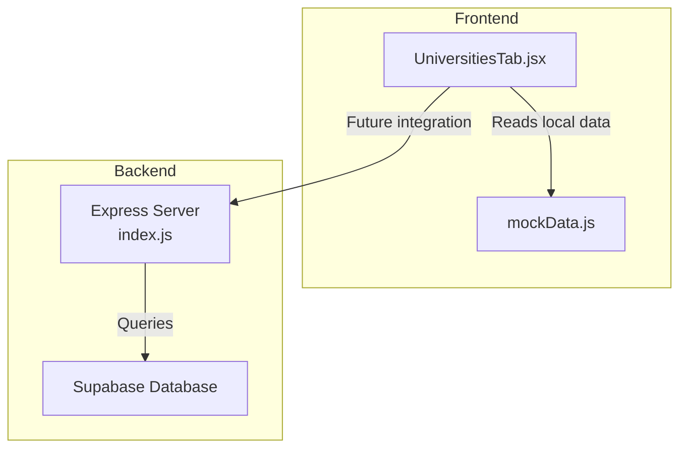
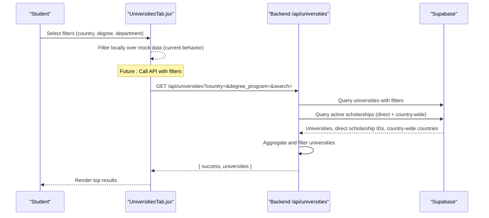
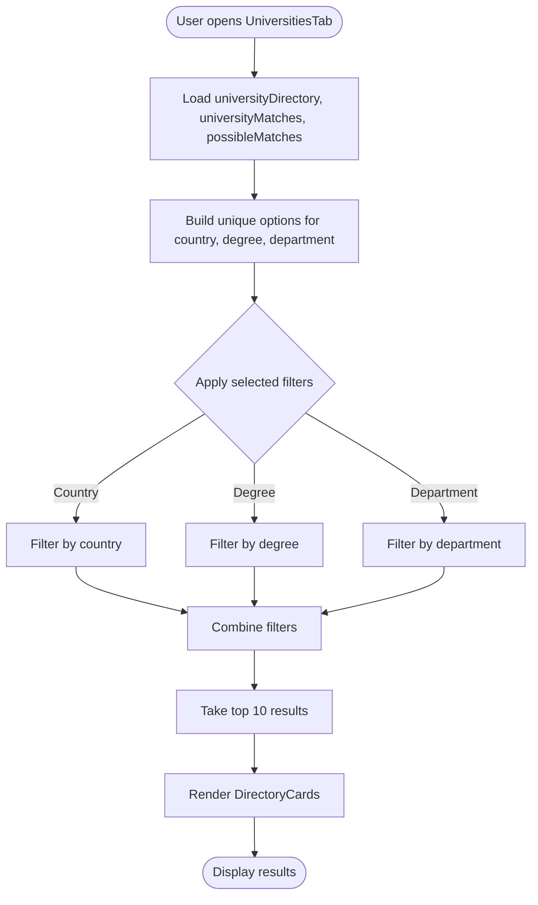
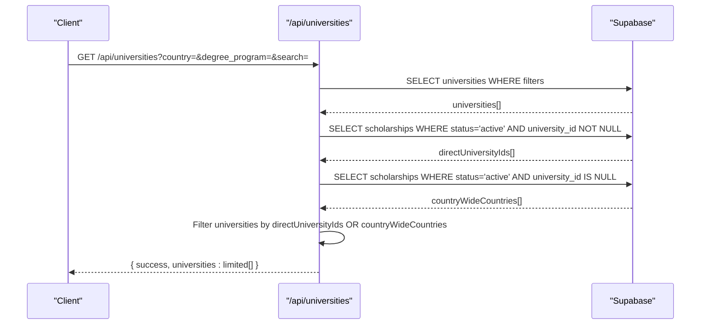
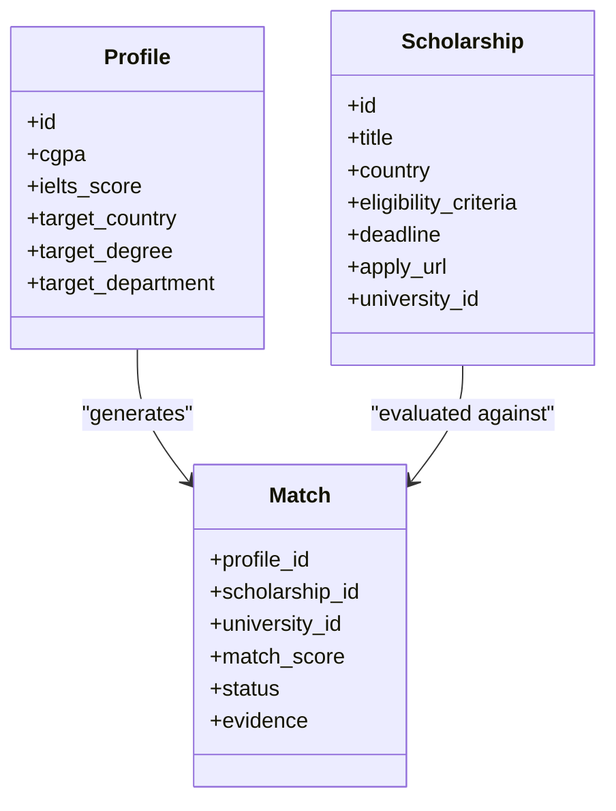
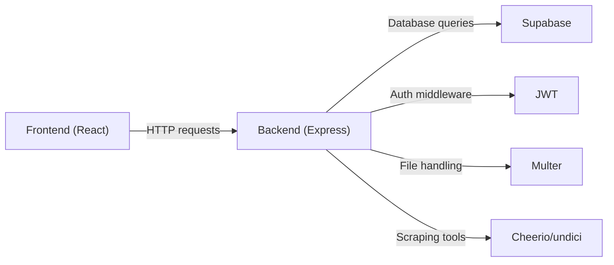

# University Discovery & Search

<cite>
**Referenced Files in This Document**
- [UniversitiesTab.jsx](file://scholarpath-frontend (2)/scholarpath/src/pages/UniversitiesTab.jsx)
- [mockData.js](file://scholarpath-frontend (2)/scholarpath/src/data/mockData.js)
- [index.js](file://aischolarpath-backend-main/aischolarpath-backend-main/index.js)
- [package.json (frontend)](file://scholarpath-frontend (2)/scholarpath/package.json)
- [package.json (backend)](file://aischolarpath-backend-main/aischolarpath-backend-main/package.json)
</cite>

## Table of Contents
1. [Introduction](#introduction)
2. [Project Structure](#project-structure)
3. [Core Components](#core-components)
4. [Architecture Overview](#architecture-overview)
5. [Detailed Component Analysis](#detailed-component-analysis)
6. [Dependency Analysis](#dependency-analysis)
7. [Performance Considerations](#performance-considerations)
8. [Troubleshooting Guide](#troubleshooting-guide)
9. [Conclusion](#conclusion)

## Introduction
This document explains the university discovery and search functionality in ScholarPathAI. It covers:
- The student-facing search interface that filters universities by country, degree programs, departments, and other parameters.
- The backend API endpoints for retrieving and filtering university data, including aggregation from multiple sources.
- Filtering mechanisms, sorting options, and result presentation in the UniversitiesTab component.
- Integration with the broader matching system that aligns universities to a student’s profile and goals.
- Data structures for university records, query processing, and caching strategies for performance.

## Project Structure
ScholarPathAI consists of:
- A React frontend that renders the UniversitiesTab with local filtering over static mock data and displays current and possible matches.
- An Express backend that exposes REST APIs, including /api/universities, which queries a Supabase database and aggregates results based on scholarships and countries.

**Diagram sources**
- [UniversitiesTab.jsx:1-163](file://scholarpath-frontend (2)/scholarpath/src/pages/UniversitiesTab.jsx#L1-L163)
- [mockData.js:1-349](file://scholarpath-frontend (2)/scholarpath/src/data/mockData.js#L1-L349)
- [index.js:224-288](file://aischolarpath-backend-main/aischolarpath-backend-main/index.js#L224-L288)

**Section sources**
- [UniversitiesTab.jsx:1-163](file://scholarpath-frontend (2)/scholarpath/src/pages/UniversitiesTab.jsx#L1-L163)
- [mockData.js:1-349](file://scholarpath-frontend (2)/scholarpath/src/data/mockData.js#L1-L349)
- [index.js:1-1599](file://aischolarpath-backend-main/aischolarpath-backend-main/index.js#L1-L1599)

## Core Components
- UniversitiesTab: Renders the university directory, filter controls, and match sections using local data. It supports filtering by country, degree, and department, and shows top results.
- Mock Data Layer: Provides static datasets for university directory, current matches, and possible matches used by the UI.
- Backend API (/api/universities): Retrieves universities from the database, applies filters (country, degree_program, search), and aggregates eligibility via active scholarships (direct or country-wide).

Key responsibilities:
- Frontend: Local filtering, UI composition, and display of matches and directory entries.
- Backend: Querying, filtering, aggregation, and returning limited sets for performance.

**Section sources**
- [UniversitiesTab.jsx:73-163](file://scholarpath-frontend (2)/scholarpath/src/pages/UniversitiesTab.jsx#L73-L163)
- [mockData.js:43-133](file://scholarpath-frontend (2)/scholarpath/src/data/mockData.js#L43-L133)
- [index.js:224-288](file://aischolarpath-backend-main/aischolarpath-backend-main/index.js#L224-L288)

## Architecture Overview
The discovery flow currently uses local filtering in the frontend while the backend provides a robust API for future integration. When integrated, the frontend will call /api/universities to fetch filtered and aggregated university data.

**Diagram sources**
- [UniversitiesTab.jsx:73-163](file://scholarpath-frontend (2)/scholarpath/src/pages/UniversitiesTab.jsx#L73-L163)
- [index.js:224-288](file://aischolarpath-backend-main/aischolarpath-backend-main/index.js#L224-L288)

## Detailed Component Analysis

### UniversitiesTab Component
- Filters: Country, Degree, Department dropdowns derived from the static directory.
- Filtering logic: Client-side filtering using array methods; limits displayed results to top 10.
- Presentation:
  - Directory cards show name, country, degrees, departments, and official portal link.
  - Current Matches section shows universities the student qualifies for now.
  - Possible Matches section highlights universities within reach and lists missing requirements to improve fit.

**Diagram sources**
- [UniversitiesTab.jsx:73-163](file://scholarpath-frontend (2)/scholarpath/src/pages/UniversitiesTab.jsx#L73-L163)

**Section sources**
- [UniversitiesTab.jsx:73-163](file://scholarpath-frontend (2)/scholarpath/src/pages/UniversitiesTab.jsx#L73-L163)

### Backend API: /api/universities
- Query parameters:
  - country: exact match on university country.
  - degree_program: checks if the university offers the specified program via an array field.
  - search: case-insensitive substring match on university name.
- Aggregation:
  - Fetches active scholarships linked directly to universities.
  - Fetches country-wide scholarships where university_id is null.
  - Filters universities to include only those with either a direct scholarship or a country-wide scholarship covering their country.
- Result limit: Returns up to 10 universities for performance.

**Diagram sources**
- [index.js:224-288](file://aischolarpath-backend-main/aischolarpath-backend-main/index.js#L224-L288)

**Section sources**
- [index.js:224-288](file://aischolarpath-backend-main/aischolarpath-backend-main/index.js#L224-L288)

### Matching System Integration
- Profile-based matching computes eligibility against scholarships and stores results in a matches table with scores and evidence.
- Related endpoints:
  - POST /api/profile/:id/match-scholarships: Runs matching logic and persists results.
  - GET /api/profile/:id/matches: Retrieves stored matches sorted by score.
  - GET /api/profile/:id/overview: Provides summary stats and top recommendations.
- Integration points for university discovery:
  - Use matches to highlight “Current Matches” and “Possible Matches.”
  - Use overview to inform students about eligible vs. missing requirements.
  - Use roadmap endpoint to guide preparation toward nearest deadlines.

**Diagram sources**
- [index.js:575-692](file://aischolarpath-backend-main/aischolarpath-backend-main/index.js#L575-L692)
- [index.js:694-749](file://aischolarpath-backend-main/aischolarpath-backend-main/index.js#L694-L749)

**Section sources**
- [index.js:575-692](file://aischolarpath-backend-main/aischolarpath-backend-main/index.js#L575-L692)
- [index.js:694-749](file://aischolarpath-backend-main/aischolarpath-backend-main/index.js#L694-L749)

### Data Structures
- University record fields used by the backend:
  - id, name, country, degree_programs (array), website (implied by usage elsewhere).
- Scholarship fields used for aggregation:
  - id, title, country, eligibility_criteria, deadline, apply_url, university_id, status.
- Match record fields:
  - profile_id, scholarship_id, university_id, match_score, status, evidence.

These structures enable filtering, aggregation, and personalized matching across the system.

**Section sources**
- [index.js:224-288](file://aischolarpath-backend-main/aischolarpath-backend-main/index.js#L224-L288)
- [index.js:575-692](file://aischolarpath-backend-main/aischolarpath-backend-main/index.js#L575-L692)

### Search Query Processing
- Frontend:
  - Builds unique filter options from static data.
  - Applies client-side filters and slices top results.
- Backend:
  - Applies server-side filters on country, degree_program, and name search.
  - Aggregates eligibility via active scholarships (direct and country-wide).
  - Limits results to improve response time.

**Section sources**
- [UniversitiesTab.jsx:73-163](file://scholarpath-frontend (2)/scholarpath/src/pages/UniversitiesTab.jsx#L73-L163)
- [index.js:224-288](file://aischolarpath-backend-main/aischolarpath-backend-main/index.js#L224-L288)

### Result Presentation
- Directory cards: Show university name, country, degrees, departments, and official portal link.
- Current matches: Display fit percentage and program alignment.
- Possible matches: Highlight gaps and actionable steps to improve fit.

**Section sources**
- [UniversitiesTab.jsx:8-71](file://scholarpath-frontend (2)/scholarpath/src/pages/UniversitiesTab.jsx#L8-L71)
- [mockData.js:43-133](file://scholarpath-frontend (2)/scholarpath/src/data/mockData.js#L43-L133)

## Dependency Analysis
- Frontend dependencies:
  - React, React Router DOM for routing and UI rendering.
  - Tailwind CSS for styling (configured via tailwind.config.js).
- Backend dependencies:
  - Express for HTTP server.
  - Supabase client for database operations.
  - JWT for authentication middleware.
  - Multer for file uploads.
  - Cheerio and undici for scraping utilities (used in discovery features).

**Diagram sources**
- [package.json (frontend):1-28](file://scholarpath-frontend (2)/scholarpath/package.json#L1-L28)
- [package.json (backend):1-14](file://aischolarpath-backend-main/aischolarpath-backend-main/package.json#L1-L14)
- [index.js:1-48](file://aischolarpath-backend-main/aischolarpath-backend-main/index.js#L1-L48)

**Section sources**
- [package.json (frontend):1-28](file://scholarpath-frontend (2)/scholarpath/package.json#L1-L28)
- [package.json (backend):1-14](file://aischolarpath-backend-main/aischolarpath-backend-main/package.json#L1-L14)
- [index.js:1-48](file://aischolarpath-backend-main/aischolarpath-backend-main/index.js#L1-L48)

## Performance Considerations
- Frontend:
  - Uses useMemo to compute unique filter options efficiently.
  - Slices results to top 10 to reduce rendering load.
- Backend:
  - Limits results to 10 universities per request.
  - Performs targeted queries for scholarships and aggregates in-memory for filtering.
- Caching strategy:
  - No explicit caching layer is implemented in the current codebase.
  - Recommendations:
    - Add Redis or in-memory cache for frequent /api/universities queries with common filters.
    - Cache computed match results per profile to avoid recomputation.
    - Implement pagination for large result sets beyond top 10.

[No sources needed since this section provides general guidance]

## Troubleshooting Guide
- Authentication errors:
  - Ensure valid JWT token is provided for protected routes.
  - Verify environment variables (SUPABASE_URL, SUPABASE_KEY, JWT_SECRET) are set.
- Database connectivity:
  - Test connection via /api/test-db to confirm Supabase access.
- Filtering issues:
  - Confirm query parameters match expected names (country, degree_program, search).
  - Validate that universities have correct degree_programs arrays and statuses.
- Scraping and discovery:
  - Check user-agent headers and selectors when using discovery endpoints.
  - Review logs via /api/discovery/logs for failed scrapes.

**Section sources**
- [index.js:32-48](file://aischolarpath-backend-main/aischolarpath-backend-main/index.js#L32-L48)
- [index.js:61-68](file://aischolarpath-backend-main/aischolarpath-backend-main/index.js#L61-L68)
- [index.js:1183-1257](file://aischolarpath-backend-main/aischolarpath-backend-main/index.js#L1183-L1257)

## Conclusion
ScholarPathAI’s university discovery combines a responsive frontend with a powerful backend API. The UniversitiesTab provides immediate filtering and insights into current and possible matches, while the backend’s /api/universities endpoint enables scalable, aggregated retrieval of universities aligned with active scholarships. Integration with the matching system personalizes results based on student profiles, and future enhancements can introduce caching and pagination for improved performance at scale.