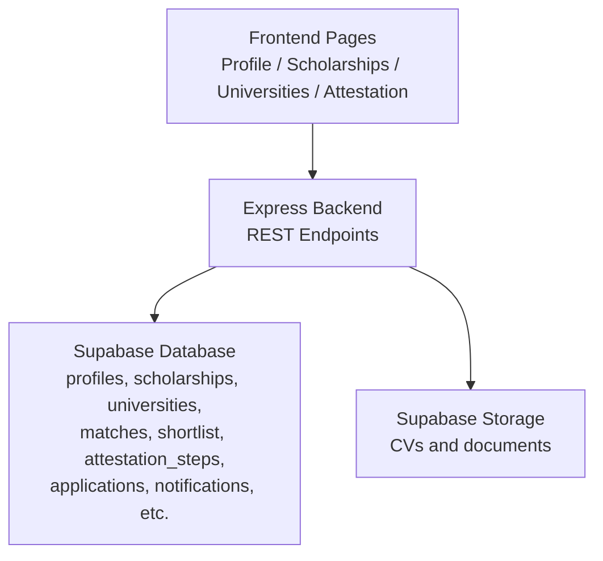
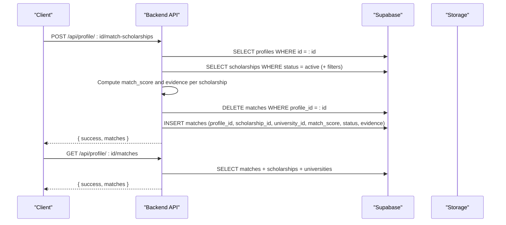
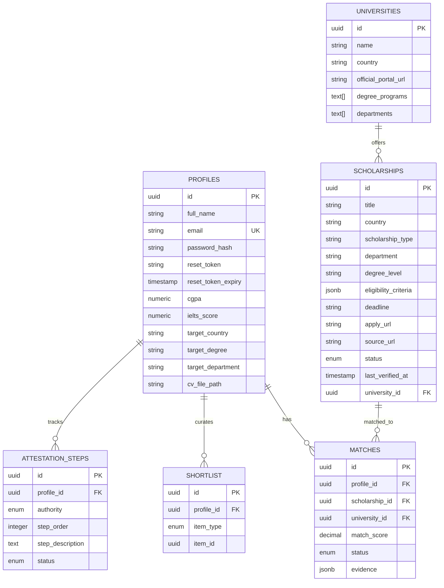

# Data Models

<cite>
**Referenced Files in This Document**
- [index.js](file://aischolarpath-backend-main/aischolarpath-backend-main/index.js)
- [mockData.js](file://scholarpath-frontend (2)/scholarpath/src/data/mockData.js)
- [ProfileTab.jsx](file://scholarpath-frontend (2)/scholarpath/src/pages/ProfileTab.jsx)
- [ScholarshipsTab.jsx](file://scholarpath-frontend (2)/scholarpath/src/pages/ScholarshipsTab.jsx)
- [UniversitiesTab.jsx](file://scholarpath-frontend (2)/scholarpath/src/pages/UniversitiesTab.jsx)
- [AttestationTab.jsx](file://scholarpath-frontend (2)/scholarpath/src/pages/AttestationTab.jsx)
</cite>

## Table of Contents
1. Introduction
2. Project Structure
3. Core Components
4. Architecture Overview
5. Detailed Component Analysis
6. Dependency Analysis
7. Performance Considerations
8. Troubleshooting Guide
9. Conclusion
10. Appendices

## Introduction
This document describes the data models powering ScholarPathAI’s matching, discovery, and application tracking features. It focuses on the core tables inferred from the backend API usage: profiles, scholarships, universities, matches, shortlist, and attestation_steps. For each model, we provide field definitions, types, constraints, indexing strategies, entity relationships, validation rules, and business logic derived from the codebase. We also include sample structures based on frontend mock data to illustrate expected shapes.

## Project Structure
The system consists of:
- A Node.js Express backend that exposes REST APIs and interacts with a Supabase database.
- A React frontend that consumes these APIs and uses static mock data for demonstration.

**Diagram sources**
- [index.js:50-68](file://aischolarpath-backend-main/aischolarpath-backend-main/index.js#L50-L68)
- [index.js:112-145](file://aischolarpath-backend-main/aischolarpath-backend-main/index.js#L112-L145)

**Section sources**
- [index.js:1-68](file://aischolarpath-backend-main/aischolarpath-backend-main/index.js#L1-L68)

## Core Components
This section outlines the primary entities and their roles:
- Profiles: User identity and academic preferences used for matching.
- Scholarships: Funding opportunities with eligibility criteria, deadlines, and source attribution.
- Universities: Institutions with location, programs, and admission requirements.
- Matches: Relationship records between profiles and scholarships with scoring and evidence.
- Shortlist: User-curated preference lists for scholarships or universities.
- Attestation Steps: Tracking of document verification progress per authority.

**Section sources**
- [index.js:69-110](file://aischolarpath-backend-main/aischolarpath-backend-main/index.js#L69-L110)
- [index.js:189-222](file://aischolarpath-backend-main/aischolarpath-backend-main/index.js#L189-L222)
- [index.js:223-288](file://aischolarpath-backend-main/aischolarpath-backend-main/index.js#L223-L288)
- [index.js:574-692](file://aischolarpath-backend-main/aischolarpath-backend-main/index.js#L574-L692)
- [index.js:750-820](file://aischolarpath-backend-main/aischolarpath-backend-main/index.js#L750-L820)
- [index.js:437-517](file://aischolarpath-backend-main/aischolarpath-backend-main/index.js#L437-L517)

## Architecture Overview
The matching engine computes eligibility by comparing profile attributes against scholarship eligibility criteria and stores results as match records with scores and evidence. Users can curate shortlists and track applications and attestations.

**Diagram sources**
- [index.js:574-692](file://aischolarpath-backend-main/aischolarpath-backend-main/index.js#L574-L692)

## Detailed Component Analysis

### Profiles
Purpose: Stores user identity and academic details used for matching and personalization.

Fields inferred from API usage:
- id: Primary key (UUID), unique identifier for the profile.
- full_name: String; user’s full name.
- email: String; unique login email.
- password_hash: String; hashed password for authentication.
- reset_token: String; optional token for password reset.
- reset_token_expiry: Timestamp; optional expiry for reset token.
- cgpa: Numeric; cumulative grade point average.
- ielts_score: Numeric; IELTS band score.
- target_country: String; preferred destination country.
- target_degree: String; desired degree level (e.g., Bachelor’s, Master’s, PhD).
- target_department: String; desired department or field of study.
- cv_file_path: String; path to uploaded CV stored in Supabase storage.

Constraints and validation:
- Authentication endpoints require email and password; passwords are hashed before storage.
- Profile updates are restricted to the authenticated owner via JWT middleware.
- CV upload requires a file and updates cv_file_path upon successful storage.

Indexing strategy:
- Unique index on email for fast lookups during login and password reset.
- Index on id for profile retrieval and authorization checks.
- Optional indexes on cgpa, ielts_score, target_country, target_degree, target_department to support filtering and matching queries.

Sample structure (conceptual):
- id: UUID
- full_name: string
- email: string
- password_hash: string
- reset_token: string | null
- reset_token_expiry: timestamp | null
- cgpa: number | null
- ielts_score: number | null
- target_country: string | null
- target_degree: string | null
- target_department: string | null
- cv_file_path: string | null

Business logic:
- Matching uses cgpa, ielts_score, target_degree, and target_country to evaluate eligibility against scholarship criteria.
- Language prep guidance compares current ielts_score against highest required score among matches.

**Section sources**
- [index.js:69-110](file://aischolarpath-backend-main/aischolarpath-backend-main/index.js#L69-L110)
- [index.js:518-573](file://aischolarpath-backend-main/aischolarpath-backend-main/index.js#L518-L573)
- [index.js:112-145](file://aischolarpath-backend-main/aischolarpath-backend-main/index.js#L112-L145)
- [index.js:355-402](file://aischolarpath-backend-main/aischolarpath-backend-main/index.js#L355-L402)

### Scholarships
Purpose: Catalogs funding opportunities with eligibility criteria, deadlines, and source attribution.

Fields inferred from API usage:
- id: Primary key (UUID).
- title: String; scholarship name.
- country: String; country offering the scholarship.
- scholarship_type: String; e.g., University-funded, Government-funded.
- department: String; relevant department or field.
- degree_level: String; applicable degree level.
- eligibility_criteria: JSON object; includes min_cgpa, min_ielts, required_degree.
- deadline: String or date; application deadline.
- apply_url: String; official application link.
- source_url: String; origin URL for scraping or manual entry.
- status: Enum; active, under_review, etc.
- last_verified_at: Timestamp; last verification time.
- university_id: Nullable FK; links to a specific university if applicable.

Constraints and validation:
- Filtering supports country, scholarship_type, department, degree_level.
- Status controls visibility; only active scholarships are considered in matching unless otherwise specified.
- Scraping endpoints upsert scholarships with extracted fields and set status to under_review until approved.

Indexing strategy:
- Index on country, scholarship_type, department, degree_level for efficient filtering.
- Index on status to filter active scholarships quickly.
- Index on university_id for joins when listing universities with direct scholarships.
- Composite index on (title, country) for upsert conflict resolution.

Sample structure (conceptual):
- id: UUID
- title: string
- country: string
- scholarship_type: string
- department: string
- degree_level: string
- eligibility_criteria: jsonb
- deadline: string | date
- apply_url: string
- source_url: string
- status: enum
- last_verified_at: timestamp
- university_id: UUID | null

Business logic:
- Eligibility is evaluated per criterion (CGPA, IELTS, required degree).
- Approval workflow transitions from under_review to active after manual verification.

**Section sources**
- [index.js:189-222](file://aischolarpath-backend-main/aischolarpath-backend-main/index.js#L189-L222)
- [index.js:1310-1439](file://aischolarpath-backend-main/aischolarpath-backend-main/index.js#L1310-L1439)
- [index.js:1494-1526](file://aischolarpath-backend-main/aischolarpath-backend-main/index.js#L1494-L1526)

### Universities
Purpose: Represents institutions with location, program offerings, and admission requirements.

Fields inferred from API usage:
- id: Primary key (UUID).
- name: String; institution name.
- country: String; country location.
- official_portal_url: String; official website link.
- degree_programs: Array; list of offered degrees.
- departments: Array; list of departments or fields.

Constraints and validation:
- Queries support filtering by country, degree_program (array contains), and search by name.
- Some scholarships may be country-wide (university_id null), affecting university inclusion in listings.

Indexing strategy:
- Index on country for filtering.
- Index on name for search.
- GIN index on degree_programs and departments arrays for efficient containment queries.

Sample structure (conceptual):
- id: UUID
- name: string
- country: string
- official_portal_url: string
- degree_programs: text[]
- departments: text[]

Business logic:
- Universities appear in listings if they have direct scholarships or if country-wide scholarships exist for their country.

**Section sources**
- [index.js:223-288](file://aischolarpath-backend-main/aischolarpath-backend-main/index.js#L223-L288)

### Matches
Purpose: Stores relationship data between profiles and scholarships with scoring algorithms and evidence reporting.

Fields inferred from API usage:
- id: Primary key (UUID).
- profile_id: FK to profiles.
- scholarship_id: FK to scholarships.
- university_id: FK to universities (nullable).
- match_score: Numeric; percentage score computed from passed criteria.
- status: Enum; Eligible, Missing Requirements, Not Eligible.
- evidence: JSON array; per-criterion evaluation with criterion, required, actual, result.

Constraints and validation:
- Match computation enforces strict comparisons for CGPA, IELTS, and required degree.
- Old matches for a profile are cleared before inserting fresh results to ensure consistency.

Indexing strategy:
- Index on profile_id for quick retrieval of matches per user.
- Index on match_score for ranking top recommendations.
- Index on status for filtering eligible vs missing vs not eligible.

Scoring algorithm:
- For each scholarship, build evidence entries for each defined criterion.
- Count pass results and compute match_score as (pass_count / total_criteria) * 100.
- Determine status:
  - If any criterion fails → Not Eligible.
  - Else if any criterion is missing → Missing Requirements.
  - Else → Eligible.

Sample structure (conceptual):
- id: UUID
- profile_id: UUID
- scholarship_id: UUID
- university_id: UUID | null
- match_score: decimal
- status: enum
- evidence: jsonb

**Section sources**
- [index.js:574-692](file://aischolarpath-backend-main/aischolarpath-backend-main/index.js#L574-L692)

### Shortlist
Purpose: User-curated preference lists for scholarships or universities.

Fields inferred from API usage:
- id: Primary key (UUID).
- profile_id: FK to profiles.
- item_type: Enum; scholarship or university.
- item_id: ID of the referenced scholarship or university.

Constraints and validation:
- item_type must be one of allowed values.
- Authorization enforced per profile.

Indexing strategy:
- Index on profile_id for retrieving a user’s shortlist.
- Composite index on (item_type, item_id) for uniqueness enforcement if needed.

Sample structure (conceptual):
- id: UUID
- profile_id: UUID
- item_type: enum
- item_id: UUID

**Section sources**
- [index.js:750-820](file://aischolarpath-backend-main/aischolarpath-backend-main/index.js#L750-L820)

### Attestation Steps
Purpose: Tracks document verification progress per authority with step-by-step status.

Fields inferred from API usage:
- id: Primary key (UUID).
- profile_id: FK to profiles.
- authority: Enum; HEC, IBCC, MOFA.
- step_order: Integer; sequence order of steps.
- step_description: String; description of the step.
- status: Enum; pending, done.

Constraints and validation:
- Initialization creates ordered steps for a given authority.
- Completion marks individual steps as done with authorization checks.

Indexing strategy:
- Index on profile_id for retrieving all steps for a user.
- Index on authority and step_order for ordering and grouping.

Sample structure (conceptual):
- id: UUID
- profile_id: UUID
- authority: enum
- step_order: integer
- step_description: text
- status: enum

**Section sources**
- [index.js:437-517](file://aischolarpath-backend-main/aischolarpath-backend-main/index.js#L437-L517)

## Dependency Analysis
Relationships between core entities:
- profiles 1—N matches
- scholarships 1—N matches
- universities 1—N scholarships (optional; some scholarships are country-wide)
- profiles 1—N shortlist items
- profiles 1—N attestation_steps

**Diagram sources**
- [index.js:574-692](file://aischolarpath-backend-main/aischolarpath-backend-main/index.js#L574-L692)
- [index.js:750-820](file://aischolarpath-backend-main/aischolarpath-backend-main/index.js#L750-L820)
- [index.js:437-517](file://aischolarpath-backend-main/aischolarpath-backend-main/index.js#L437-L517)
- [index.js:223-288](file://aischolarpath-backend-main/aischolarpath-backend-main/index.js#L223-L288)

**Section sources**
- [index.js:574-692](file://aischolarpath-backend-main/aischolarpath-backend-main/index.js#L574-L692)
- [index.js:750-820](file://aischolarpath-backend-main/aischolarpath-backend-main/index.js#L750-L820)
- [index.js:437-517](file://aischolarpath-backend-main/aischolarpath-backend-main/index.js#L437-L517)
- [index.js:223-288](file://aischolarpath-backend-main/aischolarpath-backend-main/index.js#L223-L288)

## Performance Considerations
- Use indexes on frequently filtered columns (country, status, department, degree_level) to optimize query performance.
- Leverage array containment indexes (GIN) for degree_programs and departments to speed up filtering.
- Clear and reinsert matches per profile to avoid stale data and maintain consistent scoring.
- Batch operations where possible (e.g., bulk scraping with delays) to respect rate limits and reduce server load.

[No sources needed since this section provides general guidance]

## Troubleshooting Guide
Common issues and resolutions:
- Authentication failures: Ensure JWT_SECRET is configured and tokens are valid; verify middleware execution.
- Database connectivity: Use health/test routes to validate Supabase connection and table access.
- File uploads: Confirm storage bucket configuration and permissions; check content type handling.
- Matching discrepancies: Validate eligibility_criteria in scholarships and profile fields; review evidence logs.
- Attestation steps: Verify initialization per authority and correct step ordering; confirm authorization checks.

**Section sources**
- [index.js:57-68](file://aischolarpath-backend-main/aischolarpath-backend-main/index.js#L57-L68)
- [index.js:112-145](file://aischolarpath-backend-main/aischolarpath-backend-main/index.js#L112-L145)
- [index.js:437-517](file://aischolarpath-backend-main/aischolarpath-backend-main/index.js#L437-L517)

## Conclusion
The ScholarPathAI data model centers around profiles, scholarships, universities, matches, shortlist, and attestation steps. The matching engine evaluates eligibility using structured criteria and produces actionable insights through scores and evidence. Robust indexing and validation ensure performance and integrity across the system.

[No sources needed since this section summarizes without analyzing specific files]

## Appendices

### Sample Data Structures (from Frontend Mock Data)
These structures illustrate expected shapes for UI components and demonstrate how data flows into the system.

- Student profile snapshot:
  - name: string
  - profileStrength: number
  - missingBoosts: array of objects with id, label, gain

- Required documents:
  - id: string
  - label: string
  - status: enum (submitted, pending, missing)
  - fileName: string | null

- University matches:
  - id: number
  - name: string
  - country: string
  - fit: number
  - program: string
  - website: string

- Possible matches:
  - id: number
  - name: string
  - country: string
  - fit: number
  - program: string
  - website: string
  - missing: array of strings

- Scholarship entries:
  - id: number
  - name: string
  - amount: string
  - amountValue: number
  - deadline: string
  - matchedTo: string
  - country: string
  - type: string
  - degree: string
  - department: string
  - applyLink: string

- Attestation options:
  - id: string
  - name: string
  - fullName: string
  - forDocuments: string
  - steps: array of strings
  - officialLink: string

**Section sources**
- [mockData.js:15-41](file://scholarpath-frontend (2)/scholarpath/src/data/mockData.js#L15-L41)
- [mockData.js:43-117](file://scholarpath-frontend (2)/scholarpath/src/data/mockData.js#L43-L117)
- [mockData.js:121-133](file://scholarpath-frontend (2)/scholarpath/src/data/mockData.js#L121-L133)
- [mockData.js:135-254](file://scholarpath-frontend (2)/scholarpath/src/data/mockData.js#L135-L254)
- [mockData.js:256-309](file://scholarpath-frontend (2)/scholarpath/src/data/mockData.js#L256-L309)