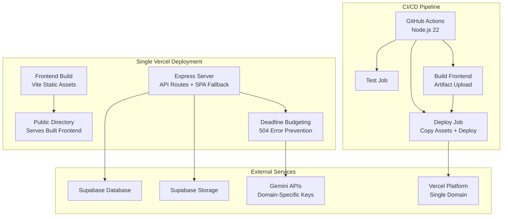
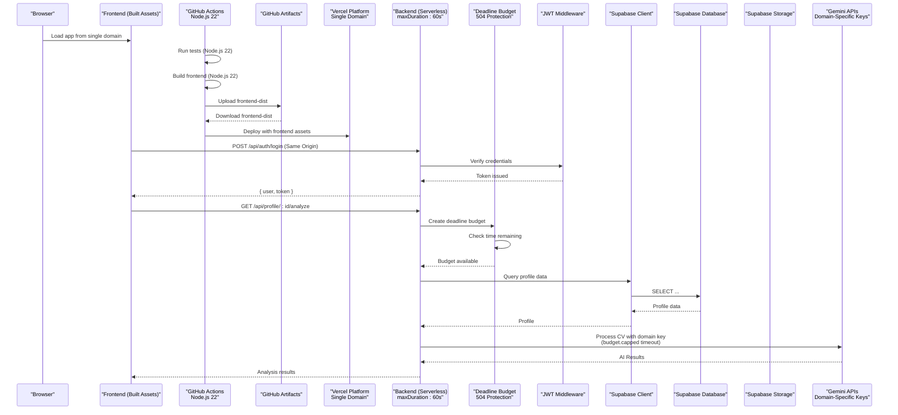
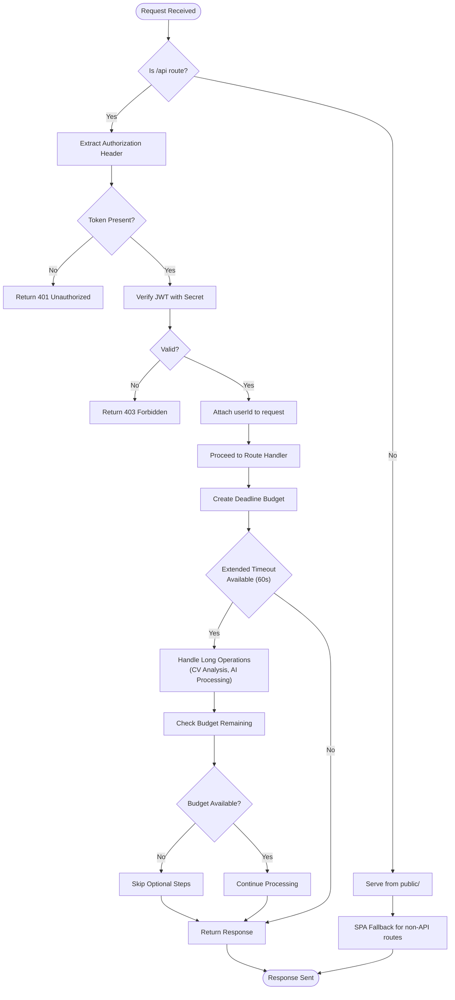
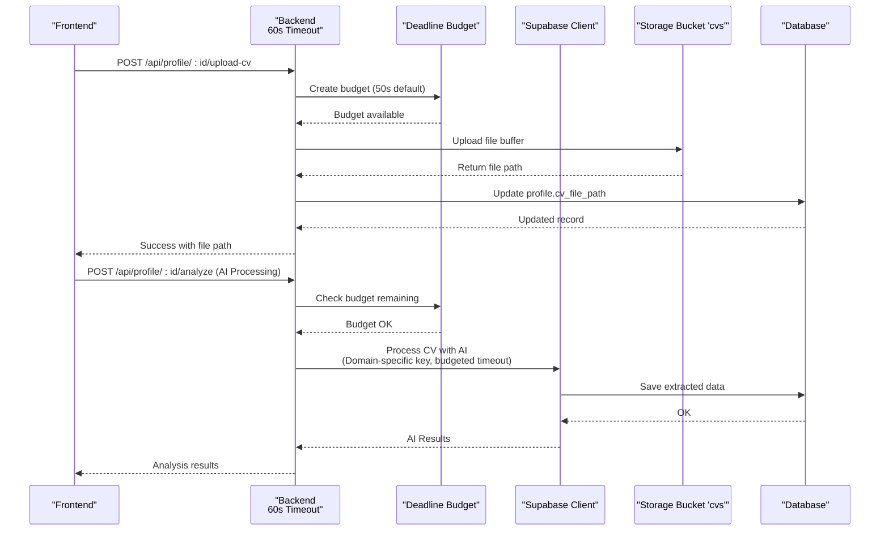
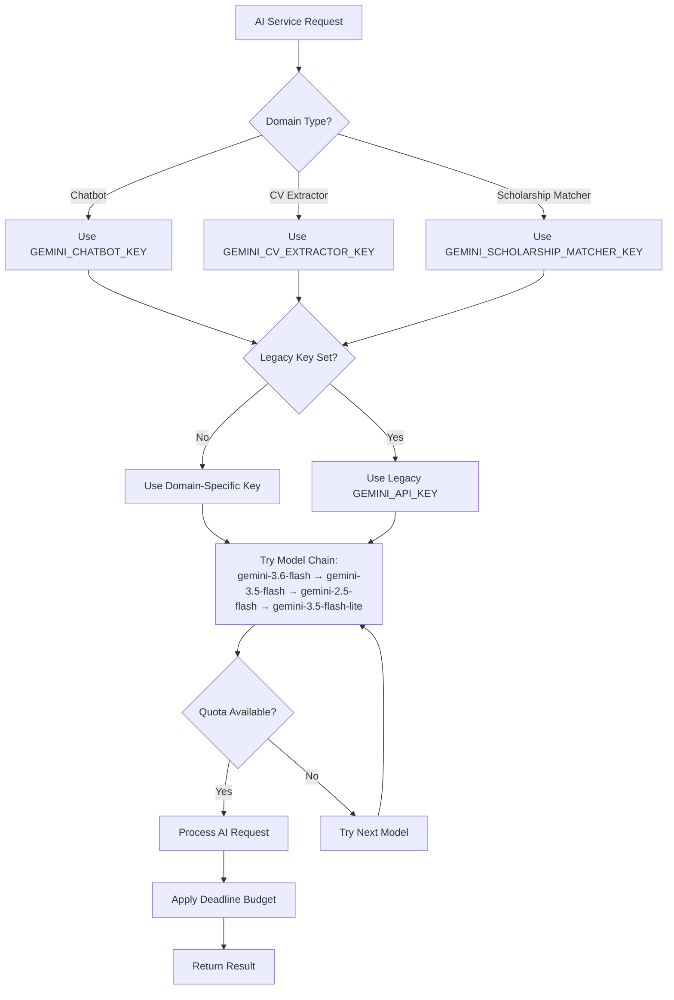
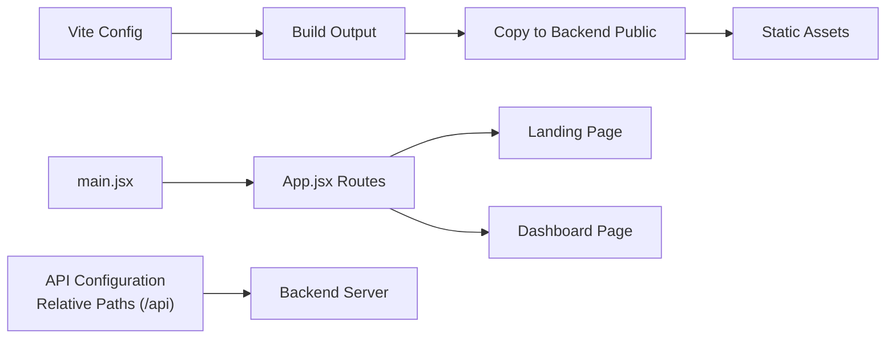
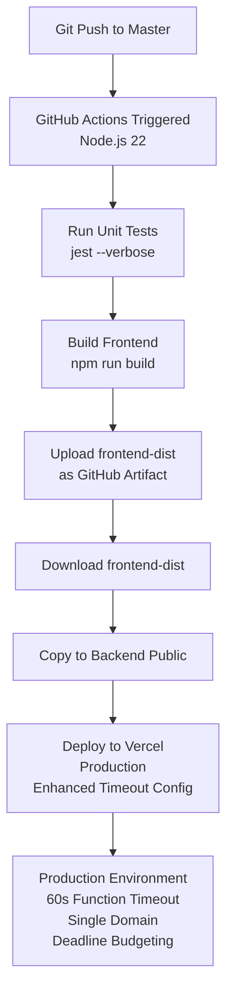
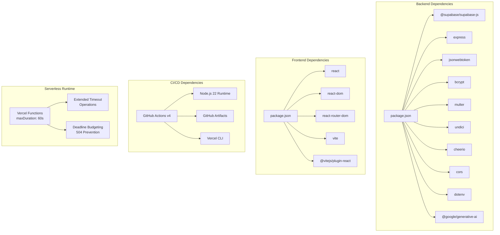

# Deployment Guide

<cite>
**Referenced Files in This Document**
- [ci-cd.yml](file://.github/workflows/ci-cd.yml)
- [package.json](file://aischolarpath-backend-main/aischolarpath-backend-main/package.json)
- [package.json](file://scholarpath-frontend (2)/scholarpath/package.json)
- [vercel.json](file://aischolarpath-backend-main/aischolarpath-backend-main/vercel.json)
- [vercel.json](file://scholarpath-frontend (2)/scholarpath/vercel.json)
- [api/index.js](file://aischolarpath-backend-main/aischolarpath-backend-main/api/index.js)
- [index.js](file://aischolarpath-backend-main/aischolarpath-backend-main/index.js)
- [matching-engine.test.js](file://aischolarpath-backend-main/aischolarpath-backend-main/__tests__/matching-engine.test.js)
- [validation.test.js](file://aischolarpath-backend-main/aischolarpath-backend-main/__tests__/validation.test.js)
- [api.js](file://scholarpath-frontend (2)/scholarpath/src/api.js)
- [App.jsx](file://scholarpath-frontend (2)/scholarpath/src/App.jsx)
- [config/ai.js](file://aischolarpath-backend-main/aischolarpath-backend-main/config/ai.js)
- [config/env.js](file://aischolarpath-backend-main/aischolarpath-backend-main/config/env.js)
- [utils/budget.js](file://aischolarpath-backend-main/aischolarpath-backend-main/utils/budget.js)
- [services/ai.service.js](file://aischolarpath-backend-main/aischolarpath-backend-main/services/ai.service.js)
- [controllers/profile.controller.js](file://aischolarpath-backend-main/aischolarpath-backend-main/controllers/profile.controller.js)
- [controllers/discovery.controller.js](file://aischolarpath-backend-main/aischolarpath-backend-main/controllers/discovery.controller.js)
</cite>

## Update Summary
**Changes Made**
- Updated Gemini API key configuration from single key to domain-specific keys for enhanced quota management
- Added comprehensive deadline budgeting system to prevent Vercel 504 errors during long-running operations
- Enhanced environment variable documentation with new serverless timeout configuration options
- Updated AI service integration with per-domain key isolation and model fallback chains
- Added detailed guidance for configuring multiple Gemini API keys for different application domains

## Table of Contents
1. Introduction
2. Project Structure
3. Core Components
4. Architecture Overview
5. Detailed Component Analysis
6. Dependency Analysis
7. Performance Considerations
8. Troubleshooting Guide
9. Conclusion
10. Appendices

## Introduction
This guide provides production deployment instructions for ScholarPathAI using a **unified single-domain deployment architecture**. The system consolidates both frontend and backend components into a single Vercel deployment, eliminating CORS issues and simplifying environment management. The frontend is built as static assets and served from the backend's public directory, while all API endpoints are handled by Express serverless functions. **Updated** to reflect the new single Vercel deployment approach with enhanced CI/CD pipeline using Node.js 22, artifact-based deployment, automated build processes, and advanced deadline budgeting for preventing 504 errors during long-running AI operations.

## Project Structure
The repository contains two main parts that are now deployed together:
- Backend: An Express.js API that authenticates users, manages profiles, scholarships, universities, shortlists, notifications, and integrates with Supabase for database and storage.
- Frontend: A React + Vite application that builds static assets served from the backend's public directory.

**Diagram sources**
- [index.js:95-96](file://aischolarpath-backend-main/aischolarpath-backend-main/index.js#L95-L96)
- [index.js:3001-3005](file://aischolarpath-backend-main/aischolarpath-backend-main/index.js#L3001-L3005)
- [ci-cd.yml:32-92](file://.github/workflows/ci-cd.yml#L32-L92)
- [utils/budget.js:1-35](file://aischolarpath-backend-main/aischolarpath-backend-main/utils/budget.js#L1-L35)

**Section sources**
- [index.js:95-96](file://aischolarpath-backend-main/aischolarpath-backend-main/index.js#L95-L96)
- [index.js:3001-3005](file://aischolarpath-backend-main/aischolarpath-backend-main/index.js#L3001-L3005)
- [package.json:1-31](file://aischolarpath-backend-main/aischolarpath-backend-main/package.json#L1-L31)
- [package.json:1-28](file://scholarpath-frontend (2)/scholarpath/package.json#L1-L28)

## Core Components
- **Unified Backend API (Express)**:
  - Environment validation at startup for required variables.
  - CORS enabled and JSON body parsing.
  - JWT-based authentication middleware protecting sensitive routes.
  - Supabase client initialized with URL and key for database and storage operations.
  - Health check endpoint for readiness probes.
  - **Updated** Serves built frontend assets from public directory with SPA fallback routing.
  - **Updated** Extended timeout support (60 seconds) for long-running operations like CV analysis and AI processing.
  - **Updated** Advanced deadline budgeting system prevents 504 errors by intelligently managing request timeouts.
- **Frontend (React + Vite)**:
  - Minimal Vite configuration using React plugin.
  - Routing to landing and dashboard pages.
  - Entry point rendering the app into the DOM.
  - **Updated** Configured to use relative API paths (`/api`) for seamless integration with backend.
  - **Updated** Built artifacts are automatically copied to backend's public directory during CI/CD.
- **AI Service Integration**:
  - **Updated** Domain-specific Gemini API key isolation for chatbot, CV extraction, and scholarship matching.
  - **Updated** Automatic model fallback chain when quotas are exhausted.
  - **Updated** Integrated deadline budgeting for reliable serverless execution.

Key responsibilities:
- Authentication and authorization via JWT.
- Data persistence and file uploads through Supabase.
- **Updated** Unified asset serving from single domain eliminating CORS complexity.
- **Updated** Automated CI/CD pipeline with Node.js 22, artifact-based deployment, streamlined workflow, enhanced serverless timeout configuration, and intelligent deadline budgeting.
- **Updated** Domain-isolated AI services with independent quota management and automatic fallback mechanisms.

**Section sources**
- [index.js:1-10](file://aischolarpath-backend-main/aischolarpath-backend-main/index.js#L1-L10)
- [index.js:95-96](file://aischolarpath-backend-main/aischolarpath-backend-main/index.js#L95-L96)
- [index.js:3001-3005](file://aischolarpath-backend-main/aischolarpath-backend-main/index.js#L3001-L3005)
- [config/ai.js:1-83](file://aischolarpath-backend-main/aischolarpath-backend-main/config/ai.js#L1-L83)
- [utils/budget.js:1-35](file://aischolarpath-backend-main/aischolarpath-backend-main/utils/budget.js#L1-L35)
- [api.js:1](file://scholarpath-frontend (2)/scholarpath/src/api.js#L1)

## Architecture Overview
The system follows a **unified single-domain architecture** with automated CI/CD and advanced timeout protection:
- The frontend builds static assets that are served directly from the backend's public directory.
- The backend exposes REST endpoints as Vercel serverless functions under /api/* with extended timeout support (60 seconds) for complex operations.
- All data is stored in Supabase; files are uploaded to Supabase Storage.
- **Updated** Single Vercel deployment eliminates CORS issues and simplifies environment management.
- **Updated** GitHub Actions automates testing, building frontend, copying assets to backend, and deploying everything to Vercel using Node.js 22.
- **Updated** Advanced deadline budgeting system ensures requests complete within serverless limits, preventing 504 errors.

**Diagram sources**
- [index.js:95-96](file://aischolarpath-backend-main/aischolarpath-backend-main/index.js#L95-L96)
- [index.js:3001-3005](file://aischolarpath-backend-main/aischolarpath-backend-main/index.js#L3001-L3005)
- [index.js:57-68](file://aischolarpath-backend-main/aischolarpath-backend-main/index.js#L57-L68)
- [ci-cd.yml:32-92](file://.github/workflows/ci-cd.yml#L32-L92)
- [vercel.json:3-7](file://aischolarpath-backend-main/aischolarpath-backend-main/vercel.json#L3-L7)
- [utils/budget.js:12-32](file://aischolarpath-backend-main/aischolarpath-backend-main/utils/budget.js#L12-L32)
- [config/ai.js:24-40](file://aischolarpath-backend-main/aischolarpath-backend-main/config/ai.js#L24-L40)

## Detailed Component Analysis

### Backend API: Unified Serving and Protected Routes
- Startup validates required environment variables and exits if missing.
- CORS and JSON parsing are applied globally.
- JWT middleware verifies tokens and attaches user context to requests.
- Protected routes enforce ownership checks before accessing resources.
- **Updated** Serves built frontend assets from public directory with SPA fallback routing.
- **Updated** Serverless-compatible port handling for Vercel deployment with extended timeout support for long-running operations.
- **Updated** Advanced deadline budgeting system integrated throughout request lifecycle to prevent 504 errors.

**Diagram sources**
- [index.js:95-96](file://aischolarpath-backend-main/aischolarpath-backend-main/index.js#L95-L96)
- [index.js:3001-3005](file://aischolarpath-backend-main/aischolarpath-backend-main/index.js#L3001-L3005)
- [index.js:32-47](file://aischolarpath-backend-main/aischolarpath-backend-main/index.js#L32-L47)
- [vercel.json:3-7](file://aischolarpath-backend-main/aischolarpath-backend-main/vercel.json#L3-L7)
- [utils/budget.js:12-32](file://aischolarpath-backend-main/aischolarpath-backend-main/utils/budget.js#L12-L32)

**Section sources**
- [index.js:1-10](file://aischolarpath-backend-main/aischolarpath-backend-main/index.js#L1-L10)
- [index.js:95-96](file://aischolarpath-backend-main/aischolarpath-backend-main/index.js#L95-L96)
- [index.js:3001-3005](file://aischolarpath-backend-main/aischolarpath-backend-main/index.js#L3001-L3005)
- [index.js:32-47](file://aischolarpath-backend-main/aischolarpath-backend-main/index.js#L32-L47)
- [utils/budget.js:1-35](file://aischolarpath-backend-main/aischolarpath-backend-main/utils/budget.js#L1-L35)

### Backend API: Supabase Integration
- Supabase client is created using environment variables for URL and key.
- Endpoints read/write to tables such as profiles, scholarships, universities, matches, shortlist, notifications, and attestation steps.
- File uploads use memory storage and write to the 'cvs' bucket, then update profile records.
- **Updated** Extended timeout support enables complex operations like CV analysis and AI processing without premature termination.
- **Updated** Deadline budgeting ensures responses are always returned before platform timeout.

**Diagram sources**
- [index.js:50-54](file://aischolarpath-backend-main/aischolarpath-backend-main/index.js#L50-L54)
- [index.js:112-145](file://aischolarpath-backend-main/aischolarpath-backend-main/index.js#L112-L145)
- [index.js:261-388](file://aischolarpath-backend-main/aischolarpath-backend-main/index.js#L261-L388)
- [vercel.json:3-7](file://aischolarpath-backend-main/aischolarpath-backend-main/vercel.json#L3-L7)
- [utils/budget.js:12-32](file://aischolarpath-backend-main/aischolarpath-backend-main/utils/budget.js#L12-L32)

**Section sources**
- [index.js:50-54](file://aischolarpath-backend-main/aischolarpath-backend-main/index.js#L50-L54)
- [index.js:112-145](file://aischolarpath-backend-main/aischolarpath-backend-main/index.js#L112-L145)
- [index.js:261-388](file://aischolarpath-backend-main/aischolarpath-backend-main/index.js#L261-L388)
- [utils/budget.js:1-35](file://aischolarpath-backend-main/aischolarpath-backend-main/utils/budget.js#L1-L35)

### AI Service Integration: Domain-Specific Key Management
- **Updated** Three distinct Gemini API keys for different application domains:
  - `GEMINI_CHATBOT_KEY` for chat functionality and letter generation
  - `GEMINI_CV_EXTRACTOR_KEY` for CV analysis and document processing  
  - `GEMINI_SCHOLARSHIP_MATCHER_KEY` for scholarship scraping and matching
- **Updated** Automatic fallback to legacy `GEMINI_API_KEY` when domain-specific keys are not configured
- **Updated** Model fallback chain for each domain to handle quota exhaustion gracefully
- **Updated** Integrated deadline budgeting to prevent serverless timeout issues

**Diagram sources**
- [config/ai.js:24-40](file://aischolarpath-backend-main/aischolarpath-backend-main/config/ai.js#L24-L40)
- [config/ai.js:49-75](file://aischolarpath-backend-main/aischolarpath-backend-main/config/ai.js#L49-L75)
- [config/env.js:28-32](file://aischolarpath-backend-main/aischolarpath-backend-main/config/env.js#L28-L32)

**Section sources**
- [config/ai.js:1-83](file://aischolarpath-backend-main/aischolarpath-backend-main/config/ai.js#L1-L83)
- [config/env.js:28-32](file://aischolarpath-backend-main/aischolarpath-backend-main/config/env.js#L28-L32)
- [services/ai.service.js:1-189](file://aischolarpath-backend-main/aischolarpath-backend-main/services/ai.service.js#L1-L189)

### Frontend: Build and Routing
- Vite uses the React plugin to compile and bundle the app.
- Routes define navigation between landing and dashboard views.
- The entry point mounts the root component into the DOM.
- **Updated** Configured to use relative API paths (`/api`) for seamless integration with backend deployment.
- **Updated** Built assets are automatically integrated into backend deployment through CI/CD pipeline.

**Diagram sources**
- [api.js:1](file://scholarpath-frontend (2)/scholarpath/src/api.js#L1)
- [App.jsx:11-22](file://scholarpath-frontend (2)/scholarpath/src/App.jsx#L11-L22)
- [ci-cd.yml:56-61](file://.github/workflows/ci-cd.yml#L56-L61)

**Section sources**
- [api.js:1](file://scholarpath-frontend (2)/scholarpath/src/api.js#L1)
- [App.jsx:11-22](file://scholarpath-frontend (2)/scholarpath/src/App.jsx#L11-L22)
- [ci-cd.yml:56-61](file://.github/workflows/ci-cd.yml#L56-L61)

### CI/CD Pipeline: GitHub Actions with Node.js 22
- **Updated** Modernized CI/CD pipeline using Node.js 22 for improved performance and security.
- **Updated** Artifact-based deployment replaces git push approach for more reliable builds.
- **Updated** Streamlined workflow removes unnecessary manual configuration steps.
- **New** Multi-stage pipeline: Test → Build Frontend → Deploy with proper job dependencies.
- **New** GitHub Actions artifacts used to pass frontend build outputs between jobs.
- **New** Modern GitHub Actions versions (checkout@v4, setup-node@v4, upload-artifact@v4, download-artifact@v4).
- **New** Frontend build artifacts are automatically copied to backend's public directory before deployment.

**Diagram sources**
- [ci-cd.yml:10-92](file://.github/workflows/ci-cd.yml#L10-L92)

**Section sources**
- [ci-cd.yml:10-31](file://.github/workflows/ci-cd.yml#L10-L31)
- [ci-cd.yml:32-62](file://.github/workflows/ci-cd.yml#L32-L62)
- [ci-cd.yml:63-92](file://.github/workflows/ci-cd.yml#L63-L92)

## Dependency Analysis
- Backend dependencies include Express, CORS, dotenv, JWT, bcrypt, multer, cheerio, undici, and Supabase JS client.
- Frontend dependencies include React, React Router, and Vite tooling.
- **Updated** Node.js 22 runtime requirements for improved performance and security.
- **Updated** Modern GitHub Actions dependencies for artifact management.
- **Updated** Vercel serverless runtime with extended timeout capabilities for complex operations.
- **Updated** Google Generative AI SDK for domain-specific Gemini API integration.

**Diagram sources**
- [package.json:1-31](file://aischolarpath-backend-main/aischolarpath-backend-main/package.json#L1-L31)
- [package.json:1-28](file://scholarpath-frontend (2)/scholarpath/package.json#L1-L28)
- [ci-cd.yml:17-21](file://.github/workflows/ci-cd.yml#L17-L21)
- [vercel.json:3-7](file://aischolarpath-backend-main/aischolarpath-backend-main/vercel.json#L3-L7)
- [config/ai.js:53-60](file://aischolarpath-backend-main/aischolarpath-backend-main/config/ai.js#L53-L60)

**Section sources**
- [package.json:1-31](file://aischolarpath-backend-main/aischolarpath-backend-main/package.json#L1-L31)
- [package.json:1-28](file://scholarpath-frontend (2)/scholarpath/package.json#L1-L28)
- [ci-cd.yml:17-21](file://.github/workflows/ci-cd.yml#L17-L21)

## Performance Considerations
- Backend connection pooling:
  - The backend configures an HTTP agent with connection limits and timeouts to manage outbound requests efficiently.
- Request handling:
  - Use minimal payload sizes and selective field selection in queries to reduce bandwidth.
- Caching:
  - Implement caching for static guides and frequently accessed lists (e.g., language prep guides, university lists) at the API layer or via CDN.
- CDN configuration:
  - Serve frontend assets from Vercel's global edge network for optimal performance.
- Database query optimization:
  - Ensure appropriate indexes on filtered columns (e.g., country, status).
  - Limit result sets and avoid over-fetching related data.
- **Updated** Serverless cold start optimization:
  - Keep dependencies minimal to reduce function initialization time.
  - Use connection pooling for database connections in serverless environments.
  - Leverage extended timeout (60 seconds) for complex operations like CV analysis and AI processing.
- **Updated** CI/CD performance improvements:
  - Node.js 22 provides better performance and memory efficiency.
  - Artifact-based deployment reduces build times and improves reliability.
  - Parallel job execution where possible.
- **Updated** Serverless timeout optimization:
  - Design operations to complete within 60-second timeout limits.
  - Implement progress tracking for long-running operations.
  - Use background processing patterns for tasks exceeding timeout limits.
- **Updated** Deadline budgeting benefits:
  - Intelligent request queuing prevents 504 errors during high-load scenarios.
  - Automatic skipping of optional enrichment steps when time budget is exhausted.
  - Graceful degradation ensures core functionality remains available.
- **Updated** Domain-specific AI key benefits:
  - Independent quota management prevents one feature from affecting others.
  - Better cost control and usage monitoring per domain.
  - Automatic model fallback chain handles quota exhaustion seamlessly.
- **Updated** Single domain benefits:
  - Eliminated CORS overhead and cross-origin request complexity.
  - Simplified caching strategies with same-origin policy.
  - Reduced network latency for API calls.

## Troubleshooting Guide
- Missing environment variables:
  - The backend validates required variables at startup and exits if any are missing. Ensure SUPABASE_URL, SUPABASE_KEY, and JWT_SECRET are set.
- Health check:
  - Use the health endpoint to verify the server is running.
- Database connectivity:
  - Use the test-db endpoint to validate Supabase connectivity and permissions.
- Authentication errors:
  - Ensure JWT secret matches between login and protected routes.
  - Confirm Authorization headers are correctly formatted.
- File upload issues:
  - Verify the 'cvs' storage bucket exists and has proper rules.
  - Check content type and size constraints.
- **Updated** Vercel deployment issues:
  - Check Vercel logs for build and runtime errors.
  - Verify environment variables are configured in Vercel dashboard.
  - Ensure VERCEL_TOKEN, VERCEL_ORG_ID, and VERCEL_PROJECT_ID secrets are properly set in GitHub.
  - Monitor function execution times to ensure they stay within 60-second timeout limits.
- **Updated** CI/CD pipeline issues:
  - Node.js 22 compatibility: Ensure all dependencies support Node.js 22.
  - Artifact upload/download failures: Check GitHub Actions permissions and storage limits.
  - Build failures: Verify frontend build completes successfully before artifact upload.
  - Job dependency issues: Ensure proper `needs` configuration between jobs.
  - GitHub Secrets: Verify all required secrets are configured in GitHub repository settings.
  - Asset copy failures: Ensure frontend build artifacts are properly copied to backend's public directory.
- **Updated** Serverless timeout issues:
  - Monitor function execution logs for timeout warnings.
  - Optimize long-running operations to complete within 60-second limits.
  - Consider breaking complex operations into smaller, sequential calls.
  - Implement retry logic for transient failures during extended operations.
- **Updated** Deadline budgeting issues:
  - Check if requests are being skipped due to budget exhaustion.
  - Adjust SERVERLESS_BUDGET_MS environment variable if needed.
  - Monitor budget.canStart() calls in controller logs.
  - Verify optional enrichment steps are properly gated by budget checks.
- **Updated** Gemini API key issues:
  - Verify all three domain-specific keys are properly configured.
  - Check for proper key format and validity.
  - Monitor for fallback to legacy GEMINI_API_KEY in logs.
  - Ensure each domain has sufficient quota allocation.
- **Updated** Single domain troubleshooting:
  - Verify frontend assets are being served from the correct path.
  - Check that API routes are accessible at `/api/*`.
  - Ensure SPA fallback routing works for client-side routes.

**Section sources**
- [index.js:1-10](file://aischolarpath-backend-main/aischolarpath-backend-main/index.js#L1-L10)
- [index.js:95-96](file://aischolarpath-backend-main/aischolarpath-backend-main/index.js#L95-L96)
- [index.js:3001-3005](file://aischolarpath-backend-main/aischolarpath-backend-main/index.js#L3001-L3005)
- [index.js:57-68](file://aischolarpath-backend-main/aischolarpath-backend-main/index.js#L57-L68)
- [index.js:112-145](file://aischolarpath-backend-main/aischolarpath-backend-main/index.js#L112-L145)
- [ci-cd.yml:88-92](file://.github/workflows/ci-cd.yml#L88-L92)
- [vercel.json:3-7](file://aischolarpath-backend-main/aischolarpath-backend-main/vercel.json#L3-L7)
- [utils/budget.js:1-35](file://aischolarpath-backend-main/aischolarpath-backend-main/utils/budget.js#L1-L35)
- [config/ai.js:70-73](file://aischolarpath-backend-main/aischolarpath-backend-main/config/ai.js#L70-L73)

## Conclusion
ScholarPathAI now deploys as a **unified single-domain application** on Vercel, combining frontend and backend into a cohesive deployment that eliminates CORS issues and simplifies environment management. The system uses Express serverless functions for API endpoints with extended timeout support (60 seconds), serves built React assets from the public directory, and leverages GitHub Actions CI/CD with Node.js 22 for automated testing, building, and deployment. **Updated** The system now features advanced deadline budgeting to prevent 504 errors during long-running operations, domain-specific Gemini API key management for enhanced quota control, and automatic model fallback chains for reliable AI service delivery. Production deployments benefit from simplified configuration, enhanced performance through same-origin requests, robust error handling with comprehensive monitoring capabilities, and intelligent timeout management that ensures graceful degradation under load.

## Appendices

### Production Environment Variables
Required backend variables:
- SUPABASE_URL: Supabase project URL
- SUPABASE_KEY: Supabase service role or anon key with appropriate permissions
- JWT_SECRET: Secret used to sign and verify JWTs
- **Updated** GEMINI_CHATBOT_KEY: API key for chatbot functionality and letter generation
- **Updated** GEMINI_CV_EXTRACTOR_KEY: API key for CV analysis and document processing
- **Updated** GEMINI_SCHOLARSHIP_MATCHER_KEY: API key for scholarship scraping and matching
- **Updated** SERVERLESS_BUDGET_MS: Maximum request duration in milliseconds (default: 50000)
- **Updated** AI_REQUEST_TIMEOUT_MS: Individual AI request timeout (default: 25000)
- **Updated** SCRAPE_TIMEOUT_MS: Web scraping operation timeout (default: 12000)
- PORT: Port number (defaults to 3000, automatically handled by Vercel)

Optional but recommended:
- NODE_ENV=production
- CORS_ALLOWED_ORIGINS: Comma-separated list of allowed origins
- LOG_LEVEL: Logging verbosity
- **Updated** GEMINI_API_KEY: Legacy fallback key when domain-specific keys are not configured

Vercel-specific variables:
- VERCEL_TOKEN: Vercel CLI authentication token
- VERCEL_ORG_ID: Vercel organization ID
- VERCEL_PROJECT_ID: Vercel project ID

Frontend variables:
- **Updated** VITE_API_URL: Set to `/api` for unified deployment (configured in CI/CD pipeline)

Security notes:
- Never commit .env files to version control.
- Rotate JWT secrets periodically.
- Restrict Supabase keys to least privilege.
- **Updated** Configure all Gemini API keys in GitHub Secrets and Vercel dashboard.
- **Updated** Monitor function execution times and budget usage to ensure they stay within limits.
- **Updated** Single domain deployment eliminates need for CORS configuration in most cases.
- **Updated** Each Gemini domain key should be scoped to specific functionality for better security and cost control.

**Section sources**
- [index.js:1-10](file://aischolarpath-backend-main/aischolarpath-backend-main/index.js#L1-L10)
- [index.js:26-26](file://aischolarpath-backend-main/aischolarpath-backend-main/index.js#L26-L26)
- [index.js:3007-3012](file://aischolarpath-backend-main/aischolarpath-backend-main/index.js#L3007-L3012)
- [ci-cd.yml:53-55](file://.github/workflows/ci-cd.yml#L53-L55)
- [ci-cd.yml:89-92](file://.github/workflows/ci-cd.yml#L89-L92)
- [config/env.js:28-47](file://aischolarpath-backend-main/aischolarpath-backend-main/config/env.js#L28-L47)
- [config/ai.js:24-40](file://aischolarpath-backend-main/aischolarpath-backend-main/config/ai.js#L24-L40)

### Supabase Setup for Production
- Database:
  - Create tables: profiles, scholarships, universities, matches, shortlist, notifications, attestation_steps, extracted_profile_data.
  - Set Row Level Security policies to restrict access to authenticated users where applicable.
  - Add indexes on commonly filtered fields (country, status, profile_id).
- Storage:
  - Create bucket named 'cvs'.
  - Configure storage policies to allow authenticated users to upload and read their own files.
- Authentication:
  - If using email/password, ensure secure password hashing and token management.
  - For third-party providers, configure providers and redirect URLs in Supabase settings.

### Backend Deployment Options

#### Vercel Serverless Deployment (Recommended)
- **Updated** Single-domain deployment serving both frontend and backend.
- **Updated** Configure vercel.json with extended timeout support (maxDuration: 60 seconds) for long-running operations.
- **Updated** Use @vercel/node runtime for Node.js compatibility.
- **Updated** Automatic scaling and global edge distribution.
- **Updated** Environment variables managed through Vercel dashboard.
- **Updated** Zero-downtime deployments with preview environments.
- **Updated** Enhanced timeout configuration supports complex operations like CV analysis and AI processing without premature termination.
- **Updated** Built frontend assets served from public directory with SPA fallback routing.
- **Updated** Deadline budgeting system automatically prevents 504 errors during high-load scenarios.

#### Docker Containerization
- Create a Dockerfile based on a Node.js LTS image aligned with dependency requirements.
- Copy package files, install dependencies, and copy source code including frontend build output.
- Expose the port your Express server listens on.
- Set environment variables in the container runtime.
- Run the process with Node.js pointing to index.js.

#### Cloud Platforms

- AWS:
  - Deploy backend on EC2 or ECS/Fargate; serve frontend via S3 + CloudFront.
  - Configure environment variables and security groups.
  - Use RDS or managed PostgreSQL if you migrate away from Supabase later.
- Heroku:
  - Set buildpacks for Node.js.
  - Configure environment variables in Heroku dashboard.
  - Ensure the process command starts the Express server.
- **Updated** Vercel:
  - Host both frontend and backend on Vercel platform with single-domain deployment.
  - Use serverless functions for API routes with extended timeout support.
  - Leverage Vercel's edge network for global performance.
  - Configure environment variables in Vercel dashboard.
  - Monitor function execution times to ensure they stay within 60-second limits.
  - **Updated** Frontend assets automatically served from public directory.
  - **Updated** Deadline budgeting system prevents 504 errors during peak usage.

#### Traditional Server Hosting
- Install Node.js matching the required engine version.
- Install dependencies and run the server with a process manager (PM2).
- Configure reverse proxy (Nginx/Apache) for HTTPS and static asset serving.
- Set up log rotation and system-level monitoring.
- **Updated** Ensure frontend build assets are copied to the public directory before deployment.
- **Updated** Configure deadline budgeting environment variables for consistent behavior across environments.

### Frontend Deployment Options

#### Build Optimization
- Use the provided build script to generate optimized static assets.
- Enable compression (gzip/brotli) at the web server or CDN.
- Leverage browser caching via cache-control headers.
- **Updated** Automated builds through GitHub Actions CI/CD pipeline with Node.js 22.
- **Updated** Frontend build artifacts are automatically integrated into backend deployment.

**Section sources**
- [package.json:6-11](file://scholarpath-frontend (2)/scholarpath/package.json#L6-L11)
- [ci-cd.yml:46-55](file://.github/workflows/ci-cd.yml#L46-L55)

#### Asset Serving
- **Updated** Serve built assets from backend's public directory with SPA fallback routing.
- Configure immutable caching for hashed filenames.
- Ensure correct MIME types and security headers.
- **Updated** Automatic asset optimization and CDN distribution through GitHub Actions artifacts.
- **Updated** Single-domain serving eliminates CORS complexity.

### Monitoring and Logging
- Application logging:
  - Centralize logs with a structured logger and ship to a log aggregation service.
- Error tracking:
  - Integrate error reporting to capture stack traces and context.
- Performance monitoring:
  - Track API response times, error rates, and database query performance.
  - Monitor CDN metrics for frontend performance.
- Health checks:
  - Expose a health endpoint and configure uptime monitors.
- **Updated** Vercel-specific monitoring:
  - Use Vercel Analytics for frontend performance metrics.
  - Configure Vercel Logs for serverless function debugging.
  - Set up Vercel Alerts for deployment failures and performance issues.
  - Monitor function execution times and timeout events.
  - **Updated** Monitor deadline budget usage and 504 error prevention effectiveness.
- **Updated** CI/CD monitoring:
  - Monitor GitHub Actions workflow runs and failures.
  - Set up notifications for deployment status.
  - Track build and deployment times for performance optimization.
- **Updated** Single domain monitoring benefits:
  - Simplified error tracking across frontend and backend.
  - Unified performance metrics for entire application stack.
  - Easier debugging with same-origin request tracing.
- **Updated** Gemini API monitoring:
  - Track usage per domain key for cost allocation.
  - Monitor quota exhaustion and fallback chain effectiveness.
  - Alert on API key configuration issues.

**Section sources**
- [index.js:57-68](file://aischolarpath-backend-main/aischolarpath-backend-main/index.js#L57-L68)
- [utils/budget.js:1-35](file://aischolarpath-backend-main/aischolarpath-backend-main/utils/budget.js#L1-L35)
- [config/ai.js:62-73](file://aischolarpath-backend-main/aischolarpath-backend-main/config/ai.js#L62-L73)

### CI/CD Pipeline Configuration
- **Updated** Modernized GitHub Actions workflow with Node.js 22 for improved performance and security.
- **Updated** Artifact-based deployment using GitHub Actions artifacts for reliable build output passing.
- **Updated** Streamlined workflow removing unnecessary manual configuration steps.
- **New** Multi-stage pipeline: Test → Build Frontend → Deploy with proper job dependencies.
- **New** Modern GitHub Actions versions (checkout@v4, setup-node@v4, upload-artifact@v4, download-artifact@v4).
- **New** Proper caching of npm dependencies for faster builds.
- **New** Frontend build artifacts automatically copied to backend's public directory before deployment.

**Section sources**
- [ci-cd.yml:1-92](file://.github/workflows/ci-cd.yml#L1-L92)

### Vercel Configuration Details
- **Updated** Backend serverless function configuration with @vercel/node runtime and extended timeout support (maxDuration: 60 seconds).
- **Updated** Frontend SPA configuration with modernized routing using rewrites format instead of legacy routes array.
- **Updated** API route mapping for Express.js compatibility.
- **Updated** Environment variable injection during build and runtime.
- **Updated** Enhanced timeout configuration supports complex operations like CV analysis and AI processing.
- **Updated** Single-domain serving with built frontend assets from public directory.
- **Updated** Deadline budgeting environment variables configured for optimal serverless performance.

**Section sources**
- [vercel.json:1-12](file://aischolarpath-backend-main/aischolarpath-backend-main/vercel.json#L1-L12)
- [vercel.json:1-6](file://scholarpath-frontend (2)/scholarpath/vercel.json#L1-L6)
- [api/index.js:1-13](file://aischolarpath-backend-main/aischolarpath-backend-main/api/index.js#L1-L13)
- [config/env.js:41-47](file://aischolarpath-backend-main/aischolarpath-backend-main/config/env.js#L41-L47)

### Testing Setup
- **Updated** Jest testing framework configured for backend unit tests.
- **New** Comprehensive test coverage for matching engine and validation logic.
- **New** Automated test execution in CI/CD pipeline before deployment.

**Section sources**
- [matching-engine.test.js:1-172](file://aischolarpath-backend-main/aischolarpath-backend-main/__tests__/matching-engine.test.js#L1-L172)
- [validation.test.js:1-175](file://aischolarpath-backend-main/aischolarpath-backend-main/__tests__/validation.test.js#L1-L175)
- [ci-cd.yml:28-30](file://.github/workflows/ci-cd.yml#L28-L30)

### Deadline Budgeting Implementation Details
The deadline budgeting system provides intelligent timeout management to prevent Vercel 504 errors:

- **Budget Creation**: Each heavy request creates a budget with configurable total duration (default 50s, leaving 10s buffer for Vercel's 60s limit).
- **Time Checking**: Controllers check `budget.canStart(minMs)` before starting expensive operations like web scraping or AI processing.
- **Graceful Degradation**: When budget is exhausted, optional enrichment steps are skipped while core functionality continues.
- **Operation Capping**: Individual operations use `budget.cap(maxMs)` to ensure they don't exceed remaining time.
- **Automatic Skipping**: Requests automatically skip non-essential steps when time budget is insufficient.

**Section sources**
- [utils/budget.js:1-35](file://aischolarpath-backend-main/aischolarpath-backend-main/utils/budget.js#L1-L35)
- [controllers/discovery.controller.js:106-115](file://aischolarpath-backend-main/aischolarpath-backend-main/controllers/discovery.controller.js#L106-L115)
- [controllers/profile.controller.js:128-158](file://aischolarpath-backend-main/aischolarpath-backend-main/controllers/profile.controller.js#L128-L158)

### Gemini API Key Configuration Best Practices
For optimal performance and cost management:

- **Separate Keys Per Domain**: Use distinct API keys for chatbot, CV extraction, and scholarship matching to isolate quota usage.
- **Fallback Configuration**: Configure legacy GEMINI_API_KEY as fallback when domain-specific keys are unavailable.
- **Model Fallback Chains**: Each domain automatically tries multiple models when quotas are exhausted.
- **Monitoring**: Track usage per domain key for cost allocation and quota management.
- **Security**: Scope each key to minimum required permissions and monitor for unauthorized usage.

**Section sources**
- [config/ai.js:24-40](file://aischolarpath-backend-main/aischolarpath-backend-main/config/ai.js#L24-L40)
- [config/env.js:28-32](file://aischolarpath-backend-main/aischolarpath-backend-main/config/env.js#L28-L32)
- [services/ai.service.js:1-189](file://aischolarpath-backend-main/aischolarpath-backend-main/services/ai.service.js#L1-L189)