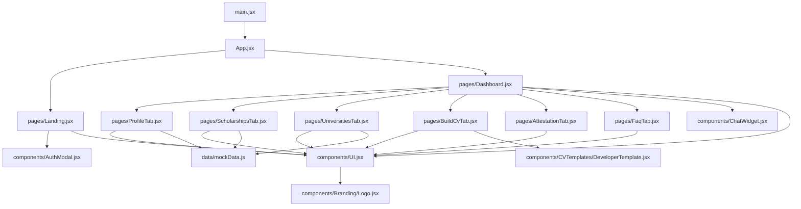
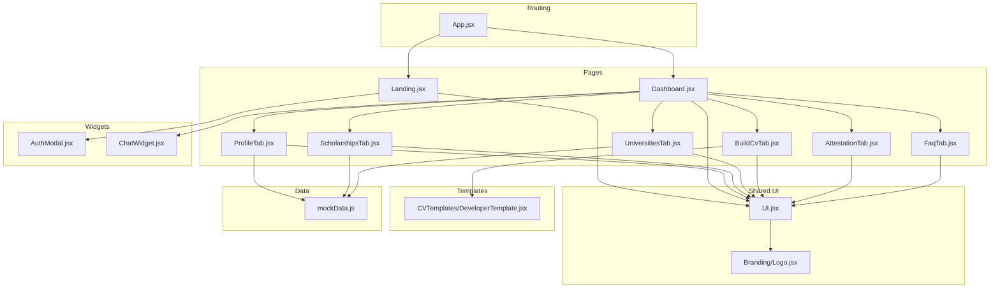
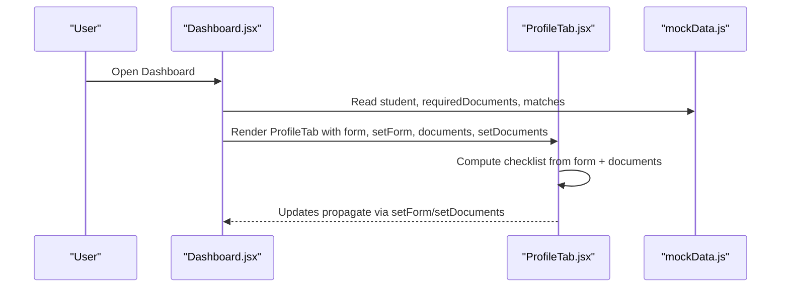
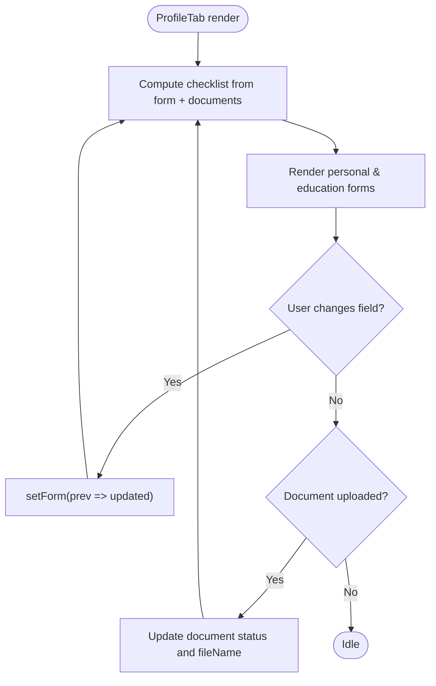
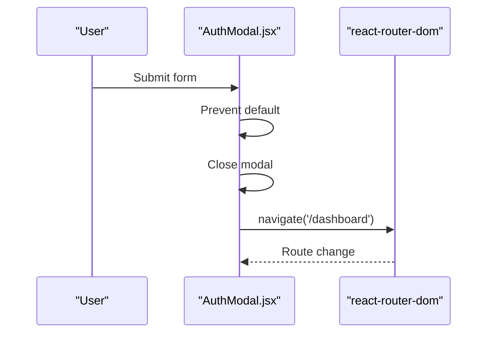
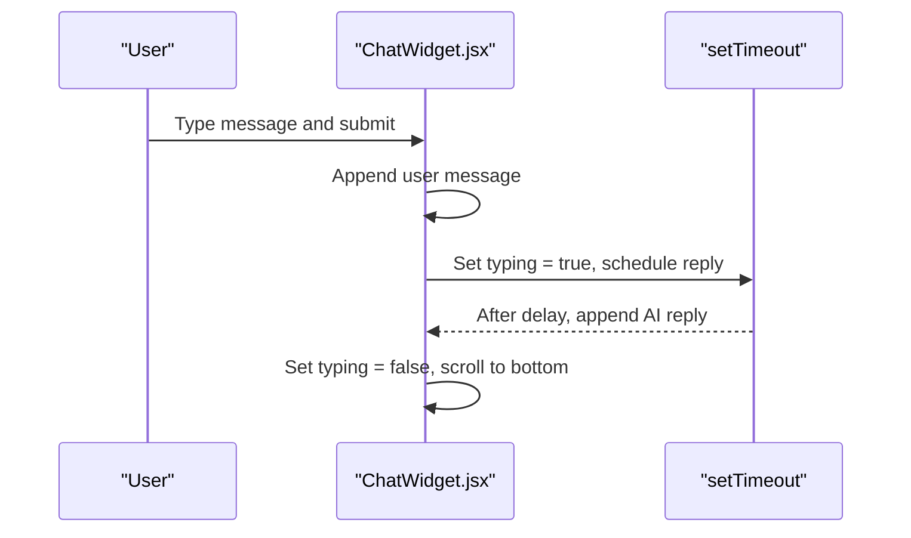
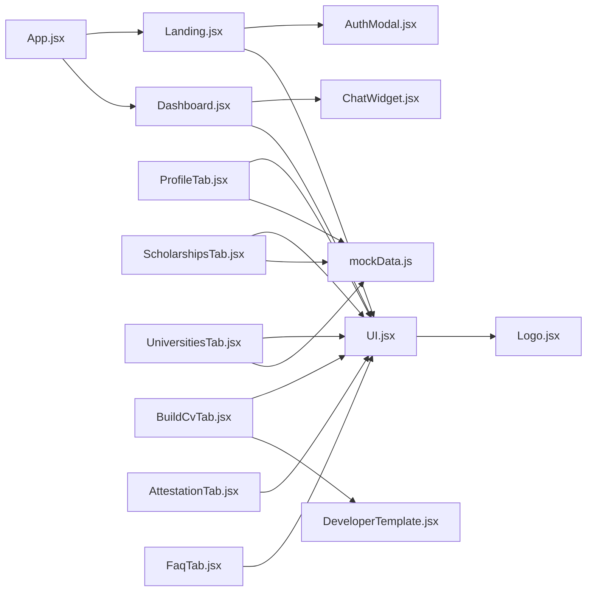

# Component Architecture

<cite>
**Referenced Files in This Document**
- [main.jsx](file://scholarpath-frontend (2)/scholarpath/src/main.jsx)
- [App.jsx](file://scholarpath-frontend (2)/scholarpath/src/App.jsx)
- [Landing.jsx](file://scholarpath-frontend (2)/scholarpath/src/pages/Landing.jsx)
- [Dashboard.jsx](file://scholarpath-frontend (2)/scholarpath/src/pages/Dashboard.jsx)
- [ProfileTab.jsx](file://scholarpath-frontend (2)/scholarpath/src/pages/ProfileTab.jsx)
- [ScholarshipsTab.jsx](file://scholarpath-frontend (2)/scholarpath/src/pages/ScholarshipsTab.jsx)
- [UniversitiesTab.jsx](file://scholarpath-frontend (2)/scholarpath/src/pages/UniversitiesTab.jsx)
- [BuildCvTab.jsx](file://scholarpath-frontend (2)/scholarpath/src/pages/BuildCvTab.jsx)
- [AttestationTab.jsx](file://scholarpath-frontend (2)/scholarpath/src/pages/AttestationTab.jsx)
- [FaqTab.jsx](file://scholarpath-frontend (2)/scholarpath/src/pages/FaqTab.jsx)
- [AuthModal.jsx](file://scholarpath-frontend (2)/scholarpath/src/components/AuthModal.jsx)
- [ChatWidget.jsx](file://scholarpath-frontend (2)/scholarpath/src/components/ChatWidget.jsx)
- [UI.jsx](file://scholarpath-frontend (2)/scholarpath/src/components/UI.jsx)
- [Logo.jsx](file://scholarpath-frontend (2)/scholarpath/src/components/Branding/Logo.jsx)
- [DeveloperTemplate.jsx](file://scholarpath-frontend (2)/scholarpath/src/components/CVTemplates/DeveloperTemplate.jsx)
- [mockData.js](file://scholarpath-frontend (2)/scholarpath/src/data/mockData.js)
</cite>

## Update Summary
**Changes Made**
- Added new Branding/Logo.jsx component with inline SVG logo featuring graduation cap, plane, and orbit trail design elements
- Enhanced CVTemplates/DeveloperTemplate.jsx provides print-perfect A4 CV generation with specialized CSS media queries for optimal printing output
- Updated UI.jsx to export the new Logo component
- Integrated Logo component into Landing page header and other UI components
- Integrated DeveloperTemplate into BuildCvTab for CV preview functionality

## Table of Contents
1. Introduction
2. Project Structure
3. Core Components
4. Architecture Overview
5. Detailed Component Analysis
6. Dependency Analysis
7. Performance Considerations
8. Troubleshooting Guide
9. Conclusion

## Introduction
This document explains the ScholarPathAI React component architecture with a focus on functional components, React 19 usage patterns, and hooks for state management and side effects. It maps the hierarchy starting from App.jsx as the root, describes how pages are organized under pages/, and how reusable UI primitives live under components/. It documents prop interfaces, event handling patterns, composition strategies, and the separation of concerns between page-level logic and shared UI elements. The architecture now includes specialized branding components and enhanced CV template rendering capabilities.

## Project Structure
The application is a Vite + React project using react-router-dom for routing. The entry point renders App inside StrictMode. App defines two routes: Landing and Dashboard. Pages implement feature-specific screens and compose shared UI primitives from UI.jsx. Shared interactive widgets like AuthModal and ChatWidget live under components/. Static data is centralized in mockData.js to decouple content from presentation. The component structure now includes dedicated branding assets and specialized CV templates for professional document generation.

**Diagram sources**
- [main.jsx:1-11](file://scholarpath-frontend (2)/scholarpath/src/main.jsx#L1-L11)
- [App.jsx:1-15](file://scholarpath-frontend (2)/scholarpath/src/App.jsx#L1-L15)
- [Landing.jsx:1-200](file://scholarpath-frontend (2)/scholarpath/src/pages/Landing.jsx#L1-L200)
- [Dashboard.jsx:1-187](file://scholarpath-frontend (2)/scholarpath/src/pages/Dashboard.jsx#L1-L187)
- [ProfileTab.jsx:1-232](file://scholarpath-frontend (2)/scholarpath/src/pages/ProfileTab.jsx#L1-L232)
- [ScholarshipsTab.jsx:1-139](file://scholarpath-frontend (2)/scholarpath/src/pages/ScholarshipsTab.jsx#L1-L139)
- [UniversitiesTab.jsx:1-163](file://scholarpath-frontend (2)/scholarpath/src/pages/UniversitiesTab.jsx#L1-L163)
- [BuildCvTab.jsx:1-397](file://scholarpath-frontend (2)/scholarpath/src/pages/BuildCvTab.jsx#L1-L397)
- [AttestationTab.jsx:1-73](file://scholarpath-frontend (2)/scholarpath/src/pages/AttestationTab.jsx#L1-L73)
- [FaqTab.jsx:1-46](file://scholarpath-frontend (2)/scholarpath/src/pages/FaqTab.jsx#L1-L46)
- [AuthModal.jsx:1-84](file://scholarpath-frontend (2)/scholarpath/src/components/AuthModal.jsx#L1-L84)
- [ChatWidget.jsx:1-104](file://scholarpath-frontend (2)/scholarpath/src/components/ChatWidget.jsx#L1-L104)
- [UI.jsx:1-103](file://scholarpath-frontend (2)/scholarpath/src/components/UI.jsx#L1-L103)
- [Logo.jsx:1-68](file://scholarpath-frontend (2)/scholarpath/src/components/Branding/Logo.jsx#L1-L68)
- [DeveloperTemplate.jsx:1-254](file://scholarpath-frontend (2)/scholarpath/src/components/CVTemplates/DeveloperTemplate.jsx#L1-L254)
- [mockData.js:1-349](file://scholarpath-frontend (2)/scholarpath/src/data/mockData.js#L1-L349)

**Section sources**
- [main.jsx:1-11](file://scholarpath-frontend (2)/scholarpath/src/main.jsx#L1-L11)
- [App.jsx:1-15](file://scholarpath-frontend (2)/scholarpath/src/App.jsx#L1-L15)

## Core Components
- App.jsx: Root router that mounts Landing and Dashboard.
- Landing.jsx: Public landing page; manages local auth modal visibility and composes UI primitives including the new branded Logo component.
- Dashboard.jsx: Authenticated shell with sidebar tabs and shared state for profile and documents; hosts ChatWidget.
- ProfileTab.jsx: Form-driven profile editor with checklist computation and document upload simulation.
- ScholarshipsTab.jsx: Filterable scholarship list with analysis summary.
- UniversitiesTab.jsx: Directory browsing with filters and match cards.
- BuildCvTab.jsx: CV builder and recommendation letter generator utilities with integrated DeveloperTemplate for professional CV rendering.
- AttestationTab.jsx: Step-by-step attestation guidance with option selection.
- FaqTab.jsx: Collapsible FAQ list.
- AuthModal.jsx: Modal for login/signup flows; uses navigation and UI primitives.
- ChatWidget.jsx: Floating chat assistant with message history and typing indicator.
- UI.jsx: Reusable primitives Card, Button, SocialIcon, Badge, and the new Logo wrapper component.
- Logo.jsx: New inline SVG logo component featuring graduation cap, plane, and orbit trail design with Royal Indigo → Teal gradient.
- DeveloperTemplate.jsx: Print-perfect A4 CV template with specialized CSS media queries for optimal printing output.

Key patterns:
- Functional components with hooks: useState, useRef, useEffect, useMemo.
- Controlled inputs and derived state for checklists and filters.
- Composition over inheritance: pages compose UI primitives and each other.
- Centralized static data via mockData.js to keep pages focused on behavior.
- Specialized branding through dedicated Logo component with consistent visual identity.
- Professional document generation through print-optimized CV templates.

**Section sources**
- [App.jsx:1-15](file://scholarpath-frontend (2)/scholarpath/src/App.jsx#L1-L15)
- [Landing.jsx:1-200](file://scholarpath-frontend (2)/scholarpath/src/pages/Landing.jsx#L1-L200)
- [Dashboard.jsx:1-187](file://scholarpath-frontend (2)/scholarpath/src/pages/Dashboard.jsx#L1-L187)
- [ProfileTab.jsx:1-232](file://scholarpath-frontend (2)/scholarpath/src/pages/ProfileTab.jsx#L1-L232)
- [ScholarshipsTab.jsx:1-139](file://scholarpath-frontend (2)/scholarpath/src/pages/ScholarshipsTab.jsx#L1-L139)
- [UniversitiesTab.jsx:1-163](file://scholarpath-frontend (2)/scholarpath/src/pages/UniversitiesTab.jsx#L1-L163)
- [BuildCvTab.jsx:1-397](file://scholarpath-frontend (2)/scholarpath/src/pages/BuildCvTab.jsx#L1-L397)
- [AttestationTab.jsx:1-73](file://scholarpath-frontend (2)/scholarpath/src/pages/AttestationTab.jsx#L1-L73)
- [FaqTab.jsx:1-46](file://scholarpath-frontend (2)/scholarpath/src/pages/FaqTab.jsx#L1-L46)
- [AuthModal.jsx:1-84](file://scholarpath-frontend (2)/scholarpath/src/components/AuthModal.jsx#L1-L84)
- [ChatWidget.jsx:1-104](file://scholarpath-frontend (2)/scholarpath/src/components/ChatWidget.jsx#L1-L104)
- [UI.jsx:1-103](file://scholarpath-frontend (2)/scholarpath/src/components/UI.jsx#L1-L103)
- [Logo.jsx:1-68](file://scholarpath-frontend (2)/scholarpath/src/components/Branding/Logo.jsx#L1-L68)
- [DeveloperTemplate.jsx:1-254](file://scholarpath-frontend (2)/scholarpath/src/components/CVTemplates/DeveloperTemplate.jsx#L1-L254)
- [mockData.js:1-349](file://scholarpath-frontend (2)/scholarpath/src/data/mockData.js#L1-L349)

## Architecture Overview
The app follows a clear separation:
- Routing layer: App.jsx wires routes.
- Page layer: Each page owns its domain state and composes UI primitives.
- Shared UI layer: UI.jsx provides consistent visual building blocks including the new branded Logo component.
- Feature widgets: AuthModal and ChatWidget encapsulate cross-cutting interactions.
- Data layer: mockData.js centralizes content and reference data.
- Branding layer: Dedicated Logo component ensures consistent visual identity across the application.
- Template layer: Specialized CV templates provide professional document rendering capabilities.

**Diagram sources**
- [App.jsx:1-15](file://scholarpath-frontend (2)/scholarpath/src/App.jsx#L1-L15)
- [Landing.jsx:1-200](file://scholarpath-frontend (2)/scholarpath/src/pages/Landing.jsx#L1-L200)
- [Dashboard.jsx:1-187](file://scholarpath-frontend (2)/scholarpath/src/pages/Dashboard.jsx#L1-L187)
- [ProfileTab.jsx:1-232](file://scholarpath-frontend (2)/scholarpath/src/pages/ProfileTab.jsx#L1-L232)
- [ScholarshipsTab.jsx:1-139](file://scholarpath-frontend (2)/scholarpath/src/pages/ScholarshipsTab.jsx#L1-L139)
- [UniversitiesTab.jsx:1-163](file://scholarpath-frontend (2)/scholarpath/src/pages/UniversitiesTab.jsx#L1-L163)
- [BuildCvTab.jsx:1-397](file://scholarpath-frontend (2)/scholarpath/src/pages/BuildCvTab.jsx#L1-L397)
- [AttestationTab.jsx:1-73](file://scholarpath-frontend (2)/scholarpath/src/pages/AttestationTab.jsx#L1-L73)
- [FaqTab.jsx:1-46](file://scholarpath-frontend (2)/scholarpath/src/pages/FaqTab.jsx#L1-L46)
- [AuthModal.jsx:1-84](file://scholarpath-frontend (2)/scholarpath/src/components/AuthModal.jsx#L1-L84)
- [ChatWidget.jsx:1-104](file://scholarpath-frontend (2)/scholarpath/src/components/ChatWidget.jsx#L1-L104)
- [UI.jsx:1-103](file://scholarpath-frontend (2)/scholarpath/src/components/UI.jsx#L1-L103)
- [Logo.jsx:1-68](file://scholarpath-frontend (2)/scholarpath/src/components/Branding/Logo.jsx#L1-L68)
- [DeveloperTemplate.jsx:1-254](file://scholarpath-frontend (2)/scholarpath/src/components/CVTemplates/DeveloperTemplate.jsx#L1-L254)
- [mockData.js:1-349](file://scholarpath-frontend (2)/scholarpath/src/data/mockData.js#L1-L349)

## Detailed Component Analysis

### App.jsx — Router Root
- Purpose: Mounts Landing and Dashboard routes.
- Hooks: None (pure router).
- Composition: Uses BrowserRouter and Routes to declaratively map paths to page components.
- Event handling: None at this level.

**Section sources**
- [App.jsx:1-15](file://scholarpath-frontend (2)/scholarpath/src/App.jsx#L1-L15)

### Landing.jsx — Public Landing Page
- State: Local auth mode toggled via useState to control AuthModal visibility.
- Props passed down:
  - To AuthModal: mode, onClose, onSwitch.
- Composition: Composes UI primitives (Card, Button, SocialIcon, Badge, SectionHeading) and the new branded Logo component.
- Navigation: Uses onClick handlers to open signup/login modals; no programmatic navigation here.
- Separation of concerns: Presentation and user flow orchestration; data is inline or from UI primitives.
- **Updated**: Now integrates the new Logo component in the header for consistent branding.

**Section sources**
- [Landing.jsx:1-200](file://scholarpath-frontend (2)/scholarpath/src/pages/Landing.jsx#L1-L200)

### Dashboard.jsx — Authenticated Shell
- State: Active tab, documents, profile form lifted to Dashboard to be shared across tabs.
- Composition: Renders SidebarLink, OpportunityBar, OverviewTab, and tabbed content; mounts ChatWidget.
- Navigation: Uses useNavigate to log out by navigating to root.
- Data: Reads from mockData.js for student info, requiredDocuments, universityMatches, scholarships.
- Prop passing:
  - ProfileTab receives form, setForm, documents, setDocuments.
  - Other tabs receive their own props as needed.

**Diagram sources**
- [Dashboard.jsx:1-187](file://scholarpath-frontend (2)/scholarpath/src/pages/Dashboard.jsx#L1-L187)
- [ProfileTab.jsx:1-232](file://scholarpath-frontend (2)/scholarpath/src/pages/ProfileTab.jsx#L1-L232)
- [mockData.js:1-349](file://scholarpath-frontend (2)/scholarpath/src/data/mockData.js#L1-L349)

**Section sources**
- [Dashboard.jsx:1-187](file://scholarpath-frontend (2)/scholarpath/src/pages/Dashboard.jsx#L1-L187)

### ProfileTab.jsx — Profile Editor and Checklist
- State: analyzing, analyzed flags; controlled form fields via props.
- Derived state: computeChecklist combines form values and document statuses to auto-update checklist.
- Events:
  - updateField(key, value) updates parent's form state.
  - handleUpload(docId, e) marks document submitted and resets file input.
  - handleAnalyze() simulates AI extraction and populates form fields.
- Composition: Uses UI primitives and local helpers (FormField, StatusBadge, DocumentRow).

**Diagram sources**
- [ProfileTab.jsx:27-45](file://scholarpath-frontend (2)/scholarpath/src/pages/ProfileTab.jsx#L27-L45)
- [ProfileTab.jsx:94-115](file://scholarpath-frontend (2)/scholarpath/src/pages/ProfileTab.jsx#L94-L115)

**Section sources**
- [ProfileTab.jsx:1-232](file://scholarpath-frontend (2)/scholarpath/src/pages/ProfileTab.jsx#L1-L232)

### ScholarshipsTab.jsx — Filtering and Analysis
- State: country, type, department, degree filters.
- Derived data: countries, types, departments, degrees via useMemo; filtered list via filter; top results sliced.
- Composition: ScholarshipCard and ScholarshipAnalysis present filtered results and aggregated metrics.
- Data source: scholarships from mockData.js.

**Section sources**
- [ScholarshipsTab.jsx:1-139](file://scholarpath-frontend (2)/scholarpath/src/pages/ScholarshipsTab.jsx#L1-L139)

### UniversitiesTab.jsx — Directory and Matches
- State: country, degree, department filters.
- Derived data: unique options via useMemo; filtered directory; current and possible matches rendered separately.
- Composition: CurrentMatchCard, PossibleMatchCard, DirectoryCard; uses Badge for tags.
- Data source: universityMatches, possibleMatches, universityDirectory from mockData.js.

**Section sources**
- [UniversitiesTab.jsx:1-163](file://scholarpath-frontend (2)/scholarpath/src/pages/UniversitiesTab.jsx#L1-L163)

### BuildCvTab.jsx — CV Builder and Letter Generator
- State: mode (upload/scratch), fileName, suggestions visibility, conversion states, generated text.
- Side effects: File input handling, simulated conversion delays, client-side download via Blob and URL.createObjectURL.
- Composition: CvBuilderCard and RecommendationLetterCard; uses UI primitives and the new DeveloperTemplate for professional CV rendering.
- **Updated**: Now integrates DeveloperTemplate component for print-perfect A4 CV generation with specialized CSS media queries for optimal printing output.
- Notes: No network calls; all operations are local and deterministic.

**Section sources**
- [BuildCvTab.jsx:1-397](file://scholarpath-frontend (2)/scholarpath/src/pages/BuildCvTab.jsx#L1-L397)

### AttestationTab.jsx — Guided Workflows
- State: activeId selects an attestation option.
- Composition: OptionPicker and AttestationDetail render steps and official links.
- Data source: attestationOptions from mockData.js.

**Section sources**
- [AttestationTab.jsx:1-73](file://scholarpath-frontend (2)/scholarpath/src/pages/AttestationTab.jsx#L1-L73)

### FaqTab.jsx — Collapsible FAQs
- State: openId controls which FAQ item is expanded.
- Composition: FaqItem toggles answer visibility; uses Card primitive.
- Data source: faqs from mockData.js.

**Section sources**
- [FaqTab.jsx:1-46](file://scholarpath-frontend (2)/scholarpath/src/pages/FaqTab.jsx#L1-L46)

### AuthModal.jsx — Authentication Flow
- Props:
  - mode: 'login' | 'signup' | null
  - onClose: function to hide modal
  - onSwitch: function to toggle between login and signup
- State: showPassword toggles password visibility.
- Events: handleSubmit prevents default, closes modal, navigates to /dashboard (mock auth).
- Composition: Uses Card and Button from UI.jsx; uses useNavigate for routing.

**Diagram sources**
- [AuthModal.jsx:11-16](file://scholarpath-frontend (2)/scholarpath/src/components/AuthModal.jsx#L11-L16)
- [AuthModal.jsx:1-84](file://scholarpath-frontend (2)/scholarpath/src/components/AuthModal.jsx#L1-L84)

**Section sources**
- [AuthModal.jsx:1-84](file://scholarpath-frontend (2)/scholarpath/src/components/AuthModal.jsx#L1-L84)

### ChatWidget.jsx — Real-time-like Assistant
- State: open, messages, input, typing; bottomRef for auto-scrolling.
- Side effects: useEffect scrolls into view when messages or typing change.
- Events: handleSend adds user message, sets typing, schedules AI reply after delay, then clears typing.
- Composition: Uses Button from UI.jsx; floating UI with fixed positioning.

**Diagram sources**
- [ChatWidget.jsx:24-39](file://scholarpath-frontend (2)/scholarpath/src/components/ChatWidget.jsx#L24-L39)
- [ChatWidget.jsx:20-22](file://scholarpath-frontend (2)/scholarpath/src/components/ChatWidget.jsx#L20-L22)

**Section sources**
- [ChatWidget.jsx:1-104](file://scholarpath-frontend (2)/scholarpath/src/components/ChatWidget.jsx#L1-L104)

### UI.jsx — Shared Primitives
- Exports:
  - Logo({ size }) - Wrapper component for the new branded LogoSVG
  - LogoSVG - Direct import from Branding/Logo.jsx
  - Card({ children, className, hover })
  - Button({ children, variant, onClick, className, type })
  - SocialIcon({ label })
  - Badge({ children, tone })
  - StatCard({ value, label, icon, color })
  - Avatar({ name, size })
  - SectionHeading({ label, title, subtitle })
- Styling strategy: Tailwind utility classes with consistent color tokens and transitions.
- Usage: Consumed by all pages and widgets to ensure visual consistency.
- **Updated**: Now exports the new Logo component and LogoSVG for consistent branding throughout the application.

**Section sources**
- [UI.jsx:1-103](file://scholarpath-frontend (2)/scholarpath/src/components/UI.jsx#L1-L103)

### Logo.jsx — Branded Logo Component
- Purpose: Provides a consistent, scalable brand logo with inline SVG graphics.
- Features:
  - Inline SVG with graduation cap (mortarboard), paper airplane, and orbit trail design elements
  - Royal Indigo → Teal gradient for premium visual appeal
  - Configurable size prop for flexible integration
  - Accessible aria-label for screen readers
  - Responsive design with proper viewBox scaling
- Design Elements:
  - Mortarboard diamond top representing academic achievement
  - Paper airplane symbolizing journey and progress
  - Orbit trail connecting educational foundation to future opportunities
  - Tassel detail adding authentic graduation cap appearance
- Integration: Exported through UI.jsx for easy consumption across the application.

**Section sources**
- [Logo.jsx:1-68](file://scholarpath-frontend (2)/scholarpath/src/components/Branding/Logo.jsx#L1-L68)

### DeveloperTemplate.jsx — Print-Perfect CV Template
- Purpose: Provides professional A4 CV rendering optimized for both screen display and print output.
- Features:
  - Print-optimized CSS with @media print queries for perfect PDF generation
  - A4 page sizing with proper margins and typography
  - Clean, professional layout with section-based organization
  - Support for Europass-style data structure
  - Responsive design for screen viewing with print-specific optimizations
- Print Capabilities:
  - Automatic page break handling
  - Color preservation with print-color-adjust properties
  - Optimized typography for print readability
  - Hidden UI elements during print (no-print class)
- Data Structure: Accepts parsed Europass-style data object with sections for summary, education, work experience, skills, projects, certifications, achievements, and languages.
- Integration: Used in BuildCvTab.jsx for CV preview and professional document generation.

**Section sources**
- [DeveloperTemplate.jsx:1-254](file://scholarpath-frontend (2)/scholarpath/src/components/CVTemplates/DeveloperTemplate.jsx#L1-L254)

## Dependency Analysis
- Routing dependency: App.jsx depends on react-router-dom and mounts Landing and Dashboard.
- Page dependencies:
  - Landing depends on AuthModal, UI primitives, and the new Logo component.
  - Dashboard depends on multiple tabs and ChatWidget; reads mockData.
  - Tabs depend on UI primitives and mockData where applicable.
  - BuildCvTab now depends on DeveloperTemplate for professional CV rendering.
- Widget dependencies:
  - AuthModal depends on UI primitives and react-router-dom.
  - ChatWidget depends on UI primitives and uses DOM refs and timers.
- Branding dependency: UI.jsx imports and re-exports the Logo component for consistent branding.
- Template dependency: BuildCvTab imports DeveloperTemplate for enhanced CV generation capabilities.
- Data dependency: mockData.js is consumed by multiple pages to avoid duplication.

**Diagram sources**
- [App.jsx:1-15](file://scholarpath-frontend (2)/scholarpath/src/App.jsx#L1-L15)
- [Landing.jsx:1-200](file://scholarpath-frontend (2)/scholarpath/src/pages/Landing.jsx#L1-L200)
- [Dashboard.jsx:1-187](file://scholarpath-frontend (2)/scholarpath/src/pages/Dashboard.jsx#L1-L187)
- [AuthModal.jsx:1-84](file://scholarpath-frontend (2)/scholarpath/src/components/AuthModal.jsx#L1-L84)
- [ChatWidget.jsx:1-104](file://scholarpath-frontend (2)/scholarpath/src/components/ChatWidget.jsx#L1-L104)
- [UI.jsx:1-103](file://scholarpath-frontend (2)/scholarpath/src/components/UI.jsx#L1-L103)
- [Logo.jsx:1-68](file://scholarpath-frontend (2)/scholarpath/src/components/Branding/Logo.jsx#L1-L68)
- [DeveloperTemplate.jsx:1-254](file://scholarpath-frontend (2)/scholarpath/src/components/CVTemplates/DeveloperTemplate.jsx#L1-L254)
- [ProfileTab.jsx:1-232](file://scholarpath-frontend (2)/scholarpath/src/pages/ProfileTab.jsx#L1-L232)
- [ScholarshipsTab.jsx:1-139](file://scholarpath-frontend (2)/scholarpath/src/pages/ScholarshipsTab.jsx#L1-L139)
- [UniversitiesTab.jsx:1-163](file://scholarpath-frontend (2)/scholarpath/src/pages/UniversitiesTab.jsx#L1-L163)
- [BuildCvTab.jsx:1-397](file://scholarpath-frontend (2)/scholarpath/src/pages/BuildCvTab.jsx#L1-L397)
- [AttestationTab.jsx:1-73](file://scholarpath-frontend (2)/scholarpath/src/pages/AttestationTab.jsx#L1-L73)
- [FaqTab.jsx:1-46](file://scholarpath-frontend (2)/scholarpath/src/pages/FaqTab.jsx#L1-L46)
- [mockData.js:1-349](file://scholarpath-frontend (2)/scholarpath/src/data/mockData.js#L1-L349)

**Section sources**
- [App.jsx:1-15](file://scholarpath-frontend (2)/scholarpath/src/App.jsx#L1-L15)
- [mockData.js:1-349](file://scholarpath-frontend (2)/scholarpath/src/data/mockData.js#L1-L349)

## Performance Considerations
- Use of useMemo in filtering-heavy tabs (ScholarshipsTab, UniversitiesTab) to derive lists efficiently.
- Controlled inputs with localized state minimize unnecessary re-renders.
- ChatWidget uses useRef for scrolling and avoids layout thrashing by batching updates.
- Centralized data in mockData.js reduces duplication and simplifies future migration to real APIs.
- **Updated**: Logo component uses inline SVG for optimal performance without external image requests.
- **Updated**: DeveloperTemplate implements efficient print-only styles to minimize runtime overhead.
- **Updated**: Print-optimized CSS in DeveloperTemplate ensures fast rendering during print operations.

## Troubleshooting Guide
- Auth flow not navigating: Ensure AuthModal's onSubmit prevents default and calls onClose before navigation. Verify route exists in App.jsx.
- Chat messages not scrolling: Confirm useEffect depends on messages and typing; verify bottomRef is attached to the last element.
- Profile checklist not updating: Ensure computeChecklist runs on every render and depends on both form and documents; confirm setForm and setDocuments are called correctly.
- Filters not working: Verify filter conditions in ScholarshipsTab and UniversitiesTab match data keys; ensure onChange handlers update corresponding state.
- **Updated**: Logo not displaying: Check that UI.jsx properly imports and exports the Logo component, and verify the Branding/Logo.jsx file path is correct.
- **Updated**: Print issues with CV template: Ensure DeveloperTemplate CSS media queries are properly loaded and verify browser print settings allow color adjustment.
- **Updated**: CV template data not rendering: Verify that the data structure passed to DeveloperTemplate matches the expected Europass format with proper section names.

**Section sources**
- [AuthModal.jsx:11-16](file://scholarpath-frontend (2)/scholarpath/src/components/AuthModal.jsx#L11-L16)
- [ChatWidget.jsx:20-22](file://scholarpath-frontend (2)/scholarpath/src/components/ChatWidget.jsx#L20-L22)
- [ProfileTab.jsx:27-45](file://scholarpath-frontend (2)/scholarpath/src/pages/ProfileTab.jsx#L27-L45)
- [ScholarshipsTab.jsx:70-77](file://scholarpath-frontend (2)/scholarpath/src/pages/ScholarshipsTab.jsx#L70-L77)
- [UniversitiesTab.jsx:82-88](file://scholarpath-frontend (2)/scholarpath/src/pages/UniversitiesTab.jsx#L82-L88)
- [Logo.jsx:1-68](file://scholarpath-frontend (2)/scholarpath/src/components/Branding/Logo.jsx#L1-L68)
- [DeveloperTemplate.jsx:31-43](file://scholarpath-frontend (2)/scholarpath/src/components/CVTemplates/DeveloperTemplate.jsx#L31-L43)

## Conclusion
ScholarPathAI employs a clean, modular architecture with enhanced branding and document generation capabilities:
- App.jsx orchestrates routing.
- Pages encapsulate domain logic and compose UI primitives.
- UI.jsx provides consistent, reusable components including the new branded Logo.
- AuthModal and ChatWidget offer cross-cutting features with clear prop contracts.
- mockData.js centralizes content, enabling easy replacement with backend services later.
- **Enhanced**: Dedicated Logo component ensures consistent visual identity across the application.
- **Enhanced**: DeveloperTemplate provides professional CV generation with print-perfect A4 formatting.

This structure supports maintainability, testability, and scalability while keeping components focused and cohesive, with improved branding consistency and enhanced document generation capabilities.