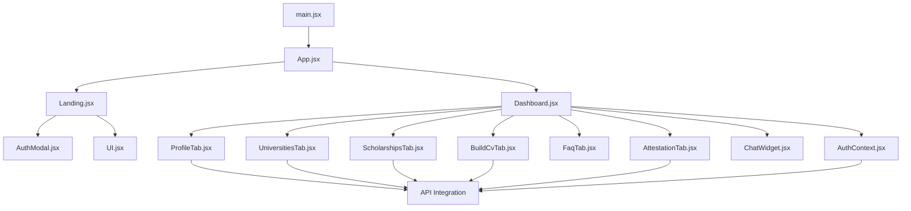
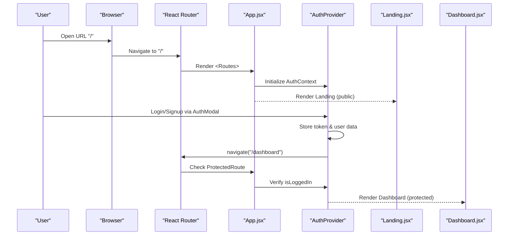
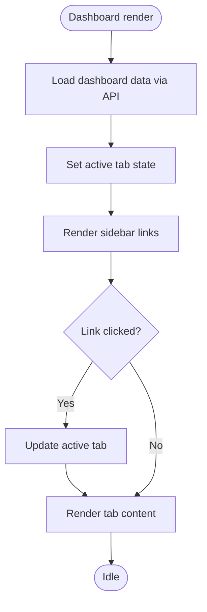
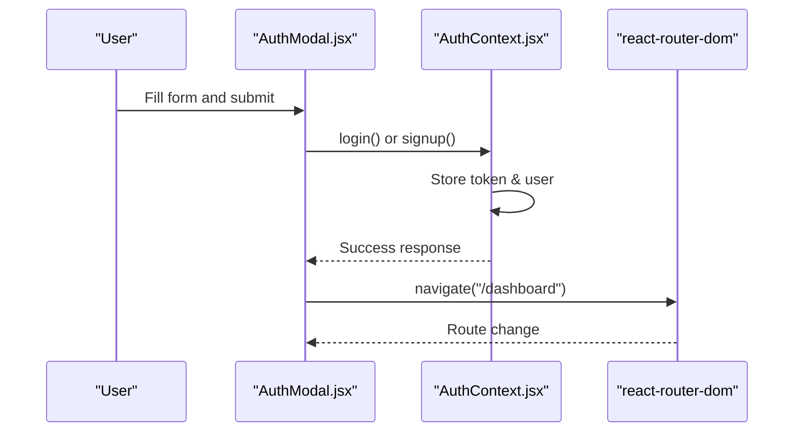
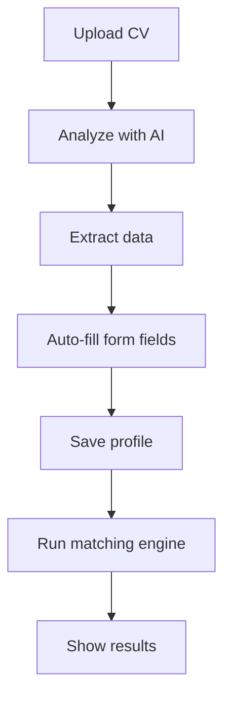
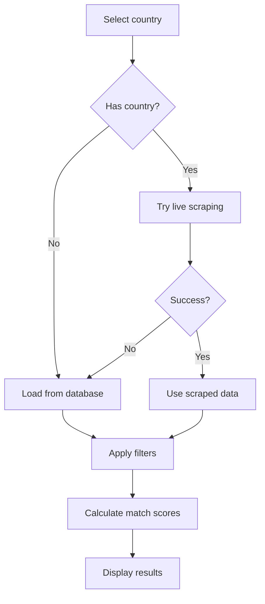
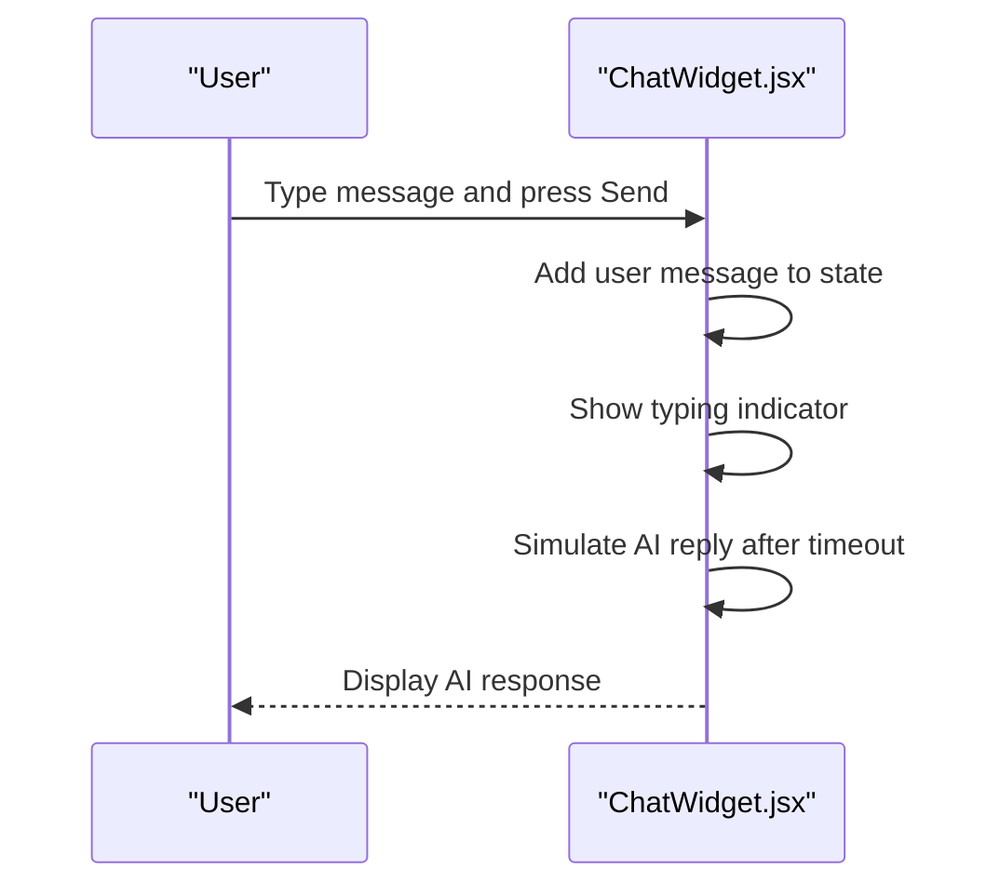
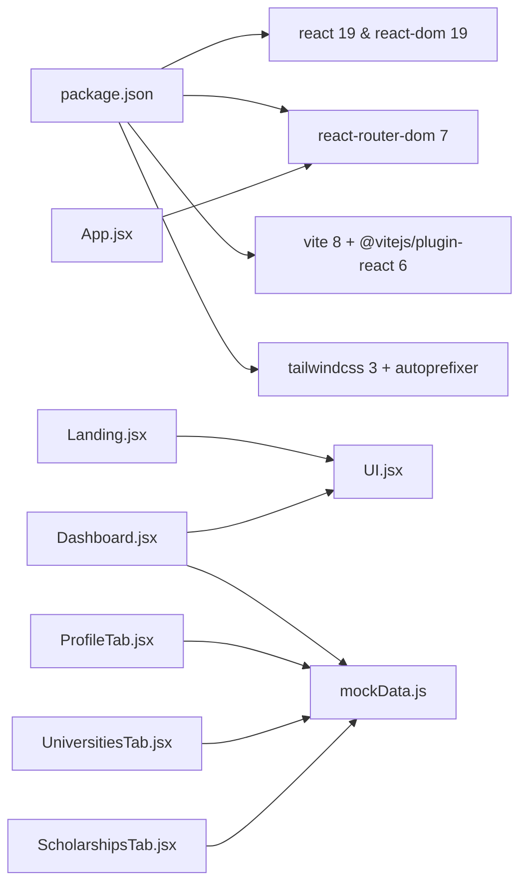

# Frontend Documentation

<cite>
**Referenced Files in This Document**
- [App.jsx](file://src/App.jsx)
- [main.jsx](file://src/main.jsx)
- [package.json](file://package.json)
- [vite.config.js](file://vite.config.js)
- [tailwind.config.js](file://tailwind.config.js)
- [index.css](file://src/index.css)
- [Landing.jsx](file://src/pages/Landing.jsx)
- [Dashboard.jsx](file://src/pages/Dashboard.jsx)
- [AuthModal.jsx](file://src/components/AuthModal.jsx)
- [UI.jsx](file://src/components/UI.jsx)
- [ChatWidget.jsx](file://src/components/ChatWidget.jsx)
- [ProfileTab.jsx](file://src/pages/ProfileTab.jsx)
- [UniversitiesTab.jsx](file://src/pages/UniversitiesTab.jsx)
- [ScholarshipsTab.jsx](file://src/pages/ScholarshipsTab.jsx)
- [BuildCvTab.jsx](file://src/pages/BuildCvTab.jsx)
- [FaqTab.jsx](file://src/pages/FaqTab.jsx)
- [AttestationTab.jsx](file://src/pages/AttestationTab.jsx)
- [AuthContext.jsx](file://src/components/AuthContext.jsx)
- [mockData.js](file://src/data/mockData.js)
</cite>

## Update Summary
**Changes Made**
- Updated to reflect complete React 19 frontend application with Vite 8 build system
- Added comprehensive multi-tab interface documentation including Profile Builder, Scholarship Matching, University Directory, Document Attestation, and Application Tracking
- Enhanced authentication system with AuthContext for state management
- Integrated real API calls with fallback to mock data
- Added AI-powered CV analysis and Europass conversion features
- Implemented live scholarship scraping with country-specific filtering
- Enhanced responsive design patterns with Tailwind CSS custom theme

## Table of Contents
1. Introduction
2. Project Structure
3. Core Components
4. Architecture Overview
5. Detailed Component Analysis
6. Dependency Analysis
7. Performance Considerations
8. Troubleshooting Guide
9. Conclusion
10. Appendices

## Introduction
This document provides comprehensive frontend documentation for the ScholarPathAI React application. It explains the component-based architecture using React 19 with functional components and hooks, routing via React Router between the Landing page and Dashboard, state management for authentication flow, profile data, and application state, the Tailwind CSS UI library (including reusable components like AuthModal), responsive design patterns, component composition and prop interfaces, event handling strategies, and the Vite 8 build process for development and production optimization.

The application now features a complete multi-tab interface with Profile Builder, Scholarship Matching, University Directory, Document Attestation, and Application Tracking capabilities, all integrated with real backend APIs while maintaining fallback functionality for development.

## Project Structure
The application is organized by feature areas with enhanced modularity:
- Pages: Landing page and comprehensive Dashboard with seven tabbed subviews (Overview, Profile, Universities, Scholarships, Build CV, Document Attestations, FAQ).
- Components: Shared UI primitives (Card, Button, Badge, SocialIcon) and feature components (AuthModal, ChatWidget, AuthContext).
- Data: Centralized mock data layer with real API integration for universities, scholarships, documents, and FAQs.
- Configuration: Vite 8 config, Tailwind custom theme with brand colors, and global styles.

**Diagram sources**
- [main.jsx:1-11](file://src/main.jsx#L1-L11)
- [App.jsx:1-23](file://src/App.jsx#L1-L23)
- [Dashboard.jsx:15-23](file://src/pages/Dashboard.jsx#L15-L23)
- [AuthContext.jsx:1-64](file://src/components/AuthContext.jsx#L1-L64)

**Section sources**
- [main.jsx:1-11](file://src/main.jsx#L1-L11)
- [App.jsx:1-23](file://src/App.jsx#L1-L23)
- [package.json:1-28](file://package.json#L1-L28)
- [vite.config.js:1-16](file://vite.config.js#L1-L16)
- [tailwind.config.js:1-31](file://tailwind.config.js#L1-L31)

## Core Components
- App: Root component that sets up protected routing with AuthProvider and mounts pages.
- Landing: Public marketing page with hero, features, steps, and call-to-action; integrates AuthModal to trigger login/signup flows.
- Dashboard: Protected area with sidebar navigation and seven tabbed content sections managing real-time data from APIs.
- AuthModal: Enhanced modal for login/signup with forgot password functionality and form validation.
- AuthContext: Centralized authentication state management with token persistence and user data synchronization.
- UI: Reusable primitives (Card, Button, Badge, SocialIcon) styled with custom Tailwind theme tokens.
- ChatWidget: Floating assistant chat with message history and canned AI replies.
- Tab Components: Feature-specific views (ProfileTab, UniversitiesTab, ScholarshipsTab, BuildCvTab, AttestationTab, FaqTab) with real API integration.

Key responsibilities:
- Protected Routing: App.jsx uses ProtectedRoute wrapper for authenticated access.
- State Management: Context API for auth state, local state for tabs and forms.
- API Integration: Real backend calls with fallback to mock data for development.
- Navigation: useNavigate from react-router-dom for programmatic navigation.
- Styling: Custom Tailwind theme with brand colors and responsive utilities.

**Section sources**
- [App.jsx:1-23](file://src/App.jsx#L1-L23)
- [Landing.jsx:1-211](file://src/pages/Landing.jsx#L1-L211)
- [Dashboard.jsx:1-338](file://src/pages/Dashboard.jsx#L1-L338)
- [AuthModal.jsx:1-284](file://src/components/AuthModal.jsx#L1-L284)
- [AuthContext.jsx:1-64](file://src/components/AuthContext.jsx#L1-L64)
- [UI.jsx:1-48](file://src/components/UI.jsx#L1-L48)

## Architecture Overview
The app follows a modern client-side architecture with React Router v7, Context API for authentication, and component-based design. The root entry renders StrictMode and mounts App with AuthProvider. App configures protected routes with authentication checks. Dashboard hosts a comprehensive tabbed interface where each tab is a feature component with real API integration.

**Diagram sources**
- [App.jsx:6-22](file://src/App.jsx#L6-L22)
- [AuthContext.jsx:6-57](file://src/components/AuthContext.jsx#L6-L57)
- [AuthModal.jsx:28-52](file://src/components/AuthModal.jsx#L28-L52)

## Detailed Component Analysis

### Routing and Entry Points
- Entry point: main.jsx creates the root and renders App inside StrictMode with createRoot API.
- Routes: App.jsx uses BrowserRouter with protected routes - "/" (Landing) and "/dashboard" (ProtectedRoute wrapping Dashboard).
- Authentication: ProtectedRoute component checks auth state and redirects unauthenticated users.

Implementation highlights:
- Protected routing ensures dashboard access only for authenticated users.
- Programmatic navigation via useNavigate in AuthModal to move to dashboard after submission.
- Logout in Dashboard clears auth context and navigates back to home.

**Section sources**
- [main.jsx:1-11](file://src/main.jsx#L1-L11)
- [App.jsx:1-23](file://src/App.jsx#L1-L23)
- [AuthModal.jsx:28-52](file://src/components/AuthModal.jsx#L28-L52)
- [Dashboard.jsx:270-273](file://src/pages/Dashboard.jsx#L270-L273)

### Landing Page
- Purpose: Marketing and conversion-focused page with hero, stats, features, how-it-works, and footer sections.
- Interactions: Opens AuthModal for login/signup; uses UI primitives for consistent styling.
- Responsive: Uses Tailwind responsive utilities for layout adjustments across breakpoints.
- Features: Interactive cards showing top university matches with percentage scores.

**Section sources**
- [Landing.jsx:1-211](file://src/pages/Landing.jsx#L1-L211)
- [UI.jsx:1-48](file://src/components/UI.jsx#L1-L48)

### Dashboard and Tabbed Interface
- Layout: Sticky header with branding, responsive sidebar navigation, scrollable content area.
- State Management: Real-time data loading from APIs with error handling and fallback to mock data.
- Composition: Seven tab components rendered conditionally based on active tab selection.
- Data Flow: Fetches overview, matches, and profile data concurrently using Promise.allSettled.

**Diagram sources**
- [Dashboard.jsx:192-338](file://src/pages/Dashboard.jsx#L192-L338)

**Section sources**
- [Dashboard.jsx:1-338](file://src/pages/Dashboard.jsx#L1-L338)

### Authentication System
- AuthContext: Provides centralized authentication state with user, token, and loading status.
- AuthModal: Enhanced modal with login/signup forms, forgot password functionality, and form validation.
- Protected Routes: Route protection using Higher Order Component pattern.
- Token Persistence: Local storage integration for session management.

**Diagram sources**
- [AuthModal.jsx:28-52](file://src/components/AuthModal.jsx#L28-L52)
- [AuthContext.jsx:20-44](file://src/components/AuthContext.jsx#L20-L44)

**Section sources**
- [AuthModal.jsx:1-284](file://src/components/AuthModal.jsx#L1-L284)
- [AuthContext.jsx:1-64](file://src/components/AuthContext.jsx#L1-L64)

### Profile Builder Tab
- Responsibilities: Comprehensive form for personal and academic information with conditional fields based on degree type.
- AI Integration: CV upload and analysis with automatic data extraction and form population.
- State Management: Local analyzing/analyzed flags; receives form and documents from parent Dashboard.
- Workflow: Save profile → Analyze CV → Find matching scholarships with step-by-step guidance.

**Diagram sources**
- [ProfileTab.jsx:138-188](file://src/pages/ProfileTab.jsx#L138-L188)

**Section sources**
- [ProfileTab.jsx:1-510](file://src/pages/ProfileTab.jsx#L1-L510)

### University Directory Tab
- Features: Filterable university directory with country-based filtering and application guidelines.
- API Integration: Real-time university data fetching with fallback to mock data.
- Optimization: Uses useMemo to derive filter options once for performance.
- User Experience: Shows application guidelines and official portal links for each university.

**Section sources**
- [UniversitiesTab.jsx:1-169](file://src/pages/UniversitiesTab.jsx#L1-L169)

### Scholarship Matching Tab
- Features: Advanced scholarship matching with real-time web scraping and database queries.
- Smart Filtering: Country hard filter, department hard filter, degree soft filter with relevance scoring.
- Live Scraping: Attempts to scrape live scholarship portals when country is selected.
- Match Scoring: Backend match scores with frontend fallback calculation for missing data.

**Diagram sources**
- [ScholarshipsTab.jsx:249-296](file://src/pages/ScholarshipsTab.jsx#L249-L296)

**Section sources**
- [ScholarshipsTab.jsx:1-482](file://src/pages/ScholarshipsTab.jsx#L1-L482)

### CV Builder and Document Tools
- Features: CV upload with AI feedback, Europass format conversion, and recommendation letter generation.
- File Processing: Supports PDF, DOCX, and TXT formats with base64 PDF generation.
- AI Integration: Real API calls for CV analysis with mock fallback for development.
- Export Options: Download generated PDFs and text files for offline use.

**Section sources**
- [BuildCvTab.jsx:1-448](file://src/pages/BuildCvTab.jsx#L1-L448)

### FAQ and Support Tab
- Features: Expandable FAQ accordion with smooth animations and helpful tips.
- Integration: Links to chat assistant for additional support.
- Design: Clean card-based layout with consistent spacing and typography.

**Section sources**
- [FaqTab.jsx:1-46](file://src/pages/FaqTab.jsx#L1-L46)

### UI Component Library (Tailwind)
- Card: Wrapper with border, rounded corners, and custom shadow tokens.
- Button: Variants (primary, secondary, ghost) with hover states and accessibility.
- Badge: Color-coded tones (blue, green, amber, gray, red) for status indicators.
- SocialIcon: Simple icon placeholder with hover effects for social media links.

Usage spans all components for consistent visual language and brand consistency.

**Section sources**
- [UI.jsx:1-48](file://src/components/UI.jsx#L1-L48)
- [tailwind.config.js:1-31](file://tailwind.config.js#L1-L31)

### ChatWidget
- Features: Toggleable floating widget, message list, typing indicator, auto-scroll, canned AI responses.
- State: open, messages, input text, typing status with localStorage persistence.
- Event handling: Form submit adds user message, simulates AI reply after delay.

**Diagram sources**
- [ChatWidget.jsx:11-103](file://src/components/ChatWidget.jsx#L11-L103)

**Section sources**
- [ChatWidget.jsx:1-104](file://src/components/ChatWidget.jsx#L1-L104)

## Dependency Analysis
High-level dependencies with updated versions:
- React 19 and React DOM provide the latest runtime with improved performance.
- React Router v7 handles routing and navigation with enhanced features.
- Vite 8 builds and serves the app with optimized development experience.
- Tailwind CSS v3 provides utility-first styling with custom theme tokens.
- PostCSS and Autoprefixer ensure cross-browser compatibility.

**Diagram sources**
- [package.json:12-25](file://package.json#L12-L25)
- [App.jsx:1-23](file://src/App.jsx#L1-L23)

**Section sources**
- [package.json:1-28](file://package.json#L1-L28)
- [vite.config.js:1-16](file://vite.config.js#L1-L16)
- [tailwind.config.js:1-31](file://tailwind.config.js#L1-L31)

## Performance Considerations
- Memoization: Extensive use of useMemo for derived filter options and computed values in University and Scholarship tabs.
- List rendering: Stable keys for list items to optimize re-renders across all tab components.
- Lazy loading: Conditional imports and component rendering based on active tab state.
- API optimization: Concurrent data fetching with Promise.allSettled for dashboard initialization.
- Bundle size: Minimal third-party dependencies with reliance on Tailwind utilities to reduce custom CSS.
- Error handling: Graceful fallbacks to mock data when APIs are unavailable.

## Troubleshooting Guide
Common issues and resolutions:
- Protected route redirecting unexpectedly: Ensure AuthContext is properly initialized and token is stored correctly.
- API calls failing: Check network connectivity and verify backend endpoints are accessible.
- Tailwind styles not applying: Verify index.css imports Tailwind directives and tailwind.config.js includes correct content paths.
- ChatWidget not scrolling: Check that bottomRef is attached and useEffect triggers on message updates.
- Filters not updating: Ensure select inputs update state and filters are applied consistently across components.
- File uploads failing: Verify file size limits and supported formats in file input components.

**Section sources**
- [App.jsx:6-22](file://src/App.jsx#L6-L22)
- [Dashboard.jsx:208-264](file://src/pages/Dashboard.jsx#L208-L264)
- [index.css:1-35](file://src/index.css#L1-L35)
- [ChatWidget.jsx:20-22](file://src/components/ChatWidget.jsx#L20-L22)

## Conclusion
ScholarPathAI's frontend is a comprehensive, production-ready React application leveraging React 19, Vite 8, and modern best practices. The application features a complete multi-tab interface with Profile Builder, Scholarship Matching, University Directory, Document Attestation, and Application Tracking capabilities. The architecture supports both real API integration and development with mock data, providing flexibility for different deployment scenarios. With robust authentication, responsive design, and AI-powered features, the application delivers an exceptional user experience for students seeking international education opportunities.

## Appendices

### Build Process with Vite 8
- Development server: npm run dev starts Vite with hot module replacement and proxy configuration for API calls.
- Production build: npm run build generates optimized assets with code splitting and tree shaking.
- Preview: npm run preview serves the built output locally for testing.
- Plugin: @vitejs/plugin-react enables JSX transformation and React-specific optimizations.
- Proxy: Configured to forward /api requests to localhost:3000 for development.

**Section sources**
- [package.json:6-10](file://package.json#L6-L10)
- [vite.config.js:1-16](file://vite.config.js#L1-L16)

### Responsive Design Patterns
- Mobile-first approach using Tailwind responsive prefixes (sm:, md:, lg:) for layouts and typography.
- Sticky headers and sidebars for improved navigation on larger screens.
- Accessible animations with reduced motion support and proper focus management.
- Custom theme tokens for brand consistency across all components.

**Section sources**
- [tailwind.config.js:1-31](file://tailwind.config.js#L1-L31)
- [index.css:1-35](file://src/index.css#L1-L35)

### API Integration Pattern
- Real API calls with try-catch error handling throughout all components.
- Fallback to mock data when APIs are unavailable for development.
- Loading states and error banners for better user experience.
- Concurrent data fetching with Promise.allSettled for optimal performance.

**Section sources**
- [Dashboard.jsx:208-264](file://src/pages/Dashboard.jsx#L208-L264)
- [UniversitiesTab.jsx:65-83](file://src/pages/UniversitiesTab.jsx#L65-L83)
- [ScholarshipsTab.jsx:249-296](file://src/pages/ScholarshipsTab.jsx#L249-L296)