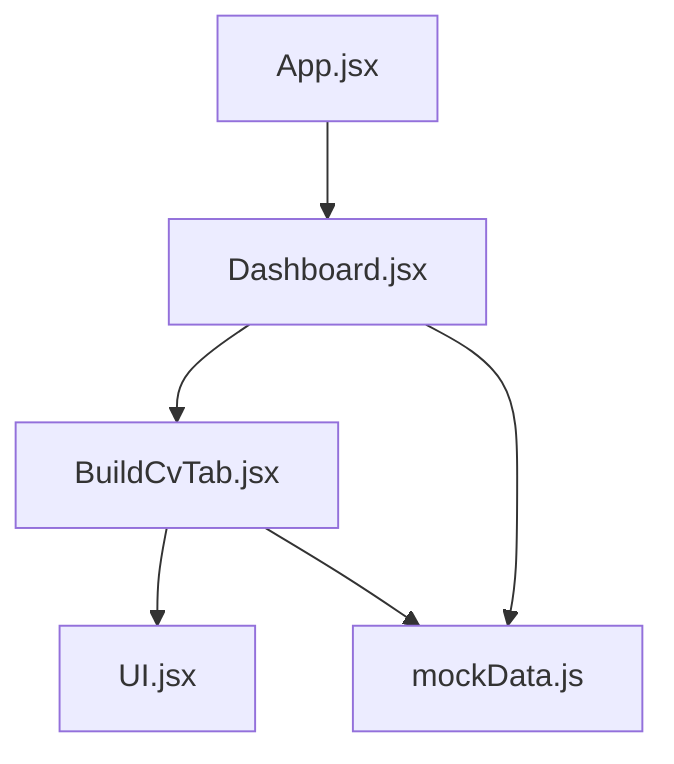
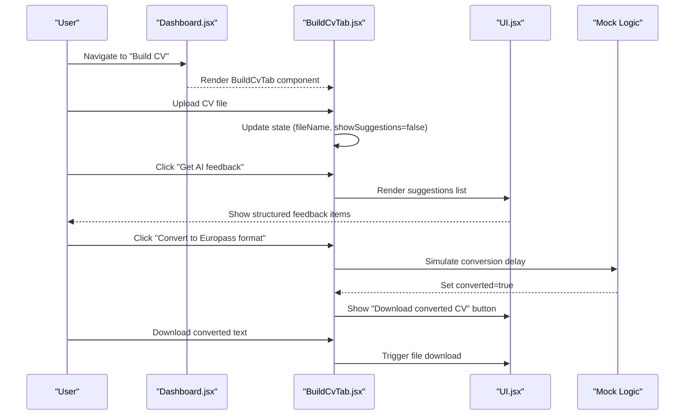
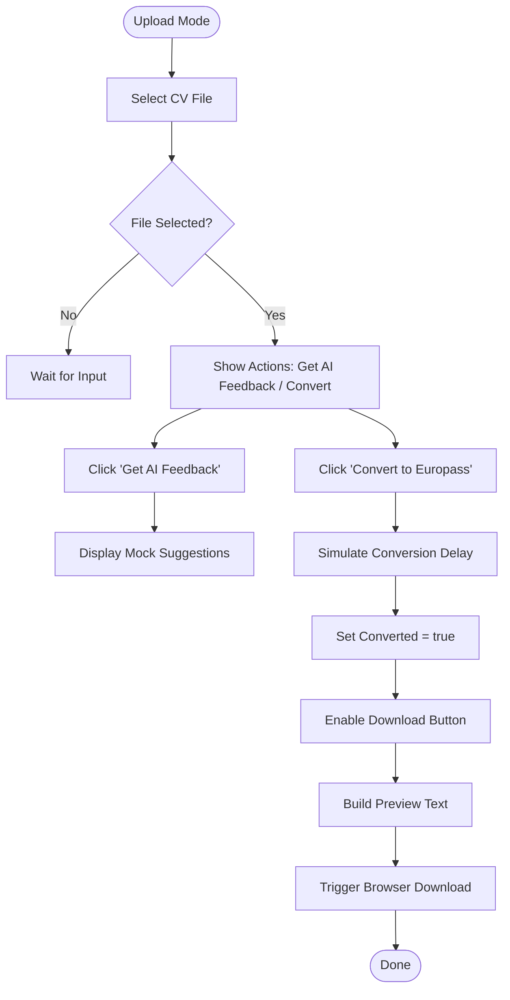
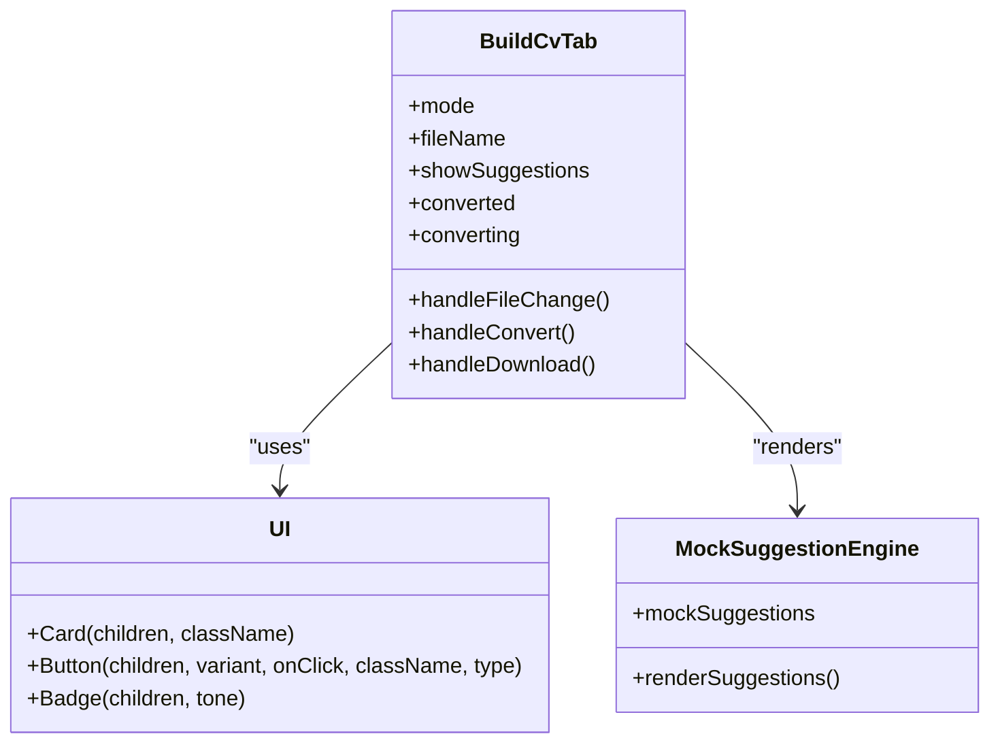
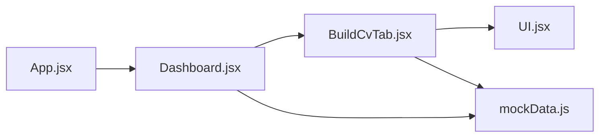

# AI Feedback System

<cite>
**Referenced Files in This Document**
- [BuildCvTab.jsx](file://scholarpath-frontend (2)/scholarpath/src/pages/BuildCvTab.jsx)
- [Dashboard.jsx](file://scholarpath-frontend (2)/scholarpath/src/pages/Dashboard.jsx)
- [UI.jsx](file://scholarpath-frontend (2)/scholarpath/src/components/UI.jsx)
- [mockData.js](file://scholarpath-frontend (2)/scholarpath/src/data/mockData.js)
- [App.jsx](file://scholarpath-frontend (2)/scholarpath/src/App.jsx)
</cite>

## Table of Contents
1. [Introduction](#introduction)
2. [Project Structure](#project-structure)
3. [Core Components](#core-components)
4. [Architecture Overview](#architecture-overview)
5. [Detailed Component Analysis](#detailed-component-analysis)
6. [Dependency Analysis](#dependency-analysis)
7. [Performance Considerations](#performance-considerations)
8. [Troubleshooting Guide](#troubleshooting-guide)
9. [Conclusion](#conclusion)
10. [Appendices](#appendices)

## Introduction
This document explains the AI feedback system for CV improvement within the ScholarPath application. The system provides intelligent, contextual suggestions to help users enhance their CVs. It includes a mock suggestion engine that generates advice based on CV content analysis, guidance on summary writing, quantifying achievements, structuring experience sections, and maintaining relevance timelines. The feedback integrates with the CV upload workflow, displays suggestions in an organized format, and offers actionable recommendations to improve CV quality.

The current implementation uses a frontend-only approach with mock data and simulated processing to demonstrate the user experience. In production, this can be extended with backend services for real file parsing, AI-driven analysis, and personalized feedback generation.

## Project Structure
The AI feedback system is primarily implemented in the Build CV tab, which is accessible from the Dashboard. The system leverages reusable UI components and static mock data to simulate the end-to-end workflow.

**Diagram sources**
- [App.jsx:1-15](file://scholarpath-frontend (2)/scholarpath/src/App.jsx#L1-L15)
- [Dashboard.jsx:1-187](file://scholarpath-frontend (2)/scholarpath/src/pages/Dashboard.jsx#L1-L187)
- [BuildCvTab.jsx:1-284](file://scholarpath-frontend (2)/scholarpath/src/pages/BuildCvTab.jsx#L1-L284)
- [UI.jsx:1-47](file://scholarpath-frontend (2)/scholarpath/src/components/UI.jsx#L1-L47)
- [mockData.js:1-349](file://scholarpath-frontend (2)/scholarpath/src/data/mockData.js#L1-L349)

**Section sources**
- [App.jsx:1-15](file://scholarpath-frontend (2)/scholarpath/src/App.jsx#L1-L15)
- [Dashboard.jsx:1-187](file://scholarpath-frontend (2)/scholarpath/src/pages/Dashboard.jsx#L1-L187)

## Core Components
- Build CV Tab: Provides two modes — upload existing CV or build from scratch. After uploading, users can request AI feedback and convert to Europass format.
- Mock Suggestion Engine: Displays curated suggestions covering summary writing, quantifying achievements, section structure, and timeline relevance.
- Draft Generator: Offers pre-built draft sections (Summary, Education, Skills) for users starting from scratch.
- Recommendation Letter Generator: Allows users to polish or generate recommendation letters using mock AI logic.
- UI Components: Reusable Card, Button, Badge components used across the interface.

Key responsibilities:
- File upload handling and state management
- Displaying structured feedback and drafts
- Simulated conversion and download workflows
- Integration with dashboard navigation and shared data

**Section sources**
- [BuildCvTab.jsx:1-284](file://scholarpath-frontend (2)/scholarpath/src/pages/BuildCvTab.jsx#L1-L284)
- [UI.jsx:1-47](file://scholarpath-frontend (2)/scholarpath/src/components/UI.jsx#L1-L47)
- [mockData.js:1-349](file://scholarpath-frontend (2)/scholarpath/src/data/mockData.js#L1-L349)

## Architecture Overview
The AI feedback system follows a simple client-side architecture:
- Navigation: App routes to Dashboard; Dashboard hosts tabs including Build CV.
- State Management: Local React state handles mode selection, file names, conversion status, and suggestion visibility.
- Mock Processing: Timers simulate asynchronous operations like conversion and generation.
- Data Layer: Static mock data supports profile, documents, university matches, and scholarships.

**Diagram sources**
- [Dashboard.jsx:128-187](file://scholarpath-frontend (2)/scholarpath/src/pages/Dashboard.jsx#L128-L187)
- [BuildCvTab.jsx:54-194](file://scholarpath-frontend (2)/scholarpath/src/pages/BuildCvTab.jsx#L54-L194)
- [UI.jsx:1-47](file://scholarpath-frontend (2)/scholarpath/src/components/UI.jsx#L1-L47)

## Detailed Component Analysis

### Build CV Tab
Responsibilities:
- Mode switching between upload and scratch modes
- File input handling and validation
- Displaying AI suggestions after upload
- Simulating Europass conversion and providing download
- Generating downloadable draft sections for new users

Key behaviors:
- On file selection, resets suggestion and conversion states
- On “Get AI feedback”, toggles suggestion panel with mock suggestions
- On “Convert to Europass format”, simulates processing delay then enables download
- On “Download converted CV”, builds a preview text and triggers browser download
- On “I don’t have a CV — build one”, shows draft sections and allows download

**Diagram sources**
- [BuildCvTab.jsx:54-194](file://scholarpath-frontend (2)/scholarpath/src/pages/BuildCvTab.jsx#L54-L194)

**Section sources**
- [BuildCvTab.jsx:54-194](file://scholarpath-frontend (2)/scholarpath/src/pages/BuildCvTab.jsx#L54-L194)

### Mock Suggestion Engine
The suggestion engine currently renders a predefined set of tips focused on:
- Summary writing: Lead with a strong summary line stating target field and top achievement
- Quantifying achievements: Use metrics to strengthen impact statements
- Structuring experience: Group under clear headings (Education, Experience, Skills, Activities)
- Timeline relevance: Trim older entries unless directly relevant

Integration points:
- Triggered by user action after file upload
- Displayed in a structured list with consistent styling via UI components
- Can be extended to dynamically compute suggestions based on parsed CV content

**Diagram sources**
- [BuildCvTab.jsx:1-284](file://scholarpath-frontend (2)/scholarpath/src/pages/BuildCvTab.jsx#L1-L284)
- [UI.jsx:1-47](file://scholarpath-frontend (2)/scholarpath/src/components/UI.jsx#L1-L47)

**Section sources**
- [BuildCvTab.jsx:4-15](file://scholarpath-frontend (2)/scholarpath/src/pages/BuildCvTab.jsx#L4-L15)
- [BuildCvTab.jsx:140-152](file://scholarpath-frontend (2)/scholarpath/src/pages/BuildCvTab.jsx#L140-L152)

### Draft Generator
Provides pre-built sections to help users start building their CV from scratch:
- Summary: A concise statement of motivation and focus area
- Education: Relevant coursework and qualifications
- Skills: Technical and soft skills listed clearly

Features:
- Renders each section in a bordered card with label and value
- Allows downloading all sections combined into a single text file
- Supports resetting to start over

**Section sources**
- [BuildCvTab.jsx:11-15](file://scholarpath-frontend (2)/scholarpath/src/pages/BuildCvTab.jsx#L11-L15)
- [BuildCvTab.jsx:163-191](file://scholarpath-frontend (2)/scholarpath/src/pages/BuildCvTab.jsx#L163-L191)

### Recommendation Letter Generator
Allows users to:
- Upload a draft letter or paste text into a textarea
- Generate or improve the letter using mock AI logic
- Download the generated output

Behavior:
- If draft text exists, it returns a polished version with tightened phrasing
- If no draft, returns a standard template letter
- Uses loading state to simulate processing time

**Section sources**
- [BuildCvTab.jsx:196-274](file://scholarpath-frontend (2)/scholarpath/src/pages/BuildCvTab.jsx#L196-L274)

### Dashboard Integration
The Dashboard hosts the Build CV tab and manages navigation:
- Defines tab configuration including “Build CV”
- Renders BuildCvTab when selected
- Shares mock data for student profile, required documents, university matches, and scholarships

Navigation flow:
- App routes to Dashboard
- Dashboard renders sidebar with tabs
- Selecting “Build CV” mounts the BuildCvTab component

**Section sources**
- [Dashboard.jsx:13-21](file://scholarpath-frontend (2)/scholarpath/src/pages/Dashboard.jsx#L13-L21)
- [Dashboard.jsx:128-187](file://scholarpath-frontend (2)/scholarpath/src/pages/Dashboard.jsx#L128-L187)
- [App.jsx:1-15](file://scholarpath-frontend (2)/scholarpath/src/App.jsx#L1-L15)

## Dependency Analysis
Component relationships and data flows:
- App initializes routing and loads Dashboard
- Dashboard imports and renders BuildCvTab along with other tabs
- BuildCvTab uses UI components for layout and interaction
- Mock data supports profile and document tracking across tabs
- All interactions are client-side with local state and simulated delays

**Diagram sources**
- [App.jsx:1-15](file://scholarpath-frontend (2)/scholarpath/src/App.jsx#L1-L15)
- [Dashboard.jsx:1-187](file://scholarpath-frontend (2)/scholarpath/src/pages/Dashboard.jsx#L1-L187)
- [BuildCvTab.jsx:1-284](file://scholarpath-frontend (2)/scholarpath/src/pages/BuildCvTab.jsx#L1-L284)
- [UI.jsx:1-47](file://scholarpath-frontend (2)/scholarpath/src/components/UI.jsx#L1-L47)
- [mockData.js:1-349](file://scholarpath-frontend (2)/scholarpath/src/data/mockData.js#L1-L349)

**Section sources**
- [Dashboard.jsx:1-187](file://scholarpath-frontend (2)/scholarpath/src/pages/Dashboard.jsx#L1-L187)
- [BuildCvTab.jsx:1-284](file://scholarpath-frontend (2)/scholarpath/src/pages/BuildCvTab.jsx#L1-L284)
- [mockData.js:1-349](file://scholarpath-frontend (2)/scholarpath/src/data/mockData.js#L1-L349)

## Performance Considerations
- Client-side only: No network requests during feedback display or conversion simulation
- Lightweight state updates: Local React state avoids unnecessary re-renders
- Simulated delays: Short timeouts mimic processing without blocking UI
- File downloads: Generated via Blob URLs and temporary anchors; memory is reclaimed after use

Optimization opportunities:
- Debounce file input changes if multiple files are supported
- Memoize suggestion lists to prevent re-computation
- Lazy-load heavy components if additional features are added
- Consider virtualizing long lists if suggestions grow significantly

[No sources needed since this section provides general guidance]

## Troubleshooting Guide
Common issues and resolutions:
- File not accepted: Ensure file type matches allowed extensions (.pdf, .doc, .docx) and size limit (up to 10MB)
- Suggestions not showing: Verify that a file has been selected before clicking “Get AI feedback”
- Conversion not completing: Check that the conversion button is clicked and wait for simulated processing
- Download not triggering: Confirm browser permissions allow file downloads and check for pop-up blockers

Error handling notes:
- No explicit error boundaries are implemented; consider adding try-catch blocks around file operations
- Validation is minimal; add robust checks for file types and sizes
- Loading states are present but could include more detailed feedback for longer operations

**Section sources**
- [BuildCvTab.jsx:61-76](file://scholarpath-frontend (2)/scholarpath/src/pages/BuildCvTab.jsx#L61-L76)
- [BuildCvTab.jsx:102-126](file://scholarpath-frontend (2)/scholarpath/src/pages/BuildCvTab.jsx#L102-L126)

## Conclusion
The AI feedback system provides a foundational framework for delivering intelligent CV improvement suggestions. While currently implemented with mock data and simulated processing, it demonstrates key user flows including file upload, feedback display, format conversion, and draft generation. The modular design allows for easy extension to integrate real AI services, advanced parsing, and personalized recommendations. Future enhancements should focus on dynamic suggestion computation, richer file parsing, and improved error handling to deliver a production-ready experience.

[No sources needed since this section summarizes without analyzing specific files]

## Appendices

### Typical Feedback Scenarios
- Summary enhancement: Users receive guidance to craft a strong opening statement highlighting target field and key achievements
- Achievement quantification: Advice to include measurable outcomes in experience descriptions
- Section structuring: Recommendations to organize content under clear headings for readability
- Timeline relevance: Tips to remove outdated entries unless directly applicable to target roles

### Customization Options for Different CV Types
- Academic CV: Emphasize publications, research experience, and academic achievements
- Industry CV: Focus on work experience, technical skills, and project outcomes
- Scholarship CV: Highlight extracurricular activities, leadership roles, and community involvement
- Europass format: Structured layout suitable for European applications with standardized sections

[No sources needed since this section provides conceptual content]