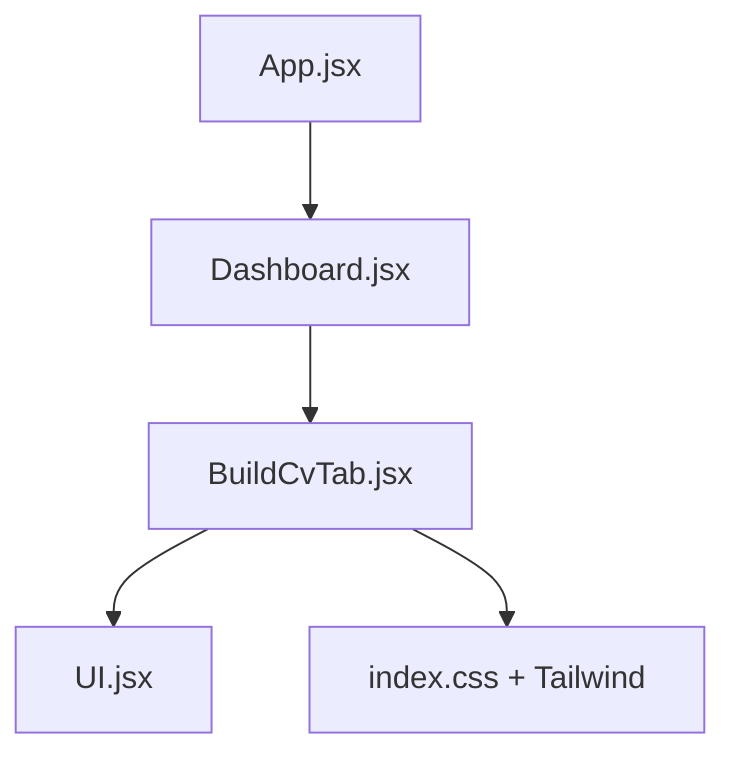
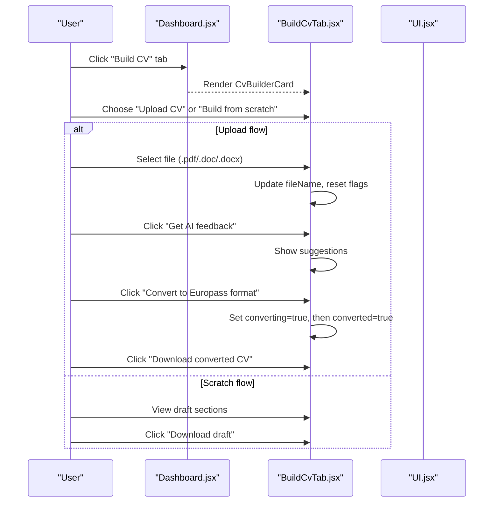
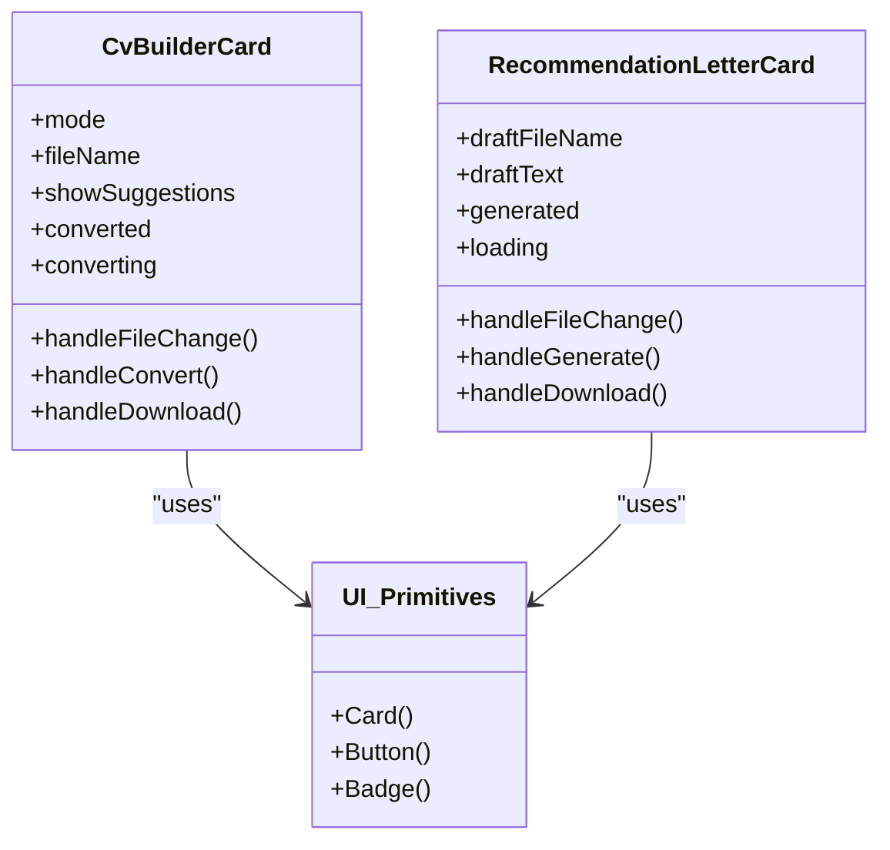
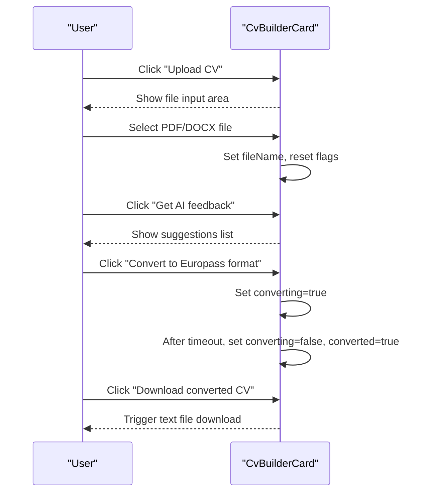
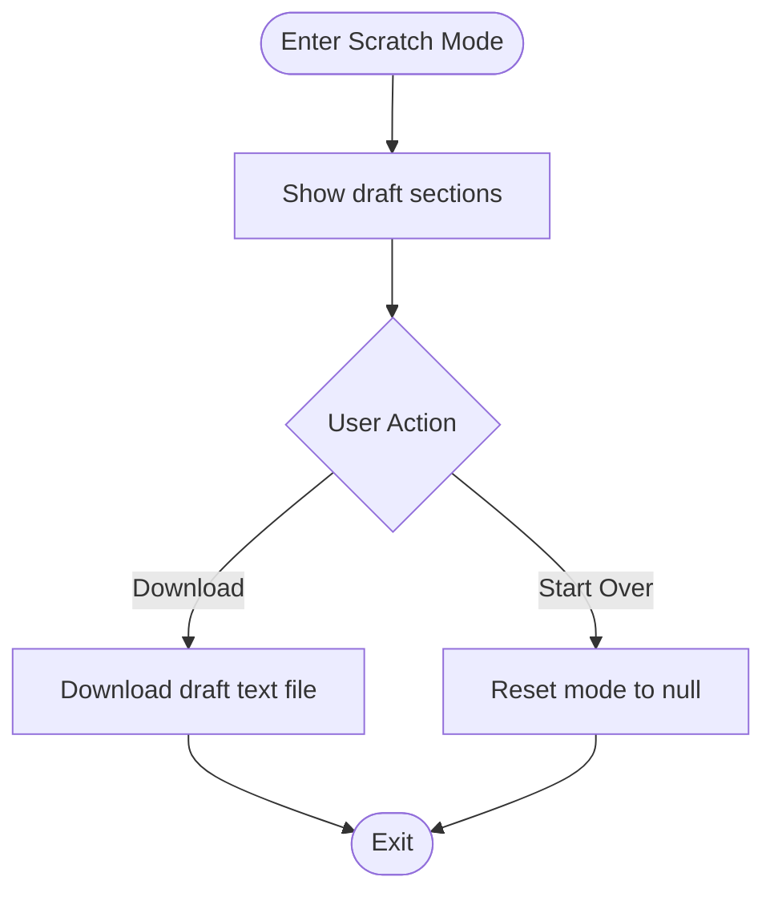
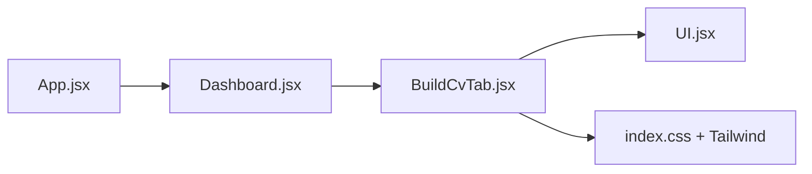

# CV Builder Interface

<cite>
**Referenced Files in This Document**
- [BuildCvTab.jsx](file://scholarpath-frontend (2)/scholarpath/src/pages/BuildCvTab.jsx)
- [UI.jsx](file://scholarpath-frontend (2)/scholarpath/src/components/UI.jsx)
- [Dashboard.jsx](file://scholarpath-frontend (2)/scholarpath/src/pages/Dashboard.jsx)
- [App.jsx](file://scholarpath-frontend (2)/scholarpath/src/App.jsx)
- [index.css](file://scholarpath-frontend (2)/scholarpath/src/index.css)
</cite>

## Table of Contents
1. [Introduction](#introduction)
2. [Project Structure](#project-structure)
3. [Core Components](#core-components)
4. [Architecture Overview](#architecture-overview)
5. [Detailed Component Analysis](#detailed-component-analysis)
6. [Dependency Analysis](#dependency-analysis)
7. [Performance Considerations](#performance-considerations)
8. [Troubleshooting Guide](#troubleshooting-guide)
9. [Conclusion](#conclusion)

## Introduction
This document explains the CV builder interface component that enables users to either upload an existing CV or create one from scratch. It covers dual-mode interaction, file handling for PDF and DOCX formats, state management across UI modes, responsive design patterns, and user feedback mechanisms such as loading states and success indicators. The goal is to provide both a high-level understanding and detailed implementation insights for developers and product stakeholders.

## Project Structure
The CV builder lives under the dashboard’s “Build CV” tab and is composed of:
- A page-level component that implements the dual-mode interface and file workflows
- Reusable UI primitives for cards, buttons, and badges
- A dashboard shell that renders the tabbed content
- Global styles and Tailwind utilities for responsive behavior

**Diagram sources**
- [App.jsx:5-13](file://scholarpath-frontend (2)/scholarpath/src/App.jsx#L5-L13)
- [Dashboard.jsx:128-180](file://scholarpath-frontend (2)/scholarpath/src/pages/Dashboard.jsx#L128-L180)
- [BuildCvTab.jsx:276-283](file://scholarpath-frontend (2)/scholarpath/src/pages/BuildCvTab.jsx#L276-L283)
- [UI.jsx:1-47](file://scholarpath-frontend (2)/scholarpath/src/components/UI.jsx#L1-L47)

**Section sources**
- [App.jsx:5-13](file://scholarpath-frontend (2)/scholarpath/src/App.jsx#L5-L13)
- [Dashboard.jsx:128-180](file://scholarpath-frontend (2)/scholarpath/src/pages/Dashboard.jsx#L128-L180)
- [BuildCvTab.jsx:276-283](file://scholarpath-frontend (2)/scholarpath/src/pages/BuildCvTab.jsx#L276-L283)
- [UI.jsx:1-47](file://scholarpath-frontend (2)/scholarpath/src/components/UI.jsx#L1-L47)

## Core Components
- CvBuilderCard: Implements the dual-mode interface with “Upload CV” and “Build from scratch” flows, including file selection, conversion simulation, suggestions display, and download actions.
- RecommendationLetterCard: Supports optional draft upload and text input, with AI generation simulation and download.
- UI Primitives: Card, Button, Badge components used consistently across the interface.

Key responsibilities:
- Mode switching between upload and scratch
- File selection and display of selected filename
- Simulated conversion workflow with loading and success states
- Downloading generated outputs as text files
- Displaying AI suggestions and structured draft sections

**Section sources**
- [BuildCvTab.jsx:54-194](file://scholarpath-frontend (2)/scholarpath/src/pages/BuildCvTab.jsx#L54-L194)
- [BuildCvTab.jsx:196-274](file://scholarpath-frontend (2)/scholarpath/src/pages/BuildCvTab.jsx#L196-L274)
- [UI.jsx:1-47](file://scholarpath-frontend (2)/scholarpath/src/components/UI.jsx#L1-L47)

## Architecture Overview
The CV builder is embedded within the dashboard’s tab system. Users navigate to “Build CV,” where they choose between two modes. The component manages local state for mode, file name, suggestions visibility, conversion status, and loading indicators. UI primitives are reused to maintain consistency.

**Diagram sources**
- [Dashboard.jsx:128-180](file://scholarpath-frontend (2)/scholarpath/src/pages/Dashboard.jsx#L128-L180)
- [BuildCvTab.jsx:54-194](file://scholarpath-frontend (2)/scholarpath/src/pages/BuildCvTab.jsx#L54-L194)
- [UI.jsx:9-24](file://scholarpath-frontend (2)/scholarpath/src/components/UI.jsx#L9-L24)

## Detailed Component Analysis

### Dual-Mode Interface and State Management
- Modes:
  - null: Initial state showing two action buttons (“Upload CV”, “I don’t have a CV — build one”)
  - 'upload': File upload area with actions for AI feedback and conversion
  - 'scratch': Draft sections with download option
- Local state variables:
  - mode: Controls which view is shown
  - fileName: Stores the selected file name
  - showSuggestions: Toggles AI suggestions list
  - converted: Indicates successful conversion completion
  - converting: Loading indicator during conversion

State transitions:
- From null to 'upload' or 'scratch' via button clicks
- From 'upload' back to null via “Start over”
- Converting toggles true briefly before setting converted to true
- Suggestions toggle on/off independently

**Section sources**
- [BuildCvTab.jsx:54-194](file://scholarpath-frontend (2)/scholarpath/src/pages/BuildCvTab.jsx#L54-L194)

### File Handling Logic for PDF and DOCX
- Accepts .pdf, .doc, .docx via hidden file input
- Displays selected file name after selection
- Shows size guidance text indicating “up to 10MB”
- No explicit client-side size validation is implemented; guidance is informational only

Behavioral notes:
- On file change, the component updates fileName and resets suggestion and conversion states
- Conversion triggers a simulated async process with a short timeout to mimic server work

**Section sources**
- [BuildCvTab.jsx:61-76](file://scholarpath-frontend (2)/scholarpath/src/pages/BuildCvTab.jsx#L61-L76)
- [BuildCvTab.jsx:102-126](file://scholarpath-frontend (2)/scholarpath/src/pages/BuildCvTab.jsx#L102-L126)
- [BuildCvTab.jsx:108-109](file://scholarpath-frontend (2)/scholarpath/src/pages/BuildCvTab.jsx#L108-L109)

### User Interaction Patterns and Feedback
- Loading states:
  - “Converting…” button text while converting
  - “Generating…” button text during recommendation letter generation
- Success indicators:
  - “Converted” badge and message after conversion completes
  - “AI-generated” badge and rendered output for recommendation letter
- Actions:
  - “Get AI feedback” reveals curated suggestions
  - “Download converted CV” and “Download draft” trigger text file downloads
  - “Start over” resets all relevant states

**Section sources**
- [BuildCvTab.jsx:70-80](file://scholarpath-frontend (2)/scholarpath/src/pages/BuildCvTab.jsx#L70-L80)
- [BuildCvTab.jsx:112-152](file://scholarpath-frontend (2)/scholarpath/src/pages/BuildCvTab.jsx#L112-L152)
- [BuildCvTab.jsx:163-191](file://scholarpath-frontend (2)/scholarpath/src/pages/BuildCvTab.jsx#L163-L191)
- [BuildCvTab.jsx:207-225](file://scholarpath-frontend (2)/scholarpath/src/pages/BuildCvTab.jsx#L207-L225)
- [BuildCvTab.jsx:252-270](file://scholarpath-frontend (2)/scholarpath/src/pages/BuildCvTab.jsx#L252-L270)

### Responsive Design Patterns
- Layout uses Tailwind utility classes for spacing, alignment, and grid layouts
- Buttons and inputs adapt to screen sizes using flex-wrap and responsive spacing
- Cards provide consistent visual containers with borders and shadows
- Global styles set base typography and background color; animations respect reduced motion preferences

**Section sources**
- [BuildCvTab.jsx:82-194](file://scholarpath-frontend (2)/scholarpath/src/pages/BuildCvTab.jsx#L82-L194)
- [UI.jsx:1-47](file://scholarpath-frontend (2)/scholarpath/src/components/UI.jsx#L1-L47)
- [index.css:1-35](file://scholarpath-frontend (2)/scholarpath/src/index.css#L1-L35)

### Class Relationships and Data Flow

**Diagram sources**
- [BuildCvTab.jsx:54-194](file://scholarpath-frontend (2)/scholarpath/src/pages/BuildCvTab.jsx#L54-L194)
- [BuildCvTab.jsx:196-274](file://scholarpath-frontend (2)/scholarpath/src/pages/BuildCvTab.jsx#L196-L274)
- [UI.jsx:1-47](file://scholarpath-frontend (2)/scholarpath/src/components/UI.jsx#L1-L47)

### Upload Workflow Sequence

**Diagram sources**
- [BuildCvTab.jsx:61-80](file://scholarpath-frontend (2)/scholarpath/src/pages/BuildCvTab.jsx#L61-L80)
- [BuildCvTab.jsx:112-138](file://scholarpath-frontend (2)/scholarpath/src/pages/BuildCvTab.jsx#L112-L138)

### Scratch Mode Flowchart

**Diagram sources**
- [BuildCvTab.jsx:163-191](file://scholarpath-frontend (2)/scholarpath/src/pages/BuildCvTab.jsx#L163-L191)

## Dependency Analysis
- BuildCvTab depends on UI primitives for consistent styling and interaction
- Dashboard composes BuildCvTab into its tabbed layout
- App sets up routing and mounts Dashboard
- Global CSS provides base styles and animation support

**Diagram sources**
- [App.jsx:5-13](file://scholarpath-frontend (2)/scholarpath/src/App.jsx#L5-L13)
- [Dashboard.jsx:128-180](file://scholarpath-frontend (2)/scholarpath/src/pages/Dashboard.jsx#L128-L180)
- [BuildCvTab.jsx:276-283](file://scholarpath-frontend (2)/scholarpath/src/pages/BuildCvTab.jsx#L276-L283)
- [UI.jsx:1-47](file://scholarpath-frontend (2)/scholarpath/src/components/UI.jsx#L1-L47)

**Section sources**
- [App.jsx:5-13](file://scholarpath-frontend (2)/scholarpath/src/App.jsx#L5-L13)
- [Dashboard.jsx:128-180](file://scholarpath-frontend (2)/scholarpath/src/pages/Dashboard.jsx#L128-L180)
- [BuildCvTab.jsx:276-283](file://scholarpath-frontend (2)/scholarpath/src/pages/BuildCvTab.jsx#L276-L283)
- [UI.jsx:1-47](file://scholarpath-frontend (2)/scholarpath/src/components/UI.jsx#L1-L47)

## Performance Considerations
- Local state minimizes re-renders by keeping UI-specific flags close to the component
- Simulated async operations use short timeouts to avoid blocking the UI thread
- Text-based downloads are lightweight and do not require heavy processing
- Using Tailwind utilities reduces custom CSS overhead and leverages optimized utility classes

[No sources needed since this section provides general guidance]

## Troubleshooting Guide
Common issues and resolutions:
- File not accepted: Ensure the file extension matches .pdf, .doc, or .docx; verify browser compatibility for file inputs
- Size guidance vs validation: The interface displays “up to 10MB” guidance but does not enforce size limits; consider adding client-side validation if strict enforcement is required
- Conversion not completing: Check that the converting state resolves to converted; verify no errors in console during simulated conversion
- Downloads not triggering: Confirm browser allows downloads and that the generated blob URL is valid; ensure no ad blockers interfere

**Section sources**
- [BuildCvTab.jsx:61-76](file://scholarpath-frontend (2)/scholarpath/src/pages/BuildCvTab.jsx#L61-L76)
- [BuildCvTab.jsx:108-126](file://scholarpath-frontend (2)/scholarpath/src/pages/BuildCvTab.jsx#L108-L126)

## Conclusion
The CV builder interface provides a clear, dual-mode experience supporting both uploads and scratch creation. It uses local state to manage UI modes and interactions, offers immediate feedback through loading and success indicators, and employs responsive design patterns for a consistent experience across devices. While file size validation is currently informational, the structure supports future enhancements such as stricter validation and backend integration for real conversion and AI features.

[No sources needed since this section summarizes without analyzing specific files]