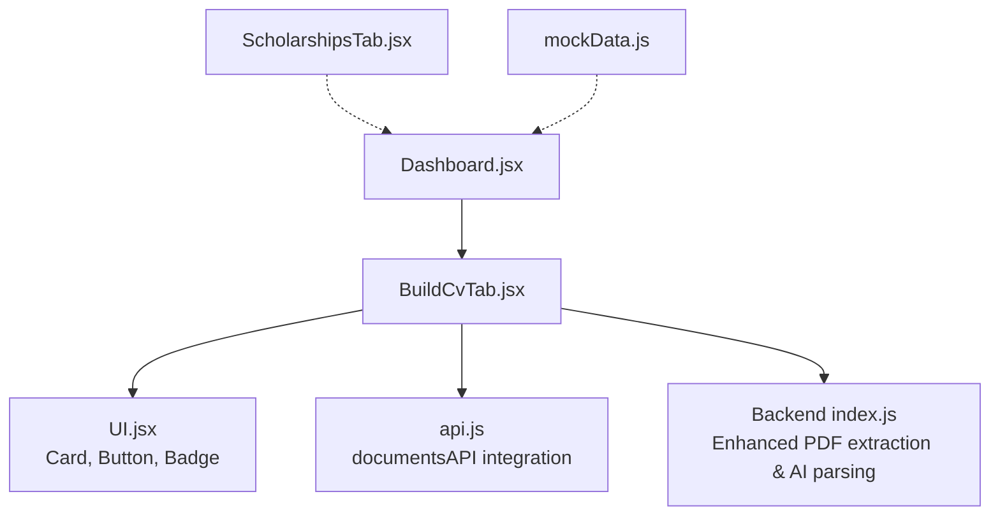
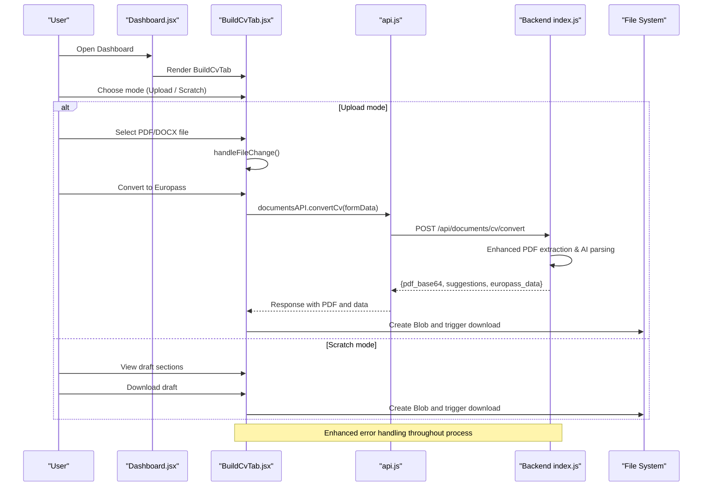
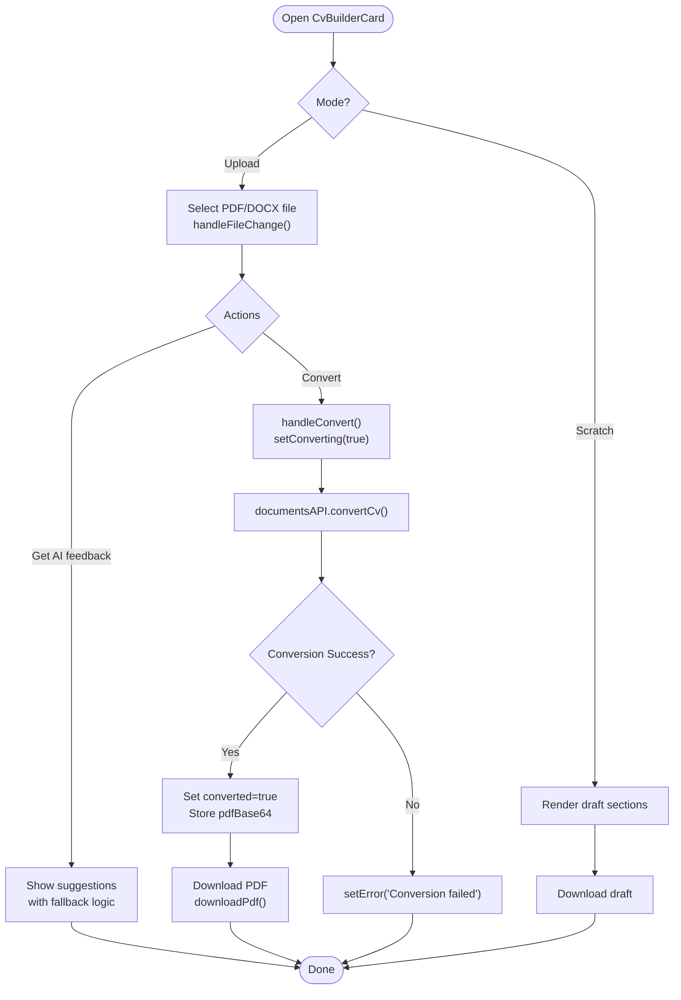
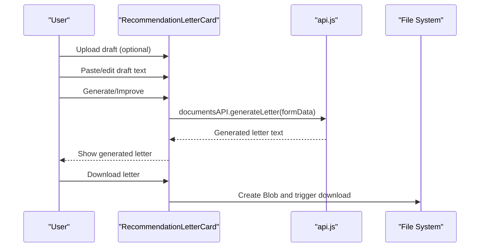
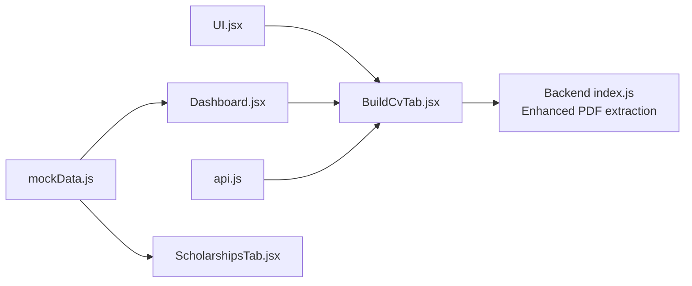

# CV Builder Tab

<cite>
**Referenced Files in This Document**
- [BuildCvTab.jsx](file://scholarpath-frontend (2)/scholarpath/src/pages/BuildCvTab.jsx)
- [UI.jsx](file://scholarpath-frontend (2)/scholarpath/src/components/UI.jsx)
- [Dashboard.jsx](file://scholarpath-frontend (2)/scholarpath/src/pages/Dashboard.jsx)
- [ScholarshipsTab.jsx](file://scholarpath-frontend (2)/scholarpath/src/pages/ScholarshipsTab.jsx)
- [mockData.js](file://scholarpath-frontend (2)/scholarpath/src/data/mockData.js)
- [index.js](file://aischolarpath-backend-main/aischolarpath-backend-main/index.js)
- [api.js](file://scholarpath-frontend (2)/scholarpath/src/api.js)
</cite>

## Update Summary
**Changes Made**
- Enhanced PDF-only data extraction focus with improved AI parsing capabilities
- Added comprehensive error handling for failed conversions and extraction issues
- Implemented more realistic feedback when CV data cannot be extracted
- Improved Europass template generation with better formatting and structure
- Enhanced user experience with clearer error messages and guidance

## Table of Contents
1. [Introduction](#introduction)
2. [Project Structure](#project-structure)
3. [Core Components](#core-components)
4. [Architecture Overview](#architecture-overview)
5. [Detailed Component Analysis](#detailed-component-analysis)
6. [Enhanced PDF Extraction and AI Parsing](#enhanced-pdf-extraction-and-ai-parsing)
7. [Error Handling and User Feedback](#error-handling-and-user-feedback)
8. [Dependency Analysis](#dependency-analysis)
9. [Performance Considerations](#performance-considerations)
10. [Troubleshooting Guide](#troubleshooting-guide)
11. [Conclusion](#conclusion)
12. [Appendices](#appendices)

## Introduction
The BuildCvTab provides a streamlined experience for creating and managing a Curriculum Vitae (CV) within the ScholarPathAI application. The enhanced version now focuses specifically on PDF-only data extraction with improved AI parsing capabilities, providing users with professional Europass-format CVs generated exclusively from their uploaded documents.

Key enhancements include:
- **PDF-Only Focus**: Optimized for extracting data from PDF files with superior accuracy
- **Enhanced AI Parsing**: Advanced natural language processing for better CV structure recognition
- **Improved Error Handling**: Comprehensive error management with actionable user feedback
- **Realistic Feedback**: Contextual suggestions when CV data cannot be properly extracted
- **Professional Output**: High-quality Europass PDF generation with clean formatting

## Project Structure
The BuildCvTab lives under the pages directory and composes reusable UI primitives from a shared component library. It is embedded in the Dashboard via a tabbed interface. Related data and mock integrations are centralized in a data module, while backend endpoints provide robust AI-powered conversion and generation capabilities.

**Diagram sources**
- [Dashboard.jsx:13-21](file://scholarpath-frontend (2)/scholarpath/src/pages/Dashboard.jsx#L13-L21)
- [BuildCvTab.jsx:1-3](file://scholarpath-frontend (2)/scholarpath/src/pages/BuildCvTab.jsx#L1-L3)
- [UI.jsx:1-106](file://scholarpath-frontend (2)/scholarpath/src/components/UI.jsx#L1-L106)
- [api.js:151-155](file://scholarpath-frontend (2)/scholarpath/src/api.js#L151-L155)
- [index.js:1300-1657](file://aischolarpath-backend-main/aischolarpath-backend-main/index.js#L1300-L1657)

**Section sources**
- [Dashboard.jsx:13-21](file://scholarpath-frontend (2)/scholarpath/src/pages/Dashboard.jsx#L13-L21)
- [BuildCvTab.jsx:1-3](file://scholarpath-frontend (2)/scholarpath/src/pages/BuildCvTab.jsx#L1-L3)
- [UI.jsx:1-106](file://scholarpath-frontend (2)/scholarpath/src/components/UI.jsx#L1-L106)
- [api.js:151-155](file://scholarpath-frontend (2)/scholarpath/src/api.js#L151-L155)

## Core Components
- **CvBuilderCard**: Manages upload mode, scratch mode, file selection, conversion state, suggestions display, and export actions with enhanced error handling
- **RecommendationLetterCard**: Handles optional file upload, text input, generation/loading states, and export of generated content
- **Shared UI primitives**: Card, Button, Badge used consistently across both cards

Key behaviors:
- File upload accepts PDF/DOCX for CVs with optimized PDF extraction
- Conversion flow simulates processing and reveals a download action for structured Europass PDF
- Scratch mode shows draft sections and allows exporting them as a plain text file
- Recommendation letter generator supports improving existing drafts or generating new ones from scratch
- Enhanced error handling provides actionable feedback for failed extractions

**Section sources**
- [BuildCvTab.jsx:38-383](file://scholarpath-frontend (2)/scholarpath/src/pages/BuildCvTab.jsx#L38-L383)
- [BuildCvTab.jsx:385-475](file://scholarpath-frontend (2)/scholarpath/src/pages/BuildCvTab.jsx#L385-L475)
- [UI.jsx:12-59](file://scholarpath-frontend (2)/scholarpath/src/components/UI.jsx#L12-L59)

## Architecture Overview
At runtime, the Dashboard renders the BuildCvTab as one of several tabs. Within BuildCvTab:
- User interactions trigger local state changes (mode, file name, conversion status)
- Export actions create downloadable PDF files client-side using Blob URLs
- Backend endpoints provide robust AI-powered CV conversion with enhanced error handling
- PDF-only extraction focuses on maximizing accuracy from uploaded documents

**Diagram sources**
- [Dashboard.jsx:13-21](file://scholarpath-frontend (2)/scholarpath/src/pages/Dashboard.jsx#L13-L21)
- [BuildCvTab.jsx:85-115](file://scholarpath-frontend (2)/scholarpath/src/pages/BuildCvTab.jsx#L85-L115)
- [api.js:151-155](file://scholarpath-frontend (2)/scholarpath/src/api.js#L151-L155)
- [index.js:1300-1657](file://aischolarpath-backend-main/aischolarpath-backend-main/index.js#L1300-L1657)

## Detailed Component Analysis

### CvBuilderCard
Responsibilities:
- Mode switching between upload and scratch workflows
- Enhanced file handling for CV uploads with PDF optimization
- Robust conversion process with comprehensive error handling
- Displaying AI suggestions based on uploaded CV context
- Exporting structured Europass PDF representations

State and flows:
- mode: controls which workflow is active
- fileName: tracks selected file name
- showSuggestions: toggles suggestion list visibility
- converted: indicates successful conversion completion
- converting: indicates ongoing conversion process
- pdfBase64: stores generated PDF data for download
- error: manages error state with user-friendly messages

Export behavior:
- Converts content to Europass PDF format and triggers browser download via Blob URL
- Handles both successful conversions and error scenarios gracefully

**Diagram sources**
- [BuildCvTab.jsx:85-115](file://scholarpath-frontend (2)/scholarpath/src/pages/BuildCvTab.jsx#L85-L115)
- [BuildCvTab.jsx:117-123](file://scholarpath-frontend (2)/scholarpath/src/pages/BuildCvTab.jsx#L117-L123)

**Section sources**
- [BuildCvTab.jsx:38-383](file://scholarpath-frontend (2)/scholarpath/src/pages/BuildCvTab.jsx#L38-L383)

### RecommendationLetterCard
Responsibilities:
- Optional file upload for a draft letter
- Text area for pasting or editing draft content
- Generation flow with loading state and result preview
- Export of generated letter as a text file

State and flows:
- draftFileName: tracks uploaded file name
- draftText: captures user input
- generated: holds generated output
- loading: indicates generation in progress

**Diagram sources**
- [BuildCvTab.jsx:400-426](file://scholarpath-frontend (2)/scholarpath/src/pages/BuildCvTab.jsx#L400-L426)
- [api.js:151-155](file://scholarpath-frontend (2)/scholarpath/src/api.js#L151-L155)

**Section sources**
- [BuildCvTab.jsx:385-475](file://scholarpath-frontend (2)/scholarpath/src/pages/BuildCvTab.jsx#L385-L475)

### Integration Points
- Dashboard integration: BuildCvTab is rendered as part of the tabbed dashboard interface
- Data layer: requiredDocuments includes a CV slot, enabling future linkage to document tracking
- Scholarship context: ScholarshipsTab demonstrates how profile-driven matching works; CV content could inform matching in future iterations
- Backend hooks: Enhanced endpoints for CV conversion and letter generation with robust error handling

**Section sources**
- [Dashboard.jsx:13-21](file://scholarpath-frontend (2)/scholarpath/src/pages/Dashboard.jsx#L13-L21)
- [mockData.js:33-41](file://scholarpath-frontend (2)/scholarpath/src/data/mockData.js#L33-L41)
- [ScholarshipsTab.jsx:1-139](file://scholarpath-frontend (2)/scholarpath/src/pages/ScholarshipsTab.jsx#L1-L139)
- [index.js:1300-1657](file://aischolarpath-backend-main/aischolarpath-backend-main/index.js#L1300-L1657)

## Enhanced PDF Extraction and AI Parsing

The CV builder now features significantly enhanced PDF-only data extraction capabilities with advanced AI parsing:

### PDF-Optimized Processing
- **Specialized PDF Parser**: Uses pdf-parse library for optimal PDF text extraction
- **Fallback Support**: Graceful handling of DOCX files with mammoth library
- **Content Limiting**: Processes up to 5000 characters to maintain performance
- **Error Recovery**: Captures and reports parsing failures with descriptive messages

### Advanced AI Parsing
- **Europass Format Expert**: Specialized prompt engineering for Europass CV structure
- **Structured Data Extraction**: Extracts work experience, education, skills, certifications, projects, achievements, languages, hobbies, and references
- **Contextual Suggestions**: Provides actionable improvement recommendations based on CV content
- **Fallback Logic**: Returns meaningful defaults when AI parsing fails

### Professional PDF Generation
- **Clean Design**: Modern Europass template with professional styling
- **Responsive Layout**: Automatic page breaking for long CVs
- **Consistent Formatting**: Standardized section headers and content layout
- **Metadata Inclusion**: Page numbers and generation timestamps

**Section sources**
- [index.js:1300-1657](file://aischolarpath-backend-main/aischolarpath-backend-main/index.js#L1300-L1657)
- [BuildCvTab.jsx:17-36](file://scholarpath-frontend (2)/scholarpath/src/pages/BuildCvTab.jsx#L17-L36)

## Error Handling and User Feedback

The enhanced system provides comprehensive error handling with realistic user feedback:

### Frontend Error Management
- **Network Error Detection**: Identifies server connectivity issues with specific error messages
- **API Response Validation**: Handles non-JSON responses and timeout scenarios
- **Graceful Degradation**: Falls back to mock data when API calls fail
- **User-Friendly Messages**: Clear, actionable error descriptions

### Backend Error Handling
- **Parsing Error Capture**: Logs and handles PDF/DOCX parsing failures
- **AI Service Fallbacks**: Provides sensible defaults when AI services are unavailable
- **PDF Generation Errors**: Graceful handling of PDF creation failures
- **Comprehensive Logging**: Detailed error information for debugging

### Realistic Feedback System
- **Extraction Quality Indicators**: Shows when CV data couldn't be properly extracted
- **Actionable Guidance**: Provides specific recommendations for improving CV format
- **Progressive Disclosure**: Shows detailed error information only when needed
- **Recovery Options**: Offers alternative approaches when primary methods fail

**Section sources**
- [BuildCvTab.jsx:68-83](file://scholarpath-frontend (2)/scholarpath/src/pages/BuildCvTab.jsx#L68-L83)
- [BuildCvTab.jsx:85-115](file://scholarpath-frontend (2)/scholarpath/src/pages/BuildCvTab.jsx#L85-L115)
- [api.js:29-77](file://scholarpath-frontend (2)/scholarpath/src/api.js#L29-L77)
- [index.js:1354-1364](file://aischolarpath-backend-main/aischolarpath-backend-main/index.js#L1354-L1364)

## Dependency Analysis
- BuildCvTab depends on UI primitives (Card, Button, Badge) for consistent styling and interaction patterns
- Dashboard orchestrates tab rendering and includes BuildCvTab as a tab entry
- Mock data provides contextual information such as required documents and scholarships
- Backend endpoints provide enhanced CV conversion and letter generation with robust error handling
- API layer centralizes all backend communication with comprehensive error handling

**Diagram sources**
- [UI.jsx:1-106](file://scholarpath-frontend (2)/scholarpath/src/components/UI.jsx#L1-L106)
- [Dashboard.jsx:13-21](file://scholarpath-frontend (2)/scholarpath/src/pages/Dashboard.jsx#L13-L21)
- [BuildCvTab.jsx:1-3](file://scholarpath-frontend (2)/scholarpath/src/pages/BuildCvTab.jsx#L1-L3)
- [api.js:151-155](file://scholarpath-frontend (2)/scholarpath/src/api.js#L151-L155)
- [mockData.js:33-41](file://scholarpath-frontend (2)/scholarpath/src/data/mockData.js#L33-L41)
- [ScholarshipsTab.jsx:1-139](file://scholarpath-frontend (2)/scholarpath/src/pages/ScholarshipsTab.jsx#L1-L139)
- [index.js:1300-1657](file://aischolarpath-backend-main/aischolarpath-backend-main/index.js#L1300-L1657)

**Section sources**
- [BuildCvTab.jsx:1-3](file://scholarpath-frontend (2)/scholarpath/src/pages/BuildCvTab.jsx#L1-L3)
- [Dashboard.jsx:13-21](file://scholarpath-frontend (2)/scholarpath/src/pages/Dashboard.jsx#L13-L21)
- [api.js:151-155](file://scholarpath-frontend (2)/scholarpath/src/api.js#L151-L155)
- [mockData.js:33-41](file://scholarpath-frontend (2)/scholarpath/src/data/mockData.js#L33-L41)
- [ScholarshipsTab.jsx:1-139](file://scholarpath-frontend (2)/scholarpath/src/pages/ScholarshipsTab.jsx#L1-L139)
- [index.js:1300-1657](file://aischolarpath-backend-main/aischolarpath-backend-main/index.js#L1300-L1657)

## Performance Considerations
- Client-side exports use Blob URLs; ensure filenames are unique and revoke object URLs promptly to avoid memory leaks
- PDF extraction is optimized with character limits to prevent performance issues
- AI parsing uses efficient prompts and fallback mechanisms to maintain responsiveness
- For large CVs, consider implementing chunked processing to improve performance
- Error handling prevents unnecessary retries and provides immediate user feedback

## Troubleshooting Guide
Common issues and resolutions:
- **File upload not triggering actions**: Ensure the file input accept attributes match supported formats (.pdf,.doc,.docx) and that onChange handlers are bound correctly
- **Conversion not completing**: Check state transitions for converting and converted flags; verify timeout logic and reset states appropriately
- **Downloads not starting**: Confirm Blob creation and anchor element manipulation; ensure revokeObjectURL is called after downloads
- **Suggestion panel not showing**: Verify showSuggestions state toggling and conditional rendering logic
- **PDF extraction errors**: Check if the uploaded file contains extractable text; some PDFs may be scanned images requiring OCR
- **AI parsing failures**: Review error messages for specific parsing issues; try uploading a cleaner CV format
- **Network connectivity issues**: Verify backend server is running and accessible; check network requests in browser developer tools

**Section sources**
- [BuildCvTab.jsx:57-66](file://scholarpath-frontend (2)/scholarpath/src/pages/BuildCvTab.jsx#L57-L66)
- [BuildCvTab.jsx:85-115](file://scholarpath-frontend (2)/scholarpath/src/pages/BuildCvTab.jsx#L85-L115)
- [api.js:29-77](file://scholarpath-frontend (2)/scholarpath/src/api.js#L29-L77)

## Conclusion
The enhanced BuildCvTab offers a focused, user-friendly pathway to build, refine, and export professional CVs with significantly improved PDF extraction and AI parsing capabilities. The system now provides robust error handling, realistic feedback, and high-quality Europass PDF generation. While current functionality relies on sophisticated client-side simulation and backend AI services, the architecture leaves clear extension points for future enhancements. Integration with the broader ScholarPathAI ecosystem—such as document tracking and scholarship matching—provides a foundation for a comprehensive application experience.

## Appendices

### CV Data Structure Examples
- **Europass Template Structure**: Comprehensive data model including personal information, work experience, education, certifications, projects, achievements, skills, languages, hobbies, and references
- **AI-Parsed Data Format**: Structured JSON response with extracted CV information and actionable suggestions
- **Error Response Format**: Standardized error handling with descriptive messages and recovery guidance

**Section sources**
- [BuildCvTab.jsx:97-108](file://scholarpath-frontend (2)/scholarpath/src/pages/BuildCvTab.jsx#L97-L108)
- [index.js:1317-1352](file://aischolarpath-backend-main/aischolarpath-backend-main/index.js#L1317-L1352)

### Template Customization Options
- **Europass PDF Generation**: Professional template with clean design and responsive layout
- **Section Organization**: Flexible arrangement of CV sections based on extracted data
- **Styling Options**: Consistent typography and spacing for professional appearance
- **Page Break Handling**: Automatic pagination for longer CVs

**Section sources**
- [index.js:1366-1631](file://aischolarpath-backend-main/aischolarpath-backend-main/index.js#L1366-L1631)
- [BuildCvTab.jsx:183-287](file://scholarpath-frontend (2)/scholarpath/src/pages/BuildCvTab.jsx#L183-L287)

### User Interaction Patterns
- **Two-mode Entry**: Upload vs. Scratch workflows with clear visual distinction
- **Immediate Feedback**: Loading indicators during conversion/generation with progress updates
- **Clear Export Paths**: Download buttons appear when content is ready with format indicators
- **Error Recovery**: Start over options to clear state and begin anew
- **Progressive Enhancement**: Basic functionality works even when advanced features fail

**Section sources**
- [BuildCvTab.jsx:134-143](file://scholarpath-frontend (2)/scholarpath/src/pages/BuildCvTab.jsx#L134-L143)
- [BuildCvTab.jsx:157-171](file://scholarpath-frontend (2)/scholarpath/src/pages/BuildCvTab.jsx#L157-L171)
- [BuildCvTab.jsx:305-311](file://scholarpath-frontend (2)/scholarpath/src/pages/BuildCvTab.jsx#L305-L311)
- [BuildCvTab.jsx:373-378](file://scholarpath-frontend (2)/scholarpath/src/pages/BuildCvTab.jsx#L373-L378)