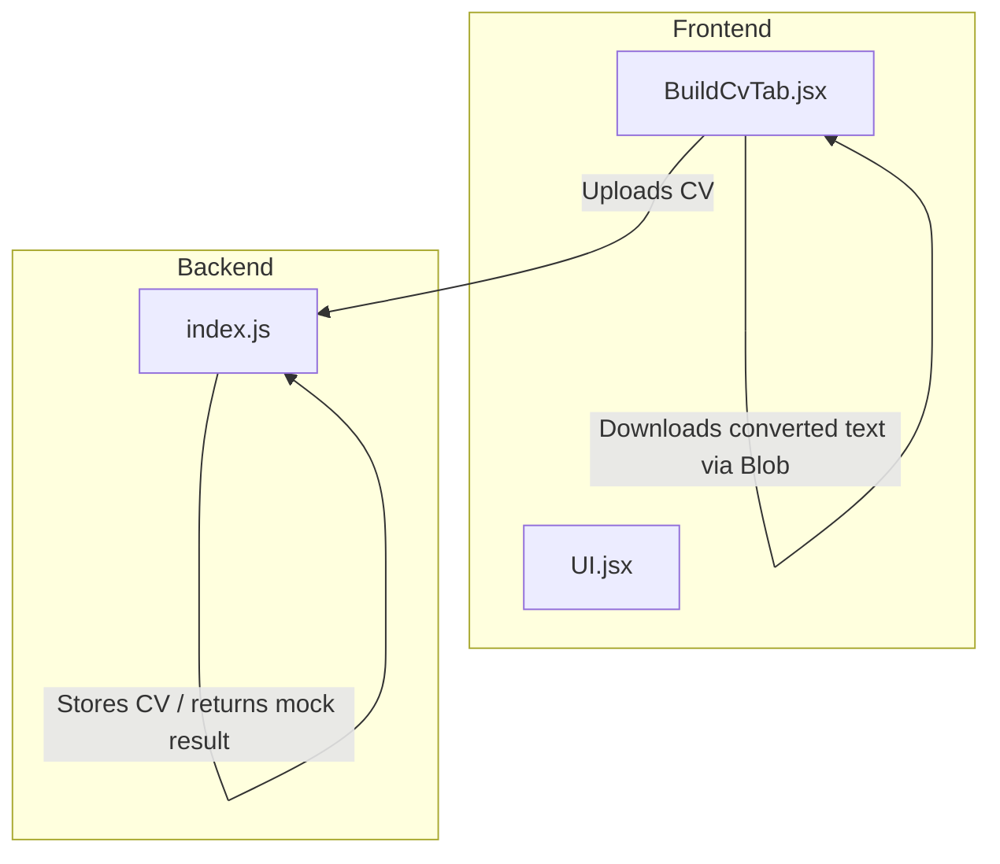
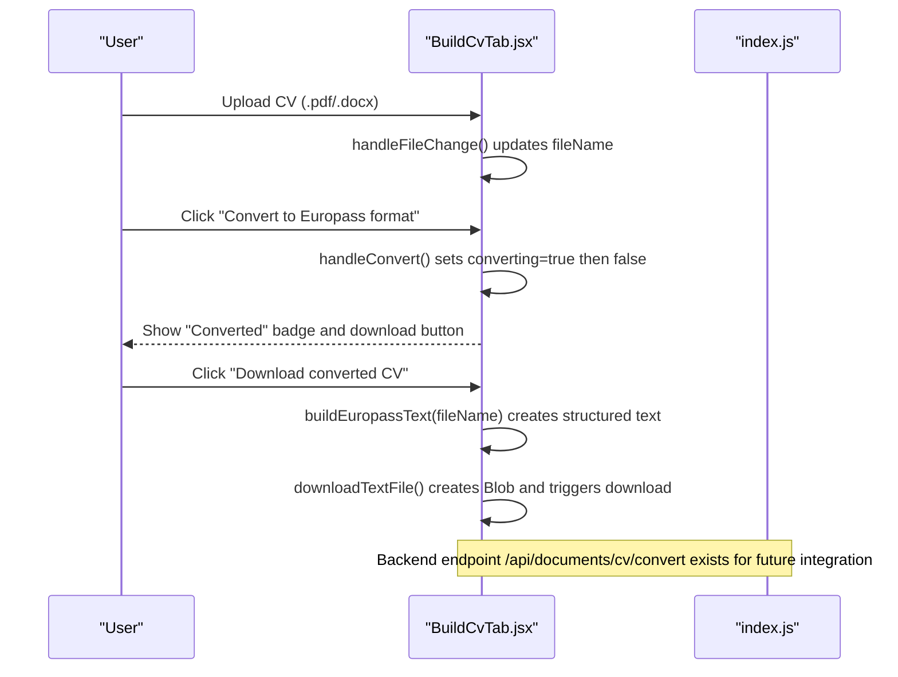
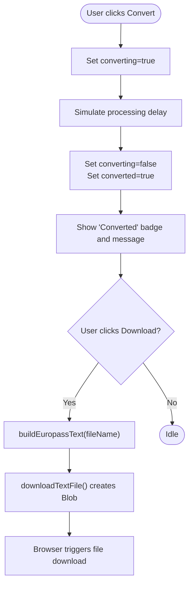
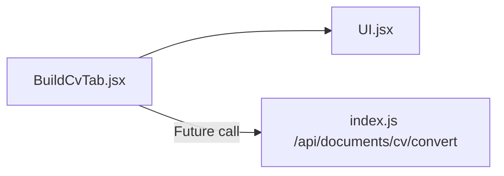

# Europass Format Conversion

<cite>
**Referenced Files in This Document**
- [BuildCvTab.jsx](file://scholarpath-frontend (2)/scholarpath/src/pages/BuildCvTab.jsx)
- [UI.jsx](file://scholarpath-frontend (2)/scholarpath/src/components/UI.jsx)
- [index.js](file://aischolarpath-backend-main/aischolarpath-backend-main/index.js)
- [mockData.js](file://scholarpath-frontend (2)/scholarpath/src/data/mockData.js)
</cite>

## Table of Contents
1. [Introduction](#introduction)
2. [Project Structure](#project-structure)
3. [Core Components](#core-components)
4. [Architecture Overview](#architecture-overview)
5. [Detailed Component Analysis](#detailed-component-analysis)
6. [Dependency Analysis](#dependency-analysis)
7. [Performance Considerations](#performance-considerations)
8. [Troubleshooting Guide](#troubleshooting-guide)
9. [Conclusion](#conclusion)
10. [Appendices](#appendices)

## Introduction
This document explains the Europass format conversion functionality that transforms uploaded CVs into a standardized Europass layout. The current implementation uses a text-based conversion approach to restructure CV content into Europass-style sections for personal information, work experience, education and training, and personal skills. It also covers file download mechanisms using Blob objects and the preview system that shows conversion status. Finally, it outlines supported input formats, output structure, integration points with the broader CV building workflow, limitations, and potential enhancements for full PDF/DOCX generation.

## Project Structure
The Europass conversion feature spans both frontend and backend:
- Frontend: A React page provides upload, conversion simulation, preview, and download capabilities.
- Backend: An Express API exposes endpoints for CV upload and conversion placeholders, integrating with storage and future AI processing.

**Diagram sources**
- [BuildCvTab.jsx:17-80](file://scholarpath-frontend (2)/scholarpath/src/pages/BuildCvTab.jsx#L17-L80)
- [index.js:934-949](file://aischolarpath-backend-main/aischolarpath-backend-main/index.js#L934-L949)

**Section sources**
- [BuildCvTab.jsx:1-284](file://scholarpath-frontend (2)/scholarpath/src/pages/BuildCvTab.jsx#L1-L284)
- [index.js:934-949](file://aischolarpath-backend-main/aischolarpath-backend-main/index.js#L934-L949)

## Core Components
- BuildCvTab component: Handles user interactions for uploading a CV, simulating conversion, showing status, and downloading the converted text.
- UI components: Reusable Card, Button, and Badge used to render the interface consistently.
- Backend API: Accepts CV uploads and provides a placeholder conversion endpoint returning a mock success response and download URL.

Key responsibilities:
- File acceptance and validation at the UI layer (PDF/DOCX).
- Conversion state management and preview feedback.
- Text-based Europass template assembly for download.
- Backend stub for future real conversion logic.

**Section sources**
- [BuildCvTab.jsx:54-193](file://scholarpath-frontend (2)/scholarpath/src/pages/BuildCvTab.jsx#L54-L193)
- [UI.jsx:1-47](file://scholarpath-frontend (2)/scholarpath/src/components/UI.jsx#L1-L47)
- [index.js:934-949](file://aischolarpath-backend-main/aischolarpath-backend-main/index.js#L934-L949)

## Architecture Overview
The Europass conversion flow is currently a client-side simulation with a backend placeholder ready for integration.

**Diagram sources**
- [BuildCvTab.jsx:61-80](file://scholarpath-frontend (2)/scholarpath/src/pages/BuildCvTab.jsx#L61-L80)
- [index.js:934-949](file://aischolarpath-backend-main/aischolarpath-backend-main/index.js#L934-L949)

## Detailed Component Analysis

### BuildCvTab.jsx: Europass Conversion Flow
- File upload: Accepts .pdf, .doc, .docx files up to 10MB; stores selected file name.
- Conversion simulation: Toggles converting state briefly to simulate processing time.
- Preview: Displays a “Converted” badge and message when conversion completes.
- Download: Generates a text-based Europass template and downloads it using a Blob object.

Conversion algorithm (text-based):
- Assembles a structured Europass-like text including:
  - Personal Information section
  - Work Experience section with table-like placeholders
  - Education and Training section with table-like placeholders
  - Personal Skills section with language and skill categories
- Uses the uploaded file name to annotate the header.

Supported input formats:
- PDF, DOC, DOCX (client-side accept attribute).

Output structure:
- Plain text file named cv_europass_format.txt containing the Europass-style sections.

Integration with CV workflow:
- Works alongside AI feedback suggestions and draft builder features within the same tab.

**Diagram sources**
- [BuildCvTab.jsx:70-80](file://scholarpath-frontend (2)/scholarpath/src/pages/BuildCvTab.jsx#L70-L80)

**Section sources**
- [BuildCvTab.jsx:17-80](file://scholarpath-frontend (2)/scholarpath/src/pages/BuildCvTab.jsx#L17-L80)
- [BuildCvTab.jsx:102-138](file://scholarpath-frontend (2)/scholarpath/src/pages/BuildCvTab.jsx#L102-L138)

### UI.jsx: Reusable Interface Elements
- Card: Container for sections like the CV builder.
- Button: Primary and secondary variants for actions such as convert and download.
- Badge: Visual indicators for status like “Converted”.

These components are used throughout the BuildCvTab to provide consistent styling and behavior.

**Section sources**
- [UI.jsx:1-47](file://scholarpath-frontend (2)/scholarpath/src/components/UI.jsx#L1-L47)

### Backend index.js: Conversion Endpoint Placeholder
- Endpoint: POST /api/documents/cv/convert
- Input: Single file field named cv
- Behavior: Validates presence of file, returns a mock success response with a download_url placeholder
- Purpose: Serves as an integration point for future real conversion logic (e.g., calling an AI teammate’s endpoint or generating formatted PDF/DOCX)

Current limitation:
- No actual parsing or formatting occurs; returns mock data.

Future enhancement:
- Replace mock logic with real CV parsing and Europass PDF/DOCX generation.

**Section sources**
- [index.js:934-949](file://aischolarpath-backend-main/aischolarpath-backend-main/index.js#L934-L949)

### Data Layer: mockData.js
- Provides static data for other parts of the application (e.g., required documents, matches, FAQs).
- Not directly involved in Europass conversion but supports overall CV workflow context.

**Section sources**
- [mockData.js:35-41](file://scholarpath-frontend (2)/scholarpath/src/data/mockData.js#L35-L41)

## Dependency Analysis
- BuildCvTab depends on UI components for rendering and local state for conversion flow.
- Backend endpoint is decoupled from frontend conversion logic; currently not invoked by the frontend conversion flow.
- Future integration would connect frontend conversion to backend processing for real parsing and formatting.

**Diagram sources**
- [BuildCvTab.jsx:1-3](file://scholarpath-frontend (2)/scholarpath/src/pages/BuildCvTab.jsx#L1-L3)
- [index.js:934-949](file://aischolarpath-backend-main/aischolarpath-backend-main/index.js#L934-L949)

**Section sources**
- [BuildCvTab.jsx:1-3](file://scholarpath-frontend (2)/scholarpath/src/pages/BuildCvTab.jsx#L1-L3)
- [index.js:934-949](file://aischolarpath-backend-main/aischolarpath-backend-main/index.js#L934-L949)

## Performance Considerations
- Client-side Blob creation and download are lightweight and do not block the main thread significantly.
- Conversion simulation uses a short timeout to mimic processing; this can be replaced with real async operations later.
- Avoid large template strings; consider streaming or server-side generation for complex outputs.

[No sources needed since this section provides general guidance]

## Troubleshooting Guide
Common issues and resolutions:
- File not accepted: Ensure the file type matches .pdf, .doc, or .docx and size is under 10MB.
- Conversion does not complete: Check browser console for errors; verify that the converting state toggles correctly.
- Download fails: Confirm that the Blob creation succeeds and the anchor element is appended before triggering click.
- Backend integration errors: If connecting to /api/documents/cv/convert, ensure proper authentication and file field naming.

**Section sources**
- [BuildCvTab.jsx:61-80](file://scholarpath-frontend (2)/scholarpath/src/pages/BuildCvTab.jsx#L61-L80)
- [index.js:934-949](file://aischolarpath-backend-main/aischolarpath-backend-main/index.js#L934-L949)

## Conclusion
The Europass conversion feature currently offers a text-based structural preview and downloadable template, enabling users to see how their CV would map to the Europass layout. While the backend endpoint is prepared for future integration, the frontend handles conversion simulation and download via Blob objects. Enhancements should focus on real CV parsing, robust error handling, and generating fully formatted PDF/DOCX outputs aligned with official Europass standards.

[No sources needed since this section summarizes without analyzing specific files]

## Appendices

### Supported Input Formats
- PDF, DOC, DOCX (client-side accept attribute)

### Output Structure
- Plain text file with Europass-style sections:
  - Personal Information
  - Work Experience (table-like placeholders)
  - Education and Training (table-like placeholders)
  - Personal Skills (language and skill categories)

### Integration Points
- Frontend: BuildCvTab.jsx manages user interactions and local conversion flow.
- Backend: index.js provides a placeholder endpoint for future real conversion logic.

**Section sources**
- [BuildCvTab.jsx:102-138](file://scholarpath-frontend (2)/scholarpath/src/pages/BuildCvTab.jsx#L102-L138)
- [index.js:934-949](file://aischolarpath-backend-main/aischolarpath-backend-main/index.js#L934-L949)