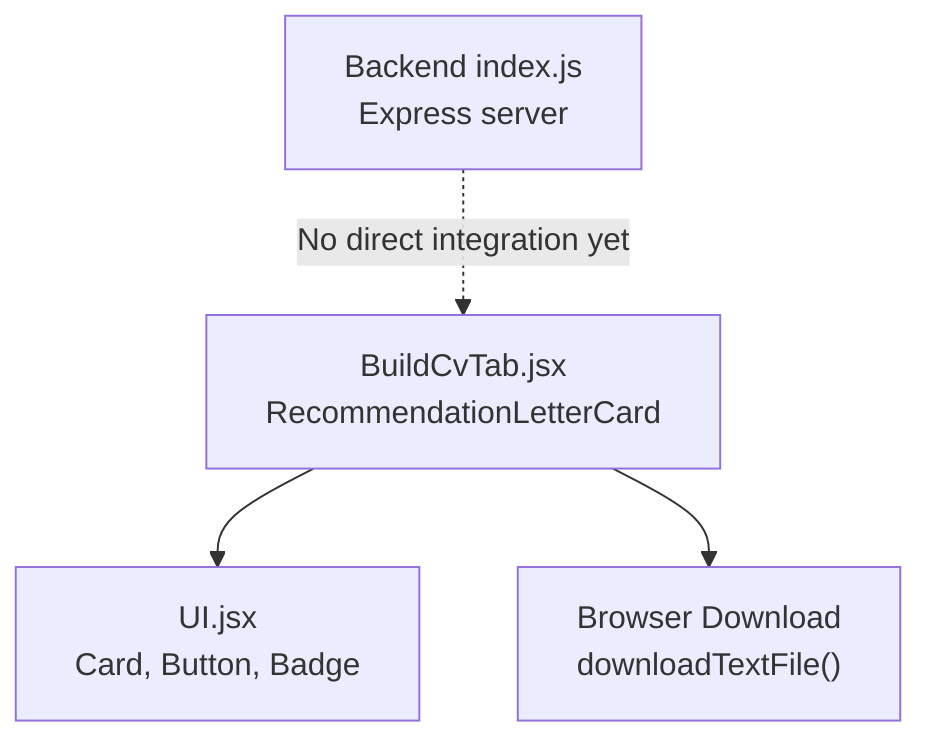
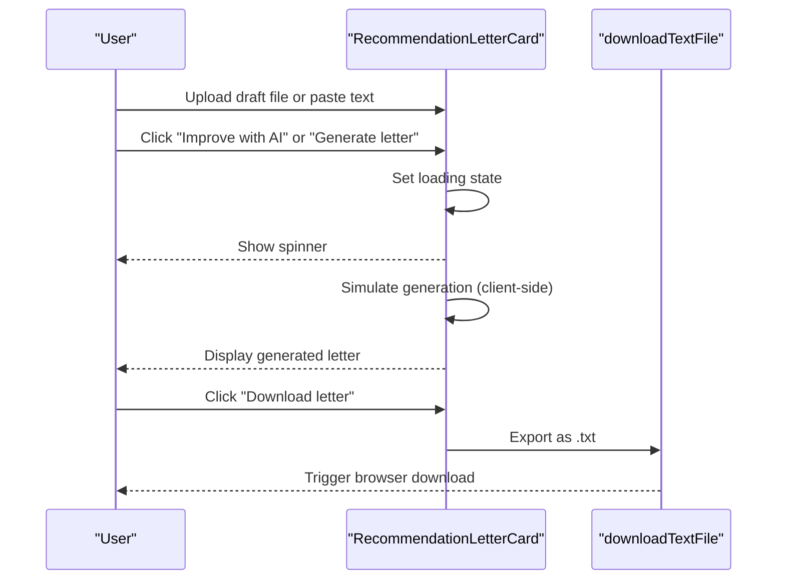
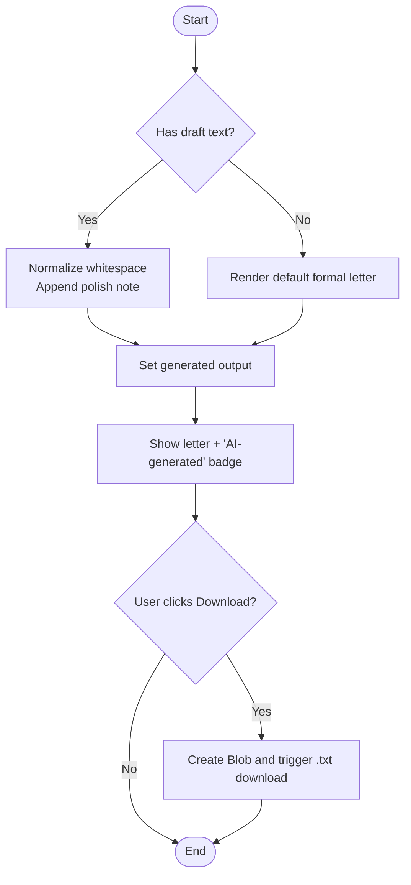
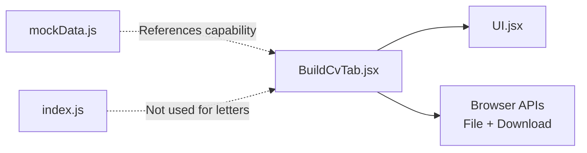

# Recommendation Letter Generator

<cite>
**Referenced Files in This Document**
- [BuildCvTab.jsx](file://scholarpath-frontend (2)/scholarpath/src/pages/BuildCvTab.jsx)
- [UI.jsx](file://scholarpath-frontend (2)/scholarpath/src/components/UI.jsx)
- [mockData.js](file://scholarpath-frontend (2)/scholarpath/src/data/mockData.js)
- [index.js](file://aischolarpath-backend-main/aischolarpath-backend-main/index.js)
</cite>

## Table of Contents
1. [Introduction](#introduction)
2. [Project Structure](#project-structure)
3. [Core Components](#core-components)
4. [Architecture Overview](#architecture-overview)
5. [Detailed Component Analysis](#detailed-component-analysis)
6. [Dependency Analysis](#dependency-analysis)
7. [Performance Considerations](#performance-considerations)
8. [Troubleshooting Guide](#troubleshooting-guide)
9. [Conclusion](#conclusion)
10. [Appendices](#appendices)

## Introduction
This document explains the recommendation letter generator component that helps users create or polish professional recommendation letters. It supports a dual-input system:
- File upload for drafts (PDF, DOCX, TXT)
- Direct text entry for pasting an existing draft

The current implementation provides a client-side flow that simulates AI-powered generation to either improve an uploaded/pasted draft or generate a complete letter from scratch. The generated output can be downloaded as a plain text file. While the UI and workflow are production-ready, the actual AI processing is currently simulated on the frontend; backend endpoints exist for other features but not yet for recommendation letter generation.

## Project Structure
The recommendation letter generator lives within the “Build CV” tab page and shares UI primitives with the rest of the application.

**Diagram sources**
- [BuildCvTab.jsx:196-274](file://scholarpath-frontend (2)/scholarpath/src/pages/BuildCvTab.jsx#L196-L274)
- [UI.jsx:1-47](file://scholarpath-frontend (2)/scholarpath/src/components/UI.jsx#L1-L47)

**Section sources**
- [BuildCvTab.jsx:196-274](file://scholarpath-frontend (2)/scholarpath/src/pages/BuildCvTab.jsx#L196-L274)
- [UI.jsx:1-47](file://scholarpath-frontend (2)/scholarpath/src/components/UI.jsx#L1-L47)

## Core Components
- RecommendationLetterCard: Manages state for file selection, draft text, loading, and generated output. Provides two actions:
  - Improve with AI: Polishes an existing draft
  - Generate letter: Creates a full letter when no draft is provided
- downloadTextFile: Utility to export the generated letter as a downloadable .txt file
- UI primitives: Card, Button, Badge used to render the interface consistently

Key behaviors:
- Accepts optional file upload (PDF, DOCX, TXT). In the current implementation, only the filename is captured; content parsing is not implemented.
- Accepts optional text input for a draft letter.
- Simulates asynchronous generation with a short delay.
- Displays the result inline and offers a download button.

**Section sources**
- [BuildCvTab.jsx:196-274](file://scholarpath-frontend (2)/scholarpath/src/pages/BuildCvTab.jsx#L196-L274)
- [BuildCvTab.jsx:17-27](file://scholarpath-frontend (2)/scholarpath/src/pages/BuildCvTab.jsx#L17-L27)
- [UI.jsx:1-47](file://scholarpath-frontend (2)/scholarpath/src/components/UI.jsx#L1-L47)

## Architecture Overview
At present, the recommendation letter generator is a self-contained frontend feature. It does not call any backend endpoint for generation. The backend exists for other features (profiles, scholarships, universities, attestation, auth), but there is no dedicated recommendation letter API in the current codebase.

**Diagram sources**
- [BuildCvTab.jsx:202-225](file://scholarpath-frontend (2)/scholarpath/src/pages/BuildCvTab.jsx#L202-L225)

## Detailed Component Analysis

### RecommendationLetterCard
Responsibilities:
- Manage user inputs: optional file upload and optional text draft
- Control generation flow: simulate AI improvement or generation
- Present results: show generated letter with an “AI-generated” badge
- Enable export: download the final letter as a text file

State variables:
- draftFileName: stores the name of the uploaded file
- draftText: stores the user-pasted draft
- generated: stores the resulting letter text
- loading: indicates whether generation is in progress

User interactions:
- File input accepts PDF, DOCX, TXT files. Only the filename is tracked; content extraction is not implemented.
- Textarea allows pasting a draft. If empty, generation creates a full letter from scratch.
- Primary button toggles between “Improve with AI” (when draft exists) and “Generate letter” (when draft is empty).
- Secondary “Download letter” appears after generation completes.

Processing logic:
- On generate:
  - If draft text exists: normalize whitespace and append a note indicating it was polished by AI
  - If draft text is empty: produce a standard formal letter template
- After generation:
  - Show the result with a green “AI-generated” badge
  - Offer download via a utility function

Export functionality:
- Uses a Blob-based approach to create and trigger a .txt download named recommendation_letter.txt

**Diagram sources**
- [BuildCvTab.jsx:207-225](file://scholarpath-frontend (2)/scholarpath/src/pages/BuildCvTab.jsx#L207-L225)
- [BuildCvTab.jsx:223-225](file://scholarpath-frontend (2)/scholarpath/src/pages/BuildCvTab.jsx#L223-L225)

**Section sources**
- [BuildCvTab.jsx:196-274](file://scholarpath-frontend (2)/scholarpath/src/pages/BuildCvTab.jsx#L196-L274)

### UI Primitives
- Card: Container with consistent styling
- Button: Primary and secondary variants used for actions
- Badge: Visual indicator for “AI-generated” status

These components are reused across the app and ensure a cohesive look and feel for the recommendation letter generator.

**Section sources**
- [UI.jsx:1-47](file://scholarpath-frontend (2)/scholarpath/src/components/UI.jsx#L1-L47)

### Backend Integration Status
The backend provides many endpoints (auth, profiles, scholarships, universities, attestation), but there is no endpoint for generating or improving recommendation letters at this time. Future integration would involve:
- Adding a secure endpoint to receive draft text or parsed file content
- Implementing AI processing server-side
- Returning structured outputs (e.g., improved text, sections, tone options)
- Supporting additional formats (DOCX/PDF) via server-side conversion libraries

**Section sources**
- [index.js:1-800](file://aischolarpath-backend-main/aischolarpath-backend-main/index.js#L1-L800)

## Dependency Analysis
- BuildCvTab.jsx depends on:
  - UI.jsx for shared components
  - Browser APIs for file handling and downloads
- No runtime dependency on the backend for recommendation letter generation
- mockData.js contains FAQs and other static data; it references the capability to improve recommendation letters in FAQ text, aligning with the intended feature set

**Diagram sources**
- [BuildCvTab.jsx:196-274](file://scholarpath-frontend (2)/scholarpath/src/pages/BuildCvTab.jsx#L196-L274)
- [UI.jsx:1-47](file://scholarpath-frontend (2)/scholarpath/src/components/UI.jsx#L1-L47)
- [mockData.js:311-349](file://scholarpath-frontend (2)/scholarpath/src/data/mockData.js#L311-L349)
- [index.js:1-800](file://aischolarpath-backend-main/aischolarpath-backend-main/index.js#L1-L800)

**Section sources**
- [BuildCvTab.jsx:196-274](file://scholarpath-frontend (2)/scholarpath/src/pages/BuildCvTab.jsx#L196-L274)
- [UI.jsx:1-47](file://scholarpath-frontend (2)/scholarpath/src/components/UI.jsx#L1-L47)
- [mockData.js:311-349](file://scholarpath-frontend (2)/scholarpath/src/data/mockData.js#L311-L349)
- [index.js:1-800](file://aischolarpath-backend-main/aischolarpath-backend-main/index.js#L1-L800)

## Performance Considerations
- Client-side simulation avoids network latency during demo usage
- For production:
  - Offload AI processing to the backend to reduce client load and enable richer transformations
  - Stream responses for long-running generation tasks
  - Cache common templates and improvements to minimize redundant work
  - Validate and sanitize inputs before processing to prevent performance issues with large files or malformed content

[No sources needed since this section provides general guidance]

## Troubleshooting Guide
Common issues and resolutions:
- File upload shows only the filename:
  - Current behavior captures only the file name; content parsing is not implemented. To support real file content, implement a parser for PDF/DOCX/TXT on the frontend or send the file to the backend for processing.
- Generated letter looks like a placeholder:
  - The current implementation simulates AI polishing. Replace the simulated logic with a real AI service call to produce context-aware improvements.
- Download not triggering:
  - Ensure the browser allows downloads and that the Blob creation succeeds. Check console for errors if the download fails.

**Section sources**
- [BuildCvTab.jsx:202-225](file://scholarpath-frontend (2)/scholarpath/src/pages/BuildCvTab.jsx#L202-L225)
- [BuildCvTab.jsx:223-225](file://scholarpath-frontend (2)/scholarpath/src/pages/BuildCvTab.jsx#L223-L225)

## Conclusion
The recommendation letter generator provides a clear, user-friendly workflow for creating or polishing recommendation letters using a dual-input system. While the current implementation simulates AI processing on the frontend, it establishes a solid foundation for future enhancements, including:
- Real AI-powered text processing on the backend
- Robust file parsing for PDF and DOCX
- Advanced formatting and export options (DOCX/PDF)
- Customization for academic and professional contexts through templates and parameters

[No sources needed since this section summarizes without analyzing specific files]

## Appendices

### Input Variations and Output Formats
- Inputs:
  - Optional file upload (PDF, DOCX, TXT) — filename only in current implementation
  - Optional text draft pasted into the textarea
- Outputs:
  - Inline preview of the generated letter
  - Downloadable .txt file containing the final letter

**Section sources**
- [BuildCvTab.jsx:236-250](file://scholarpath-frontend (2)/scholarpath/src/pages/BuildCvTab.jsx#L236-L250)
- [BuildCvTab.jsx:252-270](file://scholarpath-frontend (2)/scholarpath/src/pages/BuildCvTab.jsx#L252-L270)

### Customization Options and Contexts
- Tone and structure:
  - The current flow normalizes whitespace and adds a polish note; future versions can adjust tone, formality, and emphasis based on user selections
- Academic vs professional:
  - Templates can be extended to include academic-focused phrasing (e.g., research, coursework) or professional-focused phrasing (e.g., leadership, project outcomes)
- Personalization:
  - Integrate profile data (name, program, achievements) to auto-fill placeholders and tailor content

[No sources needed since this section provides conceptual guidance]