# Dashboard

<cite>
**Referenced Files in This Document**
- [Dashboard.jsx](file://scholarpath-frontend (2)/scholarpath/src/pages/Dashboard.jsx)
- [App.jsx](file://scholarpath-frontend (2)/scholarpath/src/App.jsx)
- [main.jsx](file://scholarpath-frontend (2)/scholarpath/src/main.jsx)
- [AuthContext.jsx](file://scholarpath-frontend (2)/scholarpath/src/components/AuthContext.jsx)
- [AuthModal.jsx](file://scholarpath-frontend (2)/scholarpath/src/components/AuthModal.jsx)
- [UI.jsx](file://scholarpath-frontend (2)/scholarpath/src/components/UI.jsx)
- [ChatWidget.jsx](file://scholarpath-frontend (2)/scholarpath/src/components/ChatWidget.jsx)
- [ProfileTab.jsx](file://scholarpath-frontend (2)/scholarpath/src/pages/ProfileTab.jsx)
- [ScholarshipsTab.jsx](file://scholarpath-frontend (2)/scholarpath/src/pages/ScholarshipsTab.jsx)
- [UniversitiesTab.jsx](file://scholarpath-frontend (2)/scholarpath/src/pages/UniversitiesTab.jsx)
- [AttestationTab.jsx](file://scholarpath-frontend (2)/scholarpath/src/pages/AttestationTab.jsx)
- [FaqTab.jsx](file://scholarpath-frontend (2)/scholarpath/src/pages/FaqTab.jsx)
- [BuildCvTab.jsx](file://scholarpath-frontend (2)/scholarpath/src/pages/BuildCvTab.jsx)
- [Landing.jsx](file://scholarpath-frontend (2)/scholarpath/src/pages/Landing.jsx)
- [api.js](file://scholarpath-frontend (2)/scholarpath/src/api.js)
- [mockData.js](file://scholarpath-frontend (2)/scholarpath/src/data/mockData.js)
</cite>

## Update Summary
**Changes Made**
- Updated dashboard header to remove logo component in favor of simplified text-based branding as part of cleanup effort
- Enhanced authentication modal with comprehensive forgot password functionality and improved form validation
- Improved user feedback mechanisms throughout the authentication flow
- Streamlined dashboard navigation state management for better performance

## Table of Contents
1. [Introduction](#introduction)
2. [Project Structure](#project-structure)
3. [Core Components](#core-components)
4. [Architecture Overview](#architecture-overview)
5. [Detailed Component Analysis](#detailed-component-analysis)
6. [Dependency Analysis](#dependency-analysis)
7. [Performance Considerations](#performance-considerations)
8. [Troubleshooting Guide](#troubleshooting-guide)
9. [Conclusion](#conclusion)

## Introduction
The Dashboard is the main authenticated interface for ScholarPathAI users, providing a comprehensive tab-based navigation system that gives access to Profile, Scholarships, Universities, Attestation, FAQ, and CV Builder sections. The dashboard manages local state for the active tab and shared user data such as profile form fields and document statuses. It integrates with authentication system and provides an enhanced user experience through modern UI components and responsive design.

**Updated** The dashboard now features significant UI improvements including streamlined branding without logo component, enhanced sidebar with emoji icons, a welcome banner with profile completion tracker showing missing information and progress percentage, animated quick stat cards displaying Total Matches, Eligible count, Top Score, and Upcoming Deadlines with color-coded indicators, mobile responsiveness with hamburger menu for enhanced accessibility across devices, enhanced match display with hover effects and improved visual feedback, integrated smart deadline badges showing urgency levels with color coding system, and improved overall dashboard layout with better spacing and visual hierarchy.

## Project Structure
The application is a React app bootstrapped via Vite. Routing is handled by react-router-dom with two routes: Landing and Dashboard. The Dashboard component orchestrates the tabbed experience and composes multiple feature tabs. Shared UI primitives are provided through a small UI library component file. Mock data centralizes content used across tabs for non-dynamic features.

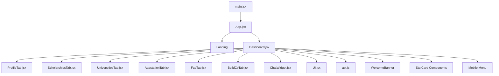

**Diagram sources**
- [main.jsx:1-11](file://scholarpath-frontend (2)/scholarpath/src/main.jsx#L1-L11)
- [App.jsx:1-23](file://scholarpath-frontend (2)/scholarpath/src/App.jsx#L1-L23)
- [Dashboard.jsx:1-447](file://scholarpath-frontend (2)/scholarpath/src/pages/Dashboard.jsx#L1-L447)

**Section sources**
- [main.jsx:1-11](file://scholarpath-frontend (2)/scholarpath/src/main.jsx#L1-L11)
- [App.jsx:1-23](file://scholarpath-frontend (2)/scholarpath/src/App.jsx#L1-L23)
- [Dashboard.jsx:1-447](file://scholarpath-frontend (2)/scholarpath/src/pages/Dashboard.jsx#L1-L447)

## Core Components
- **Dashboard**: Root container for the authenticated area with streamlined branding featuring text-based "ScholarPath.AI" logo instead of image component. Manages active tab state, shared profile and documents state, renders sticky header, sidebar navigation, and dynamic tab content.
- **Enhanced Sidebar Navigation**: Features emoji icons (📊 Overview, 👤 Profile, 🏛️ Universities, 🎓 Scholarships, 📄 Build CV, 📋 Attestations, ❓ FAQ) for improved visual navigation and user experience.
- **Welcome Banner**: Displays profile completion status with progress percentage, missing information checklist, and call-to-action buttons.
- **Quick Stat Cards**: Four animated cards showing Total Matches, Eligible count, Top Score, and Upcoming Deadlines with color-coded indicators (blue, green, amber, red).
- **Mobile Hamburger Menu**: Responsive navigation toggle for smaller screens with smooth animations.
- **Smart Deadline Badges**: Color-coded urgency indicators showing expired, urgent (≤7 days), upcoming (≤30 days), and general deadlines.
- **Tab components**: Each functional area is encapsulated in its own tab component with enhanced UI and improved user interactions.
- **UI primitives**: Reusable Card, Button, Badge, StatCard, Avatar components standardize visual styling and interactions.
- **ChatWidget**: Floating assistant accessible from any dashboard view.
- **Authentication Integration**: Context-based auth system with protected routes and session management.

Key responsibilities:
- **Enhanced Navigation State Management**: Active tab stored in local state with emoji-enhanced sidebar highlighting based on current tab.
- **Shared State Lifting**: Profile form and documents lifted into Dashboard so ProfileTab can update them and reflect changes across features.
- **Responsive Layout**: Uses Tailwind utility classes to adapt between mobile and desktop layouts, including hamburger menu on smaller screens and sticky sidebar on larger screens.
- **Live Data Integration**: Scholarships tab automatically runs Smart Agent analysis when user has profile information.
- **Progress Tracking**: Real-time profile completion tracking with visual progress indicators and actionable prompts.

**Section sources**
- [Dashboard.jsx:15-23](file://scholarpath-frontend (2)/scholarpath/src/pages/Dashboard.jsx#L15-L23)
- [Dashboard.jsx:84-128](file://scholarpath-frontend (2)/scholarpath/src/pages/Dashboard.jsx#L84-L128)
- [Dashboard.jsx:176-181](file://scholarpath-frontend (2)/scholarpath/src/pages/Dashboard.jsx#L176-L181)
- [Dashboard.jsx:409-426](file://scholarpath-frontend (2)/scholarpath/src/pages/Dashboard.jsx#L409-L426)
- [UI.jsx:61-77](file://scholarpath-frontend (2)/scholarpath/src/components/UI.jsx#L61-L77)

## Architecture Overview
The Dashboard acts as a composition root for the authenticated workspace with streamlined branding and responsive design. It maintains:
- Active tab identifier with emoji-enhanced navigation
- Shared profile form object with real-time completion tracking
- Shared required documents list
- Mobile menu state for responsive navigation
- Welcome banner visibility based on profile completeness

It renders:
- A sticky top bar with simplified text-based branding "ScholarPath.AI", personalized greeting, avatar, and logout
- An enhanced responsive sidebar with emoji icons and mobile hamburger menu
- A content area rendering the selected tab's component with improved animations
- A floating chat widget
- Welcome banner with profile completion tracking
- Quick stat cards with animated counters

Routing:
- App defines routes for Landing and Dashboard with protected route functionality.
- AuthContext provides authentication state management with token persistence.

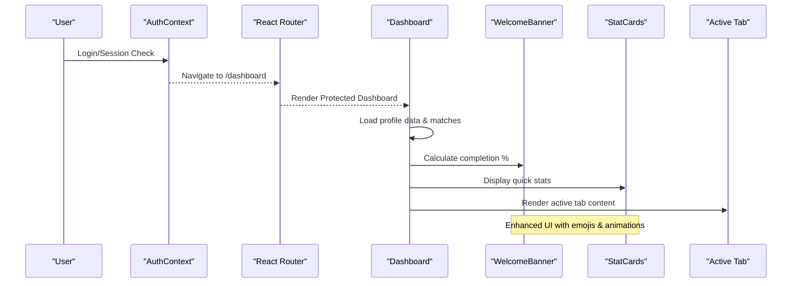

**Diagram sources**
- [App.jsx:6-18](file://scholarpath-frontend (2)/scholarpath/src/App.jsx#L6-L18)
- [AuthContext.jsx:6-56](file://scholarpath-frontend (2)/scholarpath/src/components/AuthContext.jsx#L6-L56)
- [Dashboard.jsx:280-447](file://scholarpath-frontend (2)/scholarpath/src/pages/Dashboard.jsx#L280-L447)

## Detailed Component Analysis

### Enhanced Dashboard Layout and Navigation State
**Updated** The dashboard now features a significantly improved UI with streamlined branding and enhanced navigation.

- **Header**: Displays simplified text-based branding "ScholarPath.AI" without logo component, personalized greeting with user avatar, and logout button with improved styling.
- **Enhanced Sidebar**: Maps over tab definitions with emoji icons (📊👤🏛️🎓📄📋❓) to render visually appealing clickable links. Active tab is highlighted with blue background and bold text.
- **Mobile Hamburger Menu**: Responsive navigation toggle that appears on smaller screens, providing access to all tabs through a collapsible menu.
- **Content Area**: Renders the corresponding tab component based on the active tab key with smooth fade-in animations.
- **Shared State**: Holds profileForm and requiredDocuments, passed down to ProfileTab to enable cross-tab synchronization.

**New Features**:
- **Welcome Banner**: Shows profile completion status with progress percentage, missing information checklist, and call-to-action buttons.
- **Quick Stat Cards**: Four animated cards displaying Total Matches (blue), Eligible count (green), Top Score (amber), and Upcoming Deadlines (red) with color-coded indicators.
- **Smart Deadline Badges**: Color-coded urgency indicators with different tones (red for expired/urgent, amber for upcoming, gray for general deadlines).

Responsive considerations:
- Uses grid and flex utilities to create a two-column layout on medium+ screens, stacking vertically on smaller screens.
- Sidebar becomes sticky on medium+ screens for persistent navigation.
- Mobile menu provides full navigation access on smaller screens with smooth animations.

Context maintenance:
- Switching tabs does not reset shared state; profileForm and documents persist across tab switches because they live in Dashboard.
- Welcome banner automatically hides when profile is 100% complete.

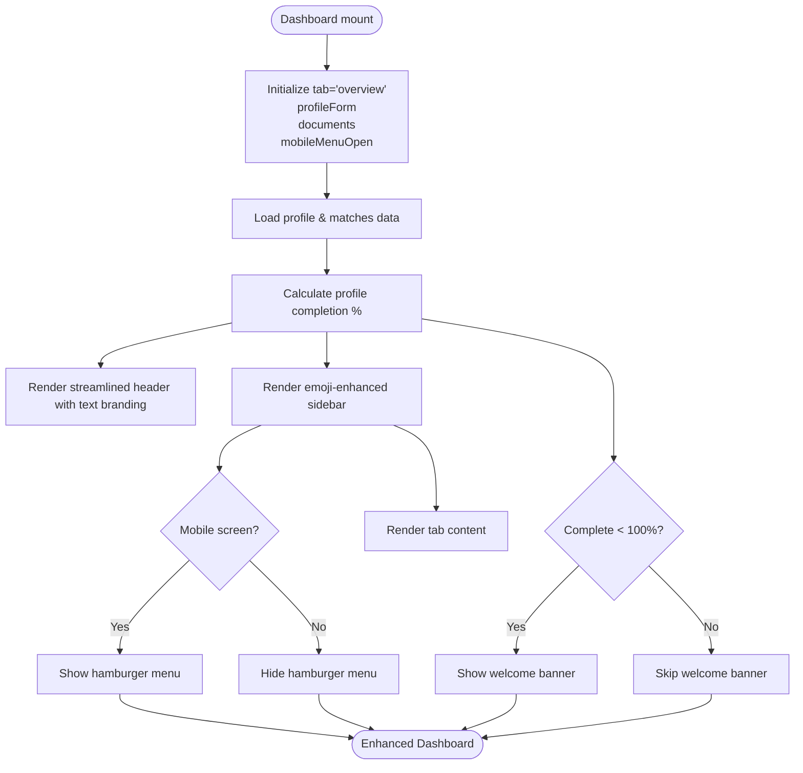

**Diagram sources**
- [Dashboard.jsx:280-447](file://scholarpath-frontend (2)/scholarpath/src/pages/Dashboard.jsx#L280-L447)
- [Dashboard.jsx:84-128](file://scholarpath-frontend (2)/scholarpath/src/pages/Dashboard.jsx#L84-L128)
- [Dashboard.jsx:176-181](file://scholarpath-frontend (2)/scholarpath/src/pages/Dashboard.jsx#L176-L181)

**Section sources**
- [Dashboard.jsx:15-23](file://scholarpath-frontend (2)/scholarpath/src/pages/Dashboard.jsx#L15-L23)
- [Dashboard.jsx:84-128](file://scholarpath-frontend (2)/scholarpath/src/pages/Dashboard.jsx#L84-L128)
- [Dashboard.jsx:176-181](file://scholarpath-frontend (2)/scholarpath/src/pages/Dashboard.jsx#L176-L181)
- [Dashboard.jsx:409-426](file://scholarpath-frontend (2)/scholarpath/src/pages/Dashboard.jsx#L409-L426)

### Enhanced Authentication Modal with Forgot Password Support
**New Feature** The authentication modal has been significantly enhanced with comprehensive forgot password functionality and improved user feedback.

- **Forgot Password Flow**: Multi-step password reset process with email verification and new password setting
- **Auto-Detection**: Automatically detects password reset tokens from email links (?reset=TOKEN)
- **Enhanced Form Validation**: Real-time validation with clear error messages and loading states
- **Improved User Feedback**: Visual feedback for successful operations and error handling
- **Password Visibility Toggle**: Show/hide password functionality for better user experience

Password Reset Workflow:
- Step 1: User enters email address to receive reset link
- Step 2: System sends reset email and confirms delivery
- Step 3: User clicks reset link and enters new password
- Step 4: Password successfully reset and user redirected to login

Enhanced Form Handling:
- Comprehensive validation for all input fields
- Clear error messaging with specific guidance
- Loading states during API calls
- Success notifications for completed actions
- Automatic cleanup of URL parameters after token usage

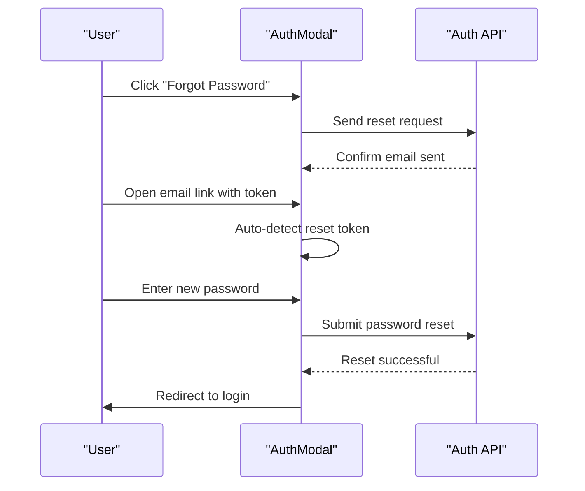

**Diagram sources**
- [AuthModal.jsx:16-37](file://scholarpath-frontend (2)/scholarpath/src/components/AuthModal.jsx#L16-L37)
- [AuthModal.jsx:68-111](file://scholarpath-frontend (2)/scholarpath/src/components/AuthModal.jsx#L68-L111)
- [AuthModal.jsx:114-189](file://scholarpath-frontend (2)/scholarpath/src/components/AuthModal.jsx#L114-L189)

**Section sources**
- [AuthModal.jsx:1-282](file://scholarpath-frontend (2)/scholarpath/src/components/AuthModal.jsx#L1-L282)

### Animated Quick Stat Cards
**New Feature** Four animated stat cards provide at-a-glance overview of user's scholarship opportunities.

- **Total Matches**: Blue card showing total number of matched scholarships/universities.
- **Eligible Count**: Green card displaying number of fully eligible opportunities.
- **Top Score**: Amber card showing highest match percentage achieved.
- **Upcoming Deadlines**: Red card indicating number of deadlines approaching soon.

Each card features:
- Emoji icon for visual recognition
- Label for context
- Large value display with color-coded typography
- Hover lift effect for interactivity
- Smooth animations on load

Color coding system:
- Blue (#3B82F6): General statistics and matches
- Green (#10B981): Positive achievements and eligibility
- Amber (#F59E0B): Scores and performance metrics
- Red (#DC2626): Urgent items like deadlines

**Section sources**
- [Dashboard.jsx:176-181](file://scholarpath-frontend (2)/scholarpath/src/pages/Dashboard.jsx#L176-L181)
- [UI.jsx:61-77](file://scholarpath-frontend (2)/scholarpath/src/components/UI.jsx#L61-L77)

### Smart Deadline Badges with Urgency Indicators
**New Feature** Intelligent deadline processing with color-coded urgency levels.

- **Expired Deadlines**: Red badge showing "Expired" for past deadlines.
- **Urgent Deadlines**: Red badge showing "Xd left" for deadlines within 7 days.
- **Upcoming Deadlines**: Amber badge showing "Xd left" or "Xmo left" for deadlines within 30-90 days.
- **General Deadlines**: Gray badge showing original deadline date for distant deadlines.

Deadline calculation logic:
- Compares current date with deadline date.
- Calculates difference in days for accurate urgency assessment.
- Applies appropriate color coding based on urgency level.
- Formats time remaining in human-readable format (days/months).

**Section sources**
- [Dashboard.jsx:130-140](file://scholarpath-frontend (2)/scholarpath/src/pages/Dashboard.jsx#L130-L140)
- [Dashboard.jsx:260-274](file://scholarpath-frontend (2)/scholarpath/src/pages/Dashboard.jsx#L260-L274)

### Mobile Responsiveness with Hamburger Menu
**New Feature** Fully responsive navigation system optimized for mobile devices.

- **Hamburger Toggle**: Three-line menu icon that transforms to X when open.
- **Collapsible Menu**: Smooth animation showing/hiding navigation options on mobile screens.
- **Touch-Friendly**: Large tap targets and clear visual feedback for mobile interactions.
- **Auto-Close**: Menu automatically closes when a tab is selected.

Responsive behavior:
- Desktop (md+): Traditional sidebar navigation visible at all times.
- Mobile (< md): Hamburger menu replaces sidebar with full-screen navigation overlay.
- Consistent UX: Same navigation structure regardless of device type.

**Section sources**
- [Dashboard.jsx:409-426](file://scholarpath-frontend (2)/scholarpath/src/pages/Dashboard.jsx#L409-L426)
- [Dashboard.jsx:428-434](file://scholarpath-frontend (2)/scholarpath/src/pages/Dashboard.jsx#L428-L434)

### Enhanced Match Display with Filtering Logic
**Updated** Match displays now feature improved visual feedback, interactive elements, and enhanced filtering logic to ensure data integrity.

- **Enhanced Filtering**: Added `.filter(m => m.universities?.name)` condition before sorting to ensure only actual universities (not scholarships) are shown in top matches section.
- **Hover States**: All match cards and list items have subtle hover effects with background color changes.
- **Improved Spacing**: Better padding and margins for enhanced readability.
- **Visual Hierarchy**: Clear distinction between different types of matches (universities vs scholarships).
- **Interactive Elements**: Clickable areas with proper cursor indicators and visual feedback.

Match card enhancements:
- University matches now properly filtered to show only entries with valid university data, displaying institution name with match percentage badges.
- Scholarship matches display title, country, and relevant details with enhanced visual presentation.
- Both types include hover effects and consistent styling.
- Empty states provide helpful guidance for users without matches yet.

Data integrity improvements:
- The filtering mechanism prevents mixed university/scholarship data from appearing in the wrong sections.
- Simplified display shows only university names for better clarity and reduced clutter.
- Separate filtering ensures topMatches array contains only university-related matches while topScholarships contains scholarship-specific data.

**Section sources**
- [Dashboard.jsx:145-153](file://scholarpath-frontend (2)/scholarpath/src/pages/Dashboard.jsx#L145-L153)
- [Dashboard.jsx:217-224](file://scholarpath-frontend (2)/scholarpath/src/pages/Dashboard.jsx#L217-L224)
- [Dashboard.jsx:237-245](file://scholarpath-frontend (2)/scholarpath/src/pages/Dashboard.jsx#L237-L245)
- [Dashboard.jsx:259-274](file://scholarpath-frontend (2)/scholarpath/src/pages/Dashboard.jsx#L259-L274)

### Profile Tab
Responsibilities:
- Collects personal and education details via form inputs with enhanced validation.
- Tracks required documents with status and optional analysis flow.
- Computes a checklist based on form values and document statuses.
- Integrates with Smart Agent for automated scholarship matching.

Shared state integration:
- Receives form and setForm from Dashboard to keep profile data consistent across tabs.
- Receives documents and setDocuments to update upload statuses and trigger re-renders.
- Supports profile completion tracking for welcome banner functionality.

Document analysis simulation:
- Uploading a CV enables an "Analyze" action that simulates extraction and populates form fields.
- Integration with backend API for real CV analysis and data extraction.

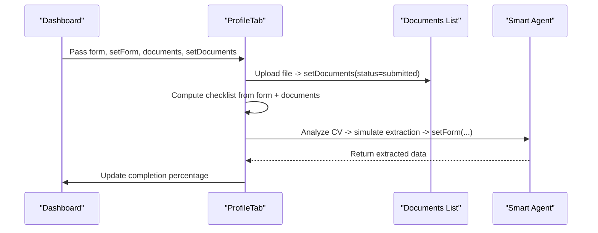

**Diagram sources**
- [ProfileTab.jsx:34-510](file://scholarpath-frontend (2)/scholarpath/src/pages/ProfileTab.jsx#L34-L510)
- [Dashboard.jsx:280-447](file://scholarpath-frontend (2)/scholarpath/src/pages/Dashboard.jsx#L280-L447)

**Section sources**
- [ProfileTab.jsx:34-510](file://scholarpath-frontend (2)/scholarpath/src/pages/ProfileTab.jsx#L34-L510)

### Scholarships Tab
**Updated** The Scholarships tab has been completely redesigned to use live Smart Agent data instead of mock data with enhanced UI components.

Responsibilities:
- Automatically runs Smart Agent analysis when user has profile information (country and department).
- Scrapes live scholarship data from official sources and analyzes user eligibility.
- Displays personalized scholarship matches with probability calculations and detailed breakdowns.
- Shows real-time data source indicators (live scrape, cached, database fallback).
- Features enhanced UI with chance meters, eligibility breakdowns, and application guidelines.

Smart Agent Integration:
- Auto-runs on tab load if user has profile country and department set.
- Calls `smartAgentAPI.match(userId)` to get personalized scholarship matches.
- Displays loading states during scraping and analysis process.
- Shows error handling for failed API calls.

Enhanced UI Features:
- **Chance Meter**: Visual probability indicator with color-coded progress bars.
- **Eligibility Breakdown**: Detailed criterion-by-criterion view with pass/fail indicators.
- **Application Guidelines**: Country-specific step-by-step application instructions.
- **Data Source Indicators**: Shows whether data is live scraped, cached, or from database fallback.

Data Flow:
- Frontend calls Smart Agent API endpoint `/smart-agent/match`
- Backend scrapes live scholarship data from official portals
- AI analyzes user profile against scholarship requirements
- Returns personalized matches with eligibility status and chance percentages
- Frontend displays results with detailed breakdowns and application guidance

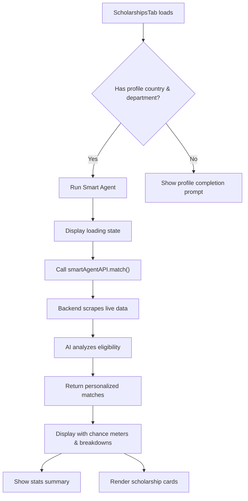

**Diagram sources**
- [ScholarshipsTab.jsx:264-389](file://scholarpath-frontend (2)/scholarpath/src/pages/ScholarshipsTab.jsx#L264-L389)
- [api.js:72-75](file://scholarpath-frontend (2)/scholarpath/src/api.js#L72-L75)

**Section sources**
- [ScholarshipsTab.jsx:264-389](file://scholarpath-frontend (2)/scholarpath/src/pages/ScholarshipsTab.jsx#L264-L389)

### Universities Tab
Responsibilities:
- Provides a browsable directory with filters for country, degree, and department.
- Shows current matches and possible matches with actionable steps to improve fit.
- Features enhanced UI with application guidelines and official portal links.

Data handling:
- Computes unique filter values from the university directory.
- Filters and displays top results; renders match cards with progress indicators.
- Falls back to mock data when API is unavailable.

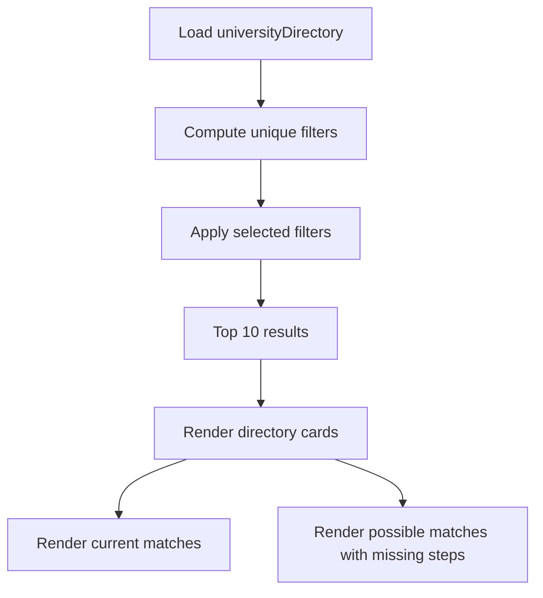

**Diagram sources**
- [UniversitiesTab.jsx:60-169](file://scholarpath-frontend (2)/scholarpath/src/pages/UniversitiesTab.jsx#L60-L169)
- [mockData.js:43-133](file://scholarpath-frontend (2)/scholarpath/src/data/mockData.js#L43-L133)

**Section sources**
- [UniversitiesTab.jsx:60-169](file://scholarpath-frontend (2)/scholarpath/src/pages/UniversitiesTab.jsx#L60-L169)

### Attestation Tab
Responsibilities:
- Presents attestation authority options (HEC, IBCC, MOFA) with enhanced UI.
- Displays step-by-step instructions and official portal links for the selected authority.
- Tracks user progress through attestation steps with visual indicators.

Interaction model:
- Maintains active option ID; selecting an option updates detail view accordingly.
- Supports step completion tracking with persistent storage.

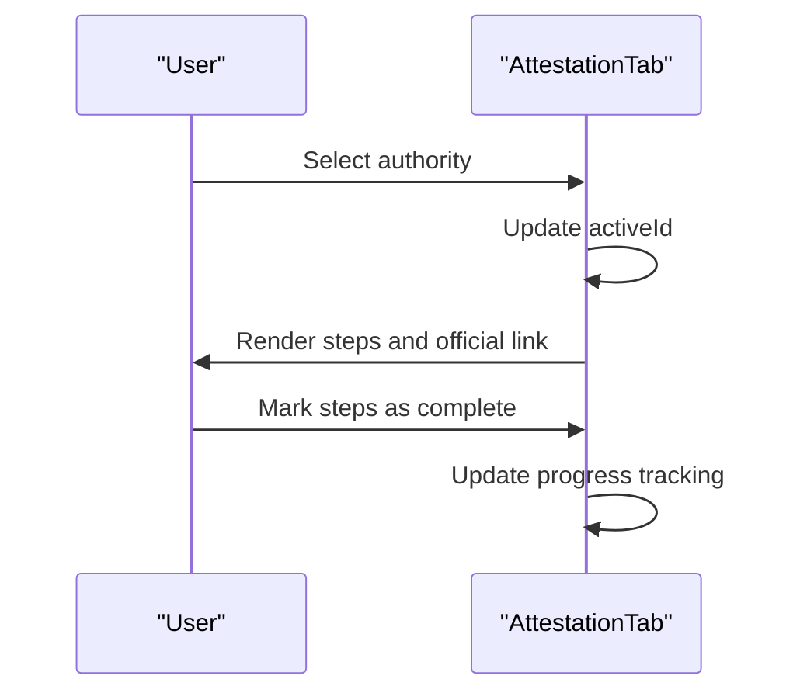

**Diagram sources**
- [AttestationTab.jsx:83-161](file://scholarpath-frontend (2)/scholarpath/src/pages/AttestationTab.jsx#L83-L161)
- [mockData.js:256-309](file://scholarpath-frontend (2)/scholarpath/src/data/mockData.js#L256-L309)

**Section sources**
- [AttestationTab.jsx:83-161](file://scholarpath-frontend (2)/scholarpath/src/pages/AttestationTab.jsx#L83-L161)

### FAQ Tab
Responsibilities:
- Displays frequently asked questions in an accordion-style list with enhanced styling.
- Toggles answer visibility per question with smooth animations.

Interaction model:
- Tracks open question ID; toggling opens/closes the corresponding answer.
- Features rotating plus icon for visual feedback.

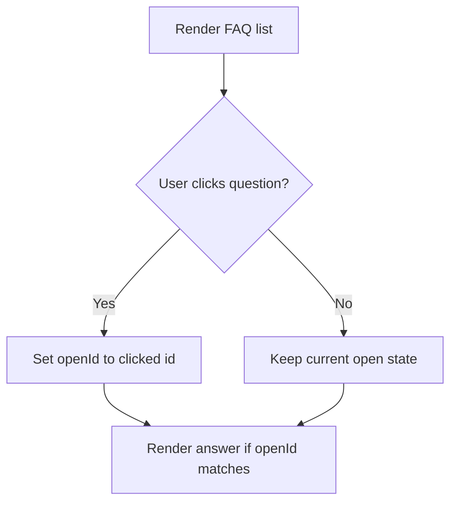

**Diagram sources**
- [FaqTab.jsx:22-46](file://scholarpath-frontend (2)/scholarpath/src/pages/FaqTab.jsx#L22-L46)
- [mockData.js:311-349](file://scholarpath-frontend (2)/scholarpath/src/data/mockData.js#L311-L349)

**Section sources**
- [FaqTab.jsx:22-46](file://scholarpath-frontend (2)/scholarpath/src/pages/FaqTab.jsx#L22-L46)

### Build CV Tab
Responsibilities:
- Allows uploading an existing CV to get AI feedback and convert to Europass format.
- Supports building a CV from scratch with draft sections and download options.
- Includes a recommendation letter generator that can polish or generate text.
- Features enhanced UI with preview capabilities and formatting options.

Workflow highlights:
- File upload sets filename and resets conversion state.
- Conversion simulates processing and enables download.
- Draft mode provides editable sections and download functionality.
- Europass preview shows formatted CV with professional styling.

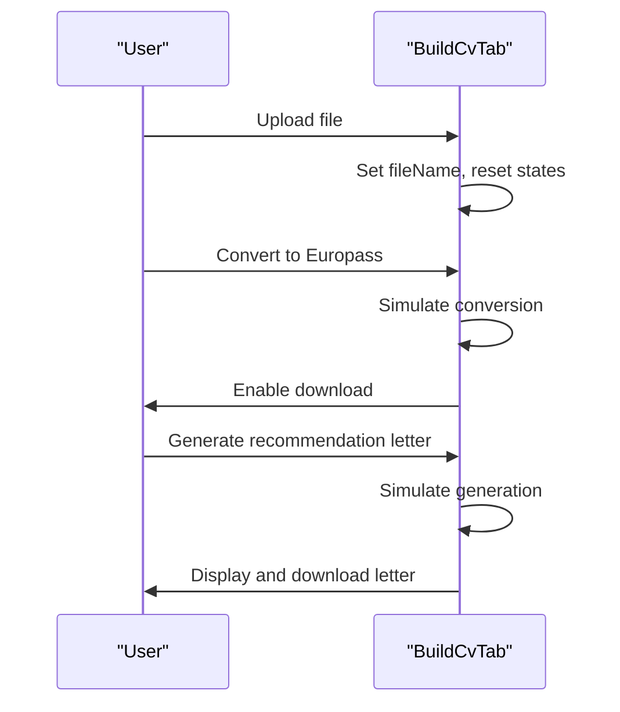

**Diagram sources**
- [BuildCvTab.jsx:38-448](file://scholarpath-frontend (2)/scholarpath/src/pages/BuildCvTab.jsx#L38-L448)

**Section sources**
- [BuildCvTab.jsx:38-448](file://scholarpath-frontend (2)/scholarpath/src/pages/BuildCvTab.jsx#L38-L448)

### Authentication Integration
**Updated** Authentication system now includes comprehensive forgot password functionality and enhanced user feedback.

- AuthContext handles login/signup forms and navigates to /dashboard on submit.
- Enhanced AuthModal provides forgot password flow with multi-step verification process.
- Dashboard provides a logout button that navigates back to the root route.
- No backend session persistence is implemented; navigation drives the authenticated flow.
- Protected routes ensure only authenticated users can access dashboard features.

Enhanced Authentication Flow:
- **Login/Signup**: Standard authentication with improved error handling
- **Forgot Password**: Multi-step process with email verification and token-based reset
- **Session Management**: Persistent authentication state with automatic token recovery
- **User Feedback**: Clear success/error messages throughout the authentication process

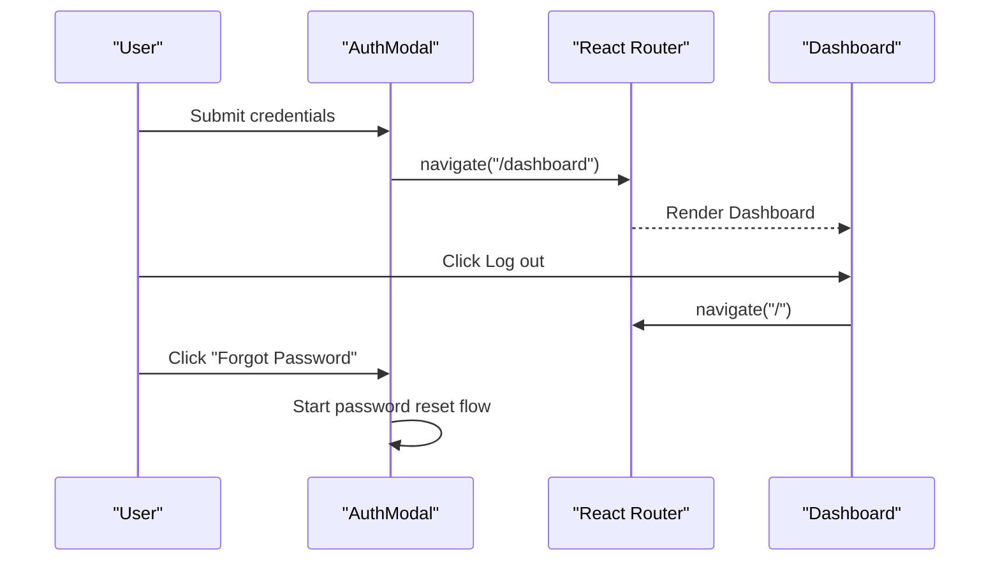

**Diagram sources**
- [AuthContext.jsx:20-56](file://scholarpath-frontend (2)/scholarpath/src/components/AuthContext.jsx#L20-L56)
- [App.jsx:6-18](file://scholarpath-frontend (2)/scholarpath/src/App.jsx#L6-L18)
- [Dashboard.jsx:355-358](file://scholarpath-frontend (2)/scholarpath/src/pages/Dashboard.jsx#L355-L358)
- [AuthModal.jsx:68-111](file://scholarpath-frontend (2)/scholarpath/src/components/AuthModal.jsx#L68-L111)

**Section sources**
- [AuthContext.jsx:1-64](file://scholarpath-frontend (2)/scholarpath/src/components/AuthContext.jsx#L1-L64)
- [Dashboard.jsx:355-358](file://scholarpath-frontend (2)/scholarpath/src/pages/Dashboard.jsx#L355-L358)
- [AuthModal.jsx:1-282](file://scholarpath-frontend (2)/scholarpath/src/components/AuthModal.jsx#L1-L282)

## Dependency Analysis
**Updated** Dependencies have evolved with the introduction of enhanced UI components and improved authentication context.

- Dashboard depends on:
  - Enhanced UI components (Card, Button, Badge, StatCard, Avatar) - Note: Logo component removed from dashboard
  - Feature tabs (Profile, Scholarships, Universities, Attestation, FAQ, Build CV)
  - ChatWidget
  - Mock data (student, requiredDocuments, universityMatches, scholarships) - still used for non-dynamic features
  - API layer for Smart Agent integration
  - AuthContext for authentication state management
- Tabs depend on:
  - Enhanced UI components
  - Mock data relevant to their domain (except ScholarshipsTab which uses live data)
- App depends on:
  - Routing configuration linking Landing and Dashboard
  - AuthProvider for authentication context
- ChatWidget depends on:
  - UI components
  - Chat API for AI responses
- ScholarshipsTab depends on:
  - Smart Agent API for live scholarship data
  - Real-time backend services for scraping and analysis

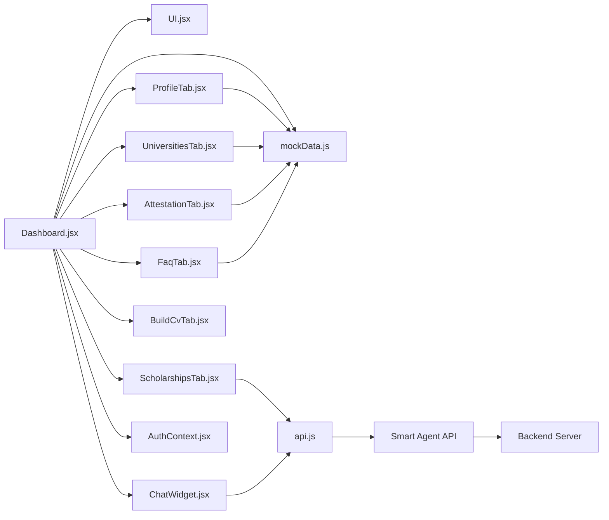

**Diagram sources**
- [Dashboard.jsx:1-447](file://scholarpath-frontend (2)/scholarpath/src/pages/Dashboard.jsx#L1-L447)
- [ScholarshipsTab.jsx:1-389](file://scholarpath-frontend (2)/scholarpath/src/pages/ScholarshipsTab.jsx#L1-L389)
- [api.js:72-75](file://scholarpath-frontend (2)/scholarpath/src/api.js#L72-L75)

**Section sources**
- [Dashboard.jsx:1-447](file://scholarpath-frontend (2)/scholarpath/src/pages/Dashboard.jsx#L1-L447)
- [ScholarshipsTab.jsx:1-389](file://scholarpath-frontend (2)/scholarpath/src/pages/ScholarshipsTab.jsx#L1-L389)
- [api.js:1-153](file://scholarpath-frontend (2)/scholarpath/src/api.js#L1-L153)

## Performance Considerations
**Updated** Performance considerations have evolved with the introduction of enhanced UI components and live data fetching.

- Client-side filtering: Scholarships and Universities tabs compute filtered lists locally. For large datasets, consider pagination or virtualization to maintain responsiveness.
- Memoization: Use of useMemo in tabs reduces recomputation of derived filter options.
- Avoid unnecessary re-renders: Lift only necessary shared state to Dashboard; keep tab-specific state local to avoid cascading updates.
- Lazy loading: Consider lazy-loading heavy tab components when switching to reduce initial bundle size.
- **New**: Smart Agent API calls are optimized with caching (24-hour cache for scraped data) and automatic fallback to database when scraping fails.
- **New**: Loading states prevent multiple simultaneous API calls and provide user feedback during scraping operations.
- **New**: Error handling ensures graceful degradation when live data sources are unavailable.
- **New**: Enhanced UI components use CSS animations and transitions for smooth user interactions without performance impact.
- **New**: Mobile menu uses conditional rendering to optimize performance on smaller screens.
- **New**: Stat cards and welcome banner use efficient state management to minimize re-renders.
- **New**: Enhanced filtering logic in match displays improves performance by reducing unnecessary DOM manipulation and ensuring only relevant data is processed.
- **New**: Streamlined dashboard branding removes image loading overhead for faster initial render.
- **New**: Enhanced authentication modal uses efficient state management for forgot password flow.

## Troubleshooting Guide
**Updated** Added troubleshooting scenarios for enhanced UI components, mobile responsiveness, improved filtering logic, and enhanced authentication modal.

Common issues and resolutions:
- Tab content not updating: Ensure the active tab state is correctly set and the tabContent map includes the new tab key. Verify that the sidebar onClick handler calls setTab with the correct id.
- Profile changes not reflected: Confirm that profileForm and setForm are passed from Dashboard to ProfileTab and that updates use setForm to mutate shared state.
- Document status not updating: Check that handleUpload maps over documents and updates the specific document id's status and fileName.
- Filters not applying: Validate that filter state variables are bound to select inputs and that the filter function checks each condition before returning true.
- Logout not working: Ensure the logout button calls navigate("/") and that the root route renders the Landing component.
- **New**: Welcome banner not appearing: Verify that profile completion calculation is working correctly and that the user has incomplete profile data.
- **New**: Mobile menu not opening: Check that mobileMenuOpen state is properly managed and that the hamburger button onClick handler is functioning.
- **New**: Stat cards showing incorrect values: Ensure that matches data is loaded correctly and that calculations for eligible count, top score, and deadlines are accurate.
- **New**: Emoji icons not displaying: Verify that the TABS array contains proper emoji characters and that the font supports emoji rendering.
- **New**: Smart Agent not running: Verify that user has both target country and department set in profile. Check browser console for API errors and ensure authentication token is valid.
- **New**: Scholarship data not loading: Check network tab for API failures, verify backend server is running, and ensure proper CORS configuration. Look for error messages like "Smart agent failed" in the UI.
- **New**: Cached vs live data confusion: The system shows data source indicators (live scraped, cached, database fallback). If data seems stale, click "Re-analyze" to force fresh scraping.
- **New**: Profile completion prompts: If no scholarships appear, ensure profile has country and department set, then save and return to Scholarships tab.
- **New**: Mixed university/scholarship data in wrong sections: The enhanced filtering logic should prevent this, but if you see scholarships in the university matches section, check that the `.filter(m => m.universities?.name)` condition is working correctly in the Dashboard component.
- **New**: Empty university matches section: Verify that the filtering mechanism isn't too restrictive and that the matches data contains valid university objects with proper naming structure.
- **New**: Forgot password not working: Verify that email addresses are valid and that the backend email service is configured correctly. Check for error messages in the authentication modal.
- **New**: Password reset token invalid: Ensure the reset link hasn't expired and that the token is being properly extracted from the URL query parameters.
- **New**: Authentication modal not closing: Check that the onClose prop is properly passed to the AuthModal component and that navigation is working correctly after successful authentication.

**Section sources**
- [Dashboard.jsx:280-447](file://scholarpath-frontend (2)/scholarpath/src/pages/Dashboard.jsx#L280-L447)
- [ProfileTab.jsx:34-510](file://scholarpath-frontend (2)/scholarpath/src/pages/ProfileTab.jsx#L34-L510)
- [ScholarshipsTab.jsx:264-389](file://scholarpath-frontend (2)/scholarpath/src/pages/ScholarshipsTab.jsx#L264-L389)
- [UniversitiesTab.jsx:60-169](file://scholarpath-frontend (2)/scholarpath/src/pages/UniversitiesTab.jsx#L60-L169)
- [App.jsx:6-18](file://scholarpath-frontend (2)/scholarpath/src/App.jsx#L6-L18)
- [AuthModal.jsx:68-111](file://scholarpath-frontend (2)/scholarpath/src/components/AuthModal.jsx#L68-L111)

## Conclusion
**Updated** The Dashboard provides a cohesive, tab-based authenticated experience for ScholarPathAI users with significant UI improvements and enhanced functionality. It centralizes navigation state and shared user data while delegating domain-specific logic to focused tab components. The design leverages responsive layouts, reusable UI primitives, emoji-enhanced navigation, and centralized mock data for non-dynamic features to deliver a smooth user journey across Profile, Scholarships, Universities, Attestation, FAQ, and CV Builder features.

**Major Enhancements**: The dashboard now features a significantly improved user interface with streamlined text-based branding replacing the logo component, emoji-enhanced sidebar navigation, intelligent welcome banner with profile completion tracking, animated quick stat cards with color-coded indicators, mobile-responsive hamburger menu, smart deadline badges with urgency levels, enhanced match displays with hover effects, and improved data integrity through enhanced filtering mechanisms. These improvements provide better visual feedback, improved accessibility, and more reliable data presentation.

The enhanced university matching display logic now includes sophisticated filtering to ensure only actual universities (not scholarships) appear in the top matches section, improving data integrity and user experience. The filtering mechanism uses `.filter(m => m.universities?.name)` conditions before sorting to guarantee that university-specific data is properly separated from scholarship data.

The Scholarships tab continues to use a sophisticated Smart Agent system that scrapes live scholarship data from official sources, analyzes user profiles with AI-powered matching algorithms, and provides personalized scholarship recommendations with probability calculations. This eliminates reliance on static mock data and ensures users always see current, relevant scholarship opportunities.

**Enhanced Authentication**: The authentication system now includes comprehensive forgot password functionality with multi-step verification process, auto-detection of reset tokens from email links, improved form validation with clear error messaging, and enhanced user feedback throughout the authentication flow. This provides a more robust and user-friendly authentication experience.

Authentication is integrated via a context-based system that manages user sessions and provides protected routes. The enhanced UI components and responsive design ensure optimal user experience across all device sizes, from desktop computers to mobile phones. Future enhancements could include additional analytics dashboards, expanded Smart Agent capabilities, advanced search and filtering options, and further customization of the user interface.