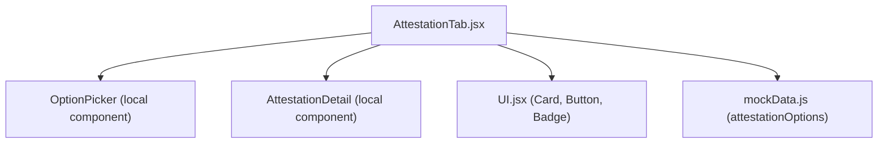
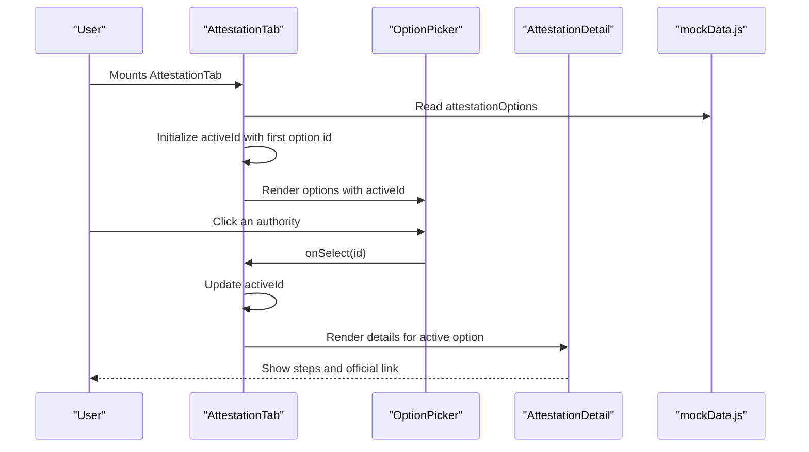
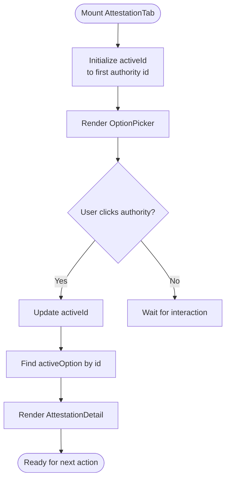
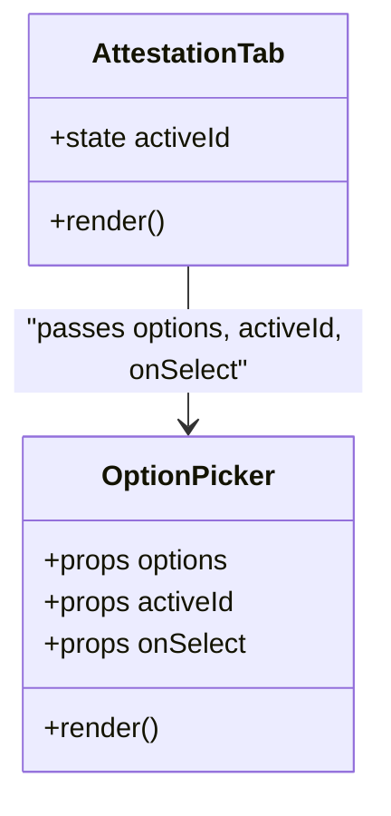
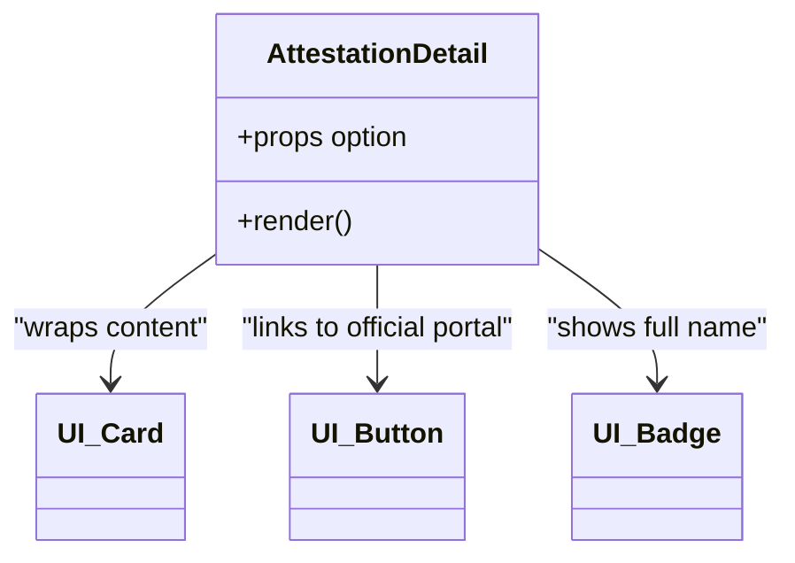
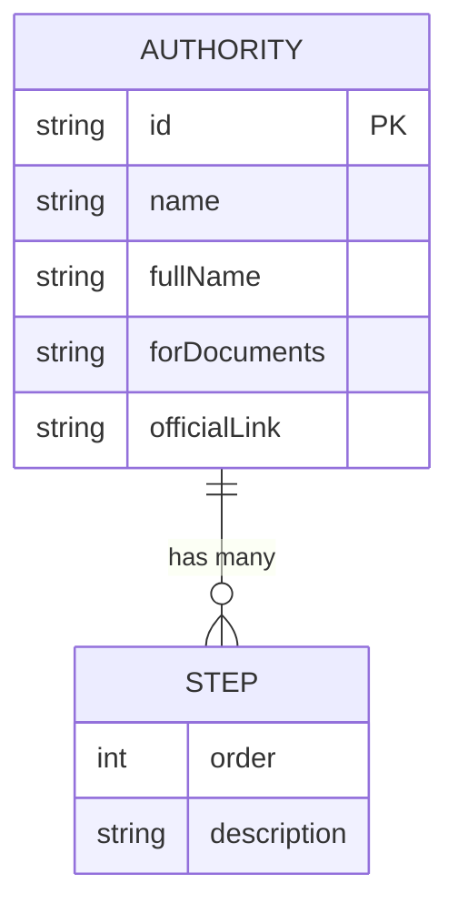
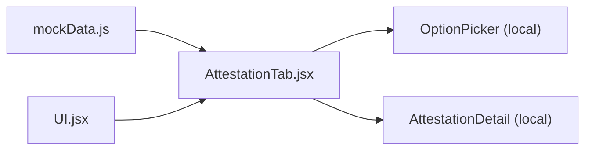

# Attestation Workflow Management

<cite>
**Referenced Files in This Document**
- [AttestationTab.jsx](file://scholarpath-frontend (2)/scholarpath/src/pages/AttestationTab.jsx)
- [mockData.js](file://scholarpath-frontend (2)/scholarpath/src/data/mockData.js)
- [UI.jsx](file://scholarpath-frontend (2)/scholarpath/src/components/UI.jsx)
</cite>

## Table of Contents
1. [Introduction](#introduction)
2. [Project Structure](#project-structure)
3. [Core Components](#core-components)
4. [Architecture Overview](#architecture-overview)
5. [Detailed Component Analysis](#detailed-component-analysis)
6. [Dependency Analysis](#dependency-analysis)
7. [Performance Considerations](#performance-considerations)
8. [Troubleshooting Guide](#troubleshooting-guide)
9. [Conclusion](#conclusion)

## Introduction
This document explains the attestation workflow management system implemented in the AttestationTab component. It covers how users select an attestation authority (HEC, IBCC, MOFA), how state is managed with useState for activeId tracking, and how authority-specific information is rendered dynamically. It also documents the selection mechanism, data-driven rendering, and how user context is maintained during navigation between different attestation processes. Examples of workflow states, selection patterns, and user interaction flows are included to help both technical and non-technical readers understand the system.

## Project Structure
The attestation feature is implemented as a single-page tab that:
- Reads static guidance data from a centralized data module.
- Renders an OptionPicker UI for selecting an authority.
- Displays detailed steps and official links for the selected authority.
- Uses shared UI primitives for consistent styling and behavior.

**Diagram sources**
- [AttestationTab.jsx:1-72](file://scholarpath-frontend (2)/scholarpath/src/pages/AttestationTab.jsx#L1-L72)
- [UI.jsx:1-46](file://scholarpath-frontend (2)/scholarpath/src/components/UI.jsx#L1-L46)
- [mockData.js:256-309](file://scholarpath-frontend (2)/scholarpath/src/data/mockData.js#L256-L309)

**Section sources**
- [AttestationTab.jsx:1-72](file://scholarpath-frontend (2)/scholarpath/src/pages/AttestationTab.jsx#L1-L72)
- [mockData.js:256-309](file://scholarpath-frontend (2)/scholarpath/src/data/mockData.js#L256-L309)
- [UI.jsx:1-46](file://scholarpath-frontend (2)/scholarpath/src/components/UI.jsx#L1-L46)

## Core Components
- AttestationTab: The main page component that manages the active authority via local state and renders the selection UI and detail view.
- OptionPicker: A presentational component that renders selectable cards for each authority and highlights the currently active one.
- AttestationDetail: A presentational component that displays the selected authority’s name, full name badge, applicable documents, step-by-step instructions, and a link to the official portal.
- UI Primitives: Card, Button, and Badge provide consistent visual building blocks used by AttestationDetail.

Key responsibilities:
- State ownership: AttestationTab owns activeId and computes the active option.
- Rendering: OptionPicker renders options; AttestationDetail renders details for the active option.
- Data source: All authority data comes from mockData.js.

**Section sources**
- [AttestationTab.jsx:5-72](file://scholarpath-frontend (2)/scholarpath/src/pages/AttestationTab.jsx#L5-L72)
- [UI.jsx:1-46](file://scholarpath-frontend (2)/scholarpath/src/components/UI.jsx#L1-L46)
- [mockData.js:256-309](file://scholarpath-frontend (2)/scholarpath/src/data/mockData.js#L256-L309)

## Architecture Overview
The AttestationTab implements a simple, unidirectional data flow:
- Data is loaded once from mockData.js.
- User interactions update local state (activeId).
- React re-renders based on state changes, showing the corresponding authority details.

**Diagram sources**
- [AttestationTab.jsx:56-72](file://scholarpath-frontend (2)/scholarpath/src/pages/AttestationTab.jsx#L56-L72)
- [mockData.js:256-309](file://scholarpath-frontend (2)/scholarpath/src/data/mockData.js#L256-L309)

## Detailed Component Analysis

### AttestationTab
- State management:
  - Uses useState to track activeId, initialized to the first authority’s id.
  - Computes activeOption by finding the matching entry in attestationOptions.
- Rendering:
  - Renders a header explaining the purpose of the tab.
  - Passes options, activeId, and onSelect to OptionPicker.
  - Conditionally renders AttestationDetail when an active option exists.
- Context maintenance:
  - Because activeId is local state, switching authorities within the same tab preserves the user’s current selection without reloading or losing context.

**Diagram sources**
- [AttestationTab.jsx:56-72](file://scholarpath-frontend (2)/scholarpath/src/pages/AttestationTab.jsx#L56-L72)

**Section sources**
- [AttestationTab.jsx:56-72](file://scholarpath-frontend (2)/scholarpath/src/pages/AttestationTab.jsx#L56-L72)

### OptionPicker
- Props:
  - options: Array of authority objects from mockData.js.
  - activeId: Current selected authority id.
  - onSelect: Callback to update activeId in parent.
- Behavior:
  - Maps over options to render selectable cards.
  - Highlights the card whose id matches activeId using conditional classes.
  - On click, calls onSelect with the clicked option’s id.

**Diagram sources**
- [AttestationTab.jsx:5-24](file://scholarpath-frontend (2)/scholarpath/src/pages/AttestationTab.jsx#L5-L24)
- [AttestationTab.jsx:56-72](file://scholarpath-frontend (2)/scholarpath/src/pages/AttestationTab.jsx#L56-L72)

**Section sources**
- [AttestationTab.jsx:5-24](file://scholarpath-frontend (2)/scholarpath/src/pages/AttestationTab.jsx#L5-L24)

### AttestationDetail
- Props:
  - option: The currently selected authority object.
- Behavior:
  - Displays the authority name and full name badge.
  - Shows which documents the authority applies to.
  - Renders a numbered list of steps from the option’s steps array.
  - Provides a link to the official portal for the authority.

**Diagram sources**
- [AttestationTab.jsx:26-54](file://scholarpath-frontend (2)/scholarpath/src/pages/AttestationTab.jsx#L26-L54)
- [UI.jsx:1-46](file://scholarpath-frontend (2)/scholarpath/src/components/UI.jsx#L1-L46)

**Section sources**
- [AttestationTab.jsx:26-54](file://scholarpath-frontend (2)/scholarpath/src/pages/AttestationTab.jsx#L26-L54)
- [UI.jsx:1-46](file://scholarpath-frontend (2)/scholarpath/src/components/UI.jsx#L1-L46)

### Data Model: attestationOptions
- Structure:
  - Each authority has an id, name, fullName, forDocuments, steps (array), and officialLink.
- Authorities:
  - HEC: For Bachelor’s and Master’s degrees and transcripts.
  - IBCC: For Matric (SSC) and Intermediate (HSSC) certificates.
  - MOFA: Final attestation/apostille after HEC or IBCC.
- Usage:
  - AttestationTab reads this array to populate OptionPicker and compute activeOption.

**Diagram sources**
- [mockData.js:256-309](file://scholarpath-frontend (2)/scholarpath/src/data/mockData.js#L256-L309)

**Section sources**
- [mockData.js:256-309](file://scholarpath-frontend (2)/scholarpath/src/data/mockData.js#L256-L309)

## Dependency Analysis
- AttestationTab depends on:
  - mockData.js for authority data.
  - UI.jsx for Card, Button, and Badge components.
- OptionPicker and AttestationDetail are local presentational components within AttestationTab.jsx.
- No external routing or global state is used; all context is maintained locally via useState.

**Diagram sources**
- [AttestationTab.jsx:1-72](file://scholarpath-frontend (2)/scholarpath/src/pages/AttestationTab.jsx#L1-L72)
- [mockData.js:256-309](file://scholarpath-frontend (2)/scholarpath/src/data/mockData.js#L256-L309)
- [UI.jsx:1-46](file://scholarpath-frontend (2)/scholarpath/src/components/UI.jsx#L1-L46)

**Section sources**
- [AttestationTab.jsx:1-72](file://scholarpath-frontend (2)/scholarpath/src/pages/AttestationTab.jsx#L1-L72)
- [mockData.js:256-309](file://scholarpath-frontend (2)/scholarpath/src/data/mockData.js#L256-L309)
- [UI.jsx:1-46](file://scholarpath-frontend (2)/scholarpath/src/components/UI.jsx#L1-L46)

## Performance Considerations
- Local state: Using useState keeps updates fast and scoped to the component.
- Data size: The attestationOptions array is small; mapping and find operations are negligible.
- Re-renders: Only the active option changes on selection; presentational components are lightweight.
- Potential optimizations:
  - Memoize activeOption computation if the dataset grows significantly.
  - Consider lazy-loading heavy detail content if steps become large or include rich media.

[No sources needed since this section provides general guidance]

## Troubleshooting Guide
Common issues and resolutions:
- No details displayed:
  - Ensure activeId is set to a valid authority id and that attestationOptions contains the corresponding entry.
- Incorrect highlighting:
  - Verify that OptionPicker receives the correct activeId and that onClick calls onSelect with the intended id.
- Broken official link:
  - Check that the selected option’s officialLink is valid and accessible.
- Steps not rendering:
  - Confirm that the selected option includes a steps array and that it is not empty.

**Section sources**
- [AttestationTab.jsx:56-72](file://scholarpath-frontend (2)/scholarpath/src/pages/AttestationTab.jsx#L56-L72)
- [mockData.js:256-309](file://scholarpath-frontend (2)/scholarpath/src/data/mockData.js#L256-L309)

## Conclusion
The AttestationTab provides a clear, data-driven workflow for selecting and exploring attestation authorities. Users can easily switch between HEC, IBCC, and MOFA, with each selection updating local state and rendering tailored guidance. The design leverages simple React patterns (useState and props) and reusable UI primitives to maintain clarity and performance. This approach ensures a smooth user experience while keeping implementation straightforward and maintainable.

[No sources needed since this section summarizes without analyzing specific files]