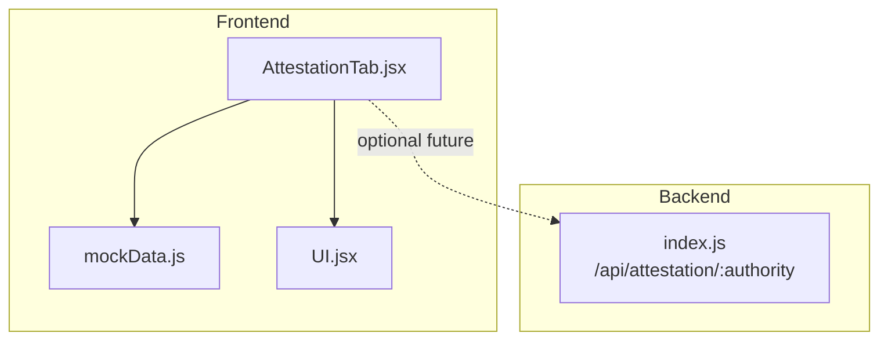
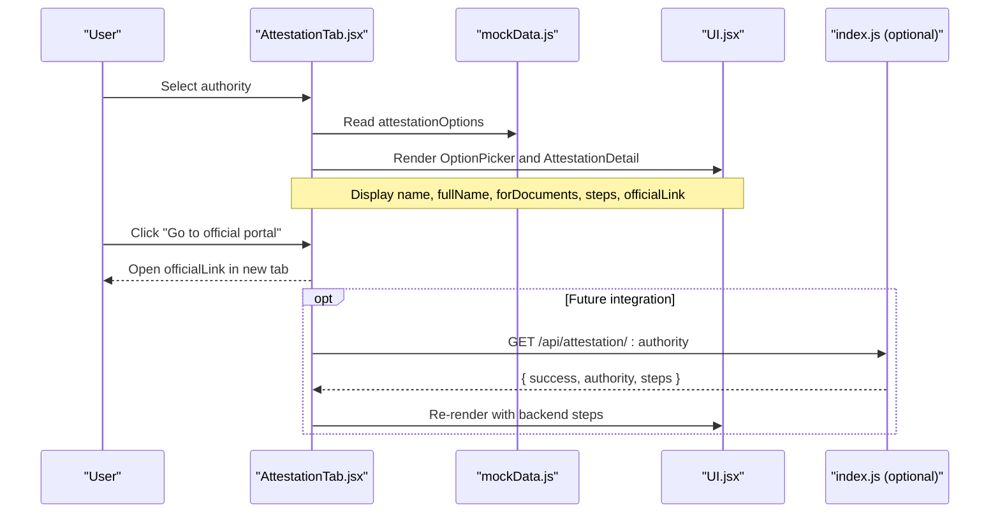
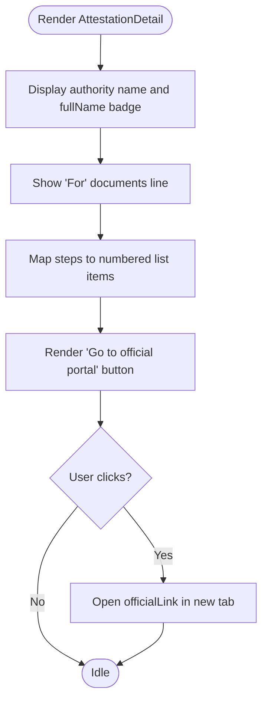
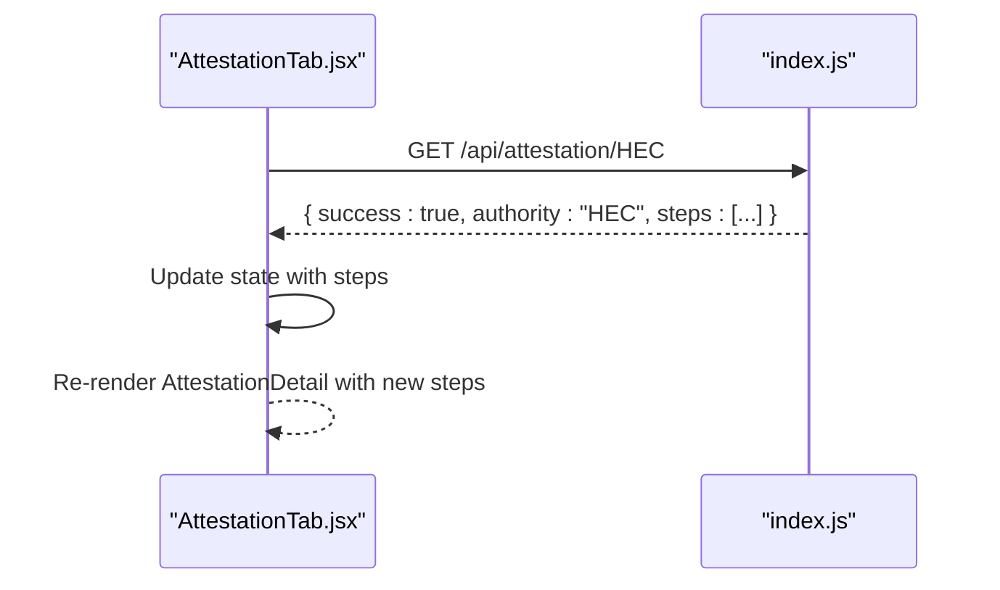
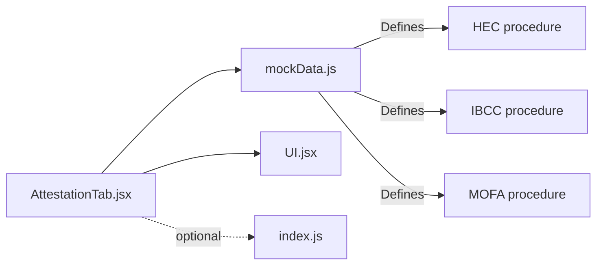

# Authority-Specific Procedures

<cite>
**Referenced Files in This Document**
- [AttestationTab.jsx](file://scholarpath-frontend (2)/scholarpath/src/pages/AttestationTab.jsx)
- [mockData.js](file://scholarpath-frontend (2)/scholarpath/src/data/mockData.js)
- [UI.jsx](file://scholarpath-frontend (2)/scholarpath/src/components/UI.jsx)
- [index.js](file://aischolarpath-backend-main/aischolarpath-backend-main/index.js)
</cite>

## Table of Contents
1. [Introduction](#introduction)
2. [Project Structure](#project-structure)
3. [Core Components](#core-components)
4. [Architecture Overview](#architecture-overview)
5. [Detailed Component Analysis](#detailed-component-analysis)
6. [Dependency Analysis](#dependency-analysis)
7. [Performance Considerations](#performance-considerations)
8. [Troubleshooting Guide](#troubleshooting-guide)
9. [Conclusion](#conclusion)

## Introduction
This document explains how the application presents authority-specific attestation procedures for Pakistani students, focusing on HEC (Higher Education Commission), IBCC (Inter Board Committee of Chairmen), and MOFA (Ministry of Foreign Affairs). It covers:
- The step-by-step instructions surfaced by the AttestationDetail component
- Official portal integration via external links
- Document type requirements per authority
- How authority names, full names, target documents, procedural steps, and official portal access are displayed
- Examples of procedure data structures, step rendering patterns, and external link handling

## Project Structure
The attestation feature is implemented as a React page that renders an option picker for authorities and a detail view for the selected authority. Procedure data is centralized in a static data file and can be extended or replaced with backend calls later. A minimal UI library provides reusable components for cards, buttons, and badges.

**Diagram sources**
- [AttestationTab.jsx:1-72](file://scholarpath-frontend (2)/scholarpath/src/pages/AttestationTab.jsx#L1-L72)
- [mockData.js:256-309](file://scholarpath-frontend (2)/scholarpath/src/data/mockData.js#L256-L309)
- [UI.jsx:1-47](file://scholarpath-frontend (2)/scholarpath/src/components/UI.jsx#L1-L47)
- [index.js:403-435](file://aischolarpath-backend-main/aischolarpath-backend-main/index.js#L403-L435)

**Section sources**
- [AttestationTab.jsx:1-72](file://scholarpath-frontend (2)/scholarpath/src/pages/AttestationTab.jsx#L1-L72)
- [mockData.js:256-309](file://scholarpath-frontend (2)/scholarpath/src/data/mockData.js#L256-L309)
- [UI.jsx:1-47](file://scholarpath-frontend (2)/scholarpath/src/components/UI.jsx#L1-L47)

## Core Components
- OptionPicker: Renders selectable authority cards showing short name and full name.
- AttestationDetail: Displays the selected authority’s details including target documents, numbered steps, and a button linking to the official portal.
- UI primitives: Card, Button, Badge used to structure and style the detail view.

Key behaviors:
- State tracks the active authority id; default is the first entry.
- The detail view conditionally renders when an authority is selected.
- Steps are rendered as a numbered list using array mapping.
- External links open in a new tab with security attributes.

**Section sources**
- [AttestationTab.jsx:5-54](file://scholarpath-frontend (2)/scholarpath/src/pages/AttestationTab.jsx#L5-L54)
- [UI.jsx:1-47](file://scholarpath-frontend (2)/scholarpath/src/components/UI.jsx#L1-L47)

## Architecture Overview
The current implementation uses a client-side data model for attestation procedures. Each authority object contains:
- id: unique identifier
- name: short display name
- fullName: long form shown as a badge
- forDocuments: human-readable description of eligible documents
- steps: ordered array of strings describing the process
- officialLink: URL to the authority’s official portal

Future extensibility:
- A backend endpoint exists to serve standardized steps per authority, enabling dynamic updates without frontend changes.

**Diagram sources**
- [AttestationTab.jsx:56-72](file://scholarpath-frontend (2)/scholarpath/src/pages/AttestationTab.jsx#L56-L72)
- [mockData.js:256-309](file://scholarpath-frontend (2)/scholarpath/src/data/mockData.js#L256-L309)
- [index.js:403-435](file://aischolarpath-backend-main/aischolarpath-backend-main/index.js#L403-L435)

## Detailed Component Analysis

### AttestationDetail Rendering Logic
- Authority identity: Shows authority short name and full name badge.
- Target documents: Displays the forDocuments field to clarify which documents each authority handles.
- Procedural steps: Renders an ordered list where each step is mapped from the steps array with a numeric indicator.
- Official portal: Provides a primary button that opens the authority’s officialLink in a new tab with rel="noopener noreferrer".

**Diagram sources**
- [AttestationTab.jsx:26-54](file://scholarpath-frontend (2)/scholarpath/src/pages/AttestationTab.jsx#L26-L54)

**Section sources**
- [AttestationTab.jsx:26-54](file://scholarpath-frontend (2)/scholarpath/src/pages/AttestationTab.jsx#L26-L54)

### Data Model: Authority Procedure Objects
Each authority procedure is represented by an object with consistent fields:
- id: string key for selection
- name: short label for UI
- fullName: expanded label for context
- forDocuments: concise description of eligible documents
- steps: ordered array of step descriptions
- officialLink: absolute URL to the official portal

Examples by authority:
- HEC: Handles Bachelor’s and Master’s degrees and transcripts; includes steps for e-Services registration, uploads, fee payment, appointment scheduling, and collection at regional centers; officialLink points to HES portal.
- IBCC: Handles Matric (SSC) and Intermediate (HSSC) certificates; includes steps for account creation, form completion, uploads, verification, and collection; officialLink points to IBCC attestation portal.
- MOFA: Provides final apostille after HEC or IBCC; includes steps for appointment booking, office selection, submission, fee payment, and collection; officialLink points to MOFA apostille portal.

These examples demonstrate how the same data shape supports multiple authorities while keeping rendering logic generic.

**Section sources**
- [mockData.js:256-309](file://scholarpath-frontend (2)/scholarpath/src/data/mockData.js#L256-L309)

### UI Primitives Used
- Card: Wraps the detail content with consistent styling.
- Button: Primary variant used for “Go to official portal”.
- Badge: Displays the authority’s full name next to the short name.

These primitives ensure consistent visual hierarchy and accessibility across the interface.

**Section sources**
- [UI.jsx:1-47](file://scholarpath-frontend (2)/scholarpath/src/components/UI.jsx#L1-L47)

### Backend Integration Point (Optional)
A backend route serves standardized steps per authority:
- Endpoint: GET /api/attestation/:authority
- Response: { success, authority, steps }
- Error handling: Returns 404 for unknown authorities

This enables replacing or augmenting the static steps with server-provided content without changing the frontend rendering logic.

**Diagram sources**
- [index.js:403-435](file://aischolarpath-backend-main/aischolarpath-backend-main/index.js#L403-L435)
- [AttestationTab.jsx:56-72](file://scholarpath-frontend (2)/scholarpath/src/pages/AttestationTab.jsx#L56-L72)

**Section sources**
- [index.js:403-435](file://aischolarpath-backend-main/aischolarpath-backend-main/index.js#L403-L435)

## Dependency Analysis
- AttestationTab depends on:
  - mockData for authority definitions and steps
  - UI components for layout and interaction
- mockData centralizes all authority-related content, making it easy to update procedures without touching UI code
- Backend endpoint provides an alternative source for steps, decoupling content from the frontend

**Diagram sources**
- [AttestationTab.jsx:1-72](file://scholarpath-frontend (2)/scholarpath/src/pages/AttestationTab.jsx#L1-L72)
- [mockData.js:256-309](file://scholarpath-frontend (2)/scholarpath/src/data/mockData.js#L256-L309)
- [index.js:403-435](file://aischolarpath-backend-main/aischolarpath-backend-main/index.js#L403-L435)

**Section sources**
- [AttestationTab.jsx:1-72](file://scholarpath-frontend (2)/scholarpath/src/pages/AttestationTab.jsx#L1-L72)
- [mockData.js:256-309](file://scholarpath-frontend (2)/scholarpath/src/data/mockData.js#L256-L309)
- [index.js:403-435](file://aischolarpath-backend-main/aischolarpath-backend-main/index.js#L403-L435)

## Performance Considerations
- Static data rendering is lightweight; no network requests are made during normal operation.
- Step lists are simple arrays of strings; mapping them to DOM nodes is efficient.
- If switching to backend steps, consider caching responses to avoid repeated fetches.
- Ensure official links are validated before rendering to prevent broken navigation.

[No sources needed since this section provides general guidance]

## Troubleshooting Guide
Common issues and resolutions:
- Missing authority data: Verify that attestationOptions includes entries for HEC, IBCC, and MOFA with required fields (id, name, fullName, forDocuments, steps, officialLink).
- Steps not rendering: Ensure steps is an array of strings; non-string values may cause unexpected output.
- Broken official links: Confirm officialLink values are valid URLs and accessible.
- Backend errors: When integrating the backend, handle 404 responses for unknown authorities and provide user-friendly feedback.

**Section sources**
- [mockData.js:256-309](file://scholarpath-frontend (2)/scholarpath/src/data/mockData.js#L256-L309)
- [index.js:403-435](file://aischolarpath-backend-main/aischolarpath-backend-main/index.js#L403-L435)

## Conclusion
The AttestationDetail component provides a clear, structured presentation of authority-specific attestation procedures for HEC, IBCC, and MOFA. It displays authority names, full names, target documents, step-by-step instructions, and direct links to official portals. The data-driven design allows easy updates to procedures and supports future integration with backend services for dynamic content delivery.

[No sources needed since this section summarizes without analyzing specific files]