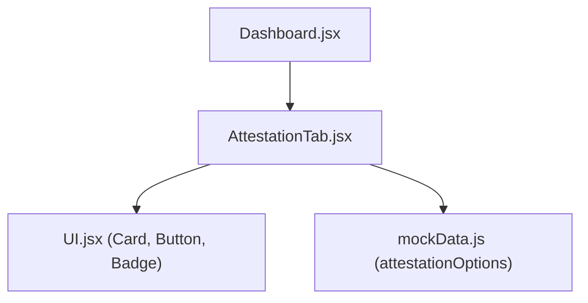
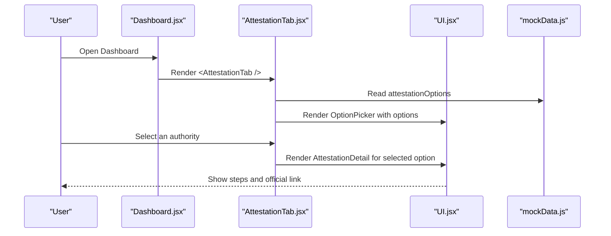
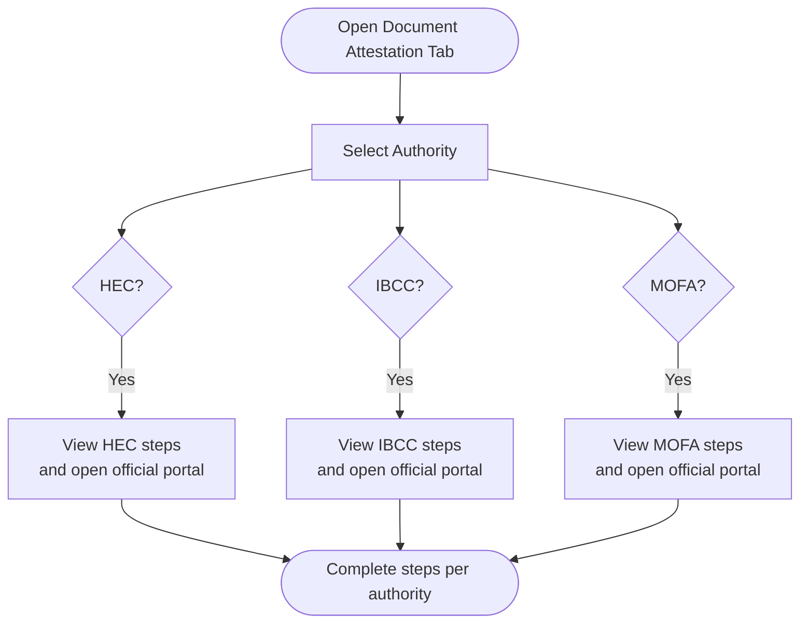
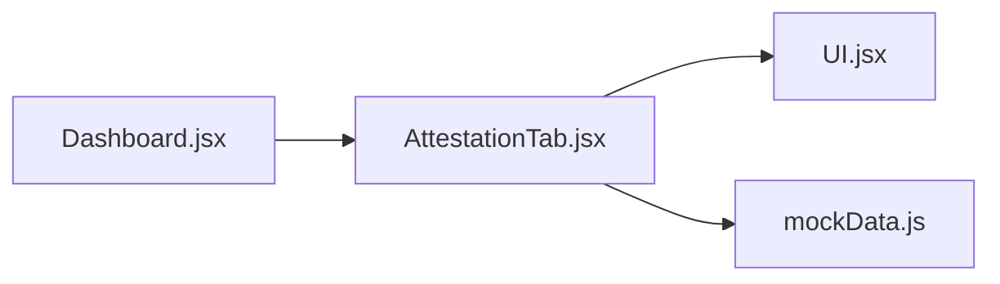

# Document Attestation Tab

<cite>
**Referenced Files in This Document**
- [AttestationTab.jsx](file://scholarpath-frontend (2)/scholarpath/src/pages/AttestationTab.jsx)
- [mockData.js](file://scholarpath-frontend (2)/scholarpath/src/data/mockData.js)
- [UI.jsx](file://scholarpath-frontend (2)/scholarpath/src/components/UI.jsx)
- [Dashboard.jsx](file://scholarpath-frontend (2)/scholarpath/src/pages/Dashboard.jsx)
</cite>

## Table of Contents
1. [Introduction](#introduction)
2. [Project Structure](#project-structure)
3. [Core Components](#core-components)
4. [Architecture Overview](#architecture-overview)
5. [Detailed Component Analysis](#detailed-component-analysis)
6. [Dependency Analysis](#dependency-analysis)
7. [Performance Considerations](#performance-considerations)
8. [Troubleshooting Guide](#troubleshooting-guide)
9. [Conclusion](#conclusion)
10. [Appendices](#appendices)

## Introduction
This document explains the Document Attestation Tab, a guided workflow that helps users complete document verification for study-abroad applications. It covers:
- Step-by-step attestation procedures for HEC, IBCC, and MOFA authorities
- How to navigate authority-specific instructions and official portals
- Visual progress indicators and completion badges used in the interface
- Guidance patterns for completing verification processes
- Current data model and how it can be extended to support progress tracking, deadlines, and external service integrations

The goal is to make the attestation process clear, actionable, and easy to track from start to finish.

## Project Structure
The Attestation Tab is part of the Dashboard application. The tab renders guidance for three attestation authorities using shared UI components and static data.

**Diagram sources**
- [Dashboard.jsx:128-180](file://scholarpath-frontend (2)/scholarpath/src/pages/Dashboard.jsx#L128-L180)
- [AttestationTab.jsx:56-72](file://scholarpath-frontend (2)/scholarpath/src/pages/AttestationTab.jsx#L56-L72)
- [UI.jsx:1-47](file://scholarpath-frontend (2)/scholarpath/src/components/UI.jsx#L1-L47)
- [mockData.js:256-309](file://scholarpath-frontend (2)/scholarpath/src/data/mockData.js#L256-L309)

**Section sources**
- [Dashboard.jsx:128-180](file://scholarpath-frontend (2)/scholarpath/src/pages/Dashboard.jsx#L128-L180)
- [AttestationTab.jsx:56-72](file://scholarpath-frontend (2)/scholarpath/src/pages/AttestationTab.jsx#L56-L72)
- [UI.jsx:1-47](file://scholarpath-frontend (2)/scholarpath/src/components/UI.jsx#L1-L47)
- [mockData.js:256-309](file://scholarpath-frontend (2)/scholarpath/src/data/mockData.js#L256-L309)

## Core Components
- OptionPicker: Renders selectable cards for each authority (HEC, IBCC, MOFA). Highlights the active selection and triggers state updates when clicked.
- AttestationDetail: Displays the selected authority’s name, full name badge, applicable documents, step-by-step instructions, and a link to the official portal.
- AttestationTab: Manages the active authority selection and composes OptionPicker and AttestationDetail.

These components rely on:
- Card, Button, Badge from UI.jsx for consistent styling and interaction
- attestationOptions from mockData.js for content and links

**Section sources**
- [AttestationTab.jsx:5-72](file://scholarpath-frontend (2)/scholarpath/src/pages/AttestationTab.jsx#L5-L72)
- [UI.jsx:1-47](file://scholarpath-frontend (2)/scholarpath/src/components/UI.jsx#L1-L47)
- [mockData.js:256-309](file://scholarpath-frontend (2)/scholarpath/src/data/mockData.js#L256-L309)

## Architecture Overview
The Attestation Tab follows a simple, data-driven architecture:
- State lives within AttestationTab to track the currently selected authority
- Options are provided by mockData.js
- UI components render structured guidance and actions

**Diagram sources**
- [Dashboard.jsx:128-180](file://scholarpath-frontend (2)/scholarpath/src/pages/Dashboard.jsx#L128-L180)
- [AttestationTab.jsx:56-72](file://scholarpath-frontend (2)/scholarpath/src/pages/AttestationTab.jsx#L56-L72)
- [UI.jsx:1-47](file://scholarpath-frontend (2)/scholarpath/src/components/UI.jsx#L1-L47)
- [mockData.js:256-309](file://scholarpath-frontend (2)/scholarpath/src/data/mockData.js#L256-L309)

## Detailed Component Analysis

### Attestation Workflow by Authority
Each authority has a defined set of steps and an official portal link. Users select an authority to view its specific procedure.

- HEC (Higher Education Commission)
  - Purpose: Attests Bachelor’s and Master’s degrees and transcripts
  - Steps include creating an account, uploading certificates, applying for degree attestation, waiting for scrutiny, scheduling appointments, paying fees, and collecting attested documents
  - Official portal link provided for direct access

- IBCC (Inter Board Committee of Chairmen)
  - Purpose: Attests Matric (SSC) and Intermediate (HSSC) certificates
  - Steps include gathering originals and copies, registering online, filling forms, uploading scans, paying fees, verification with issuing board, appointment/courier options, and collection
  - Official portal link provided for direct access

- MOFA (Ministry of Foreign Affairs)
  - Purpose: Provides final attestation/apostille after HEC or IBCC
  - Steps include ensuring prior attestation, booking an appointment, filling details, choosing office and time, printing slip, visiting with documents, paying fees, and collecting apostilled documents
  - Official portal link provided for direct access

**Diagram sources**
- [AttestationTab.jsx:5-54](file://scholarpath-frontend (2)/scholarpath/src/pages/AttestationTab.jsx#L5-L54)
- [mockData.js:256-309](file://scholarpath-frontend (2)/scholarpath/src/data/mockData.js#L256-L309)

**Section sources**
- [AttestationTab.jsx:5-54](file://scholarpath-frontend (2)/scholarpath/src/pages/AttestationTab.jsx#L5-L54)
- [mockData.js:256-309](file://scholarpath-frontend (2)/scholarpath/src/data/mockData.js#L256-L309)

### Visual Progress Indicators and Completion Badges
- Authority selection uses highlighted borders and background to indicate the active choice
- Each authority card displays a blue badge showing the full authority name
- Step numbers are shown as circular markers to guide sequential completion
- A primary button opens the official portal for further action

These visual cues help users understand which authority they are working with and what step they should take next.

**Section sources**
- [AttestationTab.jsx:5-54](file://scholarpath-frontend (2)/scholarpath/src/pages/AttestationTab.jsx#L5-L54)
- [UI.jsx:1-47](file://scholarpath-frontend (2)/scholarpath/src/components/UI.jsx#L1-L47)

### Document Checklist Management
- The app includes a requiredDocuments list with status fields such as submitted, pending, and missing
- While the Attestation Tab focuses on authority procedures, this checklist provides context for overall document readiness
- Statuses can be used to inform users about prerequisites (e.g., ensure documents are submitted before starting an authority process)

Note: The Attestation Tab itself does not modify document statuses; it guides users to the correct authority based on their needs.

**Section sources**
- [mockData.js:33-41](file://scholarpath-frontend (2)/scholarpath/src/data/mockData.js#L33-L41)

### Deadline Reminders for Attestation Processes
- The current implementation does not include deadline tracking for attestations
- Future enhancements could add due dates per authority step and display reminders in the dashboard or tab
- Integration points could include calendar events or push notifications once a backend is available

[No sources needed since this section provides general guidance]

### Integration with External Verification Services
- Each authority entry includes an officialLink that directs users to the relevant government portal
- The Attestation Detail component renders a button to open the official site in a new tab
- No client-side API calls are made; integration is via deep links to external services

**Section sources**
- [AttestationTab.jsx:26-54](file://scholarpath-frontend (2)/scholarpath/src/pages/AttestationTab.jsx#L26-L54)
- [mockData.js:256-309](file://scholarpath-frontend (2)/scholarpath/src/data/mockData.js#L256-L309)

### User Guidance Patterns
- Clear headings and short descriptions introduce the tab’s purpose
- Step-by-step lists break complex processes into manageable actions
- Authority badges and highlighted selections reduce cognitive load
- Direct links to official portals streamline next steps

**Section sources**
- [AttestationTab.jsx:56-72](file://scholarpath-frontend (2)/scholarpath/src/pages/AttestationTab.jsx#L56-L72)
- [AttestationTab.jsx:26-54](file://scholarpath-frontend (2)/scholarpath/src/pages/AttestationTab.jsx#L26-L54)

## Dependency Analysis
The Attestation Tab depends on:
- UI components for rendering cards, buttons, and badges
- Static data for authority options and steps
- Dashboard for navigation and tab management

**Diagram sources**
- [AttestationTab.jsx:1-72](file://scholarpath-frontend (2)/scholarpath/src/pages/AttestationTab.jsx#L1-L72)
- [UI.jsx:1-47](file://scholarpath-frontend (2)/scholarpath/src/components/UI.jsx#L1-L47)
- [mockData.js:256-309](file://scholarpath-frontend (2)/scholarpath/src/data/mockData.js#L256-L309)
- [Dashboard.jsx:128-180](file://scholarpath-frontend (2)/scholarpath/src/pages/Dashboard.jsx#L128-L180)

**Section sources**
- [AttestationTab.jsx:1-72](file://scholarpath-frontend (2)/scholarpath/src/pages/AttestationTab.jsx#L1-L72)
- [UI.jsx:1-47](file://scholarpath-frontend (2)/scholarpath/src/components/UI.jsx#L1-L47)
- [mockData.js:256-309](file://scholarpath-frontend (2)/scholarpath/src/data/mockData.js#L256-L309)
- [Dashboard.jsx:128-180](file://scholarpath-frontend (2)/scholarpath/src/pages/Dashboard.jsx#L128-L180)

## Performance Considerations
- Rendering is lightweight: only local state and static data are used
- No network requests or heavy computations occur in the Attestation Tab
- Using small, focused components improves readability and maintainability

[No sources needed since this section provides general guidance]

## Troubleshooting Guide
Common issues and resolutions:
- Incorrect authority selected: Ensure you choose the authority that matches your document type (HEC for degrees, IBCC for Matric/Intermediate, MOFA for final apostille)
- Official portal link not opening: Verify browser settings allow pop-ups or new tabs; check the officialLink value in the data layer
- Missing steps or unclear instructions: Confirm that the latest version of mockData.js contains up-to-date steps and links

If issues persist, review the component hierarchy and data flow between Dashboard, AttestationTab, UI, and mockData.

**Section sources**
- [AttestationTab.jsx:56-72](file://scholarpath-frontend (2)/scholarpath/src/pages/AttestationTab.jsx#L56-L72)
- [mockData.js:256-309](file://scholarpath-frontend (2)/scholarpath/src/data/mockData.js#L256-L309)

## Conclusion
The Document Attestation Tab provides a clear, step-by-step guide for HEC, IBCC, and MOFA attestations. It uses consistent UI components and static data to present authority-specific procedures and official portal links. While it currently focuses on guidance rather than tracking, the existing structure supports future enhancements such as progress tracking, deadline reminders, and notifications.

[No sources needed since this section summarizes without analyzing specific files]

## Appendices

### Data Model for Attestation Options
- id: Unique identifier for the authority
- name: Short authority name
- fullName: Full authority name displayed as a badge
- forDocuments: Description of documents covered
- steps: Ordered list of instructions
- officialLink: URL to the authority’s official portal

**Section sources**
- [mockData.js:256-309](file://scholarpath-frontend (2)/scholarpath/src/data/mockData.js#L256-L309)

### Example States and Status Tracking
Current states:
- Selected authority: tracked locally in AttestationTab
- Steps: presented as ordered lists; no interactive completion tracking yet

Future states (recommended):
- Per-step completion flags
- Overall progress percentage
- Notifications for pending or overdue steps
- Links to external services with session persistence

[No sources needed since this section proposes conceptual enhancements]