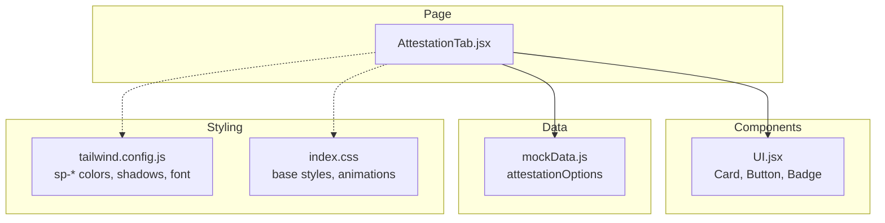
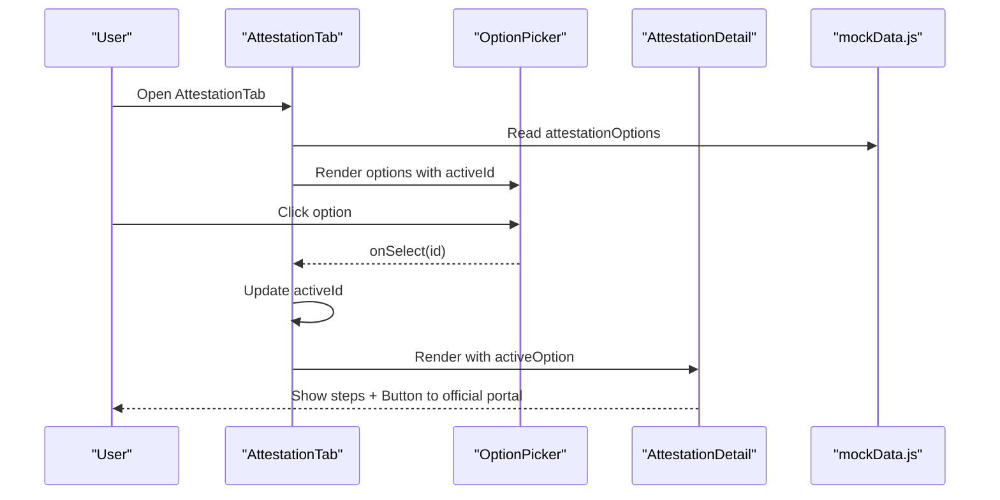
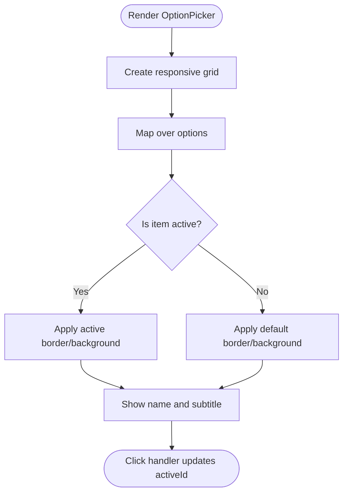
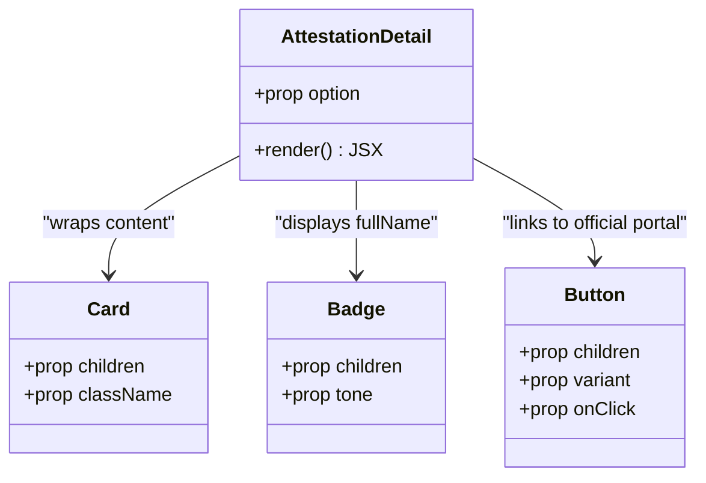
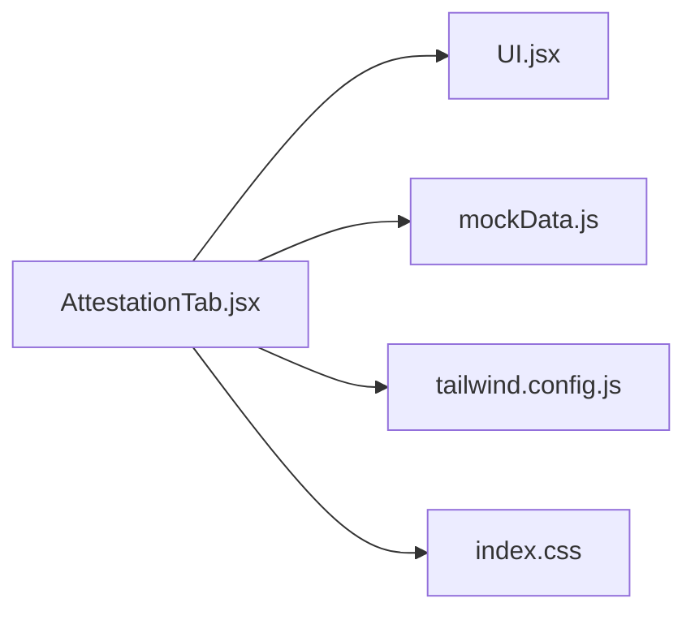

# UI Components and Styling

<cite>
**Referenced Files in This Document**
- [AttestationTab.jsx](file://scholarpath-frontend (2)/scholarpath/src/pages/AttestationTab.jsx)
- [UI.jsx](file://scholarpath-frontend (2)/scholarpath/src/components/UI.jsx)
- [mockData.js](file://scholarpath-frontend (2)/scholarpath/src/data/mockData.js)
- [tailwind.config.js](file://scholarpath-frontend (2)/scholarpath/tailwind.config.js)
- [index.css](file://scholarpath-frontend (2)/scholarpath/src/index.css)
</cite>

## Table of Contents
1. [Introduction](#introduction)
2. [Project Structure](#project-structure)
3. [Core Components](#core-components)
4. [Architecture Overview](#architecture-overview)
5. [Detailed Component Analysis](#detailed-component-analysis)
6. [Dependency Analysis](#dependency-analysis)
7. [Performance Considerations](#performance-considerations)
8. [Troubleshooting Guide](#troubleshooting-guide)
9. [Conclusion](#conclusion)

## Introduction
This document explains the UI components used in the AttestationTab, focusing on OptionPicker and AttestationDetail. It covers the responsive grid layout for authority selection, card-based design patterns, badge styling for authority types, and button integration for external portal access. It also documents the Tailwind CSS styling approach, color schemes using sp-blue and sp-navy themes, spacing patterns, responsive breakpoints, component composition patterns, prop interfaces, and styling consistency across the attestation interface.

## Project Structure
The AttestationTab is implemented as a page-level component that composes reusable UI primitives from a shared component library. Data for the attestation authorities is provided by a centralized mock data module. Styling is handled via Tailwind CSS with custom theme tokens defined in the configuration file and global styles in the main CSS entry.

**Diagram sources**
- [AttestationTab.jsx:1-73](file://scholarpath-frontend (2)/scholarpath/src/pages/AttestationTab.jsx#L1-L73)
- [UI.jsx:1-47](file://scholarpath-frontend (2)/scholarpath/src/components/UI.jsx#L1-L47)
- [mockData.js:256-309](file://scholarpath-frontend (2)/scholarpath/src/data/mockData.js#L256-L309)
- [tailwind.config.js:1-31](file://scholarpath-frontend (2)/scholarpath/tailwind.config.js#L1-L31)
- [index.css:1-35](file://scholarpath-frontend (2)/scholarpath/src/index.css#L1-L35)

**Section sources**
- [AttestationTab.jsx:1-73](file://scholarpath-frontend (2)/scholarpath/src/pages/AttestationTab.jsx#L1-L73)
- [UI.jsx:1-47](file://scholarpath-frontend (2)/scholarpath/src/components/UI.jsx#L1-L47)
- [mockData.js:256-309](file://scholarpath-frontend (2)/scholarpath/src/data/mockData.js#L256-L309)
- [tailwind.config.js:1-31](file://scholarpath-frontend (2)/scholarpath/tailwind.config.js#L1-L31)
- [index.css:1-35](file://scholarpath-frontend (2)/scholarpath/src/index.css#L1-L35)

## Core Components
- OptionPicker: Renders a responsive grid of selectable authority cards. Uses a grid layout that adapts to screen size and highlights the active option with theme-aware borders and background.
- AttestationDetail: Displays detailed steps for the selected authority inside a Card, includes a Badge for the authority’s full name, an ordered step list with numbered indicators, and a Button linking to the official portal.
- Shared UI Primitives:
  - Card: Provides consistent card container styling with border, rounded corners, and shadow.
  - Button: Supports multiple variants (primary, secondary, ghost) with consistent typography and hover states.
  - Badge: Small label component with tone variants (blue, green, amber, gray).

**Section sources**
- [AttestationTab.jsx:5-54](file://scholarpath-frontend (2)/scholarpath/src/pages/AttestationTab.jsx#L5-L54)
- [UI.jsx:1-47](file://scholarpath-frontend (2)/scholarpath/src/components/UI.jsx#L1-L47)

## Architecture Overview
The AttestationTab orchestrates state and rendering:
- State holds the currently selected authority id.
- The active option is resolved from the data source.
- OptionPicker renders selectable options and calls back to update state.
- AttestationDetail renders when an option is active, showing steps and a link to the official portal.

**Diagram sources**
- [AttestationTab.jsx:56-73](file://scholarpath-frontend (2)/scholarpath/src/pages/AttestationTab.jsx#L56-L73)
- [mockData.js:256-309](file://scholarpath-frontend (2)/scholarpath/src/data/mockData.js#L256-L309)

## Detailed Component Analysis

### OptionPicker
- Purpose: Present available attestation authorities as selectable cards in a responsive grid.
- Layout: Uses a responsive grid that switches from single column to three columns at small screens and above.
- Selection state: Highlights the active option with a distinct border and background using theme tokens.
- Typography: Authority name uses a bold navy color; subtitle uses a muted slate color.
- Spacing: Consistent padding and margins ensure visual rhythm and readability.

**Diagram sources**
- [AttestationTab.jsx:5-24](file://scholarpath-frontend (2)/scholarpath/src/pages/AttestationTab.jsx#L5-L24)

**Section sources**
- [AttestationTab.jsx:5-24](file://scholarpath-frontend (2)/scholarpath/src/pages/AttestationTab.jsx#L5-L24)

### AttestationDetail
- Purpose: Display detailed guidance for the selected authority.
- Content:
  - Header with authority name and a Badge indicating the full authority name.
  - Subtitle describing which documents are covered.
  - Ordered step list with numbered indicators styled with theme colors.
  - Call-to-action Button linking to the official portal.
- Container: Wrapped in a Card for consistent elevation and borders.

**Diagram sources**
- [AttestationTab.jsx:26-54](file://scholarpath-frontend (2)/scholarpath/src/pages/AttestationTab.jsx#L26-L54)
- [UI.jsx:1-47](file://scholarpath-frontend (2)/scholarpath/src/components/UI.jsx#L1-L47)

**Section sources**
- [AttestationTab.jsx:26-54](file://scholarpath-frontend (2)/scholarpath/src/pages/AttestationTab.jsx#L26-L54)

### Shared UI Primitives
- Card:
  - Provides white background, border, rounded corners, and a subtle shadow for depth.
  - Accepts optional className for customization.
- Button:
  - Variants: primary (brand blue), secondary (white with border), ghost (text-only).
  - Consistent typography and transition effects.
- Badge:
  - Tone variants: blue, green, amber, gray.
  - Compact label styling for status or category tags.

**Section sources**
- [UI.jsx:1-47](file://scholarpath-frontend (2)/scholarpath/src/components/UI.jsx#L1-L47)

### Data Model and Prop Interfaces
- Attestation options structure:
  - id: string identifier for the authority.
  - name: short display name.
  - fullName: longer descriptive name shown in Badge.
  - forDocuments: text describing applicable documents.
  - steps: array of strings representing application steps.
  - officialLink: URL to the official portal.
- OptionPicker props:
  - options: array of attestation option objects.
  - activeId: currently selected option id.
  - onSelect: callback to set the active option id.
- AttestationDetail props:
  - option: a single attestation option object.

**Section sources**
- [mockData.js:256-309](file://scholarpath-frontend (2)/scholarpath/src/data/mockData.js#L256-L309)
- [AttestationTab.jsx:5-54](file://scholarpath-frontend (2)/scholarpath/src/pages/AttestationTab.jsx#L5-L54)

## Dependency Analysis
- AttestationTab depends on:
  - UI primitives (Card, Button, Badge) for consistent presentation.
  - mockData for authoritative content and links.
- Styling dependencies:
  - Tailwind theme tokens (sp-blue, sp-navy, sp-slate, sp-border, etc.) define the visual language.
  - Global CSS sets base fonts, background, and animation utilities.

**Diagram sources**
- [AttestationTab.jsx:1-73](file://scholarpath-frontend (2)/scholarpath/src/pages/AttestationTab.jsx#L1-L73)
- [UI.jsx:1-47](file://scholarpath-frontend (2)/scholarpath/src/components/UI.jsx#L1-L47)
- [mockData.js:256-309](file://scholarpath-frontend (2)/scholarpath/src/data/mockData.js#L256-L309)
- [tailwind.config.js:1-31](file://scholarpath-frontend (2)/scholarpath/tailwind.config.js#L1-L31)
- [index.css:1-35](file://scholarpath-frontend (2)/scholarpath/src/index.css#L1-L35)

**Section sources**
- [AttestationTab.jsx:1-73](file://scholarpath-frontend (2)/scholarpath/src/pages/AttestationTab.jsx#L1-L73)
- [UI.jsx:1-47](file://scholarpath-frontend (2)/scholarpath/src/components/UI.jsx#L1-L47)
- [mockData.js:256-309](file://scholarpath-frontend (2)/scholarpath/src/data/mockData.js#L256-L309)
- [tailwind.config.js:1-31](file://scholarpath-frontend (2)/scholarpath/tailwind.config.js#L1-L31)
- [index.css:1-35](file://scholarpath-frontend (2)/scholarpath/src/index.css#L1-L35)

## Performance Considerations
- Rendering efficiency:
  - OptionPicker maps over a small, static dataset; performance impact is negligible.
  - Conditional rendering of AttestationDetail avoids unnecessary DOM nodes when no option is selected.
- Styling performance:
  - Tailwind utility classes minimize runtime overhead and leverage prebuilt styles.
  - Using theme tokens ensures consistent, optimized style reuse.
- Accessibility and motion:
  - Global animation respects reduced motion preferences, improving user experience for sensitive users.

[No sources needed since this section provides general guidance]

## Troubleshooting Guide
- Missing or incorrect data:
  - Ensure each attestation option includes all required fields (id, name, fullName, forDocuments, steps, officialLink).
  - Verify that the activeId matches one of the option ids to prevent undefined rendering.
- Link behavior:
  - Official portal links open in new tabs; confirm target and rel attributes are present for security and usability.
- Styling issues:
  - If theme colors appear inconsistent, verify Tailwind theme tokens are correctly configured and imported.
  - Check that global CSS imports Tailwind directives and sets base styles.

**Section sources**
- [mockData.js:256-309](file://scholarpath-frontend (2)/scholarpath/src/data/mockData.js#L256-L309)
- [AttestationTab.jsx:56-73](file://scholarpath-frontend (2)/scholarpath/src/pages/AttestationTab.jsx#L56-L73)
- [tailwind.config.js:1-31](file://scholarpath-frontend (2)/scholarpath/tailwind.config.js#L1-L31)
- [index.css:1-35](file://scholarpath-frontend (2)/scholarpath/src/index.css#L1-L35)

## Conclusion
The AttestationTab leverages a clean, composable architecture with reusable UI primitives and a consistent Tailwind-based theme. OptionPicker provides an accessible, responsive selection interface, while AttestationDetail presents clear, actionable steps with strong visual hierarchy. The use of sp-blue and sp-navy color tokens, along with standardized spacing and typography, ensures a cohesive look and feel across the attestation experience.

[No sources needed since this section summarizes without analyzing specific files]