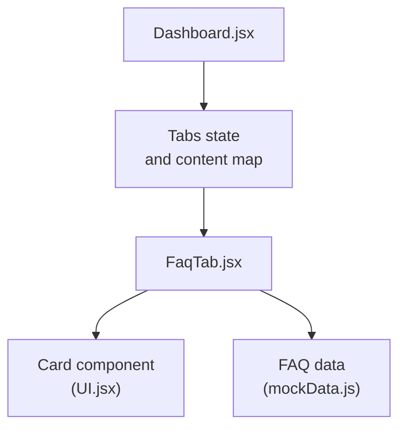
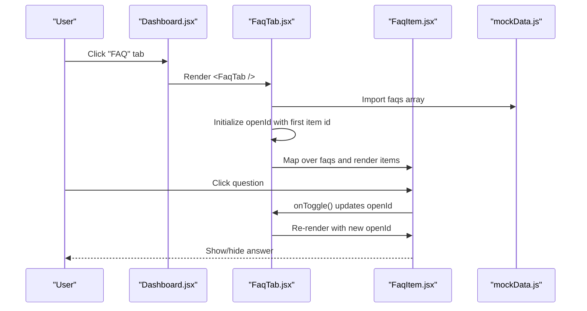
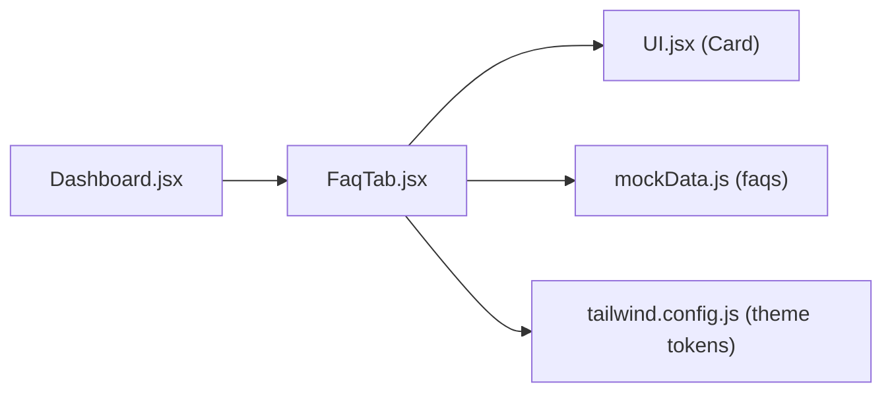
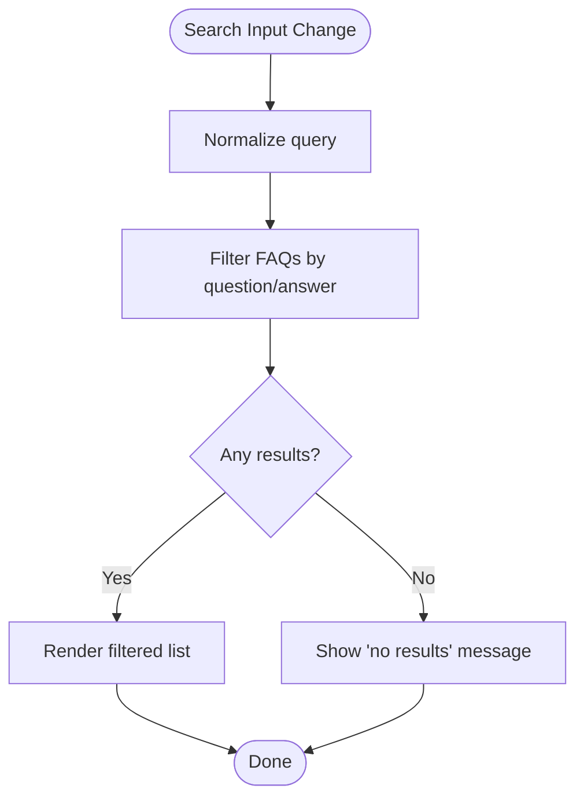

# FAQ Help Tab

<cite>
**Referenced Files in This Document**
- [FaqTab.jsx](file://scholarpath-frontend (2)/scholarpath/src/pages/FaqTab.jsx)
- [mockData.js](file://scholarpath-frontend (2)/scholarpath/src/data/mockData.js)
- [UI.jsx](file://scholarpath-frontend (2)/scholarpath/src/components/UI.jsx)
- [Dashboard.jsx](file://scholarpath-frontend (2)/scholarpath/src/pages/Dashboard.jsx)
- [tailwind.config.js](file://scholarpath-frontend (2)/scholarpath/tailwind.config.js)
</cite>

## Table of Contents
1. Introduction
2. Project Structure
3. Core Components
4. Architecture Overview
5. Detailed Component Analysis
6. Dependency Analysis
7. Performance Considerations
8. Troubleshooting Guide
9. Conclusion
10. Appendices

## Introduction
This document explains the FaqTab component that provides help resources and frequently asked questions for ScholarPathAI users. It covers how FAQs are structured, how expandable question-answer pairs work, where content is managed, and how to extend the feature with search, categorization, feedback, accessibility, and performance optimizations.

## Project Structure
The FAQ feature lives under the dashboard’s tabbed interface:
- The Dashboard renders a sidebar with tabs including “FAQ”.
- When the “FAQ” tab is active, it mounts the FaqTab component.
- FaqTab imports reusable UI primitives and static FAQ data from a central data file.

**Diagram sources**
- [Dashboard.jsx:13-21](file://scholarpath-frontend (2)/scholarpath/src/pages/Dashboard.jsx#L13-L21)
- [Dashboard.jsx:137-152](file://scholarpath-frontend (2)/scholarpath/src/pages/Dashboard.jsx#L137-L152)
- [FaqTab.jsx:1-45](file://scholarpath-frontend (2)/scholarpath/src/pages/FaqTab.jsx#L1-L45)
- [UI.jsx:1-7](file://scholarpath-frontend (2)/scholarpath/src/components/UI.jsx#L1-L7)
- [mockData.js:311-348](file://scholarpath-frontend (2)/scholarpath/src/data/mockData.js#L311-L348)

**Section sources**
- [Dashboard.jsx:13-21](file://scholarpath-frontend (2)/scholarpath/src/pages/Dashboard.jsx#L13-L21)
- [Dashboard.jsx:137-152](file://scholarpath-frontend (2)/scholarpath/src/pages/Dashboard.jsx#L137-L152)
- [FaqTab.jsx:1-45](file://scholarpath-frontend (2)/scholarpath/src/pages/FaqTab.jsx#L1-L45)
- [UI.jsx:1-7](file://scholarpath-frontend (2)/scholarpath/src/components/UI.jsx#L1-L7)
- [mockData.js:311-348](file://scholarpath-frontend (2)/scholarpath/src/data/mockData.js#L311-L348)

## Core Components
- FaqTab: Renders the FAQ section with a header, introductory text, and an accordion list of questions.
- FaqItem: A single expandable row containing a question button and a conditional answer panel.
- Card: Reusable container used by FaqTab to frame the content.

Key behaviors:
- Only one item can be open at a time using a single openId state.
- Toggling an item closes any previously opened item and opens the clicked one.
- Content is sourced from a centralized mock data array.

**Section sources**
- [FaqTab.jsx:5-45](file://scholarpath-frontend (2)/scholarpath/src/pages/FaqTab.jsx#L5-L45)
- [UI.jsx:1-7](file://scholarpath-frontend (2)/scholarpath/src/components/UI.jsx#L1-L7)
- [mockData.js:311-348](file://scholarpath-frontend (2)/scholarpath/src/data/mockData.js#L311-L348)

## Architecture Overview
The FAQ flow is straightforward:
- Dashboard manages tab selection and mounts FaqTab when “faq” is selected.
- FaqTab reads the faqs array from mock data and renders each item.
- Each FaqItem toggles visibility of its answer based on local openId.

**Diagram sources**
- [Dashboard.jsx:137-152](file://scholarpath-frontend (2)/scholarpath/src/pages/Dashboard.jsx#L137-L152)
- [FaqTab.jsx:22-45](file://scholarpath-frontend (2)/scholarpath/src/pages/FaqTab.jsx#L22-L45)
- [FaqTab.jsx:5-20](file://scholarpath-frontend (2)/scholarpath/src/pages/FaqTab.jsx#L5-L20)
- [mockData.js:311-348](file://scholarpath-frontend (2)/scholarpath/src/data/mockData.js#L311-L348)

## Detailed Component Analysis

### FaqTab
Responsibilities:
- Display a short header and guidance text pointing users to the chat assistant if they need more help.
- Manage a single openId to control which FAQ item is expanded.
- Render a list of FaqItem components bound to the faqs dataset.

State and interaction:
- openId tracks the currently expanded item; clicking toggles between opening and closing.
- Uses a stable key per item via unique ids from the data layer.

Accessibility notes:
- Buttons are semantic and keyboard-focusable.
- For improved accessibility, consider adding aria-expanded and aria-controls attributes to indicate state and link to the answer panel.

Styling:
- Uses Tailwind utility classes and theme tokens defined in the project configuration.

**Section sources**
- [FaqTab.jsx:22-45](file://scholarpath-frontend (2)/scholarpath/src/pages/FaqTab.jsx#L22-L45)
- [tailwind.config.js:4-26](file://scholarpath-frontend (2)/scholarpath/tailwind.config.js#L4-L26)

### FaqItem
Responsibilities:
- Present a clickable question and a rotating indicator.
- Conditionally render the answer paragraph when the item is open.

Interaction:
- onClick triggers onToggle passed from FaqTab to update openId.

Accessibility notes:
- Add aria-label or descriptive text for screen readers.
- Indicate whether the item is expanded/collapsed via aria-expanded.

**Section sources**
- [FaqTab.jsx:5-20](file://scholarpath-frontend (2)/scholarpath/src/pages/FaqTab.jsx#L5-L20)

### Data Layer (FAQs)
- The faqs array is the single source of truth for FAQ content.
- Each entry has a unique id, a question string, and an answer string.
- Centralizing content makes it easy to update help articles without touching UI code.

Extensibility:
- To support categorization, add a category field to each entry and filter by category in the UI.
- To support search, add a query state and filter the rendered list by matching against question and answer fields.

**Section sources**
- [mockData.js:311-348](file://scholarpath-frontend (2)/scholarpath/src/data/mockData.js#L311-L348)

### Integration with Dashboard
- The Dashboard defines a TABS array that includes “FAQ”.
- The tabContent map binds the “faq” key to the FaqTab component.
- Selecting the tab mounts the component within the main content area.

**Section sources**
- [Dashboard.jsx:13-21](file://scholarpath-frontend (2)/scholarpath/src/pages/Dashboard.jsx#L13-L21)
- [Dashboard.jsx:137-152](file://scholarpath-frontend (2)/scholarpath/src/pages/Dashboard.jsx#L137-L152)

## Dependency Analysis
- FaqTab depends on:
  - Card from UI.jsx for consistent card styling.
  - faqs from mockData.js for content.
- Dashboard depends on FaqTab through its tab mapping.
- Styling relies on Tailwind theme tokens configured in tailwind.config.js.

**Diagram sources**
- [Dashboard.jsx:137-152](file://scholarpath-frontend (2)/scholarpath/src/pages/Dashboard.jsx#L137-L152)
- [FaqTab.jsx:1-45](file://scholarpath-frontend (2)/scholarpath/src/pages/FaqTab.jsx#L1-L45)
- [UI.jsx:1-7](file://scholarpath-frontend (2)/scholarpath/src/components/UI.jsx#L1-L7)
- [mockData.js:311-348](file://scholarpath-frontend (2)/scholarpath/src/data/mockData.js#L311-L348)
- [tailwind.config.js:4-26](file://scholarpath-frontend (2)/scholarpath/tailwind.config.js#L4-L26)

**Section sources**
- [Dashboard.jsx:137-152](file://scholarpath-frontend (2)/scholarpath/src/pages/Dashboard.jsx#L137-L152)
- [FaqTab.jsx:1-45](file://scholarpath-frontend (2)/scholarpath/src/pages/FaqTab.jsx#L1-L45)
- [UI.jsx:1-7](file://scholarpath-frontend (2)/scholarpath/src/components/UI.jsx#L1-L7)
- [mockData.js:311-348](file://scholarpath-frontend (2)/scholarpath/src/data/mockData.js#L311-L348)
- [tailwind.config.js:4-26](file://scholarpath-frontend (2)/scholarpath/tailwind.config.js#L4-L26)

## Performance Considerations
Current implementation:
- Renders all FAQ items on mount.
- Uses simple state to toggle visibility.

Recommendations for large datasets:
- Virtualization: Render only visible items using a virtualized list to improve scroll performance.
- Memoization: Wrap FaqItem with memoization to avoid re-renders when unrelated items change.
- Debounced search: If implementing search, debounce input handling to reduce re-renders during typing.
- Lazy loading: Load additional pages of FAQs on demand.
- Caching: Cache filtered results locally while the user interacts with filters/search.

[No sources needed since this section provides general guidance]

## Troubleshooting Guide
Common issues and fixes:
- No answers showing: Ensure openId is set correctly and matches an existing faq.id.
- Multiple items open: Confirm that toggling sets openId to either null or the clicked id (single-open behavior).
- Content not updating: Verify that changes are made to the faqs array in the data layer and that keys are stable.
- Accessibility warnings: Add aria-expanded and aria-controls to buttons and panels for screen reader compatibility.

**Section sources**
- [FaqTab.jsx:22-45](file://scholarpath-frontend (2)/scholarpath/src/pages/FaqTab.jsx#L22-L45)
- [FaqTab.jsx:5-20](file://scholarpath-frontend (2)/scholarpath/src/pages/FaqTab.jsx#L5-L20)
- [mockData.js:311-348](file://scholarpath-frontend (2)/scholarpath/src/data/mockData.js#L311-L348)

## Conclusion
The FaqTab provides a clean, accessible foundation for delivering help content to users. Its current design supports expandable Q&A with a single open item and centralized content management. With minimal additions—search, categorization, feedback, and performance enhancements—it can scale to meet growing help needs while maintaining simplicity and usability.

[No sources needed since this section summarizes without analyzing specific files]

## Appendices

### FAQ Data Model
- id: Unique identifier for each FAQ item.
- question: Short, scannable question text.
- answer: Detailed answer text shown when the item is expanded.

To add categorization:
- Add a category field to each entry.
- Filter the list by selected category before rendering.

To add search:
- Maintain a query state.
- Filter entries by matching the query against question and answer fields.

**Section sources**
- [mockData.js:311-348](file://scholarpath-frontend (2)/scholarpath/src/data/mockData.js#L311-L348)

### Search Implementation Pattern
- Add a search input above the FAQ list.
- On input change, compute a filtered subset of faqs based on the query.
- Render the filtered list; show a message when no results match.

[No sources needed since this diagram shows conceptual workflow, not actual code structure]

### User Feedback Mechanism
- Add a small feedback control next to each answer (e.g., helpful/not helpful).
- Record feedback locally or send to analytics backend.
- Use aggregated feedback to prioritize high-demand topics or surface related FAQs.

[No sources needed since this section provides general guidance]

### Integration with Support Channels
- The FAQ page already references the chat assistant for further help.
- Consider adding links to email support or a contact form for complex issues.
- Route unresolved queries from search or feedback into the chat widget or support ticket system.

**Section sources**
- [FaqTab.jsx:25-32](file://scholarpath-frontend (2)/scholarpath/src/pages/FaqTab.jsx#L25-L32)

### Responsive Design Notes
- The layout uses responsive Tailwind utilities and a flexible grid in the dashboard.
- Ensure FAQ items stack vertically on small screens and maintain adequate touch targets for buttons.

**Section sources**
- [Dashboard.jsx:171-180](file://scholarpath-frontend (2)/scholarpath/src/pages/Dashboard.jsx#L171-L180)
- [tailwind.config.js:4-26](file://scholarpath-frontend (2)/scholarpath/tailwind.config.js#L4-L26)

### Accessibility Checklist
- Use semantic elements (button for toggles, paragraphs for answers).
- Provide aria-expanded on toggle buttons to indicate state.
- Associate controls with content via aria-controls and id-based linking.
- Ensure sufficient color contrast using the provided theme tokens.

**Section sources**
- [FaqTab.jsx:5-20](file://scholarpath-frontend (2)/scholarpath/src/pages/FaqTab.jsx#L5-L20)
- [tailwind.config.js:4-26](file://scholarpath-frontend (2)/scholarpath/tailwind.config.js#L4-L26)