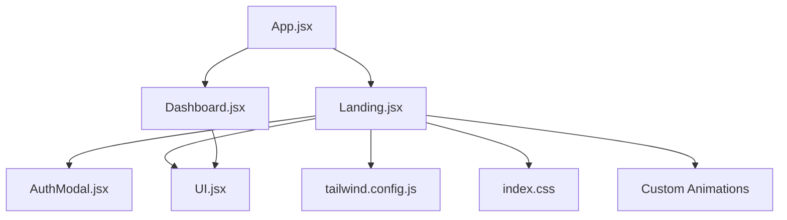
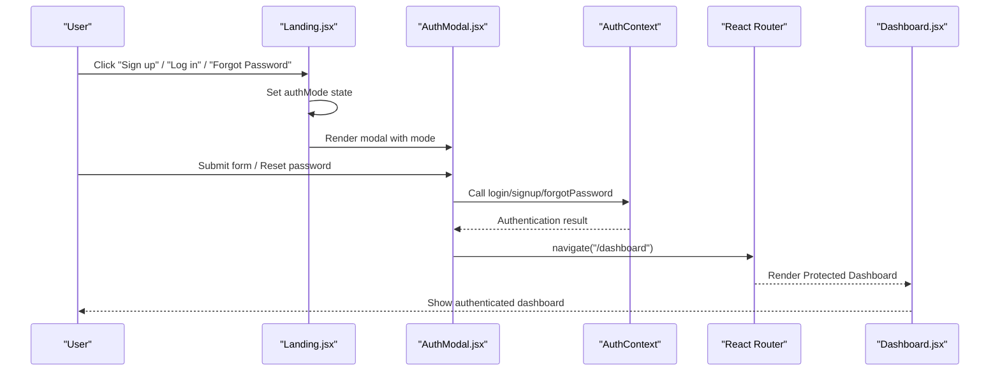
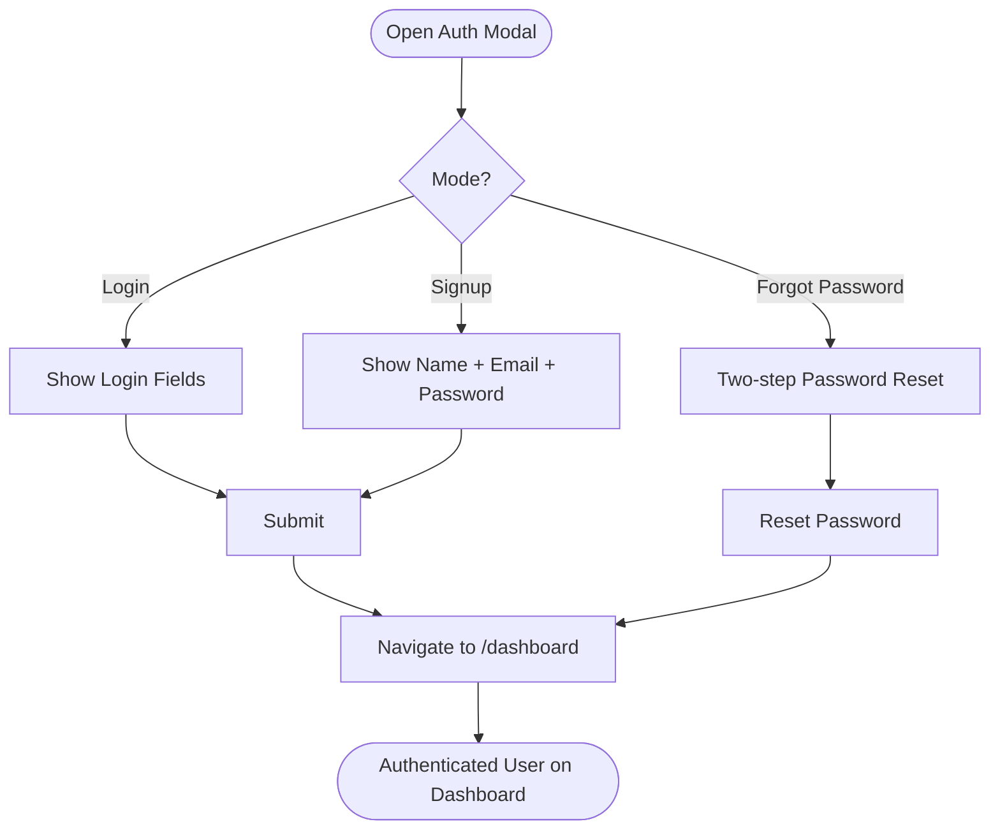
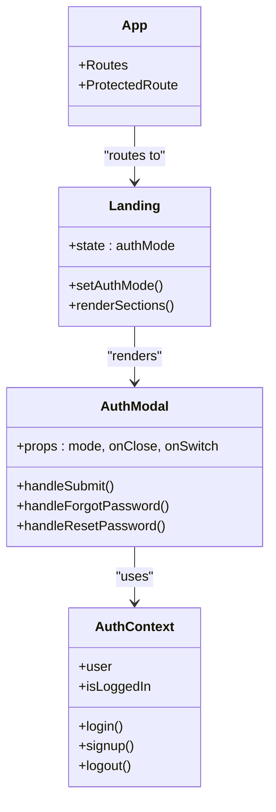
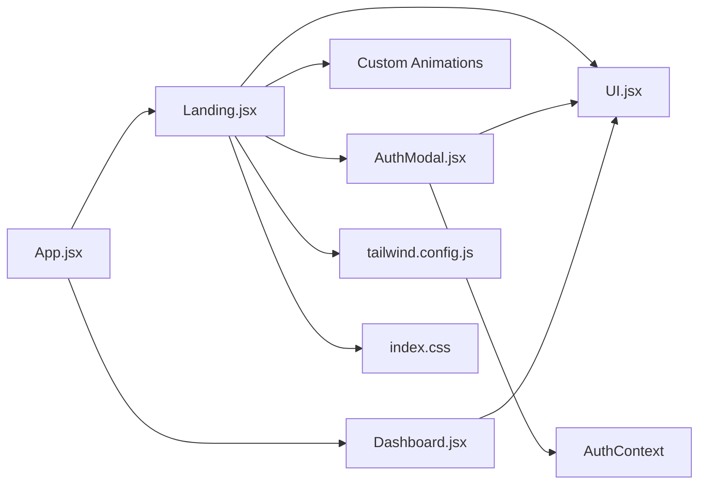

# Landing Page

<cite>
**Referenced Files in This Document**
- [Landing.jsx](file://scholarpath-frontend (2)/scholarpath/src/pages/Landing.jsx)
- [AuthModal.jsx](file://scholarpath-frontend (2)/scholarpath/src/components/AuthModal.jsx)
- [UI.jsx](file://scholarpath-frontend (2)/scholarpath/src/components/UI.jsx)
- [App.jsx](file://scholarpath-frontend (2)/scholarpath/src/App.jsx)
- [Dashboard.jsx](file://scholarpath-frontend (2)/scholarpath/src/pages/Dashboard.jsx)
- [tailwind.config.js](file://scholarpath-frontend (2)/scholarpath/tailwind.config.js)
- [index.css](file://scholarpath-frontend (2)/scholarpath/src/index.css)
</cite>

## Update Summary
**Changes Made**
- Complete landing page redesign with professional design elements
- Added sophisticated animations with six different animation types and staggered delays
- Implemented animated stat counters using IntersectionObserver
- Enhanced hero section with gradient backgrounds and improved layout
- Expanded features showcase from three to six feature cards with emoji icons
- Added study destinations grid with country flags and scholarship counts
- Integrated testimonials section with FAQ accordion functionality
- Added scholarship showcase section highlighting real opportunities
- Enhanced authentication modal with forgot password functionality
- Improved responsive design with better mobile experience

## Table of Contents
1. [Introduction](#introduction)
2. [Project Structure](#project-structure)
3. [Core Components](#core-components)
4. [Architecture Overview](#architecture-overview)
5. [Detailed Component Analysis](#detailed-component-analysis)
6. [Dependency Analysis](#dependency-analysis)
7. [Performance Considerations](#performance-considerations)
8. [Troubleshooting Guide](#troubleshooting-guide)
9. [Conclusion](#conclusion)
10. [Appendices](#appendices)

## Introduction
The Landing page is the public entry point for ScholarPathAI, featuring a complete professional redesign with sophisticated animations and enhanced user experience. It presents a clear value proposition through a gradient hero section, showcases key features with emoji icons, guides users through a streamlined three-step onboarding flow, displays animated platform statistics, and provides comprehensive contact information in an expanded footer. The page integrates an advanced authentication modal with forgot password functionality to drive user acquisition and conversion by routing authenticated users to the dashboard. The page is fully responsive using Tailwind CSS and leverages shared UI primitives for consistent styling and behavior across all screen sizes.

## Project Structure
At a high level:
- The app root defines routes for the landing page and protected dashboard access.
- The landing page composes multiple sections including hero with gradient background, animated stats, six feature cards, how it works steps, scholarship showcase, study destinations grid, FAQ accordion, CTA section, and comprehensive footer.
- An advanced authentication modal handles login/signup flows with forgot password functionality and navigates to the dashboard upon submission.
- Shared UI components provide buttons, cards, badges, social icons, logos, and section headings.
- Tailwind configuration defines brand colors, typography, shadows, and custom animation utilities.
- Global styles include font imports, scroll behavior, custom animations, and reduced motion support.

**Diagram sources**
- [App.jsx:1-23](file://scholarpath-frontend (2)/scholarpath/src/App.jsx#L1-L23)
- [Landing.jsx:1-390](file://scholarpath-frontend (2)/scholarpath/src/pages/Landing.jsx#L1-L390)
- [Dashboard.jsx:1-444](file://scholarpath-frontend (2)/scholarpath/src/pages/Dashboard.jsx#L1-L444)
- [AuthModal.jsx:1-284](file://scholarpath-frontend (2)/scholarpath/src/components/AuthModal.jsx#L1-L284)
- [UI.jsx:1-106](file://scholarpath-frontend (2)/scholarpath/src/components/UI.jsx#L1-L106)
- [tailwind.config.js:1-31](file://scholarpath-frontend (2)/scholarpath/tailwind.config.js#L1-L31)
- [index.css:1-134](file://scholarpath-frontend (2)/scholarpath/src/index.css#L1-L134)

**Section sources**
- [App.jsx:1-23](file://scholarpath-frontend (2)/scholarpath/src/App.jsx#L1-L23)
- [Landing.jsx:1-390](file://scholarpath-frontend (2)/scholarpath/src/pages/Landing.jsx#L1-L390)

## Core Components
- **Enhanced Landing Page**: Professional marketing surface with gradient hero section, animated statistics, six feature cards with emoji icons, study destinations grid, FAQ accordion, scholarship showcase, and comprehensive footer.
- **Advanced Auth Modal**: Sophisticated overlay for login/signup with forgot password functionality, form validation, and seamless navigation to dashboard.
- **UI Primitives**: Reusable Button, Card, Badge, SocialIcon, Logo, SectionHeading, StatCard, and Avatar components for consistent design tokens and interactions.
- **Animation System**: Six different animation types (fade-up, fade-in, slide-in-right, scale-in, count-up, pulse-soft) with staggered delays and reduced motion support.
- **Routing**: Root app wires the landing route and protected dashboard navigation with authentication context.

Key responsibilities:
- **Hero Section**: Gradient background with AI-powered matching badge, compelling headline, supporting copy, dual CTAs, and live match preview card.
- **Animated Statistics**: Three-column grid displaying universities listed, scholarships tracked, and students matched with IntersectionObserver-based counting animations.
- **Features Showcase**: Six cards highlighting smart profile builder, weighted matching engine, document management, university directory, scholarship intelligence, and CV builder.
- **Study Destinations**: Grid showing popular countries with flag emojis and scholarship counts.
- **FAQ Accordion**: Interactive accordion with smooth chevron animations for common questions.
- **Scholarship Showcase**: Real scholarship examples with funding details and deadlines.
- **Footer**: Brand tagline, contact email, social media links, and copyright information.
- **Authentication Flow**: State-driven modal with mode switching between login/signup and forgot password functionality.

**Section sources**
- [Landing.jsx:123-390](file://scholarpath-frontend (2)/scholarpath/src/pages/Landing.jsx#L123-L390)
- [AuthModal.jsx:7-284](file://scholarpath-frontend (2)/scholarpath/src/components/AuthModal.jsx#L7-L284)
- [UI.jsx:1-106](file://scholarpath-frontend (2)/scholarpath/src/components/UI.jsx#L1-L106)
- [index.css:42-134](file://scholarpath-frontend (2)/scholarpath/src/index.css#L42-L134)

## Architecture Overview
The landing page is a React component that renders multiple professional sections and integrates an advanced authentication modal. On user actions (e.g., clicking Sign up, Log in, or Forgot Password), it toggles the modal state with appropriate modes. Upon form submission in the modal, the user is authenticated via the auth context and navigated to the protected dashboard via React Router.

**Diagram sources**
- [Landing.jsx:124-132](file://scholarpath-frontend (2)/scholarpath/src/pages/Landing.jsx#L124-L132)
- [AuthModal.jsx:28-52](file://scholarpath-frontend (2)/scholarpath/src/components/AuthModal.jsx#L28-L52)
- [AuthModal.jsx:54-104](file://scholarpath-frontend (2)/scholarpath/src/components/AuthModal.jsx#L54-L104)
- [App.jsx:6-9](file://scholarpath-frontend (2)/scholarpath/src/App.jsx#L6-L9)

## Detailed Component Analysis

### Enhanced Landing Page Sections

#### Hero Section with Gradient Background
- **Gradient Background**: Smooth gradient from blue-50 via white to slate-50 creating visual depth
- **Value Proposition**: AI-powered matching badge, compelling headline about finding right university and funding
- **Dual CTAs**: Primary "Get started free" and secondary "I have an account" buttons
- **Live Match Preview**: Card showing top matches with fit percentages and country information
- **Staggered Animations**: Fade-up animations with 200ms delay for content hierarchy

#### Animated Statistics Section
- **IntersectionObserver Implementation**: Custom `useCounter` hook triggers counting animation when stats enter viewport
- **Animated Counters**: Numbers animate from 0 to target values with configurable duration (1500ms default)
- **Three Key Metrics**: Universities listed (1,200+), scholarships tracked (3,400+), students matched (40,000+)
- **Count-up Animation**: Smooth number transitions with suffix preservation (+ symbols)

#### Features Showcase with Emoji Icons
- **Six Feature Cards**: Smart Profile Builder, Weighted Matching Engine, Documents in One Place, University Directory, Scholarship Intelligence, CV & Cover Letter Builder
- **Emoji Integration**: Each feature includes relevant emoji icon (📋, 🎯, 📄, 🏛️, 💰, 📝)
- **Hover Effects**: Card lift animations with shadow enhancement on hover
- **Responsive Grid**: Adapts from single column on mobile to three columns on desktop

#### Study Destinations Grid
- **Country Display**: Six popular destinations (Germany, UK, Australia, Canada, USA, Netherlands)
- **Flag Emojis**: Visual representation with national flag emojis (🇩🇪, 🇬🇧, 🇦🇺, 🇨🇦, 🇺🇸, 🇳🇱)
- **Scholarship Counts**: Number of available scholarships per destination
- **Interactive Cards**: Hover effects and click-ready design

#### FAQ Accordion Section
- **Native Details/Summary**: Semantic HTML5 accordion implementation
- **Smooth Animations**: Chevron rotation animation when expanding/collapsing
- **Four Common Questions**: Coverage of pricing, supported countries, matching accuracy, and CV upload
- **Professional Styling**: Clean borders, spacing, and typography

#### Scholarship Showcase Section
- **Real Examples**: DAAD Scholarship (Germany), Chevening Scholarship (UK), Melbourne Research (Australia)
- **Funding Details**: Full tuition coverage, monthly stipends, partial funding information
- **Deadline Information**: Clear deadline display for each opportunity
- **Status Badges**: Fully Funded vs Partial funding indicators

**Updated** Complete redesign with professional design elements, sophisticated animations, and enhanced user experience

**Section sources**
- [Landing.jsx:157-202](file://scholarpath-frontend (2)/scholarpath/src/pages/Landing.jsx#L157-L202)
- [Landing.jsx:204-211](file://scholarpath-frontend (2)/scholarpath/src/pages/Landing.jsx#L204-L211)
- [Landing.jsx:213-231](file://scholarpath-frontend (2)/scholarpath/src/pages/Landing.jsx#L213-L231)
- [Landing.jsx:283-301](file://scholarpath-frontend (2)/scholarpath/src/pages/Landing.jsx#L283-L301)
- [Landing.jsx:303-325](file://scholarpath-frontend (2)/scholarpath/src/pages/Landing.jsx#L303-L325)
- [Landing.jsx:261-281](file://scholarpath-frontend (2)/scholarpath/src/pages/Landing.jsx#L261-L281)

### Advanced Authentication Modal Integration

#### Enhanced Modal Features
- **Forgot Password Functionality**: Two-step password reset process with token generation
- **Form Validation**: Comprehensive validation for all input fields with error messaging
- **Loading States**: Proper loading indicators during authentication processes
- **Security Features**: Password visibility toggle and secure form handling

#### Authentication Flow
- **State Management**: Local state controls modal visibility and current mode (login/signup/forgot-password)
- **API Integration**: Direct integration with auth API for login, signup, and password reset operations
- **Navigation Handling**: Seamless redirect to dashboard after successful authentication
- **Error Handling**: User-friendly error messages and retry mechanisms

**Diagram sources**
- [Landing.jsx:124-132](file://scholarpath-frontend (2)/scholarpath/src/pages/Landing.jsx#L124-L132)
- [AuthModal.jsx:25-52](file://scholarpath-frontend (2)/scholarpath/src/components/AuthModal.jsx#L25-L52)
- [AuthModal.jsx:54-104](file://scholarpath-frontend (2)/scholarpath/src/components/AuthModal.jsx#L54-L104)
- [App.jsx:1-23](file://scholarpath-frontend (2)/scholarpath/src/App.jsx#L1-L23)

**Section sources**
- [Landing.jsx:124-132](file://scholarpath-frontend (2)/scholarpath/src/pages/Landing.jsx#L124-L132)
- [AuthModal.jsx:7-284](file://scholarpath-frontend (2)/scholarpath/src/components/AuthModal.jsx#L7-L284)
- [App.jsx:1-23](file://scholarpath-frontend (2)/scholarpath/src/App.jsx#L1-L23)

### Enhanced UI Primitives and Design Tokens

#### Expanded Component Library
- **Logo Component**: Scalable logo with brand colors and proper alt text
- **Enhanced Card Component**: Optional hover effects with lift animations and shadow enhancement
- **Button Variants**: Primary, secondary, and ghost variants with consistent styling
- **Badge System**: Color-coded tones (blue, green, amber, gray, red) for status indicators
- **Social Icon**: Circular icon containers with hover effects for social media links
- **StatCard Component**: Specialized card for displaying statistics with icons and color coding
- **Avatar Component**: Initial-based avatars with customizable sizing
- **SectionHeading Component**: Consistent heading structure with label, title, and subtitle support

#### Tailwind Theme Customization
- **Brand Colors**: Comprehensive color palette (sp-blue, sp-navy, sp-slate, sp-border, sp-bg, sp-green, sp-amber)
- **Typography**: Inter font family with system font fallbacks
- **Shadows**: Custom card shadows for elevation and depth
- **Animations**: Six custom animation classes with staggered delay support

#### Global Style Enhancements
- **Font Import**: Google Fonts import for Inter typeface
- **Scroll Behavior**: Smooth scrolling throughout the application
- **Custom Scrollbar**: Styled scrollbar with brand colors
- **Selection Styling**: Custom text selection colors
- **Animation Classes**: Fade-up, fade-in, slide-in-right, scale-in, count-up, and pulse-soft animations
- **Reduced Motion Support**: Respects user preferences for motion reduction

**Updated** Expanded UI component library with new components and enhanced styling capabilities

**Section sources**
- [UI.jsx:1-106](file://scholarpath-frontend (2)/scholarpath/src/components/UI.jsx#L1-L106)
- [tailwind.config.js:1-31](file://scholarpath-frontend (2)/scholarpath/tailwind.config.js#L1-L31)
- [index.css:1-134](file://scholarpath-frontend (2)/scholarpath/src/index.css#L1-L134)

### Responsive Design Implementation

#### Mobile-First Approach
- **Adaptive Layouts**: Grid systems that adapt from single-column on mobile to multi-column on larger screens
- **Navigation Optimization**: Hidden navigation links on small screens with emphasis on action buttons
- **Touch-Friendly Elements**: Appropriately sized interactive elements for mobile interaction
- **Spacing Scaling**: Consistent spacing and typography scaling across breakpoints

#### Animation Responsiveness
- **Performance Optimization**: Animations respect reduced motion preferences
- **Progressive Enhancement**: Basic functionality without animations, enhanced with animations when supported
- **Staggered Delays**: Sequential animation timing for better visual hierarchy

**Section sources**
- [Landing.jsx:134-154](file://scholarpath-frontend (2)/scholarpath/src/pages/Landing.jsx#L134-L154)
- [Landing.jsx:157-202](file://scholarpath-frontend (2)/scholarpath/src/pages/Landing.jsx#L157-L202)
- [Landing.jsx:213-231](file://scholarpath-frontend (2)/scholarpath/src/pages/Landing.jsx#L213-L231)
- [index.css:117-134](file://scholarpath-frontend (2)/scholarpath/src/index.css#L117-L134)

### State Management for Authentication Flow

#### Local State Management
- **Auth Mode State**: Controls current authentication mode (login/signup/forgot-password)
- **Modal Visibility**: Manages modal open/close state
- **Form State**: Handles form inputs and validation within the modal
- **Error State**: Manages error messages and user feedback

#### Context Integration
- **Auth Context**: Integration with global authentication state
- **Protected Routes**: Navigation protection based on authentication status
- **User Data**: Access to authenticated user information

**Diagram sources**
- [Landing.jsx:124-132](file://scholarpath-frontend (2)/scholarpath/src/pages/Landing.jsx#L124-L132)
- [AuthModal.jsx:7-284](file://scholarpath-frontend (2)/scholarpath/src/components/AuthModal.jsx#L7-L284)
- [App.jsx:1-23](file://scholarpath-frontend (2)/scholarpath/src/App.jsx#L1-L23)

**Section sources**
- [Landing.jsx:124-132](file://scholarpath-frontend (2)/scholarpath/src/pages/Landing.jsx#L124-L132)
- [AuthModal.jsx:7-284](file://scholarpath-frontend (2)/scholarpath/src/components/AuthModal.jsx#L7-L284)

### Driving Acquisition and Conversion

#### Multi-Point Conversion Strategy
- **Header CTAs**: Persistent login/signup buttons in sticky header
- **Hero CTAs**: Prominent primary and secondary calls-to-action
- **Bottom CTA**: Final conversion opportunity before footer
- **Social Proof**: Statistics and match previews build trust

#### Enhanced User Experience
- **Clear Value Proposition**: Immediate understanding of platform benefits
- **Simplified Steps**: Three-step onboarding process (Build → Get Matched → Apply)
- **Real Examples**: Actual scholarship examples demonstrate platform capability
- **Professional Design**: High-quality visuals and animations enhance credibility

#### Conversion Flow Examples
- **New User Flow**: "Get started free" → Signup modal → Form submission → Dashboard redirect
- **Returning User Flow**: "I have an account" → Login modal → Authentication → Dashboard redirect
- **Password Recovery Flow**: "Forgot password" → Email input → Token generation → Password reset → Login redirect

**Updated** Enhanced conversion strategy with additional touchpoints and improved user experience

**Section sources**
- [Landing.jsx:145-152](file://scholarpath-frontend (2)/scholarpath/src/pages/Landing.jsx#L145-L152)
- [Landing.jsx:170-178](file://scholarpath-frontend (2)/scholarpath/src/pages/Landing.jsx#L170-L178)
- [Landing.jsx:327-344](file://scholarpath-frontend (2)/scholarpath/src/pages/Landing.jsx#L327-L344)
- [AuthModal.jsx:28-52](file://scholarpath-frontend (2)/scholarpath/src/components/AuthModal.jsx#L28-L52)

## Dependency Analysis
- **Landing Page**: Depends on UI primitives for consistent visuals, authentication modal for user management, and custom animations for enhanced UX
- **Authentication Modal**: Integrates with auth context for state management and API calls for authentication operations
- **UI Components**: Provide reusable building blocks consumed across both landing and dashboard pages
- **Routing**: App orchestrates navigation between landing and protected dashboard routes
- **Styling**: Tailwind configuration centralizes design tokens while global styles provide animations and base styling

**Diagram sources**
- [Landing.jsx:1-390](file://scholarpath-frontend (2)/scholarpath/src/pages/Landing.jsx#L1-L390)
- [AuthModal.jsx:1-284](file://scholarpath-frontend (2)/scholarpath/src/components/AuthModal.jsx#L1-L284)
- [UI.jsx:1-106](file://scholarpath-frontend (2)/scholarpath/src/components/UI.jsx#L1-L106)
- [App.jsx:1-23](file://scholarpath-frontend (2)/scholarpath/src/App.jsx#L1-L23)
- [tailwind.config.js:1-31](file://scholarpath-frontend (2)/scholarpath/tailwind.config.js#L1-L31)
- [index.css:1-134](file://scholarpath-frontend (2)/scholarpath/src/index.css#L1-L134)

**Section sources**
- [Landing.jsx:1-390](file://scholarpath-frontend (2)/scholarpath/src/pages/Landing.jsx#L1-L390)
- [AuthModal.jsx:1-284](file://scholarpath-frontend (2)/scholarpath/src/components/AuthModal.jsx#L1-L284)
- [UI.jsx:1-106](file://scholarpath-frontend (2)/scholarpath/src/components/UI.jsx#L1-L106)
- [App.jsx:1-23](file://scholarpath-frontend (2)/scholarpath/src/App.jsx#L1-L23)
- [tailwind.config.js:1-31](file://scholarpath-frontend (2)/scholarpath/tailwind.config.js#L1-L31)
- [index.css:1-134](file://scholarpath-frontend (2)/scholarpath/src/index.css#L1-L134)

## Performance Considerations

### Optimized Animations
- **IntersectionObserver Usage**: Efficient viewport detection for triggering animations only when needed
- **Reduced Motion Support**: Respects user preferences for motion sensitivity
- **Staggered Delays**: Sequential animations reduce perceived performance impact
- **CSS Animations**: Hardware-accelerated animations for smooth performance

### Memory Management
- **Component Cleanup**: Proper cleanup of IntersectionObserver instances
- **State Management**: Minimal local state to prevent unnecessary re-renders
- **Static Data**: Arrays for features, steps, and other static content avoid recomputation

### Loading Performance
- **Lazy Loading**: Animations trigger on demand rather than on initial load
- **Efficient Rendering**: React's virtual DOM optimization for complex layouts
- **Tailwind Purging**: Unused CSS classes removed in production builds

## Troubleshooting Guide

### Animation Issues
- **Animations Not Visible**: Verify global styles are loaded and reduced motion settings are not interfering
- **Staggered Timing Problems**: Check delay class names and ensure they're properly applied
- **Performance Issues**: Monitor IntersectionObserver usage and consider reducing animation complexity

### Authentication Problems
- **Modal Not Closing**: Ensure close handlers are properly passed and invoked
- **Navigation Failures**: Verify React Router setup and protected route configuration
- **Form Validation Errors**: Check validation logic and error message display

### Responsive Design Issues
- **Layout Breakpoints**: Test across different screen sizes and adjust Tailwind breakpoints if needed
- **Touch Interaction**: Verify button sizes and spacing for mobile devices
- **Animation Responsiveness**: Ensure animations work correctly on different devices

**Section sources**
- [AuthModal.jsx:28-52](file://scholarpath-frontend (2)/scholarpath/src/components/AuthModal.jsx#L28-L52)
- [index.css:117-134](file://scholarpath-frontend (2)/scholarpath/src/index.css#L117-L134)
- [App.jsx:6-9](file://scholarpath-frontend (2)/scholarpath/src/App.jsx#L6-L9)

## Conclusion
The Landing page represents a complete professional redesign that significantly enhances ScholarPathAI's user acquisition and conversion capabilities. With its sophisticated animation system, comprehensive feature showcase, and streamlined authentication flow, it effectively communicates the platform's value proposition while providing an engaging user experience. The modular architecture, responsive design, and extensive UI component library ensure scalability and maintainability. The integration of advanced authentication features, including forgot password functionality, creates a robust user onboarding experience that converts visitors into authenticated users efficiently.

## Appendices

### Enhanced User Flows
- **New User Journey**: Click "Get started free" → Signup modal with name/email/password → Form validation → Authentication → Dashboard redirect with welcome banner
- **Returning User Journey**: Click "I have an account" → Login modal → Credentials validation → Authentication → Dashboard with personalized data
- **Password Recovery Flow**: Click "Forgot password" → Email input → Token generation → New password setup → Redirect to login

### Comprehensive Section Breakdown
- **Hero Section**: Gradient background, AI-powered matching badge, compelling headline, dual CTAs, live match preview
- **Animated Statistics**: IntersectionObserver-triggered counters for universities, scholarships, and student matches
- **Feature Showcase**: Six comprehensive features with emoji icons and detailed descriptions
- **Study Destinations**: Country grid with flag emojis and scholarship availability
- **FAQ Accordion**: Interactive accordion with smooth animations covering common questions
- **Scholarship Showcase**: Real scholarship examples with funding details and deadlines
- **Call-to-Action**: Prominent final conversion opportunity with gradient background
- **Footer**: Comprehensive contact information, social media links, and legal information

### Technical Implementation Details
- **Animation System**: Six custom animations with staggered delays and reduced motion support
- **State Management**: Local state for modal control, integrated with global auth context
- **Responsive Design**: Mobile-first approach with adaptive layouts and touch-friendly interactions
- **Performance Optimization**: Lazy loading, efficient rendering, and memory management