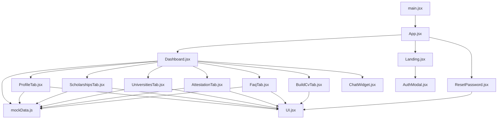
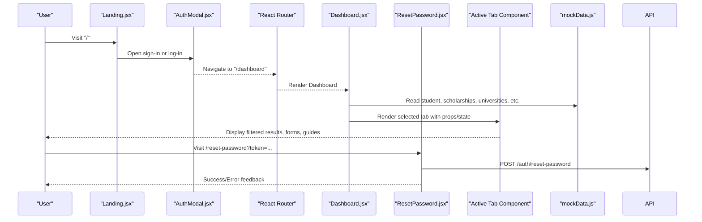
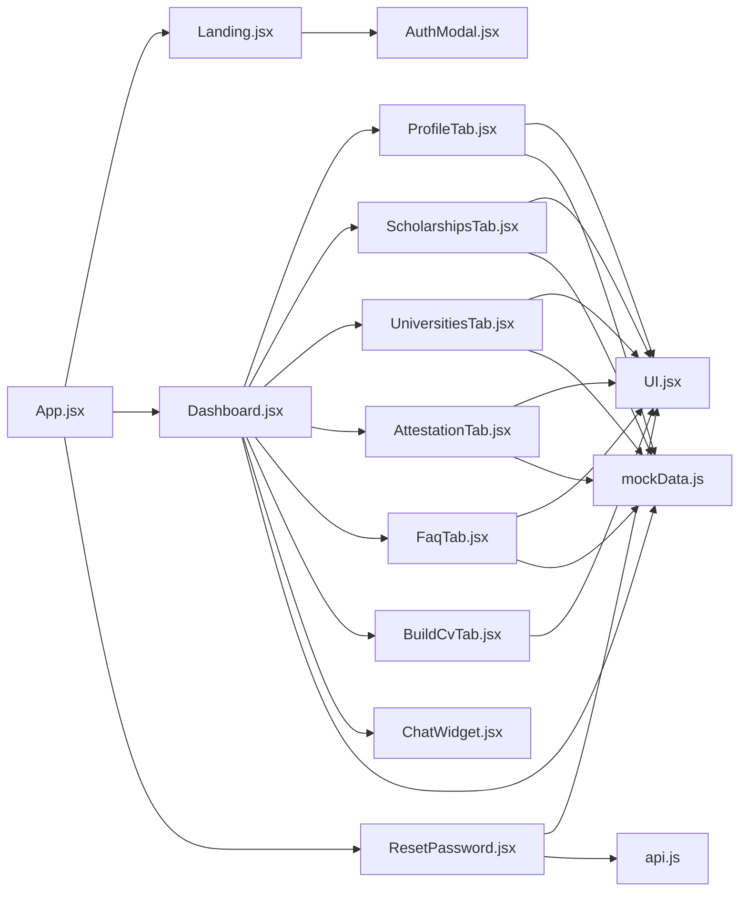

# Page Components

<cite>
**Referenced Files in This Document**
- [App.jsx](file://scholarpath-frontend (2)/scholarpath/src/App.jsx)
- [main.jsx](file://scholarpath-frontend (2)/scholarpath/src/main.jsx)
- [Landing.jsx](file://scholarpath-frontend (2)/scholarpath/src/pages/Landing.jsx)
- [Dashboard.jsx](file://scholarpath-frontend (2)/scholarpath/src/pages/Dashboard.jsx)
- [ResetPassword.jsx](file://scholarpath-frontend (2)/scholarpath/src/pages/ResetPassword.jsx)
- [ProfileTab.jsx](file://scholarpath-frontend (2)/scholarpath/src/pages/ProfileTab.jsx)
- [ScholarshipsTab.jsx](file://scholarpath-frontend (2)/scholarpath/src/pages/ScholarshipsTab.jsx)
- [UniversitiesTab.jsx](file://scholarpath-frontend (2)/scholarpath/src/pages/UniversitiesTab.jsx)
- [AttestationTab.jsx](file://scholarpath-frontend (2)/scholarpath/src/pages/AttestationTab.jsx)
- [FaqTab.jsx](file://scholarpath-frontend (2)/scholarpath/src/pages/FaqTab.jsx)
- [BuildCvTab.jsx](file://scholarpath-frontend (2)/scholarpath/src/pages/BuildCvTab.jsx)
- [UI.jsx](file://scholarpath-frontend (2)/scholarpath/src/components/UI.jsx)
- [AuthModal.jsx](file://scholarpath-frontend (2)/scholarpath/src/components/AuthModal.jsx)
- [AuthContext.jsx](file://scholarpath-frontend (2)/scholarpath/src/components/AuthContext.jsx)
- [ChatWidget.jsx](file://scholarpath-frontend (2)/scholarpath/src/components/ChatWidget.jsx)
- [api.js](file://scholarpath-frontend (2)/scholarpath/src/api.js)
- [mockData.js](file://scholarpath-frontend (2)/scholarpath/src/data/mockData.js)
</cite>

## Update Summary
**Changes Made**
- Added comprehensive documentation for the new ResetPassword.jsx page with token-based password reset functionality
- Updated authentication context section to document hydration fixes that prevent white screen issues on refresh
- Enhanced routing documentation to include the new reset-password route and legacy link forwarding
- Updated API integration documentation to include password reset endpoints

## Table of Contents
1. Introduction
2. Project Structure
3. Core Components
4. Architecture Overview
5. Detailed Component Analysis
6. Dependency Analysis
7. Performance Considerations
8. Troubleshooting Guide
9. Conclusion

## Introduction
This document provides detailed documentation for all page components in the ScholarPathAI application. It covers:
- Landing page as the public entry point with feature showcase and user onboarding flow
- Dashboard as the main authenticated interface with tab-based navigation
- Password reset functionality with both modern token-based links (?token=...) and legacy reset links (?reset=...)
- Each tab component: Profile, Scholarships, Universities, Attestation, FAQ, and Build CV
For each page, it documents user interactions, data flow, API integrations (current mock-based), state management patterns, responsive design considerations, and accessibility features.

## Project Structure
The application is a React + Vite frontend using React Router for routing. The root entry renders the App, which defines routes for Landing, Dashboard, and Password Reset functionality. The Dashboard hosts a sidebar/tab system that renders one of several tab components. Shared UI primitives are provided by a small UI component library. All static content and mock datasets live in a single data module to simplify future migration to real APIs.

**Diagram sources**
- [main.jsx:1-11](file://scholarpath-frontend (2)/scholarpath/src/main.jsx#L1-L11)
- [App.jsx:1-54](file://scholarpath-frontend (2)/scholarpath/src/App.jsx#L1-L54)
- [Dashboard.jsx:1-187](file://scholarpath-frontend (2)/scholarpath/src/pages/Dashboard.jsx#L1-L187)
- [Landing.jsx:1-211](file://scholarpath-frontend (2)/scholarpath/src/pages/Landing.jsx#L1-L211)
- [ResetPassword.jsx:1-214](file://scholarpath-frontend (2)/scholarpath/src/pages/ResetPassword.jsx#L1-L214)
- [ProfileTab.jsx:1-232](file://scholarpath-frontend (2)/scholarpath/src/pages/ProfileTab.jsx#L1-L232)
- [ScholarshipsTab.jsx:1-139](file://scholarpath-frontend (2)/scholarpath/src/pages/ScholarshipsTab.jsx#L1-L139)
- [UniversitiesTab.jsx:1-163](file://scholarpath-frontend (2)/scholarpath/src/pages/UniversitiesTab.jsx#L1-L163)
- [AttestationTab.jsx:1-73](file://scholarpath-frontend (2)/scholarpath/src/pages/AttestationTab.jsx#L1-L73)
- [FaqTab.jsx:1-46](file://scholarpath-frontend (2)/scholarpath/src/pages/FaqTab.jsx#L1-L46)
- [BuildCvTab.jsx:1-284](file://scholarpath-frontend (2)/scholarpath/src/pages/BuildCvTab.jsx#L1-L284)
- [UI.jsx:1-47](file://scholarpath-frontend (2)/scholarpath/src/components/UI.jsx#L1-L47)
- [AuthModal.jsx:1-282](file://scholarpath-frontend (2)/scholarpath/src/components/AuthModal.jsx#L1-L282)
- [ChatWidget.jsx:1-104](file://scholarpath-frontend (2)/scholarpath/src/components/ChatWidget.jsx#L1-L104)
- [mockData.js:1-349](file://scholarpath-frontend (2)/scholarpath/src/data/mockData.js#L1-L349)

**Section sources**
- [main.jsx:1-11](file://scholarpath-frontend (2)/scholarpath/src/main.jsx#L1-L11)
- [App.jsx:1-54](file://scholarpath-frontend (2)/scholarpath/src/App.jsx#L1-L54)

## Core Components
- Routing and app shell:
  - Root renderer initializes React StrictMode and mounts App.
  - App configures three routes: Landing, Dashboard (protected), and ResetPassword (public).
  - ProtectedRoute component ensures only authenticated users can access dashboard.
  - Home component handles legacy reset link forwarding from ?reset=... to /reset-password?token=...
- Authentication context:
  - AuthProvider manages user state with proper hydration from localStorage to prevent white screen issues on refresh.
  - Context includes loading state during initial hydration to show spinner while restoring session.
- Shared UI primitives:
  - Card, Button, Badge, SocialIcon provide consistent styling and behavior across pages.
- Authentication modal:
  - Lightweight overlay for login/signup flows; currently mocks authentication and navigates to Dashboard.
  - Includes integrated forgot password functionality with email sending and token handling.
- Chat assistant:
  - Floating widget with message history, typing indicator, and canned responses.

**Section sources**
- [main.jsx:1-11](file://scholarpath-frontend (2)/scholarpath/src/main.jsx#L1-L11)
- [App.jsx:1-54](file://scholarpath-frontend (2)/scholarpath/src/App.jsx#L1-L54)
- [AuthContext.jsx:1-65](file://scholarpath-frontend (2)/scholarpath/src/components/AuthContext.jsx#L1-L65)
- [UI.jsx:1-47](file://scholarpath-frontend (2)/scholarpath/src/components/UI.jsx#L1-L47)
- [AuthModal.jsx:1-282](file://scholarpath-frontend (2)/scholarpath/src/components/AuthModal.jsx#L1-L282)
- [ChatWidget.jsx:1-104](file://scholarpath-frontend (2)/scholarpath/src/components/ChatWidget.jsx#L1-L104)

## Architecture Overview
The application follows a client-side architecture with enhanced authentication handling:
- Public routes (/) serve the Landing page with marketing content and an auth modal.
- Protected route (/dashboard) hosts a tabbed dashboard with shared state for profile and documents.
- Public reset route (/reset-password) handles password reset with both modern and legacy link formats.
- Authentication context properly hydrates from localStorage on app startup to prevent white screen issues.
- Data layer is centralized in a mock data module; tabs read from this module and update local state.
- No backend calls are implemented yet; comments indicate where to integrate real APIs later.

**Diagram sources**
- [App.jsx:1-54](file://scholarpath-frontend (2)/scholarpath/src/App.jsx#L1-L54)
- [Landing.jsx:1-211](file://scholarpath-frontend (2)/scholarpath/src/pages/Landing.jsx#L1-L211)
- [AuthModal.jsx:1-282](file://scholarpath-frontend (2)/scholarpath/src/components/AuthModal.jsx#L1-L282)
- [Dashboard.jsx:1-187](file://scholarpath-frontend (2)/scholarpath/src/pages/Dashboard.jsx#L1-L187)
- [ResetPassword.jsx:1-214](file://scholarpath-frontend (2)/scholarpath/src/pages/ResetPassword.jsx#L1-L214)
- [mockData.js:1-349](file://scholarpath-frontend (2)/scholarpath/src/data/mockData.js#L1-L349)

## Detailed Component Analysis

### Landing Page
Purpose:
- Public entry point showcasing value proposition, features, steps, and social proof.
- Drives user onboarding via Sign up / Log in buttons that open the AuthModal.

Key interactions:
- Header navigation links to sections within the page.
- "Get started free" and "I have an account" open the AuthModal in signup/login modes.
- Footer includes contact email and social icons.

Data flow:
- Static content rendered directly in the component.
- Mock university matches shown in hero card for visual appeal.

State management:
- Local state controls AuthModal mode and visibility.

Responsive design:
- Uses responsive grid layouts and conditional classes to adapt to mobile and desktop.
- Sticky header with backdrop blur for better readability.

Accessibility:
- Semantic HTML structure with headings and landmarks.
- Links include descriptive text; social icons use labels.

API integration:
- None currently; ready to connect to backend for dynamic content.

**Section sources**
- [Landing.jsx:1-211](file://scholarpath-frontend (2)/scholarpath/src/pages/Landing.jsx#L1-L211)
- [AuthModal.jsx:1-282](file://scholarpath-frontend (2)/scholarpath/src/components/AuthModal.jsx#L1-L282)

### Dashboard
Purpose:
- Main authenticated interface with tab-based navigation and shared state for profile and documents.

Tabs:
- Overview, Profile, Document Attestations, Universities, Scholarships, Build CV, FAQ.

Shared state:
- Documents list and profile form lifted to Dashboard so ProfileTab can update them and other tabs can react if needed.

Overview tab:
- Displays profile strength bar, top university matches, top scholarship matches, and upcoming deadlines derived from mock data.

Sidebar navigation:
- Renders tab buttons; active tab highlighted.

Logout:
- Navigates back to Landing.

Responsive design:
- Two-column layout on medium screens and above; stacks on smaller screens.

Accessibility:
- Buttons for navigation with clear labels.
- Uses semantic elements and keyboard-friendly inputs.

API integration:
- Currently reads from mockData; comments indicate future backend wiring.

**Section sources**
- [Dashboard.jsx:1-187](file://scholarpath-frontend (2)/scholarpath/src/pages/Dashboard.jsx#L1-L187)
- [mockData.js:1-349](file://scholarpath-frontend (2)/scholarpath/src/data/mockData.js#L1-L349)

### ResetPassword Page
Purpose:
- Dedicated password reset page supporting both modern token-based links (?token=...) and legacy reset links (?reset=...).
- Provides secure password reset workflow with proper validation and error handling.

Key interactions:
- Validates password requirements (minimum 6 characters, matching confirmation).
- Handles loading states during password reset submission.
- Displays success/error messages with appropriate styling.
- Supports both modern (?token=...) and legacy (?reset=...) URL formats.

Data flow:
- Extracts token from URL parameters (supports both 'token' and 'reset' query params).
- Submits reset request to /auth/reset-password endpoint.
- Handles JSON response validation and error scenarios.

State management:
- Local state for password fields, loading status, error messages, and success state.
- Form validation prevents submission with invalid passwords.

Responsive design:
- Centered card layout that adapts to mobile and desktop screens.
- Proper spacing and typography for all screen sizes.

Accessibility:
- Semantic form structure with proper labels and placeholders.
- Loading indicators with aria-hidden attributes.
- Clear error and success messaging.

API integration:
- Calls /auth/reset-password endpoint with token and new password.
- Handles non-JSON responses gracefully (e.g., HTML error pages).
- Implements proper error handling for network and server errors.

**Updated** Added comprehensive password reset functionality with dual token support and robust error handling.

**Section sources**
- [ResetPassword.jsx:1-214](file://scholarpath-frontend (2)/scholarpath/src/pages/ResetPassword.jsx#L1-L214)
- [App.jsx:12-21](file://scholarpath-frontend (2)/scholarpath/src/App.jsx#L12-L21)

### ProfileTab
Purpose:
- Student profile management with personal information, education details, and document uploads.

User interactions:
- Fill out personal and education fields.
- Upload documents (transcript, passport, IELTS, recommendation letter, CV).
- Analyze uploaded CV to auto-fill profile fields (simulated).
- Checklist updates automatically based on form and document status.

Data flow:
- Form state managed via props passed from Dashboard.
- Documents state managed via props; upload updates status and file name.
- Checklist computed from form and documents.

State management:
- Local states for analyzing and analyzed flags during CV analysis simulation.

Responsive design:
- Grid layout for form fields adapts to screen size.

Accessibility:
- Labels associated with inputs/selects.
- Clear status badges for document states.

API integration:
- Simulated CV analysis; replace with backend parsing endpoint when available.

**Section sources**
- [ProfileTab.jsx:1-232](file://scholarpath-frontend (2)/scholarpath/src/pages/ProfileTab.jsx#L1-L232)
- [Dashboard.jsx:1-187](file://scholarpath-frontend (2)/scholarpath/src/pages/Dashboard.jsx#L1-L187)
- [mockData.js:1-349](file://scholarpath-frontend (2)/scholarpath/src/data/mockData.js#L1-L349)

### ScholarshipsTab
Purpose:
- Opportunity discovery with filtering by country, type, department, and degree.

User interactions:
- Filter dropdowns to narrow results.
- Clear filters button resets selections.
- Apply now links open official scholarship pages.

Data flow:
- Reads scholarships from mockData.
- Computes unique filter options using useMemo.
- Filters list locally and displays top results.

State management:
- Local state for each filter selection.

Responsive design:
- Responsive grid for scholarship cards.

Accessibility:
- Select elements with default "All …" options.
- External links opened with rel="noopener noreferrer".

API integration:
- Replace mock data with API endpoints for live scholarships.

**Section sources**
- [ScholarshipsTab.jsx:1-139](file://scholarpath-frontend (2)/scholarpath/src/pages/ScholarshipsTab.jsx#L1-L139)
- [mockData.js:1-349](file://scholarpath-frontend (2)/scholarpath/src/data/mockData.js#L1-L349)

### UniversitiesTab
Purpose:
- Institution search and matching guidance.

User interactions:
- Filter university directory by country, degree, and department.
- View current matches and possible matches with improvement suggestions.
- Visit official university portals via links.

Data flow:
- Reads universityDirectory, universityMatches, and possibleMatches from mockData.
- Computes unique filter values using useMemo.
- Filters directory locally and shows top results.

State management:
- Local state for filter selections.

Responsive design:
- Multi-column grid for cards; adapts to screen sizes.

Accessibility:
- Descriptive links and badges for match levels.

API integration:
- Replace mock data with backend endpoints for directories and matching algorithms.

**Section sources**
- [UniversitiesTab.jsx:1-163](file://scholarpath-frontend (2)/scholarpath/src/pages/UniversitiesTab.jsx#L1-L163)
- [mockData.js:1-349](file://scholarpath-frontend (2)/scholarpath/src/data/mockData.js#L1-L349)

### AttestationTab
Purpose:
- Document verification workflow guidance for Pakistani students (HEC, IBCC, MOFA).

User interactions:
- Select attestation authority option.
- View step-by-step instructions and official portal link.

Data flow:
- Reads attestationOptions from mockData.
- Displays detail for selected option.

State management:
- Local state tracks active option id.

Responsive design:
- Option picker uses responsive grid.

Accessibility:
- Buttons with clear labels; external links opened safely.

API integration:
- Could be extended to fetch updated guidelines dynamically.

**Section sources**
- [AttestationTab.jsx:1-73](file://scholarpath-frontend (2)/scholarpath/src/pages/AttestationTab.jsx#L1-L73)
- [mockData.js:1-349](file://scholarpath-frontend (2)/scholarpath/src/data/mockData.js#L1-L349)

### FaqTab
Purpose:
- Help resources with expandable FAQ items.

User interactions:
- Toggle individual FAQ answers open/closed.

Data flow:
- Reads faqs from mockData.

State management:
- Local state tracks open item id.

Responsive design:
- Single-column layout suitable for all screen sizes.

Accessibility:
- Keyboard-navigable toggle buttons.

API integration:
- Replace static FAQs with backend content.

**Section sources**
- [FaqTab.jsx:1-46](file://scholarpath-frontend (2)/scholarpath/src/pages/FaqTab.jsx#L1-L46)
- [mockData.js:1-349](file://scholarpath-frontend (2)/scholarpath/src/data/mockData.js#L1-L349)

### BuildCvTab
Purpose:
- CV creation and recommendation letter generation tools.

User interactions:
- Upload existing CV to get AI feedback and convert to Europass format.
- Start from scratch to generate a draft.
- Generate or improve recommendation letters; download outputs.

Data flow:
- Local state manages file names, conversion status, generated text.
- Generates downloadable text files client-side.

State management:
- Multiple local states per subcomponent (mode, fileName, converted, converting, draftText, generated, loading).

Responsive design:
- Stacked layout with flexible buttons and text areas.

Accessibility:
- File inputs with accept attributes; clear labels and placeholders.

API integration:
- Replace simulated analysis/conversion with backend services for parsing and formatting.

**Section sources**
- [BuildCvTab.jsx:1-284](file://scholarpath-frontend (2)/scholarpath/src/pages/BuildCvTab.jsx#L1-L284)

## Dependency Analysis
- Routing dependency:
  - App.jsx depends on React Router to render Landing, Dashboard, and ResetPassword.
  - ProtectedRoute component wraps Dashboard to ensure authentication.
  - Home component handles legacy reset link forwarding.
- Dashboard dependencies:
  - Imports UI components and all tab components.
  - Reads shared data from mockData.
- ResetPassword dependencies:
  - Uses API endpoints for password reset functionality.
  - Integrates with UI components for consistent styling.
- Tab components:
  - Each tab imports UI components and relevant mock data.
  - Some tabs depend on shared state from Dashboard (e.g., ProfileTab receives form and documents).
- Shared components:
  - UI.jsx provides reusable primitives used across pages.
  - AuthModal and ChatWidget are independent but integrated into Landing and Dashboard respectively.
  - AuthContext provides authentication state management with proper hydration.

**Diagram sources**
- [App.jsx:1-54](file://scholarpath-frontend (2)/scholarpath/src/App.jsx#L1-L54)
- [Dashboard.jsx:1-187](file://scholarpath-frontend (2)/scholarpath/src/pages/Dashboard.jsx#L1-L187)
- [Landing.jsx:1-211](file://scholarpath-frontend (2)/scholarpath/src/pages/Landing.jsx#L1-L211)
- [ResetPassword.jsx:1-214](file://scholarpath-frontend (2)/scholarpath/src/pages/ResetPassword.jsx#L1-L214)
- [ProfileTab.jsx:1-232](file://scholarpath-frontend (2)/scholarpath/src/pages/ProfileTab.jsx#L1-L232)
- [ScholarshipsTab.jsx:1-139](file://scholarpath-frontend (2)/scholarpath/src/pages/ScholarshipsTab.jsx#L1-L139)
- [UniversitiesTab.jsx:1-163](file://scholarpath-frontend (2)/scholarpath/src/pages/UniversitiesTab.jsx#L1-L163)
- [AttestationTab.jsx:1-73](file://scholarpath-frontend (2)/scholarpath/src/pages/AttestationTab.jsx#L1-L73)
- [FaqTab.jsx:1-46](file://scholarpath-frontend (2)/scholarpath/src/pages/FaqTab.jsx#L1-L46)
- [BuildCvTab.jsx:1-284](file://scholarpath-frontend (2)/scholarpath/src/pages/BuildCvTab.jsx#L1-L284)
- [UI.jsx:1-47](file://scholarpath-frontend (2)/scholarpath/src/components/UI.jsx#L1-L47)
- [AuthModal.jsx:1-282](file://scholarpath-frontend (2)/scholarpath/src/components/AuthModal.jsx#L1-L282)
- [ChatWidget.jsx:1-104](file://scholarpath-frontend (2)/scholarpath/src/components/ChatWidget.jsx#L1-L104)
- [api.js:1-222](file://scholarpath-frontend (2)/scholarpath/src/api.js#L1-L222)
- [mockData.js:1-349](file://scholarpath-frontend (2)/scholarpath/src/data/mockData.js#L1-L349)

**Section sources**
- [App.jsx:1-54](file://scholarpath-frontend (2)/scholarpath/src/App.jsx#L1-L54)
- [Dashboard.jsx:1-187](file://scholarpath-frontend (2)/scholarpath/src/pages/Dashboard.jsx#L1-L187)

## Performance Considerations
- Use memoization for expensive computations:
  - ScholarshipsTab and UniversitiesTab already compute unique filter options with useMemo to avoid recalculating on every render.
- Keep lists small for initial display:
  - Both tabs slice results to top entries to reduce DOM size.
- Avoid unnecessary re-renders:
  - Lifted state in Dashboard minimizes prop drilling complexity; consider further splitting into context or state management libraries if state grows.
- Lazy load heavy components:
  - Consider lazy loading tabs like BuildCvTab if they become large.
- Optimize images and assets:
  - Ensure any added media is optimized for web delivery.
- Authentication hydration optimization:
  - AuthContext properly hydrates from localStorage on startup to prevent white screen issues.
  - Loading state during hydration shows spinner instead of blank screen.

[No sources needed since this section provides general guidance]

## Troubleshooting Guide
Common issues and resolutions:
- Navigation not working:
  - Verify React Router setup in App.jsx and ensure routes are correctly defined.
- Auth modal does not navigate:
  - Confirm AuthModal's submit handler calls onClose and navigate to /dashboard.
- Filters not updating:
  - Check that select onChange handlers update local state and that filter logic references correct fields.
- Profile checklist not updating:
  - Ensure form fields and document statuses are properly passed and updated; verify computeChecklist logic.
- File uploads not reflected:
  - Validate that file input change handlers update document status and file name; reset input value after upload.
- Chat widget messages not scrolling:
  - Ensure bottomRef is attached and scrollIntoView is triggered on message changes.
- White screen on refresh:
  - AuthContext now properly hydrates from localStorage; check that getStoredToken and getStoredUser functions work correctly.
- Password reset not working:
  - Verify token extraction from URL parameters supports both 'token' and 'reset' query params.
  - Check that API endpoint /auth/reset-password is accessible and returns proper JSON responses.
- Legacy reset links broken:
  - Home component should forward ?reset=... links to /reset-password?token=... format.

**Section sources**
- [App.jsx:1-54](file://scholarpath-frontend (2)/scholarpath/src/App.jsx#L1-L54)
- [AuthModal.jsx:1-282](file://scholarpath-frontend (2)/scholarpath/src/components/AuthModal.jsx#L1-L282)
- [ResetPassword.jsx:1-214](file://scholarpath-frontend (2)/scholarpath/src/pages/ResetPassword.jsx#L1-L214)
- [AuthContext.jsx:1-65](file://scholarpath-frontend (2)/scholarpath/src/components/AuthContext.jsx#L1-L65)
- [ScholarshipsTab.jsx:1-139](file://scholarpath-frontend (2)/scholarpath/src/pages/ScholarshipsTab.jsx#L1-L139)
- [UniversitiesTab.jsx:1-163](file://scholarpath-frontend (2)/scholarpath/src/pages/UniversitiesTab.jsx#L1-L163)
- [ProfileTab.jsx:1-232](file://scholarpath-frontend (2)/scholarpath/src/pages/ProfileTab.jsx#L1-L232)
- [ChatWidget.jsx:1-104](file://scholarpath-frontend (2)/scholarpath/src/components/ChatWidget.jsx#L1-L104)

## Conclusion
ScholarPathAI's page components provide a cohesive, accessible, and responsive user experience for discovering universities and scholarships, managing profiles, handling document attestations, building CVs, accessing help resources, and managing password resets. The recent addition of the dedicated ResetPassword page enhances the authentication flow with robust error handling and support for both modern and legacy reset link formats. The authentication context hydration improvements ensure smooth user experience even when refreshing pages. The current implementation relies on a centralized mock data layer and local state management, making it straightforward to migrate to real APIs and more advanced state solutions as the application scales.

[No sources needed since this section summarizes without analyzing specific files]