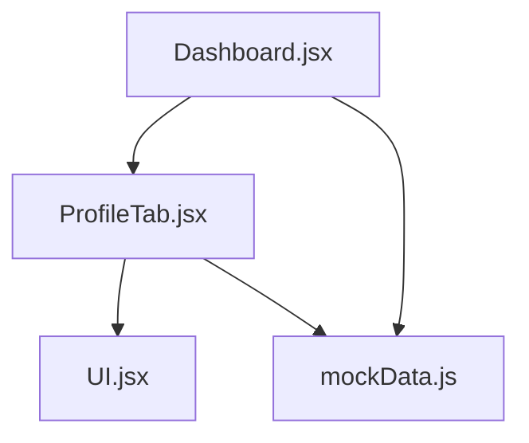
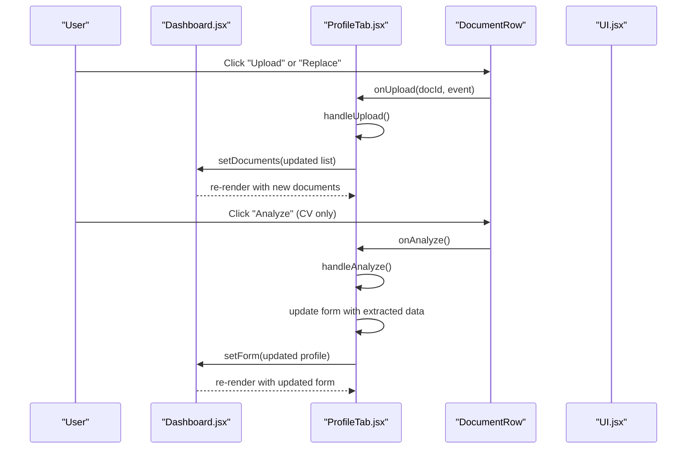
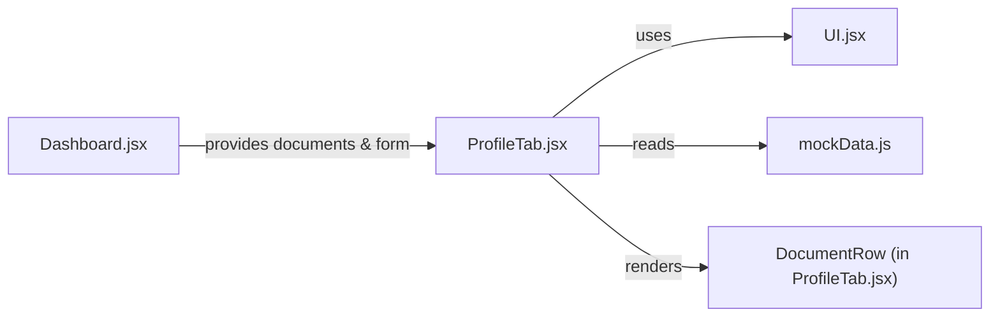
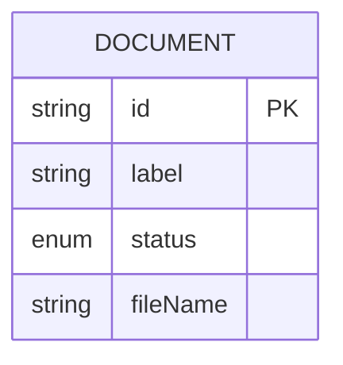
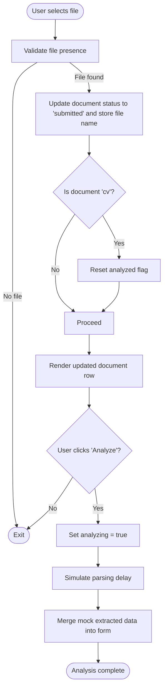

# Document Upload System

<cite>
**Referenced Files in This Document**
- [ProfileTab.jsx](file://scholarpath-frontend (2)/scholarpath/src/pages/ProfileTab.jsx)
- [Dashboard.jsx](file://scholarpath-frontend (2)/scholarpath/src/pages/Dashboard.jsx)
- [mockData.js](file://scholarpath-frontend (2)/scholarpath/src/data/mockData.js)
- [UI.jsx](file://scholarpath-frontend (2)/scholarpath/src/components/UI.jsx)
</cite>

## Table of Contents
1. [Introduction](#introduction)
2. [Project Structure](#project-structure)
3. [Core Components](#core-components)
4. [Architecture Overview](#architecture-overview)
5. [Detailed Component Analysis](#detailed-component-analysis)
6. [Dependency Analysis](#dependency-analysis)
7. [Performance Considerations](#performance-considerations)
8. [Troubleshooting Guide](#troubleshooting-guide)
9. [Conclusion](#conclusion)
10. [Appendices](#appendices)

## Introduction
This document explains the document upload system implemented in the ProfileTab component. It covers how users upload documents, how document status is tracked, how CV analysis auto-fills form fields using mock data, and how the UI communicates progress and results. The goal is to make the feature understandable for both technical and non-technical readers.

## Project Structure
The document upload flow spans a few key files:
- Dashboard holds shared state for documents and profile form and renders ProfileTab with that state.
- ProfileTab implements the upload UI, status badges, document list, and the analyze workflow.
- mockData defines required document slots and their initial statuses.
- UI provides reusable components like Card, Button, and Badge used across the feature.

**Diagram sources**
- [Dashboard.jsx:128-152](file://scholarpath-frontend (2)/scholarpath/src/pages/Dashboard.jsx#L128-L152)
- [ProfileTab.jsx:88-231](file://scholarpath-frontend (2)/scholarpath/src/pages/ProfileTab.jsx#L88-L231)
- [UI.jsx:1-47](file://scholarpath-frontend (2)/scholarpath/src/components/UI.jsx#L1-L47)
- [mockData.js:25-41](file://scholarpath-frontend (2)/scholarpath/src/data/mockData.js#L25-L41)

**Section sources**
- [Dashboard.jsx:128-152](file://scholarpath-frontend (2)/scholarpath/src/pages/Dashboard.jsx#L128-L152)
- [ProfileTab.jsx:88-231](file://scholarpath-frontend (2)/scholarpath/src/pages/ProfileTab.jsx#L88-L231)
- [mockData.js:25-41](file://scholarpath-frontend (2)/scholarpath/src/data/mockData.js#L25-L41)
- [UI.jsx:1-47](file://scholarpath-frontend (2)/scholarpath/src/components/UI.jsx#L1-L47)

## Core Components
- ProfileTab: Main container for personal information, education details, and the document upload section. It manages local states for analyzing and analyzed flags, computes checklist completion, handles uploads, and triggers CV analysis.
- DocumentRow: Renders each document row with label, file name, status badge, optional Analyze button for CV, and an upload/replace trigger.
- StatusBadge: Maps document status to visual badges (Submitted, Pending, Missing).
- UI primitives: Card, Button, Badge are reused for consistent styling.

Key responsibilities:
- Track document status per slot (submitted, pending, missing).
- Update form fields when CV is analyzed.
- Provide user feedback during analysis.

**Section sources**
- [ProfileTab.jsx:27-115](file://scholarpath-frontend (2)/scholarpath/src/pages/ProfileTab.jsx#L27-L115)
- [ProfileTab.jsx:65-86](file://scholarpath-frontend (2)/scholarpath/src/pages/ProfileTab.jsx#L65-L86)
- [UI.jsx:1-47](file://scholarpath-frontend (2)/scholarpath/src/components/UI.jsx#L1-L47)

## Architecture Overview
At runtime, Dashboard owns the canonical lists for documents and the profile form. It passes them down to ProfileTab as props. ProfileTab updates these via callbacks, enabling two-way binding between parent and child.

**Diagram sources**
- [Dashboard.jsx:128-152](file://scholarpath-frontend (2)/scholarpath/src/pages/Dashboard.jsx#L128-L152)
- [ProfileTab.jsx:88-115](file://scholarpath-frontend (2)/scholarpath/src/pages/ProfileTab.jsx#L88-L115)
- [ProfileTab.jsx:65-86](file://scholarpath-frontend (2)/scholarpath/src/pages/ProfileTab.jsx#L65-L86)

## Detailed Component Analysis

### DocumentRow
- Displays the document label and current file name if present.
- Shows a status badge reflecting submitted/pending/missing.
- For CV rows with submitted status, shows an Analyze button that toggles between Analyze, Re-analyze, and Analyzing… based on local states.
- Provides a hidden file input; clicking the label triggers selection. On change, it calls onUpload with the document id and the event.

Behavior highlights:
- If status is missing, the label reads “Upload”; otherwise “Replace”.
- File selection does not validate type here; validation can be added by adding accept attributes where appropriate.

**Section sources**
- [ProfileTab.jsx:65-86](file://scholarpath-frontend (2)/scholarpath/src/pages/ProfileTab.jsx#L65-L86)

### handleUpload Logic
- Extracts the selected file from the event.
- Updates the corresponding document entry to status “submitted” and stores the file name.
- Resets the analyzed flag for CV so the user can re-analyze after replacing the file.
- Clears the file input value to allow re-selecting the same file.

Notes:
- No server upload occurs in this implementation; the file name is stored locally for UI purposes.
- No explicit file type filtering is enforced at this point.

**Section sources**
- [ProfileTab.jsx:98-106](file://scholarpath-frontend (2)/scholarpath/src/pages/ProfileTab.jsx#L98-L106)

### handleAnalyze and Mock Data Extraction
- Sets an analyzing flag to show “Analyzing…” on the button.
- After a short delay, merges mock extracted data into the profile form, resets analyzing, and sets analyzed to true.
- The mock data includes common CV-derived fields such as name, contact, education, test scores, and activities.

Result:
- Form fields are auto-populated without manual entry.
- The analyzed flag enables “Re-analyze” to repeat the process.

**Section sources**
- [ProfileTab.jsx:108-115](file://scholarpath-frontend (2)/scholarpath/src/pages/ProfileTab.jsx#L108-L115)
- [ProfileTab.jsx:10-25](file://scholarpath-frontend (2)/scholarpath/src/pages/ProfileTab.jsx#L10-L25)

### Document State Management
- Initial document slots and statuses come from requiredDocuments in mockData.
- Dashboard initializes state with requiredDocuments and passes it to ProfileTab.
- ProfileTab updates the specific document slot when a file is uploaded, changing its status to “submitted” and storing the file name.

Status meanings:
- Submitted: A file has been selected for that slot.
- Pending: Indicates a document is expected but not yet submitted (e.g., recommendation letter).
- Missing: No file has been provided yet.

Checklist integration:
- computeChecklist uses document statuses to mark sections complete (e.g., academics requires transcript submitted; essays require recommendation submitted).

**Section sources**
- [mockData.js:25-41](file://scholarpath-frontend (2)/scholarpath/src/data/mockData.js#L25-L41)
- [Dashboard.jsx:128-152](file://scholarpath-frontend (2)/scholarpath/src/pages/Dashboard.jsx#L128-L152)
- [ProfileTab.jsx:27-45](file://scholarpath-frontend (2)/scholarpath/src/pages/ProfileTab.jsx#L27-L45)

### Supported File Types and Validation
- Current implementation does not enforce file types in the upload inputs.
- To restrict types, add accept attributes to the hidden file inputs (for example, PDF, DOCX, images) depending on the document type.
- Adding client-side validation would improve UX by preventing invalid uploads early.

[No sources needed since this section provides general guidance]

### Upload Progress Indicators
- There is no persistent progress bar for uploads because uploads are simulated locally.
- For CV analysis, a temporary “Analyzing…” indicator is shown while processing completes.

**Section sources**
- [ProfileTab.jsx:74-78](file://scholarpath-frontend (2)/scholarpath/src/pages/ProfileTab.jsx#L74-L78)
- [ProfileTab.jsx:108-115](file://scholarpath-frontend (2)/scholarpath/src/pages/ProfileTab.jsx#L108-L115)

### Analyze Button Functionality
- Appears only for the CV document when its status is submitted.
- Toggles between:
  - Analyze: initial state
  - Analyzing…: during processing
  - Re-analyze: after successful extraction

When clicked:
- Triggers handleAnalyze which simulates parsing and fills form fields with mock data.

**Section sources**
- [ProfileTab.jsx:74-78](file://scholarpath-frontend (2)/scholarpath/src/pages/ProfileTab.jsx#L74-L78)
- [ProfileTab.jsx:108-115](file://scholarpath-frontend (2)/scholarpath/src/pages/ProfileTab.jsx#L108-L115)

## Dependency Analysis
- Dashboard depends on mockData for initial document definitions and renders ProfileTab with shared state.
- ProfileTab depends on:
  - UI components for layout and interactive elements
  - mockData for checklist items and required document slots
  - Local state for analyzing and analyzed flags
- DocumentRow is a presentational component within ProfileTab that delegates actions upward.

**Diagram sources**
- [Dashboard.jsx:128-152](file://scholarpath-frontend (2)/scholarpath/src/pages/Dashboard.jsx#L128-L152)
- [ProfileTab.jsx:88-231](file://scholarpath-frontend (2)/scholarpath/src/pages/ProfileTab.jsx#L88-L231)
- [UI.jsx:1-47](file://scholarpath-frontend (2)/scholarpath/src/components/UI.jsx#L1-L47)
- [mockData.js:25-41](file://scholarpath-frontend (2)/scholarpath/src/data/mockData.js#L25-L41)

**Section sources**
- [Dashboard.jsx:128-152](file://scholarpath-frontend (2)/scholarpath/src/pages/Dashboard.jsx#L128-L152)
- [ProfileTab.jsx:88-231](file://scholarpath-frontend (2)/scholarpath/src/pages/ProfileTab.jsx#L88-L231)
- [mockData.js:25-41](file://scholarpath-frontend (2)/scholarpath/src/data/mockData.js#L25-L41)
- [UI.jsx:1-47](file://scholarpath-frontend (2)/scholarpath/src/components/UI.jsx#L1-L47)

## Performance Considerations
- The upload handler updates only the affected document slot, minimizing re-renders.
- The analyze step uses a short timeout to simulate network latency; in production, replace with real API calls and streaming progress if needed.
- Avoid heavy computations in render; keep computeChecklist lightweight as it runs on every render.

[No sources needed since this section provides general guidance]

## Troubleshooting Guide
Common issues and resolutions:
- Uploaded file not reflected: Ensure the file input onChange triggers onUpload and that setDocuments updates the correct doc id.
- Analyze button not appearing: Confirm the CV document status is “submitted”; the button only shows when status is submitted.
- Form not auto-filled: Verify handleAnalyze executes and merges mockExtracted into the form; check that analyzed flag is set to avoid repeated immediate re-analysis.
- Checklist not updating: Ensure document statuses are correctly set to “submitted” and that computeChecklist references the right fields.

**Section sources**
- [ProfileTab.jsx:98-115](file://scholarpath-frontend (2)/scholarpath/src/pages/ProfileTab.jsx#L98-L115)
- [ProfileTab.jsx:27-45](file://scholarpath-frontend (2)/scholarpath/src/pages/ProfileTab.jsx#L27-L45)

## Conclusion
The ProfileTab document upload system provides a simple, effective way to track required documents, visually indicate their status, and auto-fill profile fields by analyzing an uploaded CV using mock data. While currently client-side only, the structure supports easy extension to real backend services for file parsing and storage.

[No sources needed since this section summarizes without analyzing specific files]

## Appendices

### Data Model: Required Documents

**Diagram sources**
- [mockData.js:33-41](file://scholarpath-frontend (2)/scholarpath/src/data/mockData.js#L33-L41)

### Flowchart: Upload and Analyze Process

**Diagram sources**
- [ProfileTab.jsx:98-115](file://scholarpath-frontend (2)/scholarpath/src/pages/ProfileTab.jsx#L98-L115)
- [ProfileTab.jsx:10-25](file://scholarpath-frontend (2)/scholarpath/src/pages/ProfileTab.jsx#L10-L25)