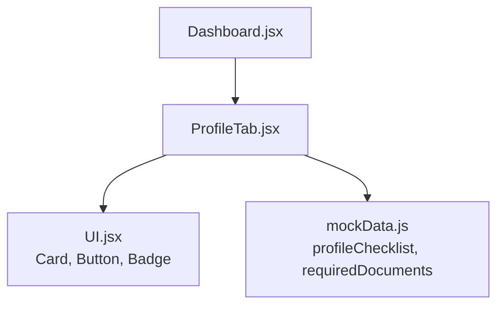
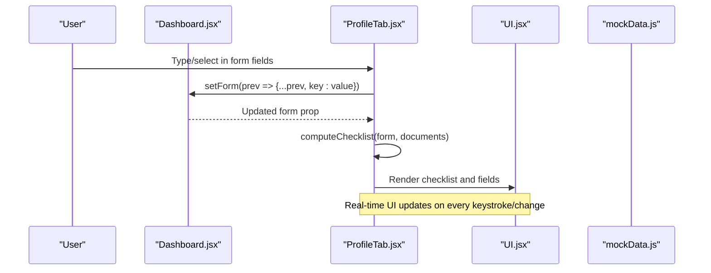
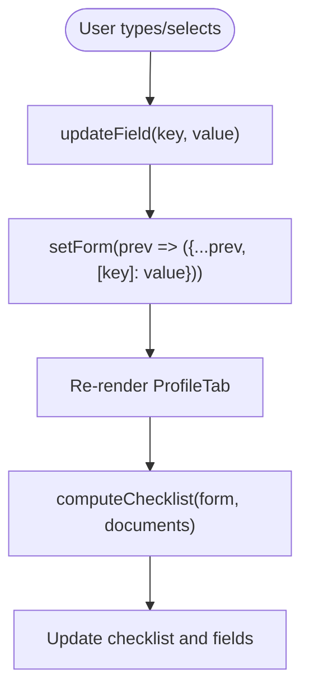
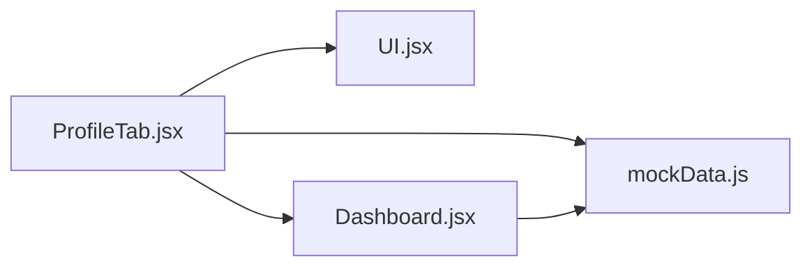

# Profile Form Management

<cite>
**Referenced Files in This Document**
- [ProfileTab.jsx](file://scholarpath-frontend (2)/scholarpath/src/pages/ProfileTab.jsx)
- [Dashboard.jsx](file://scholarpath-frontend (2)/scholarpath/src/pages/Dashboard.jsx)
- [mockData.js](file://scholarpath-frontend (2)/scholarpath/src/data/mockData.js)
- [UI.jsx](file://scholarpath-frontend (2)/scholarpath/src/components/UI.jsx)
</cite>

## Table of Contents
1. [Introduction](#introduction)
2. [Project Structure](#project-structure)
3. [Core Components](#core-components)
4. [Architecture Overview](#architecture-overview)
5. [Detailed Component Analysis](#detailed-component-analysis)
6. [Dependency Analysis](#dependency-analysis)
7. [Performance Considerations](#performance-considerations)
8. [Troubleshooting Guide](#troubleshooting-guide)
9. [Conclusion](#conclusion)

## Introduction
This document explains the profile form management system implemented in the ProfileTab component. It covers how form state is managed with React useState hooks, how fields are bound to state, how validation rules are applied for CGPA and IELTS scores, and how the component integrates with its parent component’s state. It also documents the personal information fields (name, gender, country), contact details, and educational background inputs, along with the structure of the form data and real-time updates as users type or select values.

## Project Structure
The profile form lives inside a tabbed dashboard. The Dashboard component owns the shared state for the profile form and documents, then passes them down to ProfileTab. ProfileTab renders the form UI, handles user input, and computes a checklist based on current form and document statuses.

**Diagram sources**
- [Dashboard.jsx:128-152](file://scholarpath-frontend (2)/scholarpath/src/pages/Dashboard.jsx#L128-L152)
- [ProfileTab.jsx:88-231](file://scholarpath-frontend (2)/scholarpath/src/pages/ProfileTab.jsx#L88-L231)
- [UI.jsx:1-47](file://scholarpath-frontend (2)/scholarpath/src/components/UI.jsx#L1-L47)
- [mockData.js:25-41](file://scholarpath-frontend (2)/scholarpath/src/data/mockData.js#L25-L41)

**Section sources**
- [Dashboard.jsx:128-152](file://scholarpath-frontend (2)/scholarpath/src/pages/Dashboard.jsx#L128-L152)
- [ProfileTab.jsx:88-231](file://scholarpath-frontend (2)/scholarpath/src/pages/ProfileTab.jsx#L88-L231)

## Core Components
- ProfileTab: Renders the profile form, manages local UI state (analyzing, analyzed), and exposes an updateField helper to mutate the parent-managed form state.
- Dashboard: Owns the canonical form state (profileForm) and documents state, and provides setters to ProfileTab.
- UI: Provides reusable Card, Button, and Badge components used by ProfileTab.
- mockData: Supplies static lists such as profileChecklist and requiredDocuments.

Key responsibilities:
- State ownership: Dashboard holds form and documents; ProfileTab reads and updates via props.
- Input binding: Each field binds value to form[key] and onChange to updateField(key, value).
- Checklist computation: Derived from form and documents to reflect completion status in real time.

**Section sources**
- [Dashboard.jsx:23-36](file://scholarpath-frontend (2)/scholarpath/src/pages/Dashboard.jsx#L23-L36)
- [Dashboard.jsx:128-152](file://scholarpath-frontend (2)/scholarpath/src/pages/Dashboard.jsx#L128-L152)
- [ProfileTab.jsx:88-115](file://scholarpath-frontend (2)/scholarpath/src/pages/ProfileTab.jsx#L88-L115)
- [ProfileTab.jsx:117-206](file://scholarpath-frontend (2)/scholarpath/src/pages/ProfileTab.jsx#L117-L206)
- [UI.jsx:1-47](file://scholarpath-frontend (2)/scholarpath/src/components/UI.jsx#L1-L47)
- [mockData.js:25-41](file://scholarpath-frontend (2)/scholarpath/src/data/mockData.js#L25-L41)

## Architecture Overview
The architecture follows a unidirectional data flow:
- Parent (Dashboard) owns form and documents state.
- Child (ProfileTab) receives state and setters as props.
- User interactions trigger updateField or document handlers that call parent setters.
- Derived checklist updates automatically when form or documents change.

**Diagram sources**
- [Dashboard.jsx:128-152](file://scholarpath-frontend (2)/scholarpath/src/pages/Dashboard.jsx#L128-L152)
- [ProfileTab.jsx:94-96](file://scholarpath-frontend (2)/scholarpath/src/pages/ProfileTab.jsx#L94-L96)
- [ProfileTab.jsx:27-45](file://scholarpath-frontend (2)/scholarpath/src/pages/ProfileTab.jsx#L27-L45)
- [UI.jsx:1-47](file://scholarpath-frontend (2)/scholarpath/src/components/UI.jsx#L1-L47)
- [mockData.js:25-41](file://scholarpath-frontend (2)/scholarpath/src/data/mockData.js#L25-L41)

## Detailed Component Analysis

### Form State Management with useState
- Parent state: Dashboard defines emptyProfileForm and stores it using useState. It passes both the state and setter to ProfileTab.
- Child usage: ProfileTab uses updateField to immutably update the parent’s form state by spreading the previous state and setting the changed key/value.
- Local state: ProfileTab maintains analyzing and analyzed flags for CV analysis simulation.

Benefits:
- Single source of truth for form data resides in Dashboard.
- Predictable updates via immutable state changes.
- Clear separation between presentation (ProfileTab) and state ownership (Dashboard).

**Section sources**
- [Dashboard.jsx:23-36](file://scholarpath-frontend (2)/scholarpath/src/pages/Dashboard.jsx#L23-L36)
- [Dashboard.jsx:128-152](file://scholarpath-frontend (2)/scholarpath/src/pages/Dashboard.jsx#L128-L152)
- [ProfileTab.jsx:88-96](file://scholarpath-frontend (2)/scholarpath/src/pages/ProfileTab.jsx#L88-L96)

### Field Validation Patterns
Validation is enforced through derived checklist logic rather than inline error messages:
- Basics: Requires firstName, lastName, email, phone, country, and gender to be non-empty.
- Academics: Requires degree, department, and cgpa; also requires transcript document to be submitted.
- Tests: Requires ielts score or IELTS document submitted.
- Essays: Requires recommendation letter document submitted.
- Extracurriculars: Requires extracurriculars field to be non-empty.

CGPA and IELTS specific notes:
- Both are stored as strings in the form.
- Presence checks treat any non-empty string as valid for checklist purposes.
- For stricter numeric validation (e.g., range checks), extend computeChecklist or add dedicated validators.

Real-time behavior:
- As users type or select options, updateField triggers re-render and recomputes checklist instantly.

**Section sources**
- [ProfileTab.jsx:27-45](file://scholarpath-frontend (2)/scholarpath/src/pages/ProfileTab.jsx#L27-L45)
- [ProfileTab.jsx:150-206](file://scholarpath-frontend (2)/scholarpath/src/pages/ProfileTab.jsx#L150-L206)

### Data Binding Mechanisms
Each field binds:
- value: to the corresponding property in form (e.g., form.firstName).
- onChange: to updateField(key, e.target.value), which calls setForm with an updated copy.

Examples:
- Text inputs: first name, last name, father’s name, phone, email, CGPA, IELTS, extracurriculars.
- Select inputs: gender, country, degree, department.

This pattern ensures consistent, declarative binding across all fields.

**Section sources**
- [ProfileTab.jsx:150-206](file://scholarpath-frontend (2)/scholarpath/src/pages/ProfileTab.jsx#L150-L206)

### Personal Information Fields
Fields included:
- Name: firstName, lastName, fatherName
- Gender: select with predefined options
- Country: select with predefined countries
- Contact: phone, email

These fields contribute to the “basics” checklist item and must be filled to mark basics complete.

**Section sources**
- [ProfileTab.jsx:150-178](file://scholarpath-frontend (2)/scholarpath/src/pages/ProfileTab.jsx#L150-L178)
- [ProfileTab.jsx:27-34](file://scholarpath-frontend (2)/scholarpath/src/pages/ProfileTab.jsx#L27-L34)

### Educational Background Inputs
Fields included:
- CGPA: text input
- IELTS score: text input
- Degree: select with predefined degrees
- Department: select with predefined departments
- Extracurricular activities: text input

These fields influence “academics,” “tests,” and “extracurriculars” checklist items.

**Section sources**
- [ProfileTab.jsx:180-206](file://scholarpath-frontend (2)/scholarpath/src/pages/ProfileTab.jsx#L180-L206)
- [ProfileTab.jsx:34-42](file://scholarpath-frontend (2)/scholarpath/src/pages/ProfileTab.jsx#L34-L42)

### Form Field Components Structure
- FormField: A presentational wrapper that labels and contains a single input element.
- StatusBadge: Displays document status with color-coded badges.
- DocumentRow: Renders each document row with upload and analyze actions.

These components keep the main form layout clean and reusable.

**Section sources**
- [ProfileTab.jsx:47-86](file://scholarpath-frontend (2)/scholarpath/src/pages/ProfileTab.jsx#L47-L86)

### Input Handling with updateField and Real-Time Updates
- updateField(key, value): Creates a new form object by spreading previous state and updating the specified key.
- Real-time updates: Because each input’s value is bound directly to form properties, typing immediately updates state and re-renders the checklist and UI.

**Diagram sources**
- [ProfileTab.jsx:94-96](file://scholarpath-frontend (2)/scholarpath/src/pages/ProfileTab.jsx#L94-L96)
- [ProfileTab.jsx:27-45](file://scholarpath-frontend (2)/scholarpath/src/pages/ProfileTab.jsx#L27-L45)

**Section sources**
- [ProfileTab.jsx:94-96](file://scholarpath-frontend (2)/scholarpath/src/pages/ProfileTab.jsx#L94-L96)
- [ProfileTab.jsx:117-206](file://scholarpath-frontend (2)/scholarpath/src/pages/ProfileTab.jsx#L117-L206)

### Examples of Form Data Structure
The form data shape includes:
- firstName: string
- lastName: string
- fatherName: string
- country: string
- phone: string
- email: string
- gender: string
- cgpa: string
- ielts: string
- degree: string
- department: string
- extracurriculars: string

This structure is defined in the parent and consumed by ProfileTab fields.

**Section sources**
- [Dashboard.jsx:23-36](file://scholarpath-frontend (2)/scholarpath/src/pages/Dashboard.jsx#L23-L36)
- [ProfileTab.jsx:150-206](file://scholarpath-frontend (2)/scholarpath/src/pages/ProfileTab.jsx#L150-L206)

### Integration with Parent Component State Management
- Dashboard creates emptyProfileForm and stores it with useState.
- Dashboard passes form and setForm to ProfileTab.
- ProfileTab calls setForm via updateField to update the parent’s state.
- Documents state is similarly lifted to Dashboard and passed down; ProfileTab updates it via setDocuments for file uploads.

This design centralizes state and enables cross-tab features like checklist synchronization.

**Section sources**
- [Dashboard.jsx:128-152](file://scholarpath-frontend (2)/scholarpath/src/pages/Dashboard.jsx#L128-L152)
- [ProfileTab.jsx:88-115](file://scholarpath-frontend (2)/scholarpath/src/pages/ProfileTab.jsx#L88-L115)

## Dependency Analysis
ProfileTab depends on:
- UI components (Card, Button, Badge) for rendering.
- mockData for profileChecklist and requiredDocuments.
- Parent-provided form, setForm, documents, setDocuments for state.

**Diagram sources**
- [ProfileTab.jsx:1-4](file://scholarpath-frontend (2)/scholarpath/src/pages/ProfileTab.jsx#L1-L4)
- [UI.jsx:1-47](file://scholarpath-frontend (2)/scholarpath/src/components/UI.jsx#L1-L47)
- [mockData.js:25-41](file://scholarpath-frontend (2)/scholarpath/src/data/mockData.js#L25-L41)
- [Dashboard.jsx:128-152](file://scholarpath-frontend (2)/scholarpath/src/pages/Dashboard.jsx#L128-L152)

**Section sources**
- [ProfileTab.jsx:1-4](file://scholarpath-frontend (2)/scholarpath/src/pages/ProfileTab.jsx#L1-L4)
- [Dashboard.jsx:128-152](file://scholarpath-frontend (2)/scholarpath/src/pages/Dashboard.jsx#L128-L152)

## Performance Considerations
- Lightweight state updates: updateField spreads only one key per change, minimizing re-renders.
- Derived checklist: Computed on render; acceptable for small datasets but could be memoized if the list grows.
- File handling: handleUpload updates only the affected document entry, avoiding full list rebuild overhead beyond mapping.

Optimization opportunities:
- Memoize computeChecklist with useMemo to avoid recomputation on unrelated updates.
- Debounce heavy operations if adding server-side validation or parsing later.

[No sources needed since this section provides general guidance]

## Troubleshooting Guide
Common issues and resolutions:
- Checklist not marking basics complete: Ensure all required basic fields are non-empty (firstName, lastName, email, phone, country, gender).
- Academics not completing: Verify degree, department, and cgpa are filled and transcript document is submitted.
- Tests not completing: Provide ielts score or submit IELTS document.
- Essays not completing: Submit recommendation letter document.
- Extracurriculars not completing: Fill the extracurriculars field.

Document upload behavior:
- Uploading a CV resets analyzed state so users can re-analyze after replacement.
- After upload, the document status becomes submitted and shows the file name.

**Section sources**
- [ProfileTab.jsx:27-45](file://scholarpath-frontend (2)/scholarpath/src/pages/ProfileTab.jsx#L27-L45)
- [ProfileTab.jsx:98-115](file://scholarpath-frontend (2)/scholarpath/src/pages/ProfileTab.jsx#L98-L115)

## Conclusion
The ProfileTab component implements a robust, parent-managed form with clear data binding, real-time updates, and derived validation via a checklist. Its design separates concerns effectively: Dashboard owns state, ProfileTab handles UI and user interactions, and shared utilities provide reusable components and static data. Extending validation to include strict numeric checks for CGPA and IELTS can further improve data quality while preserving the existing reactive architecture.

[No sources needed since this section summarizes without analyzing specific files]