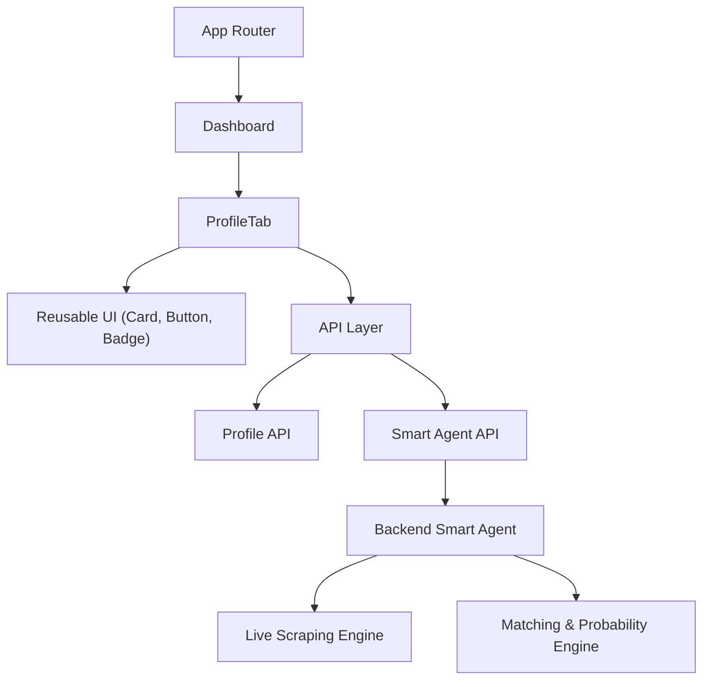
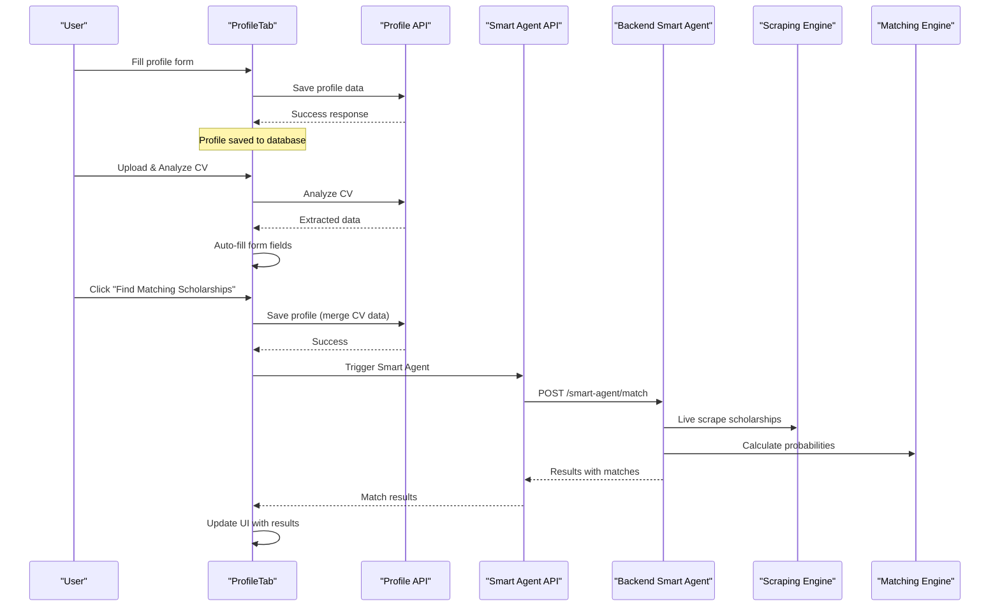
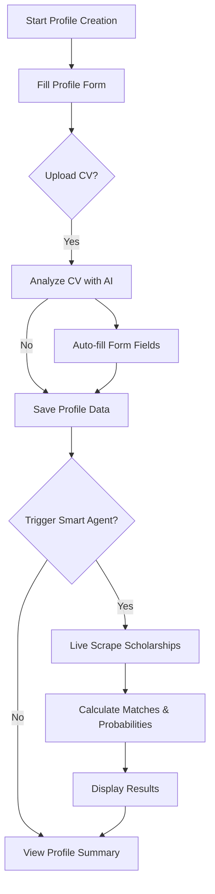
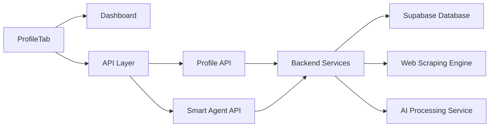

# Profile Management Tab

<cite>
**Referenced Files in This Document**
- [ProfileTab.jsx](file://scholarpath-frontend (2)/scholarpath/src/pages/ProfileTab.jsx)
- [Dashboard.jsx](file://scholarpath-frontend (2)/scholarpath/src/pages/Dashboard.jsx)
- [UI.jsx](file://scholarpath-frontend (2)/scholarpath/src/components/UI.jsx)
- [mockData.js](file://scholarpath-frontend (2)/scholarpath/src/data/mockData.js)
- [api.js](file://scholarpath-frontend (2)/scholarpath/src/api.js)
- [index.js](file://aischolarpath-backend-main/aischolarpath-backend-main/index.js)
</cite>

## Update Summary
**Changes Made**
- Updated profile creation workflow to integrate Smart Agent for live scraping, matching, and AI analysis
- Added new Smart Agent API integration with real-time scholarship discovery
- Enhanced CV analysis workflow with automatic data extraction and merging
- Implemented two-phase profile management: save first, then trigger Smart Agent
- Added comprehensive error handling and progress tracking for Smart Agent operations
- Updated UI components to support Smart Agent workflow states and feedback

## Table of Contents
1. Introduction
2. Project Structure
3. Core Components
4. Architecture Overview
5. Detailed Component Analysis
6. Dependency Analysis
7. Performance Considerations
8. Troubleshooting Guide
9. Conclusion
10. Appendices

## Introduction
This document explains the ProfileTab component that manages student profiles in ScholarPathAI with integrated Smart Agent workflow. The component now provides a comprehensive profile creation experience that saves profile data first, then triggers the Smart Agent for live scraping, matching, and AI analysis in a single operation. It covers academic information input (CGPA, IELTS scores, degree details), personal preferences setup, CV upload and analysis, and automated scholarship matching with probability calculations.

## Project Structure
The ProfileTab is a React page integrated into the Dashboard's tabbed interface with enhanced Smart Agent capabilities. It receives shared state from the parent Dashboard and renders:
- A multi-section form with conditional fields based on degree selection
- CV upload and AI-powered data extraction
- Integrated Smart Agent workflow for live scholarship discovery
- Real-time status updates and progress indicators
- Profile summary view with extracted data display

**Diagram sources**
- [Dashboard.jsx:285-295](file://scholarpath-frontend (2)/scholarpath/src/pages/Dashboard.jsx#L285-L295)
- [ProfileTab.jsx:34-46](file://scholarpath-frontend (2)/scholarpath/src/pages/ProfileTab.jsx#L34-L46)
- [api.js:61-75](file://scholarpath-frontend (2)/scholarpath/src/api.js#L61-L75)
- [index.js:2670-2869](file://aischolarpath-backend-main/aischolarpath-backend-main/index.js#L2670-L2869)

**Section sources**
- [Dashboard.jsx:285-295](file://scholarpath-frontend (2)/scholarpath/src/pages/Dashboard.jsx#L285-L295)
- [ProfileTab.jsx:34-46](file://scholarpath-frontend (2)/scholarpath/src/pages/ProfileTab.jsx#L34-L46)

## Core Components
- **ProfileTab**: Orchestrates the complete profile management workflow including Smart Agent integration, form state management, CV analysis, and scholarship matching
- **Dashboard**: Holds shared state and provides real-time data loading with error handling
- **API Layer**: Centralized API client with authentication and Smart Agent endpoints
- **UI Components**: Card, Button, Badge provide consistent styling and interaction primitives
- **Smart Agent Backend**: Handles live scraping, matching algorithms, and probability calculations

Key responsibilities:
- Multi-step profile creation with conditional field validation
- CV upload with AI-powered data extraction and automatic form population
- Two-phase Smart Agent workflow: save profile data first, then trigger live scraping and matching
- Real-time progress tracking and user feedback throughout the process
- Error handling with retry mechanisms and user-friendly messages

**Section sources**
- [ProfileTab.jsx:34-188](file://scholarpath-frontend (2)/scholarpath/src/pages/ProfileTab.jsx#L34-L188)
- [Dashboard.jsx:192-268](file://scholarpath-frontend (2)/scholarpath/src/pages/Dashboard.jsx#L192-L268)
- [api.js:61-75](file://scholarpath-frontend (2)/scholarpath/src/api.js#L61-L75)

## Architecture Overview
The ProfileTab implements a sophisticated Smart Agent workflow with two distinct phases:

1. **Phase 1 - Profile Data Collection & Save**: Users fill in their profile information, upload CV, and analyze it to extract academic data automatically
2. **Phase 2 - Smart Agent Execution**: Once profile is saved and CV analyzed, users can trigger the Smart Agent which performs live scraping, matching, and probability calculation

**Diagram sources**
- [ProfileTab.jsx:68-188](file://scholarpath-frontend (2)/scholarpath/src/pages/ProfileTab.jsx#L68-L188)
- [api.js:61-75](file://scholarpath-frontend (2)/scholarpath/src/api.js#L61-L75)
- [index.js:2670-2869](file://aischolarpath-backend-main/aischolarpath-backend-main/index.js#L2670-L2869)

## Detailed Component Analysis

### Smart Agent Workflow Integration
**Updated** The profile management now integrates a comprehensive Smart Agent workflow that operates in two phases:

**Phase 1 - Profile Data Collection:**
- Multi-section form with conditional fields based on degree selection
- Real-time validation and field dependencies
- CV upload with AI-powered data extraction
- Automatic form population from CV analysis

**Phase 2 - Smart Agent Execution:**
- Saves merged profile data (form + CV extracted data) to database
- Triggers live scraping of scholarships for target country
- Performs matching algorithm with probability calculations
- Returns comprehensive results with eligibility status and chances

**Diagram sources**
- [ProfileTab.jsx:68-188](file://scholarpath-frontend (2)/scholarpath/src/pages/ProfileTab.jsx#L68-L188)
- [index.js:2670-2869](file://aischolarpath-backend-main/aischolarpath-backend-main/index.js#L2670-L2869)

**Section sources**
- [ProfileTab.jsx:68-188](file://scholarpath-frontend (2)/scholarpath/src/pages/ProfileTab.jsx#L68-L188)
- [index.js:2670-2869](file://aischolarpath-backend-main/aischolarpath-backend-main/index.js#L2670-L2869)

### Profile Creation Workflow
The enhanced profile creation workflow now supports both manual entry and AI-powered extraction:

**Personal Information:**
- CNIC/ID number, full name, email, phone, gender, date of birth
- Residency country selection with dropdown options
- Conditional fields based on degree type selection

**Academic Qualifications:**
- Degree selection (Bachelor's, Master's, PhD) with conditional fields
- For Bachelor's: FSc/Intermediate percentage and board/university
- For Master's/PhD: CGPA, previous degree, university, and percentage
- Language proficiency (IELTS score) with optional entry

**Target Preferences:**
- Target field/department selection from predefined list
- Target country selection with comprehensive country list
- Dynamic field requirements based on degree level

**CV Upload & Analysis:**
- Support for PDF, DOCX, DOC, and TXT file formats
- AI-powered extraction of academic data from uploaded CV
- Automatic form field population with extracted data
- Visual feedback showing extracted information

**Section sources**
- [ProfileTab.jsx:288-504](file://scholarpath-frontend (2)/scholarpath/src/pages/ProfileTab.jsx#L288-L504)

### Smart Agent API Integration
**Updated** The ProfileTab now integrates with the Smart Agent backend through a dedicated API layer:

**API Endpoints:**
- `POST /api/profile` - Save/update profile data with merged form and CV data
- `POST /api/profile/:id/upload-cv` - Upload CV file for processing
- `POST /api/profile/:id/analyze` - Extract academic data from CV using AI
- `POST /api/smart-agent/match` - Trigger live scraping and matching engine

**Authentication & Security:**
- JWT token-based authentication via Authorization header
- User ID validation to ensure profile ownership
- Secure file upload handling with proper MIME type validation

**Error Handling:**
- Comprehensive error catching with user-friendly messages
- Retry mechanisms for failed network requests
- Graceful degradation when scraping fails (fallback to database)

**Section sources**
- [api.js:61-75](file://scholarpath-frontend (2)/scholarpath/src/api.js#L61-L75)
- [ProfileTab.jsx:68-188](file://scholarpath-frontend (2)/scholarpath/src/pages/ProfileTab.jsx#L68-L188)

### CV Analysis and Data Extraction
**Enhanced** The CV analysis functionality now provides comprehensive AI-powered extraction:

**Supported File Formats:**
- PDF documents with text extraction
- Word documents (.docx, .doc) with content parsing
- Plain text files (.txt) with direct reading

**Extracted Data Fields:**
- Academic qualifications (CGPA, degrees, universities)
- Test scores (IELTS, TOEFL, GRE, GMAT)
- Professional skills and experience
- Work history and achievements

**Integration with Profile Form:**
- Automatic field population with extracted data
- Conflict resolution when existing data exists
- Visual preview of extracted information before saving
- Editable fields allowing user corrections

**Section sources**
- [ProfileTab.jsx:138-165](file://scholarpath-frontend (2)/scholarpath/src/pages/ProfileTab.jsx#L138-L165)

### Real-Time Profile Updates and Status Tracking
**Updated** The component now provides comprehensive real-time updates and status tracking:

**State Management:**
- Local state for saving, analyzing, uploading, and matching operations
- Parent-managed form state with controlled inputs
- Document status tracking with submission states
- Smart Agent execution status with progress indicators

**Visual Feedback:**
- Loading spinners during async operations
- Success/error message banners with auto-dismiss
- Progress indicators for long-running operations
- Disabled button states during active operations

**Real-Time Updates:**
- Immediate form field updates after CV analysis
- Dynamic section visibility based on degree selection
- Live status badges for document submission
- Profile summary updates after successful saves

**Section sources**
- [ProfileTab.jsx:34-46](file://scholarpath-frontend (2)/scholarpath/src/pages/ProfileTab.jsx#L34-L46)
- [ProfileTab.jsx:270-286](file://scholarpath-frontend (2)/scholarpath/src/pages/ProfileTab.jsx#L270-L286)

### Document Upload Functionality
**Enhanced** The document upload system now supports multiple file types with validation:

**File Type Restrictions:**
- PDF files (.pdf) with size validation
- Word documents (.docx, .doc) with format checking
- Text files (.txt) for simple resume uploads
- Client-side validation before server upload

**Upload Process:**
- Drag-and-drop or file browser selection
- Progress indication during upload
- Success confirmation with file name display
- Replace functionality for updated documents

**Status Tracking:**
- Submission status (missing, pending, submitted)
- File name display after successful upload
- Analysis status for processed documents
- Error states for failed uploads

**Section sources**
- [ProfileTab.jsx:115-136](file://scholarpath-frontend (2)/scholarpath/src/pages/ProfileTab.jsx#L115-L136)
- [ProfileTab.jsx:420-474](file://scholarpath-frontend (2)/scholarpath/src/pages/ProfileTab.jsx#L420-L474)

### Profile Strength Assessment
**Enhanced** The profile strength assessment now incorporates Smart Agent data:

**Strength Calculation:**
- Base strength from completed profile sections
- Additional points from CV analysis completion
- Smart Agent match quality affects overall strength
- Real-time updates as profile data changes

**Visual Indicators:**
- Progress bar showing completion percentage
- Color-coded strength levels (low, medium, high)
- Specific area improvement suggestions
- Comparison with potential matches

**Backend Integration:**
- Profile completeness indicators from backend
- Eligibility status based on Smart Agent results
- Missing requirements identification
- Next boost suggestions for profile enhancement

**Section sources**
- [Dashboard.jsx:106-132](file://scholarpath-frontend (2)/scholarpath/src/pages/Dashboard.jsx#L106-L132)

### Accessibility Features
**Enhanced** The component maintains comprehensive accessibility standards:

**Screen Reader Support:**
- Semantic HTML structure with proper heading hierarchy
- Descriptive labels for all form inputs
- ARIA attributes for dynamic content updates
- Keyboard navigation support throughout

**Visual Accessibility:**
- High contrast color schemes meeting WCAG guidelines
- Clear focus indicators for keyboard navigation
- Responsive typography scaling across devices
- Alternative text for interactive elements

**Form Accessibility:**
- Proper label-input associations
- Error message announcements for screen readers
- Required field indicators with visual and textual cues
- Validation feedback with accessible descriptions

**Section sources**
- [ProfileTab.jsx:290-504](file://scholarpath-frontend (2)/scholarpath/src/pages/ProfileTab.jsx#L290-L504)
- [UI.jsx:9-24](file://scholarpath-frontend (2)/scholarpath/src/components/UI.jsx#L9-L24)

### Responsive Design Considerations
**Enhanced** The interface adapts seamlessly across device sizes:

**Mobile-First Design:**
- Single-column layout on small screens
- Touch-friendly input sizes and spacing
- Optimized file upload for mobile browsers
- Collapsible sections for better mobile UX

**Desktop Optimization:**
- Multi-column grid layouts for form fields
- Sticky sidebar navigation for easy access
- Hover states and advanced interactions
- Larger touch targets for mouse users

**Adaptive Components:**
- Flexible card layouts that stack on mobile
- Responsive button sizing and spacing
- Image and file preview optimization
- Navigation adaptation for different screen sizes

**Section sources**
- [ProfileTab.jsx:290-504](file://scholarpath-frontend (2)/scholarpath/src/pages/ProfileTab.jsx#L290-L504)
- [Dashboard.jsx:322-332](file://scholarpath-frontend (2)/scholarpath/src/pages/Dashboard.jsx#L322-L332)

## Dependency Analysis
**Updated** The dependency structure now includes Smart Agent integration:

**Frontend Dependencies:**
- ProfileTab depends on Dashboard for state management and API services
- API layer provides centralized communication with backend services
- UI components maintain consistent styling and interaction patterns
- Mock data provides fallback content for development

**Backend Dependencies:**
- Smart Agent endpoint handles live scraping and matching
- Profile management endpoints for data persistence
- CV analysis service for document processing
- Database integration with Supabase for data storage

**Service Integration:**
- Authentication service for user session management
- File upload service for document processing
- AI service for CV analysis and data extraction
- Web scraping service for live scholarship discovery

**Diagram sources**
- [ProfileTab.jsx:1-3](file://scholarpath-frontend (2)/scholarpath/src/pages/ProfileTab.jsx#L1-L3)
- [api.js:61-75](file://scholarpath-frontend (2)/scholarpath/src/api.js#L61-L75)
- [index.js:2670-2869](file://aischolarpath-backend-main/aischolarpath-backend-main/index.js#L2670-L2869)

**Section sources**
- [ProfileTab.jsx:1-3](file://scholarpath-frontend (2)/scholarpath/src/pages/ProfileTab.jsx#L1-L3)
- [api.js:61-75](file://scholarpath-frontend (2)/scholarpath/src/api.js#L61-L75)

## Performance Considerations
**Updated** Performance optimizations for Smart Agent workflow:

**Client-Side Optimizations:**
- Debounced API calls to prevent excessive requests
- Lazy loading of large document lists
- Memoization of computed checklist items
- Efficient state updates with minimal re-renders

**Server-Side Optimizations:**
- Caching mechanism for scraped scholarship data (24-hour cache)
- Batch processing for multiple profile updates
- Asynchronous processing for long-running scraping tasks
- Database query optimization with proper indexing

**Network Optimizations:**
- Request deduplication for identical API calls
- Timeout handling for slow network connections
- Retry logic with exponential backoff
- Compression for large payload transfers

**Memory Management:**
- Cleanup of temporary file uploads
- Garbage collection for large document objects
- Efficient state management to prevent memory leaks
- Proper event listener cleanup

## Troubleshooting Guide
**Updated** Enhanced troubleshooting for Smart Agent workflow:

**Common Issues and Solutions:**

**Profile Save Failures:**
- Check network connectivity and API availability
- Verify user authentication and token validity
- Validate form data format and required fields
- Review backend error logs for specific failure reasons

**CV Analysis Problems:**
- Ensure file format compatibility (PDF, DOCX, DOC, TXT)
- Check file size limits and upload permissions
- Verify AI service availability and response times
- Review extracted data format and field mapping

**Smart Agent Execution Issues:**
- Confirm target country has available scraping sources
- Check web scraping service health and rate limits
- Verify database connectivity for result storage
- Monitor scraping timeout and retry mechanisms

**Performance Issues:**
- Monitor API response times and optimize slow endpoints
- Implement proper caching strategies for repeated requests
- Optimize frontend rendering for large result sets
- Use connection pooling for database operations

**Error Handling Patterns:**
- Implement comprehensive try-catch blocks around async operations
- Provide user-friendly error messages with actionable steps
- Log detailed error information for debugging purposes
- Implement graceful degradation when services are unavailable

**Section sources**
- [ProfileTab.jsx:94-188](file://scholarpath-frontend (2)/scholarpath/src/pages/ProfileTab.jsx#L94-L188)
- [index.js:2670-2869](file://aischolarpath-backend-main/aischolarpath-backend-main/index.js#L2670-L2869)

## Conclusion
The ProfileTab component now provides a comprehensive student profile management interface with integrated Smart Agent workflow. The enhanced system successfully combines traditional profile creation with modern AI-powered features, offering students an intelligent pathway to discover and apply for relevant scholarships. The two-phase approach ensures data integrity while providing real-time feedback and progress tracking throughout the entire process.

Key improvements include:
- Seamless CV analysis with automatic data extraction
- Live scholarship discovery through web scraping
- Intelligent matching algorithms with probability calculations
- Comprehensive error handling and user feedback
- Responsive design optimized for all device types
- Robust performance optimizations for scalability

The component follows modern React patterns with proper state management, API integration, and accessibility standards, ensuring a professional and user-friendly experience for students navigating their scholarship opportunities.

## Appendices

### Profile Data Structure Examples
**Updated** Enhanced profile structure supporting Smart Agent integration:

**Core Profile Fields:**
- Personal: firstName, lastName, fatherName, gender, country, phone, email, cnic, dateOfBirth, residencyCountry
- Academic: cgpa, ielts, degree, department, extracurriculars, fscPercentage, previousDegree, previousUniversity, previousPercentage
- Backend Mapping: full_name, cgpa, ielts_score, target_country, target_degree, target_department, target_field, phone, gender, date_of_birth, cnic, residency_country, fsc_percentage, previous_degree, previous_university, previous_percentage

**Smart Agent Data:**
- CV Extracted Data: cgpa, ielts_score, degree_level, department, university, skills, experience_years
- Match Results: match_score, status, evidence, reasons, chance, label, color
- Scraping Info: source, scrape_errors, last_verified_at

**Section sources**
- [Dashboard.jsx:25-44](file://scholarpath-frontend (2)/scholarpath/src/pages/Dashboard.jsx#L25-L44)
- [ProfileTab.jsx:68-91](file://scholarpath-frontend (2)/scholarpath/src/pages/ProfileTab.jsx#L68-L91)

### API Integration Patterns
**Updated** Enhanced API patterns for Smart Agent workflow:

**Profile Management Flow:**
1. Collect and validate form data in ProfileTab
2. Send PATCH request to `/api/profile` with authenticated token
3. Handle success response and update local state
4. Trigger Smart Agent if CV has been analyzed

**Smart Agent Workflow:**
1. Upload CV via POST `/api/profile/:id/upload-cv`
2. Analyze CV via POST `/api/profile/:id/analyze`
3. Save merged profile data via POST `/api/profile`
4. Trigger Smart Agent via POST `/api/smart-agent/match`
5. Display results with eligibility status and probability scores

**Error Handling Patterns:**
- Implement comprehensive try-catch blocks for all API calls
- Handle HTTP errors (400, 401, 403, 500) with appropriate user feedback
- Show loading states during API calls with progress indicators
- Implement retry logic with exponential backoff for failed requests
- Provide fallback mechanisms when primary services are unavailable

**Section sources**
- [api.js:61-75](file://scholarpath-frontend (2)/scholarpath/src/api.js#L61-L75)
- [ProfileTab.jsx:68-188](file://scholarpath-frontend (2)/scholarpath/src/pages/ProfileTab.jsx#L68-L188)

### Smart Agent Backend Implementation
**New Section** The Smart Agent backend provides comprehensive scholarship discovery and matching capabilities:

**Core Functionality:**
- Live web scraping of scholarship portals by country
- AI-powered data extraction and structuring
- Advanced matching algorithms with weighted criteria
- Probability calculation with confidence scoring
- Result caching with 24-hour freshness validation

**Scraping Engine:**
- Configurable portal sources per country
- HTML parsing with cheerio library
- Content cleaning and normalization
- Error handling with fallback mechanisms
- Rate limiting and timeout protection

**Matching Algorithm:**
- Weighted scoring system (CGPA: 25%, Field: 25%, Degree: 20%, IELTS: 15%)
- Hard fail criteria (deadline, field mismatch, degree requirement)
- Soft fail detection for partial eligibility
- Probability calculation with uncertainty bounds (0-95%)

**Database Integration:**
- Supabase PostgreSQL for persistent storage
- Upsert operations for scholarship data
- Discovery logging for audit trails
- Cache invalidation and refresh mechanisms

**Section sources**
- [index.js:1943-2069](file://aischolarpath-backend-main/aischolarpath-backend-main/index.js#L1943-L2069)
- [index.js:2551-2869](file://aischolarpath-backend-main/aischolarpath-backend-main/index.js#L2551-L2869)

### Error Handling for Form Submissions
**Updated** Enhanced error handling for Smart Agent workflow:

**Client-Side Validation:**
- Real-time form field validation with immediate feedback
- Required field checking before submission
- File type and size validation for uploads
- Network connectivity checks before API calls

**Server-Side Error Handling:**
- Comprehensive try-catch blocks around all async operations
- Detailed error logging with context information
- User-friendly error messages with actionable guidance
- Graceful degradation when services are unavailable

**Retry and Recovery Mechanisms:**
- Automatic retry with exponential backoff for failed requests
- Fallback to cached data when live scraping fails
- Progressive enhancement for degraded network conditions
- State persistence to prevent data loss during failures

**Monitoring and Debugging:**
- Structured error logging with timestamps and context
- Performance metrics collection for slow operations
- User experience monitoring with error rate tracking
- Alerting for critical system failures

**Section sources**
- [ProfileTab.jsx:94-188](file://scholarpath-frontend (2)/scholarpath/src/pages/ProfileTab.jsx#L94-L188)
- [api.js:29-51](file://scholarpath-frontend (2)/scholarpath/src/api.js#L29-L51)