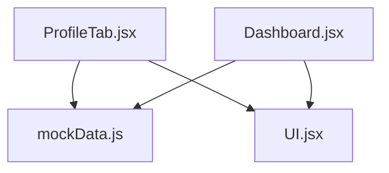
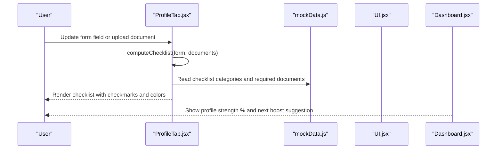
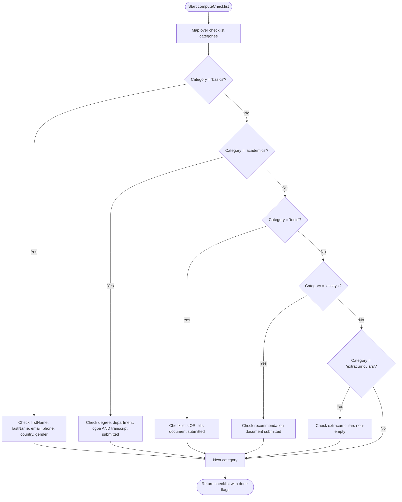
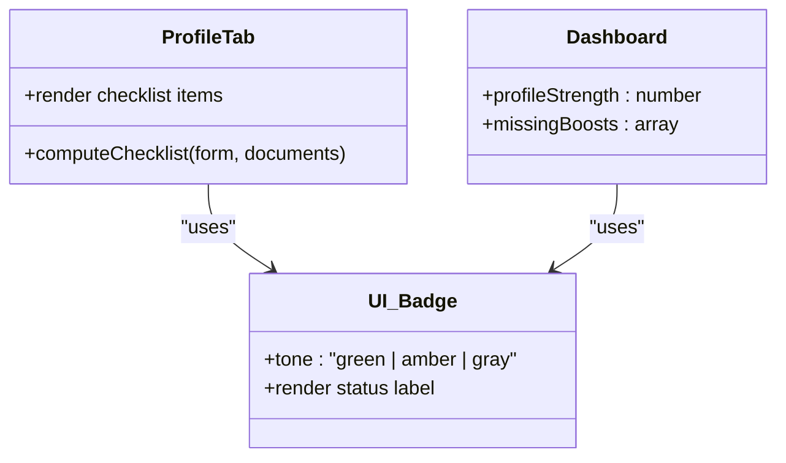
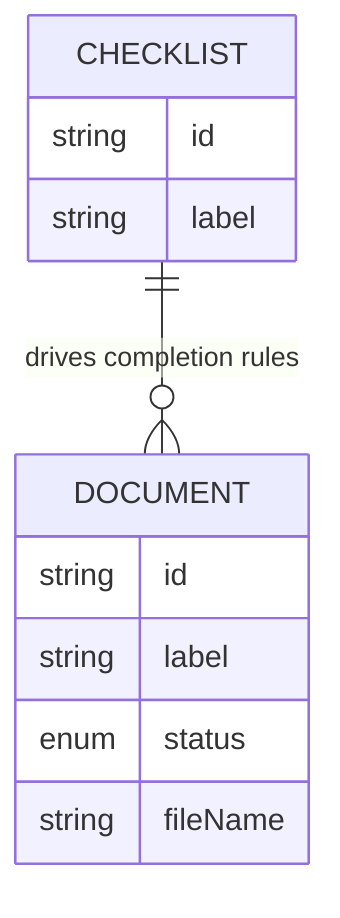
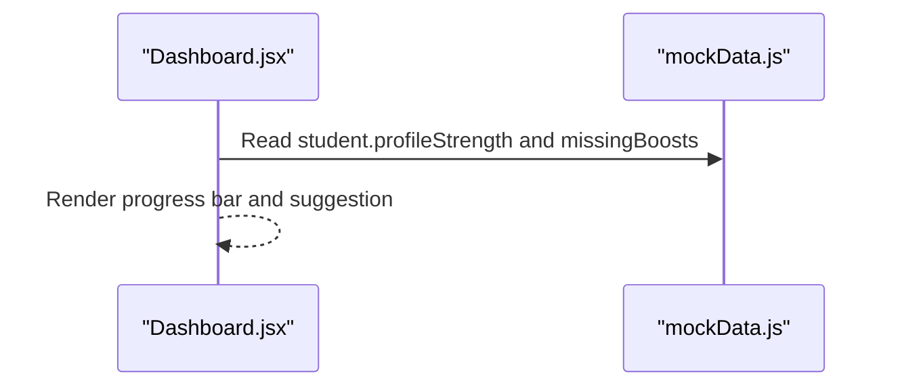
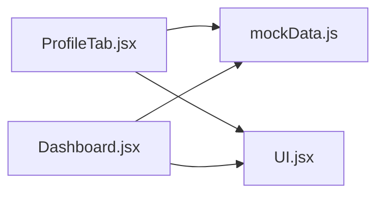

# Profile Strength Assessment

<cite>
**Referenced Files in This Document**
- [ProfileTab.jsx](file://scholarpath-frontend (2)/scholarpath/src/pages/ProfileTab.jsx)
- [mockData.js](file://scholarpath-frontend (2)/scholarpath/src/data/mockData.js)
- [UI.jsx](file://scholarpath-frontend (2)/scholarpath/src/components/UI.jsx)
- [Dashboard.jsx](file://scholarpath-frontend (2)/scholarpath/src/pages/Dashboard.jsx)
</cite>

## Table of Contents
1. [Introduction](#introduction)
2. [Project Structure](#project-structure)
3. [Core Components](#core-components)
4. [Architecture Overview](#architecture-overview)
5. [Detailed Component Analysis](#detailed-component-analysis)
6. [Dependency Analysis](#dependency-analysis)
7. [Performance Considerations](#performance-considerations)
8. [Troubleshooting Guide](#troubleshooting-guide)
9. [Conclusion](#conclusion)

## Introduction
This document explains the profile strength assessment system that calculates completion status based on form data and uploaded documents. It focuses on:
- The computeChecklist function logic
- Profile checklist categories: basics, academics, tests, essays, extracurriculars
- Automatic status calculation driven by user inputs and document uploads
- Visual indicators: checkmarks, color coding, and progress tracking
- Examples showing how different combinations of fields and uploads affect overall completion
- What constitutes a complete vs incomplete profile

## Project Structure
The profile strength feature is implemented in the frontend React application. Key files involved:
- ProfileTab.jsx: Contains the profile form, document upload UI, and the computeChecklist logic
- mockData.js: Defines the checklist categories and required documents with statuses
- UI.jsx: Provides reusable components like Card, Button, and Badge used for visual feedback
- Dashboard.jsx: Displays the overall profile strength percentage and suggested improvements

**Diagram sources**
- [ProfileTab.jsx:27-45](file://scholarpath-frontend (2)/scholarpath/src/pages/ProfileTab.jsx#L27-L45)
- [mockData.js:25-41](file://scholarpath-frontend (2)/scholarpath/src/data/mockData.js#L25-L41)
- [UI.jsx:1-47](file://scholarpath-frontend (2)/scholarpath/src/components/UI.jsx#L1-L47)
- [Dashboard.jsx:51-69](file://scholarpath-frontend (2)/scholarpath/src/pages/Dashboard.jsx#L51-L69)

**Section sources**
- [ProfileTab.jsx:27-45](file://scholarpath-frontend (2)/scholarpath/src/pages/ProfileTab.jsx#L27-L45)
- [mockData.js:25-41](file://scholarpath-frontend (2)/scholarpath/src/data/mockData.js#L25-L41)
- [UI.jsx:1-47](file://scholarpath-frontend (2)/scholarpath/src/components/UI.jsx#L1-L47)
- [Dashboard.jsx:51-69](file://scholarpath-frontend (2)/scholarpath/src/pages/Dashboard.jsx#L51-L69)

## Core Components
- computeChecklist(form, documents): Determines whether each checklist category is done based on form fields and document submission status.
- Required documents list: Tracks transcript, passport, IELTS score, recommendation letter, and CV with statuses: submitted, pending, missing.
- Checklist categories: basics, academics, tests, essays, extracurriculars.
- Visual feedback: Checkmarks and colors indicate completion; badges show document status; dashboard shows overall strength percentage.

Key behaviors:
- Basics requires personal details to be filled.
- Academics requires degree, department, CGPA plus a submitted transcript.
- Tests considers either an entered IELTS score or a submitted IELTS document.
- Essays requires a submitted recommendation letter.
- Extracurriculars requires non-empty text input.

**Section sources**
- [ProfileTab.jsx:27-45](file://scholarpath-frontend (2)/scholarpath/src/pages/ProfileTab.jsx#L27-L45)
- [mockData.js:25-41](file://scholarpath-frontend (2)/scholarpath/src/data/mockData.js#L25-L41)

## Architecture Overview
The profile strength assessment is computed locally from state passed into ProfileTab. The flow is:
- User updates form fields or uploads documents
- State changes trigger re-render
- computeChecklist recalculates checklist items’ done flags
- UI renders checkmarks and colors accordingly
- Dashboard displays overall profile strength percentage and next improvement suggestions

**Diagram sources**
- [ProfileTab.jsx:27-45](file://scholarpath-frontend (2)/scholarpath/src/pages/ProfileTab.jsx#L27-L45)
- [mockData.js:25-41](file://scholarpath-frontend (2)/scholarpath/src/data/mockData.js#L25-L41)
- [Dashboard.jsx:51-69](file://scholarpath-frontend (2)/scholarpath/src/pages/Dashboard.jsx#L51-L69)

## Detailed Component Analysis

### computeChecklist Logic
The function maps over the checklist categories and sets a boolean done flag per item based on:
- Basics: Requires first name, last name, email, phone, country, gender
- Academics: Requires degree, department, CGPA AND a submitted transcript
- Tests: Requires either an IELTS score in the form OR a submitted IELTS document
- Essays: Requires a submitted recommendation letter
- Extracurriculars: Requires non-empty extracurricular activities text

**Diagram sources**
- [ProfileTab.jsx:27-45](file://scholarpath-frontend (2)/scholarpath/src/pages/ProfileTab.jsx#L27-L45)

**Section sources**
- [ProfileTab.jsx:27-45](file://scholarpath-frontend (2)/scholarpath/src/pages/ProfileTab.jsx#L27-L45)

### Visual Indicators
- Checklist items render a circular indicator:
  - Green background with white checkmark when done
  - Light gray background with no checkmark when not done
- Text color changes to emphasize completed items
- Document rows use a StatusBadge component:
  - Submitted: green badge
  - Pending: amber badge
  - Missing: gray badge
- Dashboard shows a progress bar representing profile strength percentage and suggests the next improvement that will increase strength

**Diagram sources**
- [ProfileTab.jsx:59-86](file://scholarpath-frontend (2)/scholarpath/src/pages/ProfileTab.jsx#L59-L86)
- [UI.jsx:34-46](file://scholarpath-frontend (2)/scholarpath/src/components/UI.jsx#L34-L46)
- [Dashboard.jsx:51-69](file://scholarpath-frontend (2)/scholarpath/src/pages/Dashboard.jsx#L51-L69)

**Section sources**
- [ProfileTab.jsx:59-86](file://scholarpath-frontend (2)/scholarpath/src/pages/ProfileTab.jsx#L59-L86)
- [UI.jsx:34-46](file://scholarpath-frontend (2)/scholarpath/src/components/UI.jsx#L34-L46)
- [Dashboard.jsx:51-69](file://scholarpath-frontend (2)/scholarpath/src/pages/Dashboard.jsx#L51-L69)

### Data Model: Checklist Categories and Documents
- Checklist categories define what needs to be completed:
  - basics, academics, tests, essays, extracurriculars
- Required documents include:
  - Transcript, Passport scan, IELTS score, Recommendation letter, CV / Resume
- Each document has an id, label, status (submitted/pending/missing), and optional fileName

**Diagram sources**
- [mockData.js:25-41](file://scholarpath-frontend (2)/scholarpath/src/data/mockData.js#L25-L41)

**Section sources**
- [mockData.js:25-41](file://scholarpath-frontend (2)/scholarpath/src/data/mockData.js#L25-L41)

### Examples: How Inputs Affect Completion
Below are examples illustrating how different combinations of form fields and document uploads affect checklist completion. These are derived directly from the computeChecklist rules and document statuses.

- Example 1: Incomplete basics
  - Form: Only first name filled
  - Documents: All missing
  - Result: Only “basics” remains incomplete; other categories also incomplete due to missing prerequisites
  - Visual: Gray circle without checkmark for basics; others similarly gray

- Example 2: Complete basics
  - Form: First name, last name, email, phone, country, gender all filled
  - Documents: Any status
  - Result: “basics” becomes done; other categories depend on their own requirements
  - Visual: Green circle with checkmark for basics

- Example 3: Academics incomplete without transcript
  - Form: Degree, department, CGPA filled
  - Documents: Transcript missing
  - Result: “academics” remains incomplete because transcript must be submitted
  - Visual: Gray circle for academics

- Example 4: Academics complete
  - Form: Degree, department, CGPA filled
  - Documents: Transcript submitted
  - Result: “academics” becomes done
  - Visual: Green circle with checkmark for academics

- Example 5: Tests via form field
  - Form: IELTS score entered
  - Documents: IELTS document may be missing
  - Result: “tests” becomes done because either form value or document suffices
  - Visual: Green circle with checkmark for tests

- Example 6: Tests via document
  - Form: No IELTS score
  - Documents: IELTS document submitted
  - Result: “tests” becomes done
  - Visual: Green circle with checkmark for tests

- Example 7: Essays incomplete
  - Form: Any values
  - Documents: Recommendation letter missing or pending
  - Result: “essays” remains incomplete until recommendation is submitted
  - Visual: Gray circle for essays

- Example 8: Essays complete
  - Documents: Recommendation letter submitted
  - Result: “essays” becomes done
  - Visual: Green circle with checkmark for essays

- Example 9: Extracurriculars incomplete
  - Form: Extracurricular activities empty
  - Result: “extracurriculars” remains incomplete
  - Visual: Gray circle for extracurriculars

- Example 10: Extracurriculars complete
  - Form: Non-empty extracurricular activities
  - Result: “extracurriculars” becomes done
  - Visual: Green circle with checkmark for extracurriculars

These examples demonstrate that completion is category-specific and depends on both form inputs and document statuses.

**Section sources**
- [ProfileTab.jsx:27-45](file://scholarpath-frontend (2)/scholarpath/src/pages/ProfileTab.jsx#L27-L45)
- [mockData.js:25-41](file://scholarpath-frontend (2)/scholarpath/src/data/mockData.js#L25-L41)

### Overall Profile Strength Percentage
- The dashboard displays a profile strength percentage and suggests the next improvement that will increase it.
- While computeChecklist determines checklist completion, the overall percentage shown in the dashboard is sourced from static mock data in this implementation.

**Diagram sources**
- [Dashboard.jsx:51-69](file://scholarpath-frontend (2)/scholarpath/src/pages/Dashboard.jsx#L51-L69)
- [mockData.js:15-23](file://scholarpath-frontend (2)/scholarpath/src/data/mockData.js#L15-L23)

**Section sources**
- [Dashboard.jsx:51-69](file://scholarpath-frontend (2)/scholarpath/src/pages/Dashboard.jsx#L51-L69)
- [mockData.js:15-23](file://scholarpath-frontend (2)/scholarpath/src/data/mockData.js#L15-L23)

## Dependency Analysis
- ProfileTab depends on:
  - mockData.js for checklist categories and required documents
  - UI.jsx for Card, Button, Badge components
- Dashboard depends on:
  - mockData.js for profile strength and missing boosts
  - UI.jsx for Badge and Card components

**Diagram sources**
- [ProfileTab.jsx:27-45](file://scholarpath-frontend (2)/scholarpath/src/pages/ProfileTab.jsx#L27-L45)
- [mockData.js:25-41](file://scholarpath-frontend (2)/scholarpath/src/data/mockData.js#L25-L41)
- [UI.jsx:1-47](file://scholarpath-frontend (2)/scholarpath/src/components/UI.jsx#L1-L47)
- [Dashboard.jsx:51-69](file://scholarpath-frontend (2)/scholarpath/src/pages/Dashboard.jsx#L51-L69)

**Section sources**
- [ProfileTab.jsx:27-45](file://scholarpath-frontend (2)/scholarpath/src/pages/ProfileTab.jsx#L27-L45)
- [mockData.js:25-41](file://scholarpath-frontend (2)/scholarpath/src/data/mockData.js#L25-L41)
- [UI.jsx:1-47](file://scholarpath-frontend (2)/scholarpath/src/components/UI.jsx#L1-L47)
- [Dashboard.jsx:51-69](file://scholarpath-frontend (2)/scholarpath/src/pages/Dashboard.jsx#L51-L69)

## Performance Considerations
- computeChecklist runs on every render when form or documents change; it is lightweight and uses simple checks, so performance impact is minimal.
- Avoid heavy computations inside computeChecklist to keep UI responsive during rapid input changes.
- If scaling to many checklist items or complex validation rules, consider memoization to prevent unnecessary recalculations.

[No sources needed since this section provides general guidance]

## Troubleshooting Guide
Common issues and resolutions:
- Basics not completing: Ensure all required personal fields are filled (first name, last name, email, phone, country, gender).
- Academics not completing: Fill degree, department, CGPA and submit the transcript document.
- Tests not completing: Either enter an IELTS score or submit the IELTS document.
- Essays not completing: Submit the recommendation letter document.
- Extracurriculars not completing: Enter non-empty text for extracurricular activities.
- Document status confusion: Use the StatusBadge to verify if a document is submitted, pending, or missing. Replace or re-upload as needed.

**Section sources**
- [ProfileTab.jsx:27-45](file://scholarpath-frontend (2)/scholarpath/src/pages/ProfileTab.jsx#L27-L45)
- [ProfileTab.jsx:59-86](file://scholarpath-frontend (2)/scholarpath/src/pages/ProfileTab.jsx#L59-L86)

## Conclusion
The profile strength assessment system computes completion status per category using straightforward rules based on form inputs and document submissions. Visual indicators provide immediate feedback through checkmarks and color-coded badges. While the checklist logic is dynamic, the overall profile strength percentage is currently sourced from static mock data. Users can improve their profile by completing each category’s requirements, which will update the checklist and inform them of the next recommended action to increase strength.

[No sources needed since this section summarizes without analyzing specific files]