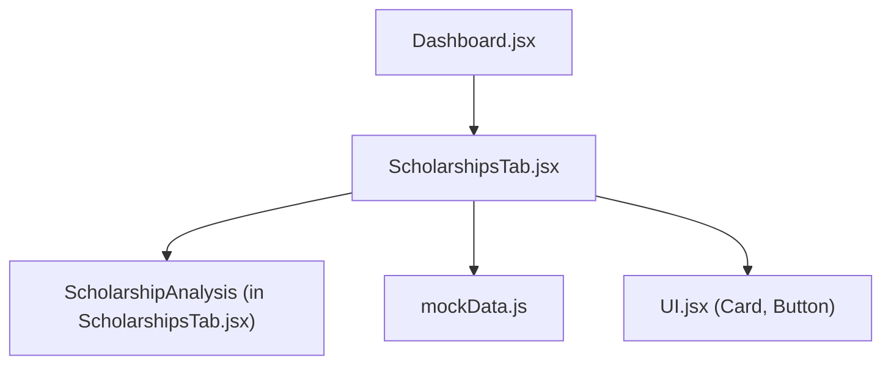
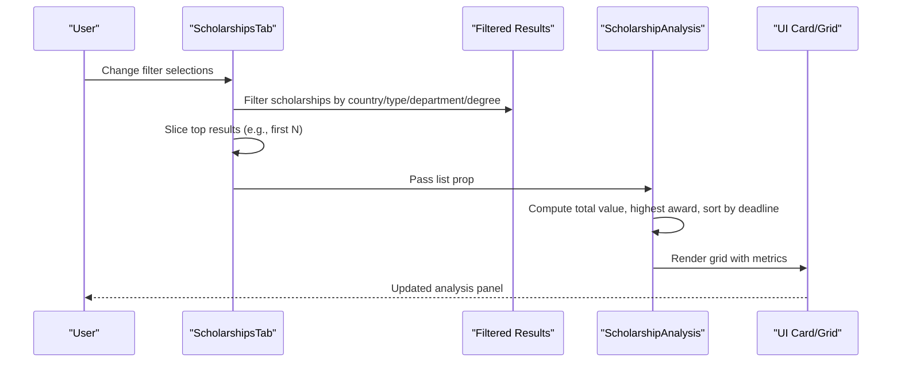
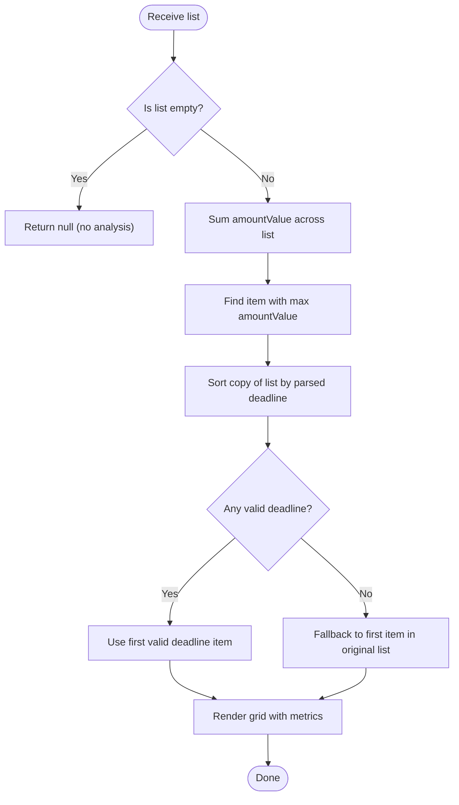
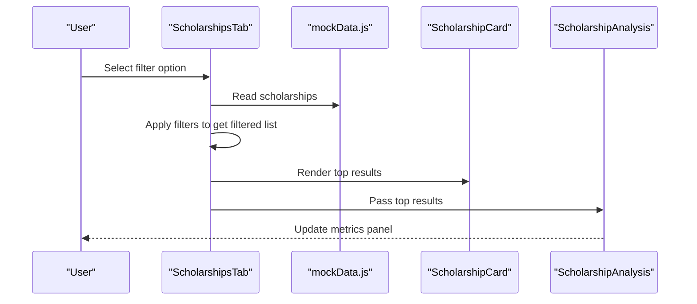
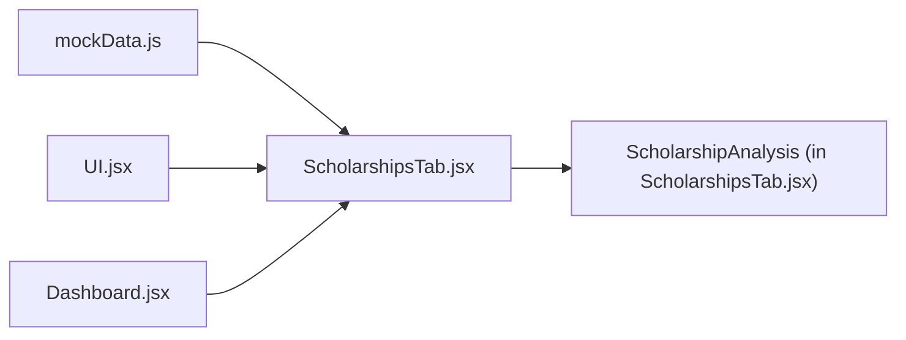

# Scholarship Analysis Dashboard

<cite>
**Referenced Files in This Document**
- [ScholarshipsTab.jsx](file://scholarpath-frontend (2)/scholarpath/src/pages/ScholarshipsTab.jsx)
- [mockData.js](file://scholarpath-frontend (2)/scholarpath/src/data/mockData.js)
- [UI.jsx](file://scholarpath-frontend (2)/scholarpath/src/components/UI.jsx)
- [Dashboard.jsx](file://scholarpath-frontend (2)/scholarpath/src/pages/Dashboard.jsx)
</cite>

## Table of Contents
1. [Introduction](#introduction)
2. [Project Structure](#project-structure)
3. [Core Components](#core-components)
4. [Architecture Overview](#architecture-overview)
5. [Detailed Component Analysis](#detailed-component-analysis)
6. [Dependency Analysis](#dependency-analysis)
7. [Performance Considerations](#performance-considerations)
8. [Troubleshooting Guide](#troubleshooting-guide)
9. [Conclusion](#conclusion)

## Introduction
This document explains the ScholarshipAnalysis component and how it provides insights and statistics for filtered scholarship results. It covers:
- Calculation logic for total potential value
- Identification of highest award opportunities
- Deadline proximity analysis
- Result count statistics
- Data processing algorithms for sorting by deadline, finding closest deadlines, and aggregating financial values
- Visualization patterns using grid layouts
- Dynamic dashboard updates as filters change
- Edge cases such as empty result sets and invalid date formats

## Project Structure
The ScholarshipAnalysis feature is implemented within a React application that uses:
- A page-level component to manage filtering and render results
- A dedicated analysis subcomponent to compute and display metrics
- Shared UI primitives for consistent layout
- Static mock data representing scholarships with fields like amountValue and deadline

**Diagram sources**
- [Dashboard.jsx:10-11](file://scholarpath-frontend (2)/scholarpath/src/pages/Dashboard.jsx#L10-L11)
- [ScholarshipsTab.jsx:1-3](file://scholarpath-frontend (2)/scholarpath/src/pages/ScholarshipsTab.jsx#L1-L3)
- [UI.jsx:1-6](file://scholarpath-frontend (2)/scholarpath/src/components/UI.jsx#L1-L6)

**Section sources**
- [Dashboard.jsx:10-11](file://scholarpath-frontend (2)/scholarpath/src/pages/Dashboard.jsx#L10-L11)
- [ScholarshipsTab.jsx:1-3](file://scholarpath-frontend (2)/scholarpath/src/pages/ScholarshipsTab.jsx#L1-L3)
- [UI.jsx:1-6](file://scholarpath-frontend (2)/scholarpath/src/components/UI.jsx#L1-L6)
- [mockData.js:136-254](file://scholarpath-frontend (2)/scholarpath/src/data/mockData.js#L136-L254)

## Core Components
- ScholarshipsTab: Manages filter state, computes filtered results, renders cards, and passes top results to ScholarshipAnalysis.
- ScholarshipAnalysis: Computes and displays key metrics for the provided list of scholarships.
- UI primitives: Card and Button used to structure and style the analysis panel and action buttons.

Key responsibilities:
- Filtering and slicing results in ScholarshipsTab
- Aggregation and sorting in ScholarshipAnalysis
- Consistent visual presentation via shared UI components

**Section sources**
- [ScholarshipsTab.jsx:59-135](file://scholarpath-frontend (2)/scholarpath/src/pages/ScholarshipsTab.jsx#L59-L135)
- [ScholarshipsTab.jsx:25-57](file://scholarpath-frontend (2)/scholarpath/src/pages/ScholarshipsTab.jsx#L25-L57)
- [UI.jsx:1-23](file://scholarpath-frontend (2)/scholarpath/src/components/UI.jsx#L1-L23)

## Architecture Overview
The flow begins with user interactions on the Scholarships tab, which update local state and recompute filtered results. The ScholarshipAnalysis component receives these results and calculates metrics to present in a grid-based summary.

**Diagram sources**
- [ScholarshipsTab.jsx:60-77](file://scholarpath-frontend (2)/scholarpath/src/pages/ScholarshipsTab.jsx#L60-L77)
- [ScholarshipsTab.jsx:25-57](file://scholarpath-frontend (2)/scholarpath/src/pages/ScholarshipsTab.jsx#L25-L57)
- [UI.jsx:1-6](file://scholarpath-frontend (2)/scholarpath/src/components/UI.jsx#L1-L6)

## Detailed Component Analysis

### ScholarshipAnalysis: Metrics and Algorithms
- Total potential value: Sum of numeric amountValue across all items in the list, treating missing or non-numeric values as zero.
- Highest award opportunity: Item with the maximum amountValue in the list.
- Deadline proximity analysis:
  - Sorts a copy of the list by parsed deadline dates.
  - Finds the first item whose deadline parses to a valid date; if none are valid, falls back to the first item in the original list.
- Result count statistics: Displays the number of matching scholarships in the current filtered set.

Visualization:
- Uses a responsive grid layout to show three primary metrics side-by-side:
  - Matching scholarships count
  - Combined potential value (formatted currency)
  - Closest deadline with name and deadline string
- Highlights the highest single award below the grid.

Edge case handling:
- Empty result set: If the list is empty, the component returns null (no analysis panel rendered).
- Invalid date formats: When parsing deadlines fails, the fallback ensures a valid item is still shown without crashing.

**Diagram sources**
- [ScholarshipsTab.jsx:25-57](file://scholarpath-frontend (2)/scholarpath/src/pages/ScholarshipsTab.jsx#L25-L57)

**Section sources**
- [ScholarshipsTab.jsx:25-57](file://scholarpath-frontend (2)/scholarpath/src/pages/ScholarshipsTab.jsx#L25-L57)

### ScholarshipsTab: Filtering and Dynamic Updates
- Filter state: Country, type, department, degree.
- Derived lists: Unique options for each filter derived from the full dataset.
- Filtering logic: Applies active filters to produce a filtered list.
- Top results: Slices the first N items to display as cards.
- Dynamic updates: Any change in filter state triggers recomputation of filtered results and re-renders both the cards and the ScholarshipAnalysis panel.

**Diagram sources**
- [ScholarshipsTab.jsx:60-135](file://scholarpath-frontend (2)/scholarpath/src/pages/ScholarshipsTab.jsx#L60-L135)
- [mockData.js:136-254](file://scholarpath-frontend (2)/scholarpath/src/data/mockData.js#L136-L254)

**Section sources**
- [ScholarshipsTab.jsx:60-135](file://scholarpath-frontend (2)/scholarpath/src/pages/ScholarshipsTab.jsx#L60-L135)
- [mockData.js:136-254](file://scholarpath-frontend (2)/scholarpath/src/data/mockData.js#L136-L254)

### Data Model and Fields Used
- Each scholarship includes:
  - Identifier and name
  - Display amount and numeric amountValue for aggregation
  - Deadline string for proximity analysis
  - Metadata such as matchedTo, country, type, degree, and applyLink

These fields enable:
- Financial aggregation via amountValue
- Deadline sorting and proximity checks via deadline strings
- Filtering by country, type, department, and degree

**Section sources**
- [mockData.js:136-254](file://scholarpath-frontend (2)/scholarpath/src/data/mockData.js#L136-L254)

### Related Dashboard Usage
The overview section also demonstrates similar analytics patterns:
- Sorting scholarships by amountValue to highlight top awards
- Filtering and sorting by deadline to surface upcoming opportunities

This reinforces consistency in how deadlines and monetary values are processed across the app.

**Section sources**
- [Dashboard.jsx:72-77](file://scholarpath-frontend (2)/scholarpath/src/pages/Dashboard.jsx#L72-L77)

## Dependency Analysis
- ScholarshipsTab depends on:
  - UI components (Card, Button) for rendering
  - Mock data for scholarships
- ScholarshipAnalysis depends on:
  - The list prop passed from ScholarshipsTab
  - Date parsing utilities (via JavaScript Date)
- Dashboard orchestrates tabs and includes ScholarshipsTab as one of its views

**Diagram sources**
- [ScholarshipsTab.jsx:1-3](file://scholarpath-frontend (2)/scholarpath/src/pages/ScholarshipsTab.jsx#L1-L3)
- [UI.jsx:1-6](file://scholarpath-frontend (2)/scholarpath/src/components/UI.jsx#L1-L6)
- [Dashboard.jsx:10-11](file://scholarpath-frontend (2)/scholarpath/src/pages/Dashboard.jsx#L10-L11)
- [mockData.js:136-254](file://scholarpath-frontend (2)/scholarpath/src/data/mockData.js#L136-L254)

**Section sources**
- [ScholarshipsTab.jsx:1-3](file://scholarpath-frontend (2)/scholarpath/src/pages/ScholarshipsTab.jsx#L1-L3)
- [UI.jsx:1-6](file://scholarpath-frontend (2)/scholarpath/src/components/UI.jsx#L1-L6)
- [Dashboard.jsx:10-11](file://scholarpath-frontend (2)/scholarpath/src/pages/Dashboard.jsx#L10-L11)
- [mockData.js:136-254](file://scholarpath-frontend (2)/scholarpath/src/data/mockData.js#L136-L254)

## Performance Considerations
- Filtering and slicing:
  - Filtering runs on each render when filters change; consider memoization for large datasets.
  - Slicing top results limits rendering cost for card grids.
- Sorting and aggregation:
  - Sorting creates a new array copy to avoid mutating input; this is safe but adds memory overhead proportional to list size.
  - Aggregations use single-pass reduce operations, which are efficient.
- Date parsing:
  - Parsing dates during sort can be costly; caching parsed dates or normalizing data at load time could improve performance for very large lists.
- Rendering:
  - Using stable keys (e.g., id) helps React optimize re-renders.

[No sources needed since this section provides general guidance]

## Troubleshooting Guide
Common issues and resolutions:
- Empty result set:
  - Symptom: No analysis panel appears.
  - Cause: The component returns null when the list is empty.
  - Resolution: Adjust filters to include more scholarships or ensure the dataset contains entries.
- Invalid date formats:
  - Symptom: Closest deadline may fall back to an arbitrary item.
  - Cause: Some deadlines cannot be parsed into valid dates.
  - Resolution: Normalize or validate deadline strings before analysis; ensure consistent date formats in the dataset.
- Missing or non-numeric amountValue:
  - Symptom: Total potential value may undercount.
  - Cause: Non-numeric or missing amountValue treated as zero.
  - Resolution: Ensure amountValue is numeric for all scholarships; provide sensible defaults where necessary.
- Incorrect filtering:
  - Symptom: Fewer results than expected.
  - Cause: Filters applied strictly; ensure correct values selected.
  - Resolution: Clear filters to reset and verify dropdown options match dataset values.

**Section sources**
- [ScholarshipsTab.jsx:25-57](file://scholarpath-frontend (2)/scholarpath/src/pages/ScholarshipsTab.jsx#L25-L57)
- [ScholarshipsTab.jsx:60-135](file://scholarpath-frontend (2)/scholarpath/src/pages/ScholarshipsTab.jsx#L60-L135)
- [mockData.js:136-254](file://scholarpath-frontend (2)/scholarpath/src/data/mockData.js#L136-L254)

## Conclusion
The ScholarshipAnalysis component delivers actionable insights over filtered scholarship results by computing total potential value, identifying the highest award, and highlighting the nearest deadline. It integrates seamlessly with ScholarshipsTab’s filtering system and presents metrics in a clear, responsive grid. With careful attention to edge cases like empty lists and invalid dates, the component remains robust and user-friendly. For larger datasets, consider optimizing date parsing and leveraging memoization to maintain responsiveness.

[No sources needed since this section summarizes without analyzing specific files]