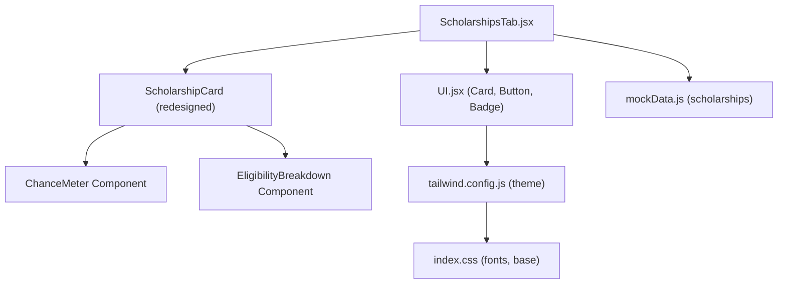
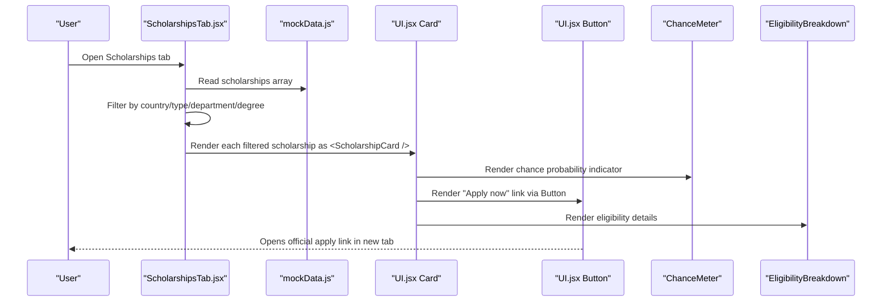
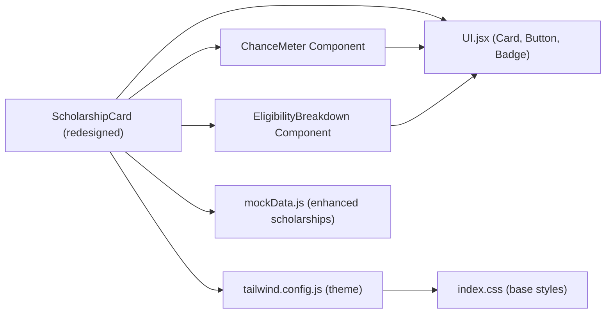

# Scholarship Card Component

<cite>
**Referenced Files in This Document**
- [ScholarshipsTab.jsx](file://scholarpath-frontend (2)/scholarpath/src/pages/ScholarshipsTab.jsx)
- [UI.jsx](file://scholarpath-frontend (2)/scholarpath/src/components/UI.jsx)
- [mockData.js](file://scholarpath-frontend (2)/scholarpath/src/data/mockData.js)
- [tailwind.config.js](file://scholarpath-frontend (2)/scholarpath/tailwind.config.js)
- [index.css](file://scholarpath-frontend (2)/scholarpath/src/index.css)
</cite>

## Update Summary
**Changes Made**
- Updated visual layout section to reflect comprehensive redesign with grid system
- Enhanced props interface documentation to include new fields like chance, evidence, reasons
- Added new sections for ChanceMeter and EligibilityBreakdown components
- Updated styling approach to document enhanced visual presentation with colored sections
- Expanded accessibility considerations for interactive elements
- Added customization options for eligibility visualization and country-specific guidelines

## Table of Contents
1. [Introduction](#introduction)
2. [Project Structure](#project-structure)
3. [Core Components](#core-components)
4. [Architecture Overview](#architecture-overview)
5. [Detailed Component Analysis](#detailed-component-analysis)
6. [Dependency Analysis](#dependency-analysis)
7. [Performance Considerations](#performance-considerations)
8. [Troubleshooting Guide](#troubleshooting-guide)
9. [Conclusion](#conclusion)
10. [Appendices](#appendices)

## Introduction
This document explains the redesigned ScholarshipCard component that renders individual scholarship information in an enhanced card format. The component features a comprehensive visual redesign with improved data handling using a grid system for funding details, deadlines, and university information. It includes distinct colored sections for monetary values and deadlines, enhanced eligibility breakdown visualization, and country-specific application guidelines. The component is implemented within the Scholarships tab and uses shared UI primitives for consistent design.

## Project Structure
The ScholarshipCard lives inside the Scholarships page and consumes shared UI components and mock data:
- Page-level logic and rendering: ScholarshipsTab.jsx
- Shared UI primitives (Card, Button, Badge): UI.jsx
- Scholarship data model: mockData.js
- Design tokens and theme: tailwind.config.js
- Global styles and font setup: index.css

**Diagram sources**
- [ScholarshipsTab.jsx:71-164](file://scholarpath-frontend (2)/scholarpath/src/pages/ScholarshipsTab.jsx#L71-L164)
- [UI.jsx:1-48](file://scholarpath-frontend (2)/scholarpath/src/components/UI.jsx#L1-L48)
- [mockData.js:130-248](file://scholarpath-frontend (2)/scholarpath/src/data/mockData.js#L130-L248)
- [tailwind.config.js:1-31](file://scholarpath-frontend (2)/scholarpath/tailwind.config.js#L1-L31)
- [index.css:1-35](file://scholarpath-frontend (2)/scholarpath/src/index.css#L1-L35)

**Section sources**
- [ScholarshipsTab.jsx:1-389](file://scholarpath-frontend (2)/scholarpath/src/pages/ScholarshipsTab.jsx#L1-L389)
- [UI.jsx:1-48](file://scholarpath-frontend (2)/scholarpath/src/components/UI.jsx#L1-L48)
- [mockData.js:130-248](file://scholarpath-frontend (2)/scholarpath/src/data/mockData.js#L130-L248)
- [tailwind.config.js:1-31](file://scholarpath-frontend (2)/scholarpath/tailwind.config.js#L1-L31)
- [index.css:1-35](file://scholarpath-frontend (2)/scholarpath/src/index.css#L1-L35)

## Core Components
- **ScholarshipCard**: Redesigned component that renders a single scholarship entry with enhanced visual presentation, grid-based layout for key information, and interactive elements.
- **ChanceMeter**: Visual probability indicator showing match percentage with color-coded progress bars.
- **EligibilityBreakdown**: Detailed criterion-by-criterion view showing pass/fail status for each eligibility requirement.
- **Card**: Reusable container providing background, border, rounded corners, and shadow.
- **Button**: Reusable action element with variants; used to render the "Apply now" call-to-action.
- **Badge**: Status indicator component for displaying degree levels, departments, and eligibility status.

Key responsibilities:
- Display structured scholarship information clearly and accessibly with enhanced visual hierarchy.
- Provide direct links to official application pages with contextual guidance.
- Show eligibility assessment with detailed breakdown of criteria.
- Maintain consistent visual hierarchy using typography and color tokens.
- Offer country-specific application guidelines and support.

**Section sources**
- [ScholarshipsTab.jsx:71-164](file://scholarpath-frontend (2)/scholarpath/src/pages/ScholarshipsTab.jsx#L71-L164)
- [ScholarshipsTab.jsx:6-29](file://scholarpath-frontend (2)/scholarpath/src/pages/ScholarshipsTab.jsx#L6-L29)
- [ScholarshipsTab.jsx:32-69](file://scholarpath-frontend (2)/scholarpath/src/pages/ScholarshipsTab.jsx#L32-L69)
- [UI.jsx:1-48](file://scholarpath-frontend (2)/scholarpath/src/components/UI.jsx#L1-L48)

## Architecture Overview
At runtime, the ScholarshipsTab filters and maps scholarship data to ScholarshipCard instances. Each card composes the shared Card and Button components with additional sub-components (ChanceMeter, EligibilityBreakdown) and applies Tailwind utility classes for enhanced layout and styling.

**Diagram sources**
- [ScholarshipsTab.jsx:264-389](file://scholarpath-frontend (2)/scholarpath/src/pages/ScholarshipsTab.jsx#L264-L389)
- [mockData.js:130-248](file://scholarpath-frontend (2)/scholarpath/src/data/mockData.js#L130-L248)
- [UI.jsx:1-48](file://scholarpath-frontend (2)/scholarpath/src/components/UI.jsx#L1-L48)

## Detailed Component Analysis

### Enhanced Visual Layout and Content Hierarchy
The redesigned ScholarshipCard features a comprehensive visual hierarchy with improved organization:

**Primary Information:**
- Scholarship name: Prominent heading-like text with navy color for primary identity
- University name: Secondary line showing matched institution
- Country and type: Combined display for quick context

**Enhanced Grid System:**
- Funding amount: Green-tinted section highlighting financial benefits
- Monetary value: Blue-tinted section showing numerical value with currency formatting
- Deadline: Amber-tinted section emphasizing time sensitivity with formatted dates

**Interactive Elements:**
- Degree and department badges: Color-coded status indicators
- Eligibility status badge: Dynamic coloring based on match status (green/amber/red/gray)
- Application button: Primary action with arrow indicator
- Guidelines toggle: Expandable section with country-specific instructions

**Accessibility notes:**
- Use semantic headings where appropriate to convey hierarchy
- Ensure links have descriptive context (e.g., include scholarship name near the link)
- Maintain sufficient color contrast for all text and interactive elements
- Provide keyboard navigation for all interactive elements

**Section sources**
- [ScholarshipsTab.jsx:99-164](file://scholarpath-frontend (2)/scholarpath/src/pages/ScholarshipsTab.jsx#L99-L164)

### Enhanced Props Interface
The redesigned ScholarshipCard receives a comprehensive prop object containing both basic scholarship fields and enhanced matching data:

**Basic Fields:**
- id/scholarship_id: Unique identifier for list rendering
- title/scholarship_title: Scholarship title (with fallback support)
- country/scholarship_country: Country of the scholarship or institution
- deadline/scholarship_deadline: Deadline string or date representation
- apply_url/scholarship_apply_url: Official application URL
- degree/scholarship_degree: Degree level (e.g., Bachelor's, Master's)
- department/scholarship_department: Department or field of study
- university_name: Target university name

**Enhanced Matching Fields:**
- chance: Numerical probability percentage (0-100)
- chance_label: Descriptive label for the chance percentage
- chance_color: Color coding for the chance meter (green/blue/amber/orange/red)
- funding: Human-readable funding description
- funding_value: Numeric value for currency formatting
- status: Eligibility status (Eligible, Partially Eligible, Not Eligible, Not Scored)
- evidence: Array of eligibility criteria with pass/fail results
- reasons: Array of explanatory reasons for eligibility assessment

**Usage example reference:**
- The ScholarshipsTab maps over the scholarships array and passes each item as the s prop to ScholarshipCard, supporting both legacy and enhanced data formats.

**Section sources**
- [ScholarshipsTab.jsx:72-88](file://scholarpath-frontend (2)/scholarpath/src/pages/ScholarshipsTab.jsx#L72-L88)
- [ScholarshipsTab.jsx:377-380](file://scholarpath-frontend (2)/scholarpath/src/pages/ScholarshipsTab.jsx#L377-L380)

### Enhanced Styling Approach with Tailwind CSS
The redesigned component utilizes advanced Tailwind CSS patterns for enhanced visual presentation:

**Typography and Hierarchy:**
- Uses size and weight utilities to create clear visual hierarchy (name bold at 16px, secondary info smaller at 12-14px)
- Navy color (#0F172A) for primary text, slate (#475569) for secondary information
- Consistent spacing with tight leading for compact information density

**Color-Coded Sections:**
- Green sections (bg-green-50) for funding information with green-600 text
- Blue sections (bg-blue-50) for monetary values with blue-600 text  
- Amber sections (bg-amber-50) for deadlines with amber-600 text
- Status badges use semantic colors (green for eligible, amber for partial, red for not eligible)

**Grid Layout System:**
- Responsive grid with `grid-cols-2` for key information display
- Flexible wrapping with `flex-wrap gap-1.5` for badges and tags
- Consistent spacing with `gap-2` and `gap-6` for larger layouts

**Interactive States:**
- Hover effects on buttons and links
- Smooth transitions for expandable content
- Focus states for keyboard navigation
- Loading animations for async operations

**Design tokens referenced:**
- Colors: sp-blue, sp-navy, sp-slate, sp-border, sp-bg, sp-green, sp-amber, and their light/dark variants
- Shadows: card and card-lg for elevated surfaces
- Font family: Inter with system fallbacks

**Section sources**
- [ScholarshipsTab.jsx:6-29](file://scholarpath-frontend (2)/scholarpath/src/pages/ScholarshipsTab.jsx#L6-L29)
- [ScholarshipsTab.jsx:99-164](file://scholarpath-frontend (2)/scholarpath/src/pages/ScholarshipsTab.jsx#L99-L164)
- [UI.jsx:1-48](file://scholarpath-frontend (2)/scholarpath/src/components/UI.jsx#L1-L48)
- [tailwind.config.js:1-31](file://scholarpath-frontend (2)/scholarpath/tailwind.config.js#L1-L31)
- [index.css:1-35](file://scholarpath-frontend (2)/scholarpath/src/index.css#L1-L35)

### Enhanced Responsive Design Patterns
The redesigned component implements sophisticated responsive behavior:

**Adaptive Grid Layout:**
- Single column on mobile devices with full-width cards
- Two-column grid on medium screens (`sm:grid-cols-2`) for better space utilization
- Flexible spacing that adapts across breakpoints

**Touch-Friendly Interactions:**
- Appropriately sized buttons and interactive elements for touch targets
- Expandable content sections that work well on small screens
- Optimized text sizes for readability on various device sizes

**Content Prioritization:**
- Critical information (title, funding, deadline) always visible
- Secondary details (eligibility breakdown, guidelines) accessible through interactive toggles
- Efficient use of screen real estate with collapsible sections

**Section sources**
- [ScholarshipsTab.jsx:377-380](file://scholarpath-frontend (2)/scholarpath/src/pages/ScholarshipsTab.jsx#L377-L380)

### Enhanced Accessibility Considerations
The redesigned component implements comprehensive accessibility features:

**Semantic Structure:**
- Proper heading hierarchy with h1-h6 elements where appropriate
- ARIA labels for interactive elements without visible text
- Logical tab order for keyboard navigation

**Visual Accessibility:**
- High contrast ratios between text and backgrounds
- Color-blind friendly color combinations
- Clear focus indicators for keyboard navigation
- Reduced motion support for users with vestibular disorders

**Interactive Accessibility:**
- All interactive elements are keyboard accessible
- Screen reader friendly descriptions for complex components
- Meaningful link text that provides context about destination
- Error messages and loading states are properly announced

**Section sources**
- [ScholarshipsTab.jsx:141-149](file://scholarpath-frontend (2)/scholarpath/src/pages/ScholarshipsTab.jsx#L141-L149)
- [ScholarshipsTab.jsx:146-148](file://scholarpath-frontend (2)/scholarpath/src/pages/ScholarshipsTab.jsx#L146-L148)
- [index.css:30-34](file://scholarpath-frontend (2)/scholarpath/src/index.css#L30-L34)

### Enhanced Customization Options for Different Scholarship Types
The redesigned component supports extensive customization for various scholarship types:

**Status-Based Customization:**
- Dynamic badge colors based on eligibility status (green/amber/red/gray)
- Conditional rendering of different sections based on available data
- Flexible field mapping supporting multiple data formats

**Country-Specific Guidelines:**
- Built-in guidelines for major scholarship destinations (China, UK, US, Canada, Germany, South Korea)
- Fallback generic guidelines for unsupported countries
- Expandable guideline sections that don't clutter the main interface

**Eligibility Visualization:**
- Detailed breakdown of eligibility criteria with pass/fail indicators
- Color-coded results (green for pass, red for fail, amber for unknown)
- Support for required vs actual values comparison
- Explanatory reasons for eligibility assessment

**Advanced Features:**
- Chance meter with configurable colors and labels
- Currency formatting for monetary values
- Date formatting with locale-aware display
- Integration with external APIs for live data updates

**Section sources**
- [ScholarshipsTab.jsx:82-88](file://scholarpath-frontend (2)/scholarpath/src/pages/ScholarshipsTab.jsx#L82-L88)
- [ScholarshipsTab.jsx:167-219](file://scholarpath-frontend (2)/scholarpath/src/pages/ScholarshipsTab.jsx#L167-L219)
- [ScholarshipsTab.jsx:32-69](file://scholarpath-frontend (2)/scholarpath/src/pages/ScholarshipsTab.jsx#L32-L69)

## Dependency Analysis
The redesigned ScholarshipCard depends on:
- UI primitives (Card, Button, Badge) for consistent presentation
- Enhanced internal components (ChanceMeter, EligibilityBreakdown) for specialized functionality
- Tailwind theme tokens for colors, fonts, and shadows
- Mock data structure for rendering scholarship entries with enhanced fields

**Diagram sources**
- [ScholarshipsTab.jsx:71-164](file://scholarpath-frontend (2)/scholarpath/src/pages/ScholarshipsTab.jsx#L71-L164)
- [ScholarshipsTab.jsx:6-29](file://scholarpath-frontend (2)/scholarpath/src/pages/ScholarshipsTab.jsx#L6-L29)
- [ScholarshipsTab.jsx:32-69](file://scholarpath-frontend (2)/scholarpath/src/pages/ScholarshipsTab.jsx#L32-L69)
- [UI.jsx:1-48](file://scholarpath-frontend (2)/scholarpath/src/components/UI.jsx#L1-L48)
- [tailwind.config.js:1-31](file://scholarpath-frontend (2)/scholarpath/tailwind.config.js#L1-L31)
- [mockData.js:130-248](file://scholarpath-frontend (2)/scholarpath/src/data/mockData.js#L130-L248)
- [index.css:1-35](file://scholarpath-frontend (2)/scholarpath/src/index.css#L1-L35)

**Section sources**
- [ScholarshipsTab.jsx:71-164](file://scholarpath-frontend (2)/scholarpath/src/pages/ScholarshipsTab.jsx#L71-L164)
- [UI.jsx:1-48](file://scholarpath-frontend (2)/scholarpath/src/components/UI.jsx#L1-L48)
- [tailwind.config.js:1-31](file://scholarpath-frontend (2)/scholarpath/tailwind.config.js#L1-L31)
- [mockData.js:130-248](file://scholarpath-frontend (2)/scholarpath/src/data/mockData.js#L130-L248)
- [index.css:1-35](file://scholarpath-frontend (2)/scholarpath/src/index.css#L1-L35)

## Performance Considerations
The redesigned component implements several performance optimizations:

**Rendering Efficiency:**
- Memoized calculations for derived data (country guidelines, date formatting)
- Conditional rendering of expensive components (EligibilityBreakdown only when needed)
- Efficient state management for expandable sections

**Memory Management:**
- Local state for UI interactions (showGuide, show breakdown)
- Cleanup of event listeners and timers
- Minimal re-renders through proper React patterns

**Network Optimization:**
- Lazy loading of country-specific guidelines
- Efficient API calls for smart agent analysis
- Caching of frequently accessed data

**Section sources**
- [ScholarshipsTab.jsx:272-292](file://scholarpath-frontend (2)/scholarpath/src/pages/ScholarshipsTab.jsx#L272-L292)
- [ScholarshipsTab.jsx:32-69](file://scholarpath-frontend (2)/scholarpath/src/pages/ScholarshipsTab.jsx#L32-L69)

## Troubleshooting Guide
Common issues and resolutions for the redesigned component:

**Data Format Issues:**
- Missing apply link: Ensure each scholarship has a valid apply_url; otherwise, the button will be hidden
- Inconsistent deadline formats: Standardize deadline strings using the built-in formatDeadline function
- Empty filter results: Provide clear messaging when no scholarships match current filters

**Visual Issues:**
- Incorrect color coding: Verify status values match expected enum values (Eligible, Partially Eligible, etc.)
- Broken grid layout: Check that parent container has proper flex/grid classes
- Text overflow: Ensure proper truncation classes are applied to long text

**Accessibility Issues:**
- Missing ARIA labels: Add appropriate labels for interactive elements
- Keyboard navigation problems: Ensure all interactive elements are focusable
- Screen reader compatibility: Test with assistive technologies

**Performance Issues:**
- Slow rendering: Check for unnecessary re-renders and optimize state updates
- Memory leaks: Ensure proper cleanup of event listeners and timers
- Large datasets: Implement pagination or virtualization for large scholarship lists

**Section sources**
- [ScholarshipsTab.jsx:90-97](file://scholarpath-frontend (2)/scholarpath/src/pages/ScholarshipsTab.jsx#L90-L97)
- [ScholarshipsTab.jsx:82-88](file://scholarpath-frontend (2)/scholarpath/src/pages/ScholarshipsTab.jsx#L82-L88)
- [ScholarshipsTab.jsx:367-372](file://scholarpath-frontend (2)/scholarpath/src/pages/ScholarshipsTab.jsx#L367-L372)

## Conclusion
The redesigned ScholarshipCard component delivers a comprehensive, accessible, and visually enhanced presentation of scholarship opportunities. Built on shared UI primitives with advanced internal components (ChanceMeter, EligibilityBreakdown), it integrates seamlessly into the Scholarships tab while supporting sophisticated filtering and analysis features. The enhanced grid system, color-coded sections, and interactive elements provide users with a modern, intuitive experience for discovering and applying to scholarships. By following the documented props interface and styling approach, you can customize the card for various scholarship types while maintaining usability and visual consistency.

## Appendices

### Enhanced Data Model Reference
The redesigned scholarships array defines an enhanced data shape consumed by ScholarshipCard, including both basic fields and advanced matching capabilities:

**Basic Fields:**
- Identifiers: id, scholarship_id
- Names: name, title, scholarship_title, university_name
- Location: country, scholarship_country
- Deadlines: deadline, scholarship_deadline
- Links: applyLink, apply_url, scholarship_apply_url
- Academic: degree, scholarship_degree, department, scholarship_department
- Type: type, scholarship_type

**Enhanced Fields:**
- Financial: funding, funding_value
- Matching: chance, chance_label, chance_color, status
- Evidence: evidence (array of criteria), reasons (array of explanations)

**Section sources**
- [mockData.js:130-248](file://scholarpath-frontend (2)/scholarpath/src/data/mockData.js#L130-L248)

### Theme Tokens Reference
Custom colors, fonts, and shadows are defined in the Tailwind configuration and applied throughout the app, including the redesigned ScholarshipCard and its enhanced components:

**Color Palette:**
- Primary: sp-blue (#125BC9) with light/dark variants
- Neutral: sp-navy (#0F172A), sp-slate (#475569)
- Semantic: sp-green (#16A34A), sp-amber (#B45309)
- Background: sp-bg (#F8FAFC), sp-border (#E2E8F0)

**Typography:**
- Font family: Inter with system-ui fallbacks
- Weight scale: 400-800 for various emphasis levels

**Shadows:**
- Card elevation: card and card-lg for depth
- Subtle shadows for modern UI feel

**Section sources**
- [tailwind.config.js:1-31](file://scholarpath-frontend (2)/scholarpath/tailwind.config.js#L1-L31)
- [index.css:1-35](file://scholarpath-frontend (2)/scholarpath/src/index.css#L1-L35)

### Component Architecture Reference
The redesigned ScholarshipCard architecture includes several interconnected components:

**Main Components:**
- ScholarshipCard: Primary container with enhanced layout
- ChanceMeter: Probability visualization with color coding
- EligibilityBreakdown: Detailed criteria assessment

**Supporting Components:**
- Card: Base container with consistent styling
- Button: Action elements with multiple variants
- Badge: Status indicators with semantic colors

**Utility Functions:**
- getGuideline(): Country-specific application instructions
- formatDeadline(): Date formatting with locale support
- statusBadge(): Dynamic status rendering

**Section sources**
- [ScholarshipsTab.jsx:6-29](file://scholarpath-frontend (2)/scholarpath/src/pages/ScholarshipsTab.jsx#L6-L29)
- [ScholarshipsTab.jsx:32-69](file://scholarpath-frontend (2)/scholarpath/src/pages/ScholarshipsTab.jsx#L32-L69)
- [ScholarshipsTab.jsx:71-164](file://scholarpath-frontend (2)/scholarpath/src/pages/ScholarshipsTab.jsx#L71-L164)
- [ScholarshipsTab.jsx:167-219](file://scholarpath-frontend (2)/scholarpath/src/pages/ScholarshipsTab.jsx#L167-L219)
- [UI.jsx:1-48](file://scholarpath-frontend (2)/scholarpath/src/components/UI.jsx#L1-L48)