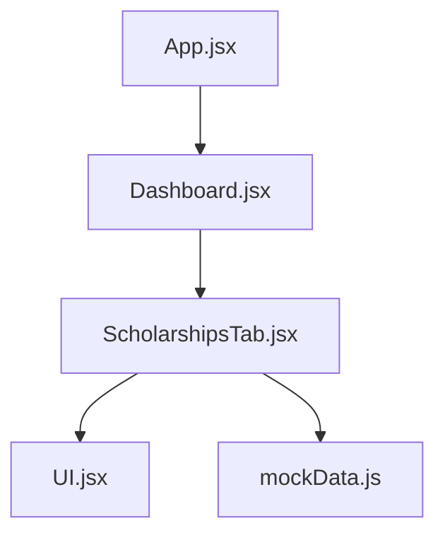
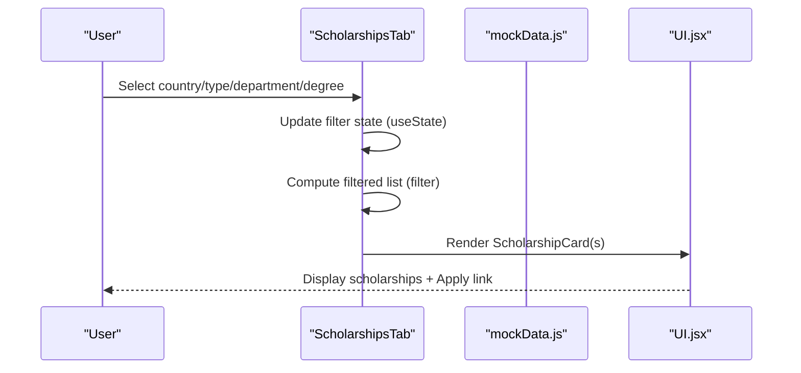
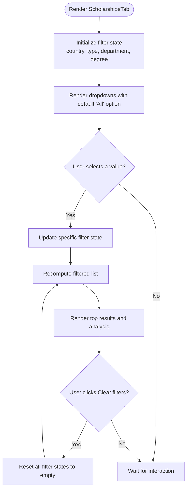
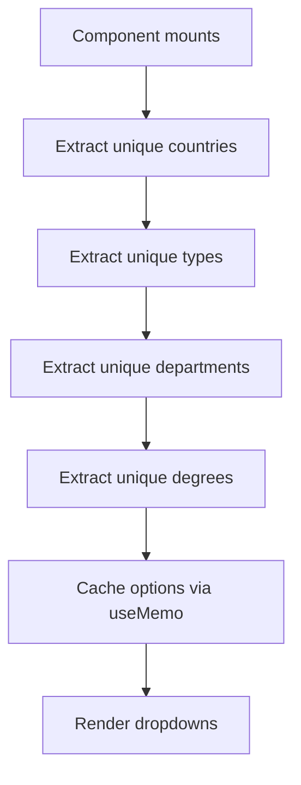
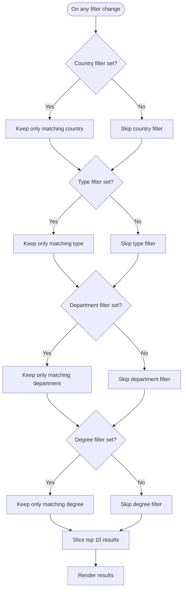
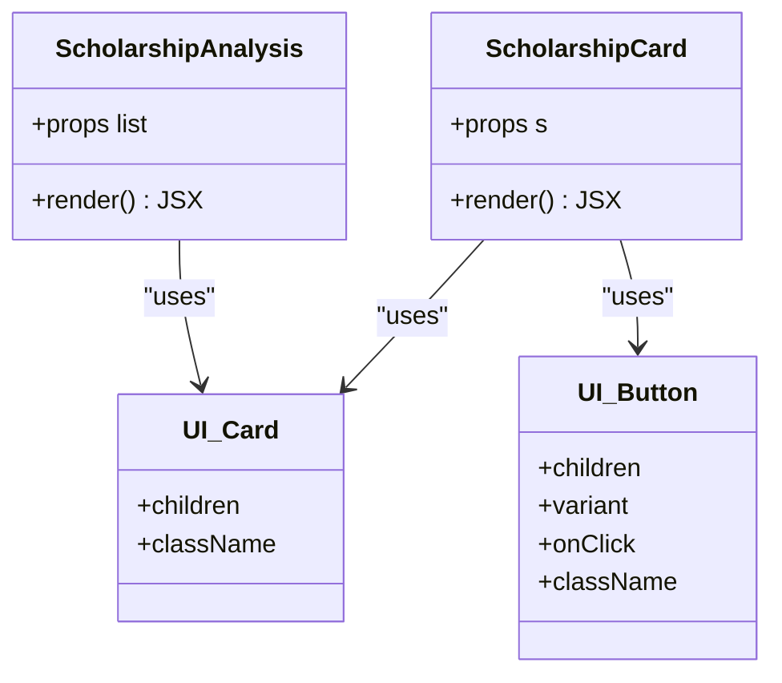
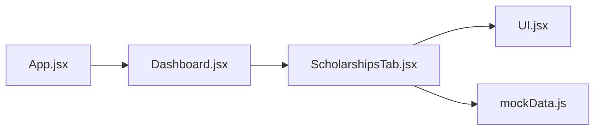

# Scholarship Search Interface

<cite>
**Referenced Files in This Document**
- [ScholarshipsTab.jsx](file://scholarpath-frontend (2)/scholarpath/src/pages/ScholarshipsTab.jsx)
- [mockData.js](file://scholarpath-frontend (2)/scholarpath/src/data/mockData.js)
- [UI.jsx](file://scholarpath-frontend (2)/scholarpath/src/components/UI.jsx)
- [Dashboard.jsx](file://scholarpath-frontend (2)/scholarpath/src/pages/Dashboard.jsx)
- [App.jsx](file://scholarpath-frontend (2)/scholarpath/src/App.jsx)
</cite>

## Table of Contents
1. [Introduction](#introduction)
2. [Project Structure](#project-structure)
3. [Core Components](#core-components)
4. [Architecture Overview](#architecture-overview)
5. [Detailed Component Analysis](#detailed-component-analysis)
6. [Dependency Analysis](#dependency-analysis)
7. [Performance Considerations](#performance-considerations)
8. [Troubleshooting Guide](#troubleshooting-guide)
9. [Conclusion](#conclusion)

## Introduction
This document explains the scholarship search and filtering interface built with React. It focuses on how users can filter scholarships by country, type, department, and degree level; how filter state is managed using useState hooks; how dropdown options are dynamically populated from mock data; and how real-time multi-criteria filtering works. It also covers performance optimization using useMemo for dropdown options and user interaction patterns such as clearing filters and viewing results.

## Project Structure
The scholarship search feature lives under a dashboard tab that renders the ScholarshipsTab component. The UI uses shared components for cards and buttons, while all scholarship data comes from a centralized mock data module.

**Diagram sources**
- [App.jsx:1-15](file://scholarpath-frontend (2)/scholarpath/src/App.jsx#L1-L15)
- [Dashboard.jsx:1-187](file://scholarpath-frontend (2)/scholarpath/src/pages/Dashboard.jsx#L1-L187)
- [ScholarshipsTab.jsx:1-139](file://scholarpath-frontend (2)/scholarpath/src/pages/ScholarshipsTab.jsx#L1-L139)
- [UI.jsx:1-47](file://scholarpath-frontend (2)/scholarpath/src/components/UI.jsx#L1-L47)
- [mockData.js:135-254](file://scholarpath-frontend (2)/scholarpath/src/data/mockData.js#L135-L254)

**Section sources**
- [App.jsx:1-15](file://scholarpath-frontend (2)/scholarpath/src/App.jsx#L1-L15)
- [Dashboard.jsx:128-187](file://scholarpath-frontend (2)/scholarpath/src/pages/Dashboard.jsx#L128-L187)
- [ScholarshipsTab.jsx:1-139](file://scholarpath-frontend (2)/scholarpath/src/pages/ScholarshipsTab.jsx#L1-L139)

## Core Components
- ScholarshipsTab: Implements the full search and filter UI, including four dropdowns (country, type, department, degree), a clear-filters button, filtered results display, and an analysis summary.
- UI components: Card and Button used to render scholarship entries and action buttons consistently across the app.
- Mock data: Centralized dataset containing scholarships with fields like name, amount, deadline, matchedTo, country, type, degree, department, and applyLink.

Key responsibilities:
- State management for filters via useState
- Dynamic population of dropdown options via useMemo
- Real-time filtering logic applying multiple criteria simultaneously
- Rendering top results and an analysis summary

**Section sources**
- [ScholarshipsTab.jsx:59-139](file://scholarpath-frontend (2)/scholarpath/src/pages/ScholarshipsTab.jsx#L59-L139)
- [UI.jsx:1-47](file://scholarpath-frontend (2)/scholarpath/src/components/UI.jsx#L1-L47)
- [mockData.js:135-254](file://scholarpath-frontend (2)/scholarpath/src/data/mockData.js#L135-L254)

## Architecture Overview
The interface follows a unidirectional data flow:
- User interactions update local filter state in ScholarshipsTab.
- Filtered results are computed from the static scholarships array in mockData.js.
- Dropdown options are derived once per mount using useMemo to avoid recomputation.
- Results are rendered as cards with links to official application pages.

**Diagram sources**
- [ScholarshipsTab.jsx:60-77](file://scholarpath-frontend (2)/scholarpath/src/pages/ScholarshipsTab.jsx#L60-L77)
- [ScholarshipsTab.jsx:90-115](file://scholarpath-frontend (2)/scholarpath/src/pages/ScholarshipsTab.jsx#L90-L115)
- [ScholarshipsTab.jsx:118-135](file://scholarpath-frontend (2)/scholarpath/src/pages/ScholarshipsTab.jsx#L118-L135)
- [mockData.js:135-254](file://scholarpath-frontend (2)/scholarpath/src/data/mockData.js#L135-L254)
- [UI.jsx:1-24](file://scholarpath-frontend (2)/scholarpath/src/components/UI.jsx#L1-L24)

## Detailed Component Analysis

### Filter State Management with useState
- Four pieces of state track selected filters: country, type, department, degree.
- Each select element updates its corresponding state via onChange handlers.
- When any filter is set, a Clear filters button appears to reset all states at once.

**Diagram sources**
- [ScholarshipsTab.jsx:60-68](file://scholarpath-frontend (2)/scholarpath/src/pages/ScholarshipsTab.jsx#L60-L68)
- [ScholarshipsTab.jsx:70-77](file://scholarpath-frontend (2)/scholarpath/src/pages/ScholarshipsTab.jsx#L70-L77)
- [ScholarshipsTab.jsx:90-115](file://scholarpath-frontend (2)/scholarpath/src/pages/ScholarshipsTab.jsx#L90-L115)

**Section sources**
- [ScholarshipsTab.jsx:60-77](file://scholarpath-frontend (2)/scholarpath/src/pages/ScholarshipsTab.jsx#L60-L77)
- [ScholarshipsTab.jsx:90-115](file://scholarpath-frontend (2)/scholarpath/src/pages/ScholarshipsTab.jsx#L90-L115)

### Dynamic Dropdown Population with useMemo
- Dropdown options are derived from the scholarships dataset by extracting unique values for each field.
- useMemo ensures these arrays are computed once and reused across renders, improving performance when the component re-renders due to other state changes.

**Diagram sources**
- [ScholarshipsTab.jsx:65-68](file://scholarpath-frontend (2)/scholarpath/src/pages/ScholarshipsTab.jsx#L65-L68)
- [mockData.js:135-254](file://scholarpath-frontend (2)/scholarpath/src/data/mockData.js#L135-L254)

**Section sources**
- [ScholarshipsTab.jsx:65-68](file://scholarpath-frontend (2)/scholarpath/src/pages/ScholarshipsTab.jsx#L65-L68)

### Real-Time Filtering Logic
- The filtered list is computed by applying all active filters simultaneously.
- Each criterion checks if the corresponding filter is set; if so, it excludes scholarships that do not match.
- Only the top 10 results are displayed to keep the UI concise.

**Diagram sources**
- [ScholarshipsTab.jsx:70-77](file://scholarpath-frontend (2)/scholarpath/src/pages/ScholarshipsTab.jsx#L70-L77)

**Section sources**
- [ScholarshipsTab.jsx:70-77](file://scholarpath-frontend (2)/scholarpath/src/pages/ScholarshipsTab.jsx#L70-L77)

### Results Display and Analysis
- Results are rendered as cards showing key details and a direct link to the official application page.
- An analysis section summarizes:
  - Number of matching scholarships
  - Combined potential value
  - Closest deadline among matches
  - Highest single award

**Diagram sources**
- [ScholarshipsTab.jsx:8-23](file://scholarpath-frontend (2)/scholarpath/src/pages/ScholarshipsTab.jsx#L8-L23)
- [ScholarshipsTab.jsx:25-57](file://scholarpath-frontend (2)/scholarpath/src/pages/ScholarshipsTab.jsx#L25-L57)
- [UI.jsx:1-24](file://scholarpath-frontend (2)/scholarpath/src/components/UI.jsx#L1-L24)

**Section sources**
- [ScholarshipsTab.jsx:8-57](file://scholarpath-frontend (2)/scholarpath/src/pages/ScholarshipsTab.jsx#L8-L57)
- [UI.jsx:1-24](file://scholarpath-frontend (2)/scholarpath/src/components/UI.jsx#L1-L24)

### User Interaction Patterns
- Clearing filters: A conditional button resets all filter states to their default empty values, causing the filtered list to revert to the full dataset.
- Viewing results: The interface shows up to ten matching scholarships and provides a summary analysis below the results.

**Section sources**
- [ScholarshipsTab.jsx:107-115](file://scholarpath-frontend (2)/scholarpath/src/pages/ScholarshipsTab.jsx#L107-L115)
- [ScholarshipsTab.jsx:118-135](file://scholarpath-frontend (2)/scholarpath/src/pages/ScholarshipsTab.jsx#L118-L135)

## Dependency Analysis
- ScholarshipsTab depends on:
  - UI components (Card, Button) for consistent rendering
  - mockData.scholarships for data and dropdown option derivation
- Dashboard integrates ScholarshipsTab as one of several tabs
- App sets up routing and mounts Dashboard

**Diagram sources**
- [App.jsx:1-15](file://scholarpath-frontend (2)/scholarpath/src/App.jsx#L1-L15)
- [Dashboard.jsx:128-187](file://scholarpath-frontend (2)/scholarpath/src/pages/Dashboard.jsx#L128-L187)
- [ScholarshipsTab.jsx:1-139](file://scholarpath-frontend (2)/scholarpath/src/pages/ScholarshipsTab.jsx#L1-L139)
- [UI.jsx:1-47](file://scholarpath-frontend (2)/scholarpath/src/components/UI.jsx#L1-L47)
- [mockData.js:135-254](file://scholarpath-frontend (2)/scholarpath/src/data/mockData.js#L135-L254)

**Section sources**
- [App.jsx:1-15](file://scholarpath-frontend (2)/scholarpath/src/App.jsx#L1-L15)
- [Dashboard.jsx:128-187](file://scholarpath-frontend (2)/scholarpath/src/pages/Dashboard.jsx#L128-L187)
- [ScholarshipsTab.jsx:1-139](file://scholarpath-frontend (2)/scholarpath/src/pages/ScholarshipsTab.jsx#L1-L139)

## Performance Considerations
- useMemo for dropdown options: Deriving unique values for country, type, department, and degree is memoized to avoid unnecessary recalculations on every render.
- Minimal re-renders: Filtering runs on state changes; only the affected parts of the UI update.
- Top results slicing: Limiting to ten results reduces DOM size and improves perceived performance.

[No sources needed since this section provides general guidance]

## Troubleshooting Guide
- No results shown: Ensure at least one filter is cleared or adjusted; verify that the dataset contains entries matching the selected criteria.
- Dropdowns not updating: Confirm that the dataset includes the expected values for country, type, department, and degree.
- Clear filters not visible: The button appears only when at least one filter is set; ensure state is updated correctly.

**Section sources**
- [ScholarshipsTab.jsx:107-115](file://scholarpath-frontend (2)/scholarpath/src/pages/ScholarshipsTab.jsx#L107-L115)
- [ScholarshipsTab.jsx:118-135](file://scholarpath-frontend (2)/scholarpath/src/pages/ScholarshipsTab.jsx#L118-L135)
- [mockData.js:135-254](file://scholarpath-frontend (2)/scholarpath/src/data/mockData.js#L135-L254)

## Conclusion
The scholarship search interface provides a responsive, multi-criteria filtering experience powered by React state and efficient computations. Users can quickly narrow down opportunities by country, type, department, and degree, view top matches, and access official application links. The use of useMemo for dropdown options and a straightforward filtering algorithm ensures good performance and clarity. The design supports easy extension to additional filters or backend integration without changing the core UI logic.