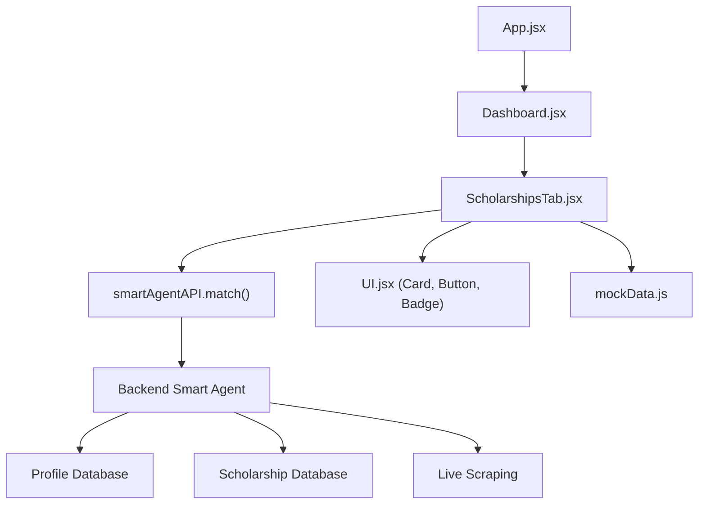
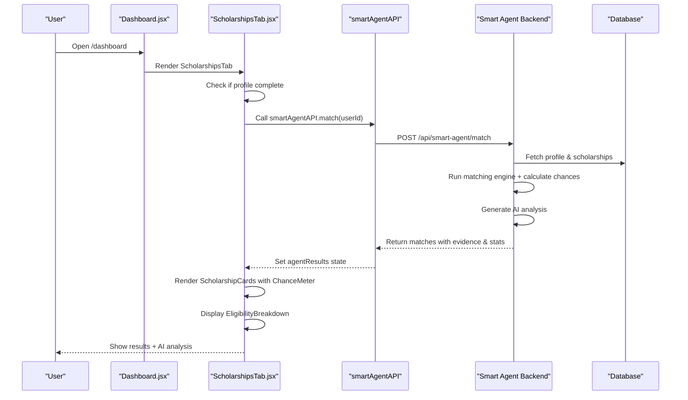
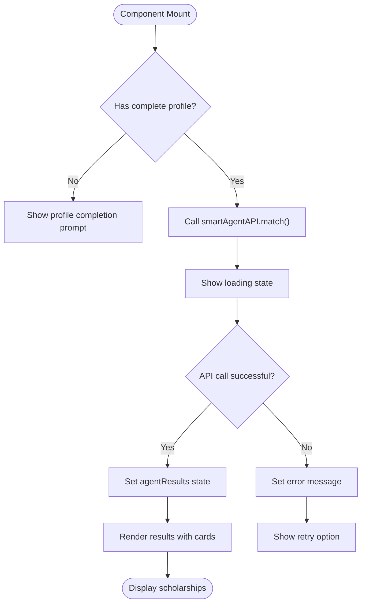
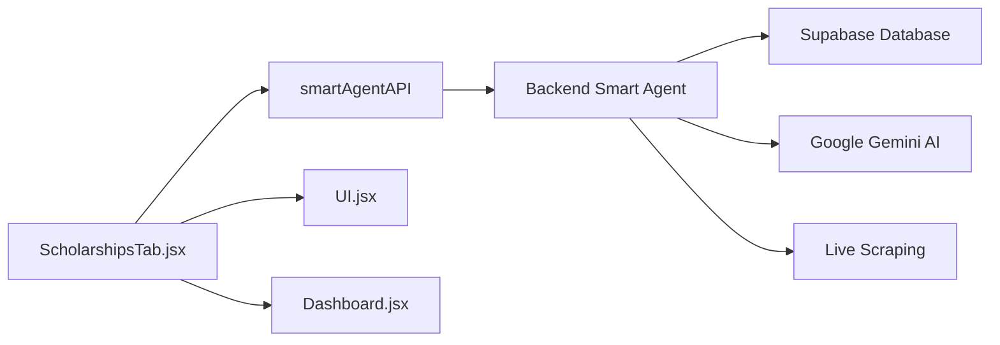

# Scholarships Discovery Tab

<cite>
**Referenced Files in This Document**
- [ScholarshipsTab.jsx](file://scholarpath-frontend (2)/scholarpath/src/pages/ScholarshipsTab.jsx)
- [Dashboard.jsx](file://scholarpath-frontend (2)/scholarpath/src/pages/Dashboard.jsx)
- [UI.jsx](file://scholarpath-frontend (2)/scholarpath/src/components/UI.jsx)
- [api.js](file://scholarpath-frontend (2)/scholarpath/src/api.js)
- [mockData.js](file://scholarpath-frontend (2)/scholarpath/src/data/mockData.js)
- [index.js](file://aischolarpath-backend-main/aischolarpath-backend-main/index.js)
- [matching-engine.js](file://aischolarpath-backend-main/aischolarpath-backend-main/matching-engine.js)
</cite>

## Update Summary
**Changes Made**
- Updated Smart Agent integration to handle new response format with probability indicators, eligibility breakdowns, and AI-generated analysis
- Added documentation for ChanceMeter component displaying visual probability indicators
- Added documentation for EligibilityBreakdown component showing criterion-by-criterion matching details
- Updated architecture diagrams to reflect Smart Agent API integration
- Enhanced matching algorithm documentation with evidence-based scoring system
- Added new sections for AI analysis display and application guidelines

## Table of Contents
1. [Introduction](#introduction)
2. [Project Structure](#project-structure)
3. [Core Components](#core-components)
4. [Architecture Overview](#architecture-overview)
5. [Detailed Component Analysis](#detailed-component-analysis)
6. [Smart Agent Integration](#smart-agent-integration)
7. [Probability Indicators and Matching](#probability-indicators-and-matching)
8. [Eligibility Breakdown System](#eligibility-breakdown-system)
9. [AI-Generated Analysis Display](#ai-generated-analysis-display)
10. [Application Guidelines](#application-guidelines)
11. [Dependency Analysis](#dependency-analysis)
12. [Performance Considerations](#performance-considerations)
13. [Troubleshooting Guide](#troubleshooting-guide)
14. [Conclusion](#conclusion)
15. [Appendices](#appendices)

## Introduction
This document explains the Scholarships discovery and matching experience implemented by the ScholarshipsTab component. The system now features an advanced Smart Agent that provides intelligent scholarship matching with probability indicators, detailed eligibility breakdowns, and AI-generated analysis. Users can discover relevant scholarships based on their profile, view personalized chance percentages, understand why each scholarship matches or doesn't match, and access country-specific application guidelines.

## Project Structure
The Scholarships feature is a tab within the Dashboard that integrates with the Smart Agent backend service. The tab automatically runs when users have a complete profile, displays matched scholarships as cards with probability indicators, shows detailed eligibility breakdowns, and provides AI-generated analysis summaries.



**Diagram sources**
- [Dashboard.jsx:192-338](file://scholarpath-frontend (2)/scholarpath/src/pages/Dashboard.jsx#L192-L338)
- [ScholarshipsTab.jsx:219-344](file://scholarpath-frontend (2)/scholarpath/src/pages/ScholarshipsTab.jsx#L219-L344)
- [api.js:72-75](file://scholarpath-frontend (2)/scholarpath/src/api.js#L72-L75)
- [index.js:2670-2960](file://aischolarpath-backend-main/aischolarpath-backend-main/index.js#L2670-L2960)

**Section sources**
- [Dashboard.jsx:192-338](file://scholarpath-frontend (2)/scholarpath/src/pages/Dashboard.jsx#L192-L338)
- [ScholarshipsTab.jsx:219-344](file://scholarpath-frontend (2)/scholarpath/src/pages/ScholarshipsTab.jsx#L219-L344)
- [api.js:72-75](file://scholarpath-frontend (2)/scholarpath/src/api.js#L72-L75)

## Core Components
- **ScholarshipsTab**: Main container that auto-runs Smart Agent analysis and displays results
- **ScholarshipCard**: Enhanced card displaying scholarship details with probability indicators and eligibility status
- **ChanceMeter**: Visual probability indicator showing percentage chance with color-coded progress bar
- **EligibilityBreakdown**: Detailed criterion-by-criterion view showing Pass/Fail/Missing status for each requirement
- **StatsSummary**: Displays aggregate insights including eligible/partial/not eligible counts and AI analysis
- **UI primitives**: Card, Button, and Badge components for consistent styling

Key responsibilities:
- Auto-running Smart Agent when user has complete profile
- Displaying probability indicators for each scholarship
- Showing detailed eligibility breakdowns with specific criteria
- Providing AI-generated analysis and recommendations
- Offering country-specific application guidelines

**Section sources**
- [ScholarshipsTab.jsx:6-29](file://scholarpath-frontend (2)/scholarpath/src/pages/ScholarshipsTab.jsx#L6-L29)
- [ScholarshipsTab.jsx:32-69](file://scholarpath-frontend (2)/scholarpath/src/pages/ScholarshipsTab.jsx#L32-L69)
- [ScholarshipsTab.jsx:72-127](file://scholarpath-frontend (2)/scholarpath/src/pages/ScholarshipsTab.jsx#L72-L127)
- [ScholarshipsTab.jsx:177-216](file://scholarpath-frontend (2)/scholarpath/src/pages/ScholarshipsTab.jsx#L177-L216)

## Architecture Overview
The ScholarshipsTab integrates with the Dashboard via routing and automatically triggers the Smart Agent when a user has a complete profile. The Smart Agent performs live scraping of scholarships from target countries, runs weighted eligibility scoring, calculates probability indicators, and generates AI analysis. Results are displayed with detailed breakdowns and application guidance.



**Diagram sources**
- [Dashboard.jsx:298](file://scholarpath-frontend (2)/scholarpath/src/pages/Dashboard.jsx#L298)
- [ScholarshipsTab.jsx:228-247](file://scholarpath-frontend (2)/scholarpath/src/pages/ScholarshipsTab.jsx#L228-L247)
- [api.js:74](file://scholarpath-frontend (2)/scholarpath/src/api.js#L74)
- [index.js:2670-2960](file://aischolarpath-backend-main/aischolarpath-backend-main/index.js#L2670-L2960)

## Detailed Component Analysis

### ScholarshipsTab
- **Auto-execution**: Automatically runs Smart Agent when user has target country and department set
- **State Management**: Manages loading states, error handling, and agent results
- **Profile Validation**: Checks for required profile fields before running analysis
- **Result Rendering**: Displays scholarships sorted by chance percentage with detailed breakdowns

Smart Agent execution flow:


**Section sources**
- [ScholarshipsTab.jsx:219-247](file://scholarpath-frontend (2)/scholarpath/src/pages/ScholarshipsTab.jsx#L219-L247)
- [ScholarshipsTab.jsx:253-344](file://scholarpath-frontend (2)/scholarpath/src/pages/ScholarshipsTab.jsx#L253-L344)

### Enhanced ScholarshipCard
- **Probability Display**: Shows chance percentage with color-coded meter (green/blue/amber/orange/red)
- **Status Badges**: Displays Eligible, Partially Eligible, Not Eligible, or Not Scored status
- **Funding Information**: Shows funding coverage and monetary value when available
- **Deadline Tracking**: Highlights upcoming deadlines prominently
- **Interactive Elements**: Includes "Apply now" links and expandable guidelines

**Section sources**
- [ScholarshipsTab.jsx:72-127](file://scholarpath-frontend (2)/scholarpath/src/pages/ScholarshipsTab.jsx#L72-L127)

### StatsSummary
- **Aggregate Statistics**: Shows counts of eligible, partially eligible, and not eligible scholarships
- **AI Analysis Display**: Presents AI-generated recommendations and insights
- **Data Source Information**: Indicates whether data came from live scraping, cache, or database
- **Visual Layout**: Uses color-coded cards for different eligibility categories

**Section sources**
- [ScholarshipsTab.jsx:177-216](file://scholarpath-frontend (2)/scholarpath/src/pages/ScholarshipsTab.jsx#L177-L216)

## Smart Agent Integration
The Smart Agent provides comprehensive scholarship matching through a sophisticated backend process:

### Backend Processing Flow
1. **Profile Retrieval**: Fetches user profile and extracted CV data
2. **Scholarship Collection**: Performs live scraping for target country + retrieves database scholarships
3. **Weighted Scoring**: Applies matching engine with configurable weights (CGPA: 25%, Field: 25%, Degree: 20%, IELTS: 15%)
4. **Probability Calculation**: Converts scores to probability percentages with status adjustments
5. **AI Analysis**: Generates personalized recommendations using Gemini AI
6. **Database Storage**: Persists matches with evidence and reasons for future reference

### Response Format
The Smart Agent returns a structured response containing:
- `matches`: Array of scholarship objects with full eligibility details
- `stats`: Aggregate counts (eligible, partial, not_eligible, total)
- `analysis`: AI-generated text analysis and recommendations
- `scrape_info`: Data source information (live_scrape, cached, database_fallback)
- `profile_summary`: Summary of profile data used for matching

**Section sources**
- [index.js:2670-2960](file://aischolarpath-backend-main/aischolarpath-backend-main/index.js#L2670-L2960)
- [api.js:72-75](file://scholarpath-frontend (2)/scholarpath/src/api.js#L72-L75)

## Probability Indicators and Matching
The probability system converts matching scores into intuitive percentage indicators:

### Chance Calculation Algorithm
```javascript
function calculateChance(match) {
  const score = Number(match.match_score) || 0;
  let chance = score;
  
  // Hard fails reduce chance significantly
  if (match.status === 'Not Eligible') chance = Math.min(chance * 0.05, 5);
  
  // Partial eligibility reduces chance based on missing/failing criteria
  else if (match.status === 'Partially Eligible') {
    const missingCount = evidence.filter(e => e.result === 'Missing').length;
    const failCount = evidence.filter(e => e.result === 'Fail').length;
    chance = score * (0.5 - failCount * 0.1 - missingCount * 0.05);
  }
  
  // Unknown matches get default low chance
  if (match.status === 'Not Scored') chance = 15;
  
  return { chance, label, color };
}
```

### Color Coding System
- **Green (75%+)**: High Chance - Strong match with minimal requirements
- **Blue (50-74%)**: Good Chance - Solid match with minor gaps
- **Amber (25-49%)**: Moderate Chance - Some requirements missing or slightly below minimum
- **Orange (6-24%)**: Low Chance - Significant gaps but still worth considering
- **Red (<6%)**: Very Low Chance - Major mismatches, focus elsewhere

**Section sources**
- [index.js:2630-2663](file://aischolarpath-backend-main/aischolarpath-backend-main/index.js#L2630-L2663)
- [ScholarshipsTab.jsx:6-29](file://scholarpath-frontend (2)/scholarpath/src/pages/ScholarshipsTab.jsx#L6-L29)

## Eligibility Breakdown System
The eligibility breakdown provides transparent criterion-by-criterion analysis:

### Evidence Structure
Each scholarship includes detailed evidence showing:
- **Criterion**: What was evaluated (CGPA, Field, Degree, IELTS, Deadline)
- **Required**: Minimum requirement specified by scholarship
- **Actual**: User's corresponding value or status
- **Result**: Pass, Fail, or Missing status
- **Weight**: Importance weight in overall scoring
- **Note**: Additional context for related fields or progression

### Status Determination Logic
- **Hard Fails** (Degree mismatch, Field mismatch, Expired deadline): Not Eligible
- **Soft Fails** (CGPA/IELTS slightly below minimum): Partially Eligible  
- **Missing Data**: Partially Eligible (user can improve profile)
- **All Pass**: Eligible
- **No Criteria**: Not Scored

**Section sources**
- [ScholarshipsTab.jsx:32-69](file://scholarpath-frontend (2)/scholarpath/src/pages/ScholarshipsTab.jsx#L32-L69)
- [index.js:2749-2883](file://aischolarpath-backend-main/aischolarpath-backend-main/index.js#L2749-L2883)

## AI-Generated Analysis Display
The system generates personalized AI analysis providing actionable insights:

### Analysis Generation Process
1. **Profile Context**: Includes degree, field, country, CGPA, IELTS, CV analysis status
2. **Matching Results**: Summarizes eligible/partial/not eligible counts and best opportunities
3. **Gemini AI Processing**: Generates 3-4 sentence honest assessment with recommendations
4. **Fallback Logic**: Provides template responses when AI is unavailable

### Display Features
- **Contextual Advice**: Tailored suggestions based on user's specific situation
- **Opportunity Highlighting**: Identifies best matches and improvement areas
- **Actionable Steps**: Clear next steps for enhancing eligibility
- **Encouraging Tone**: Maintains positive motivation while being realistic

**Section sources**
- [index.js:2902-2943](file://aischolarpath-backend-main/aischolarpath-backend-main/index.js#L2902-L2943)
- [ScholarshipsTab.jsx:199-203](file://scholarpath-frontend (2)/scholarpath/src/pages/ScholarshipsTab.jsx#L199-L203)

## Application Guidelines
Country-specific application guidelines provide step-by-step instructions:

### Supported Countries
- **China**: Campus China portal, CSC programs, document requirements
- **United Kingdom**: Chevening/Commonwealth, leadership essays, early deadlines
- **United States**: Fulbright program, GRE/GMAT requirements, interview process
- **Canada**: EduCanada portal, automatic university scholarships, December-March deadlines
- **Germany**: DAAD portal, research proposals, July-October deadlines

### Guideline Features
- **Step-by-Step Instructions**: Clear sequential process for each country
- **Document Requirements**: Specific files needed for applications
- **Timeline Guidance**: Important dates and processing times
- **Official Links**: Direct connections to application portals

**Section sources**
- [ScholarshipsTab.jsx:129-174](file://scholarpath-frontend (2)/scholarpath/src/pages/ScholarshipsTab.jsx#L129-L174)

## Dependency Analysis
- **ScholarshipsTab depends on**:
  - Smart Agent API (`smartAgentAPI.match`) for intelligent matching
  - UI primitives (Card, Button, Badge) for consistent rendering
  - Dashboard integration for routing and state management
- **Backend dependencies**:
  - Supabase database for profiles and scholarships
  - Google Gemini AI for analysis generation
  - Live scraping capabilities for real-time scholarship data
- **Frontend utilities**:
  - Local state management for loading, errors, and results
  - Conditional rendering based on profile completeness



**Diagram sources**
- [ScholarshipsTab.jsx:1-3](file://scholarpath-frontend (2)/scholarpath/src/pages/ScholarshipsTab.jsx#L1-L3)
- [api.js:72-75](file://scholarpath-frontend (2)/scholarpath/src/api.js#L72-L75)
- [index.js:24-38](file://aischolarpath-backend-main/aischolarpath-backend-main/index.js#L24-L38)

**Section sources**
- [ScholarshipsTab.jsx:1-3](file://scholarpath-frontend (2)/scholarpath/src/pages/ScholarshipsTab.jsx#L1-L3)
- [api.js:72-75](file://scholarpath-frontend (2)/scholarpath/src/api.js#L72-L75)
- [Dashboard.jsx:298](file://scholarpath-frontend (2)/scholarpath/src/pages/Dashboard.jsx#L298)

## Performance Considerations
- **Smart Agent Optimization**: Caches scrape results and uses efficient database queries
- **Client-Side Efficiency**: Memoization of computed values and conditional rendering
- **Network Requests**: Single API call per analysis run with comprehensive data payload
- **Large Dataset Handling**: Pagination and filtering for large scholarship collections
- **AI Processing**: Asynchronous AI analysis with fallback mechanisms

To optimize for larger datasets:
- Implement debounced search functionality
- Add pagination for scholarship lists
- Use virtual scrolling for long result sets
- Cache AI analysis results client-side
- Implement background re-analysis for profile updates

## Troubleshooting Guide
Common issues and resolutions:

### Smart Agent Issues
- **No results shown after profile update**: Ensure target country and department are set, then click "Re-analyze"
- **Loading indefinitely**: Check network connectivity and verify API endpoint availability
- **Error messages**: Review browser console for detailed error information

### Probability Indicator Problems
- **Unexpected chance percentages**: Verify profile data accuracy and check eligibility criteria
- **Color coding inconsistencies**: Confirm status determination logic and evidence evaluation

### Data Display Issues
- **Missing eligibility breakdown**: Check that evidence array contains proper structure
- **Incorrect funding amounts**: Verify scholarship database entries and criteria formatting

**Section sources**
- [ScholarshipsTab.jsx:228-247](file://scholarpath-frontend (2)/scholarpath/src/pages/ScholarshipsTab.jsx#L228-L247)
- [ScholarshipsTab.jsx:268-288](file://scholarpath-frontend (2)/scholarpath/src/pages/ScholarshipsTab.jsx#L268-L288)

## Conclusion
The ScholarshipsTab has evolved into a sophisticated scholarship discovery platform powered by intelligent matching algorithms and AI analysis. The Smart Agent integration provides users with personalized probability indicators, detailed eligibility breakdowns, and actionable recommendations. The system successfully balances automated intelligence with human-readable explanations, making scholarship discovery both efficient and educational. Future enhancements can build upon this foundation with advanced filtering, shortlist management, and notification systems.

## Appendices

### Shortlist Management (Planned Extension)
- Add "Save to shortlist" action per scholarship to persist preferred opportunities
- Provide dedicated view to manage shortlisted items with notes and priority ranking
- Integrate with application tracking system for seamless workflow

### Advanced Filtering Capabilities (Planned Extension)
- Implement multi-criteria filtering beyond basic country/department selection
- Add budget range filters and deadline proximity searches
- Support saved filter combinations and quick access to common searches

### Application Status Tracking (Planned Extension)
- Track application statuses (Not Started, In Progress, Submitted, Accepted, Rejected)
- Persist state across sessions and reflect in dashboard overview
- Provide timeline visualization and deadline reminders

### Notification System (Planned Extension)
- Parse deadlines and compute days remaining with configurable thresholds
- Show warnings for approaching deadlines via browser notifications
- Implement email alerts for critical application milestones

### Machine Learning Enhancement (Planned Extension)
- Incorporate user behavior patterns to improve matching accuracy
- Learn from application outcomes to refine probability calculations
- Personalize recommendation algorithms based on success rates