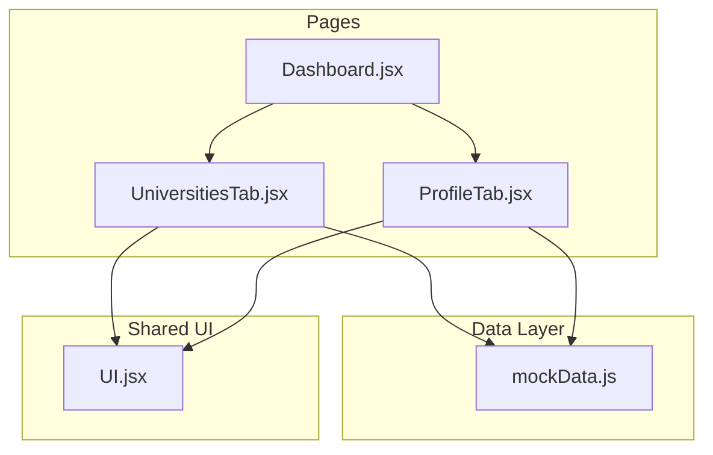
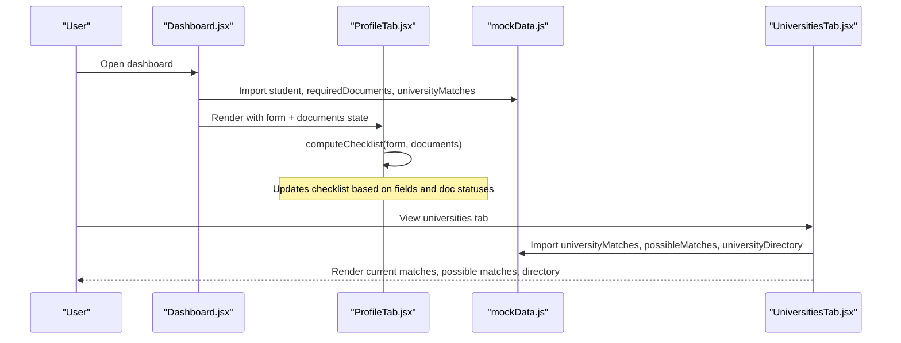
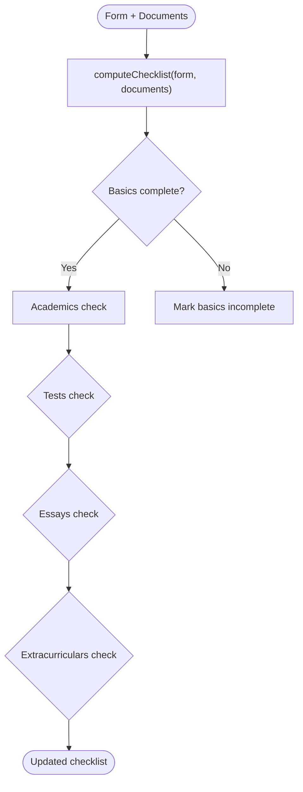
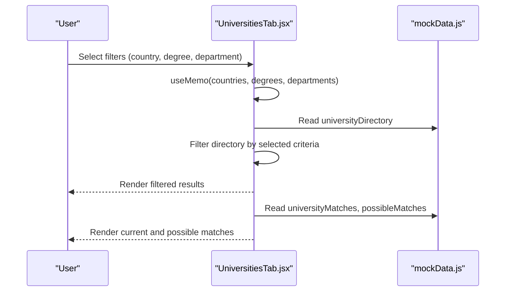
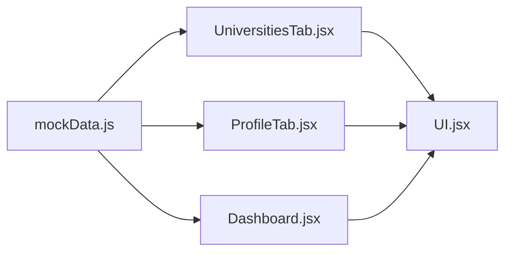

# Match Categories & Logic

<cite>
**Referenced Files in This Document**
- [mockData.js](file://scholarpath-frontend (2)/scholarpath/src/data/mockData.js)
- [UniversitiesTab.jsx](file://scholarpath-frontend (2)/scholarpath/src/pages/UniversitiesTab.jsx)
- [ProfileTab.jsx](file://scholarpath-frontend (2)/scholarpath/src/pages/ProfileTab.jsx)
- [Dashboard.jsx](file://scholarpath-frontend (2)/scholarpath/src/pages/Dashboard.jsx)
- [UI.jsx](file://scholarpath-frontend (2)/scholarpath/src/components/UI.jsx)
</cite>

## Table of Contents
1. [Introduction](#introduction)
2. [Project Structure](#project-structure)
3. [Core Components](#core-components)
4. [Architecture Overview](#architecture-overview)
5. [Detailed Component Analysis](#detailed-component-analysis)
6. [Dependency Analysis](#dependency-analysis)
7. [Performance Considerations](#performance-considerations)
8. [Troubleshooting Guide](#troubleshooting-guide)
9. [Conclusion](#conclusion)

## Introduction
This document explains the university match categorization system that separates universities into three categories:
- Current matches: high compatibility with the student profile.
- Possible matches: achievable with specific improvements; missing requirements are explicitly listed.
- Directory: a browsable, filterable list of universities independent of personal matching.

It also documents how the data flows from mockData.js to the UI and how user profile changes update the experience. While the current implementation uses static arrays for matches and directory entries, it is structured so that a future backend can replace these arrays without changing UI components.

## Project Structure
The matching system spans a small set of files:
- Data layer: mockData.js defines student profile, required documents, current matches, possible matches, and the full university directory.
- UI layer: UniversitiesTab.jsx renders the three sections (directory, current matches, possible matches).
- Profile input: ProfileTab.jsx manages form fields and document status, computing a checklist based on inputs and uploaded documents.
- Dashboard: Orchestrates tabs and lifts shared state (documents and profile form) so other tabs can react to updates.
- Shared UI primitives: UI.jsx provides reusable Card, Button, and Badge components used across pages.

**Diagram sources**
- [mockData.js:15-133](file://scholarpath-frontend (2)/scholarpath/src/data/mockData.js#L15-L133)
- [Dashboard.jsx:128-152](file://scholarpath-frontend (2)/scholarpath/src/pages/Dashboard.jsx#L128-L152)
- [ProfileTab.jsx:88-232](file://scholarpath-frontend (2)/scholarpath/src/pages/ProfileTab.jsx#L88-L232)
- [UniversitiesTab.jsx:73-163](file://scholarpath-frontend (2)/scholarpath/src/pages/UniversitiesTab.jsx#L73-L163)
- [UI.jsx:1-47](file://scholarpath-frontend (2)/scholarpath/src/components/UI.jsx#L1-L47)

**Section sources**
- [mockData.js:15-133](file://scholarpath-frontend (2)/scholarpath/src/data/mockData.js#L15-L133)
- [Dashboard.jsx:128-152](file://scholarpath-frontend (2)/scholarpath/src/pages/Dashboard.jsx#L128-L152)
- [UniversitiesTab.jsx:73-163](file://scholarpath-frontend (2)/scholarpath/src/pages/UniversitiesTab.jsx#L73-L163)
- [ProfileTab.jsx:88-232](file://scholarpath-frontend (2)/scholarpath/src/pages/ProfileTab.jsx#L88-L232)
- [UI.jsx:1-47](file://scholarpath-frontend (2)/scholarpath/src/components/UI.jsx#L1-L47)

## Core Components
- Student profile and boosts: The student object includes a name, profile strength percentage, and a list of missing boosts indicating what to add and the expected gain.
- Required documents: A fixed list of required documents with statuses (submitted, pending, missing) drives the profile checklist and informs missing requirement messaging.
- University matches: An array of universities the student currently qualifies for, each with a fit percentage and program details.
- Possible matches: An array of universities within reach, including explicit missing items that explain what needs improvement.
- University directory: A comprehensive list of universities with degrees and departments for browsing and filtering.

Key responsibilities:
- mockData.js: Centralizes all static data and exports arrays/objects consumed by pages.
- ProfileTab.jsx: Computes a dynamic checklist from form inputs and document statuses; supports uploading documents and simulating CV analysis to auto-fill fields.
- UniversitiesTab.jsx: Renders three distinct sections using the exported arrays; shows progress bars for fit percentages and lists actionable steps for possible matches.
- Dashboard.jsx: Lifts shared state (documents and profile form), displays overview highlights, and routes between tabs.

**Section sources**
- [mockData.js:15-133](file://scholarpath-frontend (2)/scholarpath/src/data/mockData.js#L15-L133)
- [ProfileTab.jsx:27-45](file://scholarpath-frontend (2)/scholarpath/src/pages/ProfileTab.jsx#L27-L45)
- [UniversitiesTab.jsx:8-71](file://scholarpath-frontend (2)/scholarpath/src/pages/UniversitiesTab.jsx#L8-L71)
- [Dashboard.jsx:51-70](file://scholarpath-frontend (2)/scholarpath/src/pages/Dashboard.jsx#L51-L70)

## Architecture Overview
The system follows a simple data-driven architecture:
- Static data source: mockData.js holds all match-related arrays and student profile information.
- UI consumers: Pages read from this data and render categorized views.
- State lifting: Dashboard maintains shared state for documents and profile form, enabling cross-tab reactivity.
- Checklist computation: ProfileTab computes completion status per section based on form fields and document statuses.

**Diagram sources**
- [Dashboard.jsx:128-152](file://scholarpath-frontend (2)/scholarpath/src/pages/Dashboard.jsx#L128-L152)
- [ProfileTab.jsx:27-45](file://scholarpath-frontend (2)/scholarpath/src/pages/ProfileTab.jsx#L27-L45)
- [UniversitiesTab.jsx:73-163](file://scholarpath-frontend (2)/scholarpath/src/pages/UniversitiesTab.jsx#L73-L163)
- [mockData.js:15-133](file://scholarpath-frontend (2)/scholarpath/src/data/mockData.js#L15-L133)

## Detailed Component Analysis

### Data Model and Matching Arrays
- Student profile: Includes name, profileStrength, and missingBoosts to guide improvements.
- Required documents: Fixed slots with statuses; used to compute checklist completion and inform missing requirement messages.
- Current matches: Array of universities with fit percentages representing high compatibility.
- Possible matches: Array of universities with fit percentages and an array of missing items describing actionable steps to unlock eligibility.
- University directory: Full list of universities with degrees and departments for browsing and filtering.

These arrays are imported directly by UI components and rendered without transformation, ensuring a clear separation between data and presentation.

**Section sources**
- [mockData.js:15-133](file://scholarpath-frontend (2)/scholarpath/src/data/mockData.js#L15-L133)

### Profile Checklist and Eligibility Evaluation
The profile checklist evaluates completion per section:
- Basics: Requires first name, last name, email, phone, country, gender.
- Academics: Requires degree, department, CGPA, and transcript submitted.
- Tests: Requires IELTS score or IELTS document submitted.
- Essays: Requires recommendation letter submitted.
- Extracurriculars: Requires extracurricular activities text.

Eligibility signals:
- Missing documents drive “missing” status and influence the next recommended boost shown in the dashboard.
- Uploaded documents update statuses and trigger re-computation of the checklist.

**Diagram sources**
- [ProfileTab.jsx:27-45](file://scholarpath-frontend (2)/scholarpath/src/pages/ProfileTab.jsx#L27-L45)

**Section sources**
- [ProfileTab.jsx:27-45](file://scholarpath-frontend (2)/scholarpath/src/pages/ProfileTab.jsx#L27-L45)

### Universities Tab Rendering and Categorization
The Universities tab renders three sections:
- Directory: Filterable by country, degree, and department; shows top results with official links.
- Current matches: Displays universities with high fit percentages and program details.
- Possible matches: Displays universities with lower fit percentages and lists missing items to improve eligibility.

Dynamic behavior:
- Filters derive from the directory data using useMemo to avoid unnecessary recalculations.
- Fit percentages are visualized via progress bars; badges indicate category (“Possible”).

**Diagram sources**
- [UniversitiesTab.jsx:73-163](file://scholarpath-frontend (2)/scholarpath/src/pages/UniversitiesTab.jsx#L73-L163)
- [mockData.js:43-133](file://scholarpath-frontend (2)/scholarpath/src/data/mockData.js#L43-L133)

**Section sources**
- [UniversitiesTab.jsx:73-163](file://scholarpath-frontend (2)/scholarpath/src/pages/UniversitiesTab.jsx#L73-L163)
- [mockData.js:43-133](file://scholarpath-frontend (2)/scholarpath/src/data/mockData.js#L43-L133)

### Dashboard Integration and Profile Strength
The dashboard:
- Lifts shared state for documents and profile form.
- Displays profile strength and the next recommended boost from the student object.
- Shows top university matches and scholarship highlights.

Reactivity:
- When documents are uploaded or analyzed, the checklist updates automatically.
- The next boost guidance encourages completing missing items to improve match opportunities.

**Section sources**
- [Dashboard.jsx:51-70](file://scholarpath-frontend (2)/scholarpath/src/pages/Dashboard.jsx#L51-L70)
- [Dashboard.jsx:128-152](file://scholarpath-frontend (2)/scholarpath/src/pages/Dashboard.jsx#L128-L152)
- [mockData.js:15-23](file://scholarpath-frontend (2)/scholarpath/src/data/mockData.js#L15-L23)

### UI Primitives and Visual Indicators
Reusable components:
- Card: Container for content blocks.
- Button: Primary, secondary, ghost variants for actions.
- Badge: Color-coded labels for status and categories.

Usage:
- Progress bars visualize fit percentages.
- Badges indicate “Possible” matches and document statuses.

**Section sources**
- [UI.jsx:1-47](file://scholarpath-frontend (2)/scholarpath/src/components/UI.jsx#L1-L47)
- [UniversitiesTab.jsx:8-71](file://scholarpath-frontend (2)/scholarpath/src/pages/UniversitiesTab.jsx#L8-L71)

## Dependency Analysis
- mockData.js is the single source of truth for match-related data.
- UniversitiesTab.jsx depends on mockData.js for rendering current matches, possible matches, and directory entries.
- ProfileTab.jsx depends on mockData.js for the profile checklist definitions and required documents.
- Dashboard.jsx imports student, requiredDocuments, universityMatches, and scholarships to display overview highlights and lift state.

**Diagram sources**
- [mockData.js:15-133](file://scholarpath-frontend (2)/scholarpath/src/data/mockData.js#L15-L133)
- [UniversitiesTab.jsx:73-163](file://scholarpath-frontend (2)/scholarpath/src/pages/UniversitiesTab.jsx#L73-L163)
- [ProfileTab.jsx:88-232](file://scholarpath-frontend (2)/scholarpath/src/pages/ProfileTab.jsx#L88-L232)
- [Dashboard.jsx:128-152](file://scholarpath-frontend (2)/scholarpath/src/pages/Dashboard.jsx#L128-L152)
- [UI.jsx:1-47](file://scholarpath-frontend (2)/scholarpath/src/components/UI.jsx#L1-L47)

**Section sources**
- [mockData.js:15-133](file://scholarpath-frontend (2)/scholarpath/src/data/mockData.js#L15-L133)
- [UniversitiesTab.jsx:73-163](file://scholarpath-frontend (2)/scholarpath/src/pages/UniversitiesTab.jsx#L73-L163)
- [ProfileTab.jsx:88-232](file://scholarpath-frontend (2)/scholarpath/src/pages/ProfileTab.jsx#L88-L232)
- [Dashboard.jsx:128-152](file://scholarpath-frontend (2)/scholarpath/src/pages/Dashboard.jsx#L128-L152)
- [UI.jsx:1-47](file://scholarpath-frontend (2)/scholarpath/src/components/UI.jsx#L1-L47)

## Performance Considerations
- Filtering efficiency: The directory filter runs on load and when filters change; using derived sets for countries, degrees, and departments minimizes repeated computations.
- Re-rendering: Since data is static and UI components are lightweight, performance is not a concern at this scale. However, if datasets grow, consider memoizing computed lists and pagination for large directories.
- State management: Lifting documents and profile form to Dashboard centralizes state, reducing prop drilling and simplifying reactivity.

[No sources needed since this section provides general guidance]

## Troubleshooting Guide
Common issues and resolutions:
- Missing documents: If a required document is marked “missing,” the checklist will reflect incomplete sections. Upload the document to update status and potentially unlock new matches.
- No directory results: Ensure filters are correctly applied; use the “Clear filters” button to reset selections.
- Profile checklist not updating: Verify that form fields and document statuses are being updated; the checklist recomputes whenever form or documents change.
- CV analysis not triggering: After uploading a CV, click “Analyze” to simulate extraction; ensure the analyze button is enabled and not in analyzing state.

**Section sources**
- [ProfileTab.jsx:98-115](file://scholarpath-frontend (2)/scholarpath/src/pages/ProfileTab.jsx#L98-L115)
- [UniversitiesTab.jsx:100-121](file://scholarpath-frontend (2)/scholarpath/src/pages/UniversitiesTab.jsx#L100-L121)

## Conclusion
The university match categorization system cleanly separates data from presentation:
- Current matches represent high compatibility based on the student’s profile.
- Possible matches highlight achievable opportunities with explicit missing requirements.
- The directory provides a browsable, filterable view independent of personal matching.

While the current implementation uses static arrays, the structure supports replacing mockData.js with live API responses without altering UI components. The profile checklist and document statuses enable dynamic feedback, guiding users toward improvements that increase their match potential.

[No sources needed since this section summarizes without analyzing specific files]