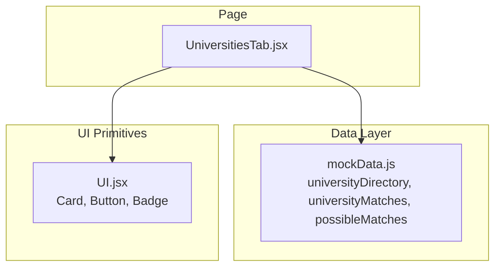
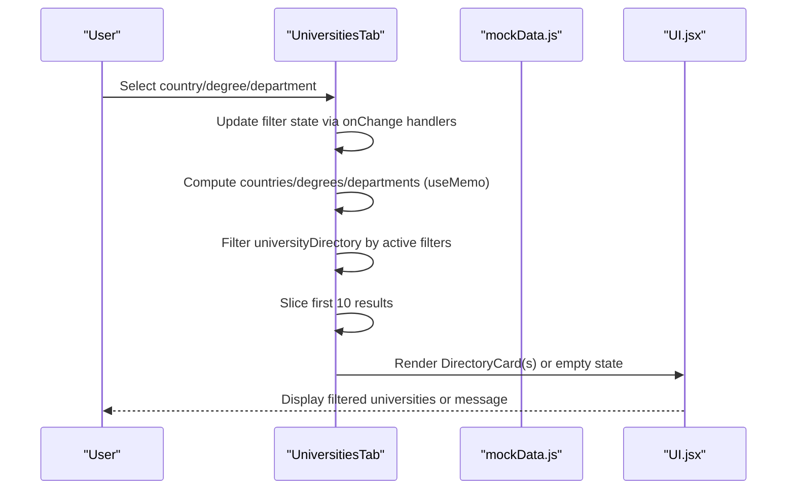
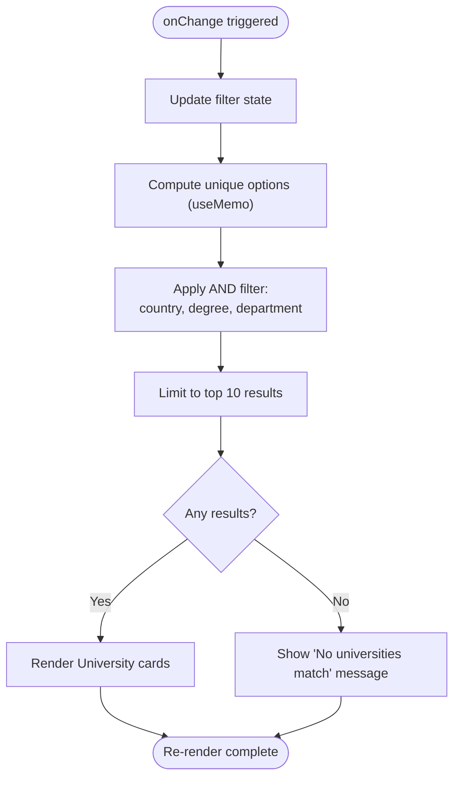
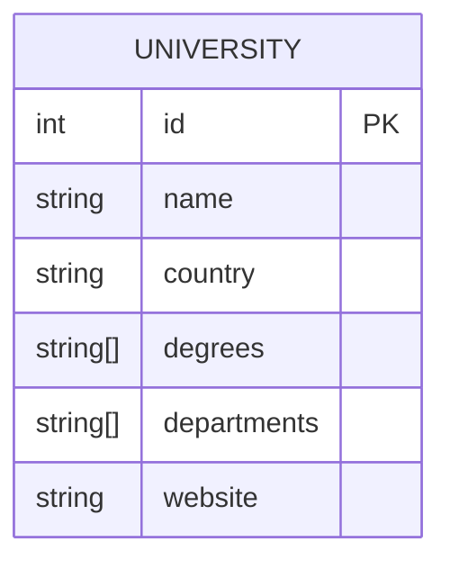
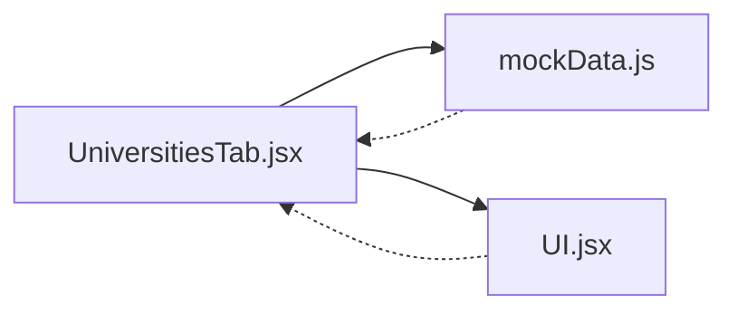

# Search Interface & Filtering

<cite>
**Referenced Files in This Document**
- [UniversitiesTab.jsx](file://scholarpath-frontend (2)/scholarpath/src/pages/UniversitiesTab.jsx)
- [mockData.js](file://scholarpath-frontend (2)/scholarpath/src/data/mockData.js)
- [UI.jsx](file://scholarpath-frontend (2)/scholarpath/src/components/UI.jsx)
</cite>

## Table of Contents
1. [Introduction](#introduction)
2. [Project Structure](#project-structure)
3. [Core Components](#core-components)
4. [Architecture Overview](#architecture-overview)
5. [Detailed Component Analysis](#detailed-component-analysis)
6. [Dependency Analysis](#dependency-analysis)
7. [Performance Considerations](#performance-considerations)
8. [Troubleshooting Guide](#troubleshooting-guide)
9. [Conclusion](#conclusion)

## Introduction
This document explains the university search interface and filtering system implemented in the Universities tab. It covers:
- Country, degree, and department filter dropdowns
- Real-time filtering logic using React state and memoized values for performance
- Filter combination algorithm that applies multiple criteria simultaneously
- Clear filters functionality to reset all states
- Examples of filter state management and event handling patterns
- Responsive design considerations for mobile devices
- Search result limiting mechanism (top 10 results)
- Empty state handling when no universities match the criteria

## Project Structure
The search interface is implemented as a single-page component that reads from a static data layer and renders filtered results with reusable UI primitives.

**Diagram sources**
- [UniversitiesTab.jsx:1-4](file://scholarpath-frontend (2)/scholarpath/src/pages/UniversitiesTab.jsx#L1-L4)
- [UniversitiesTab.jsx:73-162](file://scholarpath-frontend (2)/scholarpath/src/pages/UniversitiesTab.jsx#L73-L162)
- [mockData.js:119-133](file://scholarpath-frontend (2)/scholarpath/src/data/mockData.js#L119-L133)
- [UI.jsx:1-47](file://scholarpath-frontend (2)/scholarpath/src/components/UI.jsx#L1-L47)

**Section sources**
- [UniversitiesTab.jsx:1-4](file://scholarpath-frontend (2)/scholarpath/src/pages/UniversitiesTab.jsx#L1-L4)
- [UniversitiesTab.jsx:73-162](file://scholarpath-frontend (2)/scholarpath/src/pages/UniversitiesTab.jsx#L73-L162)
- [mockData.js:119-133](file://scholarpath-frontend (2)/scholarpath/src/data/mockData.js#L119-L133)
- [UI.jsx:1-47](file://scholarpath-frontend (2)/scholarpath/src/components/UI.jsx#L1-L47)

## Core Components
- UniversitiesTab: Main page component that manages filter state, computes options, filters results, and renders the directory, current matches, and possible matches sections.
- Data layer (mockData.js): Provides the university directory and related datasets used by the page.
- UI primitives (UI.jsx): Reusable Card, Button, and Badge components used to render results and actions.

Key responsibilities:
- Stateful filter controls for country, degree, and department
- Memoized computation of unique filter options
- Real-time filtering based on selected criteria
- Limiting displayed results to top 10
- Handling empty states and clear filters action

**Section sources**
- [UniversitiesTab.jsx:73-162](file://scholarpath-frontend (2)/scholarpath/src/pages/UniversitiesTab.jsx#L73-L162)
- [mockData.js:119-133](file://scholarpath-frontend (2)/scholarpath/src/data/mockData.js#L119-L133)
- [UI.jsx:1-47](file://scholarpath-frontend (2)/scholarpath/src/components/UI.jsx#L1-L47)

## Architecture Overview
The filtering flow is driven by React state changes in the UniversitiesTab component. When any filter changes, the component recomputes the filtered list and displays up to 10 results.

**Diagram sources**
- [UniversitiesTab.jsx:73-162](file://scholarpath-frontend (2)/scholarpath/src/pages/UniversitiesTab.jsx#L73-L162)
- [mockData.js:119-133](file://scholarpath-frontend (2)/scholarpath/src/data/mockData.js#L119-L133)
- [UI.jsx:1-47](file://scholarpath-frontend (2)/scholarpath/src/components/UI.jsx#L1-L47)

## Detailed Component Analysis

### Filter Dropdowns and Options
- Country dropdown: Populated from unique countries in the university directory.
- Degree dropdown: Populated from unique degrees across all universities.
- Department dropdown: Populated from unique departments across all universities.
- All dropdowns use controlled inputs bound to local state and update immediately on change.

Implementation highlights:
- Options are computed once per mount using useMemo to avoid repeated Set operations.
- Each select element has an “All” default option to represent no filter applied.

**Section sources**
- [UniversitiesTab.jsx:74-80](file://scholarpath-frontend (2)/scholarpath/src/pages/UniversitiesTab.jsx#L74-L80)
- [UniversitiesTab.jsx:100-112](file://scholarpath-frontend (2)/scholarpath/src/pages/UniversitiesTab.jsx#L100-L112)
- [mockData.js:119-133](file://scholarpath-frontend (2)/scholarpath/src/data/mockData.js#L119-L133)

### Real-Time Filtering Logic and Combination Algorithm
- The component maintains three pieces of state: country, degree, and department.
- On each state change, it filters the full university directory by applying all active filters simultaneously (AND logic).
- If a filter is empty, it is ignored; if set, only matching universities pass through.
- Results are sliced to show only the top 10 entries.

Filter combination behavior:
- Country must exactly match the selected value.
- Degree must be included in the university’s degrees array.
- Department must be included in the university’s departments array.

**Diagram sources**
- [UniversitiesTab.jsx:74-88](file://scholarpath-frontend (2)/scholarpath/src/pages/UniversitiesTab.jsx#L74-L88)
- [UniversitiesTab.jsx:123-131](file://scholarpath-frontend (2)/scholarpath/src/pages/UniversitiesTab.jsx#L123-L131)

**Section sources**
- [UniversitiesTab.jsx:74-88](file://scholarpath-frontend (2)/scholarpath/src/pages/UniversitiesTab.jsx#L74-L88)
- [UniversitiesTab.jsx:123-131](file://scholarpath-frontend (2)/scholarpath/src/pages/UniversitiesTab.jsx#L123-L131)

### Clear Filters Functionality
- A “Clear filters” button appears only when at least one filter is active.
- Clicking it resets all three filter states to their default empty values, effectively showing the unfiltered list again.

Behavior:
- Resets country, degree, and department to empty strings.
- Triggers re-computation of filtered results and re-renders.

**Section sources**
- [UniversitiesTab.jsx:113-120](file://scholarpath-frontend (2)/scholarpath/src/pages/UniversitiesTab.jsx#L113-L120)

### Search Result Limiting Mechanism
- After filtering, only the first 10 universities are displayed.
- This ensures consistent performance and predictable UI density.

Note:
- The limit is applied after filtering, so it reflects the most relevant subset of matched results.

**Section sources**
- [UniversitiesTab.jsx:82-88](file://scholarpath-frontend (2)/scholarpath/src/pages/UniversitiesTab.jsx#L82-L88)

### Empty State Handling
- When no universities match the active filters, a concise message informs the user that there are no results.
- This prevents confusion and guides users to adjust their filters.

**Section sources**
- [UniversitiesTab.jsx:123-131](file://scholarpath-frontend (2)/scholarpath/src/pages/UniversitiesTab.jsx#L123-L131)

### Event Handling Patterns
- Controlled inputs: Each select uses value bound to local state and onChange to update state.
- Conditional rendering: The clear button is conditionally rendered based on whether any filter is active.
- Minimal re-renders: Filtering and slicing occur during render; options are memoized to avoid unnecessary work.

Examples:
- onChange handlers directly call setState setters for each filter.
- Clear button handler calls multiple setState setters in one click.

**Section sources**
- [UniversitiesTab.jsx:100-120](file://scholarpath-frontend (2)/scholarpath/src/pages/UniversitiesTab.jsx#L100-L120)

### Responsive Design Considerations
- The filter bar uses a responsive flex layout that wraps on smaller screens.
- Results grid adapts to screen size using responsive Tailwind classes:
  - Single column on small screens
  - Two columns on medium screens
  - Three columns on large screens
- Cards and badges scale appropriately with typography and spacing utilities.

**Section sources**
- [UniversitiesTab.jsx:100-131](file://scholarpath-frontend (2)/scholarpath/src/pages/UniversitiesTab.jsx#L100-L131)

### Data Model and Relationships
The university directory provides the core dataset for filtering. Each entry includes identifiers, name, country, offered degrees, departments, and a website link.

**Diagram sources**
- [mockData.js:119-133](file://scholarpath-frontend (2)/scholarpath/src/data/mockData.js#L119-L133)

**Section sources**
- [mockData.js:119-133](file://scholarpath-frontend (2)/scholarpath/src/data/mockData.js#L119-L133)

## Dependency Analysis
- UniversitiesTab depends on:
  - mockData.js for the university directory and related lists
  - UI.jsx for Card, Button, and Badge components
- Filtering logic is self-contained within the component and does not rely on external services.

**Diagram sources**
- [UniversitiesTab.jsx:1-4](file://scholarpath-frontend (2)/scholarpath/src/pages/UniversitiesTab.jsx#L1-L4)
- [UniversitiesTab.jsx:73-162](file://scholarpath-frontend (2)/scholarpath/src/pages/UniversitiesTab.jsx#L73-L162)
- [mockData.js:119-133](file://scholarpath-frontend (2)/scholarpath/src/data/mockData.js#L119-L133)
- [UI.jsx:1-47](file://scholarpath-frontend (2)/scholarpath/src/components/UI.jsx#L1-L47)

**Section sources**
- [UniversitiesTab.jsx:1-4](file://scholarpath-frontend (2)/scholarpath/src/pages/UniversitiesTab.jsx#L1-L4)
- [UniversitiesTab.jsx:73-162](file://scholarpath-frontend (2)/scholarpath/src/pages/UniversitiesTab.jsx#L73-L162)
- [mockData.js:119-133](file://scholarpath-frontend (2)/scholarpath/src/data/mockData.js#L119-L133)
- [UI.jsx:1-47](file://scholarpath-frontend (2)/scholarpath/src/components/UI.jsx#L1-L47)

## Performance Considerations
- useMemo for filter options: Unique country, degree, and department lists are computed once per mount, avoiding repeated Set operations on every render.
- Lightweight filtering: Array.filter runs over a small dataset; slicing to top 10 keeps DOM updates minimal.
- Controlled inputs: Direct state updates ensure predictable behavior without extra layers.
- Potential optimizations:
  - Debounce rapid input changes if additional text-based search is added.
  - Virtualize long lists if the dataset grows significantly beyond the current size.
  - Extract filter logic into a custom hook for reuse and testability.

[No sources needed since this section provides general guidance]

## Troubleshooting Guide
Common issues and resolutions:
- No results shown:
  - Verify that at least one filter is correctly set and that the dataset contains matching entries.
  - Use the “Clear filters” button to reset and confirm baseline behavior.
- Dropdowns not updating:
  - Ensure the select elements are bound to state via value and onChange handlers.
- Performance degradation with larger datasets:
  - Consider memoizing more computations or implementing pagination/virtualization.

**Section sources**
- [UniversitiesTab.jsx:113-131](file://scholarpath-frontend (2)/scholarpath/src/pages/UniversitiesTab.jsx#L113-L131)

## Conclusion
The Universities tab provides a responsive, performant search experience with real-time filtering by country, degree, and department. It leverages React state and memoization to keep interactions snappy, limits results to the top 10 for consistency, and handles empty states gracefully. The clear filters feature offers quick recovery, and the modular UI components promote maintainability. Future enhancements could include debounced search, advanced sorting, and virtualized lists for scalability.