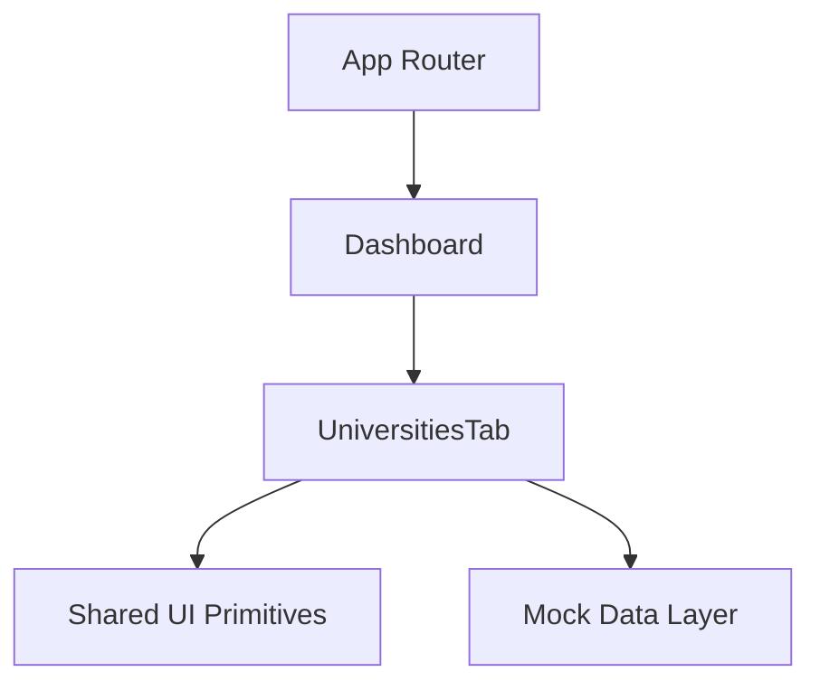
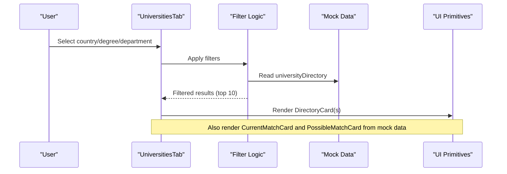
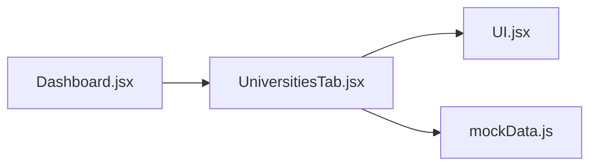

# Universities Search Tab

<cite>
**Referenced Files in This Document**
- [UniversitiesTab.jsx](file://scholarpath-frontend (2)\scholarpath\src\pages\UniversitiesTab.jsx)
- [mockData.js](file://scholarpath-frontend (2)\scholarpath\src\data\mockData.js)
- [UI.jsx](file://scholarpath-frontend (2)\scholarpath\src\components\UI.jsx)
- [Dashboard.jsx](file://scholarpath-frontend (2)\scholarpath\src\pages\Dashboard.jsx)
</cite>

## Table of Contents
1. [Introduction](#introduction)
2. [Project Structure](#project-structure)
3. [Core Components](#core-components)
4. [Architecture Overview](#architecture-overview)
5. [Detailed Component Analysis](#detailed-component-analysis)
6. [Dependency Analysis](#dependency-analysis)
7. [Performance Considerations](#performance-considerations)
8. [Troubleshooting Guide](#troubleshooting-guide)
9. [Conclusion](#conclusion)
10. [Appendices](#appendices)

## Introduction
This document explains the UniversitiesTab component, which provides university discovery and search within the ScholarPath application. It covers:
- Country-based search interface with degree and department filters
- Program filtering system for browsing the university directory
- University detail views via cards that link to official portals
- Matching sections showing current matches and possible matches
- Responsive grid layout for displaying university cards
- Loading states and error handling considerations
- Examples of data structures and user interaction patterns

The goal is to help both technical and non-technical users understand how the feature works and how to extend it.

## Project Structure
The UniversitiesTab is a React page rendered inside the Dashboard tabbed interface. It uses shared UI primitives and static mock data for demonstration purposes.

**Diagram sources**
- [Dashboard.jsx:128-180](file://scholarpath-frontend (2)\scholarpath\src\pages\Dashboard.jsx#L128-L180)
- [UniversitiesTab.jsx:73-162](file://scholarpath-frontend (2)\scholarpath\src\pages\UniversitiesTab.jsx#L73-L162)
- [UI.jsx:1-47](file://scholarpath-frontend (2)\scholarpath\src\components\UI.jsx#L1-L47)
- [mockData.js:15-133](file://scholarpath-frontend (2)\scholarpath\src\data\mockData.js#L15-L133)

**Section sources**
- [Dashboard.jsx:128-180](file://scholarpath-frontend (2)\scholarpath\src\pages\Dashboard.jsx#L128-L180)
- [UniversitiesTab.jsx:73-162](file://scholarpath-frontend (2)\scholarpath\src\pages\UniversitiesTab.jsx#L73-L162)

## Core Components
- UniversitiesTab: Main container providing search filters, directory results, current matches, and possible matches.
- DirectoryCard: Displays a university’s name, country, degrees, departments, and a link to its official portal.
- CurrentMatchCard: Shows a matched university with a fit percentage and a link to the website.
- PossibleMatchCard: Shows universities that can be unlocked with specific improvements, including missing requirements.
- Shared UI primitives: Card, Button, Badge used across components.

Key responsibilities:
- Filter the university directory by country, degree, and department
- Render top results in a responsive grid
- Present matching insights and actionable improvement steps

**Section sources**
- [UniversitiesTab.jsx:8-71](file://scholarpath-frontend (2)\scholarpath\src\pages\UniversitiesTab.jsx#L8-L71)
- [UI.jsx:1-47](file://scholarpath-frontend (2)\scholarpath\src\components\UI.jsx#L1-L47)

## Architecture Overview
The UniversitiesTab integrates three layers:
- Presentation layer: React components render the UI and handle user interactions
- Filtering logic: In-memory filtering based on selected filters
- Data layer: Static mock data representing universities, matches, and possible matches

**Diagram sources**
- [UniversitiesTab.jsx:73-162](file://scholarpath-frontend (2)\scholarpath\src\pages\UniversitiesTab.jsx#L73-L162)
- [mockData.js:44-133](file://scholarpath-frontend (2)\scholarpath\src\data\mockData.js#L44-L133)
- [UI.jsx:1-47](file://scholarpath-frontend (2)\scholarpath\src\components\UI.jsx#L1-L47)

## Detailed Component Analysis

### UniversitiesTab
Responsibilities:
- Manage filter state (country, degree, department)
- Compute unique options for dropdowns using memoization
- Filter the university directory and limit to top 10 results
- Render three sections:
  - University directory with filters and results grid
  - Current matches with fit percentages
  - Possible matches with improvement suggestions

Search algorithm:
- Exact match on country if selected
- Array inclusion check for degree if selected
- Array inclusion check for department if selected
- Results are sliced to show only the first 10 entries

Responsive layout:
- Grid adapts from single column to multiple columns based on screen size
- Cards wrap gracefully with consistent spacing

Loading states:
- Not implemented; results are immediate due to in-memory filtering
- Recommendation: add loading indicators when integrating with async data sources

Error handling:
- No explicit error handling; empty results display a friendly message
- Recommendation: add error boundaries and network error handling when connecting to APIs

User interaction patterns:
- Dropdown selections update filters instantly
- Clear filters button resets all selections
- Links open university websites in new tabs

**Section sources**
- [UniversitiesTab.jsx:73-162](file://scholarpath-frontend (2)\scholarpath\src\pages\UniversitiesTab.jsx#L73-L162)

### DirectoryCard
Displays:
- University name and country
- Available degrees as badges
- Departments listed inline
- Link to official university portal

Accessibility and UX:
- Uses shared Card and Button components for consistency
- External links use target and rel attributes for security

**Section sources**
- [UniversitiesTab.jsx:53-71](file://scholarpath-frontend (2)\scholarpath\src\pages\UniversitiesTab.jsx#L53-L71)

### CurrentMatchCard
Displays:
- University name, program, and country
- Fit percentage bar and label
- Link to university website

Purpose:
- Show universities where the student currently has a strong match

**Section sources**
- [UniversitiesTab.jsx:8-25](file://scholarpath-frontend (2)\scholarpath\src\pages\UniversitiesTab.jsx#L8-L25)

### PossibleMatchCard
Displays:
- University name, program, and country
- Fit percentage labeled as “match right now”
- List of missing requirements to improve match

Purpose:
- Provide actionable guidance to unlock higher-fit universities

**Section sources**
- [UniversitiesTab.jsx:27-51](file://scholarpath-frontend (2)\scholarpath\src\pages\UniversitiesTab.jsx#L27-L51)

### UI Primitives
- Card: Container with border, rounded corners, and shadow
- Button: Primary, secondary, ghost variants with hover states
- Badge: Colored labels for degrees and match status

These ensure visual consistency across the app.

**Section sources**
- [UI.jsx:1-47](file://scholarpath-frontend (2)\scholarpath\src\components\UI.jsx#L1-L47)

## Dependency Analysis
- UniversitiesTab depends on:
  - Shared UI components (Card, Button, Badge)
  - Mock data exports (universityDirectory, universityMatches, possibleMatches)
- Dashboard renders UniversitiesTab as one of several tabs
- Mock data centralizes static content for easy replacement with API calls later

**Diagram sources**
- [UniversitiesTab.jsx:1-4](file://scholarpath-frontend (2)\scholarpath\src\pages\UniversitiesTab.jsx#L1-L4)
- [Dashboard.jsx:1-11](file://scholarpath-frontend (2)\scholarpath\src\pages\Dashboard.jsx#L1-L11)
- [UI.jsx:1-47](file://scholarpath-frontend (2)\scholarpath\src\components\UI.jsx#L1-L47)
- [mockData.js:15-133](file://scholarpath-frontend (2)\scholarpath\src\data\mockData.js#L15-L133)

**Section sources**
- [UniversitiesTab.jsx:1-4](file://scholarpath-frontend (2)\scholarpath\src\pages\UniversitiesTab.jsx#L1-L4)
- [Dashboard.jsx:1-11](file://scholarpath-frontend (2)\scholarpath\src\pages\Dashboard.jsx#L1-L11)

## Performance Considerations
- Memoization: Unique filter options are computed once per mount using memoization to avoid unnecessary recalculations
- Filtering: In-memory array filtering is efficient for small datasets; consider pagination or virtualization for large directories
- Rendering: Limiting results to top 10 reduces DOM size and improves initial render performance
- Recommendations:
  - Add pagination or infinite scroll for scalability
  - Debounce filter inputs if switching to text-based search
  - Introduce caching strategies when moving to API-backed data

[No sources needed since this section provides general guidance]

## Troubleshooting Guide
Common issues and resolutions:
- No results after filtering:
  - Verify filter selections; use the clear filters button to reset
  - Check that the mock data contains entries matching the selected criteria
- Links not opening:
  - Ensure external links have proper attributes for security and behavior
- UI inconsistencies:
  - Confirm shared UI components are imported and styled correctly
- Extending functionality:
  - Replace mock data with API responses while maintaining the same shape
  - Add loading states and error boundaries for robustness

**Section sources**
- [UniversitiesTab.jsx:100-131](file://scholarpath-frontend (2)\scholarpath\src\pages\UniversitiesTab.jsx#L100-L131)

## Conclusion
The UniversitiesTab provides an intuitive, filterable university directory alongside personalized matching insights. Its modular design, shared UI components, and centralized data layer make it straightforward to extend with real data, additional filters, and enhanced user experiences such as saved favorites and detailed university pages.

[No sources needed since this section summarizes without analyzing specific files]

## Appendices

### Data Structures
University directory entry fields:
- id: unique identifier
- name: university name
- country: country location
- degrees: array of offered degree levels
- departments: array of departments
- website: official portal URL

Current match entry fields:
- id: unique identifier
- name: university name
- country: country location
- fit: integer percentage indicating match strength
- program: program name
- website: university website URL

Possible match entry fields:
- id: unique identifier
- name: university name
- country: country location
- fit: integer percentage indicating current match strength
- program: program name
- website: university website URL
- missing: array of strings describing required improvements

**Section sources**
- [mockData.js:44-133](file://scholarpath-frontend (2)\scholarpath\src\data\mockData.js#L44-L133)

### Search Query Parameters
- country: exact match against university country
- degree: inclusion check against university degrees array
- department: inclusion check against university departments array

Behavior:
- Empty selections act as wildcards
- Multiple filters combine with AND logic
- Results limited to top 10 for display

**Section sources**
- [UniversitiesTab.jsx:73-88](file://scholarpath-frontend (2)\scholarpath\src\pages\UniversitiesTab.jsx#L73-L88)

### User Interaction Patterns
- Select filters to refine results
- Clear filters to reset selections
- Click “Official university portal” to visit the university site
- Review current and possible matches to understand fit and next steps

**Section sources**
- [UniversitiesTab.jsx:100-159](file://scholarpath-frontend (2)\scholarpath\src\pages\UniversitiesTab.jsx#L100-L159)

### Comparison Features and Saved Favorites
- Comparison features:
  - Not implemented in the current codebase
  - Recommendation: add checkboxes to select multiple universities and a comparison view highlighting differences (e.g., degrees, departments, fit)
- Saved favorites:
  - Not implemented in the current codebase
  - Recommendation: persist selected universities in local storage or user profile and provide a dedicated favorites list

[No sources needed since this section proposes enhancements not present in the code]